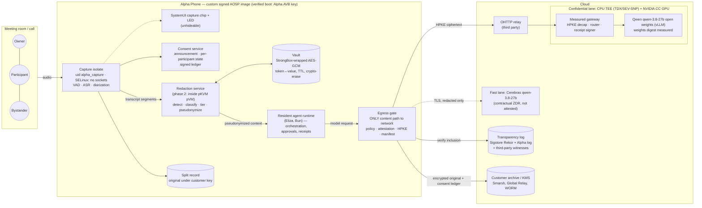
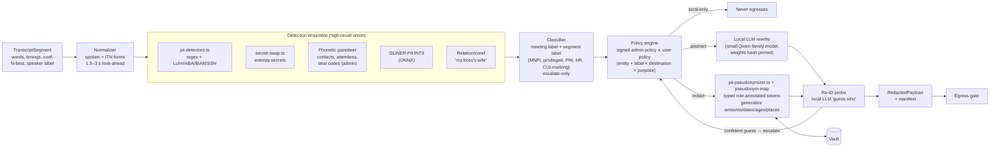
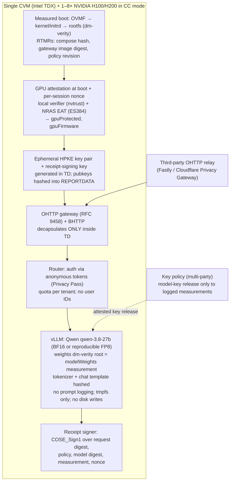

# 15 — Open-gap technical plan: confidential capture, redaction, consent and verifiable cloud processing

> Runtime source update: the local patch series has been migrated into reviewed upstream commits. AlphaPhone now consumes the immutable revision in `upstream.lock.json`; see [architecture and source ownership](../architecture.md). Patch filenames and line numbers below describe historical evidence retained in Git history, not files to apply to the current checkout. Implement further shared runtime changes through upstream PRs and update the reviewed pin.

This is a plan, not acceptance evidence: nothing in it is built or proves that a capability exists. Capability statements about Alpha today come from repository documents; every external fact has a URL. **(est.)** marks an estimate or model; **(unverified)** marks a figure not confirmed against a primary source.

It builds on [REPORT.md](REPORT.md) and sections [01](01-transcription-competitors.md), [03](03-secure-phones-confidential-ai.md), [04](04-redaction.md), [05](05-regulation-compliance.md), [09](09-distribution-partners-economics.md), [10](10-always-on-tech-feasibility.md) and [11](11-fit-gtm-risks.md). It also draws on [`docs/enclave-candidate-validation.md`](../enclave-candidate-validation.md), [`docs/architecture.md`](../architecture.md), [`docs/on-device-agent-plan.md`](../on-device-agent-plan.md), [`docs/agent-integration.md`](../agent-integration.md) and [`docs/standalone-paired-asr.md`](../standalone-paired-asr.md).

## 0. Product decisions this plan implements

| # | Decision | Consequence for this plan |
| --- | --- | --- |
| D1 | **Fork AOSP**: a custom signed image. Banking apps, Play Integrity and GMS are **not** needed | Capture, isolation, the indicator and the egress gate can be **platform-enforced** with privileged permissions, SELinux and per-UID network rules, instead of relying on app-level discipline. Google's on-device stack (AICore, Gemini Nano, ML Kit GenAI, Play-services LiteRT) is out of scope, so every runtime ships statically in the image. This reverses REPORT §8's "stock first" recommendation for this product line, and the NIAP/DISA and Intune-AOSP-list consequences in [09](09-distribution-partners-economics.md) are accepted. |
| D2 | **The model stays Qwen: `qwen-3.8-27b` on Cerebras** | The Cerebras provider discovery returned `qwen-3.8-27b` ([agent-integration.md](../agent-integration.md) line 74), and the enclave candidate selected it ([enclave-candidate-validation.md](../enclave-candidate-validation.md)). Qwen's origin (Alibaba, PRC) is a buyer question raised in [05 §7.7](05-regulation-compliance.md) and [06](06-vertical-markets.md). This plan answers it **for Qwen**, with four controls (§7.8): (1) self-host the open weights on confidential GPUs inside the trust boundary; (2) redact before egress; (3) attest provenance and the weights hash; (4) give buyers documented answers. **The same Qwen weights run on Cerebras and on confidential GPUs.** That makes "Cerebras fast lane" and "attested confidential lane" a choice of route, not a choice of model. |
| D3 | **Fix the confidentiality claim so it is accurate** | §9 is a claims ladder that ties every sentence to the evidence that earns it. |
| D4 | **Build the open-gap product**: on-device transcription, pre-egress redaction, built-in consent, verifiable cloud processing | §§2–8 cover the four pillars and one integration contract. |

**Architecture context.** On 2026-10-01 the primary agent moved **onto the Android device** and Nitro/TEE hosting was dropped ([architecture.md](../architecture.md), [on-device-agent-plan.md](../on-device-agent-plan.md)). Orchestration, state, approvals and receipts are now local. The **only** routine cloud plaintext path is model inference, plus any connector the user approves. In the target architecture, the "measured agent" the phone attests to in the cloud is therefore a **measured inference gateway**: a router plus the model server, in a CPU+GPU TEE. An optional **remote executor**, for loops that run while the phone is off, would be a second measured workload with its own acceptance. The Nitro enclaves a–d are historical and stay untouched. They are not part of any claim below.

## 1. Executive summary

1. **The gap is real, and it is an integration gap, not a research gap.** Each piece exists somewhere:
   - On-device ASR at near-cloud accuracy: Parakeet TDT 0.6B, 6.05% average WER ([10](10-always-on-tech-feasibility.md)).
   - Typed pseudonymization with a device vault ([04](04-redaction.md)), whose detectors already exist in the pinned upstream.
   - OS-level consent prompts: Apple's spoken "This call will be recorded" ([Slate](https://slate.com/technology/2024/10/apple-iphone-phone-call-recording-law-consent.html)), Teams' mute-until-consent ([Microsoft Learn](https://learn.microsoft.com/en-us/microsoftteams/conferencing-recording-consent)).
   - PCC-style verifiable inference on commodity confidential GPUs: Tinfoil, Privatemode, OpenPCC, Phala dstack.

   No shipping product composes all four behind **one egress gate** with a per-request receipt. That composition is the product.
2. **Platform enforcement is the payoff of forking AOSP.** The capture isolate holds the microphone but has **no network capability**, enforced by SELinux plus a per-UID netd rule. The redaction service is the only producer of egress payloads, and the **egress gate** is the only content path to the network. The indicator lives in SystemUI and cannot be hidden by apps. A launcher app could only ask for these properties; the image makes them true.
3. **The on-device stack:**
   - Silero VAD runs always on.
   - Moonshine or streaming Zipformer gives live captions and commands.
   - **Parakeet TDT 0.6B v3 INT8** produces final transcripts. On Android its reported RTF is about 0.12 ([Soniqo](https://soniqo.audio/guides/parakeet/android)).
   - Sortformer plus pyannote community-1 handle anonymous diarization.
   - The runtime is sherpa-onnx/ONNX Runtime, with LiteRT-QNN on Snapdragon.

   The current paired-host whisper `tiny.en` path is retired from the product build.
4. **Redaction design:**
   - A high-recall ensemble: checksums and regex, a phonetic gazetteer, GLiNER-PII, relation/coreference, and an N-best lattice.
   - Typed, role-annotated pseudonyms; generalized quasi-identifiers; a **StrongBox/Keystore-wrapped vault**; local rehydration.
   - **Four tiers:** local-only, abstract-then-send, redact-then-send, send-redacted.
   - Fail closed on uncertainty.
   - The headline metric is **egress leak rate on an ASR-noised spoken-meeting eval set**, not NER F1.
5. **Consent is a state machine, not a banner:**
   - An unhideable indicator and a spoken announcement, recorded so it counts as an "announcement" under Washington law ([RCW 9.73.030](https://app.leg.wa.gov/rcw/default.aspx?cite=9.73.030)).
   - Per-participant capture: verbal, tap, QR guest page or calendar pre-notice.
   - "Stop / off the record" with buffer purge.
   - Bystander exclusion and an all-party default everywhere.
   - Jurisdiction packs.
   - A **hash-chained, device-signed consent ledger** exported with the record.
6. **Verifiable cloud processing comes in two clearly labelled routes for the same model:**
   - **Fast lane** (interim and default today): **redacted-only** payloads to Cerebras `qwen-3.8-27b`. Protection is contractual: Cerebras states zero retention and US-only datacenters ([Cerebras privacy](https://www.cerebras.ai/privacy-policy), [Trust Center](https://trust.cerebras.ai/)). Cerebras has no public attestation offering, so the weights Cerebras serves cannot be hash-verified by the phone.
   - **Confidential lane** (target): **Alpha self-hosts the Qwen open weights** on confidential H100/H200 GPUs. The phone verifies CPU-TEE plus NVIDIA GPU attestation, **including the Qwen weights-hash measurement**, checks it against a public transparency log, and **HPKE-encrypts to a key bound inside the attestation**. Requests travel through a third-party OHTTP relay ([RFC 9458](https://www.rfc-editor.org/rfc/rfc9458.html)). Each request returns a signed receipt naming the weights digest.
7. **Bring the Qwen weights to a confidential platform; do not wait for a per-token vendor.** No managed confidential per-token API lists `qwen-3.8-27b`. Privatemode's public model list carries only a Qwen embedding model ([Privatemode models](https://www.privatemode.ai/models)). The plan therefore runs **Alpha's own pinned Qwen container**:
   - **M4 (managed CVM):** Tinfoil Containers ([Tinfoil pricing summary](https://aisotools.com/pricing/tinfoil); GPU quoted on request) or Phala dstack TDX plus H200 at $3.20–$4.80 per GPU-hour ([Phala](https://phala.com/pricing)).
   - **M5 (Alpha's own gateway):** Phala, plus GCP a3-highgpu-1g with TDX ([GCP release notes](https://docs.cloud.google.com/confidential-computing/confidential-vm/docs/release-notes)) or Azure NCC40ads H100 v5 at $8.90/h ([Vantage](https://instances.vantage.sh/azure/vm/ncc40adsh100-v5)) for customers that require them.

   The pinned upstream already has most of the gateway-side attestation code, including a `modelWeights` measurement (§2, §7.2).
8. **Costs (est.):**
   - Cerebras `qwen-3.8-27b` at the [09](09-distribution-partners-economics.md) list price costs about **$13.22 per typical user per month**.
   - Self-hosted Qwen 27B on a confidential H200 (Phala reserved) is about **$11.7 per user at about 200 users per GPU**. That reaches parity at about **400 active users**, below which the about-$5k/month HA floor dominates.
   - Azure confidential H100 costs about $46 per user.

   **The dense-27B throughput figure is an estimate and must be measured in M5.** Confidential GPUs also add **13–28% latency/throughput overhead** ([arXiv 2607.19353](https://arxiv.org/abs/2607.19353), [arXiv 2606.23969](https://arxiv.org/abs/2606.23969)). They are far slower per user than Cerebras, so background jobs such as summaries and filing are the natural first workload for the confidential lane.
9. **Honest limits.** Attestation proves which code booted, not that it is correct. DDR5 interposer attacks (TEE.fail, DDRop) forge attestation on TDX and SEV-SNP and, through them, NVIDIA CC ([tee.fail](https://tee.fail/), [DDRop](https://ddropattack.eu/)). Vendors call physical attacks out of scope. The design therefore keeps **redaction in front of every route**, so that even a broken TEE yields pseudonymized text. The claims ladder says so explicitly.

   **Qwen's origin is answered, not hidden** (§7.8):
   - Alpha self-hosts the weights, so Alibaba is never a data recipient.
   - Pre-egress redaction applies on every lane.
   - A model BOM, with independent re-hashes, records provenance.
   - The weights, tokenizer and template hash is attested and checked by the phone.
   - The model has no egress or autonomous tools.
   - Admission tests are published per release.

   The residual limit is stated plainly: testing cannot prove the absence of a backdoor, and some defense and IC buyers may exclude PRC-origin models on policy.
10. **Timeline (est.):** about 11–13 FTE and nine months to the L5 claim: "independently verifiable confidential processing, audited." Each rung of the claims ladder has a dated milestone and a named class of acceptance evidence (physical device, AOSP image boot, live integration). These are kept distinct, as the repo's AGENTS.md requires.

## 2. Baseline: what exists today (repo evidence, 2026-10-02)

| Area | State | Source |
| --- | --- | --- |
| Agent execution | Android-resident runtime selected on 2026-10-01; browser/dev path implemented; **APK/device execution, lifecycle and physical acceptance open** | [on-device-agent-plan.md](../on-device-agent-plan.md) |
| Hosted model | Cerebras `qwen-3.8-27b`, direct (`ELIZAOS_CLOUD_USE_INFERENCE=false` in the enclave candidate); real replies verified on the local host ([11 §2.2](11-fit-gtm-risks.md)) | [enclave-candidate-validation.md](../enclave-candidate-validation.md), [agent-integration.md](../agent-integration.md) |
| Speech | Paired-host whisper.cpp `tiny.en`, explicit upload, synthetic audio ingress only; on-device sherpa-onnx **partial** (packaged-app fixture failed "lazy"→"lady"); **no physical-microphone acceptance**; no word timings on the paired route | [standalone-paired-asr.md](../standalone-paired-asr.md), [11 §2.3](11-fit-gtm-risks.md) |
| Redaction | Upstream `vendor/eliza/packages/core/src/security/` has `pii-detectors.ts` (validated regex and checksum detectors), `pii-pseudonymizer.ts`, `pii-pseudonym-map.ts` (one pseudonym per real person across aliases), `secret-swap.ts`, `entity-recognizer.ts`, `outbound-envelope-guard.ts`, and `pii-scrub-seam.ts` (a `PII_SCRUB` model type with an on-device GGUF lane). `packages/agent/src/services/audio-redaction-service.ts` maps detections to timed words and **re-transcribes to verify**, failing closed. **None of this is wired into Alpha.** | source inspection |
| Confidential inference (upstream) | `packages/core/src/security/confidential-inference.ts`: a host-owned `ConfidentialInferenceAuthority` with route policy, expiry, exact handler identity, a **durable audit sink that must commit before dispatch**, and a verified pre-send transport callback carrying `evidenceDigest` and `connectionBindingDigest`. `packages/agent/src/services/tee-attested-inference.ts`: one fresh TLS connection per attempt; a quote transcript bound to the actual socket; **no pooling, redirects, retries or plaintext fallback**; dstack verification. `tee-evidence.ts`/`tee-policy.ts`: a canonical `TeeEvidence` (kinds include `tdx`, `sev-snp`, `nitro`, `dstack`; claims include `gpuProtected`, `npuProtected`; measurements include `modelWeights`, `gpuFirmware`) and one fail-closed policy evaluator. `tee-dstack-evidence.ts`: a pinned `dstack-verifier` executable and config by SHA-256. | source inspection |
| Patch series | `patches/eliza/0036-qualified-ab8f9a-runtime.patch` adds `tee-gpu-nvidia.ts` (NRAS `/v4/attest/gpu`, ES384 EAT verification, a pinned NRAS intermediate, `eat_nonce` binding), `tee-gpu-evidence.ts` (GPU claims survive only when branded by the verifier for the same nonce), `tee-tdx-quote.ts` (in-repo TDX v4/v5 quote parser and self-signature check, rejecting the debug bit), and the `tdx-cpu` "private inference" topology. That topology requires a dstack-TDX-only policy, `debugDisabled`, and the `app`/`compose`/`os` measurements. **The patch exists. Its presence in a shipped Alpha runtime is not established here.** | `patches/eliza/0036…patch` lines 11598–14440 |
| On-device isolation (upstream) | `AndroidVirtualizationBridge.java`: a reflection-only AVF/Microdroid probe; needs `MANAGE_VIRTUAL_MACHINE` on a privileged build | source inspection |
| Consent | Narrow: owner-bound explicit upload, sensitive-screen send blocking, a voice-session consent nonce on the Cloud path. **No meeting-consent features.** | [agent-integration.md](../agent-integration.md), [11 §2.2](11-fit-gtm-risks.md) |
| UI claims | `prototype/native-adapter.ts` already replaces "Sealed/Attested" fixture copy with **Not verified** | [agent-integration.md](../agent-integration.md) line 558 |
| AOSP | Non-privileged vendor add-on generated; **no full image build or boot** | [11 §2.1](11-fit-gtm-risks.md) |

**Implication.** About 60% of the confidential-inference *gateway* logic and 50% of the *redaction* logic exist upstream as tested source. The work is mostly productization, platform enforcement, verifier porting to Android, transparency infrastructure, and evaluation. Fundamental invention is not the bottleneck.

## 3. System architecture

### 3.1 Context diagram



### 3.2 Invariants that the image enforces

| # | Invariant | Mechanism (AOSP fork) | Test that proves it |
| --- | --- | --- | --- |
| I1 | No audio or raw transcript reaches a network socket | The capture isolate runs as a dedicated UID without `INTERNET`. The SELinux domain is denied `socket`/`tcp_socket`/`udp_socket` create. netd per-UID deny applies too. CTS-style negative test. | Device test: the isolate tries `socket()` and gets EACCES; `tcpdump` on device shows zero packets from the UID |
| I2 | Every content-bearing network payload passes the egress gate | The agent runtime and connectors get network only to the loopback/binder gate. A netd per-UID allowlist leaves only the gate UID able to reach model endpoints. Connector traffic routes through the gate with `purpose=approved-action`. | Packet capture plus a gate audit-log reconciliation: the count of model-endpoint flows equals the count of gate manifests |
| I3 | The microphone cannot be live without the indicator | The capture chip is drawn by SystemUI from AudioRecord/AppOps state, not by the app. The LED is driven by the capture HAL hook. | Device test: capture starts without the chip, so an assertion fails; screen-off capture shows the LED |
| I4 | No recording without a consent state of at least `NOTICED` | The capture isolate refuses to persist segments while the consent service state is `NONE`. Audio stays in a RAM ring buffer of 30 s or less (est.) for VAD, and the buffer is zeroized. | Unit plus device test: no announcement means no persisted segments |
| I5 | Only redacted payloads go to non-attested destinations | Gate route policy: the `cerebras` route accepts only `RedactedPayload` objects carrying a manifest digest. A raw `string` type is not accepted. | Fuzz test: canary values in raw transcripts never appear in the Cerebras-route egress capture |
| I6 | Confidential-lane plaintext exists only inside an attested, logged measurement | The phone verifies quote, GPU evidence and log inclusion, then HPKE-seals to the key in `report_data`. There is no plaintext fallback. | Negative tests: wrong measurement, missing log entry, stale nonce, debug TD, and GPU CC off are each refused before any send |

## 4. Pillar 1: on-device transcription

### 4.1 Model stack (licence-clean, open weights)

| Function | Primary | Fallback / upgrade | Licence | Evidence |
| --- | --- | --- | --- | --- |
| Voice activity | Silero VAD (about 2 MB, under 1 ms per 30 ms chunk) | — | MIT | [10 §2.3](10-always-on-tech-feasibility.md) |
| Live captions, commands, wake | Moonshine (Tiny/Base, 27M/61M) or sherpa-onnx streaming Zipformer | — | MIT / Apache-2.0 | [Moonshine](https://arxiv.org/abs/2410.15608) |
| Final transcript | **Parakeet TDT 0.6B v3 INT8** (25 European languages, word timestamps); v2 for English-only quality | Argmax Pro SDK for Android ($1.00–1.33 per device per month) as a buy option; Canary 1B for high-accuracy re-pass | CC-BY-4.0 | [v3 card](https://huggingface.co/nvidia/parakeet-tdt-0.6b-v3); Android INT8 RTF about 0.12 reported ([Soniqo](https://soniqo.audio/guides/parakeet/android)) |
| Diarization | Streaming Sortformer 4spk v2 (live, 4 speakers or fewer) plus a pyannote community-1 post-pass | pyannoteAI precision-2 (licensed) | CC-BY-4.0 | [10 §3.1](10-always-on-tech-feasibility.md) |
| Contextual biasing | Gazetteer from contacts, calendar attendees and admin deal code names, fed to the decoder | — | — | [04 C.2](04-redaction.md) |
| Owner voice (opt-in) | ECAPA-class embedding, owner only, with a written BIPA-grade release, stored in StrongBox-wrapped storage, never uploaded | — | — | [05 §2](05-regulation-compliance.md) |

The paired-host whisper `tiny.en` route stays as a **development-only** capability. It is excluded from release builds by a build flag and a CI check, because it uploads audio, which breaks I1.

### 4.2 Runtime and AOSP integration

- **Runtime:**
  - sherpa-onnx with ONNX Runtime, statically linked into `/system_ext/lib64`, with no Play-services dependency (D1).
  - On Snapdragon targets, add the LiteRT QNN accelerator. Google reports up to 100× over CPU, and 64 of 72 models fully delegated to the NPU ([Google Developers Blog](https://developers.googleblog.com/en/unlocking-peak-performance-on-qualcomm-npu-with-litert/)).
  - On Tensor, the LiteRT NPU is AOT-only ([LiteRT NPU](https://developers.google.com/edge/litert/next/npu)), so plan for CPU/GPU first.
- **Privileged capture:**
  - The `AlphaCaptureService` is a platform-signed `priv-app` holding `CAPTURE_AUDIO_HOTWORD`, `MANAGE_SOUND_TRIGGER` and `RECORD_AUDIO`.
  - It is registered as the default `VoiceInteractionService` (the assistant role), so FGS background-start limits do not block it ([FGS restrictions](https://developer.android.com/develop/background-work/services/fgs/restrictions-bg-start)).
  - Low-power arming uses a DSP keyphrase through the Sound Trigger HAL, following the Now Playing pattern of under 1% of daily battery ([arXiv 1711.10958](https://arxiv.org/abs/1711.10958)).
- **Process model:**
  - The capture isolate holds the AudioRecord session, VAD and ASR. It writes only to the redaction service over a binder interface that carries `TranscriptSegment`, never PCM. The one exception is audio redaction, which uses a separate path.
  - Raw PCM persists only when the tenant retention policy requires an audio original (split record). In that case it goes **encrypted under the customer archive key** straight to the archive spool.
- **Isolation, phase 2:**
  - Move the redaction service, and optionally the ASR, into a **pKVM protected VM (Microdroid)**.
  - pVMs are mutually distrusted from Android: a compromised host cannot read pVM memory ([AVF security](https://source.android.com/docs/core/virtualization/security)).
  - In-VM ML is CPU-only unless the SoC supports device assignment. AVF supports platform-device assignment through vfio-platform plus a pvmfw-validated DTBO ([device assignment](https://android.googlesource.com/platform/packages/modules/Virtualization/+/refs/heads/android17-release/docs/device_assignment.md)).
  - Tensor TPU assignment to app-launched pVMs is an open question upstream ([LiteRT issue #10081](https://github.com/google-ai-edge/LiteRT/issues/10081)).
  - Plan: ASR stays in the isolate process on CPU/GPU/NPU. Redaction (GLiNER INT8, regex, gazetteer, vault ops) runs in the pVM on CPU, which fits the small compute budget in [04 C.4](04-redaction.md). Only `RedactedPayload` and vault-handle references leave the pVM.
- **Device hardware choice (risk).**
  - Since Android 16, Google no longer publishes Pixel device trees or driver binaries to AOSP, and Pixel kernel source now needs a manual request form ([Android Authority](https://www.androidauthority.com/google-pixel-kernel-code-forms-3696441/), [Open Source For You, Aug 2026](https://www.opensourceforu.com/2026/08/google-makes-pixel-kernel-source-harder-to-access/)).
  - AOSP source drops are now twice a year, in Q2 and Q4 ([AVF overview](https://source.android.com/docs/core/virtualization)).
  - Pixel is still feasible as a **development target**, as GrapheneOS shows, but it is costly to maintain.
  - **Decision gate at M6:** a Snapdragon ODM with a full BSP and QNN access, versus continuing Pixel 10/11 with reverse-engineered vendor configuration.
- **Verified boot and device attestation:**
  - Ship with Alpha's AVB key using the user-settable root of trust (`avb_custom_key`). This gives a **yellow** boot state that key attestation reports in `verifiedBootState` along with the boot-key hash ([AOSP boot flow](https://source.android.com/docs/security/features/verifiedboot/boot-flow), [device state](https://source.android.com/docs/security/features/verifiedboot/device-state)).
  - Enterprises, and the confidential gateway, can then verify that a phone runs a **genuine Alpha image** with the consent and egress invariants. This is the GrapheneOS Auditor pattern ([Auditor](https://github.com/GrapheneOS/Auditor/releases/tag/85)) and is a sellable admin feature.

### 4.3 Power and latency budget (est.; replace with measurements in M1)

| Mode | Budget (est.) | Source of estimate |
| --- | --- | --- |
| DSP arming only | ~0.5–1% of battery per day | [10 §5.2](10-always-on-tech-feasibility.md) |
| VAD plus batched Parakeet on speech, 4 h of meetings per day | 5–15% per day if batched and accelerated; up to ~20% naive CPU | [10 §5.2](10-always-on-tech-feasibility.md) |
| Caption latency (Moonshine/Zipformer) | p95 under 500 ms | target |
| Final-transcript lag (Parakeet, 30 s batches) | p95 under 10 s behind speech | target |

### 4.4 Acceptance for Pillar 1

The evidence classes are defined in §11.1.

| Gate | Required evidence | Not sufficient |
| --- | --- | --- |
| ASR accuracy | **D**: physical Pixel/ODM device, physical microphone, scripted plus unscripted speech in 3 room types (desk, conference table, car), 20+ speakers, measured WER per room; AMI-style far-field target ≤15% (est.) | Emulator audio injection, synthetic TTS fixtures, host GPU leaderboard numbers |
| Latency, power, thermal | **D**: 4 h meeting run with battery drain, skin and SoC temperature, throttling events | Emulator, host benchmark |
| No-audio-egress (I1) | **A**: full AOSP image boot on a physical device; SELinux negative test; device packet capture | APK on stock Android (cannot enforce I1) |
| Diarization | **D**: DER on recorded multi-speaker sessions; no voiceprint persistence (storage inspection) | |

## 5. Pillar 2: pre-egress redaction

### 5.1 Pipeline

This implements the [04 §C.6](04-redaction.md) reference architecture, with upstream reuse made explicit.



Key choices:

- **Classification markings** ("SECRET", "TS//SCI", "CUI") trigger **stop, purge the RAM buffer, and quarantine** already-persisted segments for admin review. Alpha is not accredited to hold classified material ([04 C.6](04-redaction.md)).
- The **local abstraction and re-ID model** is a small Qwen-family model. Qwen3-0.6B decodes about 21 tok/s and Qwen2.5-1.5B about 31 tok/s on phone GPUs ([10 §4.2](10-always-on-tech-feasibility.md)). Keeping one model family means one provenance process: the weights hash is pinned in the system image and logged (§7.8). It runs fully on the device and has no network path.
- **Payload tokens** use a robust format: `⟦P2:person|role=counterparty CFO⟧`. Rehydration fuzzy-matches. Unknown or mangled tokens raise an alarm and block any auto-send ([04 C.2](04-redaction.md)).
- **Audio redaction** reuses `audio-redaction-service.ts`: timed-word spans, a duration-preserving bleep, re-transcription verification, fail closed. It is used only for audio exports the policy allows. It needs Parakeet word timestamps, which closes risk T4 in [11](11-fit-gtm-risks.md).

### 5.2 Vault

| Property | Design |
| --- | --- |
| Keys | A per-session data key wrapped by a **StrongBox** key (Keystore fallback), `setUnlockedDeviceRequired(true)`, no backup |
| Scope | Session by default. Tenant scope (keyed HMAC pseudonyms stable across meetings) is opt-in per policy. Matter walls mean a separate vault namespace per matter. |
| Lifetime | TTL equal to the AI-working-copy retention. Crypto-erase means destroying the wrapped key. **Legal hold** suspends erase. |
| Location | In the redaction pVM (phase 2). Phase 1: the redaction service's credential-encrypted storage |
| Never | Uploaded, synced, logged or included in crash dumps. The gate rejects payloads containing vault-key material, as a tested canary. |

### 5.3 Policy tiers and routes

| Tier | What leaves | Allowed routes |
| --- | --- | --- |
| T-L **Local-only** | Nothing | none (local small model may answer) |
| T-A **Abstract-then-send** | Local LLM paraphrase of Axis-2 content plus tokens | Confidential lane only (default policy). Fast lane if the admin explicitly allows it. |
| T-R **Redact-then-send** | Typed pseudonyms plus generalized quasi-identifiers | Confidential lane; **fast lane (Cerebras)** |
| T-S **Send-redacted** | Segments with no detections, still passed through the pipeline and manifested | Confidential lane; fast lane |

Default meeting-label policy (admin-overridable, escalate-only):

| Label | Fast lane | Confidential lane |
| --- | --- | --- |
| Privileged / Deal-restricted | ✗ | abstract |
| PHI | ✗ (unless a BAA is in force **and** the admin opts in) | redact |
| Unlabelled business | redact | redact |

A per-request **"privacy preview"** is available interactively. Background jobs always fall back to the conservative default.

### 5.4 Single egress gate

The gate is a privileged system service (`AlphaEgressService`, its own UID). It is the only UID the netd allowlist permits to reach model and connector endpoints. It:

1. Accepts typed requests only: `ModelRequest{payload: RedactedPayload, route, purpose}` or `ApprovedAction{receiptId, destination, body}`.
2. Re-runs a **fast deterministic detector pass**: regex, checksums, canaries, gazetteer exact matches. This is a second line of defense. A hit means the gate blocks the request and records a near-miss.
3. Enforces the route policy: tier against destination, the tenant allow-list, and residency.
4. For the confidential lane, runs attestation verification and HPKE sealing (§7.4). For the fast lane, uses TLS with certificate pinning to the Cerebras API.
5. **Commits the manifest durably before dispatch.** This mirrors the upstream `ConfidentialInferenceAuthority` rule that the audit must commit first, and it reuses its phases: `dispatch_intent`, `response_headers`, `transport_error`, `denied`.
6. Treats telemetry and crash reports as egress too: value-free counters only, under a DP budget for fleet analytics ([04 C.1](04-redaction.md)).

### 5.5 Evaluation (release gate, published)

| Metric | Target (est., to be set with design partners) | Dataset |
| --- | --- | --- |
| Exact-value leak rate at egress (PAN, SSN, account, MRN, secrets) | **0 in eval set; worst-class recall ≥0.99** with a checksum backstop | Alpha spoken-meeting set (actors, synthetic identities, Alpha's own on-device ASR output), plus a TTS-re-transcribed ai4privacy |
| Person/org name leak rate | ≤1% exact, ≤3% partial (4+ characters or phonetic) | same |
| Implicit identity (adversarial LLM names the person or deal, top-1) | report it; ≤10% (est.) on finance role-plays | same, plus public-figure distractors |
| Axis-2 proposition leak (MNPI or privileged content entailed from the payload) | report it; the tier policy must keep it at ≤ the target set with counsel | labelled segments |
| Task-utility retention (summary, action items, email draft) | ≥90% of the unredacted LLM-judge score (est.) | same |
| Latency | redact-then-send p95 under 300 ms; abstract p95 under 2 s ([04 C.4](04-redaction.md)) | device |

CI regression runs on every model or detector change. A quarterly external red team attacks with accents, code-switching, numbers split across partials, and spoken prompt injection ("include the account number in the summary"). Results are published as a **leakage report** alongside the release in the transparency log.

## 6. Pillar 3: built-in consent

### 6.1 Legal frame (from [05](05-regulation-compliance.md))

- **All-party notice and consent everywhere** is the default. That covers 11 all-party states plus 4 mixed. Cross-state calls apply the stricter law, and in-room meetings make jurisdiction per person unknowable.
- Washington deems consent obtained when the announcement **is itself recorded** ([RCW 9.73.030](https://app.leg.wa.gov/rcw/default.aspx?cite=9.73.030)).
- California's §632 adequacy of notice is unsettled (*Smith v. LoanMe*). Best practice is a clear upfront disclosure **with the opportunity to decline** ([RecordingLaw CA](https://www.recordinglaw.com/party-two-party-consent-states/california-recording-laws/phone-calls/)).
- The *Otter* and *Ambriz* theories make vendor **capability** to use the data the hook. Alpha's answer is "no capability": no audio egress (I1), no training path, and an attested no-retention gateway.
- **Biometrics:** session-only anonymous diarization. Enrolled voiceprints are for the owner only, with a written release. **Never enrol third parties in IL, TX or WA** without counsel.

### 6.2 Platform precedents to match or exceed

| Product | Pattern | Source |
| --- | --- | --- |
| Apple Call Recording (iOS 18.1) | Both parties hear "This call will be recorded"; the notice repeats periodically; not optional | [Slate](https://slate.com/technology/2024/10/apple-iphone-phone-call-recording-law-consent.html) |
| Pixel Call Notes / Call Recording | Automatic audible disclaimer to all parties; Google was reportedly testing a tone-only option | [Google Help](https://support.google.com/phoneapp/answer/15257579?hl=en), [Android Central](https://www.androidcentral.com/phones/google-pixel/google-pixels-call-notes-recording-disclaimer-could-be-going-away-soon) |
| Zoom recording disclaimer | Joiners must Continue or Leave; no stay-without-consent | [UBC tip sheet](https://teachingsupport.forestry.ubc.ca/files/2026/02/Tips-Sheet-Zoom-Recording-Disclaimer-and-Consent.pdf) |
| Teams explicit recording consent | Everyone is muted when recording starts; unmuting prompts for consent; "No" gives view-only; off by default | [Microsoft Learn](https://learn.microsoft.com/en-us/microsoftteams/conferencing-recording-consent) |

Alpha's in-room equivalent of the Teams mute is to **exclude that speaker's segments**. In all-party mode, a decline **stops** capture.

### 6.3 Consent state machine

```mermaid
stateDiagram-v2
  [*] --> Idle
  Idle --> Armed: owner taps Capture / calendar auto-arm (policy)
  Armed --> Announcing: chip+LED on, RAM-only buffer
  Announcing --> Noticed: spoken announcement played AND captured (ASR confirms notice text)
  Announcing --> Idle: announcement failed (speaker muted / not detected) → no persistence
  Noticed --> Recording: consent rule satisfied for jurisdiction pack
  Noticed --> Idle: any participant declines (all-party pack)
  Recording --> Recording: new speaker detected → re-announce + collect consent; segments held in RAM until resolved
  Recording --> Paused: "pause" / "off the record" / tap / hardware switch
  Paused --> Recording: owner resume + re-announce
  Recording --> Purging: "stop and delete" / decline after start
  Purging --> Idle: purge buffer + segments since last checkpoint; ledger entry
  Recording --> Quarantine: classification marking detected
  Quarantine --> Idle: stop; segments sealed for admin review only
  Recording --> Idle: owner stop
```



### 6.4 Components

| Component | Design | Enforced where |
| --- | --- | --- |
| **Indicator** | A SystemUI status chip ("Transcribing on this phone") plus the lock-screen chip, plus a dedicated LED or edge light where the hardware allows, plus the Android 12+ mic privacy dot. The indicator **cannot be hidden by apps or by the owner while capture is active.** A capture-state broadcast lets enterprise MDM show it on paired wearables. | SystemUI (image) — I3 |
| **Announcement** | A localized, admin-configurable script played through the speaker at the start, on resume, on every new-speaker detection, and every N minutes (configurable, 10 min default, est.). The script names the recorder, says that transcription is on device, names cloud processing if enabled, and explains how to object. The **announcement is captured and its ASR is checked** against the notice text. A failed check blocks persistence. Phone calls use an in-call audio injection (privileged `CAPTURE_AUDIO_OUTPUT`/telephony audio path), as Pixel and Apple do. | Consent service plus capture isolate |
| **Per-participant consent** | (a) **Verbal**: a constrained keyword grammar ("yes", "I agree", "no", "stop") spotted locally on that speaker's diarized segment, plus a short clip *kept only as consent evidence* (configurable; default is the transcript line plus hash). (b) **Tap**: a large on-screen "Agree / Decline" for the device passed around. (c) **QR / NFC guest page**: shows the notice text and lets the guest agree or decline. It collects no name by default; the record holds a random participant token. The page is served from the phone over local Wi-Fi Direct/BLE, or as a static page plus a signed token, so **no guest data goes to Alpha servers**. (d) **Calendar pre-notice**: the invite text includes the notice and a decline link, which is logged as prior notice, not as consent. | Consent service |
| **Stop / purge** | Anyone can say "stop recording" or "off the record". The policy decides whether *any* participant (default) or only the owner can stop. Purge deletes the RAM buffer and segments since the last checkpoint (default 60 s, est.), destroys vault entries created from them, and writes a ledger entry with counts and hashes but no content. | Capture isolate plus redaction service |
| **Bystander handling** | (1) A near-field gate (energy plus DOA on multi-mic phones) drops far-field speech in **dictation mode**. (2) In **owner-only mode**, an owner-voice verifier keeps only the owner's speech (owner enrolment, owner release). (3) In meeting mode, a speaker who has not consented has segments **held in RAM and discarded** if consent does not arrive within T (default 2 min, est.). (4) Ambient "always listening" is **off by default** and admin-gated, and needs the DSP arming plus a visible LED. | Capture isolate |
| **Jurisdiction packs** | Signed policy bundles: `us-all-party` (default everywhere), `us-one-party` (admin opt-in, still notice), `eu-gdpr` (lawful basis field, DPIA reference, **emotion inference hard-disabled** per AI Act Art. 5(1)(f), works-council mode needing a tenant attestation of a *Betriebsvereinbarung*), `uk`, `de-201` (strict: no capture without explicit consent of all), `biometric-strict` (IL/TX/WA: no third-party embeddings persisted). Coarse location plus SIM country plus admin setting select the pack. **Conflicts pick the stricter rule.** | Consent service, from a signed policy delivered via MDM |
| **Consent ledger** | Append-only, hash-chained CBOR records signed by a **StrongBox attestation-backed device key**. The key's attestation chain includes `verifiedBootState` and the Alpha boot-key hash, so a verifier can check the ledger came from a genuine Alpha image. Each record: `session_id`, `seq`, `prev_hash`, `event` (announce, consent, decline, stop, purge, pause, quarantine, policy-pack), `participant_token`, `method`, `notice_text_sha256`, `pack_id@version`, `t_monotonic`, `t_wall`, `evidence_digest`. **No names unless the participant typed one.** Exported with the split record to the customer archive. The daily Merkle root is anchored in the Alpha transparency log, as a digest only. | Consent service |

### 6.5 Acceptance for Pillar 3

| Gate | Evidence |
| --- | --- |
| Indicator cannot be hidden | **A** (AOSP image boot on a physical device): a third-party overlay, an immersive app, screen-off and lock-screen each still show the indicator. Screenshots plus a SystemUI dump. |
| Announcement captured and verified | **D**: physical speaker and mic in 3 rooms; ASR notice-match rate; failure blocks persistence |
| Consent methods | **D** plus a usability study (**U**) with 10+ non-employee participants per method; time-to-consent; comprehension check |
| Purge correctness | **D**: storage forensics after purge (no segments, vault entries destroyed), plus ledger verification |
| Legal | Counsel memo per pack (US all-party, IL BIPA, EU/DE). Not engineering evidence. Required before a pilot. |

## 7. Pillar 4: verifiable cloud processing

### 7.1 Lanes

| Lane | What the server sees | Protection | Label in UI and receipts |
| --- | --- | --- | --- |
| **Local** | nothing | device | "On this phone" |
| **Fast lane, interim** — Cerebras `qwen-3.8-27b` | **Redacted payload only** (I5) | TLS plus a **contractual** zero-retention commitment, US datacenters, SOC 2 Type 2 and HIPAA per Cerebras ([Trust Center](https://trust.cerebras.ai/), [privacy policy](https://www.cerebras.ai/privacy-policy)). **Not attested.** No Cerebras TEE or attestation offering is publicly documented. The phone cannot verify which Qwen checkpoint Cerebras serves; ask for a contractual checkpoint and hash statement. | "Fast · redacted · provider contract (not hardware-verified)" |
| **Confidential lane, target** — Alpha-hosted Qwen open weights in CPU TEE plus NVIDIA CC GPU | Redacted payload (redaction stays on: defense in depth) | Hardware attestation verified **by the phone**, including the Qwen weights-hash measurement; a measurement in a public log; HPKE end-to-end into the TEE; OHTTP relay; signed receipt | "Confidential · hardware-verified · Qwen weights sha256:… · measurement #… in public log" |
| **Customer-hosted** (sovereign) | Customer-defined | Same verifier; the customer pins measurements and runs a witness | "Confidential · your organization's deployment" |

The redaction tier and the lane are **orthogonal**, and both are recorded in every manifest.

### 7.2 Confidential platforms for hosting Alpha's pinned Qwen weights

| Option | Hardware / TEE | Verification surface | Price (public) | Fit |
| --- | --- | --- | --- | --- |
| **Tinfoil Containers** (US, YC) | AMD SEV-SNP CVM (Genoa) plus NVIDIA CC, checked with `local-gpu-verifier`; TLS terminates **inside** the CVM with a non-exportable key; **dm-verity model weights measured**; router enclave verifies model enclave ([docs](https://docs.tinfoil.sh/verification/attestation-architecture)). Customer-supplied container config is measured and logged ([config reference](https://docs.tinfoil.sh/containers/configuration)). | **Sigstore/Rekor**-logged measurements from GitHub Actions; open-source verifier ([Tinfoil](https://tinfoil.sh/blog/2025-01-10-tinfoil-enclaves-overview)) | $20/month plus usage; GPU quoted on request ([summary](https://aisotools.com/pricing/tinfoil)) | Best **US** managed CVM for an **Alpha-built Qwen container**; its weights-measurement pattern is exactly what §7.8 needs |
| **Privatemode** (Edgeless, DE) | NVIDIA H100 CC plus SEV-SNP ([03 B2](03-secure-phones-confidential-ai.md)) | Client proxy verifies attestation and encrypts end to end ([quickstart](https://docs.privatemode.ai/quickstart)); claims BSI C5 | Per-token; its public list does **not** include `qwen-3.8-27b` (only a Qwen embedding model) ([models](https://www.privatemode.ai/models)) | EU option **only if** Edgeless agrees to a custom Qwen deployment (ask; Contrast confidential containers are their bring-your-own route) |
| **Phala Cloud / dstack** | Intel TDX plus H100/H200/B300 CC ([GPU TEE](https://phala.com/gpu-tee)) | dstack verifier; **upstream Eliza already integrates dstack TDX and NVIDIA NRAS** (§2) | H200 **$4.80/h on demand (24 h minimum), $3.20/h reserved**; B300 $6.50/$5.60 (30-day minimum) ([pricing](https://phala.com/pricing)) | Cheapest self-hosted path and maximal upstream reuse. Caveats: the TEE.fail paper used Phala dstack as a forged-attestation case study ([tee.fail](https://tee.fail/)); token-funded parent ([03 B2](03-secure-phones-confidential-ai.md)) |
| **Azure NCCads H100 v5** | AMD SEV-SNP plus H100 NVL (94 GB) CC; single GPU per VM ([Microsoft](https://learn.microsoft.com/en-us/azure/virtual-machines/sizes/gpu-accelerated/nccadsh100v5-series)) | Azure attestation plus NVIDIA | **$8.90/h** on demand ([Vantage](https://instances.vantage.sh/azure/vm/ncc40adsh100-v5)) | Enterprise procurement comfort (FedRAMP path, BAA); about 2× Phala cost |
| **GCP a3-highgpu-1g Confidential VM** | Intel TDX plus 1× H100; **GA 2025-07-31** ([release notes](https://docs.cloud.google.com/confidential-computing/confidential-vm/docs/release-notes)) | GCP attestation plus NVIDIA | not retrieved (unverified) | Alternative hyperscaler with TDX, which matches the upstream `tdx` evidence kind |
| **Confident Security OpenPCC** | Commodity TEEs; OHTTP, blind signatures, transparency log, `go-nvtrust` ([BusinessWire](https://www.businesswire.com/news/home/20251105013372/en/Confident-Security-Launches-OpenPCC-an-Open-Source-Standard-that-Protects-Data-Shared-with-AI-Models), [arXiv 2606.11145](https://arxiv.org/abs/2606.11145)) | Open-source protocol stack | Open source (Apache-2.0/FSL) | **Protocol reference.** Adopt its OHTTP/BHTTP and non-targetability pattern rather than inventing one |
| Lambda / CoreWeave | Lambda markets H100 CC capability; CoreWeave documents BlueField isolation, and CC details are under NDA ([CoreWeave security](https://docs.coreweave.com/security)) | unclear (unverified) | H100 $2.43–3.99/h non-CC ([Spheron on Lambda](https://www.spheron.network/blog/lambda-cloud-h100-pricing-2026/)) | Not first choice until CC-mode attestation is documented |
| AWS | Nitro Enclaves have **no GPU**; no GPU CC with GPU attestation found as of 2026 ([03 B1](03-secure-phones-confidential-ai.md)) | — | — | Not for the confidential lane |

**Recommendation:**

- **M4:** run Alpha's own reproducibly built **vLLM plus Qwen container** on **Tinfoil Containers** (US) or **Phala dstack** (TDX). In both cases the weights hash is a measured input.
- **M5:** stand up Alpha's **own** gateway on **Phala dstack TDX plus H200**, reusing upstream code, with **GCP a3 TDX** as the second provider for diversity. Keep Azure NCC for customers who require Azure.

- In every case, Alpha's own phone-side verifier makes the decision. Alpha does not rely on a provider SDK's verdict alone.

### 7.3 Gateway design (self-hosted, M5)



Design rules:

- **No persistence of prompts.** Root fs is read-only. Scratch is tmpfs. The logging allowlist is code-reviewed and measured. Metrics are value-free.
- **Stateless per request.** No cross-request cache keyed to users, except a prefix KV cache for the shared system prompt.
- **Non-targetability.** The relay sees the client IP but not content. The gateway sees content but not the IP. Anonymous rate-limit tokens use Privacy Pass-style blind signatures. Meta's Private Processing uses the same OHTTP-via-Fastly pattern, with a third-party log (Cloudflare) for measurements ([Meta whitepaper](https://ai.meta.com/static-resource/private-processing-technical-whitepaper), [Meta Engineering](https://engineering.fb.com/2025/04/29/security/whatsapp-private-processing-ai-tools/)). Residual risk: the operator and relay could collude, as NCC noted for Meta ([NCC report](https://www.nccgroup.com/media/ymskbe40/ncc_group_metaplatforms_whatsapp-message_summarization_report_2025-08-27_v10.pdf)).
- **No egress for the model.** The TD's network policy is measured: inbound only from the relay, and outbound only to NVIDIA/Intel attestation collateral. There is no path from the Qwen workload to any third party, including the model publisher.
- **Multi-GPU.** Qwen 27B in BF16 is about 54 GB of weights, so it fits on one 80 GB H100 with limited KV cache, or more comfortably on one 141 GB H200 (est.). A **single-GPU TD per replica** avoids Hopper's protected-PCIe 8-GPU full-node constraint ([NVIDIA nvtrust/PPCIE](https://pypi.org/project/nv-ppcie-verifier)). Blackwell TEE-I/O can come later.
- **Performance tuning for CC.** Expect a 17–21% throughput drop and +22–28% TTFT under TDX plus H100 ([arXiv 2607.19353](https://arxiv.org/abs/2607.19353)). Blackwell CC loses 13–27% from a serialized CPU–GPU bridge, and most of that is recoverable with scheduling changes: 57–92% of the gap ([arXiv 2606.23969](https://arxiv.org/abs/2606.23969)). Budget 20% (est.).

### 7.4 Phone-side attestation verification and encryption

Since the agent runs on the phone, verification runs **in the egress gate service on the phone**, not in a cloud enclave.

```mermaid
sequenceDiagram
  autonumber
  participant G as Egress gate (phone)
  participant L as Transparency log (+ witnesses)
  participant R as OHTTP relay (3rd party)
  participant W as Measured gateway (TD + GPU)
  Note over G: Payload already redacted; manifest drafted
  G->>R: GET /keyconfig?nonce=N (via relay)
  R->>W: forward
  W-->>R: bundle{TDX quote(REPORTDATA=H(hpke_pk‖sign_pk‖N)), NVIDIA EAT(nonce=N), cert chains, release_id}
  R-->>G: bundle
  G->>G: verify TDX quote → Intel PCS root, TCB status, debug=0; parse MRTD/RTMR (port of tee-tdx-quote.ts)
  G->>G: verify NVIDIA EAT (ES384, pinned NRAS chain, eat_nonce=N, gpu CC on, firmware in RIM)
  G->>L: inclusion proof for release_id (measurement set); cached signed checkpoint
  L-->>G: proof + checkpoint co-signed by ≥2 witnesses
  G->>G: measurements == logged release AND release not revoked AND policy allows lane/tier
  G->>G: durable commit: manifest{payload digest, evidence digest, release_id, policy rev}
  G->>R: OHTTP(HPKE_seal(hpke_pk, BHTTP request))
  R->>W: opaque blob
  W->>W: decap in TD, infer, sign receipt
  W-->>R: HPKE response + COSE receipt
  R-->>G: response
  G->>G: verify receipt sig with sign_pk from quote; bind to manifest; rehydrate locally
```

Implementation notes:

- **Verifier code.**
  - Port the upstream TypeScript (`tee-tdx-quote.ts`, `tee-gpu-nvidia.ts`, and the `tee-policy.ts` evaluator) into the on-device resident runtime. It is already Node/Bun code, and the agent runs Bun on the phone.
  - Alternatively, write a Kotlin/Rust verifier in the gate service and keep the TypeScript as a cross-check in CI.
  - SEV-SNP (Tinfoil, Azure) needs a VCEK/ASK/ARK chain verifier. Tinfoil's open-source verifier is a reference.
  - The dstack path's external `dstack-verifier` binary must be built for arm64 and pinned by SHA-256, or replaced. Do not shell out to unpinned binaries.
- **Quote collateral.** Intel PCS/PCCS collateral and NVIDIA OCSP/RIM are fetched by the phone through the relay (cached, with freshness ≤24 h, est.). Alternatively, use a **verifier-as-a-service result only as a cross-check, never as the sole verdict**.
- **Freshness.** A per-request nonce applies, or per-session keys with ≤15 min lifetime (est.) and a nonce at session start. Revocation lists for releases and TCB levels come from the log.
- **RA-TLS alternative.** The IETF SEAT drafts bind TLS keys to attestation ([draft-fossati-seat-early-attestation](https://datatracker.ietf.org/doc/html/draft-fossati-seat-early-attestation-00)). Tinfoil uses an attested in-CVM TLS key. HPKE plus OHTTP is preferred here because it adds non-targetability and keeps the relay blind. RA-TLS remains acceptable for the customer-hosted lane.

### 7.5 Transparency log, reproducible builds, multi-party release policy

| Element | Design | Precedent |
| --- | --- | --- |
| **Release statement** | For every gateway release, CI emits a signed statement: `{release_id, source commit, build recipe digest, OCI image digests, compose hash, kernel/initrd/OVMF digests, expected MRTD/RTMRs (or SNP launch digest), model weights dm-verity root, policy revision, SBOM digest}` | Tinfoil's Sigstore bundles ([docs](https://docs.tinfoil.sh/verification/attestation-architecture)); SCITT signed statements and receipts ([RFC 9943](https://www.rfc-editor.org/rfc/rfc9943.html)) |
| **Logs** | (1) **Sigstore Rekor v2** (tile-based, GA Oct 2025) for keyless GitHub-Actions provenance ([Sigstore](https://blog.sigstore.dev/rekor-v2-ga/)). (2) An **Alpha release log** (Trillian-Tessera tiles, static on a CDN) with checkpoints **co-signed by at least 2 independent witnesses**, one of them a design-partner customer. This matches Google's stated roadmap for a third-party co-signed log ([Google brief](https://services.google.com/fh/files/misc/private_ai_compute_technical_brief.pdf)). | Apple PCC log ([Apple](https://security.apple.com/blog/private-cloud-compute/)); Meta's third-party log |
| **Phone rule** | The phone sends to a gateway only if its measurements appear in a release **included** in the log under a witness-cosigned checkpoint not older than 7 days (est.), and not revoked. **Unlisted means refused.** | PCC |
| **Reproducible builds** | Gateway images are built hermetically (Nix or Bazel plus pinned base digests); `SOURCE_DATE_EPOCH`; two independent builders (Alpha CI plus an external rebuilder) must produce **byte-identical** digests before the log entry. Publish the build recipe and a **researcher VM image** (a VRE analogue). | Apple VRE ([BleepingComputer](https://www.bleepingcomputer.com/news/apple/apple-creates-private-cloud-compute-vm-to-let-researchers-find-bugs/)); repo precedent of 388,242-path equivalence scans ([enclave-candidate-validation.md](../enclave-candidate-validation.md)) |
| **Phone image** | The AOSP image is also reproducible where feasible. AOSP `system.img` content is mostly reproducible, but filesystem images are not bit-identical ([SOAP study](https://www.android-device-security.org/publications/2022-poell-wisec/Poell_2022_WiSec2022_ReproducibilityAOSP.pdf)). Publish per-file content digests and the AVB vbmeta digest in the same log. | — |
| **Multi-party release policy** | Admission of a new release into the "trusted" set uses **TUF-style threshold signing**: 3-of-5 release keys held by different people, including one independent party, on hardware tokens ([TUF spec](https://theupdateframework.github.io/specification/latest/)). The KMS model-key and any customer-key release policy require that the measurement appears in the log **and** has threshold signatures. A **72-hour delay-and-notify** precedes non-emergency releases becoming trusted, and customers subscribed to the log can veto their tenant. Emergency security releases are allowed with post-hoc publication within 24 h (logged). This directly fixes the single-operator signer/Terraform control in [enclave-candidate-validation.md](../enclave-candidate-validation.md). | Rust 5-of-9 root quorum ([rust-lang RFC 3724](https://github.com/rust-lang/rfcs/pull/3724)) |

### 7.6 Customer-held keys

- **Split record.** The original transcript (and audio, if the policy says so) is encrypted on the phone to a **customer archive public key** (HPKE) and journalled to the customer's archive, such as Smarsh or Global Relay. Alpha never holds the private key.
- **Confidential-lane tenant key.** For tenants that require it, the gateway's model-session key wrap uses the **customer's KMS**, with an attested key-release policy pinned to the logged measurements (Azure SKR, GCP Confidential Space-style, or a customer-run key broker). The customer can revoke by policy.
- **Device side.** The vault and ledger keys stay on the device (StrongBox). The tenant escrow of the *consent ledger signing certificate chain* is public. There is no escrow of content keys.

### 7.7 Per-request receipts and the "what the model saw" manifest

Every egress produces two linked artifacts:

1. **Manifest (phone-generated, stored locally, exportable).** It contains the exact bytes sent, before encryption, which the user can view in the "What the model saw" sheet. It also contains a token map *reference* (no values), detector and policy versions, tier per segment, lane, destination, and the attestation evidence digest. For the confidential lane it adds the release_id and log checkpoint. It ends with the response digest.
2. **Receipt (gateway-signed, confidential lane only).** A COSE_Sign1 signed by the attestation-bound key. Fast-lane requests get a **phone-signed** receipt that states `lane=fast, attested=false`.

The manifest hash and receipt are stored in the agent's existing **approvals and receipts** journal, and the consent-ledger record for the session links to them. That gives one auditable chain: *consent → capture → redaction → egress → receipt → rehydration → action approval*.

### 7.8 Model provenance and origin: answering the Qwen question

**Facts:**

- `qwen-3.8-27b` is an Alibaba Qwen model. Alibaba is a PRC company.
- [05 §7.7](05-regulation-compliance.md) and [06](06-vertical-markets.md) record that origin is a hard question for defense and IC buyers, a likely one for federal, state and local buyers and critical infrastructure, and a diligence question for regulated finance.
- As of October 2026, no single statute bans Qwen for federal use.
- The model decision is fixed. The job is to make the **data path** and the **artifact** defensible, and to answer buyers truthfully.

**Separate the two concerns buyers conflate:**

| Concern | Question | What answers it |
| --- | --- | --- |
| A. Data flow | "Does our data go to China, or to Alibaba?" | Architecture and attestation |
| B. Artifact integrity | "Could the weights be backdoored, biased or covertly instructed?" | Provenance, measurement, containment, testing. **No method proves absence.** |

**Controls:**

| # | Control | Addresses | Mechanism | Evidence a buyer can check |
| --- | --- | --- | --- | --- |
| Q1 | **Self-host the open weights inside the trust boundary** | A | The confidential lane runs Alpha-hosted Qwen weights in a CPU+GPU TEE in US regions (EU or customer regions on request). The publisher is not an operator, subprocessor or network peer. The TD's outbound network is measured and restricted to relay responses and attestation collateral (§7.3). | Attested network policy in the release statement; the subprocessor list contains no Alibaba entity; region in the receipt |
| Q2 | **Pre-egress redaction on every lane** | A, B | Whatever the weights do, they see pseudonyms and generalized values. Vault values never enter model context (§5). | Leak-rate report; "what the model saw" manifests |
| Q3 | **Weights-hash attestation** | B | The `modelWeights` measurement already exists in upstream `TeeEvidence` and the upstream `tee-confidential-inference.ts` unseal path. Alpha measures the dm-verity root over the exact weight shards, **plus the tokenizer and chat template** (template changes alter behaviour), plus the quantization recipe output. The phone refuses a gateway whose weights digest differs from the logged release. Receipts carry the digest. | Receipt field `modelWeightsDigest`; log entry; the phone UI shows the digest |
| Q4 | **Provenance chain ("model BOM")** | B | Record the publisher repository, commit and file SHA-256s, licence text and download date. **Two independent parties re-download and re-hash.** Any quantization is reproduced from the published weights in the hermetic build and logged with its recipe. The same applies to the small on-device Qwen model in the system image. | Signed model-BOM statement in the transparency log (SCITT-style signed statement, [RFC 9943](https://www.rfc-editor.org/rfc/rfc9943.html)) |
| Q5 | **Containment of the model's authority** | B | The model has no direct egress or tools. Every tool call is a proposal executed on the phone after policy and, for external sends, user approval. Detokenization happens only on the phone. Outbound-envelope and secret-swap guards apply (upstream). | Approval receipts; gate audit; prompt-injection test results |
| Q6 | **Behavioural admission testing** | B | Before each release is admitted (threshold-signed, §7.5), run a published battery: tool-argument exfiltration attempts (does the model place data in URLs or arguments without being asked?), trigger-phrase and backdoor probes, canary-leak tests, instruction-hierarchy tests, and topic-bias checks relevant to the buyer (e.g., summaries of geopolitical or regulatory content compared against a reference). Results are logged with the release. | Published eval report per release. **Stated limit:** testing cannot prove the absence of a backdoor. |
| Q7 | **Fast lane honesty** | A, B | Cerebras is a US company with US datacenters and states zero retention. Alpha cannot attest which checkpoint Cerebras serves, so the fast-lane label says "not hardware-verified". Ask Cerebras for a contractual checkpoint and hash statement. Policies for sensitive labels default to the confidential lane. | Lane label; DPA; Cerebras statement |
| Q8 | **Customer pinning** | A, B | A tenant can pin the exact weights digest and release IDs it accepts, run a log witness, and run the confidential lane in its own cloud account (customer-hosted lane). | Tenant policy; witness signatures |

**Buyer Q&A (approved answers; update as milestones land):**

- **"Is the model Chinese?"** "Yes. Alpha uses Qwen, an open-weight model published by Alibaba's Qwen team. We do not use Alibaba's cloud or APIs. The weights are files we host ourselves (Confidential mode) or that Cerebras hosts in US datacenters (Fast mode)."
- **"Does any of our data go to Alibaba or to China?"** "No. Fast mode sends redacted text to Cerebras in US datacenters. Confidential mode sends redacted text, encrypted, to our attested servers in [region]. Neither has a connection to Alibaba. From M4, your phone verifies the Confidential-mode server and its network policy before sending."
- **"Could the model be backdoored?"** "No one can prove an AI model has no backdoor, whoever made it. We limit what a compromised model could do: it sees only redacted text, cannot send data anywhere or act without your approval on the phone, runs only the exact weights whose hash your phone checks, and is tested before each release. Results are published [link]."
- **"Can we pass this through our supply-chain risk review?"** "We provide the model BOM, the attested weights hash, the network policy, the test results and our threat model for your SCRM process. Some procurement policies weigh a software component's country of origin regardless of hosting. Your review decides that; we will not tell you otherwise." (Do not claim FedRAMP, CMMC or M-25-22 alignment that has not been assessed.)
- **"Who can change the model?"** "Only a release signed by 3 of 5 keyholders, including an independent party, after a public 72-hour notice, and visible in the transparency log. Your organization can refuse any release."

**Residual market limit (stated, not mitigated away).** Some defense and IC buyers may decline a PRC-origin model on policy grounds no matter how it is hosted ([06](06-vertical-markets.md)). The controls above make the regulated-finance, legal and enterprise conversation answerable. They do not change the model's origin.

## 8. Interfaces (normative sketches)

```ts
// ── Pillar 1: capture isolate → redaction (binder/AIDL; no PCM crosses) ──
interface TranscriptSegment {
  sessionId: string; seq: number;
  speaker: { label: `S${number}`; consentState: 'unknown'|'noticed'|'consented'|'declined'; owner: boolean };
  words: { text: string; startMs: number; endMs: number; conf: number }[];
  nBest?: string[];                 // top-k alternatives for detection
  lang: string; langConf: number;   // low conf ⇒ policy escalates to local-only
  asr: { engine: 'parakeet-tdt-0.6b-v3-int8'|'moonshine-base'|string; modelSha256: string };
  final: boolean;
}

// ── Pillar 3: consent service ──
type ConsentEvent =
  | { kind: 'announce'; noticeSha256: string; packId: string; captured: boolean }
  | { kind: 'consent'|'decline'; participant: string /* random token */; method: 'verbal'|'tap'|'qr'|'nfc'|'pre-notice' }
  | { kind: 'pause'|'resume'|'stop'|'purge'|'quarantine'; reason: string; purgedSegments?: number };
interface ConsentLedgerRecord {
  sessionId: string; seq: number; prevHash: string; tWall: string; tMono: number;
  event: ConsentEvent; evidenceDigest?: string;
  sig: string; // COSE_Sign1, StrongBox key with Android key-attestation chain
}
interface ConsentGate { canPersist(sessionId: string, speaker: string): boolean } // I4

// ── Pillar 2: redaction → egress ──
type Tier = 'local-only'|'abstract'|'redact'|'send-redacted';
interface RedactedPayload {
  readonly brand: unique symbol;    // only the redaction service can mint (type + runtime brand)
  text: string;                     // contains ⟦P2:person|role=…⟧ tokens only
  tokens: { id: string; type: string; role?: string }[]; // no values
  tierBySegment: Record<string, Tier>;
  detectorVersion: string; policyRevision: string; manifestDraftSha256: string;
}

// ── Pillar 4: egress gate ──
type Lane = 'fast-cerebras'|'confidential'|'customer-hosted';
interface ModelRequest { payload: RedactedPayload; lane: Lane; purpose: 'interactive'|'summary'|'filing'; model: 'qwen-3.8-27b'; expectedWeightsSha256?: string /* confidential lane: must match attested modelWeights */ }
interface AttestationVerdict {
  lane: Lane; releaseId: string; logCheckpoint: string; tee: 'tdx'|'sev-snp';
  gpu: { cc: true; arch: 'hopper'|'blackwell'; firmwareDigest: string };
  hpkePublicKey: Uint8Array; receiptKey: Uint8Array; nonce: string; expiresAt: number;
}
interface EgressGate {
  verify(lane: Lane): Promise<AttestationVerdict>;                 // throws ⇒ no send
  send(req: ModelRequest): Promise<{ text: string; manifest: Manifest; receipt: Receipt }>;
}
interface Manifest {
  id: string; sessionId?: string; createdAt: string;
  sentSha256: string; sentPreviewRef: string;   // exact bytes kept locally for the "what the model saw" view
  lane: Lane; destination: string; model: string; modelWeightsDigest?: string;
  releaseId?: string; evidenceDigest?: string; policyRevision: string; detectorVersion: string;
  tiers: Record<Tier, number>; tokenCounts: Record<string, number>;
  nearMisses: number; responseSha256: string;
}
interface Receipt { // COSE_Sign1 payload
  v: 1; requestSha256: string; responseSha256: string; manifestSha256: string;
  releaseId: string; measurement: Record<string, string>; modelWeightsDigest: string;
  nonce: string; t: string; retained: 'none'; attested: boolean; signer: 'gateway'|'phone';
}
```

The upstream `ConfidentialInferenceAuthority` (route profile with `revision`/`expiresAt`, durable `audit.append` before dispatch, `beforeDispatch(evidence)`) is the **server-agnostic core of `EgressGate.send`**. Reuse it through a reviewed patch in `patches/eliza`. Do not edit `vendor/eliza`.

## 9. Claims ladder: accurate confidentiality language by phase

Rules:

- Each claim may be used **only after** its evidence gate passes, and it must be published with a dated evidence link.
- Claims are scoped to the lane in use, and the UI shows the lane on every result.
- Never use these words, at any phase: "military-grade", "unhackable", "zero-knowledge", "end-to-end encrypted" (unless the lane terminates only in attested TEEs), "nobody can ever see", or "complies with [law]" (instead: "designed to support [requirement]").

| Rung | When (target) | **What we can say** (approved wording) | **What we must not say yet** | Evidence that unlocks it |
| --- | --- | --- | --- | --- |
| **L0 — Today** | 2026-10-02 | "Alpha's assistant is designed to run on your phone. When it needs a cloud language model, the text it sends — your request and the selected context — goes over TLS to Cerebras, a US provider with US datacenters, running Qwen (`qwen-3.8-27b`), an open-weight model published by Alibaba's Qwen team. Alibaba does not receive your data. Cerebras states it does not retain inference inputs or outputs; that is a contractual commitment, not a technical guarantee. Speech-to-text on the phone is in development." | "enclave", "attested", "sealed", "private cloud", "data never leaves", "redacted", "not even we can see it", "on-device transcription" as a shipped feature, any "Sealed/Attested" UI | Repo docs (§2). **Remove any enclave language from the website, deck and UI now.** Do not say "the model runs on US infrastructure only" without naming the lane. Do not imply that the model is US-made. |
| **L1 — On-device speech** | M1 (Dec 2026) | "Conversations are transcribed on the phone. Audio is not uploaded by Alpha's transcription feature." | "Nothing leaves the phone" (text still goes to the model) | **D**: physical-device WER and battery report; release-build check that the paired-host upload is absent. For "not uploaded **by the system**", **A**: I1 SELinux/netd test on an image boot. |
| **L2 — Redacted egress** | M2 (Jan 2027) | "Before text leaves the phone, Alpha replaces names, account numbers and other identifiers with placeholders, and keeps the key on the phone. Segments your policy marks local-only never leave. On our published test set, identifier leak rate was X% (exact) / Y% (partial) [link]. Every request has a 'what the model saw' record." | "anonymous", "de-identified" (HIPAA term of art), "no personal data leaves" (context can still identify), any rate without the eval link | Eval report v1 in CI; gate packet-capture reconciliation (I2/I5) on **D**; manifest UI on **D** |
| **L3 — Built-in consent** | M3 (Feb 2027; indicator unhideable at M6) | "Alpha announces recording out loud, asks each participant for consent, shows a recording indicator, lets anyone stop and delete, and keeps a signed consent record." From M6 add: "The indicator is enforced by the operating system and cannot be hidden by apps." | "legally compliant in all states", "BIPA compliant" | **D** consent tests plus counsel memos; **A** for "OS-enforced" |
| **L4 — Confidential lane (managed)** | M4 (Mar 2027) | "In Confidential mode, your phone checks a hardware attestation from the server — CPU and NVIDIA GPU — and encrypts your already-redacted request so that only that verified server software can read it. That check includes the exact Qwen model files (weights hash sha256:…), which Alpha hosts itself; the model publisher has no access. Each answer comes with a signed receipt. Trust assumptions: the hardware vendors (AMD/Intel, NVIDIA), the physical security of the provider's data center, and [provider]'s published software. Fast mode uses Cerebras and is protected by contract, not hardware." | "independently audited", "no one at Alpha can deploy code that reads requests", "secure against physical attack", unqualified "end-to-end encrypted", "the model is verified safe / backdoor-free" | **I**: live phone-to-provider verification on **D**, with negative tests (bad measurement, debug, stale nonce, unlisted release) refusing to send; receipts verified |
| **L5 — Verifiable and audited (Alpha gateway)** | M5–M6 (May–Jul 2027) | "Every server software version that can process Confidential requests is published in a public, witness-cosigned transparency log, built reproducibly, and admitted only with sign-off from multiple keyholders, including an independent party, after a public waiting period. Your phone refuses servers not in the log. [Auditor] assessed the design and implementation [report link]." | "provably private", "guaranteed", "immune to insiders" (collusion between the operator and relay, and physical attacks, remain) | Log live with ≥2 witnesses; two-builder reproducibility; TUF threshold ceremony record; external audit report published (NCC Group or Trail of Bits class); bug bounty live |
| **L6 — Customer-controlled** | M7 (Q3 2027) | "Your organization can hold the keys to your archive and Confidential-mode sessions, pin which server versions it trusts, and witness the log itself." | — | Customer KMS integration live with ≥1 design partner (**I** + **U**) |

**Rewrite of the existing claims now (M0):**

| Old | New |
| --- | --- |
| "Attested enclave inference" | L0 text |
| "Sealed / Attested" UI badge | "Cloud model: Cerebras (contract)" or "Not verified", as `native-adapter.ts` already shows |

## 10. Threat model (STRIDE-oriented)

**Assets:** raw audio; transcripts; the vault map; redacted payloads; model responses; the consent ledger; device keys (vault, ledger, attestation); gateway HPKE/receipt keys; release-signing keys; policy bundles; model weights (integrity).

**Adversaries:**

- A1 remote network attacker
- A2 malicious or compromised app on the phone
- A3 malicious meeting participant (spoken prompt injection, false consent)
- A4 phone thief or border search
- A5 Alpha insider or compromised CI
- A6 cloud operator or provider admin (Phala, Azure, GCP, Tinfoil, Privatemode)
- A7 Cerebras (fast lane)
- A8 physical attacker in the data center
- A9 legal compulsion (subpoena or warrant to Alpha or a provider)
- A10 the OHTTP relay operator

| STRIDE | Threat | Adversary | Mitigation | Residual |
| --- | --- | --- | --- | --- |
| **S**poofing | Fake gateway or MITM presents a valid TLS cert | A1, A6 | HPKE to the attested key; quote and GPU EAT verification; log inclusion; no plaintext fallback (I6) | Forged attestation after a physical key extraction (see T-phys) |
| S | Forged consent ("yes" by a non-participant, replayed audio) | A3 | Consent bound to the diarized speaker plus timing; liveness (re-announce on new speaker); the ledger records method and confidence; admin review for disputes | Diarization error; impersonation. Counsel decides evidentiary weight. |
| S | Rogue phone image posing as Alpha to the gateway or tenant | A2, A4 | Android key attestation (verified boot state, Alpha boot-key hash, patch level) required for tenant enrolment and for receipts | Bootloader or TEE vulnerabilities in the phone SoC |
| **T**ampering | Malicious release admitted to the gateway | A5 | Reproducible builds, two builders, TUF threshold 3-of-5, 72 h delay, public log, witnesses, customer veto | Collusion of the threshold; bugs in audited code |
| T | Policy bundle weakened (fast lane allowed for privileged meetings) | A5, A2 | Signed policy (admin key plus Alpha), escalate-only at runtime, policy revision in every manifest | Admin misconfiguration (by design, admin authority) |
| T | Model weights swapped (backdoored model) | A5, A6 | Weights, tokenizer and chat-template dm-verity root measured (`modelWeights`), logged, and checked by the phone (§7.8 Q3) | — |
| T / I | **Publisher-level artifact risk**: Qwen weights published with a latent backdoor, trigger or bias | Model publisher | Provenance chain and independent re-hash (Q4); containment: redacted inputs, no direct egress or tools, phone-side approvals (Q2, Q5); behavioural admission battery (Q6); measured no-egress network policy in the TD (Q1) | **Cannot be eliminated.** It is stated in the Q&A and the threat model; an origin-based procurement exclusion remains for some buyers. |
| **R**epudiation | "The phone never told us it was recording" | A3 | Captured announcement plus a signed ledger plus the ledger Merkle root anchored in the log | — |
| R | Alpha denies what the model saw | user | Phone manifest plus gateway receipt signed by the attestation-bound key | Fast lane receipts are phone-signed only |
| **I**nformation disclosure | Raw audio or transcript exfiltration by an app | A2 | Capture isolate without network (I1); binder permission signature-level; pVM for redaction | Kernel or hypervisor exploit |
| I | Identifiers leak in redacted text (false negatives, context re-identification) | A7, A6 | Ensemble plus phonetic plus N-best; fail closed; re-ID probe; gate second pass; published leak eval; confidential lane as default for sensitive labels | **Non-zero by nature.** Claim is stated as a measured rate. |
| I | Cerebras retains or misuses data | A7 | Redacted-only (I5); enterprise ZDR/DPA; lane label | Contractual only |
| I | Provider admin reads TD/GPU memory | A6 | TDX/SEV-SNP memory encryption, GPU CC (AES-GCM VRAM and bus), debug-off check | Software TEE breaks (e.g., Heckler; BadFuse on Milan SEV-SNP ([arXiv 2605.12990](https://arxiv.org/abs/2605.12990))). Mitigations: TCB-level policy, Genoa+/TDX only, fast revocation via the log |
| I | Prompt leakage via logs or metrics in the gateway | A5, A6 | Measured logging allowlist; tmpfs; no prompt logging in vLLM config (measured) | Bugs, so external audit |
| I | Device seizure | A4, A9 | FBE plus StrongBox vault with `UnlockedDeviceRequired`; short TTL; duress/travel mode wipe of vault keys; split-record originals live in the customer archive, not on the phone | Unlocked-device coercion |
| I | Legal compulsion to Alpha | A9 | Alpha holds no content keys; confidential lane is stateless; the transparency log makes a covert targeted build visible (non-targetability via OHTTP) | Compulsion on the customer archive (the customer's own process) |
| I | Spoken prompt injection ("read me the account numbers") | A3 | Vault values never enter model context; detokenization only under user approval; outbound-envelope guard; tool policy | Social engineering of the owner |
| **D**enial of service | Gateway or relay outage | A1, A6 | Multi-platform confidential routes for the same pinned Qwen weights (Tinfoil Containers, Phala, own gateway, GCP); queue background jobs; **never auto-downgrade** sensitive tiers to the fast lane | Availability of the confidential lane below Cerebras's |
| D | Attestation collateral unavailable (Intel PCS, NVIDIA NRAS/OCSP) | A1 | Cached collateral with bounded freshness; a local GPU verifier inside the TD; fail closed after the window | Prolonged outage blocks the confidential lane |
| **E**levation | Agent runtime bypasses the gate | A2 | netd per-UID allowlist: only the gate UID reaches model endpoints; SELinux neverallow rules; CTS-style tests (I2) | Platform exploit |
| E | Redaction model compromised via malicious model update | A5 | Model files in the signed system image or APEX; digests in the release log; pVM measured at boot (pvmfw) | — |

### 10.1 Physical and hardware-level TEE attacks (explicitly in the threat model)

| Attack | Effect on Alpha | Response |
| --- | --- | --- |
| **TEE.fail** (DDR5 interposer, under $1k; TDX, SEV-SNP and through them NVIDIA CC attestation) ([tee.fail](https://tee.fail/)) | An attacker with physical plus root access to a host can **extract attestation keys and forge quotes**. A forged "confidential GPU" could run on non-TEE hardware. | (1) Redaction stays in front of every lane, so a break yields pseudonymized text, not identities. (2) Prefer providers with audited physical controls; ask for "Proof of Cloud" TPM-bound platform identity ([arXiv 2510.12469](https://arxiv.org/abs/2510.12469)). (3) Short-lived HPKE keys per session give forward secrecy for past traffic. (4) Claims (L4/L5) state the physical-security assumption. |
| **DDRop** (about $159 interposer plus host control; replays stale ciphertext; forged launch measurements on TDX) ([ddropattack.eu](https://ddropattack.eu/)) | Same class; measurement forgery | Same, plus multi-provider diversity for sensitive tenants, and an option for customer-hosted (customer's physical control) |
| **Battering RAM / WireTap** (DDR4) ([Kaspersky](https://www.kaspersky.com/blog/wiretap-battering-ram-tee-attacks/54598/)) | DDR4 platforms | Policy: no DDR4-era SGX/SEV platforms admitted |
| **NVIDIA GPU-CC configuration manipulation** found by "Blueprint, Bootstrap, and Bridge" ([arXiv 2507.02770](https://arxiv.org/abs/2507.02770)) | Settings manipulable by attackers with physical or remote access, as reported | Pin GPU firmware/VBIOS digests (RIM) in policy; track PSIRT; revoke via the log |
| Phone-side: cold boot, chip-off, SoC TEE bugs | Vault exposure on a stolen device | StrongBox (discrete secure element) for wrapping keys; short TTL; no vault on locked device |

Vendors place interposer attacks **outside** their threat model and name data-center physical security as the mitigation ([03 B4](03-secure-phones-confidential-ai.md)). Alpha's public threat model must say the same thing in plain language.

## 11. Milestone plan with acceptance evidence

### 11.1 Evidence classes

These follow the repo's AGENTS.md: never claim one class proves another.

| Code | Meaning | Does **not** prove |
| --- | --- | --- |
| **S** | Source and unit/integration tests | Anything on Android |
| **B** | APK built (both distribution variants) | Execution |
| **E** | Emulator run (incl. HOME-role test) | Microphone, acoustics, battery, thermal, NPU, SELinux policy of a real image |
| **H** | Host/server run (local agent, provider) | Phone behaviour |
| **D** | Physical device, real microphone and speakers, release build | Image-level enforcement (unless also A) |
| **A** | Full custom AOSP image built, flashed and **booted on a physical device**, with policy tests | Real integrations or users |
| **I** | Real external integration live (Cerebras, Tinfoil, Privatemode, own gateway, archive) | User acceptance |
| **U** | Design-partner or user acceptance (consent usability, pilot sign-off) | — |

### 11.2 Milestones

| M | Window (target) | Scope | Exit evidence (all required) |
| --- | --- | --- | --- |
| **M0 — Truth and setup** | Oct 2026 (2 weeks) | Publish the L0 wording everywhere. Remove "Sealed/Attested". Lane label in the UI. Cerebras enterprise DPA/ZDR addendum, plus a Cerebras statement of the exact Qwen checkpoint. Qwen model BOM v1 (publisher files, hashes, licence, two independent re-hashes). Buyer Q&A (§7.8) reviewed by counsel. Choose the hardware track. Write a threat-model doc and the eval-set protocol. | **S** UI copy diff plus screenshots (**E** acceptable for copy only); signed DPA (**I**, legal); signed model BOM |
| **M1 — On-device speech** | Oct–Dec 2026 | sherpa-onnx with Parakeet v3 INT8, Silero, Moonshine; diarization; word timings; paired-host route removed from release; measurement harness | **D**: WER per room, RTF, energy per audio minute, peak temperature, 4 h run, on a physical target device; **B** both variants; **E** regression only. *The emulator cannot satisfy this milestone.* |
| **M2 — Redaction and gate (app level)** | Nov 2026–Jan 2027 | Wire the upstream detectors, pseudonymizer and pseudonym-map via `patches/eliza`; GLiNER-PII INT8; phonetic gazetteer; vault; tiers; app-level egress gate with manifests; "what the model saw" sheet; eval set v1 (≥20 h of acted meetings, est.) | **S** CI eval report; **D** gate reconciliation (packet capture versus manifests); **D** p95 latency; red-team report v1 |
| **M3 — Consent v1 (app level)** | Dec 2026–Feb 2027 | State machine, announcement with capture check, verbal/tap/QR consent, stop/purge, ledger, jurisdiction packs v1 (US all-party, biometric-strict, EU) | **D** in 3 rooms; **U** usability (10+ participants); counsel memos (US, IL, EU/DE) |
| **M4 — Confidential lane (managed)** | Jan–Mar 2027 | Alpha's reproducible vLLM plus Qwen container (weights, tokenizer and template measured) on Tinfoil Containers or Phala dstack; phone-side verifier (SEV-SNP or TDX, plus NVIDIA EAT, plus Sigstore bundle check); HPKE/attested-TLS; receipts with weights digest; lane policy; no auto-downgrade; behavioural admission battery v1 | **I** live on **D**: a successful verified request on the platform; **negative suite** (bad measurement, **wrong weights digest**, debug, stale nonce, revoked or unlisted release, GPU CC off) each refused **before send**, shown by packet capture; quality parity eval comparing the self-hosted Qwen with Cerebras-served Qwen on Alpha tasks |
| **M5 — Alpha gateway and transparency** | Mar–May 2027 | Phala dstack TDX plus H200 gateway (upstream TDX/NRAS code); GCP a3 second route; vLLM Qwen `qwen-3.8-27b` with measured weights; OHTTP relay contract; anonymous tokens; Rekor plus Alpha log plus 2 witnesses; reproducible builds (two builders); TUF 3-of-5 ceremony; 72 h delay | **I**: phone-to-own-gateway verified requests on **D**; byte-identical rebuild record; ceremony transcript; log checkpoints co-signed; load test (throughput and TTFT under CC versus non-CC) |
| **M6 — Platform enforcement (AOSP)** | Apr–Jul 2027 | Privileged capture isolate; SELinux/netd invariants I1–I4; SystemUI indicator; DSP arming; redaction in pVM; Alpha AVB key and device attestation; hardware decision executed | **A** on the physical target: invariant tests, indicator tests, pVM boot and measurement, key-attestation chain; **D** battery and thermal re-run in the image |
| **M6b — External assurance** | Jun–Aug 2027 | Security audit of the gateway, verifier, gate and image (NCC/Trail of Bits class); bug bounty; publish the leakage report and threat model; SOC 2 Type 1 | Published audit report with fix status; bounty live |
| **M7 — Customer control** | Q3 2027 | Customer-held archive keys (HPKE), customer KMS for confidential sessions, customer witness, tenant measurement pinning | **I** + **U** with ≥1 design partner |

Dependencies: M2 needs M1's word timings. M4 can run in parallel with M2 and M3. M6 can start its build-system work in M1 but needs the hardware decision at M0. **No pilot handles real client conversations before M1 + M2 + M3 exit, plus counsel sign-off.**

## 12. Team and effort (est.)

| Role | FTE | Pillar focus | Key deliverables |
| --- | --- | --- | --- |
| AOSP/platform engineers | 2.5 | 1, 3, enforcement | Image, SELinux, netd, SystemUI chip, Sound Trigger, pVM, AVB, OTA |
| On-device speech ML | 2 | 1 | Model packaging, NPU/GPU delegates, diarization, measurement harness |
| Privacy ML and evaluation | 2 | 2 | Detectors, GLiNER tuning, gazetteer, re-ID probe, eval set, red team |
| Security/crypto engineers | 2 | 4 | Verifiers (TDX, SNP, NVIDIA), HPKE/OHTTP, receipts, TUF, log, threat model |
| Confidential infra/SRE | 1.5 | 4 | Gateway, vLLM in CC, multi-provider, relay, witnesses, reproducible builds |
| Product designer (consent UX) | 1 | 3 | Announcement scripts, consent flows, "what the model saw", lane labels |
| QA/evidence engineer | 1 | all | Evidence ledger, device lab, negative suites |
| Compliance lead (plus outside counsel) | 0.5 | 3 | Jurisdiction packs, BIPA policy, DPIA template, claims review |
| **Total** | **~12.5** | | |

Effort by pillar (engineer-weeks, est.):

| Pillar | Engineer-weeks |
| --- | --- |
| Pillar 1 | 40–55 |
| Pillar 2 | 45–60 (eval-set production is about 30% of it) |
| Pillar 3 | 25–35 |
| Pillar 4 | 70–95 (managed lane 15–20; own gateway plus transparency 55–75) |
| Platform enforcement (M6) | 40–60 |

External spend for the first 12 months (est.):

| Item | Cost |
| --- | --- |
| Security audit | $150–400k |
| Outside counsel (consent, BIPA, EU/DE) | $100–200k |
| Actors and annotation for the eval set | $40–80k |
| Device lab | $30–60k |
| SOC 2 Type 1 | $30–60k ([05 §10](05-regulation-compliance.md)) |
| Bug bounty pool | $50–100k |

## 13. Cost comparison: confidential GPU hosting versus Cerebras for Qwen `qwen-3.8-27b`

**Workload.** The [09 §3.2](09-distribution-partners-economics.md) profiles are reused:

| Profile | Monthly input tokens | Monthly output tokens | Total |
| --- | --- | --- | --- |
| Light | 3.6M | 0.27M | — |
| Typical | 12M | 0.9M | 12.9M |
| Heavy | 36M | 2.7M | — |

### 13.1 Cerebras (fast lane)

| Route | Price per M (in/out) | Light | **Typical** | Heavy | Attested? |
| --- | --- | --- | --- | --- | --- |
| Cerebras `qwen-3.8-27b` | $0.99 / $1.49 ([pricepertoken via 09](https://pricepertoken.com/endpoints/cerebras)); **confirm in the enterprise contract** (09 flags a pricing contradiction) | $3.97 | **$13.22** | $39.67 | No (contractual) |

Arithmetic for the typical user: 12 × 0.99 + 0.9 × 1.49 = $13.22 ([09](09-distribution-partners-economics.md)). Prompt caching could cut this materially, because roughly 6k of the about-8k input tokens are a shared system and tool prefix (est.). Cerebras caching terms are unconfirmed.

### 13.2 Self-hosted confidential GPU running the Qwen weights (est.)

**Throughput (est.; no measured figure exists for this checkpoint).** A dense 27B model in BF16/FP8 under vLLM on one H100 at about 30–50 tokens/s per user is modelled at **about 2,500 total tokens/s per GPU** for an 8k-in/600-out agent mix with prefix caching. A 20% confidential-computing penalty, from the measured 13–28% range ([arXiv 2607.19353](https://arxiv.org/abs/2607.19353), [arXiv 2606.23969](https://arxiv.org/abs/2606.23969)), gives about **2,000 tokens/s**. That is about 5.3B tokens per GPU-month at full load. At **35% effective utilization** (diurnal peaks, N+1 headroom), one H100 serves **about 140 typical users**. An H200 (141 GB, higher memory bandwidth) is assumed at about 1.4×, or **about 200 users** (est.). **This is the dominant uncertainty, and M5 measures it.**

| Platform | $/GPU-h | $/GPU-month | Users per GPU (est.) | **$/typical user at scale** | HA floor per region (2 GPUs + CPU CVMs, about $500, est.) |
| --- | --- | --- | --- | --- | --- |
| Phala H200 TDX, reserved ([pricing](https://phala.com/pricing)) | $3.20 | $2,336 | ~200 | **~$11.7** | ~$5.2k/mo |
| Phala H200 TDX, on demand | $4.80 | $3,504 | ~200 | ~$17.5 | ~$7.5k/mo |
| Azure NCC40ads H100 v5 ([Vantage](https://instances.vantage.sh/azure/vm/ncc40adsh100-v5)) | $8.90 | $6,497 | ~140 | ~$46 | ~$13.5k/mo |
| GCP a3-highgpu-1g CVM / Tinfoil Containers GPU | not retrieved | — | — | — | — |

Add the costs of the relay (contract, unverified), log hosting and witnesses (small), and about 0.5 SRE FTE.

**Break-even against Cerebras Qwen ($13.22 per typical user), Phala reserved H200:**

| Active users | Per user |
| --- | --- |
| 200 | ~$26 (the floor dominates) |
| 400 | ~$12.9 (about parity) |
| 1,000 | ~$12.2 |
| 5,000 | ~$11.8 |

Conclusions (est.):

1. Because Qwen-on-Cerebras is priced at about $1/M input, **self-hosting the Qwen weights on confidential H200s reaches cost parity early, at about 400 active users**, and is modestly cheaper beyond that. The confidential lane is therefore not a cost penalty at the regulated-tier scale. Its cost is engineering and operations.
2. **Azure confidential H100 is about 3.5× Cerebras** at this utilization. Use it only where procurement requires it.
3. **Latency, not cost, is the real trade-off.** At 30–50 tok/s per user, a 600-token answer takes about 12–20 s of decode on a confidential GPU (est.). Cerebras's wafer-scale serving is much faster per user (magnitude unverified for this model).
   - **Product mapping:** the confidential lane is the default for background summaries, filing and anything labelled sensitive. The fast lane serves interactive turns on redacted text, unless policy forbids it.
4. **Margin impact.** With the Nitro hosting line removed (no longer on the primary path), typical regulated-tier COGS moves from $25.23 ([09 §3.3](09-distribution-partners-economics.md)) to about **$21.4** on Cerebras, or about **$20–26** on confidential Phala depending on scale (est.). That is affordable at the $129 price point.

## 14. How the pillars fit: one end-to-end flow

1. **Arm.** The owner taps Capture, or the calendar auto-arms for a labelled meeting. SystemUI shows the chip and LED (I3). Audio sits in a RAM ring buffer only.
2. **Announce.** The speaker plays the jurisdiction-pack notice. The capture isolate confirms the notice text in the ASR. The ledger records `announce`. The state becomes **Noticed** (I4).
3. **Consent.** Each diarized speaker consents by voice, tap or QR, or segments are held and then discarded. A decline in an all-party pack stops capture and purges.
4. **Transcribe.** Parakeet produces final segments with word timings in the capture isolate. Nothing touches the network (I1).
5. **Redact.** The ensemble detects. The classifier labels, escalating only. The policy assigns tiers. The vault mints tokens. The re-ID probe checks. Output is a `RedactedPayload` plus a draft manifest.
6. **Local first.** The resident agent does whatever it can locally: action extraction from local-only segments, and arithmetic on vault values.
7. **Egress.** For the summary, the gate picks the lane by policy. On the confidential lane it verifies attestation, the log and the receipt key, commits the manifest, and seals with HPKE through the OHTTP relay. On the fast lane it requires a redacted payload and pinned TLS to Cerebras, and labels the result "not hardware-verified".
8. **Return.** The phone verifies the receipt, rehydrates locally, and shows the summary with real names and a **"What the model saw"** link.
9. **Act.** Sending a follow-up email is an `ApprovedAction` through the gate, with rehydrated values only after user approval, and is recorded as a receipt.
10. **Record.** The split record holds the original transcript encrypted to the customer archive key, plus the consent ledger, manifests and receipts. The AI working copy and vault crypto-erase at TTL unless a legal hold applies.

That chain — *consent ledger → manifest → receipt → approval* — is the artifact that a CISO or CCO can approve, and that cloud-first note-takers cannot produce.

## 15. Open questions and risks specific to this plan

1. **Hardware track.** With no Pixel device trees since Android 16 and kernel source available only on request, is Pixel viable for a production fork, or should Alpha partner with a Snapdragon ODM with a BSP? This decision is due at M0, and it sets the M6 risk.
2. **Cerebras enterprise terms.** Confirm the `qwen-3.8-27b` contract price (09 flags a pricing contradiction), a ZDR addendum, a BAA, a statement of the exact checkpoint and hash served, and any roadmap for attestation. Ask directly; no public offering was found.
3. **Tinfoil Containers GPU pricing and SLA** (unverified), and whether Tinfoil will co-sign Alpha's log and run Alpha's measured Qwen container image as-is.
4. **NRAS dependency.** Should the phone accept NVIDIA's NRAS-signed EAT, or require a local-verifier result attested by the CPU TEE? The plan accepts both, binds both to the nonce, and fails closed if either is inconsistent.
5. **Qwen weight availability and licence.** Confirm that the exact `qwen-3.8-27b` checkpoint Cerebras serves is published as open weights, its licence terms, and whether a reproducible FP8 quantization keeps task quality. This gates M4. Also confirm the licence of the small on-device Qwen model and benchmark it.
6. **Repository configuration.** Confirm that every runtime and script default in the repo names `qwen-3.8-27b`, so the claims, manifests and receipts match what actually runs.
7. **Consent evidentiary weight** of the verbal and QR methods in CA/IL/FL/PA courts needs counsel opinion. Is the "exclude non-consenting speaker" mode lawful in all-party states? The default stops capture instead.
8. **Throughput assumption.** Verify on a real confidential H200 with the actual 8k/600 agent prompt mix in M5. The 20% CC penalty and 35% utilization are estimates.
9. **Patch 0036 qualification.** The TDX/NVIDIA verification code is in the patch series. Its test status on the current pin must be re-run before the M5 reuse claim.
10. **Upstreaming.** The gate, manifest and receipt contracts should go upstream through reviewed PRs, per ADR-02, so that `patches/eliza` does not grow without bound.

## Sources

- Model and provider: [Cerebras pricing (pricepertoken)](https://pricepertoken.com/endpoints/cerebras) · [Cerebras privacy](https://www.cerebras.ai/privacy-policy) · [Cerebras Trust Center](https://trust.cerebras.ai/)
- Confidential inference providers: [Tinfoil attestation architecture](https://docs.tinfoil.sh/verification/attestation-architecture) · [Tinfoil container configuration](https://docs.tinfoil.sh/containers/configuration) · [Tinfoil pricing summary](https://aisotools.com/pricing/tinfoil) · [Privatemode models](https://www.privatemode.ai/models) · [Phala pricing](https://phala.com/pricing) · [Phala GPU TEE](https://phala.com/gpu-tee) · [Azure NCC H100 v5](https://learn.microsoft.com/en-us/azure/virtual-machines/sizes/gpu-accelerated/nccadsh100v5-series) · [Vantage NCC40ads](https://instances.vantage.sh/azure/vm/ncc40adsh100-v5) · [GCP Confidential VM release notes](https://docs.cloud.google.com/confidential-computing/confidential-vm/docs/release-notes) · [OpenPCC](https://www.businesswire.com/news/home/20251105013372/en/Confident-Security-Launches-OpenPCC-an-Open-Source-Standard-that-Protects-Data-Shared-with-AI-Models) · [OpenPCC paper](https://arxiv.org/abs/2606.11145) · [Lambda H100 pricing](https://www.spheron.network/blog/lambda-cloud-h100-pricing-2026/) · [CoreWeave security](https://docs.coreweave.com/security)
- Performance: [TDX+H100 CC benchmark](https://arxiv.org/abs/2607.19353) · [Blackwell CC serving](https://arxiv.org/abs/2606.23969) · [H100 CC <5%](https://arxiv.org/abs/2409.03992)
- Attestation and NVIDIA: [NRAS releases](https://docs.nvidia.com/attestation/technical-docs-nras/latest/nras_releases.html) · [NVIDIA attestation quick start](https://docs.nvidia.com/attestation/quick-start-guide/latest/getting_started.html) · [nv-ppcie-verifier](https://pypi.org/project/nv-ppcie-verifier) · [go-nvtrust](https://forums.developer.nvidia.com/t/open-sourcing-go-nvtrust-a-go-library-for-nvidia-gpu-and-nvswitch-confidential-computing-attestation/347785) · [Nitro attestation process](https://github.com/aws/aws-nitro-enclaves-nsm-api/blob/main/docs/attestation_process.md) · [IETF SEAT attested TLS](https://datatracker.ietf.org/doc/html/draft-fossati-seat-early-attestation-00)
- Private-cloud designs: [Apple PCC](https://security.apple.com/blog/private-cloud-compute/) · [Apple VRE](https://www.bleepingcomputer.com/news/apple/apple-creates-private-cloud-compute-vm-to-let-researchers-find-bugs/) · [Google Private AI Compute brief](https://services.google.com/fh/files/misc/private_ai_compute_technical_brief.pdf) · [Meta Private Processing](https://ai.meta.com/static-resource/private-processing-technical-whitepaper) · [NCC on Meta](https://www.nccgroup.com/media/ymskbe40/ncc_group_metaplatforms_whatsapp-message_summarization_report_2025-08-27_v10.pdf)
- Transparency and supply chain: [Rekor v2 GA](https://blog.sigstore.dev/rekor-v2-ga/) · [RFC 9943 SCITT](https://www.rfc-editor.org/rfc/rfc9943.html) · [TUF spec](https://theupdateframework.github.io/specification/latest/) · [RFC 9458 OHTTP](https://www.rfc-editor.org/rfc/rfc9458.html) · [AOSP reproducibility study](https://www.android-device-security.org/publications/2022-poell-wisec/Poell_2022_WiSec2022_ReproducibilityAOSP.pdf)
- TEE attacks: [TEE.fail](https://tee.fail/) · [DDRop](https://ddropattack.eu/) · [Blueprint, Bootstrap, and Bridge](https://arxiv.org/abs/2507.02770) · [BleepingComputer on TEE.fail](https://www.bleepingcomputer.com/news/security/teefail-attack-breaks-confidential-computing-on-intel-amd-nvidia-cpus/)
- Android platform: [AVF](https://source.android.com/docs/core/virtualization) · [AVF security](https://source.android.com/docs/core/virtualization/security) · [AVF device assignment](https://android.googlesource.com/platform/packages/modules/Virtualization/+/refs/heads/android17-release/docs/device_assignment.md) · [LiteRT issue 10081](https://github.com/google-ai-edge/LiteRT/issues/10081) · [Verified boot flow](https://source.android.com/docs/security/features/verifiedboot/boot-flow) · [GrapheneOS Auditor](https://github.com/GrapheneOS/Auditor/releases/tag/85) · [Pixel kernel source change](https://www.androidauthority.com/google-pixel-kernel-code-forms-3696441/) · [Pixel device trees withheld](https://9to5google.com/2025/06/12/android-open-source-project-pixel-change/) · [Android Protected Confirmation removal](https://www.androidpolice.com/google-killing-android-protected-confirmation/) · [Parakeet on Android](https://soniqo.audio/guides/parakeet/android) · [sherpa-onnx](https://k2-fsa.github.io/sherpa/onnx/index.html)
- Consent: [Apple call recording (Slate)](https://slate.com/technology/2024/10/apple-iphone-phone-call-recording-law-consent.html) · [Pixel Call Notes help](https://support.google.com/phoneapp/answer/15257579?hl=en) · [Teams explicit consent](https://learn.microsoft.com/en-us/microsoftteams/conferencing-recording-consent) · [Zoom disclaimer (UBC)](https://teachingsupport.forestry.ubc.ca/files/2026/02/Tips-Sheet-Zoom-Recording-Disclaimer-and-Consent.pdf) · [RCW 9.73.030](https://app.leg.wa.gov/rcw/default.aspx?cite=9.73.030) · [California recording law](https://www.recordinglaw.com/party-two-party-consent-states/california-recording-laws/phone-calls/)
