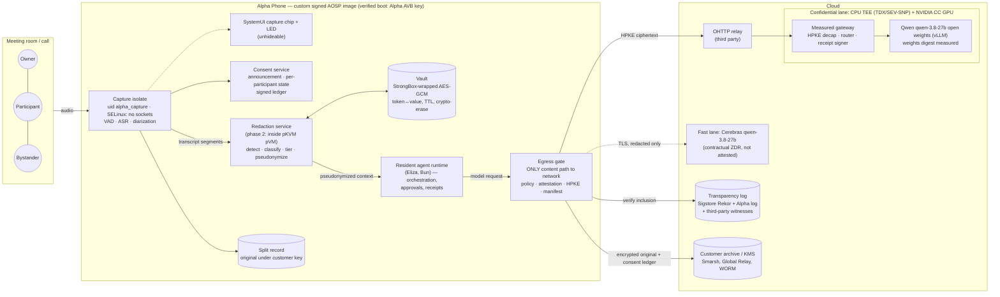
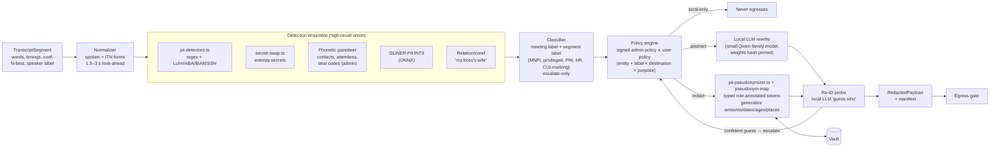
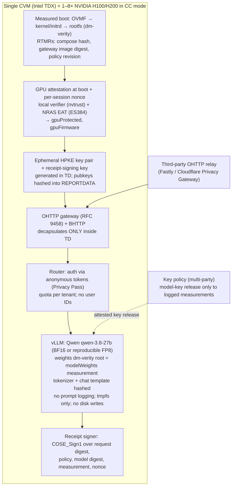

# Alpha Phone — market, competitive, opportunity and technical research

Version 2, 2026-10-02. This version supersedes the 2026-09-30 report. There are 15 workstreams, about 140,000 words. The scope and blind-spot checklist are in the [manifest](00-manifest.md); every section has its tables, citations and open questions. This file is the consolidated view.

**Decisions reflected in this version**

- Alpha **forks AOSP** for its own signed image. Banking apps, Play Integrity and GMS are **not** requirements.
- Hosted inference **stays on Qwen** (`qwen-3.8-27b` via Cerebras). Buyer concerns about the model's origin are answered with Qwen-specific controls (§7.8 of [15](15-open-gap-technical-plan.md)), not by changing models.
- Since 2026-10-01 the **agent runs on the phone** (Android-resident), not in Nitro Enclaves. Only model requests leave the device ([decisions](../decisions.md)).
- Public and in-product wording follows the **claims ladder** below ([decisions](../decisions.md) item 7).

> **Evidence quality.** Sections 01–11 were fact-checked on 2026-10-02. Each one ends with a "Verification log" that lists corrections, "(verified 2026-10-02)" items and "(could not verify)" items. The 200-search budget ran out again during that pass, so some items still rely on direct page fetches or remain unverified. Nothing in sections 12–15 has been built or measured yet. This report is not legal or investment advice.

## Sections

| # | Section | Headline |
| --- | --- | --- |
| 01 | [Transcription devices and meeting AI](01-transcription-competitors.md) | Plaud leads with 2M+ devices and a >$1B valuation (its CEO told the WSJ). Every recorder is cloud-first. Otter's wiretap/BIPA claims survived dismissal on 2026-08-13 and Granola was sued 2026-07-30. IT departments are banning note-takers. |
| 02 | [Agentic phones and AI devices](02-agentic-phones-devices.md) | HP bought Humane for $116M. Rabbit is a cautionary tale. Doubao was blocked by apps it drove. Only privileged system apps can call AppFunctions, so Alpha's own image can and a launcher cannot. |
| 03 | [Secure phones and confidential AI](03-secure-phones-confidential-ai.md) | Secure-phone hardware is a shrinking niche. The PCC pattern is attestation, a transparency log, relays and audits. Cerebras has no attestation offering. |
| 04 | [Redaction technology and design](04-redaction.md) | No one redacts at the microphone. Use typed, role-annotated pseudonyms and an on-device vault. The AI-security M&A wave ran about $160–500M per deal. |
| 05 | [Regulation and compliance](05-regulation-compliance.md) | Consent litigation is the top risk. California SB 690 (signed 2026-09-30) does **not** help recorders. Finance must retain originals and redact copies. |
| 06 | [Vertical deep-dives](06-vertical-markets.md) | Wealth advisors rank #1. Government prices chat at about $1, so its opening is edge transcription. |
| 07 | [TAM/SAM/SOM](07-tam-sam-som.md) | $29.3B TAM, $2.18B SAM and $85M ARR at year 5 (base case). Inputs re-checked; arithmetic unchanged. |
| 08 | [Investors, funding, M&A](08-investors-funding-ma.md) | 84 investors, M&A comps and non-dilutive programs. **Parent company and token facts were corrected against SEC EDGAR.** |
| 09 | [Distribution, partners, economics](09-distribution-partners-economics.md) | Qwen on Cerebras costs $0.99/$1.49 per M tokens (verified), about $13/user/month. Reasoning tokens are a cost risk. Archivers are the finance channel. |
| 10 | [Always-on feasibility](10-always-on-tech-feasibility.md) | Parakeet runs near cloud accuracy. Pixel 10 has 3 mics and a 4,970 mAh battery. Canary is non-commercial, so it is excluded. |
| 11 | [Fit, GTM, risks, blind spots](11-fit-gtm-risks.md) | Beachhead: SEC-registered advisers. 42-item risk register, rescored for the AOSP fork. |
| 12 | [**AOSP always-on listening**](12-aosp-always-on-listening.md) | A privileged, no-network `sense` package. Use the HOTWORD source for non-intrusive concurrency. Stock AOSP has three indicator-bypass paths to close. Pixel 10 builds via adevtool. 36–55 engineer-weeks. |
| 13 | [**Redaction integration**](13-redaction-integration.md) | Upstream detectors, pseudonyms, secret-swap and audio redaction exist but are unwired. Exact egress points are mapped. 12 work packages, 7 upstream patches. |
| 14 | [**SOC 2 technical plan**](14-soc2-technical-plan.md) | Security, Availability and Confidentiality first. 20 repo gaps found. Type 1 around 2027-01-15, Type 2 around June 2027. Year-one cost $110–170k likely. |
| 15 | [**Open-gap technical plan**](15-open-gap-technical-plan.md) | Four pillars behind one egress gate, two Qwen lanes (fast and confidential), a claims ladder and a nine-month path to "audited". |

## Executive summary

1. **The gap is real, and it is an integration gap.** No shipping product combines four things behind one enforced egress gate with a per-request receipt:
   - on-device transcription;
   - pre-egress redaction;
   - built-in, per-participant consent;
   - verifiable cloud processing.

   Courts are treating vendor-cloud audio as possible eavesdropping (Otter, Granola, Fireflies BIPA). IT departments are banning outside note-takers ([01](01-transcription-competitors.md), [05](05-regulation-compliance.md)). Every component exists somewhere; the composition is the product ([15](15-open-gap-technical-plan.md)).

2. **Forking AOSP turns policy into enforcement.** A launcher can only ask for privacy properties; the image can make them true ([12](12-aosp-always-on-listening.md), [15](15-open-gap-technical-plan.md)):
   - The capture package holds the microphone in an SELinux domain with **no network access**.
   - ASR and redaction run in an isolated child process.
   - **Only redacted text** crosses a signature-protected interface to the agent app.
   - The SystemUI "Listening" chip is driven by what audioserver is actually capturing and cannot be hidden.

   Stock AOSP has three ways to record without an indicator: exempt ambient-audio roles, the HOTWORD source without `ro.hotword.detection_service_required`, and HotwordDetectionService attribution. The fork must close all three.

   - **Background capture:** `persistent` gets past the background-start rules.
   - **Concurrency:** the `HOTWORD` source never steals the microphone from calls or other apps.
   - **Power:** the main processor cannot sleep while capturing, about 5–10% of battery per day (est.).
   - **Hardware:** Pixel 10 builds via GrapheneOS adevtool even though Google stopped publishing device trees.
   - **Effort:** about 36–55 engineer-weeks.
   - **ADR change needed:** ADR-04's non-privileged rule must be superseded for the listener package. The legal right to redistribute Pixel vendor blobs needs review.

3. **The redaction tooling largely exists upstream and is unwired** ([13](13-redaction-integration.md)).
   - **Reusable modules** in `vendor/eliza/packages/core/src/security/`:
     - `pii-detectors.ts` (24 kinds, checksum-validated);
     - `pii-pseudonymizer.ts`;
     - `secret-swap.ts`;
     - `guarded-stream.ts` (streamed rehydration);
     - `confidential-inference.ts` (audit gate).
   - **Audio redaction** with re-transcription verification is in `packages/core/src/audio-redaction*.ts`.
   - **Corrections to earlier research:**
     - Pseudonyms are realistic fake names, not typed tokens.
     - The audit record does not cover redaction.
     - The core PII modules have no unit tests.
     - Upstream redaction is off by default and runs only at the agent's model boundary.
   - **Quickest real win:** the resident agent sends unredacted prompts straight to Cerebras. Enabling `ELIZA_SECRET_SWAP_ENABLED` and `ELIZA_PII_SWAP_ENABLED` in `AlphaLocalAgentPlugin.configureEnvironment` protects the only routine cloud path today.
   - **Full plan:**
     - a renderer and native detection layer, with a GLiNER-PII ONNX model behind upstream's `PiiEntityRecognizer`;
     - a Java gate that refuses any request body without a matching redaction receipt;
     - a Keystore vault;
     - four policy tiers;
     - a signed, hash-chained receipt schema;
     - a spoken-meeting eval set.

     Estimated effort: about 12 engineer-weeks for a standard-tier gate, and 22–26 for the full confidential tier.

4. **Confidentiality claim: corrected and now enforced in code.** The agent is on the phone, so the routine cloud plaintext path is model inference: Cerebras running Qwen, protected by a no-retention commitment that is contractual, not attested. The claims ladder ([15](15-open-gap-technical-plan.md) §9) is now the single source of truth.

   | Rung | Earned by | Permitted wording |
   | --- | --- | --- |
   | **L0 (today)** | — | "The assistant runs on your phone. Model requests send prompts and selected context over TLS to Cerebras (US) running Qwen. Alibaba does not receive your data. No-retention is contractual." Never say sealed, attested, enclave-protected or "never leaves". |
   | L1 | Physical-device ASR evidence | "Conversations are transcribed on the phone; audio is not uploaded." |
   | L2 | Published leak-rate report | "Identifiers are replaced before anything leaves; measured leak rate X%." |
   | L3 | Consent evidence (OS-enforced only after image boot on a device) | "Announced, per-participant consent with a signed record." |
   | L4 | Confidential lane live | "Your phone verifies the server hardware and the exact Qwen weights hash before sending." |
   | L5 | Transparency log, reproducible builds, multi-party release, external audit | "Independently verifiable and audited." |
   | L6 | Customer-held keys | "Your organization holds the keys and can veto releases." |

   **Implemented on 2026-10-02:**
   - Mock-mode copy that claimed "Sealed · Attested", "Attestation passed · Keys never left the device" and "stays in the enclave" now describes planned redaction features.
   - The real-mode adapter shows "Not active" for redaction.
   - A new browser test, `test/browser/confidentiality-claims.spec.ts`, fails if any real or mock screen asserts sealing, attestation or data locality. A negative control proved it catches the old copy.

5. **Qwen stays, and its origin is answered rather than hidden** ([15](15-open-gap-technical-plan.md) §7.8):
   - A self-hosted **confidential lane** runs Alpha's pinned Qwen weights on confidential H100/H200. The phone verifies the CPU+GPU attestation, including the weights hash, encrypts end to end (HPKE) and sends through an OHTTP relay. Alibaba is never a data recipient.
   - Redaction applies on every lane.
   - Provenance is documented in a model BOM with independent re-hashes.
   - The model has no egress or autonomous tools.
   - Admission tests are published per release.

   **Stated limits:** testing cannot prove the absence of a backdoor, and some defense and IC buyers will refuse PRC-origin models as a matter of policy. The FY2026 NDAA's DeepSeek removal is a precedent ([11](11-fit-gtm-risks.md)).

   **Costs (est.):**

   | Option | Cost per user | Notes |
   | --- | --- | --- |
   | Cerebras Qwen | about $13.22/month | Verified list price. Reasoning-heavy output can push it to $15.90 ([09](09-distribution-partners-economics.md)). |
   | Self-hosted on Phala H200 | about $11.70 | Parity at about 400 active users. The throughput estimate must be measured. |

   Confidential GPUs are slower per user, so background summaries go first.

6. **Beachhead unchanged: SEC/FINRA-regulated advisers** (RIAs, MFOs, PE/VC IR teams), then law firms and deal teams, executives and HR investigations, then behavioral and home health ([06](06-vertical-markets.md), [11](11-fit-gtm-risks.md)).
   - **Verification caveat:** SEC Chair Atkins has de-emphasized recordkeeping cases, so "fear of fines" is a weaker lever than in 2021–24. FINRA enforcement continues. Lead with a clean archive, privilege protection and IT approval rather than fines.
   - **Competitor funding:** Jump raised an $80M Series B in February 2026 and serves 27,000 advisors.

7. **SOC 2 is the first market-access gate** ([14](14-soc2-technical-plan.md)).
   - **Scope:** start with Security, Availability and Confidentiality. Add Privacy once the recording beta precedes the observation window. Add Processing Integrity only after redaction has a published accuracy target.
   - **Subservice organizations:** Cerebras (it has a SOC 2 Type 2), AWS, Cloudflare and GitHub are carved out.
   - **High-severity repo gaps:**
     - no branch protection on `main`;
     - no second reviewer and unsigned commits;
     - no Dependabot, CodeQL or SBOM;
     - unsigned release APKs;
     - a missing enclave signer;
     - a temporary `trycloudflare.com` tunnel;
     - admin accounts on personal Gmail;
     - no policies or registers.
   - **Signing-key custody:** app, platform, AVB, OTA and enclave keys are the Alpha-specific control area.
   - **Timeline and cost (est.):** Type 1 as of about 2027-01-15, a 3-month Type 2 window to about 2027-04-16, and the report around June 2027. Year one costs $110–170k plus a fractional security lead and **a second engineer, who is also the only way to get independent code review**.

8. **Distribution: software first, then Alpha's image** ([09](09-distribution-partners-economics.md)).
   - With banking apps out of scope, **Play Integrity is no longer a blocker** for the custom image.
   - **The remaining blocker is enterprise MDM.** Intune's AOSP device list still contains only the HMD Terra M, so a managed fleet of Alpha-image phones needs Android Enterprise work or partner validation.
   - **Sequence:**
     1. Design partners on Alpha-image Pixels plus the app.
     2. Finance channels through archivers and AWS Marketplace.
     3. Carahsoft and a DIU CSO.
     4. Sovereign deals.
   - **Margins (est.):** 54–81% at $59–129/user/month.

9. **Market size:** base-case TAM $29.3B, SAM $2.18B, SOM $85M ARR by 2031 ([07](07-tam-sam-som.md)). Every SOM case depends on L1–L3 shipping by 2027.

10. **Corporate and capital (corrected against SEC EDGAR, [08](08-investors-funding-ma.md)).** Verify internally before external use.
    - **The parent:** Alpha Compute Corp (NASDAQ: ALP), formerly AlphaTON Capital (until April 2026) and Portage Biotech (until September 2025).
      - Market cap is about **$7.0M** (2026-10-02), not $2.29M.
      - A 1:50 reverse split on 2026-09-09 was followed by regained compliance on 2026-09-25.
      - The FY2026 20-F/A carries a **going-concern** paragraph.
      - The filings do not mention Alpha Phone or elizaOS.
    - **The token:**
      - The class action is *Doe v. Walters*, 1:26-cv-03238 (S.D.N.Y., filed 2026-04-22). Its settlement terms are known only from public statements.
      - Peak market cap was about $2.39B (2025-01-02).
      - The AI16Z→ELIZAOS migration in November 2025 was 1:6.
      - a16z demanded the project stop using its branding in January 2025.
    - **Recommendation unchanged:** a US Delaware entity with majority-US ownership (for SBIR, which is confirmed to require it, and for FOCI), a security- or defense-led seed, redaction as a separable SDK, and full disclosure in the data room.

## Consolidated opportunity ranking

| Rank | Market | Why | Gate |
| --- | --- | --- | --- |
| 1 | Independent RIAs, MFOs, PE/VC IR | Proven budget ($75–200/advisor), cloud-only incumbents, archiver channel | L1+L2, archive connector, SOC 2 Type 1 |
| 2 | Small/mid law firms, M&A and deal teams | Fear of privilege waiver. Harvey (BigLaw) and Legora ($5.55B) leave the rest open | + legal hold, counsel memo |
| 3 | Executives, boardrooms, HR investigations | Clean-room meetings, trade secrets | + Alpha-image device tier, travel mode |
| 4 | Privacy-first prosumers | Can buy now | Separate brand from regulated sales |
| 5 | Behavioral and home health | Highly sensitive, in-person, weaker incumbents | + BAA chain (Cerebras BAA not confirmed), EHR |
| 6 | Defense and government edge | Non-dilutive funding, DIU | US entity. Qwen origin is a hard policy question for some buyers |
| 7 | Sovereign | Large deals | Confidential lane (L4+), local hosting |

## Consolidated plan (next 9 months, est.)

| Window | Product and platform | Trust and compliance | GTM and capital |
| --- | --- | --- | --- |
| Oct–Nov 2026 | Pixel 10 Alpha image bring-up (adevtool, `avb_custom_key`). Parakeet on-device ASR measured on a physical device (**L1**). Enable upstream PII/secret swap on the resident agent | Claims ladder enforced (done). Branch protection, second reviewer, Dependabot/CodeQL, SBOM. Signing-key custody plan | US entity. 10 design partners. Cerebras DPA and BAA |
| Dec 2026–Jan 2027 | `sense` package (no-network SELinux domain, HOTWORD capture, SystemUI chip). Redaction gate, vault and receipts. Spoken-meeting eval (**L2**) | SOC 2 Type 1 (about 2027-01-15). Consent ledger and jurisdiction packs (**L3**) | Paid pilots. Archiver connector. Seed |
| Feb–Apr 2027 | Confidential Qwen lane on Tinfoil or Phala. Phone-side attestation and HPKE/OHTTP (**L4**) | Type 2 window. Transparency log, reproducible builds, 3-of-5 release policy | Legal and deal-team expansion. DIU CSO/SBIR via the US entity |
| May–Jun 2027 | DSP/NPU/pKVM spikes. Signed OTA with 7-day dogfood | External audit (**L5**). Type 2 report. Customer-held keys pilot (**L6**) | Behavioral health pilots. Sovereign scoping |

## Top risks

1. Overclaiming confidentiality. This is now mitigated by the claims ladder and the automated test; every new screen and every sales deck must stay within the earned rung.
2. On-device ASR, redaction and the Alpha image are not yet built or measured. Every revenue case depends on them.
3. A redaction false negative. The mitigation is fail-closed tiers, leak-rate gating and redaction in front of every lane.
4. Consent and BIPA litigation. Use an all-party default, anonymous per-session diarization, no voiceprints and no training on customer data.
5. Qwen origin for defense, IC and some federal or finance buyers. The answer is the confidential lane and model BOM; some buyers will still refuse.
6. Platform risks:
   - Pixel vendor-blob redistribution rights;
   - Google's twice-yearly AOSP cadence and slow kernel source releases;
   - MDM support for a custom image;
   - battery cost of always-on capture.
7. Parent company going concern and the token history in diligence.
8. Team capacity: about 11–13 FTE for the full plan against a very small team today. SOC 2 itself requires a second engineer.

## Not asked about, but material

- Retention collides with redaction, which a split record solves. The redaction receipt can be sold to the CCO and CISO as compliance evidence.
- Live captions for deaf and hard-of-hearing employees are an easy-approval ADA wedge.
- Travel and border mode, and duress wipe.
- Works councils, and the EU ban on workplace emotion inference.
- EAR 5A002/ENC export classification.
- NVIDIA Canary and Piiranha are non-commercial, and Piper is GPL, so all three are excluded.
- Two existing US patents (12229313, 12189817) require a freedom-to-operate review.
- Trademark clearance for "Alpha".
- elizaOS is MIT-licensed, so the moat is evals, certifications and integrations.
- Vendor-death insurance: customer-held keys, export and local fallback.
- Publish AppFunctions so other assistants call into Alpha.


---

# Alpha Phone market research — manifest

Research date: 2026-09-30. **Revised 2026-10-02:** the agent is now Android-resident (not Nitro); Alpha forks AOSP and does not need banking apps, Play Integrity or GMS; inference stays on Qwen; workstreams 12–15 were added (AOSP always-on listening, redaction integration, SOC 2, open-gap technical plan) and 01–11 were fact-checked. The baseline table below is the original 2026-09-30 snapshot. Owner: product/strategy. Status: manifest issued; sections are filled by parallel research workstreams and consolidated in [REPORT.md](REPORT.md).

This is market research, not engineering acceptance. Product capability statements come from the repository's own evidence ledger (`docs/mvp-scope-and-gap-report.md`, `docs/current-acceptance-ledger.md`, `docs/enclave-candidate-validation.md`). Where the product is only planned, the research says so.

## Product baseline used for all workstreams

| Attribute | Current state (from repo) |
| --- | --- |
| Form factor | Android phone UI (Pixel 10 or similar target), in standalone-app and HOME-launcher flavors; an additive, non-privileged AOSP vendor add-on is generated. The full signed image has not been qualified on a physical device. |
| Agent runtime | elizaOS agent, owner-paired. Cloud agent runs in **AWS Nitro Enclaves** with PCR-measured images and attested KMS key release. Inference is Cerebras (`qwen-3.8-27b`). The latest candidate is not yet deployed. |
| Voice | Native capture and playback on the phone. ASR/TTS (whisper.cpp tiny.en, Kokoro) currently run on a paired host. **On-device STT/TTS is an MVP requirement** that is not yet met. |
| Daily tools | Notes, transcription, calendar CRUD, reminders and alarms, browser with a password-provider integration, files, camera and photos, maps handoff, workflows, digests, notifications and inbox. Gmail is recommended. |
| Deferred | Phone, SMS and contacts integration; wallet and payments; offline LLM; Telegram and Discord. |
| Security posture | Android Keystore AES-GCM credential storage, no backup, owner-scoped pairing, explicit approvals and receipts for native actions, and attested enclave inference. There is no redaction pipeline yet: "redaction" is named as a shared upstream contract in ADR-02. |
| Design | Alpha Compute brand: white/black with electric blue #0000FF, Fraunces/Denton serif and Public Sans. The prototype has 14 app modules. |

## Research questions and workstreams

| # | Workstream | Key questions | Output file |
| --- | --- | --- | --- |
| 1 | AI transcription and recorder devices, and meeting-assistant software | Every wearable and pocket recorder (Plaud, Limitless→Meta, Bee→Amazon, Omi, Friend, Sandbar, TicNote, HiDock, Viaim, Soundcore, Pixel Recorder…) and meeting software (Otter, Fireflies, Granola, Fathom, Read.ai, Krisp, Zoom/Teams/Gemini): funding, valuation, revenue, price, how built (models, on-device vs cloud, hardware), privacy posture and failures | `01-transcription-competitors.md` |
| 2 | Agentic phones and AI assistant devices | Rabbit, Humane→HP, OpenAI/io, T Phone AI, Nothing, Brain.ai, Doubao phone, Honor, Samsung/Pixel/Apple AI, Solana Saga/Seeker, Light Phone, Meta glasses: funding, sales, lessons, why they failed or succeeded | `02-agentic-phones-devices.md` |
| 3 | Secure and sovereign phones, and confidential-compute AI | Secure phones (Bittium, Sirin, Katim, Purism, GrapheneOS, Murena, Boeing Black, Samsung Knox/Tactical, Hypori virtual mobile) and confidential AI (Apple PCC, Google Private AI Compute, NVIDIA CC, Opaque, Fortanix, Anjuna, Edgeless, Tinfoil, Confident Security, Phala, Privatemode): funding, customers, architectures | `03-secure-phones-confidential-ai.md` |
| 4 | Redaction and PII/DLP technology, plus a redaction design for Alpha | Competitors (Private AI, Tonic, Presidio, Nightfall, Skyflow, Protecto, Strac, Harmonic, Prompt Security, Lakera, Credal, Veritone Redact…); taxonomy of sensitive data per vertical; techniques that preserve business value (typed pseudonyms, reversible vault tokenization, generalization, FPE, policy tiers, local rehydration); failure modes and evaluation | `04-redaction.md` |
| 5 | Regulation, compliance and certification | Recording-consent law, BIPA, HIPAA, FERPA/COPPA, GLBA, FINRA/SEC recordkeeping (off-channel fines), CJIS, ITAR/EAR, CMMC, FedRAMP, NIAP MDF, CSfC, DISA STIG, FIPS 140-3, EU AI Act/GDPR, UK; costs and timelines; what compliance unlocks | `05-regulation-compliance.md` |
| 6 | Vertical deep-dives | Government and civilian, defense and intelligence, finance, healthcare, legal, education, enterprise exec/office, critical infrastructure, international sovereign: pains, buyers, budgets, procurement, incumbents, fit | `06-vertical-markets.md` |
| 7 | Market sizing | TAM, SAM and SOM, top-down and bottom-up per segment, with assumptions shown | `07-tam-sam-som.md` |
| 8 | Capital: investors, funding comps, M&A | Who funded the comparables, relevant VCs (defense, privacy, AI hardware, crypto/elizaOS-adjacent), strategic and corporate VCs, non-dilutive funding (SBIR, AFWERX, DIU, IQT, ARPA-H, NSF, EU), acquirers and valuation comps | `08-investors-funding-ma.md` |
| 9 | Distribution, partners and unit economics | Carriers, MDM/EMM, VARs/GSA/SEWP/Carahsoft, SIs, OEM/ODMs, EHR/CRM and compliance-archive partners, silicon (Qualcomm/Tensor/MediaTek), Cerebras/AWS, GMS licensing, BOM and pricing models | `09-distribution-partners-economics.md` |
| 10 | Always-on assistant: technical feasibility and competitive tech | On-device ASR, diarization and redaction models (Whisper, Parakeet, Moonshine, Gemini Nano, Apple), NPU capability, battery for always-on capture, wake word, audio hardware, multi-party capture, enterprise deployment | `10-always-on-tech-feasibility.md` |
| 11 | Product fit, opportunity ranking, GTM, risks and blind spots | Score segments against the current feature set, pick a beachhead, pricing and packaging, pilots, positioning, a full risk register, and things the user did not ask about | `11-fit-gtm-risks.md` |

## Checklist of topics the request did not name (all assigned above)

- Recording-consent law (all-party-consent states and the EU) as a gating feature (5, 10)
- Biometric voiceprints under BIPA/CUBI when diarizing speakers (5, 10)
- Bystander privacy and a social-acceptability "recording" indicator (Humane/Friend backlash) (1, 2, 11)
- Recordkeeping *obligations*: finance must *retain*, not only redact. Retention can conflict with redaction (4, 5, 6)
- Legal holds and e-discovery for transcripts; privilege waiver when privileged speech reaches a third party's AI (5, 6)
- Export controls on encryption and AI (EAR 5A002, ITAR if defense-modified) (5, 9)
- Supply chain and origin requirements: TAA, NDAA §889, trusted-foundry style and "China-free" BOMs (3, 5, 9)
- Google GMS/MADA licensing versus de-Googled AOSP. Play Integrity breaks banking apps (9, 11)
- Pixel bootloader and verified-boot custom keys (GrapheneOS model) (3, 9)
- Wake-word patents and speech-model licensing (Whisper MIT, Parakeet CC-BY) (10, 11)
- Brand trust: elizaOS/ai16z crypto association as an asset for some investors and a liability with government buyers (8, 11)
- Insurance and liability for redaction false negatives (4, 11)
- Alternative form factors: a companion pendant or desk puck versus a full phone, and BYOD app versus dedicated device (2, 10, 11)
- Channel conflict with Apple and Google bundling free recorders and summaries (1, 2, 11)
- Hiring and certification capacity (FIPS, CC and FedRAMP take 12–24 months) (5, 11)
- Pricing: hardware-plus-subscription versus seat-based versus enclave-inference metering (9, 11)

## Method and quality bar

- Use web search for 2025–2026 data. Cite a source URL for every number. Mark unverified or estimated figures `(est.)`. Give the date of every funding round.
- Keep facts separate from inference. Flag contradictions between sources.
- Tables are preferred for comparables: company, product, price, funding (total/last round/date/lead), valuation, architecture, privacy posture, status.
- Each file ends with "Implications for Alpha Phone" and "Open questions".


---

# 01 — AI transcription and recorder devices, and meeting-assistant software

Research date: 2026-09-30. Workstream 1 of the [manifest](00-manifest.md). Scope: wearable and pocket AI recorders, OS-bundled recorders, meeting-assistant software, and (briefly) clinical scribes. Healthcare scribes are covered in depth by workstream 6.

## How to read this file

- Every number has a source URL next to it or in the table's source column. A figure marked **(est.)** is a third-party estimate or my own arithmetic.
- A figure marked **(unverified)** comes from background knowledge. I could not re-confirm it in this session because the shared web-search budget ran out partway through. Treat these as leads to confirm, not facts. They are listed again under Open questions. **Update 2026-10-02:** a verification pass with working web search replaced most of these with citations marked "(verified 2026-10-02)" or "(could not verify)"; see the Verification log at the end.
- Where sources disagree, both figures are given and the disagreement is noted. There is a list in [§13](#13-source-contradictions-and-data-quality-flags).
- Company claims such as "SOC 2" or "HIPAA compliant" are the vendors' own statements. I did not audit them.
- Several useful 2026 articles come from competitors' blogs (Basil AI, tl;dv, Hedy, Voibe, Routines). They are cited only for facts that can be checked, such as case numbers and dates, and are labeled as such.

---

## 1. Executive summary

1. **The category is large, real and profitable at the top.** Plaud has shipped more than 2M devices, and its **software alone passed $100M ARR** by June 2026 ([TechCrunch, 2026-06-16](https://techcrunch.com/2026/06/16/plaud-says-its-software-business-topped-100m-in-arr-after-shipping-over-2m-ai-notetakers/)). Plaud reported **$250M annualized revenue** in September 2025 and said it was profitable ([Forbes via Techmeme](https://www.techmeme.com/250902/p30)). Otter reached **$100M ARR** in March 2025 ([Otter](https://otter.ai/blog/otter-ai-breaks-100m-arr-barrier-and-transforms-business-meetings-launching-industry-first-ai-meeting-agent-suite)). Fireflies reached a **$1B+ valuation** through a tender offer in June 2025 ([Yahoo Finance](https://finance.yahoo.com/news/fireflies-reaches-1-billion-valuation-150000434.html)). Granola raised **$125M at $1.5B** in March 2026 ([TNW](https://thenextweb.com/news/granola-series-c-meeting-ai-enterprise-context)).
2. **Hardware is a Chinese-supply-chain commodity business.** A dozen devices sit at $159–$199 with about 300 free minutes a month and a $10–$20/month upsell: Plaud, TicNote, Soundcore Work, HiDock, Viaim, Pocket, Comulytic, Genspark and others ([TechCrunch roundup, 2026-03-20](https://techcrunch.com/2026-03-20/ai-notetaker-hardware-devices-pins-pendants-record-transcribe)). None of them does meaningful ASR or LLM work on the device. They capture audio and upload it.
3. **"Always-listening companion" pendants have mostly failed as standalone businesses.** Big tech bought the teams: Bee went to Amazon in July 2025 ([TechCrunch](https://techcrunch.com/2025/07/22/amazon-acquires-bee-the-ai-wearable-that-records-everything-you-say/)) and Limitless went to Meta in December 2025 ([CNBC](https://www.cnbc.com/2025/12/05/meta-limitless-ai-wearable.html)). Humane sold to HP for $116M after about 10k units ([Wikipedia](https://en.wikipedia.org/wiki/Humane_Inc.)). Friend became a symbol of the backlash ([CNN](https://www.cnn.com/2025/11/16/tech/friend-ai-device-backlash-ceo-avi-schiffmann)).
4. **Consent and training-on-data law has arrived.** In *In re Otter.AI Privacy Litigation*, the federal Wiretap Act, CIPA and BIPA claims **survived a motion to dismiss on 2026-08-13** on a "third-party eavesdropper" theory. That theory rests on the allegation that Otter keeps audio and trains on it ([RecordingLaw](https://www.recordinglaw.com/news/otter-ai-wiretap-lawsuit-explained/)). Fireflies faces BIPA voiceprint suits ([Epstein Becker Green](https://www.ebglaw.com/insights/publications/ai-meeting-assistants-and-biometric-privacy-lessons-from-the-fireflies-ai-lawsuit)). Granola, the "bot-free" leader, was sued on 2026-07-30 ([ToolDirectory case table](https://tooldirectory.ai/blog/ai-notetaker-lawsuits-2026)).
5. **Enterprises are blocking third-party notetakers.** Examples are BlueCross BlueShield of South Carolina on 2026-05-14 ([BCBSSC](https://www.southcarolinablues.com/en/home/agents/individuals-and-small-groups/news-and-events/2026/ai-note-taking-is-prohibited-effective-immediately.html)), ASAE ([ASAE](https://www.asaecenter.org/about-us/policies/ai-notetaking-policies)), UMass ([Wikipedia/Otter](https://en.wikipedia.org/wiki/Otter.ai)) and restrictions at the University of Washington, Chapman and UC Riverside ([UC Today](https://www.uctoday.com/security-compliance-risk/otter-ai-on-trial-and-the-ai-notetaker-industry-with-it/)). The reason given is always the same: audio goes to third-party clouds and may be used for training.
6. **Platform bundling is squeezing the middle.** Apple records and summarizes calls in Phone and Notes, notifies participants, and runs on-device plus Private Cloud Compute ([Apple Newsroom](https://www.apple.com/newsroom/2024/10/apple-intelligence-is-available-today-on-iphone-ipad-and-mac/)). Google Workspace Standard ($14/user/month) includes Gemini in Meet ([Google](https://workspace.google.com/pricing)). Notion Business ($20) includes bot-free meeting notes ([Notion](https://www.notion.com/pricing)). Superhuman bought Fathom in September 2026 ([TechCrunch](https://techcrunch.com/2026/09/14/superhuman-acquires-yc-backed-notetaker-fathom-as-productivity-platforms-push-for-agentic-work/)).
7. **The whitespace is clear.** No shipping product combines an **always-available capture device**, **on-device ASR plus redaction before egress**, **consent and bystander tooling**, and **verifiable (attested) cloud inference** for what must go to the cloud. The nearest are Apple (a consumer product with no enterprise policy or redaction), Krisp Enterprise (on-device transcription on the desktop only) and Plaud (local unless Cloud Sync is on, but ASR runs in the cloud). This is the position Alpha Phone could occupy. The product does not have it yet: on-device STT and redaction are both unbuilt ([manifest](00-manifest.md)).

---

## 2. Market map

| Segment | Examples | Business model | Status (Sept 2026) |
| --- | --- | --- | --- |
| Pocket and card recorders | Plaud Note / Note Pro, TicNote, Comulytic, HiDock P1 | $159–$199 device + freemium minutes + $100–$240/yr subscription | Growing fast. Plaud leads. Chinese rivals are proliferating (DingTalk A1, an Anker+ByteDance device) |
| Wearable pins and pendants (work) | Plaud NotePin / NotePin S, Soundcore Work, Omi, Limitless (dead), Pocket, Genspark Secondbrain | Same model | Pins survive as "recorders". "Memory pendants" were bought up |
| Wearable companions (consumer / "life-logging") | Bee (Amazon), Friend, Omi | Cheap device + subscription | Acquired or backlash-hit |
| Rings and earbuds | Sandbar Stream ring, Viaim RecDot earbuds | Premium device ($199–$299) + small subscription | Early. Stream shipped summer 2026 |
| Voice-first "AI computers" | Humane AI Pin (dead), iyO One (pre-order) | Device + subscription | Humane failed. iyO is unproven |
| OS-bundled recorders | Apple Phone/Notes, Pixel Recorder, Samsung Voice Recorder / Transcript Assist | Free with the phone | Quietly the default for consumers |
| Meeting bots (join the call) | Otter, Fireflies, Read AI, Fathom, tl;dv, Avoma | Freemium seat SaaS, $10–$40/user/month | Big but litigation-exposed and increasingly blocked |
| Bot-free desktop capture | Granola, Jamie, Krisp, Supernormal, Notion, Otter desktop, Plaud Desktop | Seat SaaS | The fastest-growing software sub-segment in 2025–26 |
| Suite-bundled | Microsoft Teams / Copilot, Zoom AI Companion, Google Meet Gemini, Notion | Included in suite tiers or add-ons | The ceiling on standalone pricing |
| Revenue intelligence | Gong, Avoma, Otter Sales Agent | Enterprise seats | Gong about $500M ARR (Sacra) |
| Clinical ambient scribes | Abridge, Ambience, Microsoft Dragon Copilot (Nuance DAX), Suki | Per-clinician enterprise | The most-funded vertical |

---

## 3. Hardware comparison table

Prices are USD list prices at launch or current retail. "Free tier" means the transcription allowance bundled with the device.

| Device (company) | Price | Subscription | Funding / last round (date, lead) | Valuation | Revenue / units | Build: capture → ASR → LLM | Privacy posture | Status | Sources |
| --- | --- | --- | --- | --- | --- | --- | --- | --- | --- |
| **Plaud Note / Note Pro / NotePin / NotePin S** (Plaud, SF/Shenzhen; founded 2021) | Note $159; Note Pro $179 (Oct 2025); NotePin $159; NotePin S $179 (CES 2026) | Starter free (300 min/mo); Pro $99.99/yr; Unlimited $239.99/yr; 3,000-min add-on $59.99 | Mostly self-funded, but **Vertex Holdings (Temasek-owned) is named as an investor** in a WSJ-sourced report ([TFN, 2026-09-18](https://techfundingnews.com/plaud-eyes-2028-us-ipo-after-crossing-1b-valuation/)) (verified 2026-10-02). Sacra lists a ~$4.75M convertible note (2025-04-24, "Carbide Ventures") — **possibly a different entity, see §13**. A reported Tencent round was **denied by both parties** | **CEO Nathan Xu told the WSJ Plaud was valued at more than $1B in 2025** (verified 2026-10-02); ~$2B (36Kr; denied). Targets a **US IPO in 2028** once revenue passes $1B | 2024 revenue ~$56M at ~20% margin; 2025 target $250M; 1M units by Jul 2025, 1.5M by Jan 2026, 2M+ by Jun 2026; 2.5M+ users in 170+ countries, US+Europe ~2/3 of revenue, profitable (Sept 2026, [TFN](https://techfundingnews.com/plaud-eyes-2028-us-ipo-after-crossing-1b-valuation/)); software ARR $100M+ (Jun 2026); ~50% of device users pay; 2026 sales target $500M | Card / pin form, 2–4 MEMS mics (NotePin S: 2 mics, 64 GB, 20 h); phone app + desktop app; **cloud ASR** ("multiple enterprise-grade models… proprietary fine-tuned"); LLMs **GPT-5.5, Claude Sonnet 4.6, Gemini 3.1 Pro**; EU users get EU-hosted subprocessors | SOC 2 Type II, HIPAA, ISO 27001/27701, GDPR, EN 18031 (self-reported); AES-256 at rest; AWS in US/Frankfurt/Japan/Singapore; **no training by default** (opt-in); ZDR with LLM vendors; "audio and transcription remain local unless Cloud Sync" | Market leader. "Plaud Teams" launched May 2026; an agent wearable with possible cellular is due later in 2026 | [Techmeme/Forbes](https://www.techmeme.com/250902/p30), [36Kr](https://eu.36kr.com/en/p/3799129165863937), [KrASIA](https://kr-asia.com/tencents-rumored-plaud-deal-points-to-looming-ai-hardware-contest), [Sacra](https://sacra.com/c/plaud/), [TC 2026-01](https://techcrunch.com/2026/01/04/plaud-launches-a-new-ai-pin-and-a-desktop-meeting-notetaker/), [TC 2026-06](https://techcrunch.com/2026/06/16/plaud-says-its-software-business-topped-100m-in-arr-after-shipping-over-2m-ai-notetakers/), [Plaud Intelligence](https://www.plaud.ai/pages/plaud-intelligence), [Plaud Trust](https://www.plaud.ai/pages/trust), [Android Authority](https://www.androidauthority.com/plaud-new-ai-agent-wearable-3678336/) |
| **Limitless Pendant** (Limitless, formerly Rewind) | $99 | Free (10 h AI/mo); Pro $20/mo | ~$33M total (a16z, NEA, First Round, Sam Altman); $15M at $350M valuation (May 2023) | $350M (2023) | ARR ~$2.0M Apr 2025 (Sacra est.) | Clip pendant → phone → cloud ASR/LLM; integrated with Zoom, Meet and Slack | "Consent mode" required notice and consent from recorded people (Sacra) | **Acquired by Meta on 2025-12-05** (Reality Labs acqui-hire). Sales halted; one year of support; EU/UK users cut off. Rewind Mac app capture disabled **2025-12-19** | [CNBC](https://www.cnbc.com/2025/12/05/meta-limitless-ai-wearable.html), [Sacra co](https://sacra.com/c/limitless/), [Sacra research](https://sacra.com/research/why-meta-bought-limitless/), [Hedy (competitor blog)](https://www.hedy.ai/post/meta-acquires-limitless-ai-privacy/) |
| **Bee Pioneer** (Bee, SF) | $49.99 bracelet; Apple Watch app | $19/mo | $7M disclosed (2024; Exor-led per reports) | Undisclosed | Undisclosed | Wrist mic, always on unless muted, 160+ h battery, 40 languages; "combination of AI models"; Amazon models may be added | **Audio discarded after transcription**, "not… used for AI training"; plans on-device processing and voice-consent-only recording | **Acquired by Amazon (announced 2025-07-22)**. Eight-person team inside Amazon devices/Alexa; terms undisclosed | [TechCrunch 2025-07](https://techcrunch.com/2025/07/22/amazon-acquires-bee-the-ai-wearable-that-records-everything-you-say/), [TechCrunch 2026-01](https://techcrunch.com/2026/01/12/why-amazon-bought-bee-an-ai-wearable/), [Entrepreneur](https://www.entrepreneur.com/business-news/amazon-acquires-bee-startup-behind-eavesdropping-wearable/494971) |
| **Omi** (Based Hardware, SF) | $89 (TechCrunch) / $129 promo, $179 list (omi.me) | Free plan; paid tiers optional | $2M (announced 2025-01-30; Tim Draper; 468 Capital, Embedding VC, Dropbox co-founder) | Undisclosed | "300,000+ professionals" (company claim) | nRF-based pendant on Zephyr (C firmware); Omi Glass on ESP32-S3; Flutter phone apps + Mac/Windows; **Deepgram** is the primary STT; **MIT-licensed, self-hostable backend**; 13.6k GitHub stars; 250+ community apps | SOC 2 and HIPAA claimed; open source so it can run locally | Independent; pivoting toward desktop "sees your screen" and a BCI dev kit | [Omi blog](https://www.omi.me/blogs/news/omi-raises-2m), [omi.me](https://www.omi.me/), [GitHub](https://github.com/BasedHardware/omi), [TC roundup](https://techcrunch.com/2026-03-20/ai-notetaker-hardware-devices-pins-pendants-record-transcribe) |
| **Friend** (Friend.com, Avi Schiffmann) | $129 (gen 1); $249 reported for a talk-back gen 2 | None at launch | Pre-seed $2.5M at a **$50M valuation** (2024; [Decrypt](https://decrypt.co/242629/friend-necklace-avi-schiffmann)) (verified 2026-10-02); later totals ~$8M (Protos) / $10M (CNN) — **conflict** (could not verify later total); investors incl. Austin Rief, Anatoly Yakovenko, Aravind Srinivas | $50M (2024) (verified 2026-10-02) | ~1,000 units / ~$150K (Protos, Oct 2025) vs $348K sales (Sacra, Sept 2025) vs "5,000 units" (secondary) — **conflict** | Pendant mic → phone app texts back; cloud LLM ("ChatGPT and other models") | Always listening; widely criticised for bystander surveillance | Spent $1.8M on the domain and $1M+ on NYC subway ads (Sept 2025). Ads were vandalised. Pivoted to a free web chatbot | [Wikipedia](https://en.wikipedia.org/wiki/Friend_(product)), [CNN](https://www.cnn.com/2025/11/16/tech/friend-ai-device-backlash-ceo-avi-schiffmann), [Protos](https://protos.com/friend-ai-spent-millions-on-mimicking-friendship-now-its-just-another-chatbot/), [Sacra](https://sacra.com/research/why-meta-bought-limitless/), [BigGo](https://finance.biggo.com/news/66fa0f9b-a0f9-44a7-ae2f-d3561168f5df) |
| **Stream ring** (Sandbar, ex-Meta CTRL-Labs) | $249 silver / $299 gold | Pro $10/mo | $36M total: pre-seed $3M (2024, Upfront/Betaworks), seed $10M (early 2025, True Ventures), **Series A $23M (2026-03-10, Adjacent + Kindred)** | Undisclosed | Pre-orders from Nov 2025; shipping summer 2026 | Ring with a proximity-tuned mic, **off by default**, push-and-hold to talk (whisper-level pickup); iOS app with a chat LLM (vendor undisclosed); haptics; media controls | Encryption at rest and in transit; export (Notion); intent-gated capture, so it is not ambient | Shipping | [TC 2025-11](https://techcrunch.com/2025/11/05/former-meta-employees-launch-stream-a-smart-ring-that-takes-voice-notes-and-controls-music/), [TC 2026-03](https://techcrunch.com/2026/03/10/sandbar-secures-23m-series-a-for-its-ai-note-taking-ring/), [UC Today](https://uctoday.com/sandbar-ai-voice-note-taking-ring) |
| **TicNote** (Mobvoi) | $159.99 (launch promo $99.99) | Free 300 credits/mo (Mobvoi) or 600 min/mo (TechCrunch) — **conflict**; Pro up to 1,500 credits/mo | Parent Mobvoi: Google invested in 2015 ([CNBC](https://www.cnbc.com/2015/10/20/google-invests-in-chinas-mobvoi-as-it-eyes-return-to-market.html)); Volkswagen put US$180M into a 50:50 JV in 2017 ([TechCrunch](https://techcrunch.com/2017/04/06/volkswagen-mobvoi-china)) (verified 2026-10-02) | n/a | n/a | 3 mics, 25 h continuous, 120+ languages; "agentic" "Shadow AI" assistant; cloud | Not documented in sources reviewed | Shipping (2025) | [Yahoo/PR](https://finance.yahoo.com/news/mobvoi-launches-ticnote-worlds-first-120000010.html), [TicNote](https://ticnote.ai/products/ai-voice-recorder-us), [TC roundup](https://techcrunch.com/2026-03-20/ai-notetaker-hardware-devices-pins-pendants-record-transcribe) |
| **HiDock P1 / P1 mini / H1 dock** (HiDock) | P1 $169 MSRP; KS early bird $89–$149 | "Unlimited free AI transcription"; paid upgrades | Kickstarter: P1 raised **HK$10.03M** (~US$1.29M est.; 2025-03-20 to 2025-05-08); H1 dock HK$4.86M from 2,646 backers. No VC funding listed; Hong Kong-based ([Tracxn](https://tracxn.com/d/companies/hidock/__yarY8q1RVHWj-ya_HyU6r85Emy23c_QdXR2TP3I61OY)) | n/a | n/a | "BlueCatch" intercepts **Bluetooth earphone call audio** + 2 mics, 64 GB; H1 is a desk dock with a recorder; cloud | Not documented | Shipping | [Kicktraq](https://www.kicktraq.com/projects/hidock/hidock-p1-ai-voice-recorder-for-meeting-anywhere/), [HiDock](https://www.hidock.com/products/hidock-p1-ai-voice-recorder), [Points with a Crew](https://www.pointswithacrew.com/kickstarter-hidock-ai-voice-recorder/) |
| **RecDot earbuds** (Viaim) | $199.99 | 600 free min/mo included | **RMB 100M-level A+ round with Transsion as strategic investor (2026-05-27)** ([GlobeNewswire](https://www.globenewswire.com/news-release/2026/05/27/3301686/0/en/viaim-Closes-RMB-100-Million-A-Round-With-Transsion-to-Accelerate-Proactive-AI-Agent-Hardware.html)) (verified 2026-10-02) | n/a | n/a | Earbuds with hybrid ANC (48 dB) that record calls and in-person audio; 78 languages; real-time transcription; cloud | "AES-256 secure" (marketing) | Shipping; CES Innovation Award | [Amazon listing](https://us.amazon.com/dp/B0F7KMG9F5), [SoundGuys](https://www.soundguys.com/viaim-recdot-review-ai-earbuds-for-note-taking-156528/), [Viaim](https://store.viaim.ai/products/viaim-recdot) |
| **Soundcore Work** (Anker) | $159–$160 (one source says $99.99) | 300 free min/mo; $16/mo subscription | Anker is public (Shenzhen) | n/a | n/a | Coin-sized (0.91") pin; 8 h, 32 h with case; 5 m range; **GPT-4o** summaries (per TechBuzz headline) | Not documented | Shipping from Sept 2025 (IFA) | [Android Police](https://www.androidpolice.com/anker-soundcore-work-ai-voice-recorder/), [9to5Toys](https://9to5toys.com/2025/09/04/anker-reveals-new-mini-ai-powered-voice-recorder-wearable/), [TechBuzz](https://www.techbuzz.ai/articles/anker-shrinks-ai-voice-recorder-to-coin-size-with-gpt-4o), [TC roundup](https://techcrunch.com/2026-03-20/ai-notetaker-hardware-devices-pins-pendants-record-transcribe) |
| **Pocket** | $199 | Core free; premium $19.99/mo | n/a | n/a | n/a | 64 GB, 4-day battery, 15 m range, 120+ languages | n/a | Shipping 2026 | [TC roundup](https://techcrunch.com/2026-03-20/ai-notetaker-hardware-devices-pins-pendants-record-transcribe) |
| **Genspark Secondbrain** | $179 | 300 free min/mo | Genspark (AI agent co.) | n/a | n/a | 2.95 mm, 26 g, 5 mics (4 + 1 bone-conduction VPU) | n/a | 2026 | [TC roundup](https://techcrunch.com/2026-03-20/ai-notetaker-hardware-devices-pins-pendants-record-transcribe) |
| **Comulytic Note Pro / Comu Action Pro** | $159 / $257 | Unlimited basic; Advanced $15/mo or $119/yr | n/a | n/a | n/a | 45 h battery; Action Pro has 6 mics, 70 h, "agentic workflows" | n/a | 2026 | [TC roundup](https://techcrunch.com/2026-03-20/ai-notetaker-hardware-devices-pins-pendants-record-transcribe) |
| **DingTalk A1; Anker × ByteDance device** (China) | n/a | n/a | Alibaba / ByteDance | n/a | n/a | Recording cards tied to DingTalk/Feishu workplace suites | n/a | A1 Aug 2025; Anker×ByteDance Jan 2026 | [KrASIA](https://kr-asia.com/tencents-rumored-plaud-deal-points-to-looming-ai-hardware-contest) |
| **Humane AI Pin** (voice angle only) | $699 → $499 (Oct 2024) | $24/mo | $230M by Nov 2023 | $850M (2023 round, as reported by The Information; [Yahoo Finance](https://finance.yahoo.com/news/humanes-ai-pin-doomed-company-153016768.html)) (verified 2026-10-02). Sought $750M–$1B in a 2024 sale; sold for $116M | ~10,000 units by Aug 2024 | Voice-first projector pin; cloud LLM | n/a | **Sold to HP for $116M (Feb 2025)**; servers shut **2025-02-28** | [Wikipedia](https://en.wikipedia.org/wiki/Humane_Inc.), [Sacra](https://sacra.com/research/why-meta-bought-limitless/) |
| **iyO One** (iyO) | Not published | n/a | n/a | n/a | n/a | "Agentic computer you can talk to" (audio earpiece) | n/a | Still pre-order in Sept 2026 | [iyo.ai](https://www.iyo.ai/) |
| **Rewind** (Mac/iOS software, predecessor of Limitless) | Was freemium | — | (see Limitless) | — | — | **Local-first**: screen OCR + audio + local LLM search on the Mac | Local storage | Capture disabled 2025-12-19 after the Meta deal | [Sacra search summary](https://sacra.com/c/limitless/), [Hedy](https://www.hedy.ai/post/meta-acquires-limitless-ai-privacy/) |

### 3.1 Hardware observations

- **The price is fixed at about $159–$179 and the minutes are fixed at 300/month.** That convergence ([TechCrunch roundup](https://techcrunch.com/2026-03-20/ai-notetaker-hardware-devices-pins-pendants-record-transcribe)) means the device is a customer-acquisition cost for a subscription. Plaud's roughly 50% paid conversion ([TechCrunch 2026-06](https://techcrunch.com/2026/06/16/plaud-says-its-software-business-topped-100m-in-arr-after-shipping-over-2m-ai-notetakers/)) is exceptional against Otter's ~3% freemium conversion ([Sacra](https://sacra.com/research/otter-at-100m-arr/)). A dedicated purchase selects for committed users.
- **All of the recorders are "dumb capture + cloud brain".** Plaud says audio stays local unless Cloud Sync is on ([Plaud Trust](https://www.plaud.ai/pages/trust)), but transcription and summaries need the cloud. No vendor documents on-device ASR or on-device redaction.
- **Capture paths are getting creative.** HiDock intercepts Bluetooth earphone audio. Plaud Note uses a vibration-conduction sensor attached to the back of the phone to capture call audio ([Plaud](https://www.plaud.ai/products/plaud-note-ai-voice-recorder)) (verified 2026-10-02). Plaud Desktop and Granola capture system audio. Each path widens what is captured, and with it the consent exposure.
- **Intent-gated capture is the counter-trend.** Sandbar's mic is off by default and uses push-to-talk ([TechCrunch](https://techcrunch.com/2025/11/05/former-meta-employees-launch-stream-a-smart-ring-that-takes-voice-notes-and-controls-music/)). Bee promised voice-consent-only recording ([TechCrunch](https://techcrunch.com/2025/07/22/amazon-acquires-bee-the-ai-wearable-that-records-everything-you-say/)). Limitless shipped a consent mode ([Sacra](https://sacra.com/research/why-meta-bought-limitless/)).
- **Big tech wants the teams, not the pendants.** Sacra concludes that "AI pendant experiences will live inside glasses, earbuds, watches, and phones" ([Sacra](https://sacra.com/research/why-meta-bought-limitless/)). Plaud is the counter-example: it wins as a *work tool* (recorder), not as a *companion*.

---

## 4. OS-bundled recorders (channel-conflict risk)

| Product | Price | On-device vs cloud | Consent / notification | Notes | Source |
| --- | --- | --- | --- | --- | --- |
| **Apple Phone and Notes recording + Apple Intelligence summaries** (iOS 18.1+) | Free with a supported iPhone | Many models on device; heavier requests go to **Private Cloud Compute**, where "data is never stored or shared with Apple" and independent experts can inspect server code | **Participants are automatically notified** when call recording starts | Sets the consumer baseline: free, private, with consent built in | [Apple Newsroom, Oct 2024](https://www.apple.com/newsroom/2024/10/apple-intelligence-is-available-today-on-iphone-ipad-and-mac/) |
| **Google Pixel Recorder** | Free on Pixel | Transcription **on device** since Pixel 4 (2019); speaker labels on Pixel 6+; summaries via **Gemini Nano** on device (Pixel 9 uses Gemini Nano with Multimodality for longer recordings) ([Android Developers Blog](https://android-developers.googleblog.com/2024/08/recorder-app-on-pixel-sees-boost-in-engagement-with-gemini-nano.html), [9to5Google](https://9to5google.com/2024/09/01/pixel-recorder-gemini-nano-multimodality/)) (verified 2026-10-02) | n/a (a local recorder) | The only mainstream recorder that has been fully on-device for years. It is the closest technical analogue to Alpha's planned on-device STT on Pixel hardware | [Pixel help index](https://support.google.com/pixelphone/answer/9516618?hl=en), [Android Developers Blog](https://android-developers.googleblog.com/2024/08/recorder-app-on-pixel-sees-boost-in-engagement-with-gemini-nano.html) |
| **Samsung Voice Recorder / Galaxy AI Transcript Assist** | Free on Galaxy S24+ | Galaxy AI has a "Process data only on device" master switch (Settings > Galaxy AI). With it on, Transcript Assist transcribes locally but **summaries stop working** because they need the cloud (verified 2026-10-02) | n/a | Enterprise Knox angle | [9to5Google](https://9to5google.com/2025/02/20/how-to-turn-on-galaxy-ai-on-device-processing/), [Tom's Guide](https://www.tomsguide.com/phones/samsung-phones/how-to-use-on-device-ai-only-on-samsung-galaxy-s24) |

**Implication:** consumers now get recording, transcription and summaries free on their phone. A paid device must justify itself on **work**: meeting capture, integrations, compliance and admin controls.

---

## 5. Meeting-assistant software comparison table

| Product | List price (per user/month unless noted) | Funding total / last round (date, lead) | Valuation | Revenue / users | Build (capture → ASR → LLM) | Privacy posture | Controversies / outcome | Sources |
| --- | --- | --- | --- | --- | --- | --- | --- | --- |
| **Otter.ai** (Mountain View; founded 2016 as AISense) | Basic free (300 min); Pro $16.99 monthly / $8.33 annual (1,200 min); Business $30 / $19.99 annual; Enterprise custom; HIPAA an Enterprise add-on | ~$70M total; Series B $50M (Feb 2021, Spectrum Equity); Series A $10M (Jan 2020, NTT Docomo Ventures) | Not reliably disclosed (a Latka figure of "$66.9M" is not credible; see §13) | $100M ARR (Mar 2025), up from $81M at the end of 2024; 25M → 35M+ users; 1B+ meetings; <200 staff; ~3% paid conversion | Bot (OtterPilot / "Otter Meeting Agent") joins Zoom/Teams/Meet; desktop bot-free capture since Oct 2025; **proprietary ASR**; agents (Sales, SDR); MCP server | SOC 2 Type II; **HIPAA July 2025**; **trains proprietary models on "de-identified" audio and transcripts by default**, with an opt-out | *In re Otter.AI Privacy Litigation* (N.D. Cal. 5:25-cv-06911): Wiretap Act, CIPA and BIPA claims **survived MTD 2026-08-13**; discovery under way. 2022 Uyghur-journalist survey incident; UMass ban | [Otter blog](https://otter.ai/blog/otter-ai-breaks-100m-arr-barrier-and-transforms-business-meetings-launching-industry-first-ai-meeting-agent-suite), [Yahoo/Otter 2025 recap](https://finance.yahoo.com/news/otter-ai-caps-transformational-2025-174800743.html), [Otter pricing](https://otter.ai/pricing), [Sacra](https://sacra.com/research/otter-at-100m-arr/), [Wikipedia](https://en.wikipedia.org/wiki/Otter.ai), [Otter privacy](https://otter.ai/privacy-security), [RecordingLaw](https://www.recordinglaw.com/news/otter-ai-wiretap-lawsuit-explained/), [ToolDirectory](https://tooldirectory.ai/blog/ai-notetaker-lawsuits-2026) |
| **Fireflies.ai** (SF; founded 2016) | Pro $10, Business $19, Enterprise $39 (annual) | ~$19M VC (2017–2021; Series A led by Khosla, 2021); no primary raise since 2021 | **$1B+ via tender offer (announced 2025-06-12)** | Profitable since 2023; 20M+ users, 500k orgs, "75% of Fortune 500" (claims); ~$10.9M 2024 revenue (Latka; likely understated) vs ~$15M ARR (Sacra) — both est. | Bot joins calls; ASR subprocessors **AssemblyAI, Soniox**; LLMs **OpenAI, Anthropic, Groq**; TTS ElevenLabs; 17 US subprocessors; MCP server | SOC 2 Type II; HIPAA; "private storage"; ZDR with LLM vendors; "never used for AI training" | **BIPA voiceprint suits**: *Cruz* (filed 2025-12-18), *Fricker* (Mar 2026, N.D. Ill. 1:26-cv-02675, consolidated with *Martinez*), *Parrinello* (N.D. Cal., stayed); MTD fully briefed 2026-08-26 | [Yahoo Finance](https://finance.yahoo.com/news/fireflies-reaches-1-billion-valuation-150000434.html), [WhoIsGrowing](https://whoisgrowing.com/p/firefliesai-why-it-broke-out-what), [Routines transparency](https://getroutines.ai/transparency/fireflies-ai), [Fireflies pricing](https://fireflies.ai/pricing), [EBG](https://www.ebglaw.com/insights/publications/ai-meeting-assistants-and-biometric-privacy-lessons-from-the-fireflies-ai-lawsuit), [ToolDirectory](https://tooldirectory.ai/blog/ai-notetaker-lawsuits-2026) |
| **Granola** (London; founded 2023) | Basic free (30-day history); Business $14; Enterprise $35 | **$192M total**; Series C **$125M (2026-03-25, Index Ventures)** with Kleiner, Lightspeed, Spark, NFDG; Series B $43M (May 2025, $250M valuation); Series A Oct 2024 | **$1.5B** (Mar 2026) | Revenue undisclosed; +250% revenue in the quarter before the Series C; 5,000 weekly users at Series A → ~80–100k WAU (est.) | **Bot-free**: desktop app captures mic + system audio → **Deepgram / AssemblyAI** → LLMs **OpenAI, Anthropic** (+ xAI, Google, Fireworks per a third-party audit); AWS US; MCP and APIs | SOC 2 Type II (Jul 2025); **no HIPAA BAA** except "HIPAA-compliant workspaces" on Enterprise (sources conflict); **audio not retained**; **training on by default** for Free/Business (opt-out), off for Enterprise; notes kept indefinitely by default | *Chamberlain v. Granola* (N.D. Cal., filed **2026-07-30**): ECPA, CIPA and training by default. Complaint cites marketing that others "won't know it's there"; CMC 2026-10-28. AssemblyAI key exposure affected 333 beta testers (per third-party audit) | [TNW](https://thenextweb.com/news/granola-series-c-meeting-ai-enterprise-context), [Sifted](https://sifted.eu/articles/ai-notetaking-startup-granola-hits-unicorn-status), [Granola pricing](https://www.granola.ai/pricing), [Granola subprocessors](https://trust.granola.ai/subprocessors), [Routines audit](https://getroutines.ai/transparency/granola-ai), [ToolDirectory](https://tooldirectory.ai/blog/ai-notetaker-lawsuits-2026), [Sacra](https://sacra.com/c/granola/) |
| **Fathom** (YC) | Generous free tier; paid tiers (not re-verified) | $30M+; Series A $17M (2024-09-19) | $94M (2024, PitchBook) | 400k+ MAU; 1M+ people have recorded | Bot / Zoom app | n/a | **Acquired by Superhuman (Sept 2026)**, terms undisclosed | [TechCrunch](https://techcrunch.com/2026/09/14/superhuman-acquires-yc-backed-notetaker-fathom-as-productivity-platforms-push-for-agentic-work/), [Wikipedia AI notetaker](https://en.wikipedia.org/wiki/AI_notetaker) |
| **Read AI** (Seattle) | Free (5 meetings); Pro $15 annual / $19.75 monthly; Enterprise $22.50 / $29.75; Enterprise+ $29.75 / $39.75 (HIPAA, SSO, retention) | **$81M total**; Series B **$50M (Oct 2024, Smash Capital)**; Series A $21M (2024) | **$450M** (Oct 2024) | "Millions"; +720% active users in 12 months to Oct 2024 | Bot + app; cross-platform "copilot" | HIPAA on Enterprise+ | Known for aggressive auto-join and viral invites (common user complaint; see §9) | [Yahoo Finance](https://finance.yahoo.com/news/ai-startup-read-announces-funding-120358434.html), [Read pricing](https://www.read.ai/pricing) |
| **tl;dv** (Aachen, DE) | Freemium (pricing page not retrievable) | ~$4.5M–$8M total; seed 2022-06-16; bridge ~$0.93M (Nov 2023). Databases disagree ([Tracxn](https://tracxn.com/d/companies/tldv/__PM-rlqNoAjpqedTJS9tA7onDXsfzmuI_4toKLP4l0Ns/funding-and-investors), [Seedtable](https://www.seedtable.com/startups/tldv-io)) (could not verify exact total) | — | ~$4.5M revenue 2024 (Latka, est.) | Bot for Meet/Zoom/Teams; EU-hosted (could not verify) | GDPR positioning (could not verify) | Publishes content on lawsuit compliance | [tl;dv blog](https://tldv.io/blog/ai-meeting-recorder-lawsuits/) |
| **Krisp** (Berkeley / Yerevan) | Core $8 annual / $16 monthly; Advanced $15 / $30; Enterprise custom; Call Center from $15/agent | ~$19.5M total; Series A $9M (Feb 2021, RTP Global) per funding databases ([Signalbase](https://www.trysignalbase.com/news/funding/krisp-raises-90m-series), [Startupintros](https://startupintros.com/orgs/krisp)) (verified 2026-10-02) (database-level confidence) | — | — | **Bot-free**, desktop audio layer; noise cancellation and accent conversion run on device; **Enterprise tier offers "Private Transcription & Recordings (On-device)"** | SOC 2 report and HIPAA on Enterprise | — | [Krisp pricing](https://krisp.ai/pricing/) |
| **Jamie** (Germany) | Free (10 notes); Plus €21; Pro €39; Team €33; Enterprise custom | Not verified | — | — | **Bot-free** desktop capture | **EU-hosted, GDPR, "no model training on your data"** | — | [Jamie pricing](https://www.meetjamie.ai/pricing) |
| **Supernormal** | Credit-based: free 15 credits/mo; Team and Business pooled credits; "No bot on calls. No per-seat pricing." | Not verified | — | — | Bot-free | GDPR, HIPAA, SOC 2 (self-reported) | Pivoted to credit pricing and "generate presentations" | [Supernormal pricing](https://www.supernormal.com/pricing) |
| **Avoma** | Startup $19; Organization $24; Enterprise $39 per recorder seat (annual); add-ons $19–$29 | Not verified | — | — | Bot + CRM; conversation and revenue intelligence | HIPAA on Enterprise | — | [Avoma pricing](https://www.avoma.com/pricing) |
| **Gong** (revenue intelligence) | Enterprise, undisclosed | **$584M total**; Series E 2021 at $7.25B | **$4.5B (Nov 2025 secondary)** | **$500M ARR (May 2026)**; $298M (2024) | Records sales calls; "Mission Andromeda" AI platform (Feb 2026) | Enterprise-grade (not reviewed) | Down-round-style secondary pricing | [Sacra](https://sacra.com/c/gong/) |
| **Microsoft Teams Premium / Microsoft 365 Copilot** | Microsoft 365 Copilot $30 (annual; $31.50 if paid monthly) on top of a base M365 licence; Copilot Business $21 for SMBs; Teams Premium $10 add-on (verified 2026-10-02) via pricing guides ([Redress Compliance](https://redresscompliance.com/microsoft-365-copilot-pricing-2026), [Jotform](https://www.jotform.com/blog/microsoft-teams-pricing/)); Microsoft's own pages not fetched | — | — | — | Intelligent recap, Copilot in Teams; Azure OpenAI | Enterprise data-protection commitments | Nuance acquired for $19.7B (closed 2022-03-04) → Dragon Copilot for clinicians | [Wikipedia/Nuance](https://en.wikipedia.org/wiki/Nuance_Communications); Microsoft pages timed out |
| **Zoom AI Companion** (the product page currently renders as "ZoomMate") | AI Companion included with paid Zoom Workplace plans; Custom AI Companion add-on $12/user/mo; **ZoomMate** (agentic tier, launched **2026-06-01**) from **$20/user/mo** in North America with 2,200 AI credits ([Investing.com](https://www.investing.com/news/company-news/zoom-launches-ai-assistant-zoommate-at-20-per-user-monthly-93CH-4719422), [eesel](https://www.eesel.ai/blog/zoom-ai)) (verified 2026-10-02). The earlier "~$30–40" reading was wrong | — | — | — | Notes for Zoom and third-party platforms ("My Notes"); Zoom's stated "federated" model approach (could not verify) | Zoom says it does not use customer audio, video, chat, screen share, attachments or other communications-like content to train Zoom or third-party models ([Zoom AI Companion privacy](https://www.zoom.com/en/products/ai-assistant/resources/privacy-security/)) (verified 2026-10-02) | Zoom Ventures is an investor in Suki and Fathom | [Zoom product page](https://www.zoom.com/en/products/ai-assistant/) |
| **Google Meet — Gemini "Take notes for me"** | In Workspace Standard $14 and above (Starter $7 has Gemini in Gmail only) | — | — | — | Gemini in Meet | Workspace data terms | — | [Workspace pricing](https://workspace.google.com/pricing) |
| **Notion AI Meeting Notes** | Business $20 (full); Free and Plus limited trial | — | — | — | "No bot needed" transcription and summary | Notion enterprise terms | — | [Notion pricing](https://www.notion.com/pricing) |
| **Plaud Desktop** | Within the Plaud subscription | — | — | — | Mac system audio → Plaud cloud | As Plaud | Blurs hardware and software | [TechCrunch](https://techcrunch.com/2026/01/04/plaud-launches-a-new-ai-pin-and-a-desktop-meeting-notetaker/) |

### 5.1 Software observations

- **Scale and valuation diverge sharply.** Otter has $100M ARR on ~$70M raised. Fireflies is profitable with ~$19M raised. Granola is valued at $1.5B on undisclosed revenue and describes its own economics as "temporarily unsustainable" because inference cost scales linearly with use ([Sacra](https://sacra.com/c/granola/)). **Inference cost is the P&L problem in this category.** On-device ASR moves that cost to the customer's silicon.
- **Bot versus bot-free is the main product split of 2025–26.** Granola, Jamie, Krisp, Supernormal, Notion, Otter desktop and Plaud Desktop all capture locally and send audio to the cloud. Bot-free removed the visible bot but not the consent problem. The Granola complaint turns invisibility into the allegation ([ToolDirectory](https://tooldirectory.ai/blog/ai-notetaker-lawsuits-2026)).
- **The vendor stack is standardized.** ASR comes from Deepgram, AssemblyAI or Soniox. Summaries come from OpenAI, Anthropic, Google or Groq. Almost nobody runs their own inference. The exceptions are Otter's proprietary ASR ([Otter privacy](https://otter.ai/privacy-security)) and Krisp's on-device Enterprise tier. The result is a supply chain of four to six subprocessors per meeting, all US-hosted. That is exactly what a CISO or DPO objects to.
- **Consolidation into suites.** Superhuman bought Fathom; Meta bought Limitless; Amazon bought Bee. Microsoft, Google, Zoom and Notion bundle the feature. The standalone "meeting notes" category is being absorbed. Survivors reposition as "context layers" (Granola's MCP and APIs) or as agent platforms (Otter agents, Fireflies apps).

---

## 6. Adjacent vertical: clinical ambient scribes (funding only)

| Company | Funding / last round | Valuation | Revenue | Source |
| --- | --- | --- | --- | --- |
| **Abridge** | Series D $250M (Feb 2025); **Series E $300M (Jun 2025, a16z)**; Series E extension $316M (Apr 2026) | $2.75B (Feb 2025) → **$5.3B (Jun 2025)** | ARR $60M (end 2024) → $100M (May 2025); contracted ARR $117M (Q1 2025) | [Sacra](https://sacra.com/c/abridge/) |
| **Ambience Healthcare** | Series C **$243M** (Jul 2025, co-led by Oak HC/FT and a16z); $345M raised to date (verified 2026-10-02) | **$1.25B** (verified 2026-10-02) | n/a | [Fierce Healthcare](https://www.fiercehealthcare.com/health-tech/ambience-banks-243m-series-c-investors-continue-bet-big-ambient-ai), [Becker's](https://www.beckershospitalreview.com/healthcare-information-technology/ai/ambience-healthcare-reaches-1-25b-valuation/) |
| **Nuance DAX / Microsoft Dragon Copilot** | Acquired by Microsoft for **$19.7B** (announced 2021-04-12, closed 2022-03-04) | — | — | [Wikipedia](https://en.wikipedia.org/wiki/Nuance_Communications) |
| **Suki** | **$168M total**; Series D $70M (Oct 2024, Hedosophia); Series C $55M (Dec 2021, March Capital) | $500M (2025) | n/a | [Sacra](https://sacra.com/c/suki/) |

The scribe vertical shows that **regulated buyers will pay per-seat enterprise prices for ambient capture** if it comes with BAAs, EHR integration and audit. That is the template for an office-assistant device sold into regulated industries.

---

## 7. How products are built: architecture patterns

| Pattern | Capture | ASR | LLM | Examples | Privacy implication |
| --- | --- | --- | --- | --- | --- |
| A. Dumb recorder + vendor cloud | MEMS mics on a BLE/Wi-Fi recorder → phone app → cloud | Cloud (proprietary, fine-tuned or vendor) | GPT / Claude / Gemini via ZDR APIs | Plaud, TicNote, Soundcore, HiDock, Viaim, Pocket | Raw audio leaves the device; vendor plus 3–6 subprocessors |
| B. Open-source pendant + BYO backend | nRF/Zephyr or ESP32 pendant → phone | Deepgram by default; self-hostable | Configurable | Omi | Technically sovereign-capable, but the defaults are cloud |
| C. Meeting bot | A bot joins the call as a participant | Cloud (AssemblyAI, Soniox, proprietary) | OpenAI / Anthropic / Groq | Otter, Fireflies, Read, Fathom, tl;dv | Visible, but it is the vendor who "listens", which is the source of the eavesdropper theory |
| D. Bot-free desktop | OS mic + system audio loopback | Cloud (Deepgram / AssemblyAI) | OpenAI / Anthropic etc. | Granola, Jamie, Krisp Core, Notion, Supernormal, Plaud Desktop | Invisible to other participants, which creates consent exposure |
| E. On-device OS recorder | Phone mic | **On-device** | On-device (Gemini Nano; Apple FMs) + PCC | Pixel Recorder, Apple, Samsung (on-device mode) | Best privacy, but consumer-only with no enterprise policy |
| F. Enterprise on-device | Desktop | **On-device** (Krisp Enterprise) | n/a or cloud | Krisp Enterprise | Proves demand for on-device transcription in B2B |
| G. Discard-audio | Wearable | Cloud | Cloud | Bee | Lowers retention risk, but users cannot verify transcripts |

**Nobody combines E/F (on-device ASR) with policy-driven redaction before any egress and attested cloud inference for the remainder.** Apple's PCC is the closest architectural analogue, but it is consumer-only and does no redaction.

---

## 8. Privacy and security posture comparison

| Vendor | SOC 2 | HIPAA / BAA | Training on customer data | Audio retention | Data residency | On-device processing |
| --- | --- | --- | --- | --- | --- | --- |
| Plaud | Type II | Yes (claim) | **Off by default** (opt-in) | Local unless Cloud Sync | US / EU / JP / SG | Storage only |
| Otter | Type II | Yes (Jul 2025, Enterprise add-on) | **On by default** (de-identified), opt-out | Retained | US | No |
| Fireflies | Type II | Yes | No ("never"); ZDR with LLMs | Retained (private storage option) | US | No |
| Granola | Type II (Jul 2025) | Enterprise only / contested | **On by default** for Free/Business | **Not retained** | US (AWS) | Capture only |
| Jamie | n/a | n/a | No | n/a | **EU** | Capture only |
| Krisp | Report on Enterprise | Enterprise | n/a | n/a | n/a | **Yes (Enterprise transcription)** |
| Read AI | n/a | Enterprise+ | n/a | Custom retention on Enterprise+ | n/a | No |
| Omi | Claim | Claim | n/a | n/a | n/a | Self-host option |
| Bee | n/a | n/a | No | **Discarded after transcription** | n/a | Planned |
| Apple | n/a | n/a | No | Local | Device / PCC | **Yes + PCC** |

Sources: [Plaud Trust](https://www.plaud.ai/pages/trust), [Otter pricing](https://otter.ai/pricing), [Otter 2025 recap](https://finance.yahoo.com/news/otter-ai-caps-transformational-2025-174800743.html), [Otter privacy](https://otter.ai/privacy-security), [Fireflies pricing](https://fireflies.ai/pricing), [Routines Fireflies](https://getroutines.ai/transparency/fireflies-ai), [Granola pricing](https://www.granola.ai/pricing), [Routines Granola](https://getroutines.ai/transparency/granola-ai), [Jamie](https://www.meetjamie.ai/pricing), [Krisp](https://krisp.ai/pricing/), [Read](https://www.read.ai/pricing), [Omi](https://www.omi.me/), [TechCrunch Bee](https://techcrunch.com/2025/07/22/amazon-acquires-bee-the-ai-wearable-that-records-everything-you-say/), [Apple](https://www.apple.com/newsroom/2024/10/apple-intelligence-is-available-today-on-iphone-ipad-and-mac/).

**Observation:** SOC 2 and HIPAA are now table stakes; every serious vendor claims both. They do not differentiate and did not prevent the lawsuits. The differentiators that matter to courts and CISOs are (a) **who hears the audio** (the vendor as a third party), (b) **training by default**, (c) **voiceprints** (BIPA), and (d) **notice to non-users**.

---

## 9. Controversies, lawsuits and bans

| Date | Party | Event | Outcome / status | Source |
| --- | --- | --- | --- | --- |
| 2022 | Otter | A journalist got an Otter survey that referenced the title of an interview with a Uyghur activist, raising surveillance fears | Reputational | [Wikipedia](https://en.wikipedia.org/wiki/Otter.ai) |
| n/a | Otter | Banned by UMass for violating all-party-consent law; users report OtterPilot joining meetings without authorisation | Institutional ban | [Wikipedia](https://en.wikipedia.org/wiki/Otter.ai) |
| 2025-08-15 → 2025-10-22 | Otter | *Brewer v. Otter.ai* plus three more suits consolidated as *In re Otter.AI Privacy Litigation* (ECPA, CIPA, CFAA, BIPA) | **2026-08-13:** Wiretap, CIPA §631, BIPA, unjust enrichment and UCL claims survive; CFAA, CDAFA and Washington claims dismissed with leave to amend. Ruling by Judge Lee confirmed ([FindLaw opinion](https://caselaw.findlaw.com/court/us-dis-crt-n-d-cal/322025.html), [Sheppard Mullin](https://www.sheppard.com/insights/blogs/when-ai-takes-notes-court-allows-privacy-claims-against-otterai-to-proceed)) (verified 2026-10-02). Discovery under way; answer filed 2026-09-17 (could not verify); no settlement announced as of 2026-10-02 | [OpenClassActions](https://openclassactions.com/lawsuits/otter-ai-privacy-wiretap-class-action.php), [RecordingLaw](https://www.recordinglaw.com/news/otter-ai-wiretap-lawsuit-explained/), [ToolDirectory](https://tooldirectory.ai/blog/ai-notetaker-lawsuits-2026) |
| 2025-12-18; Mar 2026 | Fireflies | *Cruz*, *Fricker*, *Martinez* and *Parrinello* BIPA suits over speaker-recognition voiceprints | *Fricker* and *Martinez* related and placed before one judge (Apr 2026); response deadlines were stayed pending consolidation ([CourtListener](https://www.courtlistener.com/docket/72385478/fricker-v-firefliesai-corp/)) (verified 2026-10-02). "MTD fully briefed 2026-08-26" (could not verify). No merits ruling found | [EBG](https://www.ebglaw.com/insights/publications/ai-meeting-assistants-and-biometric-privacy-lessons-from-the-fireflies-ai-lawsuit), [ToolDirectory](https://tooldirectory.ai/blog/ai-notetaker-lawsuits-2026) |
| 2026-07-30 | Granola | *Chamberlain v. Granola*: no notice to participants, training by default, "won't know it's there" marketing | No. 3:26-cv-07926 (N.D. Cal.) ([Holland & Knight](https://www.hklaw.com/en/insights/publications/2026/08/the-wave-continues-to-build)) (verified 2026-10-02); no ruling yet. CMC 2026-10-28 (Judge Chen) (could not verify) | [ToolDirectory](https://tooldirectory.ai/blog/ai-notetaker-lawsuits-2026), [Routines](https://getroutines.ai/transparency/granola-ai) |
| Sept–Nov 2025 | Friend | NYC subway campaign ($1M+) vandalised ("AI is not your friend"); The Atlantic called the CEO the "most reviled" in NYC | Pivot to web chatbot | [CNN](https://www.cnn.com/2025/11/16/tech/friend-ai-device-backlash-ceo-avi-schiffmann), [Futurism](https://futurism.com/artificial-intelligence/friend-ceo-photoshoot-ads) |
| 2025-12 | Limitless / Meta | EU/UK users cut off; Rewind capture disabled | Customer trust damage; data-export scramble | [Hedy](https://www.hedy.ai/post/meta-acquires-limitless-ai-privacy/) |
| 2025-02 | Humane | Service shutdown; $699 devices bricked | HP $116M | [Wikipedia](https://en.wikipedia.org/wiki/Humane_Inc.) |
| 2026-05-14 | BCBS South Carolina | Prohibits third-party AI notetakers (Otter, Fireflies, Grain) in training sessions: third-party cloud storage and training rights | Policy | [BCBSSC](https://www.southcarolinablues.com/en/home/agents/individuals-and-small-groups/news-and-events/2026/ai-note-taking-is-prohibited-effective-immediately.html) |
| n/a | ASAE | Prohibits AI notetaking tools in its meetings | Policy | [ASAE](https://www.asaecenter.org/about-us/policies/ai-notetaking-policies) |
| 2025–26 | University of Washington, Chapman, UC Riverside | Restrict AI notetaker integrations | Policy | [UC Today](https://www.uctoday.com/security-compliance-risk/otter-ai-on-trial-and-the-ai-notetaker-industry-with-it/) |
| 2025–26 | Zoom / Meet / Teams | Admin controls to block unregistered bot participants (per BuildBetter roundup; secondary) | Platform-level blocking | [Basil AI citing BuildBetter (competitor blog)](https://basilai.app/articles/2026-07-04-anti-ai-notetaker-tools-nullify-invisible-meeting-bots-fighting-back.html) |
| Sept 2025 | American Bar Association | Guidance on confidentiality risks of transcription tools | Professional-responsibility pressure | [ABA](https://www.americanbar.org/groups/gpsolo/resources/ereport/2025-september/ai-you-confidentiality-risks-meeting-transcription-note-taking-software/) |

**Statutory exposure** cited in the Otter litigation: ECPA up to $10,000 per violation or $100/day; CIPA $5,000 per violation; BIPA $1,000–$5,000 per violation ([UC Today](https://www.uctoday.com/security-compliance-risk/otter-ai-on-trial-and-the-ai-notetaker-industry-with-it/)). With 35M+ users, class-wide exposure is existential in theory. That is why the pleading-stage ruling matters.

---

## 10. What users complain about

Synthesized from the sources above. The frequency ranking is my judgment, not a survey.

1. **Bots that invite themselves and spread virally.** Auto-join, emails to every attendee and unwanted sign-up prompts. Sacra estimates about 7.5 new social exposures per Zoom call as Otter's growth engine ([Sacra](https://sacra.com/research/otter-at-100m-arr/)). The growth loop *is* the complaint.
2. **Being recorded without being asked.** This is the non-user's complaint, and it is now the legal one ([RecordingLaw](https://www.recordinglaw.com/news/otter-ai-wiretap-lawsuit-explained/)).
3. **Training on my data by default** (Otter, Granola), with opt-outs buried or only prospective ([Routines/Granola](https://getroutines.ai/transparency/granola-ai)).
4. **Minute caps and double payment.** Buy a $159–$179 device, then pay $100–$240 a year. Otter's strict minute caps are an upgrade lever ([Sacra](https://sacra.com/research/otter-at-100m-arr/), [Sacra/Plaud](https://sacra.com/c/plaud/)).
5. **No audio to verify against.** Bee discards audio, so errors cannot be checked ([TechCrunch](https://techcrunch.com/2026/01/12/why-amazon-bought-bee-an-ai-wearable/)). This is the privacy-versus-accuracy trade-off.
6. **Hallucinated or wrong summaries** and speaker mislabels ([Wikipedia AI notetaker](https://en.wikipedia.org/wiki/AI_notetaker)).
7. **Vendor death and acquisition risk.** Humane bricked; Limitless stopped sales and cut off EU/UK; Rewind disabled.
8. **Social awkwardness of visible wearables** (Friend reviews: "socially awkward or emotionally unsatisfying"; [Wikipedia](https://en.wikipedia.org/wiki/Friend_(product))).
9. **Tool sprawl.** One more app and one more silo, which drives the move toward MCP and "context layer" positioning.

## 11. What enterprises block, and why

| Control | Why | Who |
| --- | --- | --- |
| Ban third-party notetakers entirely | Third-party cloud storage; vendor ToS training rights; trade secrets | BCBSSC, ASAE, UMass |
| Block unregistered bots at the platform | Stop shadow AI joining calls | Zoom, Meet and Teams admin controls (secondary source) |
| Allow only the suite-native notetaker | Data stays inside an existing DPA (Microsoft, Google, Zoom) | Common practice (inference from bundling) |
| Exclude privileged or sensitive meetings | Privilege waiver; HR; legal; board | ABA guidance; EBG recommendations |
| Require all-party notice and consent | CIPA / all-party-consent states; BIPA | EBG, lawsuit responses |
| Require BAAs and HIPAA workspaces | Healthcare | Read Enterprise+, Otter, Fireflies, Plaud |

**Key insight: a ban is not a rejection of transcription. It is a rejection of *uncontrolled third-party egress*.** A device that can prove "nothing left the device except redacted text, processed in an attested enclave, never retained or trained on" answers each stated ban reason directly. Whether buyers would accept that proof is untested and is the central GTM hypothesis (see workstream 11).

---

## 12. Trends shaping the market (2025–2026)

1. **From notes to agents.** Otter's Meeting, Sales and SDR agents; Fireflies' 200+ apps; Plaud's upcoming agent wearable with cellular; TicNote's "agentic" recorder; Granola as a "context layer". Transcripts are becoming *agent memory* ([Otter](https://otter.ai/blog/otter-ai-breaks-100m-arr-barrier-and-transforms-business-meetings-launching-industry-first-ai-meeting-agent-suite), [Android Authority](https://www.androidauthority.com/plaud-new-ai-agent-wearable-3678336/), [TNW](https://thenextweb.com/news/granola-series-c-meeting-ai-enterprise-context)).
2. **MCP everywhere.** Otter, Fireflies, Granola and Jamie all expose MCP servers ([Fireflies MCP](https://fireflies.ai/blog/fireflies-mcp-server)). This makes meeting data a pipe into ChatGPT or Claude, and so a new egress path.
3. **Bot-free capture** displaces bots, and moves the legal fight to notice.
4. **The litigation wave** (wiretap plus BIPA) forces consent UX, voiceprint avoidance and training opt-in.
5. **Hardware commoditizes at $159–$199.** Chinese workplace suites (DingTalk, Feishu) are entering with their own recorders ([KrASIA](https://kr-asia.com/tencents-rumored-plaud-deal-points-to-looming-ai-hardware-contest)).
6. **Big tech absorbs wearables** (Meta–Limitless, Amazon–Bee, HP–Humane) and **bundles notes** (Apple, Google, Microsoft, Zoom, Notion). Superhuman–Fathom shows productivity suites buying rather than building.
7. **On-device AI on phones matures.** Apple uses on-device plus PCC with verifiable server code. Pixel and Samsung do on-device transcription. This sets user expectations that privacy should be free.
8. **Regional sovereignty.** Jamie (EU-only), Plaud's EU subprocessors and Limitless's EU exit show that GDPR drives architecture.
9. **The inference-cost squeeze.** Granola's self-described unsustainable unit economics ([Sacra](https://sacra.com/c/granola/)) push vendors toward cheaper vendors (Groq, Fireworks) or on-device.

---

## 13. Source contradictions and data-quality flags

| Topic | Conflict | Treatment |
| --- | --- | --- |
| Plaud funding | Sacra lists a ~$4.75M convertible note (2025-04-24) led by "Carbide Ventures", with J12 Ventures and an Irish angel ([Sacra](https://sacra.com/c/plaud/)). This pattern looks like an Irish startup of a similar name. Startup Fortune says Plaud reached $250M "without a single venture dollar" ([Startup Fortune](https://startupfortune.com/plaud-reached-250-million-in-recurring-revenue-without-a-single-venture-dollar-and-is-now-targeting-500-million-in-2026-sales/)). 36Kr reported Tencent at $1B → $2B, but both parties said the report was "untrue" ([36Kr](https://eu.36kr.com/en/p/3799129165863937)) | **Updated 2026-10-02:** Plaud is mostly self-funded but not purely bootstrapped: Vertex Holdings (Temasek) is an investor, and the CEO told the WSJ it was valued at more than $1B in 2025 ([TFN](https://techfundingnews.com/plaud-eyes-2028-us-ipo-after-crossing-1b-valuation/)). The Tencent/$2B report remains denied |
| Plaud revenue | $250M annualized (Sept 2025) vs $100M ARR (June 2026) | Not a contradiction: $100M is **software subscription ARR**; $250M is total including hardware. Sacra's framing as a decline is misleading |
| Plaud units | 1M (Jul 2025), 1.5M (Jan 2026), 2M+ (Jun 2026) | Consistent growth |
| Friend sales | ~1,000 units / ~$150K ([Protos](https://protos.com/friend-ai-spent-millions-on-mimicking-friendship-now-its-just-another-chatbot/)) vs $348K ([Sacra](https://sacra.com/research/why-meta-bought-limitless/)) vs 5,000 units (secondary) | Order of magnitude: **low thousands of units, <$0.5M revenue** (est.; could not verify further) |
| Friend funding | ~$8M (Protos) vs $10M (CNN via search) vs $2.5M (early) | $2.5M pre-seed at $50M valuation confirmed ([Decrypt](https://decrypt.co/242629/friend-necklace-avi-schiffmann)) (verified 2026-10-02); later ~$8–10M total (est.; could not verify) |
| Otter valuation | Latka "$66.9M" | Not credible for a $100M-ARR company; **unknown** |
| Otter users | 25M (Mar 2025) vs 35M+ (Dec 2025 recap) | Growth over 2025 |
| Fireflies revenue | ~$10.9M (Latka, 2024) vs ~$15M ARR (Sacra) | Both likely understated given the $1B tender (est.) |
| TicNote free tier | 300 credits (Mobvoi) vs 600 min (TechCrunch) | Unresolved |
| Soundcore Work price | $160 vs $99.99 | $159–$160 is list; $99.99 is likely a promo |
| Omi price | $89 (TechCrunch) vs $129 promo / $179 list (omi.me) | Price has changed over time |
| Granola HIPAA | Pricing page says HIPAA workspaces on Enterprise; third-party audit (Aug 2026) says no BAAs | Unresolved (could not verify); confirm with Granola |
| Otter MTD | One search summary said "under submission mid-2026"; later sources give the **2026-08-13 ruling** | Use the ruling date |

---

## 14. Whitespace for a privacy-first, redacting, on-device device

| Need (evidence) | Who serves it today | Gap |
| --- | --- | --- |
| Capture in-person meetings without a bot | Plaud, TicNote, Soundcore, Viaim, HiDock | All are cloud-dependent for ASR, and none redacts |
| Nothing leaves the device raw | Apple (consumer), Pixel Recorder (consumer), Krisp Enterprise (desktop), Plaud (storage only) | **No enterprise-managed device does on-device ASR + redaction** |
| Provable cloud privacy | Apple PCC (consumer, Apple-only) | **No B2B notetaker offers attested, verifiable inference.** Alpha's Nitro Enclave + KMS attestation is unique here, *if deployed* |
| No training on data | Plaud (opt-in), Fireflies, Jamie | Otter and Granola default to training, which is now a litigation liability |
| Consent and bystander notice | Apple (call notification), Limitless consent mode, Bee's voice-consent plan, Sandbar push-to-talk | **No device has a standard, visible recording indicator plus spoken or recorded consent capture plus consent receipts.** Alpha's "approvals and receipts" pattern maps onto this |
| BIPA-safe diarization | Nobody claims it | On-device, ephemeral speaker embeddings that are never stored or exported could be a differentiator (verify with workstream 5) |
| Retention for regulated industries (finance must *keep* records) | Gong and archivers; not notetakers | Redacted copy for AI + sealed original for compliance archive is **unaddressed** |
| Admin policy (MDM, per-meeting-type rules, DLP) | Suite-native tools only | Device-level policy tiers ("board meeting = no egress") are open |
| Survives vendor death | Omi (open source) | Local-first storage plus export avoids the Humane/Limitless failure |

**Positioning statement (draft, inference):** "The only meeting recorder your CISO can approve. It transcribes on the device, strips sensitive data before anything leaves, and the part that does go to the cloud runs in an attested enclave that cannot retain or train on it. Every recording carries a visible indicator and a consent receipt."

---

## Implications for Alpha Phone

1. **Pick the recorder use case, not the companion use case.** The evidence (Plaud at $100M+ software ARR and ~50% paid conversion, against the collapse of Friend, Humane and the pendants) says users pay for **work capture**, not ambient companionship. Lead with "meetings, calls, dictation, notes" and stay away from "always listening to your life".
2. **On-device STT is the prerequisite for the whole strategy, not a nice-to-have.** Without it Alpha is Pattern A (raw audio to the cloud), the same as a $159 Plaud. The repository says on-device STT is unmet ([manifest](00-manifest.md)). It should be the top engineering priority for this positioning. Pixel Recorder shows the target Pixel hardware can do it.
3. **Redaction before egress is the differentiator nobody has.** Every enterprise ban reason (third-party storage, training rights, trade secrets) maps to "what leaves the device". Coordinate with workstream 4 so the ADR-02 "redaction contract" produces typed pseudonyms that summaries still work on.
4. **Attested enclave inference is a real moat in B2B, but only if deployed and demonstrable.** Apple's PCC made "verifiable cloud privacy" a known concept, but only for consumers. A customer-verifiable attestation report (PCR values, KMS policy) per session is a sales artifact no notetaker has. The latest enclave candidate is not deployed ([manifest](00-manifest.md)), so do not market it until it is.
5. **Build consent into the product, not the ToS.** The Otter ruling turns on the vendor acting as a third-party eavesdropper, and the Granola complaint on invisibility. Alpha should ship:
   - a visible or audible recording indicator
   - per-meeting consent capture ("all parties notified" receipt)
   - an all-party-consent jurisdiction mode
   - push-to-capture as an option (the Sandbar pattern)

   Alpha's existing "explicit approvals and receipts" architecture is a natural fit.
6. **Avoid voiceprints, or keep them strictly on the device and ephemeral.** The BIPA suits against Fireflies and Otter target speaker recognition. Diarization must not create stored biometric identifiers without written consent.
7. **Never train on customer data, and say so contractually.** This is now a litigation shield as well as marketing.
8. **Support the "retain *and* redact" split for regulated buyers.** Finance and legal need the original record kept (sealed, customer-keyed) while only redacted text reaches AI. No notetaker offers this.
9. **Price against the $159 + $100–$240/yr anchor and the free OS recorder.** A phone-class device must be sold as an enterprise security product: per-seat or device-plus-seat, bundled with MDM and compliance, as clinical scribes are. Competing with Plaud on consumer price will fail.
10. **Consider a companion capture accessory.** Plaud's success is partly form factor: a card on the back of the phone, or a pin. A phone left on the table is a weaker microphone than a 4-mic card. Workstream 10 should evaluate phone mic quality for 6–10-person rooms and whether a BLE accessory is needed.
11. **Expect Apple, Google, Microsoft and Zoom to keep bundling.** Alpha cannot win "free summaries". It can win the "regulated, sovereign, verifiable" niche that bundlers cannot serve without undermining their cloud models.
12. **Use the acquisition market as an exit signal.** Meta, Amazon, HP and Superhuman all bought capture teams in 12 months. Strategic acquirers value **wearable or device capture plus an agent**. For Alpha this is an exit option, and also a competitive threat if Meta or Amazon ships an enterprise mode.
13. **Guard against the brand risks.** Friend shows how an "AI that listens" device can become a cultural villain. Design, marketing and bystander UX must signal restraint. Avoid "always-on" in consumer copy and use "on-demand, on-device".

## Open questions

1. **Plaud's true capital structure and valuation.** *Partly resolved 2026-10-02:* the CEO told the WSJ it was valued at >$1B in 2025, Vertex Holdings is an investor, and it targets a 2028 US IPO ([TFN](https://techfundingnews.com/plaud-eyes-2028-us-ipo-after-crossing-1b-valuation/)). Still open: round sizes, and whether the Sacra "Carbide Ventures" note is a mis-attribution.
2. **Otter's post-ruling trajectory.** (No settlement announced as of 2026-10-02.) Will it settle, change its training default, or add all-party-consent features? Settlement terms would set the industry norm.
3. **Previously unverified numbers.** *Resolved 2026-10-02* (see Verification log): Microsoft Copilot/Teams Premium pricing, Zoom AI Companion/ZoomMate pricing and training policy, Pixel Recorder Gemini Nano, Samsung on-device switch, Ambience Series C, Krisp and Viaim funding, HiDock (no VC), Humane valuation, Mobvoi investors. Still open: tl;dv exact funding total (databases disagree), Zoom's "federated" model claim.
4. **What speech and LLM stacks do Chinese recorders (TicNote, HiDock, Viaim, Soundcore) use, and where is data processed?** This matters for any "China-free" procurement comparison (workstream 3/5).
5. **Would enterprise IT actually approve an on-device + enclave notetaker where it bans Otter and Fireflies?** This needs 10–20 CISO and DPO interviews. It is the core GTM hypothesis.
6. **Can phone-class microphones match a 3–4-mic Plaud card in conference rooms?** Is an accessory needed? (workstream 10)
7. **Redaction accuracy tolerance.** What false-negative rate will a regulated buyer accept for pre-egress redaction, and who carries liability? (workstream 4, 11)
8. **Are Meta (Limitless team) or Amazon (Bee) building an enterprise-mode wearable** that could pre-empt this niche in 2027?
9. **How are the bot-free players (Granola, Jamie, Krisp) handling notice after *Chamberlain*?** Is an industry "recording indicator" standard emerging?
10. **Pricing tolerance:** will regulated buyers pay scribe-like per-seat prices ($100+/month) for a general office assistant, or will they anchor to Otter and Fireflies at $10–$40?
11. **Friend's actual unit sales, and any Omi revenue.** Useful as a lower bound for consumer demand in this form factor.

---

### Method note

This file draws on about 30 web searches and about 50 page fetches made on 2026-09-30. The session's shared web-search budget ran out before the Microsoft, Google Pixel, Samsung, Zoom-policy, Ambience and tl;dv checks could be done. Those items are marked **(unverified)** above and repeated in Open questions.

---

## Verification log (2026-10-02)

Web search was available for this pass. Every item below was checked against the cited source; items that could not be confirmed are marked **(could not verify)** in the body.

**Corrections and confirmations**

| Item | Earlier claim | Finding | Source |
| --- | --- | --- | --- |
| Zoom AI Companion / ZoomMate pricing | Paid tier "~$30–40" (low confidence) | **Corrected.** Custom AI Companion add-on $12/user/mo; ZoomMate launched 2026-06-01 at **$20/user/mo** (North America) with 2,200 AI credits | [Investing.com](https://www.investing.com/news/company-news/zoom-launches-ai-assistant-zoommate-at-20-per-user-monthly-93CH-4719422), [eesel](https://www.eesel.ai/blog/zoom-ai) |
| Zoom training policy | No training on customer content (unverified) | Confirmed: no training of Zoom or third-party models on audio, video, chat, screen share, attachments | [Zoom](https://www.zoom.com/en/products/ai-assistant/resources/privacy-security/) |
| Plaud valuation / funding | "Effectively bootstrapped", valuation unconfirmed | **Corrected.** CEO told WSJ valued >$1B in 2025; Vertex Holdings (Temasek) investor; 2.5M+ users; profitable; 2028 US IPO target | [TFN 2026-09-18](https://techfundingnews.com/plaud-eyes-2028-us-ipo-after-crossing-1b-valuation/) |
| Plaud Note call capture | Vibration-conduction sensor (unverified) | Confirmed | [Plaud](https://www.plaud.ai/products/plaud-note-ai-voice-recorder) |
| Microsoft 365 Copilot / Teams Premium | $30 / ~$10 (unverified) | Confirmed via pricing guides; added Copilot Business $21 | [Redress](https://redresscompliance.com/microsoft-365-copilot-pricing-2026), [Jotform](https://www.jotform.com/blog/microsoft-teams-pricing/) |
| Pixel Recorder | Gemini Nano summaries (unverified) | Confirmed on-device transcription + Gemini Nano summaries | [Android Developers Blog](https://android-developers.googleblog.com/2024/08/recorder-app-on-pixel-sees-boost-in-engagement-with-gemini-nano.html) |
| Samsung on-device setting | Unverified | Confirmed; added that summaries stop working on-device-only | [9to5Google](https://9to5google.com/2025/02/20/how-to-turn-on-galaxy-ai-on-device-processing/) |
| Ambience Series C | ~$243M at ~$1.25B (unverified) | Confirmed; $345M total raised | [Fierce Healthcare](https://www.fiercehealthcare.com/health-tech/ambience-banks-243m-series-c-investors-continue-bet-big-ambient-ai) |
| Humane valuation | $850M (unverified) | Confirmed as reported by The Information (2023); 2024 sale ask $750M–$1B | [Yahoo Finance](https://finance.yahoo.com/news/humanes-ai-pin-doomed-company-153016768.html) |
| Mobvoi investors | Google-backed (unverified) | Confirmed: Google (2015); VW $180M JV (2017) | [CNBC](https://www.cnbc.com/2015/10/20/google-invests-in-chinas-mobvoi-as-it-eyes-return-to-market.html), [TechCrunch](https://techcrunch.com/2017/04/06/volkswagen-mobvoi-china) |
| Krisp funding | Not verified | ~$19.5M total; $9M Series A (Feb 2021, RTP Global) per databases | [Signalbase](https://www.trysignalbase.com/news/funding/krisp-raises-90m-series) |
| tl;dv funding | Not verified | ~$4.5M–$8M; databases disagree (could not verify exact) | [Tracxn](https://tracxn.com/d/companies/tldv/__PM-rlqNoAjpqedTJS9tA7onDXsfzmuI_4toKLP4l0Ns/funding-and-investors) |
| Viaim funding | Undisclosed | **New:** RMB 100M-level A+ round with Transsion (2026-05-27) | [GlobeNewswire](https://www.globenewswire.com/news-release/2026/05/27/3301686/0/en/viaim-Closes-RMB-100-Million-A-Round-With-Transsion-to-Accelerate-Proactive-AI-Agent-Hardware.html) |
| HiDock funding | Not found | Tracxn lists Hong Kong-based, unfunded | [Tracxn](https://tracxn.com/d/companies/hidock/__yarY8q1RVHWj-ya_HyU6r85Emy23c_QdXR2TP3I61OY) |
| Friend funding | ~$8M vs $10M conflict | $2.5M pre-seed at $50M valuation confirmed; later total still could not verify | [Decrypt](https://decrypt.co/242629/friend-necklace-avi-schiffmann) |
| Otter MTD ruling 2026-08-13 | As stated | Confirmed (Judge Lee; Wiretap, CIPA, BIPA survive). "Answer filed 2026-09-17" could not verify. No settlement as of 2026-10-02 | [FindLaw](https://caselaw.findlaw.com/court/us-dis-crt-n-d-cal/322025.html), [Sheppard Mullin](https://www.sheppard.com/insights/blogs/when-ai-takes-notes-court-allows-privacy-claims-against-otterai-to-proceed) |
| Fireflies BIPA MTD | "Fully briefed 2026-08-26" | **Could not verify.** Docket shows *Fricker*/*Martinez* related (Apr 2026) with response deadlines stayed pending consolidation | [CourtListener](https://www.courtlistener.com/docket/72385478/fricker-v-firefliesai-corp/) |
| Granola suit | Filed 2026-07-30; CMC 2026-10-28 | Filing and case number 3:26-cv-07926 confirmed; CMC date could not verify | [Holland & Knight](https://www.hklaw.com/en/insights/publications/2026/08/the-wave-continues-to-build) |

**New 2026 developments added:** ZoomMate launch (2026-06-01, $20/user); Plaud >$1B valuation statement and 2028 IPO target; Viaim–Transsion A+ round (a phone OEM backing AI-recorder hardware); Granola added 32-language support and Apple Watch in Sept 2026 ([Granola updates](https://www.granola.ai/updates)); Amazon showcased Bee at CES 2026 ([TechCrunch](https://techcrunch.com/2026/01/12/why-amazon-bought-bee-an-ai-wearable/)).

**Founder decisions:** this file does not discuss Play Integrity/GMS or the inference model, so no changes were needed. (Alpha forks AOSP without GMS, Play Integrity or banking apps; the Qwen model on Cerebras is retained. See files 03 and 05.)


---

# 02 — Agentic phones and AI assistant devices

Research date: 2026-09-30. Workstream 2 of the [manifest](00-manifest.md).

This file covers every major attempt since 2023 to build an agent-first phone or AI assistant device. It also covers the platform "agentic OS" layers (Android AppFunctions, Gemini screen automation, Apple App Intents and iOS 27 Extensions, and MCP on mobile) that decide what a third-party agent phone is allowed to do. The Alpha Phone baseline used here is the manifest's: an Android/AOSP elizaOS agent phone with standalone-app and HOME-launcher flavors, a cloud agent in attested AWS Nitro Enclaves with Cerebras inference, and daily tools (notes, transcription, calendar, browser, workflows). The redaction pipeline and on-device STT/TTS are planned, not built.

**Conventions.** Every number has a source URL. `(est.)` marks an estimate or a figure that only one weak source reports. Where sources disagree, both figures are given and the conflict is flagged. Statements labelled **Inference** are this analyst's judgement, not reported fact. Many 2026 items come from trade press and analyst notes such as Ming-Chi Kuo's. They are rumours until shipped, and the tables say so.

---

## 1. Executive summary

1. **Standalone AI gadgets that replace the phone have failed commercially.** Humane raised about $230–240M, shipped about 10,000 Pins, and sold its assets to HP for $116M ([Wikipedia](https://en.wikipedia.org/wiki/Humane_Inc.), [TechCrunch](https://techcrunch.com/2025/02/22/the-fallout-of-hps-humane-acquisition/)). Rabbit sold about 130,000 r1s, but only about 5,000 were in daily use by September 2024 ([Wikipedia](https://en.wikipedia.org/wiki/Rabbit_r1)). In September 2026 Rabbit moved its agent (OS3) off its own hardware onto users' PCs and messaging apps ([Help Net Security](https://helpnetsecurity.com/2026/09/23/rabbit-os3-ai-agent-now-available)).
2. **Agents built into the platform are winning distribution.** Samsung reports 400M Galaxy AI devices and expects Gemini on 800M devices in 2026 ([CNBC](https://www.cnbc.com/2026/02/25/samsung-s26-launch-gemini-ai-apple-siri.html); co-CEO T.M. Roh to [Reuters via Yahoo](https://finance.yahoo.com/news/exclusive-samsung-double-mobile-devices-030312758.html)) (verified 2026-10-02). Gemini screen automation shipped on the Galaxy S26 and Pixel 10 in March 2026 ([9to5Google](https://9to5google.com/2026/02/25/gemini-automation-android/)). Apple's rebuilt Siri runs on a custom Gemini model under a deal reported at about $1B a year ([The Next Web](https://thenextweb.com/news/apple-wwdc-2026-siri-ai-gemini-ios-27)).
3. **An agent that works by driving other apps' screens gets blocked by those apps.** The ByteDance/ZTE Doubao phone (Nubia M153, ¥3,499) sold out its first batch of about 30,000 units on 1–2 December 2025 ([36Kr](https://eu.36kr.com/en/p/3579074640558978)). Within days WeChat, Alipay, Taobao and banking apps blocked it because it simulated taps through INJECT_EVENTS ([Lawfare](https://www.lawfaremedia.org/article/china-s-agentic-ai-controversy)). The second generation (WAIC, July 2026) reportedly moves to MCP/A2A-style integration instead ([Silicon Review](https://thesiliconreview.com/2026/07/nubia-ai-agent-smartphone-launch-waic-2026)).
4. **OpenAI is the most important new entrant, but it will not ship before late February 2027.** It acquired io for about $6.5B (May 2025) ([TechCrunch](https://techcrunch.com/2025/05/21/jony-ive-to-lead-openais-design-work-following-6-5b-acquisition-of-his-company)). It told a court it will not ship before the end of February 2027 ([MacRumors](https://www.macrumors.com/2026/02/10/openais-jony-ive-designed-device-delayed-to-2027/)). Kuo reports an agent phone as well, with mass production dates that conflict between 1H 2027 and 2028 ([9to5Mac](https://9to5mac.com/2026/05/05/openais-new-phone-being-fast-tracked-to-launch-next-year-per-report/), [TechCrunch](https://techcrunch.com/2026/04/27/openai-could-be-making-a-phone-with-ai-agents-replacing-apps/)).
5. **Consumer demand for AI as a reason to buy a phone is weak.** In a CNET survey (n=2,407, April–May 2026), only 12% of US owners cited AI as a reason to upgrade. Price (55%) and battery (52%) dominate ([MacRumors](https://www.macrumors.com/2026/05/13/few-users-care-about-foldables-or-ai/)). **Inference:** the paying, differentiated demand is in regulated and enterprise use, where privacy, audit and control matter more than novelty. That demand is largely unaddressed by the devices in this file.
6. **The crypto-native phone comparator is real but niche.** Solana Saga sold about 20,000 units ([Startup Fortune](https://startupfortune.com/solana-seekers-150k-pre-orders-mask-a-hardware-product-nobody-actually-wants/)). Seeker took more than 150,000 pre-orders in 57 countries and began shipping on 4 August 2025 ([Coinpaper](https://coinpaper.com/10360/solana-mobile-s-seeker-smartphone-pre-orders-surpass-150-000-in-57-countries), [Cryptopolitan](https://www.cryptopolitan.com/solana-mobiles-seeker-smartphone/)). Token incentives drove much of that demand.

---

## 2. Master comparison table: dedicated AI devices and agent phones

| Company / product | Form factor | Price | Funding (total; last round, date, lead) | Valuation / exit | Units / users | Architecture (device vs cloud; LLM) | Privacy posture | Status (2026-09-30) |
| --- | --- | --- | --- | --- | --- | --- | --- | --- |
| **Humane AI Pin** | Clip-on wearable with laser projector | $699 + $24/mo; cut to $499 in Oct 2024 ([Wikipedia](https://en.wikipedia.org/wiki/Humane_Inc.)) | $230M by Nov 2023 ([Wikipedia](https://en.wikipedia.org/wiki/Humane_Inc.)); $240M per [TechCrunch](https://techcrunch.com/2025/02/22/the-fallout-of-hps-humane-acquisition/) (**conflict**); Series C $100M, Mar 2023 | Asked $750M–1B (May 2024). Sold to HP for **$116M** (announced 18 Feb 2025) ([Wikipedia](https://en.wikipedia.org/wiki/Humane_Inc.), [Bloomberg](https://www.bloomberg.com/news/articles/2025-02-18/hp-116-million-deal-for-humane-includes-ip-but-no-ai-pin-device)) | About 10,000 shipped against a 100,000 goal. About 7,000 still with buyers by Aug 2024 ([Gizmodo](https://gizmodo.com/humanes-ai-pin-is-seeing-more-returns-than-sales-report-says-2000484327)) | Cloud for nearly everything; CosmOS; OpenAI models (GPT-4, later GPT-4o) on Microsoft cloud ([Medium](https://medium.com/@aadilmahmoodofficial/the-humane-ai-pin-apparently-runs-gpt-4-and-flashes-a-trust-light-when-it-s-recording-f38930ea85ed), [inkl](https://www.inkl.com/news/humane-switches-to-gpt-4o-promises-more-responsive-answers-from-the-pin)) | "Trust Light" LED while recording | Dead. Devices stopped connecting after 28 Feb 2025; HP kept the team, CosmOS and 300+ patents |
| **Rabbit r1 / OS3** | Pocket handheld (Teenage Engineering); now cloud agent software | $199 at launch ([rabbit](https://www.rabbit.tech/newsroom/introducing-r1)) (verified 2026-10-02) | $20M, Oct 2023 (Khosla, Synergis, Kakao) + $10M, Dec 2023 ([Wikipedia](https://en.wikipedia.org/wiki/Rabbit_r1), [BusinessWire](https://www.businesswire.com/news/home/20231004956501/en/rabbit-Secures-20M-Funding-Round-Introducing-Large-Action-Model-LAM)); "over $59M" total per [Clay](https://www.clay.com/dossier/rabbit-funding-2) (est.); databases range $34.4M–$64.7M ([Tracxn](https://tracxn.com/d/companies/rabbit/__vdiumaOhng69zFAReD7J2IkrQzC1JfP5BrQcwvsWVhM)); $30M by Jan 2024 is confirmed ([Voicebot](https://voicebot.ai/2024/01/08/generative-ai-hardware-startup-rabbit-reaches-30m-in-funding-round/)) (verified 2026-10-02) | Not disclosed | 130,000 sold by June 2024 ([Forbes](https://www.forbes.com/sites/johnkoetsier/2024/06/18/rabbit-sells-130000-r1-units-says-early-bugs-mostly-fixed/)); about 5,000 daily active users in Sept 2024 ([Wikipedia](https://en.wikipedia.org/wiki/Rabbit_r1)) | rabbitOS on Android 13; Perplexity for search; marketed "LAM". OS3 (Sep 2026) is a cloud agent plus a local agent on up to 5 PCs/VMs, with bring-your-own model keys ([Help Net Security](https://helpnetsecurity.com/2026/09/23/rabbit-os3-ai-agent-now-available)) | Weak: hard-coded API keys leaked (Jun 2024); chats could not be deleted (Jul 2024) ([Wikipedia](https://en.wikipedia.org/wiki/Rabbit_r1)). OS3 routes task data through Rabbit's servers | Hardware is a side line; no R2 planned ([remio](https://remio.ai/post/rabbit-os3-ai-agent-leaves-the-r1-hardware-behind)). A "cyberdeck" for vibe coding is teased ([Inc.](https://www.inc.com/ben-sherry/rabbit-founder-is-hoping-for-redemption-by-creating-a-cyberdeck-device-for-vibe-coding/91296655)) |
| **OpenAI device(s)** (ex-io, Jony Ive / LoveFrom) | First a screenless pocket or ear device ("Sweetpea"); later a reported agent phone | Not announced | Part of OpenAI | io acquired for about **$6.5B** all-stock (May 2025). OpenAI already held 23%, so the incremental price was about $5B ([GSMArena](https://m.gsmarena.com/openai_to_acquire_jony_ives_ai_hardware_startup_for_65b-amp-67914.php)) | Reported target of 40–50M first-year units ([TechCrunch](https://techcrunch.com/2026/01/21/openai-aims-to-ship-its-first-device-in-2026-and-it-could-be-earbuds/)) (est.); about 30M phones in 2027–28 per Kuo ([9to5Mac](https://9to5mac.com/2026/05/05/openais-new-phone-being-fast-tracked-to-launch-next-year-per-report/)) (est.) | Custom 2nm silicon with local processing plus cloud (reported). The phone is reported to use a custom MediaTek Dimensity 9600, dual NPU, pKVM | Unknown; "always listening" context is the premise ([MacDailyNews](https://macdailynews.com/2026/01/21/openais-jony-ive-designed-always-listening-ai-device-on-track-for-late-2026/)) | Will not ship before end of Feb 2027 (court filing) and will not use the "io" name ([MacRumors](https://www.macrumors.com/2026/02/10/openais-jony-ive-designed-device-delayed-to-2027/)) |
| **Deutsche Telekom AI Phone (T Phone 3)** | Budget Android phone + tablet | €149 phone / €199 tablet; €1 with a tariff ([Telekom](https://www.telekom.com/en/media/media-information/archive/our-ai-phone-brings-ai-for-everyone-1095198)) | Carrier program | n/a | Not disclosed. On sale in 10 European markets from 14 Aug 2025 ([Light Reading](https://www.lightreading.com/smartphones-devices/deutsche-telekom-s-ai-phone-is-now-on-sale-in-ten-markets)) | Cloud: Perplexity Assistant behind a "magenta button"; plus Google Cloud AI, ElevenLabs and Picsart | Standard consumer. 18-month Perplexity Pro bundle, worth about $360 ([TechRadar](https://www.techradar.com/pro/one-of-the-worlds-biggest-mobile-firms-has-launched-a-usd170-ai-smartphone-that-includes-a-free-18-month-subs-to-perplexity-pro-worth-usd360-i-wonder-what-happens-on-month-19)) | Shipping. It uses an assistant-first launcher on a stock phone, not an "app-less" OS |
| **Brain.ai Natural AI** (DT concept) | Generative, app-less interface on T Phone | Concept demo at MWC Feb 2024 | $60M total (Laurene Powell Jobs, Goodwater, Scott Cook, WTT) ([GlobeNewswire](https://www.globenewswire.com/news-release/2024/02/15/2830140/0/en/Deutsche-Telekom-and-Brain-ai-Unveil-Revolutionary-App-less-Phone-at-Mobile-World-Congress.html)) | Not disclosed | None disclosed | Generative UI, with details not public; Qualcomm was a demo partner ([Telekom](https://www.telekom.com/en/media/media-information/archive/deutsche-telekom-frees-smartphones-from-apps-1060272)) | Not documented | **Inference:** superseded. DT's 2025 production phone used Perplexity, not Natural AI |
| **ByteDance Doubao phone (ZTE Nubia M153)** | Flagship Android with a system-level agent | ¥3,499 (about $490) "engineering prototype", 1 Dec 2025 ([Pandaily](https://pandaily.com/doubao-phone-assistant-technical-preview-debuts-as-first-true-system-level-ai-nubia-demo-phone-priced-at-3-499-rmb)) | ByteDance / ZTE internal | n/a | First batch of about 30,000 sold out by 2 Dec 2025 ([36Kr](https://eu.36kr.com/en/p/3579074640558978), [Caixin](https://www.caixinglobal.com/2025-12-19/in-depth-bytedance-riles-smartphone-ecosystem-with-ai-pitch-102395098.html)) (verified 2026-10-02). One report cites an initial stock of 500,000 ([Longbridge](https://longbridge.com/en/news/268073470)) (**conflict**; 30k is the better-sourced figure) | Cloud Doubao LLM with GUI agent (screen reading plus INJECT_EVENTS simulated taps); Snapdragon 8 Elite, 16GB/512GB ([Silicon Review](https://thesiliconreview.com/2026/07/nubia-ai-agent-smartphone-launch-waic-2026)) | Contested: videos showed financial screens visible, raising questions about cloud transmission ([Lawfare](https://www.lawfaremedia.org/article/china-s-agentic-ai-controversy)) | Blocked by WeChat, Alipay, Taobao and banks. Gen-2 "mass-produced" Nubia AI Agent phone shown at WAIC, 17–20 Jul 2026, reportedly moving to MCP/A2A and on-device inference ([Silicon Review](https://thesiliconreview.com/2026/07/nubia-ai-agent-smartphone-launch-waic-2026)) |
| **StepFun StepX Neo** | "Agentic phone" on Step AOS (Android + Linux + RTOS) | About $1,000 in China (est.) ([FoneClaw](https://www.foneclaw.ai/stepfun-agentic-phone.html)) | StepFun is Tencent-backed ([SCMP](https://www.scmp.com/tech/big-tech/article/3360544/chinas-stepfun-claims-it-has-unveiled-worlds-first-ai-smartphone)) | Not disclosed | None | "Step Amoo" agent; own models | Not documented | Unveiled July 2026; specs and pricing largely unconfirmed ([Beebom](https://gadgets.beebom.com/news/chinese-ai-startup-stepfun-unveils-stepx-neo-first-agentic-phone)) |
| **Honor YOYO / Robot Phone** | Mainstream OEM Android; Robot Phone has a 4-DoF gimbal camera | Robot Phone ¥9,999 (about $1,483) to ¥12,999, China only, 12 Aug 2026 ([9to5Google](https://9to5google.com/2026/08/12/honor-finally-launches-robot-phone-starting-at-around-1500/)) | Honor's "Alpha Plan": **$10B over 5 years**, MWC Mar 2025 ([Techweez](https://techweez.com/2025/03/03/honor-unveils-alpha-plan-10-billion-investment-in-ai-at-mwc-2025/)) | n/a | Not disclosed | GUI agent plus MCP-style partner integrations ([36Kr](https://eu.36kr.com/en/p/3893434239957888)); Gemini partnership ([Mobile ID World](https://mobileidworld.com/honor-announces-10b-ai-investment-plans-gemini-powered-agentic-smartphone/)); YOYO Pro claims 100+ consecutive steps ([TechNode](https://technode.com/2026/08/13/honor-launches-robot-phone-with-gimbal-camera-and-ai-agent-features/)) | OEM standard | Shipping in China |
| **Nothing** | Phones, audio; "AI-native" device and own OS planned | Phones mid-range | $200M Series C, Sep 2025, led by Tiger Global, with Qualcomm Ventures, GV, EQT, Highland ([ArcticStartup](https://arcticstartup.com/nothing-raises-200-million-series-c/)) | **$1.3B** post-money ([GSMArena](https://www.gsmarena.com/nothing_usd_200_million_series_c_funding-news-69515.php)) | Not disclosed here | Android today; plans its own OS "for phones and beyond" with agents ([9to5Google](https://9to5google.com/2025/09/16/nothing-will-make-its-own-os-for-phones-and-beyond-first-ai-native-devices-in-2026/)) | Brand-led | First AI-native device (not a phone) promised for 2026. **No launch found as of 2026-10-02** (searched; could not verify any shipment). Pei said in Mar 2026 that agents will replace apps ([TechTimes](https://www.techtimes.com/articles/315286/20260319/nothing-ceo-carl-pei-says-ai-agents-are-replacing-apps-your-phone-whether-you-like-it-not.htm)) |
| **Solana Saga / Seeker** | Crypto-native Android phones | Saga $1,000, cut to $599; Seeker $450–500 ([Startup Fortune](https://startupfortune.com/solana-seekers-150k-pre-orders-mask-a-hardware-product-nobody-actually-wants/)) | Solana Labs / Solana Mobile (not broken out) | n/a | Saga about 20,000 units; Seeker 150k+ pre-orders, about $67.5M implied revenue (est.) ([Startup Fortune](https://startupfortune.com/solana-seekers-150k-pre-orders-mask-a-hardware-product-nobody-actually-wants/)) | Stock-ish Android + Seed Vault (TEE key custody) + dApp Store + SKR token + "TEEPIN" ([Cryptopolitan](https://www.cryptopolitan.com/solana-mobiles-seeker-smartphone/)) | Hardware key custody; no AI agent focus | Seeker shipping since 4 Aug 2025; Saga support ended ([Edgen](https://www.edgen.tech/news/crypto/solana-mobile-ends-saga-support-after-two-years-pivots-to-seeker-amid-security-concerns)) |
| **Light Phone III** | Minimalist "anti-smartphone" | $399 early → $599 pre-order → $799 retail ([Wikipedia](https://en.wikipedia.org/wiki/Light_Phone_III)); $899 unlocked by Aug 2026 per one blog (est.) ([learnofchrist](https://learnofchrist.com/resources/light-phone)) | About $11M from 80+ investors, 2015–2024 (est.) (same source) | n/a | Not disclosed | No AI; Foxconn-built | Privacy by omission | Shipping since Mar 2025 |
| **Punkt MC02 / MC03 (Apostrophy)** | Swiss privacy Android (AphyOS, GrapheneOS-derived) | MC02 $749 pre-order ([Liliputing](https://liliputing.com/punkt-mc02-smartphone-with-apostrophy-os-is-up-for-pre-order-for-749/)); MC03 $699, first year included then $12/mo ([BigGo](https://biggo.com/news/202601021220_punkt-mc03-privacy-phone-us-launch-germany-proton)) | Not disclosed | n/a | Not disclosed | No cloud AI; de-Googled | Strong. Subscription-funded privacy services (CHF 14.99/mo on MC02) ([The Register](https://www.theregister.com/2024/08/05/mc02_swiss_private_phone/)) | MC03 launched Jan 2026, assembled in Germany ([Dezeen](https://www.dezeen.com/2026/01/05/punkt-privacy-mc03-smartphone-design/)) |
| **Friend** | AI companion pendant | $129; about 5,000 sold ([CNN](https://www.cnn.com/2025/11/16/tech/friend-ai-device-backlash-ceo-avi-schiffmann)) | Not verified | n/a | About 5,000 | Cloud LLM; always listening | Backlash; subway ads (over $1M) defaced ([TechCrunch](https://techcrunch.com/2025/09/27/ai-startup-friend-spent-more-than-1m-on-all-those-subway-ads)) | Niche/controversial |
| **Limitless Pendant** | Meeting/life recorder pendant | $99 | Over $33M (a16z, NEA, First Round, Altman) ([KuCoin summary](https://www.kucoin.com/news/flash/meta-acquires-ai-pendant-maker-limitless-to-boost-hardware-strategy)) (est.) | Acquired by Meta, 5 Dec 2025 (price undisclosed) ([CNBC](https://www.cnbc.com/2025/12/05/meta-limitless-ai-wearable.html)) | n/a | Cloud | Customers "spooked" by the Big Tech takeover ([SF Standard](https://sfstandard.com/2025/12/14/big-tech-scooping-ai-wearable-startups-customers-spooked/)) | Sales halted; covered in workstream 1 |
| **Sesame** | Voice AI companion + glasses | Beta app | $250M Series B, Oct 2025, led by Sequoia and Spark; $307.6M total ([Road to VR](https://www.roadtovr.com/former-oculus-ai-smart-glasses-startup-sesame-raises-250m/)) | About $1.5B post-money (about $940M pre-money) ([Techbuzz](https://www.techbuzz.ai/articles/oculus-founder-s-sesame-raises-250m-for-ai-smart-glasses), [Dataconomy](https://dataconomy.com/2025/10/22/sesame-ai-secures-250-million-series-b-to-redefine-conversational-wearables/)) (verified 2026-10-02) | Beta | Own conversational speech model; glasses unreleased | Not documented | Pre-hardware |
| **Meta Ray-Ban / Display** | Camera/audio AI glasses; Display adds an in-lens display and neural wristband | Ray-Ban Display $799 ([Yahoo](https://finance.yahoo.com/news/essilorluxottica-sales-boosted-meta-ai-180222988.html)); €899 in IT/FR/DE ([pillitteri](https://pasqualepillitteri.it/en/news/18058/meta-ray-ban-display-launches-italy-france-germany-899-euro)) | Meta Reality Labs lost $4.62B in Q2 2026 on $431M revenue ([Spatial Insiders](https://spatialinsiders.com/stories/meta-ai-glasses-q2-2026-data)) | n/a | 7M+ AI glasses sold in 2025 ([CNBC](https://www.cnbc.com/2026/02/11/ray-ban-maker-essilorluxottica-triples-sales-of-meta-ai-glasses.html)); Display about 20k units in 2025 (est.) ([Treeview](https://treeview.studio/blog/xr-spatial-computing-smart-glasses-market-statistics-report)) | Phone-tethered; Meta AI in the cloud (Llama) | Recurrent bystander-privacy concerns | Growing. Meta sought to double capacity to 20M+ units in 2026 ([Road to VR](https://roadtovr.com/meta-ray-ban-smart-glasses-sales-tripled-2025/)) |

---

## 3. Device-by-device deep dives

### 3.1 Humane AI Pin: the canonical failure

| Item | Detail | Source |
| --- | --- | --- |
| Founded / stealth exit | 2018 / 2021 | [Wikipedia](https://en.wikipedia.org/wiki/Humane_Inc.) |
| Rounds | Series B $100M (Sep 2021); Series C $100M (Mar 2023); $230M total by Nov 2023. Investors: Altman, Benioff, Tiger Global, SoftBank, Qualcomm, Microsoft, LG, Volvo | [Wikipedia](https://en.wikipedia.org/wiki/Humane_Inc.) |
| Total raised (conflict) | $230M ([Tech Startups](https://techstartups.com/2025/02/19/humane-ai-pin-startup-shuts-down-sells-to-hp-for-116m-after-burning-through-230m-in-investor-cash/)) vs $240M ([TechCrunch](https://techcrunch.com/2025/02/22/the-fallout-of-hps-humane-acquisition/)) | — |
| Launch | Announced 9 Nov 2023 at $699 + $24/mo; shipped Apr 2024 | [TechCrunch](https://techcrunch.com/2023/11/09/humanes-ai-pin/) |
| Units | About 10,000 shipped against a 100,000 goal. Returns outpaced sales from May to Aug 2024; about 7,000 still in hands. Returned units could not be refurbished | [Gizmodo](https://gizmodo.com/humanes-ai-pin-is-seeing-more-returns-than-sales-report-says-2000484327) |
| Revenue | About $9M lifetime, with about $1M in returns (reported) | [Tom's Guide](https://www.tomsguide.com/ai/humane-flooded-with-dollar1-million-in-ai-pin-returns-as-ai-gadget-dumpster-fire-rages-on) |
| Price cut | $699 → $499, Oct 2024 | [Wikipedia](https://en.wikipedia.org/wiki/Humane_Inc.) |
| Exit | Sought $750M–1B (May 2024). HP bought the team, CosmOS and 300+ patents for $116M (18 Feb 2025). The device was bricked on 28 Feb 2025, and only buyers from the last 90 days got refunds. Selected staff got HP offers with 30–70% raises | [Wikipedia](https://en.wikipedia.org/wiki/Humane_Inc.), [TechCrunch](https://techcrunch.com/2025/02/22/the-fallout-of-hps-humane-acquisition/) |

**Why it failed** (reported facts, then inference). Nearly every request went to the cloud, which caused high latency. It overheated, battery life was poor, and the laser projection interface was impractical ([Substack case study](https://kunskap.substack.com/p/the-ai-pin-case)). It had to replace the phone rather than complement it, but it could not run the apps people depend on. It added a second carrier line and a subscription on top. When the company died, the device died too, because it had no local fallback. **Lesson for Alpha:** a cloud-only device inherits the vendor's solvency risk. Enterprise buyers will ask what happens to the device and the data if the vendor fails. An attested enclave does not answer that. Escrow, exportability and a local fallback do.

### 3.2 Rabbit r1 → rabbitOS 2 → OS3

- **Funding:** $20M (Oct 2023; Khosla, Synergis, Kakao) and $10M (Dec 2023) ([Wikipedia](https://en.wikipedia.org/wiki/Rabbit_r1)). Aggregators report "over $59M" in total (est.) ([Clay](https://www.clay.com/dossier/rabbit-funding-2)).
- **Demand vs use:** 10,000 units sold out in 2 days at CES 2024 ([Medium](https://medium.com/coinmonks/the-rabbit-r1-just-sold-out-10-000-units-in-2-days-4e0c38c37f72)), rising to 130,000 sold by June 2024 ([Forbes](https://www.forbes.com/sites/johnkoetsier/2024/06/18/rabbit-sells-130000-r1-units-says-early-bugs-mostly-fixed/)). Only about 5,000 were in daily use by September 2024 ([Wikipedia](https://en.wikipedia.org/wiki/Rabbit_r1)). That is roughly 4% daily active use (derived; est.).
- **Criticism:** it was effectively an Android app. The "Large Action Model" amounted to scripted web automation. Hard-coded third-party API keys leaked in June 2024 (ElevenLabs, Azure, Yelp, Google Maps). Chats could not be deleted (July 2024). The predecessor company, GAMA, had an NFT controversy ([Wikipedia](https://en.wikipedia.org/wiki/Rabbit_r1)).
- **Recovery path:** rabbitOS 2 (Sept 2025) added a card UI and "creations" that generate small tools ([heise](https://www.heise.de/en/news/A-small-new-beginning-Rabbit-R1-receives-a-comprehensive-update-with-rabbitOS-2-10725973.html)). **OS3 (22–23 Sept 2026)** is a cloud agent that controls up to 5 of the user's devices (Windows, Mac and Linux PCs, cloud VMs, and the r1). Users bring their own model API keys. It is reachable from a web portal, Telegram, iMessage, RCS or SMS. Task content still transits Rabbit's servers ([Help Net Security](https://helpnetsecurity.com/2026/09/23/rabbit-os3-ai-agent-now-available)). Lyu says more than 100k r1s shipped before production stopped, and no R2 is planned ([remio](https://remio.ai/post/rabbit-os3-ai-agent-leaves-the-r1-hardware-behind)).
- **Lesson:** the company that most loudly promised "an agent device instead of apps" ended up as a **cross-device agent service**. It reaches users through the messaging channels they already use and runs on computers they already own. This is close to the elizaOS model (connectors and an agent that lives anywhere). It argues that Alpha's durable asset is the agent and its trust story, not a bespoke handset.

### 3.3 OpenAI + io (Jony Ive / LoveFrom)

| Date | Event | Source |
| --- | --- | --- |
| 21 May 2025 | OpenAI announces an all-stock acquisition of io for about $6.5B, its largest ever. It already owned 23%, so the incremental price was about $5B. Ive leads design | [TechCrunch](https://techcrunch.com/2025/05/21/jony-ive-to-lead-openais-design-work-following-6-5b-acquisition-of-his-company), [GSMArena](https://m.gsmarena.com/openai_to_acquire_jony_ives_ai_hardware_startup_for_65b-amp-67914.php) |
| Jan 2026 | At Davos, Chris Lehane says the first device will be *announced* in 2H 2026. Reports suggest earbuds or a behind-the-ear device ("Sweetpea") on custom 2nm silicon, with a 40–50M first-year target (est.) | [TechCrunch](https://techcrunch.com/2026/01/21/openai-aims-to-ship-its-first-device-in-2026-and-it-could-be-earbuds/) |
| 9–10 Feb 2026 | Court filing in the iyO trademark case: the first device "will not ship to customers before the end of February 2027", and the "io" name will not be used | [MacRumors](https://www.macrumors.com/2026/02/10/openais-jony-ive-designed-device-delayed-to-2027/), [9to5Mac](https://9to5mac.com/2026/02/10/jony-ives-ai-hardware-is-delayed-to-2027-and-wont-be-called-io/) |
| 27 Apr 2026 | Kuo: an OpenAI **smartphone** in which agents replace apps. MediaTek/Qualcomm silicon, Luxshare design and manufacturing, mass production in 2028. It would "continuously understand users' context" with on-device and cloud models | [TechCrunch](https://techcrunch.com/2026/04/27/openai-could-be-making-a-phone-with-ai-agents-replacing-apps/) |
| 5 May 2026 | Kuo update: fast-tracked to mass production in 1H 2027 and launch around fall 2027. Custom Dimensity 9600, dual NPU, pKVM, about 30M units across 2027–28 (est.) | [9to5Mac](https://9to5mac.com/2026/05/05/openais-new-phone-being-fast-tracked-to-launch-next-year-per-report/) |

**Update (verified 2026-10-02):** as of late July 2026 the first device reported is a screenless, camera-equipped AI speaker at $200–$300 slipping to early 2027, plus the agent phone (1H 2027) and later glasses/lamp/earbuds. **OpenAI has officially announced none of these** ([MacRumors, 2026-07-28](https://www.macrumors.com/2026/07/28/openai-first-devices/)). **Conflict:** mass production is given as 2028 in one Kuo note and 1H 2027 in another. Treat both as unconfirmed. **Implication:** from 2027, a well-funded, first-party "agent replaces apps" phone could reset expectations for what an agentic phone is. It will be consumer-first, cloud-backed by OpenAI and always listening. It will not be attested-enclave-first or enterprise-controlled. That leaves the regulated-enterprise lane open, but it also raises the bar on consumer UX.

### 3.4 Deutsche Telekom AI Phone and Brain.ai

- **2024 concept:** At MWC in February 2024, DT, Brain.ai and Qualcomm showed an "app-less" generative UI on the T Phone ([Telekom](https://www.telekom.com/en/media/media-information/archive/deutsche-telekom-frees-smartphones-from-apps-1060272)). Brain.ai had raised $60M from Laurene Powell Jobs, Goodwater, Scott Cook and WTT ([GlobeNewswire](https://www.globenewswire.com/news-release/2024/02/15/2830140/0/en/Deutsche-Telekom-and-Brain-ai-Unveil-Revolutionary-App-less-Phone-at-Mobile-World-Congress.html)).
- **2025 product:** The production AI Phone (T Phone 3) was announced at MWC in March 2025 with Perplexity. It went on sale on 14 August 2025 in 10 markets at €149, or €1 with a tariff. It bundles 18 months of Perplexity Pro and a Magenta button assistant, and adds Google Cloud AI, ElevenLabs and Picsart ([Light Reading](https://www.lightreading.com/smartphones-devices/deutsche-telekom-s-ai-phone-is-now-on-sale-in-ten-markets), [Telekom](https://www.telekom.com/en/media/media-information/archive/our-ai-phone-brings-ai-for-everyone-1095198)). No sales figures have been published.
- **Inference:** the carrier dropped the radical "no apps" UI and shipped a **cheap phone plus a bundled assistant plus a hardware button**. The assistant subscription is subsidised and ends at month 19 ([TechRadar](https://www.techradar.com/pro/one-of-the-worlds-biggest-mobile-firms-has-launched-a-usd170-ai-smartphone-that-includes-a-free-18-month-subs-to-perplexity-pro-worth-usd360-i-wonder-what-happens-on-month-19)). This is the **launcher-on-stock-Android** pattern that Alpha's HOME flavor already uses. Carriers value it as a retention and bundling tool.

### 3.5 ByteDance Doubao phone (ZTE/Nubia): the app-blocking backlash

- **Launch:** On 1 December 2025 ByteDance released a "technical preview" of the Doubao Phone Assistant on the Nubia M153 at ¥3,499. It sold out on ZTE Mall by 2 December, with a first batch of about 30,000 units ([Pandaily](https://pandaily.com/doubao-phone-assistant-technical-preview-debuts-as-first-true-system-level-ai-nubia-demo-phone-priced-at-3-499-rmb), [36Kr](https://eu.36kr.com/en/p/3579074640558978)). Units resold at ¥3,999–4,599 (same source).
- **How it worked:** the agent had system-level permission (INJECT_EVENTS) to read the screen and simulate taps across any app. It had no API agreements with the apps it drove ([Lawfare](https://www.lawfaremedia.org/article/china-s-agentic-ai-controversy), [36Kr](https://eu.36kr.com/en/p/3580978646121604)).
- **Backlash (within about 5 days):** WeChat showed "abnormal login environment" warnings and temporarily banned or logged out some accounts. Taobao, Alipay and banking apps blocked the phone. Critics called the agent a "burglar" with "god's fingertips". Regulators watched but did not intervene, and proposals included suspending AI control during sensitive transactions and processing sensitive data locally ([Lawfare](https://www.lawfaremedia.org/article/china-s-agentic-ai-controversy), [SCMP](https://www.scmp.com/business/china-business/article/3335404/bytedances-agentic-ai-smartphone-dials-digital-backlash-chinas-top-apps)).
- **Second generation:** the Nubia AI Agent phone was announced for WAIC (Shanghai, 17–20 July 2026). It is described as moving to MCP and A2A protocol-based interaction with on-device inference and open third-party developer access ([Silicon Review](https://thesiliconreview.com/2026/07/nubia-ai-agent-smartphone-launch-waic-2026), [Gizmochina](https://www.gizmochina.com/2026/07/08/nubia-world-first-ai-agent-smartphone-waic-2026/)). Reports say Nubia has halted traditional phones to go all-in on Doubao ([BigGo](https://finance.biggo.com/news/65995808-d64b-43fb-a4a5-828011409ab9)).
- **Lesson (the most transferable finding in this file):** an agent that works by driving other apps' screens is an **adversarial integration**. The apps with the most valuable flows (payments, banking, messaging) will detect and block it. The durable path is sanctioned interfaces: AppFunctions/MCP, OAuth APIs, and first-party tools the agent owns. Alpha already owns its first-party modules (notes, calendar, browser, files), and its roadmap prefers explicit approvals and receipts. That position is sound. Alpha should avoid marketing "does anything in any app".

### 3.6 Honor (YOYO, Alpha Plan, Robot Phone)

- **Alpha Plan:** announced at MWC on 2–3 March 2025, a $10B investment over 5 years, with Google (Gemini) and Qualcomm as partners ([Techweez](https://techweez.com/2025/03/03/honor-unveils-alpha-plan-10-billion-investment-in-ai-at-mwc-2025/), [Mobile ID World](https://mobileidworld.com/honor-announces-10b-ai-investment-plans-gemini-powered-agentic-smartphone/)).
- **YOYO agent:** a GUI-understanding agent that shipped on the Magic 7 series ([Gadget Review](https://www.gadgetreview.com/honor-unveils-revolutionary-ai-agent)). Honor combines it with MCP-based integrations that require developer cooperation ([36Kr](https://eu.36kr.com/en/p/3893434239957888)). On the **Robot Phone** (12 August 2026, ¥9,999–12,999, China only), YOYO Pro claims to execute more than 100 consecutive steps from one command ([9to5Google](https://9to5google.com/2026/08/12/honor-finally-launches-robot-phone-starting-at-around-1500/), [TechNode](https://technode.com/2026/08/13/honor-launches-robot-phone-with-gimbal-camera-and-ai-agent-features/)).
- **Inference:** Chinese OEMs (Honor, and similar efforts at Vivo, Oppo and Xiaomi that were not individually verified in this pass) ship agents on their own phones at scale. This commoditises "agent on the phone" in consumer markets. For an independent player, differentiation has to come from **trust, sovereignty or vertical depth**, not from the agent existing at all.

### 3.7 StepFun StepX Neo

StepFun is a Tencent-backed LLM start-up founded in 2023. In July 2026 it unveiled the StepX Neo as the "world's first agentic phone". It runs Step AOS (Android, Linux and RTOS components) with the "Step Amoo" agent and translation in 32 languages ([SCMP](https://www.scmp.com/tech/big-tech/article/3360544/chinas-stepfun-claims-it-has-unveiled-worlds-first-ai-smartphone), [Beebom](https://gadgets.beebom.com/news/chinese-ai-startup-stepfun-unveils-stepx-neo-first-agentic-phone)). Pricing is about $1,000 (est.) ([FoneClaw](https://www.foneclaw.ai/stepfun-agentic-phone.html)). This is the closest analogue to Alpha: **a model company building its own phone to own the agent surface.**

### 3.8 Samsung Galaxy AI + Gemini

- **Scale:** 400M Galaxy AI devices, with Gemini-powered devices expected to double to 800M in 2026 ([CNBC](https://www.cnbc.com/2026/02/25/samsung-s26-launch-gemini-ai-apple-siri.html)).
- **Galaxy S26 (announced 25 Feb 2026; shipped 11 Mar 2026; $899 / $1,099 / $1,299):** billed as the first "agentic AI phone". It combines three engines: **Gemini** for cross-app actions in a background virtual window (DoorDash, Grubhub, Uber, Kroger and Walmart at launch), **Perplexity** as a system-level research agent on a wake phrase or side button, and an upgraded on-device **Bixby** ([Yahoo Tech](https://tech.yahoo.com/phones/articles/samsungs-galaxy-s26-billed-first-222759928.html)). Samsung says 8 in 10 users rely on more than two AI agents daily ([search summary of Yahoo/CNBC](https://www.gate.com/news/detail/19025188)) (est.; this is Samsung's own claim).
- **Monetisation:** core Galaxy AI features stay free "forever"; premium cloud features may be charged ([Phandroid](https://phandroid.com/2026/01/16/samsung-confirms-core-galaxy-ai-features-stay-free-forever/)).
- **Enterprise angle (inference):** Samsung Knox and the enterprise editions make Samsung the default *managed* Android fleet. Any enterprise agent phone competes with, or must run on, Knox-managed Galaxies. Workstream 3 covers Knox in depth.

### 3.9 Google Pixel: Magic Cue, Gemini screen automation, "Gemini Intelligence"

| Feature | What it does | Architecture | Status | Source |
| --- | --- | --- | --- | --- |
| Magic Cue (Pixel 10, Aug 2025) | Proactive suggestions from on-screen and app context: flight details, photos, and so on | Gemini Nano on Tensor G5, with growing use of cloud models through **Private AI Compute** | Shipping; may be renamed "Proactive Assistance" | [Google blog](https://blog.google/products-and-platforms/devices/pixel/google-pixel-10-ai-features-updates/), [DeepLearning.AI](https://www.deeplearning.ai/the-batch/inside-magic-cue-googles-new-ai-assistant-for-pixel-10), [Android Authority](https://www.androidauthority.com/gemini-proactive-assistance-magic-cue-3686018/) |
| Gemini screen automation ("computer use" on Android) | Multi-step tasks in selected food, grocery and rideshare apps. Gemini asks the user to tap the final buy button | Runs the app in a "secure, virtual window". Reasoning happens in the cloud. The window cannot access the rest of the device | Galaxy S26 from 11 Mar 2026 and Pixel 10 from Mar 2026; US and Korea beta | [9to5Google](https://9to5google.com/2026/02/25/gemini-automation-android/), [9to5Google QPR3](https://9to5google.com/2026/01/15/android-16-qpr3-screen-automation/) |
| Usage caps | At launch (Mar 2026): 5 requests/day free, 12 on AI Plus, 20 on AI Pro, 120 on AI Ultra (verified 2026-10-02). In May 2026 Google moved the Gemini app to compute-based limits and cut AI Ultra to $100, so per-feature caps may since have changed | — | — | [9to5Google](https://9to5google.com/2026/03/13/gemini-screen-automation-limits/), [9to5Google May 2026](https://9to5google.com/2026/05/19/google-ai-ultra-100/), [Android Central](https://www.androidcentral.com/phones/google-pixel/gemini-screen-automation-expands-to-pixel-10-series) |
| "Gemini Intelligence" (Android Show, May 2026) | Rebrands Android as an "action layer", combining app automation and proactive help | Mixed on-device and cloud | Rolling out with Android 17 | [Engadget](https://www.engadget.com/2170770/gemini-intelligence-brings-app-automation-to-android/), [Forbes](https://www.forbes.com/sites/ewanspence/2026/05/14/google-android-show-gemini-intelligence-operating-system-intelligence-system-consumer-feedback/) |

**Important for Alpha's "launcher on stock Pixel" option:** Google is building the same functions into the OS: a proactive home surface, cross-app actions and privileged agent registration. Google's agents get **system-privileged** permissions that a third-party launcher cannot get on a stock, locked Pixel (see §4.1). On stock Pixel, Alpha will always have less access to the device than Gemini.

### 3.10 Apple Intelligence and Siri: delay, then a Gemini-powered rebuild

- **Delay:** Apple delayed the personalised Siri promised at WWDC 2024. It settled the false-advertising class action over those undelivered features for **$250M**, without admitting wrongdoing; claims opened 2026-09-21 and close 2026-12-21, at $25–$95 per covered iPhone 16 / 15 Pro ([CBS News](https://www.cbsnews.com/news/apple-settlement-iphone-siri-claim/), [Top Class Actions](https://topclassactions.com/lawsuit-settlements/lawsuit-news/apple-agrees-to-250m-settlement-over-claims-it-overhyped-iphone-ai-features/)) (verified 2026-10-02).
- **Gemini deal:** a multi-year, non-exclusive partnership was confirmed on 12 January 2026 ([CNN](https://www.cnn.com/2026/01/12/tech/apple-google-gemini-siri)) (verified 2026-10-02), reported at about $1B a year for a custom Gemini model of about 1.2T parameters (price and size are reports, not disclosed terms) ([The Next Web](https://thenextweb.com/news/apple-wwdc-2026-siri-ai-gemini-ios-27), [MLQ](https://mlq.ai/news/reports-claim-apple-committing-1-billion-yearly-to-google-for-siri-ai-upgrade/)).
- **WWDC, 8 June 2026:** Siri AI becomes a standalone app with personal context across Messages, Mail, Photos and Files, multi-step actions across apps and on-screen awareness. It uses a **three-tier privacy stack**: on-device models, then Private Cloud Compute, then Google Cloud for the hardest reasoning, "statelessly". **iOS 27 Extensions** let users set Claude, ChatGPT or Gemini as the backend for Apple Intelligence features. General release is in autumn 2026 ([The Next Web](https://thenextweb.com/news/apple-wwdc-2026-siri-ai-gemini-ios-27), [DEV](https://dev.to/akaranjkar08/apple-wwdc-2026-rebuilt-siri-the-extensions-api-and-what-claude-on-14-billion-iphones-means-for-1c1l)). Tim Cook handed the CEO role to John Ternus on 1 September 2026 and became executive chairman; the change was announced on 20 April 2026 ([TechCrunch](https://techcrunch.com/2026/04/20/tim-cook-stepping-down-as-apple-ceo-john-ternus-taking-over/), [9to5Mac](https://9to5mac.com/2026/08/31/tim-cook-last-day-john-ternus-apple-ceo/)) (verified 2026-10-02).
- **Mechanism:** App Intents is Apple's sanctioned way for apps to expose actions to Siri and Shortcuts. It is the iOS counterpart of AppFunctions.
- **Relevance:** Apple has made **"verifiable private cloud"** a mainstream consumer expectation. It is also the first major OS vendor to route some queries to a *third party's* cloud (Google). Alpha's attested-enclave story lands better with buyers who already understand PCC. The differentiator Alpha can claim is customer-controlled attestation and key release, not the concept itself.

### 3.11 Motorola (Moto AI)

The 2025 Razr line (announced 24 April 2025) shipped Gemini as the default assistant, with Perplexity and Microsoft Copilot integrated. It was the first phone with Perplexity built in, and buyers got 3 months of Perplexity Pro ([CNBC](https://www.cnbc.com/2025/04/24/perplexity-ai-enters-the-smartphone-market-with-motorola-partnership.html), [Digital Trends](https://www.digitaltrends.com/phones/moto-razr-2025-perplexity-microsoft-copilot/)). Moto AI features include "Next Move", "Pay Attention", "Catch Me Up" and "Remember This" ([9to5Google](https://9to5google.com/2025/04/25/perplexity-motorola-razr-2025/)). **Pattern:** second-tier OEMs are becoming **multi-assistant marketplaces**. A third-party agent can get pre-installed through OEM deals, as Perplexity did, without building hardware.

### 3.12 Nothing

Nothing raised a $200M Series C in September 2025 at a $1.3B valuation. Tiger Global led, with Qualcomm Ventures, Nikhil Kamath, GV, EQT, Highland Europe, Latitude and Tapestry ([ArcticStartup](https://arcticstartup.com/nothing-raises-200-million-series-c/), [GSMArena](https://www.gsmarena.com/nothing_usd_200_million_series_c_funding-news-69515.php)). Nothing plans its own OS "for phones and beyond" that is "hyper-personalised" with agents, and a first AI-native device (not a phone) in 2026 ([9to5Google](https://9to5google.com/2025/09/16/nothing-will-make-its-own-os-for-phones-and-beyond-first-ai-native-devices-in-2026/)). No shipped AI-native device was found as of 2 October 2026 (could not verify any launch). **Relevance:** Nothing shows that design-led Android challengers can raise significant capital. It also shows how hard it is to replace Android. Nothing keeps Android compatibility in the near term, just as Alpha does.

### 3.13 Solana Saga and Seeker: the crypto-native comparator

| Metric | Saga (2023) | Seeker (2025) | Source |
| --- | --- | --- | --- |
| Price | $1,000 → $599 | $450–500 | [Startup Fortune](https://startupfortune.com/solana-seekers-150k-pre-orders-mask-a-hardware-product-nobody-actually-wants/) |
| Units | About 20,000 | 150,000+ pre-orders in 57 countries; shipping from 4 Aug 2025 | [Startup Fortune](https://startupfortune.com/solana-seekers-150k-pre-orders-mask-a-hardware-product-nobody-actually-wants/), [Coinpaper](https://coinpaper.com/10360/solana-mobile-s-seeker-smartphone-pre-orders-surpass-150-000-in-57-countries), [Cryptopolitan](https://www.cryptopolitan.com/solana-mobiles-seeker-smartphone/) |
| Implied revenue | — | About $67.5M or more (est.) | [Startup Fortune](https://startupfortune.com/solana-seekers-150k-pre-orders-mask-a-hardware-product-nobody-actually-wants/) |
| Stack | Android + Seed Vault + dApp Store | + Seeker ID, SKR token, TEEPIN, token-holder governance of dApp Store policy | [Cryptopolitan](https://www.cryptopolitan.com/solana-mobiles-seeker-smartphone/) |

**Demand driver:** Saga sold out in late 2023 only after the BONK airdrop made the phone worth more than its price ([TechCrunch interview](https://techcrunch.com/2024/01/25/solana-mobile-anatoly-yakovenko-interview)). Seeker demand is also widely read as airdrop-driven ([Startup Fortune](https://startupfortune.com/solana-seekers-150k-pre-orders-mask-a-hardware-product-nobody-actually-wants/)). **Relevance to elizaOS:** the crypto community will buy a phone as an ecosystem token. That can fund a v1 run of 10–150k units (est.). But those are not the government and regulated buyers named in Alpha's strategic interest, and the token association is a liability there (see manifest; workstreams 8 and 11).

### 3.14 Light Phone and Punkt: the anti-AI and privacy ends of the market

- **Light Phone III:** announced June 2024; shipping since March 2025. Its price rose from $399 (early) to $599 (pre-order) and $799 (retail) ([Wikipedia](https://en.wikipedia.org/wiki/Light_Phone_III)). It has no browser, email or social apps. Light has raised about $11M (est.) ([learnofchrist](https://learnofchrist.com/resources/light-phone)). It shows that a premium price can be charged for *less* phone when the value proposition is attention and privacy.
- **Punkt MC02/MC03:** GrapheneOS-derived Apostrophy OS. MC02 was $749 at pre-order plus CHF 14.99 a month after year one ([Liliputing](https://liliputing.com/punkt-mc02-smartphone-with-apostrophy-os-is-up-for-pre-order-for-749/), [The Register](https://www.theregister.com/2024/08/05/mc02_swiss_private_phone/)). MC03 is $699, assembled in Germany with Proton apps, and $12 a month after year one ([BigGo](https://biggo.com/news/202601021220_punkt-mc03-privacy-phone-us-launch-germany-proton), [Dezeen](https://www.dezeen.com/2026/01/05/punkt-privacy-mc03-smartphone-design/)). **Relevance:** Punkt is proof that a hardware + privacy subscription model can work in a niche. Reviews still call it "not great" as a phone ([SlashGear](https://www.slashgear.com/1548806/punkt-mc02-review-apostrophy-grapheneos-android-privacy-phone-not-great/)). The phone basics must not regress.

### 3.15 Meta glasses as assistant devices

- EssilorLuxottica sold more than 7M Meta AI glasses in 2025, against about 2M in 2023–24 combined ([CNBC](https://www.cnbc.com/2026/02/11/ray-ban-maker-essilorluxottica-triples-sales-of-meta-ai-glasses.html), [Road to VR](https://roadtovr.com/meta-ray-ban-smart-glasses-sales-tripled-2025/)). Glasses revenue nearly doubled in Q2 2026 ([TechTimes](https://www.techtimes.com/articles/321887/20260728/ai-glasses-revenue-nearly-doubled-q2-essilorluxottica-targets-waveguide-manufacturing.htm)).
- The Ray-Ban Display ($799; €899 in the EU) has a neural wristband. Its international launch was delayed by US demand ([Yahoo Finance](https://finance.yahoo.com/news/essilorluxottica-sales-boosted-meta-ai-180222988.html)). A market tracker estimates about 20k Display units in 2025 (est.) ([Treeview](https://treeview.studio/blog/xr-spatial-computing-smart-glasses-market-statistics-report)).
- Reality Labs lost $4.62B in Q2 2026 on $431M revenue. About 70% of 2026 Reality Labs spend is on wearables ([Spatial Insiders](https://spatialinsiders.com/stories/meta-ai-glasses-q2-2026-data)).
- **Lesson:** the successful AI wearable is **a useful product first** (camera, audio, a fashion brand), with AI added on top. It **pairs with the phone rather than replacing it**. Humane and Rabbit did the opposite.

### 3.16 Sesame, Friend and Limitless (brief)

- **Sesame:** founded by Brendan Iribe (Oculus). It raised a $250M Series B in October 2025 (led by Sequoia and Spark; $307.6M total) ([Road to VR](https://roadtovr.com/former-oculus-ai-smart-glasses-startup-sesame-raises-250m/)), with a reported valuation of about $1.5B (est.) ([Techbuzz](https://www.techbuzz.ai/articles/oculus-founder-s-sesame-raises-250m-for-ai-smart-glasses)). It has a beta voice app ("Maya", "Miles") and glasses in development. **Bet:** voice quality and presence are the moat.
- **Friend:** a $129 always-listening companion pendant, about 5,000 sold ([CNN](https://www.cnn.com/2025/11/16/tech/friend-ai-device-backlash-ceo-avi-schiffmann)). Its NYC subway ads (over $1M) were defaced ([TechCrunch](https://techcrunch.com/2025/09/27/ai-startup-friend-spent-more-than-1m-on-all-those-subway-ads)). It is a symbol of the social backlash against always-on recording.
- **Limitless:** a $99 pendant. Meta acquired the company on 5 December 2025 and stopped sales ([CNBC](https://www.cnbc.com/2025/12/05/meta-limitless-ai-wearable.html)). Customers feared what Big Tech would do with their recordings ([SF Standard](https://sfstandard.com/2025/12/14/big-tech-scooping-ai-wearable-startups-customers-spooked/)). **Relevance to an always-on office assistant:** capture devices face a **bystander-consent and acquirer-risk** problem. A contractual "your data does not follow an acquisition" guarantee, together with attestation, could be a selling point.

---

## 4. The "agentic OS" layer: what platforms let agents do

### 4.1 Android AppFunctions and UI automation

| Item | Detail | Source |
| --- | --- | --- |
| What | A platform API plus Jetpack library that lets an app expose functions as tools. It is "Android MCP" and makes apps act like on-device MCP servers | [developer.android.com](https://developer.android.com/ai/appfunctions) |
| Version | Introduced in Android 16. The July 2026 guidance targets Android 17+, and the library is still **1.0.0-alpha10** | [Android Developers Blog, Jul 2026](https://android-developers.googleblog.com/2026/07/build-intelligent-android-apps-appfunctions.html) |
| Who can call | Callers need `EXECUTE_APP_FUNCTIONS`. The 2026 model describes **agent apps registered with the "intelligence system" after being granted system-privileged permissions** | [developer.android.com](https://developer.android.com/ai/appfunctions), [Android Developers Blog](https://android-developers.googleblog.com/2026/07/build-intelligent-android-apps-appfunctions.html) |
| Gemini use | Calendar, Notes and Tasks in Google and OEM apps; Samsung Gallery on S26. Broader Gemini integration was in private preview as of May 2026 | [9to5Google](https://9to5google.com/2026/02/25/android-appfunctions-gemini/), [I/O 2026 blog](https://android-developers.googleblog.com/2026/05/17-things-android-developers-google-io.html) |
| Fallback | A separate "zero code" UI-automation framework for apps without AppFunctions (the basis of Gemini screen automation) | [9to5Google](https://9to5google.com/2026/02/25/android-appfunctions-gemini/) |

**Implication:** on a **stock Pixel**, Alpha as a normal app or launcher will probably not be granted the system-privileged caller role that lets Gemini call other apps' AppFunctions. Workstream 9 should verify this against Android 17 documentation. On an **AOSP or vendor image** that Alpha signs, Alpha can grant itself that role. That is the strongest technical argument for the device/image path over the app path. It also means Alpha should **expose its own modules as AppFunctions**. Then Gemini, and any enterprise-approved agent, can call Alpha's notes, transcripts and calendar on stock devices. Alpha becomes a sanctioned tool provider instead of a competitor that gets blocked.

### 4.2 Apple App Intents and iOS 27 Extensions

App Intents exposes app actions to Siri, Spotlight and Shortcuts. iOS 27 adds **Extensions**, so a third-party model provider (Claude, ChatGPT, Gemini) can back Apple Intelligence features ([The Next Web](https://thenextweb.com/news/apple-wwdc-2026-siri-ai-gemini-ios-27), [DEV](https://dev.to/akaranjkar08/apple-wwdc-2026-rebuilt-siri-the-extensions-api-and-what-claude-on-14-billion-iphones-means-for-1c1l)). **Implication:** on iPhone, an Alpha agent would not become the OS. It could become a selectable backend or an App-Intents tool provider. That is a realistic BYOD route to iPhone-carrying executives, but it gives Alpha little control over capture, redaction or audit.

### 4.3 MCP on mobile, and GUI agents versus protocol agents

| Approach | Examples | Pros | Cons / outcome |
| --- | --- | --- | --- |
| GUI / screen-driving (simulated taps) | Doubao M153; Rabbit "LAM"; Gemini screen automation (sandboxed) | Works with any app on day one | Fragile. Blocked by high-value apps ([Lawfare](https://www.lawfaremedia.org/article/china-s-agentic-ai-controversy)). Needs cloud vision. Security risk (prompt injection, credential exposure) |
| Protocol / tool (MCP, AppFunctions, App Intents, A2A) | Honor MCP partners; Nubia gen-2; Gemini + AppFunctions | Sanctioned, auditable, cheaper and more reliable | Needs developer adoption; long tail missing |
| First-party modules (the agent owns the app) | Alpha's notes, calendar, browser, files; Rabbit OS3 on user-owned PCs | Full control, complete receipts | Must rebuild each app's value |

### 4.4 AI browser agents on phones

- **Perplexity Comet:** desktop from 9 July 2025, free from October 2025, **Android on 20 November 2025**, iOS on 18 March 2026 ([Wikipedia](https://en.wikipedia.org/wiki/Comet_(browser))). Its agentic features (summarise, email, buy) came to mobile, with a conversational action agent and a password manager announced as "coming" ([PYMNTS](https://www.pymnts.com/artificial-intelligence-2/2025/perplexity-releases-android-version-of-comet-browser-says-ios-version-coming-soon/)). Security: the LayerX "CometJacking" prompt-injection exploit could exfiltrate user data. It was patched ([Wikipedia](https://en.wikipedia.org/wiki/Comet_(browser))).
- **Samsung + Perplexity:** on the S26, Perplexity reads open tabs and history as a system agent ([Yahoo Tech](https://tech.yahoo.com/phones/articles/samsungs-galaxy-s26-billed-first-222759928.html)).
- **Implication:** Alpha's browser has a password-provider integration. Agent-driven browsing on a device that holds credentials is exactly where prompt injection turns into data exfiltration. Alpha's explicit-approval-and-receipt model, plus the planned redaction, is a real differentiator **if** it is demonstrated against a known injection suite. It is not a differentiator if only claimed.

---

## 5. Why Humane and Rabbit failed, and what works

| Failure factor | Humane | Rabbit | What has worked instead | Evidence |
| --- | --- | --- | --- | --- |
| Tried to **replace** the phone | Yes; second SIM and subscription | Partly | Complements the phone: Meta glasses (7M+ in 2025), Pixel and Galaxy features | [CNBC](https://www.cnbc.com/2026/02/11/ray-ban-maker-essilorluxottica-triples-sales-of-meta-ai-glasses.html) |
| Cloud-only latency and reliability | Yes | Yes | Hybrid on-device and private cloud (Magic Cue, Apple's three tiers) | [DeepLearning.AI](https://www.deeplearning.ai/the-batch/inside-magic-cue-googles-new-ai-assistant-for-pixel-10), [The Next Web](https://thenextweb.com/news/apple-wwdc-2026-siri-ai-gemini-ios-27) |
| Actions depended on unsanctioned automation | n/a | "LAM" scripts | Sanctioned tools (AppFunctions, App Intents, MCP), with the final purchase tap left to the user | [9to5Google](https://9to5google.com/2026/02/25/gemini-automation-android/) |
| Overpromised launch | Yes | Yes | Scoped categories (food, grocery, rides) with daily caps | [9to5Google](https://9to5google.com/2026/02/25/gemini-automation-android/) |
| Security and trust lapses | Recording light only | Key leak; no deletion | Attested or private cloud compute (Apple PCC, Google Private AI Compute) | [Wikipedia](https://en.wikipedia.org/wiki/Rabbit_r1) |
| Hardware that dies with the company | Bricked on 28 Feb 2025 | Pivoted off hardware | Software agents on user-owned devices (Rabbit OS3) | [Wikipedia](https://en.wikipedia.org/wiki/Humane_Inc.), [Help Net Security](https://helpnetsecurity.com/2026/09/23/rabbit-os3-ai-agent-now-available) |
| Low repeat use | About 7k retained | About 5k daily of 100k+ | Features that appear in flows people already use (call screening, Now Brief, Magic Cue) | [Gizmodo](https://gizmodo.com/humanes-ai-pin-is-seeing-more-returns-than-sales-report-says-2000484327), [Wikipedia](https://en.wikipedia.org/wiki/Rabbit_r1) |

**Synthesis (inference).** Novelty drove a first buying spike for every device: Rabbit's 130k, Doubao's 30k in a day, Seeker's 150k. Retention depended on three things. The device had to **do something daily without being asked**. It had to **be at least as good a phone**. It had to **fail safe**. No start-up device has met all three. The OS vendors are now bundling a "good enough" version of the first for free.

---

## 6. What "agentic phone" demand looks like: consumer vs enterprise

### 6.1 Consumer

- 12% of US owners cite AI as an upgrade reason. Price (55%), battery (52%) and storage (38%) dominate (CNET, n=2,407, 29 April–1 May 2026) ([MacRumors](https://www.macrumors.com/2026/05/13/few-users-care-about-foldables-or-ai/)).
- Only 3% would pay extra for AI features (down from 6%), and 41% worry about privacy with AI on phones (up from 34%) (CNET/YouGov, n=2,201, 13–15 May 2025) ([Yahoo/CNET](https://tech.yahoo.com/phones/articles/cnet-survey-just-11-people-120000107.html), [Cybernews](https://cybernews.com/ai-news/ai-features-smartphones-survey/)) (verified 2026-10-02).
- The market's answer is bundling AI into existing prices: DT at €149 with Perplexity, Samsung's core features "free forever", and Motorola's free Perplexity Pro months.
- Gemini screen automation is rationed: 5 tasks a day free versus 120 on Ultra at launch ([9to5Google](https://9to5google.com/2026/03/13/gemini-screen-automation-limits/)) (verified 2026-10-02). Agent actions are costly to serve and not yet trusted for payments.

**Inference:** a consumer agent phone from a start-up competes with free, OS-level agents on 800M+ devices. Only communities with a separate motive buy such phones: token airdrops (Solana), design and brand (Nothing, Light), or a political/privacy stance (Punkt).

### 6.2 Enterprise and regulated (mostly inference; see workstreams 5, 6 and 11)

- **What they want:** not "book my Uber". They want **capture → structured record → action**, with retention, redaction, audit and data residency: meeting notes into the CRM or EHR, field reports, case files, compliance-archived communications. The redaction/DLP and recordkeeping evidence is in workstreams 4 and 5.
- **What blocks consumer agent phones there:** cloud LLMs of unknown provenance, missing MDM/Knox integration, no audit trail, recording-consent exposure, and vendor-death risk (Humane).
- **Signals:** Apple and Google now sell "private cloud compute" as a feature, so buyers understand the concept. Samsung Knox owns managed Android. Meta and Amazon buying capture start-ups (Limitless, Bee) makes independent vendors with contractual data guarantees more valuable.
- **Demand shape (est.):** in enterprise, the agent phone is bought **as a governed endpoint for a workflow**, typically by the seat through MDM or channel partners. It is not bought as a gadget. Units per deal are small (10–1,000) and ACVs are higher (est.; workstreams 7 and 9 should size this).

---

## 7. Device vs app vs launcher on stock Pixel: positioning lessons

| Option | What it is for Alpha | Precedents | Pros | Cons / risks |
| --- | --- | --- | --- | --- |
| **App on stock Android/iOS** (BYOD) | The elizaOS agent app plus AppFunctions/App-Intents tool provider | Perplexity, ChatGPT, Rabbit OS3, Comet | Fastest distribution; no hardware capital; works with MDM app deployment | Cannot capture always-on audio reliably under OS limits; no privileged agent role; the OS assistant owns the button; limited redaction guarantees |
| **HOME launcher on stock Pixel** (Alpha's current HOME flavor) | Replaces the home screen; agent-first surface | DT AI Phone (Magenta button), Brain.ai concept, Nova-style launchers | Owns the daily surface; no image signing; carriers and OEMs can bundle it | Google's Gemini Intelligence and Magic Cue compete on the same surface with more privileges. Users can switch back in one tap. Still no system-privileged AppFunctions caller (see §4.1) |
| **Signed AOSP / vendor image on Pixel or ODM hardware** (Alpha's generated vendor add-on) | Full device: Alpha agent as the privileged system agent; redaction in the capture path | Doubao/Nubia, StepX Neo, Solana Seeker, Punkt, GrapheneOS-derived phones | Privileged agent role; control of capture, redaction and attestation end to end; strongest enterprise and sovereign story | Hardware capital; certification timelines; Humane-style vendor-death risk unless mitigated. *GMS/Play Integrity breakage (banking apps) is a non-issue by founder decision (2026-10-02): Alpha forks AOSP and does not need GMS, Play Integrity or banking apps* |
| **Companion device** (pendant or desk puck) paired with any phone | Always-on capture with on-device redaction, feeding the agent | Plaud, Limitless, Meta glasses (complement, not replace) | Avoids replacing the phone; clear always-on story | Bystander backlash (Friend); acquirer risk (Limitless); a second device to manage |

**Recommendation (inference):** run a **three-layer product line**. The **agent** (cloud enclave plus elizaOS) is the product. The **app and launcher** are distribution to BYOD and pilots. The **signed image on managed hardware** is the premium SKU for regulated buyers who need the capture-and-redaction path under their control. Do not lead with "a phone that replaces apps". That is the Humane/Rabbit/Doubao lane, and OpenAI (2027) and Google/Samsung (now) will own it.

---

## 8. Consolidated funding and valuation table (dated)

| Company | Round / event | Date | Amount | Lead / notable investors | Valuation | Source |
| --- | --- | --- | --- | --- | --- | --- |
| Humane | Series B | Sep 2021 | $100M | — | n/d | [Wikipedia](https://en.wikipedia.org/wiki/Humane_Inc.) |
| Humane | Series C | Mar 2023 | $100M | Altman, Benioff, SoftBank, Microsoft, Qualcomm and others | n/d | [Wikipedia](https://en.wikipedia.org/wiki/Humane_Inc.) |
| Humane | Asset sale to HP | 18 Feb 2025 | $116M | HP | — | [Bloomberg](https://www.bloomberg.com/news/articles/2025-02-18/hp-116-million-deal-for-humane-includes-ip-but-no-ai-pin-device) |
| Rabbit | Seed/Series A | Oct 2023 | $20M | Khosla, Synergis, Kakao | n/d | [BusinessWire](https://www.businesswire.com/news/home/20231004956501/en/rabbit-Secures-20M-Funding-Round-Introducing-Large-Action-Model-LAM) |
| Rabbit | Extension | Dec 2023 | $10M | — | n/d | [Synthedia](https://synthedia.substack.com/p/rabbit-launches-r1-device-for-genai) |
| io (Ive) | Acquired by OpenAI | 21 May 2025 | about $6.5B (all stock) | OpenAI | — | [TechCrunch](https://techcrunch.com/2025/05/21/jony-ive-to-lead-openais-design-work-following-6-5b-acquisition-of-his-company) |
| Brain.ai | Cumulative | as of Feb 2024 | $60M | Laurene Powell Jobs, Goodwater, Scott Cook, WTT | n/d | [GlobeNewswire](https://www.globenewswire.com/news-release/2024/02/15/2830140/0/en/Deutsche-Telekom-and-Brain-ai-Unveil-Revolutionary-App-less-Phone-at-Mobile-World-Congress.html) |
| Nothing | Series C | Sep 2025 | $200M | Tiger Global (lead), Qualcomm Ventures, GV, EQT | $1.3B (verified 2026-10-02) | [ArcticStartup](https://arcticstartup.com/nothing-raises-200-million-series-c/), [Digit](https://www.digit.in/news/general/nothing-to-launch-first-ai-native-devices-in-2026-ceo-hints-they-wont-be-phones.html) |
| Sesame | Series B | Oct 2025 | $250M | Sequoia, Spark | about $1.5B (verified 2026-10-02) | [Road to VR](https://roadtovr.com/former-oculus-ai-smart-glasses-startup-sesame-raises-250m/), [Techbuzz](https://www.techbuzz.ai/articles/oculus-founder-s-sesame-raises-250m-for-ai-smart-glasses) |
| Limitless | Acquired by Meta | 5 Dec 2025 | undisclosed; over $33M previously raised (est.) | Meta | — | [CNBC](https://www.cnbc.com/2025/12/05/meta-limitless-ai-wearable.html) |
| Honor | Alpha Plan (corporate commitment) | Mar 2025 | $10B over 5 years | Partners: Google, Qualcomm | — | [Techweez](https://techweez.com/2025/03/03/honor-unveils-alpha-plan-10-billion-investment-in-ai-at-mwc-2025/) |
| Light | Cumulative | 2015–2024 | about $11M (est.) | Bullish, Biz Stone, John Zimmer | n/d | [learnofchrist](https://learnofchrist.com/resources/light-phone) |
| Apple → Google | Gemini licence for Siri | confirmed 12 Jan 2026 (verified 2026-10-02) | about $1B/yr (reported) | — | — | [CNN](https://www.cnn.com/2026/01/12/tech/apple-google-gemini-siri), [The Next Web](https://thenextweb.com/news/apple-wwdc-2026-siri-ai-gemini-ios-27) |
| Apple | Siri/Apple Intelligence false-advertising settlement | 2026 (claims 21 Sep–21 Dec 2026) | $250M | — | — | [CBS News](https://www.cbsnews.com/news/apple-settlement-iphone-siri-claim/) |

---

## 9. Contradictions and data-quality flags

- **Humane total raised:** $230M (Wikipedia, Tech Startups) vs $240M (TechCrunch).
- **Rabbit units:** 130k "sold" (June 2024) vs "more than 100k shipped" (Lyu, 2026). The gap may be orders vs shipments. Rabbit's total funding ("over $59M") comes only from an aggregator.
- **Doubao first batch:** about 30k (36Kr, Silicon Review) vs a "500,000 initial stock" headline (Longbridge).
- **OpenAI phone:** mass production in 2028 (Kuo via TechCrunch, 27 April 2026) vs 1H 2027 (Kuo via 9to5Mac, 5 May 2026). No OpenAI confirmation.
- **Ray-Ban Display units** (about 20k) come from one market tracker with no primary source.
- **Siri Gemini timing:** some sources say iOS 26.4 shipped initial improvements and others say it slipped to 26.5. WWDC 2026 (8 June) is the firm date for the rebuilt Siri.
- Several 2026 sources are low-authority aggregators, marked (est.) where used. Verify before external use.

---

## Implications for Alpha Phone

1. **Do not position Alpha as "the phone that replaces apps".** That lane has a graveyard (Humane, Rabbit hardware), a blocked incumbent (Doubao gen 1), free platform competition (Gemini on 800M devices, Siri with Gemini) and a $6.5B entrant arriving in 2027 (OpenAI). Position it as **the governed, attested agent endpoint for regulated work**: capture → redact on device → act, with receipts.
2. **Make the trust story verifiable, not just asserted.** Apple PCC and Google Private AI Compute have taught buyers what private cloud AI means. Alpha's difference has to be **customer-verifiable attestation** (published PCR measurements, customer-held KMS policy) and **on-device redaction before any egress**. Both are gaps today: the enclave candidate is undeployed and there is no redaction pipeline yet. Close them before claiming them.
3. **Use sanctioned integrations; never scrape.** The Doubao backlash shows that screen-driving agents get blocked by the apps that matter (banks, messaging, payments). Keep Alpha's first-party modules and OAuth/API connectors. **Publish Alpha's own AppFunctions (and App Intents on iOS)** so Gemini, Siri and enterprise agents can call Alpha's transcripts, notes and calendar. That turns the platforms into distribution.
4. **Build the product line in three layers.** (a) The elizaOS agent and enclave service is the core. (b) The standalone app and HOME launcher are low-friction pilots on stock Pixel/Samsung, where Alpha knowingly has less access than Gemini. (c) The signed AOSP image on managed hardware is the premium regulated SKU, where Alpha can be the privileged system agent and own the capture path. Say plainly which claims apply to which layer (per repo AGENTS.md).
5. **Design against vendor-death and acquirer risk.** Humane bricked its devices, and Limitless customers panicked at the Meta deal. Offer local fallback for the core tools, data export, key escrow or customer-held keys, and a contractual "data does not transfer on acquisition" clause. This is cheap to promise and valuable in enterprise sales.
6. **Always-on capture needs a social-acceptability design.** Friend's backlash and bystander concerns about glasses call for a visible recording indicator, consent prompts in all-party-consent states, and redaction by default (workstreams 5 and 10).
7. **Treat the crypto community as launch fuel, not the market.** Seeker shows 150k+ units are reachable through airdrop incentives. The elizaOS/ai16z association helps with those buyers and hurts with government buyers. Consider a separate brand or SKU so the enterprise product is insulated from token dynamics.
8. **Keep the phone basics good.** Punkt's "not great phone" reviews and Humane's heat and battery problems show that trust products fail when they are bad phones. Deferred items (phone, SMS, contacts) and on-device STT/TTS will be judged against a Pixel 10 baseline.
9. **Carriers and OEMs are a real channel.** DT's AI Phone, Motorola's Perplexity deal and Samsung's multi-agent S26 show OEMs pre-installing third-party agents. An enterprise-carrier bundle (DT Business, T-Mobile T-Priority) or an OEM preload is plausible for the launcher and app layers (workstream 9).
10. **Plan for OpenAI's 2027 device.** Expect it to reset consumer expectations for voice and ambient UX. Alpha should compete on sovereignty, auditability and model choice (Cerebras/Qwen in an enclave, BYO model), not on consumer charm. *Note (2026-10-02): today Qwen runs at Cerebras, outside the attested enclave (workstream 3). The sovereignty claim depends on self-hosting the open Qwen weights inside the trust boundary, redacting before egress, and documenting model provenance.*

## Open questions

1. On Android 17 with a stock, locked Pixel, can a user-installed app or default launcher ever hold the privileged "intelligence system" agent role and call other apps' AppFunctions? *Largely answered 2026-10-02:* `EXECUTE_APP_FUNCTIONS` is an `internal|privileged` permission granted only to privileged system apps (Gemini, OEM assistants) ([developer.android.com](https://developer.android.com/ai/appfunctions), [remio](https://www.remio.ai/post/google-android-app-functions-built-a-security-cage-but-most-ai-agents-remain-out)). A user-installed app cannot call other apps' AppFunctions on a stock device. On Alpha's own AOSP fork it can be granted as a privileged system app. Still open: whether Android 17's new access levels add any user-grantable path.
2. Will Google, or Knox for enterprise, let an MDM administrator designate a **non-Google default agent** on managed devices? This would be the enterprise analogue of iOS 27 Extensions.
3. What are actual sell-through and retention for DT's AI Phone, Samsung S26 agent features, and the Doubao gen-2 phone? None has disclosed usage. Gemini automation's daily caps suggest that serving cost and trust limit usage.
4. Did Nothing ship its "AI-native device" in 2026, and does its OS expose an agent API that a third party could target? (No launch found as of 2026-10-02.)
5. What will OpenAI's phone disclose about privacy architecture (on-device vs cloud, attestation)? Does it support enterprise management?
6. Can Alpha show, with a reproducible test, that on-device redaction plus enclave inference stops prompt-injection exfiltration of the kind CometJacking showed in agentic browsing?
7. Is there enterprise willingness to pay for a dedicated agent device, compared with an agent app on existing managed Galaxies and iPhones? Workstreams 6, 7 and 11 should test this with pilots, not surveys.
8. How would Chinese regulators' proposed rules (AI control suspended during sensitive transactions, local processing of sensitive data) influence EU and US norms for agent phones? Could Alpha's approval-and-receipt model be positioned as compliant ahead of time?
9. Is a companion capture device (desk puck or pendant) with on-device redaction a better first SKU for "always-on office assistant" than a full phone, given the Meta-glasses lesson that complements beat replacements?
10. How much of the Solana Seeker's 150k was real phone demand, and how much was airdrop arbitrage? What does that imply for an elizaOS-community pre-order?

---

## Verification log (2026-10-02)

Web search was available for this pass. Items that could not be confirmed are marked **(could not verify)** in the body.

| Item | Earlier claim | Finding | Source |
| --- | --- | --- | --- |
| Tim Cook → John Ternus | "Same source reports" (single blog) | **Confirmed**: announced 2026-04-20, effective 2026-09-01; Cook becomes executive chairman | [TechCrunch](https://techcrunch.com/2026/04/20/tim-cook-stepping-down-as-apple-ceo-john-ternus-taking-over/), [9to5Mac](https://9to5mac.com/2026/08/31/tim-cook-last-day-john-ternus-apple-ceo/) |
| Apple Siri settlement | "Reportedly" $250M (May 2026) | **Confirmed** $250M; no admission; claims 2026-09-21 to 2026-12-21; $25–$95/device | [CBS News](https://www.cbsnews.com/news/apple-settlement-iphone-siri-claim/) |
| Apple–Google Gemini deal | Confirmed 12 Jan 2026, ~$1B/yr | Announcement date confirmed; non-exclusive. $1B/yr and 1.2T parameters remain press reports | [CNN](https://www.cnn.com/2026/01/12/tech/apple-google-gemini-siri) |
| OpenAI device | Court filing: not before end Feb 2027 | Confirmed; added July 2026 reports (AI speaker $200–$300 early 2027; phone 1H 2027). No official product announcement | [MacRumors](https://www.macrumors.com/2026/07/28/openai-first-devices/) |
| Nothing AI-native device | Shipment unverified | No launch found as of 2026-10-02 (could not verify any shipment) | [Digit](https://www.digit.in/news/general/nothing-to-launch-first-ai-native-devices-in-2026-ceo-hints-they-wont-be-phones.html) |
| Sesame valuation | ~$1.5B (est.) | Confirmed ~$1.5B post / ~$940M pre | [Dataconomy](https://dataconomy.com/2025/10/22/sesame-ai-secures-250-million-series-b-to-redefine-conversational-wearables/) |
| Rabbit r1 price / funding | $199 not re-verified; "over $59M" | $199 confirmed; funding totals range $34.4M–$64.7M by database; $30M by Jan 2024 confirmed | [rabbit](https://www.rabbit.tech/newsroom/introducing-r1), [Voicebot](https://voicebot.ai/2024/01/08/generative-ai-hardware-startup-rabbit-reaches-30m-in-funding-round/) |
| Samsung 800M Gemini devices | CNBC | Confirmed via Reuters interview with co-CEO T.M. Roh | [Yahoo/Reuters](https://finance.yahoo.com/news/exclusive-samsung-double-mobile-devices-030312758.html) |
| Gemini screen-automation caps | 5 free / 120 Ultra (est.) | Confirmed at launch, plus 12 (AI Plus) and 20 (AI Pro). May 2026 move to compute-based limits may have changed them | [9to5Google](https://9to5google.com/2026/03/13/gemini-screen-automation-limits/) |
| CNET 3% / 41% | Not re-verified (est.) | Confirmed; corrected source detail to CNET/YouGov n=2,201, May 2025 | [Yahoo/CNET](https://tech.yahoo.com/phones/articles/cnet-survey-just-11-people-120000107.html) |
| Doubao first batch | ~30k | Confirmed by Caixin and supply-chain reports | [Caixin](https://www.caixinglobal.com/2025-12-19/in-depth-bytedance-riles-smartphone-ecosystem-with-ai-pitch-102395098.html) |
| AppFunctions caller (Open Q1) | Open | `EXECUTE_APP_FUNCTIONS` is `internal|privileged`, held only by privileged system apps; a user-installed app cannot hold it on stock devices | [developer.android.com](https://developer.android.com/ai/appfunctions) |

**Not re-checked (left as marked):** Light Phone funding (~$11M, est.), Ray-Ban Display ~20k units (est.), Limitless >$33M (est.), Humane $230M vs $240M conflict.

**Founder decisions applied:**
- §7 table: GMS/Play Integrity/banking-app breakage is marked a **non-issue**. Alpha forks AOSP and does not need GMS, Play Integrity or banking apps.
- Implication 10: the inference model stays **Qwen** (founder decision, revised 2026-10-02). A note was added that "Cerebras/Qwen in an enclave" is not yet accurate, because Cerebras inference sits outside the enclave. Mitigation is framed around Qwen itself: self-hosted open weights inside the trust boundary, redaction before egress, and provenance documentation.


---

# 03 — Secure and sovereign phones, and confidential-compute AI

Research date: 2026-09-30. Workstream #3 of the [manifest](00-manifest.md). This file is market research, not engineering acceptance. Alpha Phone's product facts come from the repository: [`docs/enclave-candidate-validation.md`](../enclave-candidate-validation.md) and the manifest baseline.

**Method notes**

- Every number has a source URL next to it. Figures marked **(est.)** are analyst estimates or modelled values. Figures marked **(unverified)** are widely reported, but no primary source could be retrieved in this session. The session's web-search budget ran out part-way through Part B, and several publisher domains blocked fetches. Verify these figures before using them externally. **Update 2026-10-02:** a verification pass with working web search resolved most of these (marked "(verified 2026-10-02)" or "(could not verify)"); see the Verification log at the end.
- Funding rounds carry the announcement date.
- Where sources disagree, both values are shown and the disagreement is flagged.

---

## Executive summary

1. **Secure phones are a small, government-anchored, high-price niche.** Buyers pay $1,000–$4,500+ per handset plus server and licence fees. Winners are sold through national accreditation, such as Germany's BSI (Secusmart), France's ANSSI (Thales/Ercom), Finland (Bittium) and the UAE (Katim). Better hardware alone has not won this market. Nearly every standalone "secure phone" startup (Sirin Labs, Blackphone/Silent Circle, Boeing Black) failed or was absorbed. The mass-market default became hardened commodity devices: Samsung Knox and Tactical Edition, and Pixel with NIAP certification.
2. **The US DoD is shifting from government-furnished phones to BYOD plus virtualization.** The Army set a 30 May 2026 deadline to turn in DMUC devices and pointed users to BYOD through Hypori and MAM. Hypori holds an IL5 authorization through 2028. That is a warning for any "second secure phone" pitch to US defense.
3. **Confidential AI is now table stakes for big platforms.** Apple PCC (June 2024), Meta WhatsApp Private Processing (April 2025) and Google Private AI Compute (November 2025) share a pattern: attested TEEs, stateless processing, published measurements or transparency logs, OHTTP or IP-blinding relays, and third-party audits. Startups (Tinfoil, Privatemode, Phala, OPAQUE, Confident Security/OpenPCC) sell that pattern to everyone else.
4. **TEEs do not protect against a physical attacker with the host.** WireTap and Battering RAM (2025, DDR4), TEE.fail (October 2025, DDR5, under $1,000) and DDRop (September 2026, DDR5, about $159) all broke SGX, TDX or SEV-SNP confidentiality and/or attestation. TEE.fail also forged the attestation that NVIDIA GPU confidential computing relies on. A May 2026 software-only paper extracted AMD Milan's root VCEK seed. Intel and AMD answer that physical attacks are out of scope.
5. **For Alpha, the most important point:** today Alpha attests the *orchestrator* in a Nitro Enclave. The *inference*, the step that sees all of the user's prompt context, runs in plaintext at Cerebras, and no attestation covers it. Nitro Enclaves cannot host GPUs. "Attested enclave inference" is therefore not an accurate description of the current system. The accurate one is "attested agent runtime with contractually no-retention third-party inference." A defensible "data never leaves the trust boundary" claim needs one of three things: an attested confidential-GPU inference hop, on-device inference, or redaction before the Cerebras hop. It also needs phone-side attestation verification and public release transparency. See Part C.

---

# Part A — Secure, hardened and sovereign phones

## A1. Comparison table: dedicated secure handsets

| Company / product | Origin | Architecture | Price (handset) | Customers / volume | Funding / financials | Status (Sept 2026) |
| --- | --- | --- | --- | --- | --- | --- |
| **Bittium Tough Mobile 2 C** | Finland | Hardened Android plus a separate "Bittium Secure OS" (dual-OS). Needs a customer-hosted Bittium Secure Suite server ([bittium.com](https://www.bittium.com/defence-security/bittium-tough-mobile-2-c/)) | One reseller lists $4,499.99 ([welectronics](https://welectronics.com/shop/gsm-phones/bittium-tough-mobile-2c-64gb-4gb-ram-gsm-unlocked-phone-qualcomm-snapdragon-670-detail)); government pricing by quote ([Bittium buy-now](https://www.bittium.com/defence-security/buy-now/)) | Finnish and other European authorities (pricing and accounts not public) | Bittium group 2025 revenue **€119.3M**. Defense and Security received **~€84M** in three purchase orders in Q4 2025. Q3 2025 D&S net sales **+123.5% YoY** ([Wikipedia summary of Bittium reports](https://en.wikipedia.org/wiki/Bittium_(company))). Note: those orders are mostly tactical radio, not phones (est.) | Selling; 2 C being succeeded |
| **Bittium Tough Mobile 3** | Finland | 5G Android. Hardware made by **HMD Secure** in Europe; Bittium security software ([Cision release](https://news.cision.com/bittium-oyj/r/new-bittium-tough-mobile--3-delivers-absolute-security-to-mobile-communications,c4231186); [Evertiq](https://evertiq.com/news/2025-09-09-hmd-to-manufacture-bittiums-military-phone-in-finland)) | Not published | Deliveries begin 2026 ([MarketScreener](https://www.marketscreener.com/news/inside-information-bittium-corporation-launches-new-ultra-secure-bittium-tough-mobile-3-and-establi-ce7d59dedd8df42d)) | Announced 9 Sept 2025 | Shipping 2026 |
| **Katim X3M** (EDGE Group, UAE) | UAE | KATIM OS on a Qualcomm QCM8550, 16 GB/128 GB. UAE-developed cryptography with post-quantum claims ([EDGE product page](https://edgegroup.ae/solutions/katim-x3m-ultra-secure-smartphone)) | Not published | Deal with **e& UAE** signed at IDEX, Feb 2025 ([TechAfrica](https://techafricanews.com/2025/02/24/katim-and-e-uae-join-forces-to-fortify-secure-communications-at-idex-2025/)). MoU with **Indra** (Spain) to certify and market in Europe, Feb 2025 ([Indra](https://www.indragroup.com/en/news/indra-enters-agreement-katim-cybersecurity-company-uae-market-ultra-secure-mobile)) | State-owned (EDGE) | Active; sovereign-Gulf model |
| **Purism Librem 5** | USA | PureOS (Linux), hardware kill switches, no Android | **$799+** ([Purism](https://puri.sm/products/librem-5-usa/)); sale prices of $599–$699 ([flash sale](https://puri.sm/posts/librem-5-flash-sale-at-599/)) | Privacy enthusiasts; small government pilots (volumes not public) | Crowdfunded and privately held; no recent institutional round found | Shipping; niche |
| **Purism Liberty Phone** (Librem 5 USA) | USA | Same as above, with electronics made in USA | **$1,999+** (4 GB/128 GB) ([Purism](https://puri.sm/products/librem-5-usa/)) | Supply-chain-sensitive buyers | — | Shipping |
| **Armadillo Phone 3** | Canada (Vancouver) | Hardened **Pixel 8a** running Armadillo OS. Camera/mic removal option, "deniable encryption" ([armadillophone.com](https://armadillophone.com/armadillo-phone-product)) | Not published | "Businesses around the world" (unnamed) | Founded 2014, incorporated 2016 ([Who we are](https://www.armadillophone.com/who)) | Active. Its sales model resembles the criminal-market cryptophone channel; see A5 |
| **Sirin Labs Finney** | Israel/Switzerland | Android with a crypto cold wallet | **$999** at launch, Nov 2018 ([CoinGeek](https://coingeek.com/sirin-labs-lays-off-quarter-of-workforce/)) | Poor sales; laid off **15 of 60** staff in Apr 2019 ([CoinDesk](https://www.coindesk.com/markets/2019/04/16/sirin-labs-lays-off-25-of-staff-amid-poor-blockchain-phone-sales)). Foxconn sued for **~$5.9M** unpaid ([Nasdaq](https://www.nasdaq.com/articles/sirin-labs-founder-sued-over-unpaid-$6m-factory-bill-for-finney-blockchain-phone-2020-08)) | ~$157.9M ICO, 12–25 Dec 2017, then the 4th-largest ICO ([Cointelegraph](https://cointelegraph.com/news/10-ico-tokens-fundraising-eos-telegram), [Herzog Fox & Neeman](https://herzoglaw.co.il/en/news-and-insights/hfn-represented-sirin-labs-in-their-ico-the-4th-largest-ico-in-history/)) (verified 2026-10-02) | Defunct as a phone maker; cautionary tale |
| **Boeing Black** | USA | Android; wipes itself and becomes inoperable if the case is opened ([ABC News](https://abcnews.com/Technology/mess-boeings-smartphone-destruct/story?id=22701080)) | Never public | Government and contractors, invite-only (2014) | — | No product activity found after about 2016; treat as discontinued (est.; could not verify a formal end-of-life) |
| **Silent Circle / Blackphone** | USA/Switzerland | Silent Phone app plus the Blackphone handset. Bought the Blackphone JV for ~$50M in 2015 ([TechTimes](https://www.techtimes.com/articles/36044/20150228/silent-circle-spends-50-million-for-blackphone-maker-heres-its-plans.htm)) | — | Enterprise | Acquired by **Privoro**, Feb 2023 ([Tracxn](https://tracxn.com/d/companies/silent-circle/__Qt6OuRATdLUw7iyqcqRQGU1wxW0M_RxI-ZS7xa5KZzs)) | Handset abandoned. Now a software feature inside Privoro |
| **Cog Systems (D4)**, **SecurePhone** | — | — | — | — | Not researched in depth in this session (search budget exhausted) | Open question |

## A2. Hardened commodity platforms (the actual volume market)

| Platform | What it is | Certifications / programs | Pricing / scale | Notes |
| --- | --- | --- | --- | --- |
| **Samsung Knox / Knox Vault** | Knox Vault is a separate tamper-resistant subsystem with its own processor and SRAM. It destroys its keys when it detects laser, voltage or temperature attacks ([AirDroid Knox guide](https://www.airdroid.com/samsung-solution/what-is-samsung-knox/)) | CC, FIPS 140-3, DISA STIG, **NSA CSfC** component list, NATO Restricted ([same](https://www.airdroid.com/samsung-solution/what-is-samsung-knox/); [FedScoop](https://fedscoop.com/samsung-knox-nsa/)) | Commodity prices (about $800–$1,300) (est.) | The default "secure Android" for governments worldwide |
| **Samsung Galaxy Tactical Edition** (S23 TE, XCover6 Pro TE) | Commercial device plus a custom ROM for military use: TAK, night-vision mode, tactical radios ([Samsung](https://www.samsung.com/us/business/solutions/industries/government/tactical-edition/)) | Used by "all branches" of the US military ([Samsung Newsroom](https://news.samsung.com/us/samsung-galaxy-s23-tactical-edition-samsung-galaxy-xcover-6-pro-tactical-edition-help-military-personnel-make-informed-decisions-achieve-objectives-securely-share-mission-data/)) | Quote-only ([GetGoTAK](https://getgotak.com/products/samsung-s23-tactical-edition)) | As of Sept 2026, Samsung's public page still lists the S23 TE, not an S25 TE |
| **Google Pixel for government** | Titan M2 plus stock Android | **NIAP MDFPP**: Pixel 9/10 families validated on Android 17. Prior validation IDs VID11545 (Android 15) and VID11647 (Android 16) ([Google Pixel help](https://support.google.com/pixelphone/answer/11062200?hl=en)). Pixel added to **DoDIN APL**; Pixel 10 not yet listed there ([Google Cloud blog](https://cloud.google.com/blog/topics/public-sector/google-pixel-phones-achieve-dodin-apl-certification-secure-mission-ready-mobile-technology-for-federal-agencies); [Android Central](https://www.androidcentral.com/phones/google-pixel/google-pixel-phones-earn-department-of-defense-approval)) | Retail | **Most relevant to Alpha**: Alpha targets Pixel 10. NIAP validation covers *stock* Android. A custom HOME launcher or AOSP image would need its own evaluation |
| **Thales / Ercom Cryptosmart** | Hardened Samsung plus Cryptosmart encryption (calls, SMS, data). Hybrid post-quantum (CRYSTALS-Kyber) pilot ([Thales](https://cds.thalesgroup.com/en/ercom/cryptosmart-mobile); [BusinessWire 2023](https://www.businesswire.com/news/home/20230224005027/en/Thales-pioneers-Post-Quantum-Cryptography-with-a-successful-world-first-pilot-on-phone-calls)) | Only ANSSI-certified "Restricted" solution. Used by the French Ministry of Defence and the Élysée ([Thales](https://cds.thalesgroup.com/en/hot-topics/ministry-defense-and-office-president-republic-france-have-selected-ercom-secure-their)) | Per-seat licence, not public | National champion model |
| **BlackBerry Secusmart / SecuSUITE** | Secure voice and messaging on commodity phones; BSI-approved in Germany | German government anchor. **Government of Canada** renewed and expanded SecuSUITE plus UEM via Shared Services Canada ([Yahoo Finance](https://finance.yahoo.com/sectors/technology/articles/blackberry-expands-government-canada-secure-141800341.html)) | BlackBerry Secure Communications revenue was **$67M in Q3 FY2026** ([Yahoo Finance](https://finance.yahoo.com/news/blackberry-ltd-bb-q3-2026-050104931.html)). **Corrected 2026-10-02:** $270–280M was the *Secure Communications segment* FY27 guidance, not company revenue. In Sept 2026 (Q2 FY27) BlackBerry **cut** Secure Comms FY27 guidance to **$260–270M**, citing US federal uncertainty and Canada–US trade tensions, while **raising company FY27 revenue guidance to $616–636M** on QNX. Secure Comms Q2 FY27 revenue $60.9M; ARR $221M ([Yahoo/Zacks](https://finance.yahoo.com/markets/stocks/articles/bb-q2-earnings-top-sales-130400989.html), [Seeking Alpha](https://seekingalpha.com/news/4646823-blackberry-forecasts-fy2027-revenue-of-616m-636m-while-lifting-adjusted-ebitda-outlook-to)) (verified 2026-10-02) | Shows the durable business is *software on commodity devices* with a sovereign accreditation |
| **Airbus secure mobile** | Airbus sells Tetrapol/Tactilon secure-mobility products | Not researched in depth | — | Open question |

**Contradiction resolved (2026-10-02).** The "$270–280M" figure was Secure Communications segment guidance, as suspected. Company-wide FY27 guidance is $616–636M, and segment guidance was cut to $260–270M in September 2026 ([Seeking Alpha](https://seekingalpha.com/news/4646823-blackberry-forecasts-fy2027-revenue-of-616m-636m-while-lifting-adjusted-ebitda-outlook-to), [Yahoo/Zacks](https://finance.yahoo.com/markets/stocks/articles/bb-q2-earnings-top-sales-130400989.html)).

## A3. De-Googled and privacy operating systems (consumer/prosumer)

| OS | Organization | Model | Scale / funding | 2025–2026 events |
| --- | --- | --- | --- | --- |
| **GrapheneOS** | GrapheneOS Foundation (non-profit, Canada) | Pixel-only until now. Uses Pixel verified boot with custom keys | Donation-funded | Said in **Oct 2025** it had worked with a "major Android OEM" since June 2025 ([Android Authority](https://www.androidauthority.com/graphene-os-major-android-oem-partnership-3606853/)). **Motorola announced a long-term partnership at MWC, March 2026**, ending Pixel exclusivity. Official support on Motorola devices is expected in **2027** ([Android Authority](https://www.androidauthority.com/grapheneos-motorola-partnership-announced-3645710/); [PhoneArena](https://www.phonearena.com/news/motorola-has-partnered-with-grapheneos_id178609)) |
| **CalyxOS** | Calyx Institute (non-profit) | Pixel/Fairphone; microG | Non-profit | Releases **paused 1 Aug 2025** after the founder and tech lead left ([LWN](https://lwn.net/Articles/1033042/); [heise](https://www.heise.de/en/news/CalyxOS-Android-Custom-ROM-with-massive-problems-10510111.html)). Development resumed July 2026. Latest release 12 Sept 2026 ([Wikipedia](https://en.wikipedia.org/wiki/CalyxOS)) |
| **/e/OS (Murena)** | Murena SAS (France) / e Foundation | Sells phones with /e/OS preinstalled (Fairphone, Pixel, SHIFT, Gigaset) | Crowdcube raise of **€753,597 from 511 investors, June 2024** ([Crowdcube](https://www.crowdcube.eu/companies/murena/pitches/bjgwvq)). **44,000 active users and >19,900 phones sold** by May 2024. **€2.8M net revenue in 2023** ([Wikipedia](https://en.wikipedia.org/wiki//e/_(operating_system))) | /e/OS v4.0 and Gigaset as a supplier, June 2026 (same source) |

**Takeaway.** The whole de-Googled market is in the tens of thousands of paying users. GrapheneOS has the strongest security reputation. It has no commercial arm, and it is now tied to Motorola. The CalyxOS pause shows that the key-custody and governance risk in small OS projects is real: its signing infrastructure had to be overhauled after two people left.

## A4. US DoD, virtual mobile and CSfC

| Program / vendor | Facts | Source |
| --- | --- | --- |
| **DMCC-S** (DoD Mobility Classified Capability – Secret) | ~750 users in Aug 2015; goal of 3,000 by Q2 FY2016 | [Route Fifty](https://www.route-fifty.com/digital-government/2015/06/disa-debuts-new-classified-mobile-access-and-devices/287181/); [Federal News Network](https://federalnewsnetwork.com/technology-main/2015/08/civilian-agencies-drawn-dods-secret-level-mobile-device-program/) |
| **DMCC-TS** (Top Secret) | Smartphone expected fall 2015 (historical) | [C4ISRNet](https://www.c4isrnet.com/c2-comms/mobility/2015/09/03/dod-s-top-secret-smartphone-expected-in-the-fall/) |
| **DMUC** (Unclassified) | Rolled out in 2014. DISA ends support for Army DMUC devices by **30 May 2026**. The Army moves to the **Army Mobility Program (AMP)** and encourages BYOD via Hypori/MAM | [DVIDS](https://www.dvidshub.net/news/564961/army-sets-deadline-dmuc-device-turn-in-moves-new-mobility-program); [Army slick sheet PDF](https://api.army.mil/e2/c/downloads/2026/05/11/870bc703/dmuc-slick-sheet.pdf); [ExecutiveGov](https://www.executivegov.com/articles/army-dmuc-mobility-program-transition-disa) |
| **Hypori** (virtual mobile; the phone is only a display) | **$12M Series B extension, 28 Jan 2025** (UBS, Carahsoft, AE Industrial). Total Series B **$35M**. **$4.1M** USAF/Space Force contract; **$12M** US Army renewal. DoD CC SRG **IL4/IL5**. IL5 PA extended through **2028** and raised to IL5 High | [Hypori PR](https://www.hypori.com/news-and-media/hypori-secures-strategic-series-b-extension-funding); [SiliconANGLE](https://siliconangle.com/2025/01/28/hypori-raises-12m-expand-security-virtual-mobile-access-platform/); [BusinessWire](https://www.businesswire.com/news/home/20250326653452/en) |
| **Hypori Secure Messaging** | Launched 21 Oct 2025 | [SiliconANGLE](https://siliconangle.com/2025/10/21/hypori-launches-secure-messaging-strengthen-government-enterprise-mobile-security/) |
| **CSfC mobile** | NSA Commercial Solutions for Classified. Uses layered commercial components (two VPN/TLS layers) on listed devices; Samsung Knox devices are on the component list | [Silicon UK](https://www.silicon.co.uk/workspace/samsung-knox-government-approval-154074); [FedScoop](https://fedscoop.com/samsung-knox-nsa/) |

**Implication.** The US DoD is moving away from issued hardware and toward "no data on device" virtualization on personal phones. A new dedicated phone faces headwinds there unless it is itself NIAP/CSfC-listed and can carry the same virtual workspace. Hypori's funding (~$35M Series B) and contract sizes ($4M–$12M) show what a successful niche vendor in this channel looks like.

## A5. Rugged and "tactical" phones

| Vendor | Facts | Source |
| --- | --- | --- |
| **Sonim** | Revenue: Q1 2025 **$16.7M**, Q2 **$11.2M**, Q3 **$16.2M**. FirstNet-certified XP3plus; XP Pro launched on T-Mobile, Bell, Rogers and Telus. Agreement for **Social Mobile to acquire Sonim** | [Sonim IR Q3 2025](https://ir.sonimtech.com/news-events/press-releases/detail/276/sonim-technologies-reports-third-quarter-2025-financial); [Nasdaq Q1](https://www.nasdaq.com/press-release/sonim-technologies-reports-first-quarter-2025-financial-results-2025-05-12) |
| **Zebra, Getac** | Enterprise rugged Android and Windows devices. Not researched in depth this session | — |

"Tempest-rated" phones (emanation-shielded) are sold only through classified channels. No public prices were found.

## A6. Criminal-market "secure phones": cautionary tales

| Network | Price | Scale | Outcome | Source |
| --- | --- | --- | --- | --- |
| **EncroChat** | ~$1,000 handset; ~$1,700 per 6 months | — | Compromised by French/Dutch police in 2020. **6,558 arrests**, **$979M** seized | [Security Affairs](https://securityaffairs.com/147903/cyber-crime/encrochat-shutdown-followup.html); [CSO](https://www.csoonline.com/article/643888/encrochat-bust-leads-to-6500-arrests-seizure-of-1b-in-assets.html) |
| **Sky ECC** | **$950–$2,600 per 6 months** | **>170,000 users** | Messages decrypted in 2021; founders indicted | [BankInfoSecurity](https://www.bankinfosecurity.com/police-target-criminal-users-of-sky-ecc-cryptophone-service-a-16162); [ComputerWeekly](https://www.computerweekly.com/news/252497791/Arrest-warrants-for-Candians-behind-Sky-ECC-cryptophone-networks-used-by-organised-crime) |
| **ANOM** | — | **~12,000 devices in 100+ countries** | Run covertly by the FBI (Trojan Shield). **800+ arrests** | [Security Affairs](https://securityaffairs.com/147903/cyber-crime/encrochat-shutdown-followup.html) |

**Lessons for Alpha:**

1. A closed "trust us, it's secure" phone with a proprietary back end is exactly the architecture that failed or was operated by the adversary (ANOM). Credibility has to come from verifiable openness: published measurements, reproducible builds and third-party audits.
2. A secure phone sold to anonymous, high-paying buyers attracts law-enforcement scrutiny and reputational contamination. Know-your-customer controls and a legitimate buyer base (enterprise and government) matter.
3. Centralized key or back-end control is the single point of compromise. Alpha's KMS key policy and enclave signer are exactly that point (see Part C).

---

# Part B — Confidential computing for AI inference

## B1. Hyperscaler and platform "private AI cloud" architectures

| System | Announced | Hardware root | Attestation / transparency | Network privacy | External review | Used for |
| --- | --- | --- | --- | --- | --- | --- |
| **Apple Private Cloud Compute** | 10 Jun 2024 ([Apple Security](https://security.apple.com/blog/private-cloud-compute/)) | Custom Apple-silicon servers with Secure Enclave and Secure Boot. Data-volume keys are re-randomized at every reboot (cryptographic erasure) | Devices send data only to nodes that attest to software listed in an **append-only public transparency log**. Binaries are published within 90 days. **Virtual Research Environment** and source for CloudAttestation and Thimble ([Apple](https://security.apple.com/blog/private-cloud-compute/); [BleepingComputer](https://www.bleepingcomputer.com/news/apple/apple-creates-private-cloud-compute-vm-to-let-researchers-find-bugs/)) | OHTTP third-party relays, RSA blind signatures, "non-targetability" | Bounty **$50k–$1M** ([SecurityWeek](https://www.securityweek.com/apple-opens-private-cloud-compute-for-public-security-inspection/)) | Apple Intelligence server models |
| **Meta WhatsApp Private Processing** | 29 Apr 2025 ([Meta Engineering](https://engineering.fb.com/2025/04/29/security/whatsapp-private-processing-ai-tools/)) | **AMD SEV-SNP** CVMs plus GPU TEE | RA-TLS; published measurements ([Meta whitepaper](https://ai.meta.com/static-resource/private-processing-technical-whitepaper)) | **OHTTP via Fastly** as a third-party relay | **NCC Group, 115 person-days**. Residual risk: anonymity depends on Meta not colluding with the relay ([NCC report](https://www.nccgroup.com/media/ymskbe40/ncc_group_metaplatforms_whatsapp-message_summarization_report_2025-08-27_v10.pdf); [CyberInsider](https://cyberinsider.com/whatsapps-ai-system-passes-security-audit-but-with-asterisks/)) | Message summaries, writing help |
| **Google Private AI Compute** | **11 Nov 2025**, in a post by Jay Yagnik ([MacRumors](https://www.macrumors.com/2025/11/12/google-announces-version-of-private-cloud-compute/), [PYMNTS](https://www.pymnts.com/news/artificial-intelligence/2025/google-debuts-private-ai-compute-system-gemini-models)) (verified 2026-10-02). InfoQ's 30 Nov date is its own article date | AMD-based TEE for CPU. **Titanium Intelligence Enclaves** extended to **Trillium TPUs** | Attested nodes; Noise and ALTS channels; admin access removed ([InfoQ](https://www.infoq.com/news/2025/11/google-private-ai-compute-tee)) | Third-party IP-blinding relays | NCC Group assessment of architecture, Oak session library and relays (same) | **Pixel 10 Magic Cue; Recorder summaries** (same) |
| **Microsoft Azure confidential GPU (NCC H100 v5)** | GA Sept 2024 ([Microsoft](https://techcommunity.microsoft.com/blog/azureconfidentialcomputingblog/general-availability-azure-confidential-vms-with-nvidia-h100-tensor-core-gpus/4242644)) | AMD SEV-SNP CVM plus NVIDIA H100 in CC mode. The TEE spans CPU and GPU | CPU and GPU attestation | — | — | IaaS; Azure was the first cloud with CC-mode H100 (same) |
| **AWS Nitro Enclaves** | 2020 | **Nitro Hypervisor and Nitro cards.** Isolation comes from the hypervisor. Enclave memory is not encrypted by the CPU to defend against a physical attacker; AWS is the trusted operator | Attestation document signed by the Nitro Hypervisor with PCR0–4 and PCR8. **Native KMS condition keys** ([AWS docs](https://docs.aws.amazon.com/enclaves/latest/user/set-up-attestation.html)) | **No network**; vsock to the parent only | NCC Group affirmed in 2023 that there is "no mechanism" for AWS operators to access hosts ([AWS blog, 9 May 2023](https://aws.amazon.com/blogs/compute/aws-nitro-system-gets-independent-affirmation-of-its-confidential-compute-capabilities/)) | CPU-only secrets processing. **No GPU or PCI devices; "no workaround"** ([OneUptime](https://oneuptime.com/blog/post/2026-02-12-aws-nitro-enclaves-sensitive-data-processing/view); [VoltageGPU](https://voltagegpu.com/compare/aws-nitro-enclaves-vs-confidential-gpu)) |
| **AWS SEV-SNP instances / NitroTPM** | — | AMD SEV-SNP on M6a/C6a/R6a; NitroTPM plus Attestable AMIs ([Ubuntu docs](https://documentation.ubuntu.com/aws/aws-how-to/instances/launch-and-attest-amd-sev-snp-instances/); [AWS](https://aws.amazon.com/confidential-computing/)) | — | — | — | CPU CVMs. Several sources say AWS offers **no GPU confidential computing with GPU attestation** as of 2026 ([decryptiondigest](https://www.decryptiondigest.com/blog/confidential-computing-ai-model-protection-nitro-azure-nvidia); [NVIDIA nvtrust issue on P5](https://github.com/NVIDIA/nvtrust/issues/65)) |

**NVIDIA GPU confidential computing.** Hopper (H100/H200) introduced CC mode. Blackwell adds TEE-I/O and multi-GPU protected links (est. from vendor materials). Measured overhead:

- NVIDIA and independent benchmarks: **<5%** for most LLM inference on H100 ([arXiv 2409.03992](https://arxiv.org/html/2409.03992v3)).
- A 2026 Blackwell study: **~1–3%** when tuned, but **30–40%** with stock stacks. Overhead sits on host-to-device and GPU-to-GPU links ([arXiv 2608.26575](https://arxiv.org/pdf/2608.26575)).
- Attestation costs **~1–3 s** once at provisioning ([Spheron](https://www.spheron.network/blog/confidential-gpu-computing-nvidia-tee-encrypted-vram/)).

**Conclusion:** confidentiality for open-weight model inference now has a small performance cost. The main costs are operational: attestation plumbing, capacity and giving up specialized accelerators such as Cerebras.

## B2. Confidential-AI and privacy-tech startups

| Company | Product | Tech | Funding (date, lead) | Valuation | Customers / traction | Source |
| --- | --- | --- | --- | --- | --- | --- |
| **OPAQUE** (Opaque Systems) | Confidential AI platform for enterprise agents and data | TEEs (Intel/AMD/NVIDIA). Spun out of UC Berkeley RISELab | **$24M Series B, 12 Feb 2026**, led by Walden Catalyst (Intel Capital, Race, Storm, Thomvest, ATRC). Total **$55.5M** | **~$300M post** | Enterprise (unnamed) | [PR Newswire](https://www.prnewswire.com/news-releases/opaque-raises-24m-series-b-at-300m-valuation-to-advance-confidential-ai-for-the-enterprise-302685635.html); [FinSMEs](https://www.finsmes.com/2026/02/opaque-raises-24m-in-series-b-at-300m-valuation.html) |
| **Fortanix** | Key management, DSM, Confidential AI | SGX/TDX/SEV | **$90M Series C, Aug–Sept 2022**, led by Goldman Sachs. Total **~$122M**; CB Insights says $135M (**contradiction**) | n/a | **$24.9M revenue in 2024 (est., Latka)**; ~248 staff | [SiliconANGLE](https://siliconangle.com/2022/09/15/fortanix-raises-90m-advance-confidential-computing-based-data-security/); [Tracxn](https://tracxn.com/d/companies/fortanix/__s4LI92Fn15KqXirjpX7ZASS-SYo3MRZVc-YSPAFy4vE); [Latka](https://getlatka.com/companies/fortanix) |
| **Anjuna** | Seaglass "universal" CC platform; runs on Nitro, Azure H100, and others | Nitro/SEV/TDX/SGX | **$25M Series B2, Aug 2024**, led by M Ventures, SineWave and AI Capital Partners. Total ~$85M (est.) | n/a | Partner with Azure H100 CC | [Yahoo Finance](https://finance.yahoo.com/news/anjuna-raises-25m-funding-fuel-130000244.html); [StartupHub](https://www.startuphub.ai/startups/anjuna-security); [Anjuna blog](https://www.anjuna.io/blog/unlocking-the-future-of-ai-nvidia-h100-gpu-instances-on-microsoft-azure-with-anjuna-seaglass) |
| **Edgeless Systems** (Germany) | **Privatemode** (formerly Continuum AI) confidential inference; **Contrast** confidential containers. Constellation discontinued Oct 2025 | NVIDIA H100 CC plus SEV-SNP. EU-hosted. Reproducible builds and transparency logs. **BSI C5:2026 "very strong attestation"** claim | **€5M seed, 7 Mar 2023**. Total ~$6.7M | n/a | Site logos: Airbus, Capgemini, NVIDIA, GitLab, City of Munich (logo list; relationship type unverified). Models include Qwen, Mistral, GLM and DeepSeek | [Edgeless](https://www.edgeless.systems/edgeless-systems-raises-5m-to-advance-confidential-computing); [Tracxn](https://tracxn.com/d/companies/edgeless-systems/__vNgQQCunL-K5btzYFwaIqz-aUi6A0QVZ_XglNGMn5JU); [privatemode.ai](https://www.privatemode.ai/); [Edgeless blog](https://www.edgeless.systems/blog/from-constellation-to-contrast) |
| **Tinfoil** | Private chat, OpenAI-compatible API, Tinfoil Containers | NVIDIA Hopper/Blackwell CC plus SEV-SNP. Transparency logs and automated builds | **YC Spring 2025** ($125K). Total funding $500–750K; an early-VC round (Tekedia Capital) in May 2026 per [Dealroom](https://app.dealroom.co/companies/tinfoil) (verified 2026-10-02) (database-level). Revenue ~$660K in first year (could not verify). One aggregator lists "$500M+ raised", which is almost certainly an error | <$5M (2025, stale) | 5-person team. Joined the Confidential Computing Consortium in July 2025. Ran a 744B-parameter model audit in enclaves (June 2026 blog) | [YC](https://www.ycombinator.com/companies/tinfoil); [PitchBook](https://pitchbook.com/profiles/company/770982-94); [CCC](https://confidentialcomputing.io/2025/07/21/welcoming-tinfoil-to-the-confidential-computing-consortium/); [Tinfoil blog](https://tinfoil.sh/blog); [IntelPilot](https://www.intelpilot.ai/company/tinfoil/6a028ccea6715bdc30963ab7) |
| **Confident Security** | **OpenPCC**, an open-source, PCC-style standard (Apache-2.0/FSL), released **5 Nov 2025** | OHTTP, attested TEEs, transparency | **$4.2M seed, 17 Jul 2025** (Decibel, South Park Commons, Ex/Ante, Swyx). Another source says $5M (**contradiction**) | n/a | Plans an independent foundation | [TechCrunch](https://techcrunch.com/2025/07/17/confident-security-the-signal-for-ai-comes-out-of-stealth-with-4-2m/); [BusinessWire](https://www.businesswire.com/news/home/20251105013372/en/Confident-Security-Launches-OpenPCC-an-Open-Source-Standard-that-Protects-Data-Shared-with-AI-Models) |
| **Phala Network** | Phala Cloud, **dstack**; GPU TEE (H100/H200/B300); models on **OpenRouter** | TDX plus NVIDIA CC. **Shut down SGX infrastructure after WireTap (30 Sept 2025)** | Token-funded (PHA); equity rounds not verified | n/a | Named as affected in the TEE.fail paper's forged-attestation case study | [Phala](https://phala.com/posts/response-to-wiretap-sgx-deprecation); [Phala GPU TEE](https://phala.com/gpu-tee); [Phala/OpenRouter](https://phala.com/posts/GPU-TEEs-is-Alive-on-OpenRouter) |
| **Super Protocol** | Multi-party confidential AI "cloud" | TEEs; cites NVIDIA Blackwell CC | Not disclosed on site | n/a | Logo partners (NVIDIA, Google Cloud, Intel, AMD, Arm) | [superprotocol.com](https://superprotocol.com/) |
| **Secret Network** | Privacy smart contracts | Intel SGX | Token-funded | n/a | **SGX.fail (2022)**: xAPIC/MMIO leaks could expose the **consensus seed**, a master decryption key for all private transactions. Registration freeze on 4 Oct 2022 | [sgx.fail](https://sgx.fail/) |
| **Nillion** | "Blind computation" / encrypted markets | MPC plus TEE | **$25M, Oct 2024, led by Hack VC**; >$50M total including a $20M round in Dec 2023 ([SiliconANGLE](https://siliconangle.com/2024/10/30/data-privacy-focused-nillion-network-raises-25m-expand-decentralized-solutions/), [Cointelegraph](https://cointelegraph.com/news/nillion-network-funding-decentralized-privacy-solutions)) (verified 2026-10-02) | n/a | Token (NIL) | [nillion.com](https://nillion.com/) |
| **Zama** (France) | FHE libraries (Concrete, TFHE-rs); fhEVM confidential blockchain protocol; $ZAMA token | FHE | **$73M Series A, Mar 2024** (Multicoin, Protocol Labs). **$57M Series B, 25 Jun 2025** (Blockchange, Pantera) at a **>$1B valuation**, the first FHE unicorn; >$150M total ([CoinDesk](https://www.coindesk.com/tech/2025/06/25/zama-raises-57m-becomes-first-unicorn-involved-with-fully-homomorphic-encryption), [Tech.eu](https://tech.eu/2025/06/25/zama-becomes-1st-i-fhe-unicorn-with-57m-raise-led-by-pantera-and-blockchange/)) (verified 2026-10-02) | >$1B (verified 2026-10-02) | Protocol partners listed on site: Morpho, T-REX, GSR and others | [zama.org](https://www.zama.org/) (site confirms token and partners; funding not retrievable this session) |
| **Duality Technologies** | FHE/PET data collaboration | FHE, MPC, TEE | **$30M Series B, 5 Oct 2021**, led by LG Technology Ventures (Intel Capital, Hearst, Team8 followed on) ([TechCrunch](https://techcrunch.com/2021/10/05/duality-nabs-30m-for-its-privacy-focused-data-collaboration-tools-built-using-homomorphic-encryption/)) (verified 2026-10-02) | n/a | Site lists DARPA, Scotiabank, WEF, AWS, Azure, Google Cloud, Intel, IBM, NVIDIA | [dualitytech.com](https://dualitytech.com/about-us/) |
| **Enveil** | ZeroReveal encrypted search and analytics | Homomorphic encryption | **$25M Series B, 27 Apr 2022**, led by USAA; existing investors include In-Q-Tel, Mastercard, Capital One Ventures ([BusinessWire](https://www.businesswire.com/news/home/20220427005268/en/Enveil-Secures-%2425-Million-in-Series-B-Funding)) (verified 2026-10-02) | n/a | US government / IC | [TechCrunch](https://techcrunch.com/2022/04/27/enveil-a-provider-of-encrypted-privacy-focused-search-and-analytics-tools-raises-25m/) |
| **Lucid** and others | Hardware-attestation startups for AI chips (e.g., export-control location proofs) | — | Not researched in depth | — | — | Open question |

**Pattern.** Small teams with seed-to-Series-B funding (Tinfoil, Confident Security, Edgeless: $0.5M–$7M) have shipped credible PCC-style services by combining NVIDIA CC GPUs, SEV-SNP or TDX, transparency logs and reproducible builds. The capability is no longer exotic, and Alpha can buy it or build it.

## B3. Market size estimates for confidential computing

| Source | Estimate | Notes |
| --- | --- | --- |
| MarketsandMarkets (May 2023) | **$59.4B by 2028, 62.1% CAGR** (est.) | [MarketsandMarkets](https://www.marketsandmarkets.com/Market-Reports/confidential-computing-market-78284924.html) |
| Fortune Business Insights | **$24.24B (2025) → $42.74B (2026) → $463.89B (2034), 34.7% CAGR** (est.). North America 51% | [Fortune BI](https://www.fortunebusinessinsights.com/confidential-computing-market-107794) |

**Caution.** These reports define the market broadly. They count all TEE-capable hardware and cloud revenue, not incremental spend on confidentiality. Treat them as upper bounds. Their 2028 figures differ by several times. A *direct* confidential-AI-inference services market is a small fraction of these totals. The funding and revenue of startups above (Fortanix ~$25M revenue; most others pre-revenue or under $1M) is consistent with a few hundred million dollars in pure-play spend today (est.).

## B4. TEE attacks, and what attestation actually proves

### Chronology of documented attacks relevant to AI TEEs

| Attack | Date | Target | Cost / access | Impact | Source |
| --- | --- | --- | --- | --- | --- |
| SGX side-channel lineage (Foreshadow, Plundervolt, ÆPIC, xAPIC/MMIO) | 2018–2022 | Intel SGX | Software (plus microcode lag) | Key extraction. BIOS/TCB patches take ~2 months on average to reach vendors | [sgx.fail](https://sgx.fail/) |
| **SGX.fail / Secret Network** | Aug–Oct 2022 | SGX-based blockchains | Software | Consensus seed (master key) extractable | [sgx.fail](https://sgx.fail/) |
| **Heckler** | 2024 | SEV-SNP / TDX CVMs | Malicious hypervisor interrupts | CVM compromise | [arXiv 2404.03387](https://arxiv.org/pdf/2404.03387) |
| **WireTap** (Georgia Tech/Purdue) | Sept–Oct 2025 | SGX on DDR4 | Passive DRAM interposer | Extracted the SGX Quoting Enclave ECDSA key, which allows forged attestation | [Hacken](https://hacken.io/insights/wiretap-and-battering-ram-risks/); [Kaspersky](https://www.kaspersky.com/blog/wiretap-battering-ram-tee-attacks/54598/) |
| **Battering RAM** (KU Leuven/Birmingham) | Sept–Oct 2025 | SGX and SEV-SNP on DDR4 | Active interposer **<$50** | Arbitrary plaintext access and ciphertext replay | [Kaspersky](https://www.kaspersky.com/blog/wiretap-battering-ram-tee-attacks/54598/); [Keysight](https://www.keysight.com/blogs/en/tech/nwvs/2025/10/22/security-highlight-dram-interposer-attacks-on-confidential-computing) |
| **TEE.fail** (Georgia Tech/Purdue; IEEE S&P '26) | 28 Oct 2025 | **TDX, SGX, SEV-SNP (incl. ciphertext hiding) on DDR5**, and through them **NVIDIA GPU CC** | **<$1,000** interposer | Extracted attestation keys. Forged quotes pass Intel verification at the highest trust level. Attested "confidential GPU" workloads can be faked on non-TEE hardware. Case studies: BuilderNet, Phala dstack, Secret Network | [tee.fail](https://tee.fail/); [BleepingComputer](https://www.bleepingcomputer.com/news/security/teefail-attack-breaks-confidential-computing-on-intel-amd-nvidia-cpus/); [SecurityWeek](https://www.securityweek.com/new-attack-targets-ddr5-memory-to-steal-keys-from-intel-and-amd-tees/) |
| **MilanLaunchy / BadFuse** | 13 May 2026 | AMD EPYC Milan SEV-SNP | **Software-only** | Extracted the root VCEK seed, allowing forged attestation for any firmware version | [arXiv 2605.12990](https://arxiv.org/abs/2605.12990) |
| **DDRop** (KU Leuven, ETH Zurich, Durham, Google) | Sept 2026 | TDX, Scalable SGX, SEV-SNP on DDR5 | **~$159** interposer plus host control | Drops writes to replay stale ciphertext. Disclosed TDX memory, enabled TDX debug mode, **forged launch measurements** | [ddropattack.eu](https://ddropattack.eu/); [SC World](https://www.scworld.com/brief/ddrop-attack-bypasses-intel-and-amd-confidential-computing-defenses); [GitHub](https://github.com/ddropattack/ddrop) (verified 2026-10-02). Requires host software control plus brief physical access |

Vendor responses: Intel (security announcement, 28 Oct 2025) and AMD (AMD-SB-3040) say interposer attacks are outside their threat model and that physical security of the data center is the mitigation ([tee.fail](https://tee.fail/); [ddropattack.eu](https://ddropattack.eu/)). Related research shows that CVM attestation does not prove *where* code runs, which enables relay/proxy attacks. "Proof of Cloud" proposes binding CVM attestation to the platform TPM ([arXiv 2510.12469](https://arxiv.org/abs/2510.12469)).

### What attestation proves, and what it does not

| Attestation proves | Attestation does *not* prove |
| --- | --- |
| A given measured image (hashes) booted on hardware whose key chains to the vendor root (AWS Nitro, AMD, Intel or NVIDIA) | That the measured code is *correct*, non-malicious or leak-free. A hash of a backdoored image verifies just as well ([Trail of Bits, Sept 2026](https://blog.trailofbits.com/2026/09/25/dont-let-tees-break-your-mpc)) |
| The debug/console mode was off. For Nitro, debug mode gives all-zero PCRs ([AWS docs](https://docs.aws.amazon.com/enclaves/latest/user/set-up-attestation.html)) | That anything outside the measurement is safe: unmeasured runtime downloads, config, environment variables, or the *remote services the code calls* (such as an inference API) |
| For Nitro: the parent IAM role (PCR3), instance (PCR4) and signing certificate (PCR8) | That the operator cannot change *which* images are trusted. Whoever controls the KMS key policy, or the signing key behind PCR8, can admit a new image |
| That the attestation key has not been extracted — **only if hardware assumptions hold** | Physical security. The 2025–2026 interposer attacks forge attestation itself on SGX/TDX/SEV-SNP. Nitro's root is AWS, so the trust assumption is AWS itself, not the silicon |
| — | Freshness and rollback safety of persisted state ([Trail of Bits](https://blog.trailofbits.com/2026/09/25/dont-let-tees-break-your-mpc)) |
| — | Physical location (proxy attacks) ([arXiv 2510.12469](https://arxiv.org/abs/2510.12469)) |

**What the platforms add on top of attestation:**

- Apple, Google and Meta each add a **public transparency log or published measurements**, so a user's device refuses nodes whose image is not publicly listed.
- They add **OHTTP / IP-blinding relays** for non-targetability.
- They add **third-party audits** (NCC Group for Google, Meta and AWS Nitro).
- Apple adds a **research VM and bounties**.

Attestation without these is necessary but not sufficient.

---

# Part C — Analysis: where Alpha sits

## C1. Positioning map

| | Device security | Server-side AI confidentiality | Verifiability to the end user |
| --- | --- | --- | --- |
| Bittium / Katim / Secusmart / Cryptosmart | High, nationally accredited | No AI; secure comms | Via government accreditation |
| Samsung Knox / Pixel (NIAP) | High, NIAP/CSfC | Vendor AI (Gemini PAC; Galaxy AI) | Vendor audits |
| GrapheneOS / Murena | High (Graphene) / medium | None; user brings apps | Open source |
| Hypori | Moves data off the device | N/A | DoD IL5 |
| Apple iPhone + PCC | High | **Attested, logged, relayed** | Transparency log, VRE, bounty |
| Pixel 10 + Private AI Compute | High | **Attested TPU/AMD TEE, relayed** | NCC audit; less public logging than Apple (est.) |
| **Alpha Phone (today)** | Stock Pixel hardware; custom launcher/app; Keystore credentials; *not* NIAP-evaluated in its own configuration | **Attested agent runtime (Nitro); unattested inference (Cerebras)**; ASR/TTS on a paired host | Operator-held KMS policy; no public log yet; phone-side verification not evidenced in repo docs |

Alpha's differentiator is not "a secure phone." Bittium and Samsung own that. It is not "private cloud AI" either, where Apple and Google give it away. Alpha's differentiator is a **personal agent with owner-scoped actions whose cloud brain is attestable and auditable by the owner or their organization**, on an ordinary Pixel. That is credible only if the full data path is inside the claim.

## C2. The Nitro-has-no-GPU / Cerebras gap, stated precisely

Facts from the repo ([enclave-candidate-validation.md](../enclave-candidate-validation.md)) and sources:

1. The elizaOS agent runs inside a Nitro Enclave. Its image is measured (PCR0/1/2), signed (PCR8), and bound to an IAM role (PCR3). KMS releases the data key only to enclaves matching the key policy.
2. Text inference is **direct Cerebras `qwen-3.8-27b`**, and the cloud inference proxy is disabled (`ELIZAOS_CLOUD_USE_INFERENCE=false`). *Founder decision (2026-10-02): Qwen stays as the model. Because Qwen is open-weight, the mitigation is to self-host it inside an attested boundary (Option C), redact before any Cerebras hop (Option B), and document weight provenance (hashes of the exact checkpoint used). Qwen's PRC origin stays a buyer concern for some segments (workstream 5).*
3. Nitro Enclaves have no network interface and no PCI/GPU access ([AWS/OneUptime](https://oneuptime.com/blog/post/2026-02-12-aws-nitro-enclaves-sensitive-data-processing/view)). All egress, including calls to Cerebras, goes over vsock to the parent EC2 instance, which forwards it.
4. Cerebras's privacy policy (effective 27 Aug 2024) says it does "not retain inputs and outputs" of inference and deletes logs "when they are no longer necessary" ([Cerebras privacy policy](https://www.cerebras.ai/privacy-policy)) (verified 2026-10-02). Cerebras advertises SOC 2 Type 2 and HIPAA through its [Trust Center](https://trust.cerebras.ai/) (vendor claim) and is listed as a zero-data-retention provider by [TrustedRouter](https://trustedrouter.com/providers), which marks its confidential inference as **not verified**. A second search on 2026-10-02 again found **no public Cerebras TEE or attestation offering** (absence of evidence). About 85% of Cerebras capacity is in the US (Santa Clara, Stockton, Dallas, Minneapolis, Oklahoma City), plus Montreal and a planned European site ([BusinessWire, Mar 2025](https://www.businesswire.com/news/home/20250311115186/en/Cerebras-Announces-Six-New-AI-Datacenters-Across-North-America-and-Europe-to-Deliver-Industry-s-Largest-Dedicated-AI-Inference-Cloud)).
5. ASR/TTS (whisper.cpp, Kokoro) currently run on a **paired host**, outside the enclave (manifest baseline).
6. The temporary public ingress is a Cloudflare quick tunnel (`*.trycloudflare.com`), per the validation doc.

What follows, in order of severity:

| # | Data-path segment | Who can see plaintext today | Protection type |
| --- | --- | --- | --- |
| 1 | Phone → public ingress | **Cloudflare**, if TLS terminates at its edge. That is the default for quick tunnels. It holds unless Alpha adds an application-layer channel keyed to the enclave's attested key. The repo docs neither show nor rule this out | Contractual (Cloudflare) unless there is an attested end-to-end channel |
| 2 | Ingress → parent EC2 → vsock → enclave | **Parent host / operator**, if TLS terminates on the parent rather than inside the enclave | Depends on where TLS terminates; must be inside the enclave |
| 3 | Inside the enclave (agent memory, notes, calendar, tokens) | AWS in theory (the Nitro trust root); the operator only via admitted images | **Attested and cryptographic** (Nitro plus KMS) |
| 4 | Enclave → parent → **Cerebras** (full prompt: system prompt, retrieved memory, notes, email snippets, transcripts) | **Cerebras** (plaintext on arrival); the parent host too, if TLS to Cerebras is not terminated inside the enclave | **Contractual only** (privacy policy); not attested |
| 5 | Voice → paired host ASR/TTS | **The paired host and its operator** | None beyond host security |
| 6 | Admission of new enclave images | **Whoever controls the KMS key policy and the PCR8 signer.** The validation doc shows the operator adding a new PCR0 via Terraform | Governance only; there is no public transparency log |

**Precise conclusions:**

- **Accurate claim today (once the candidate is deployed):** "The agent's runtime, memory and credentials run in an AWS Nitro Enclave. Its key is released only to measured, signed images. Model inference is sent to Cerebras, which contractually does not retain inputs or outputs."
- **Inaccurate claims today:** "attested enclave inference", "data never leaves the trust boundary", "not even we can see your data". The prompt content, which is the sensitive part, leaves the attested boundary in plaintext to a third party on every model call. The operator also controls image admission unilaterally.
- Attestation of the enclave says nothing about Cerebras, because the Cerebras endpoint lies outside the measurement (see B4). Even a *perfect* enclave forwards the secrets outward by design.
- The 2025–2026 DRAM-interposer attacks do not directly target Nitro, because Nitro's isolation is hypervisor-based rather than memory encryption. Nitro's model already requires **trusting AWS** as hardware operator (supported by the NCC 2023 affirmation). For Nitro, "confidential from the cloud provider" is a trust statement about AWS, not a cryptographic guarantee against AWS. That is weaker than PCC-class claims against a physical insider.

## C3. Architectures that would make "data never leaves the trust boundary" defensible

| Option | Description | Confidentiality of inference | Cost / latency | Effort | Claim it supports |
| --- | --- | --- | --- | --- | --- |
| **A. Keep Cerebras; fix the language** | As today, plus a Cerebras DPA/ZDR contract | Contractual | Best latency (Cerebras) | Low | "Attested agent runtime; no-retention inference partner" |
| **B. Redact before Cerebras** | Typed pseudonymization in the enclave (see workstream 04); only tokenized prompts leave; rehydrate inside the enclave | Partial. Reduces identifiers, not semantics | Small overhead | Medium; ADR-02 redaction is not built yet | "Identifiers never leave the enclave" (with measured recall) |
| **C. Attested confidential-GPU inference** | Self-host open-weight Qwen (27B fits on one 80 GB H100/H200 in BF16 (est.)) on **Azure NCC H100 v5** or equivalent, with the exact weight hashes published as provenance. Privatemode already lists Qwen among its models. Alternatively, call an attested provider (Tinfoil, Privatemode, Phala). The enclave verifies the GPU/CVM attestation and pins its measurement before sending, then terminates TLS inside both TEEs | Cryptographic, with the hardware caveats in B4 | Throughput cost <5% ([arXiv](https://arxiv.org/html/2409.03992v3)), but loses Cerebras speed. GPU capacity cost: Azure NCC40ads H100 v5 about **$8.90/hr** on demand vs about $6.98 for the non-confidential NCads H100 v5 (per a competitor's comparison, [VoltageGPU](https://voltagegpu.com/compare/confidential-gpu-clouds); not checked against Azure's price sheet) | Medium-high. Cross-cloud (AWS↔Azure) attestation chaining | "Prompts are processed only inside attested hardware" |
| **D. Move the whole agent into a CPU+GPU CVM** | Replace Nitro with SEV-SNP/TDX CVM plus NVIDIA CC on one host (the Azure, Google and Meta pattern) | Cryptographic, one attestation domain | As in C | High (re-platform) | Same as C, simpler chain |
| **E. On-device inference / hybrid** | Small model plus ASR/TTS on the Pixel 10 Tensor G5 (workstream 10); cloud only for hard tasks, routed through C | Strongest for on-device tasks | Battery and quality limits | High | "Most requests never leave the phone" |

**Minimum set for a defensible "never leaves the trust boundary" claim (independent of A–E):**

1. **End-to-end channel from phone to enclave.** The phone verifies the Nitro attestation document (AWS root cert chain, PCR0/1/2/8, nonce) and encrypts to a key bound in that document. That removes Cloudflare and the parent host from the plaintext path. Replace the quick tunnel.
2. **Every hop that sees plaintext is attested and pinned.** This includes inference (C/D) and ASR/TTS (on device or inside a TEE).
3. **Public release transparency.** Publish every admitted PCR0/PCR8, with reproducible-build recipes, to an append-only log, in the style of Apple PCC and OpenPCC ([Confident Security](https://www.businesswire.com/news/home/20251105013372/en/Confident-Security-Launches-OpenPCC-an-Open-Source-Standard-that-Protects-Data-Shared-with-AI-Models)). The phone refuses unlisted images.
4. **Separation of admission power.** Use multi-party approval, or a delay-and-notify step, for KMS key-policy changes. The validation doc's "signer" and "Terraform owner" roles are the current single points of control.
5. **Non-targetability (optional but PCC-class).** An OHTTP relay run by a third party, so the operator cannot route a specific user to a special node.
6. **Third-party audit plus bounty,** following NCC-style reviews of Meta and Google.
7. **Honest threat model.** State that AWS (Nitro) and NVIDIA/AMD/Intel silicon are trusted, and that physical-interposer attacks are out of scope, with a link to B4.

---

## Implications for Alpha Phone

1. **Do not market Alpha as a "secure phone" against Bittium, Katim, Secusmart, Knox or GrapheneOS.** Alpha has no NIAP/CSfC evaluation of its own configuration. The HOME-launcher/AOSP add-on is not the validated stock-Pixel configuration. The US DoD is moving to BYOD plus Hypori. Position Alpha as a **verifiable personal agent** that runs on a NIAP-validated Pixel.
2. **Fix the confidentiality claim now.** Replace "attested enclave inference" with the accurate sentence in C2 until inference is attested. Apple, Google and Meta have set the bar (transparency log, relays, audits). An overstated claim is a reputational risk that sophisticated buyers and researchers will find. The criminal-cryptophone history shows how "trust us" architectures end.
3. **The quickest real upgrade is Option C.** Qwen is open-weight, so move inference to confidential GPUs, either self-hosted or through an attested provider (Privatemode is EU/BSI-oriented; Tinfoil is US). Keep Cerebras as an opt-in "fast lane" with explicit disclosure, or put redaction (Option B) in front of it.
4. **Close the non-inference leaks.** Ensure TLS/app-layer encryption terminates inside the enclave (not at Cloudflare or the parent host). Move ASR/TTS on device (already an MVP requirement).
5. **Build the transparency layer.** Publish PCRs, reproducible builds, a public log and phone-side verification, and add multi-party admission control. Small teams (Tinfoil, 5 people; Confident Security, ~$4M) have done this. It is also a sellable enterprise feature: customers can pin their own allowed measurements.
6. **Sovereign and national channels are where secure-mobile money is** (BSI, ANSSI, UAE/EDGE, Finland). An EU deployment on attested EU GPUs (the Privatemode/C5 pattern) could open German and French public-sector pilots. Nitro-in-us-east-2 plus a US inference vendor will not.
7. **Budget for certification, not hardware.** The comparables that survive (Secusmart, Cryptosmart, Hypori) earn money from accredited software on commodity devices, at $4M–$12M contract sizes (Hypori) and ~$270M/year revenue at scale (BlackBerry Secure Comms).

## Open questions

1. Does the Alpha phone verify the Nitro attestation document itself (root chain, PCRs, nonce), or does it trust the endpoint? Where does TLS from the phone terminate: at the Cloudflare edge, on the parent host, or inside the enclave?
2. Does the TLS session to Cerebras terminate inside the enclave (with the parent only proxying bytes over vsock), or on the parent instance?
3. What exactly does each Cerebras call contain (memory, notes, email, transcripts)? Is there a signed DPA or zero-retention addendum beyond the public privacy policy? Where are Cerebras's inference data centers?
4. Does Cerebras have any roadmap for TEE or attestation on its inference service? No public evidence was found (re-checked 2026-10-02). Its privacy policy confirms no retention of inputs/outputs; a signed DPA/BAA must still be obtained directly.
5. Who can change the KMS key policy and the PCR8 signer? Can those changes be published to a user-visible log, or made subject to multi-party approval?
6. Is Qwen-class quality and latency on confidential H100/H200/B200 acceptable against Cerebras for Alpha's UX? What is the cost per active user per month (est.)?
7. Would Alpha's own configuration (custom HOME launcher / AOSP add-on on Pixel 10) keep the Pixel's NIAP MDFPP status, or need a new evaluation? What about DoDIN APL, given that Pixel 10 is not listed yet?
8. Is a GrapheneOS/Motorola-based variant (2027) a better base for a hardened Alpha SKU than stock Pixel? (Partnership confirmed at MWC 2026; first Motorola devices in 2027, non-folding first ([Android Central](https://www.androidcentral.com/phones/motorola/waiting-for-grapheneos-motorolas-2027-phones-are-up-first-and-foldables-are-included)) (verified 2026-10-02).) *Note (founder decision 2026-10-02): Alpha forks AOSP and does not need GMS, Play Integrity or banking apps, so the usual GrapheneOS-style objection (banking apps failing Play Integrity) is a non-issue for Alpha.*
9. *Resolved 2026-10-02:* Zama, Nillion, Duality, Enveil, Sirin ICO, BlackBerry segment vs company guidance, Google PAC date (11 Nov 2025), Tinfoil funding (database-level). Still could not verify: Boeing Black end-of-life, Tinfoil first-year revenue.
10. Not covered in depth (search budget exhausted): Cog Systems, SecurePhone, Airbus secure mobile, Zebra/Getac, Lucid, and CSfC Mobile Access Capability Package specifics. Assign follow-up if these matter for vertical 06.

---

## Verification log (2026-10-02)

| Item | Earlier claim | Finding | Source |
| --- | --- | --- | --- |
| BlackBerry guidance | "$270–280M company FY27 revenue" (flagged contradiction) | **Corrected.** $270–280M was Secure Comms segment guidance; cut to **$260–270M** in Sept 2026. Company FY27 guidance raised to **$616–636M** | [Seeking Alpha](https://seekingalpha.com/news/4646823-blackberry-forecasts-fy2027-revenue-of-616m-636m-while-lifting-adjusted-ebitda-outlook-to), [Yahoo/Zacks](https://finance.yahoo.com/markets/stocks/articles/bb-q2-earnings-top-sales-130400989.html) |
| Google Private AI Compute date | 11 Nov vs 30 Nov 2025 | **11 Nov 2025** confirmed | [MacRumors](https://www.macrumors.com/2025/11/12/google-announces-version-of-private-cloud-compute/) |
| Zama | $73M A / $57M B, >$1B (unverified) | Confirmed; Series B 25 Jun 2025; >$150M total | [CoinDesk](https://www.coindesk.com/tech/2025/06/25/zama-raises-57m-becomes-first-unicorn-involved-with-fully-homomorphic-encryption) |
| Nillion | ~$25M, 2024 (unverified) | Confirmed: $25M Oct 2024, Hack VC; >$50M total | [SiliconANGLE](https://siliconangle.com/2024/10/30/data-privacy-focused-nillion-network-raises-25m-expand-decentralized-solutions/) |
| Duality | ~$30M B, 2021 (unverified) | Confirmed: 5 Oct 2021, LG Technology Ventures | [TechCrunch](https://techcrunch.com/2021/10/05/duality-nabs-30m-for-its-privacy-focused-data-collaboration-tools-built-using-homomorphic-encryption/) |
| Enveil | ~$25M B, 2022, In-Q-Tel (unverified) | Confirmed: 27 Apr 2022, led by USAA; In-Q-Tel an existing investor | [BusinessWire](https://www.businesswire.com/news/home/20220427005268/en/Enveil-Secures-%2425-Million-in-Series-B-Funding) |
| Sirin Labs ICO | ~$157M (unverified) | Confirmed ~$157.9M, Dec 2017 | [Cointelegraph](https://cointelegraph.com/news/10-ico-tokens-fundraising-eos-telegram) |
| Tinfoil | Seed ~$500K; revenue ~$660K (unverified) | Funding $500–750K incl. YC $125K and a May 2026 early-VC round (database). Revenue could not verify | [Dealroom](https://app.dealroom.co/companies/tinfoil) |
| DDRop (Sept 2026) | As stated | Confirmed ($159 interposer; KU Leuven/ETH/Durham/Google; TDX debug mode and forged launch measurements) | [Cybersecurity News](https://cybersecuritynews.com/new-ddrop-attack/), [GitHub](https://github.com/ddropattack/ddrop) |
| GrapheneOS–Motorola | MWC Mar 2026; devices 2027 | Confirmed | [Android Authority](https://www.androidauthority.com/grapheneos-motorola-partnership-announced-3645710/) |
| Cerebras retention / TEE | Privacy policy no-retention; no TEE found | Policy confirmed (effective 27 Aug 2024). SOC 2 Type 2 / HIPAA claimed via Trust Center. Still **no public TEE/attestation offering**. Data-centre footprint ~85% US | [Cerebras](https://www.cerebras.ai/privacy-policy), [Trust Center](https://trust.cerebras.ai/), [BusinessWire](https://www.businesswire.com/news/home/20250311115186/en/Cerebras-Announces-Six-New-AI-Datacenters-Across-North-America-and-Europe-to-Deliver-Industry-s-Largest-Dedicated-AI-Inference-Cloud) |
| Confidential GPU cost | $2–10/GPU-hr (unverified) | ~$8.90/hr Azure NCC40ads H100 v5 per one competitor comparison (not checked on Azure's price sheet) | [VoltageGPU](https://voltagegpu.com/compare/confidential-gpu-clouds) |
| Boeing Black EOL | est. discontinued | Could not verify a formal end-of-life | — |

**Founder decisions applied:**
- **Model (revised 2026-10-02):** Qwen stays. C2 fact 2 now notes that the mitigation is self-hosting the open Qwen weights inside an attested boundary, redacting before egress, and publishing weight provenance. Option C and Implication 3 keep Qwen. The core finding is unchanged: inference at Cerebras is outside the attested boundary.
- **AOSP fork without GMS:** Open Q8 notes that Play Integrity and banking-app breakage, the usual objection to GrapheneOS-style bases, is a non-issue for Alpha.

**Not re-checked:** Bittium, Katim, Purism, Hypori, Sonim, EncroChat/Sky ECC/ANOM figures, Fortanix, Anjuna, OPAQUE and Edgeless rounds, and the market-size reports. These already carried source links and were not flagged unverified.


---

# 04 — Redaction and PII/DLP technology, and a redaction design for Alpha Phone

Research date: 2026-09-30. Workstream 4 of the [manifest](00-manifest.md). This is market research and design proposal, not engineering acceptance. Per the repository baseline, Alpha Phone has **no redaction pipeline today**: "redaction" is named as a shared upstream contract in ADR-02 (`docs/architecture.md`), and E5 in `docs/implementation-plan.md` requires "secret redaction before remote transport" and "no passwords/OTP/token values in transcripts, screenshots, model input or logs". Everything in Part C below is proposed, not built.

Conventions: every number carries a source URL. `(est.)` marks analyst estimates or figures derived here. Funding rounds are dated. Vendor accuracy claims are vendor claims unless an independent source is named, and vendors' benchmarks usually favour the vendor.

**Method note.** This workstream ran 30+ web searches and about 40 page fetches. The session's shared search budget ran out before every gap could be closed, so a few items below are marked "not verified in this session". Those items should be checked before anyone quotes them externally. **Update 2026-10-02:** a verification pass closed most of them; see the Verification log at the end.

---

## Executive summary

1. **Detection is commoditising fast.** In April 2026 OpenAI released an Apache-2.0, 1.5B-parameter (50M active) PII tagger that runs locally ([Help Net Security](https://www.helpnetsecurity.com/2026/04/23/openai-privacy-filter-personally-identifiable-information/)). Fastino/GLiNER2-PII (0.3B, Apache-2.0) beats it on the SPY benchmark ([Fastino](https://fastino.ai/blog/gliner2-pii-open-source-privacy-filtering-with-pii-detection)). Commercial engines (Tonic Textual, Limina/Private AI, John Snow Labs) still lead on domain data: roughly 0.94–0.98 recall against 0.70–0.90 for hyperscaler APIs ([Tonic](https://www.tonic.ai/ai-model-benchmarks/textual-benchmark), [Limina](https://www.getlimina.ai/en/research/pii-benchmark-report), [JSL](https://www.johnsnowlabs.com/clinical-de-identification-benchmarks-2026-john-snow-labs-against-openai-databricks-presidio-and-llm-apis/)).
2. **Open models are brittle outside their training distribution.** OpenAI Privacy Filter scores F1 0.04 on Arabic and 0.03 on Cyrillic, 0.40 on person names, and 0.55 on clinical notes ([arXiv 2608.02616](https://arxiv.org/abs/2608.02616), [JSL](https://www.johnsnowlabs.com/clinical-de-identification-benchmarks-2026-john-snow-labs-against-openai-databricks-presidio-and-llm-apis/)). Human annotators agree on only 47.7% of *contextual* redactions ([RedactionBench, arXiv 2606.18782](https://arxiv.org/abs/2606.18782)).
3. **No single technique is enough.** One systematic study found NER-only redaction still leaked 15.3% of PII, while combining local routing, redaction and rephrasing cut that to 0.6%. Implicit identity (who someone is from context) still leaked 43.6% ([LLM-Redactor, arXiv 2604.12064](https://arxiv.org/html/2604.12064v1)).
4. **The market has moved from "PII redaction" to "AI data security", and incumbents bought in at $180M–$500M per startup during 2025–26.** Examples: Protect AI to Palo Alto Networks for $500M, Aim to Cato for $300–350M, Lakera to Check Point for about $300M, Prompt Security to SentinelOne for a reported $250–300M, CalypsoAI to F5 for about $180M, and Securiti to Veeam for $1.725B (sources in §A.3). All of these are **network, browser or SaaS gateways**. None of them redacts *speech on the capture device* before the audio or transcript leaves it.
5. **Alpha's opening is structural.** Alpha can put the detector, vault and policy engine *on the device that hears the conversation*. It pairs them with an attested enclave (already part of the design) and rehydrates responses locally. The "business value" problem is solved with **typed, role-annotated, session-stable pseudonyms plus local rehydration**, not blanket masking.

---

## Part A — Competitive landscape

### A.1 Commercial redaction, de-identification and DLP vendors

| Company / product | What it does | How it is built | Funding (dated) | Price (public) | Accuracy claims | Deployment / privacy posture | Status |
|---|---|---|---|---|---|---|---|
| **Limina** (formerly **Private AI**), Toronto | Detects, redacts and replaces PII in text, PDFs, documents, transcripts and LLM prompts | Proprietary transformer NER. Claims 50+ entity types in 49+ languages ([Limina](https://www.getlimina.ai/en/blog/wef-pai)) | $8M Series A, **Dec 2022**, led by BDC Capital with M12, Differential and others ([Differential](https://www.differential.vc/news/perfecting-privacy-private-ai)). No later round found. | API with free test keys. Enterprise pricing not public ([Limina](https://www.getlimina.ai/en/blog/wef-pai)) | Vendor benchmark, **Apr 2026**, on ai4privacy-500k: precision 0.940, recall 0.939, F1 0.938, against AWS Comprehend recall 0.698. Claims coverage of all 18 HIPAA identifiers, an Armilla accuracy audit of "99.5%+", and a 99.96% HIPAA Expert Determination ([Limina](https://www.getlimina.ai/en/research/pii-benchmark-report)) | Runs in the customer's own environment, so data does not go to a third-party processor ([Differential](https://www.differential.vc/news/perfecting-privacy-private-ai)) | Independent. The most direct "embeddable privacy layer" competitor and a possible OEM partner. |
| **Tonic.ai — Textual** (plus Structural and Fabricate) | De-identification and synthesis of unstructured text | Proprietary NER models; the unit also does synthetic replacement | About $45M total. $35M Series B in **2021** led by Insight Partners; $8M Series A in **2020** ([Tonic about](https://www.tonic.ai/about); [Tracxn/search summary](https://tracxn.com/d/companies/tonicai/__aH4sk1uBlJJqPKKpDrBUg4A62BmZKPwLerMcy3ZPhMs)) | Textual is billed per word, sublinearly. About $20k–35k/yr for moderate volume (est., per [Vendr](https://www.vendr.com/marketplace/tonicai)) | Vendor benchmark, **Oct 2025**: F1 0.96, P 0.97, R 0.96 aggregate. On call transcripts, F1 0.93 and R 0.94 ([Tonic](https://www.tonic.ai/ai-model-benchmarks/textual-benchmark)) | SaaS or self-hosted. GA on Microsoft Fabric, Mar 2026 ([search summary citing Tonic](https://www.tonic.ai/about)) | Independent, "hundreds of customers" ([Tonic](https://www.tonic.ai/about)). Its call-transcript domain matters for Alpha. |
| **Microsoft Presidio** (OSS) | Analyzer, anonymizer, image and DICOM redactor, structured-data module | Regex, checksums, spaCy/transformer NER and context words, all pluggable. Operators: replace, mask, hash, encrypt ([GitHub](https://github.com/microsoft/presidio)) | Open source, MIT, about 11.1k GitHub stars. Moved to the "Data Privacy Stack" organisation ([GitHub](https://github.com/microsoft/presidio)) | Free | Its own README says there is "no guarantee that Presidio will find all sensitive information" ([GitHub](https://github.com/microsoft/presidio)). Independent results: recall 0.707 and precision 0.761 on TAB ([arXiv 2202.00443](https://arxiv.org/pdf/2202.00443)); F1 0.1385 on PIIBench ([arXiv 2604.15776](https://arxiv.org/pdf/2604.15776)); 0.60–0.85 F1 on clinical text ([JSL](https://www.johnsnowlabs.com/clinical-de-identification-benchmarks-2026-john-snow-labs-against-openai-databricks-presidio-and-llm-apis/)); F1 0.57 in Tonic's benchmark ([Tonic](https://www.tonic.ai/ai-model-benchmarks/textual-benchmark)) | Fully local | The de facto framework. Use it as the *orchestration and operator layer*, not as the detector. |
| **Google Cloud Sensitive Data Protection** (formerly Cloud DLP) | Inspection, de-identification (masking, FPE, date shifting, k-anonymity risk analysis) | Hosted infoType detectors | n/a (Google) | Storage inspection: first 1 GiB free, then $1.00/GiB. Hybrid content inspection: $3.00/GiB. Discovery profiling: $0.03/GB ([Google pricing](https://cloud.google.com/sensitive-data-protection/pricing), per search summary) | F1 0.61, recall 0.64 in Tonic's benchmark ([Tonic](https://www.tonic.ai/ai-model-benchmarks/textual-benchmark)). GCP Healthcare API micro-F1 0.64 on i2b2 ([JSL](https://www.johnsnowlabs.com/clinical-de-identification-benchmarks-2026-john-snow-labs-against-openai-databricks-presidio-and-llm-apis/)) | Cloud only, so data must leave the device | A reference design for transformations such as crypto-deterministic tokens, FPE and bucketing. |
| **AWS Comprehend PII / Comprehend Medical / Macie** | Comprehend detects PII in text. Macie discovers sensitive data in S3. | Hosted models | n/a (AWS) | Comprehend PII: $0.0001 per 100-character unit for the first 10M units ([CloudZero](https://www.cloudzero.com/blog/amazon-comprehend-pricing/)). Macie: $1.00/GB for the first 50 TB/month ([Vantage](https://handbook.vantage.sh/aws/services/macie-pricing/)) | Comprehend: F1 0.88, R 0.90 (Tonic, [link](https://www.tonic.ai/ai-model-benchmarks/textual-benchmark)) but recall 0.698 in Limina's test ([Limina](https://www.getlimina.ai/en/research/pii-benchmark-report)). **The two vendor benchmarks contradict each other.** Comprehend Medical micro-F1 0.96 on i2b2 ([JSL](https://www.johnsnowlabs.com/clinical-de-identification-benchmarks-2026-john-snow-labs-against-openai-databricks-presidio-and-llm-apis/)) | Cloud. Relevant because Alpha's enclave runs on AWS: Comprehend could be a *second-pass* checker inside the same account boundary, though not inside the enclave. | — |
| **Nightfall AI** | Cloud and SaaS DLP. Watches prompts to ChatGPT, Claude, Copilot and others. "Nyx" autonomous DLP agent launched **30 Jul 2025** | LLM plus computer-vision classifiers, plus data lineage ([VentureBeat](https://venturebeat.com/ai/nightfall-launches-nyx-an-ai-that-automates-data-loss-prevention-at-enterprise-scale)) | $40M Series B, **10 Aug 2022**, led by WestBridge; about $60–65M total ([Nightfall](https://www.nightfall.ai/blog/nightfall-ai-raises-40-million-series-b-to-expand-cloud-data-protection-platform); [TechCrunch](https://techcrunch.com/2022/08/10/nightfall-raises-cash-for-its-ai-that-detects-sensitive-data-across-apps/)) | Not public | CEO claims "90, 95%" accuracy against 10–20% for legacy DLP, and false alerts cut from about 80% to 5% ([VentureBeat](https://venturebeat.com/ai/nightfall-launches-nyx-an-ai-that-automates-data-loss-prevention-at-enterprise-scale)) | SaaS | Independent. Serves "many hundreds" of enterprises. |
| **Skyflow** — Data Privacy Vault / LLM Privacy Vault | Isolates sensitive data in a vault. Detokenises for authorised uses, including restoring LLM outputs. | Tokenization plus "polymorphic encryption", with a global network of regional vaults ([Skyflow](https://www.skyflow.com/product/llm-privacy-vault); [Finovate](https://finovate.com/data-privacy-vault-skyflow-secures-30-million-in-new-funding/)) | $45M Series B, **19 Oct 2021** ([BusinessWire](https://www.businesswire.com/news/home/20211019005320/en/Data-Privacy-API-Company-Skyflow-Raises-$45M-Series-B-Funding-to-Help-Fintech-and-Healthtech-Companies-Ship-Faster)). $30M Series B extension, **23 Apr 2024**, led by Khosla. $100M total equity ([Finovate](https://finovate.com/data-privacy-vault-skyflow-secures-30-million-in-new-funding/)) | Not public | Not a detection-accuracy vendor. Claims about 1B records and more than 2B API calls per quarter ([Finovate](https://finovate.com/data-privacy-vault-skyflow-secures-30-million-in-new-funding/)) | Cloud vault, with data-residency regions | The **closest architectural analogue** to Alpha's proposed vault, except Skyflow's vault is in the cloud and Alpha's would be on the device. |
| **Protecto** | "AI data control plane". Masks PII and PHI with format- and context-preserving tokens for LLMs, agents and MCP | Its own NER plus tokenization and context-based access control ([Protecto](https://www.protecto.ai/)) | Backers named on its site: Together Fund, Arali Ventures, Better Capital, Special Invest, Fortytwo VC, Zapier. Round sizes and dates not disclosed ([Protecto](https://www.protecto.ai/about-us)) (verified 2026-10-02) (amounts could not verify) | Not public | Vendor claims "99.9%" PII/PHI detection ([Protecto](https://www.protecto.ai/)). Its benchmark shows higher precision than Comprehend and Presidio, with recall "largely comparable" ([Protecto PDF](https://protecto.ai/wp-content/uploads/2024/07/6646f1564c513545cbf9d2f9_Quantitative-Benchmark-Study-PII-Identification-1.pdf)) | SaaS or VPC. Sells "Sovereign AI for banks" ([Protecto](https://www.protecto.ai/industry/sovereign-ai-for-banks/)) | Independent |
| **Strac** | DSPM plus DLP across SaaS, GenAI, endpoints and MCP. Redacts PII, PHI and PCI inline. | Proprietary ML detectors | About $4M seed (YC, FUSE) ([Crunchbase via search](https://www.crunchbase.com/organization/strac-e784)). About 12 employees as of Jun 2026 ([Tracxn via search](https://tracxn.com/d/companies/strac/__-umEOvBgD8FHLYGr3Z585mqFCHoR96-FS2u1-AJp-AM)) | Custom quote scoped by surfaces and seats ([Strac](https://www.strac.io/pricing)) | — | SaaS | Small |
| **Harmonic Security** | Governs "shadow AI". Classifies what employees paste into GenAI tools. | Pre-trained specialised small language models ([VentureBeat](https://venturebeat.com/business/harmonic-security-raises-17-5-million-series-a-to-accelerate-zero-touch-data-protection-to-market)). Browser extension plus endpoint deployment through Intune, JAMF and others ([Harmonic](https://www.harmonic.security/)) | $17.5M Series A, **2 Oct 2024**, led by Next47; more than $26M total ([VentureBeat](https://venturebeat.com/business/harmonic-security-raises-17-5-million-series-a-to-accelerate-zero-touch-data-protection-to-market)). No 2025–26 round was found as of 2026-10-02 ([Crunchbase](https://www.crunchbase.com/organization/harmonic-security)); do not confuse it with Harmonic (the math-AI lab), which raised a $100M Series B and a $120M Series C in 2025. | Not public | No public accuracy numbers | Endpoint and browser | Independent; a likely acquisition target. |
| **Credal** | Governed gateway for enterprise agents and MCP. Permission-aware context, audit, human approvals | Connectors (1,000+) and permission sync ([Credal](https://www.credal.ai/)) | $4.8M seed, **Oct 2023**, led by Spark Capital ([SaaS News](https://www.thesaasnews.com/news/credal-ai-raises-4-8-million-in-seed-round/)). Crunchbase lists a Series A with an undisclosed amount ([Crunchbase](https://www.crunchbase.com/organization/credal-ai)). | Not public | Claims "−87% context per query" ([Credal](https://www.credal.ai/)) | SaaS | Shows that *minimising context* is a DLP control in its own right. |
| **Liminal** (Liminal AI, GenAI data security) | Secure GenAI workspace for regulated industries, with sensitive-data protection | Model-agnostic gateway | Additional $5M seed ([Pulse 2.0](https://pulse2.com/liminal-gen-ai-data-security-company-raises-5-million-in-additional-funding/); date not confirmed). Tracxn and CB Insights list a Seed II of $4M on **13 Nov 2025** ([Tracxn](https://tracxn.com/d/companies/liminal/__nqdi5JHfSJTo3oqZEGAMkSCZsmWM2hQZyj3yQKHz9BM)). **Caution:** an unrelated market-intelligence "Liminal" raised an $8.5M Series A in Apr 2025 ([liminal.co](https://liminal.co/articles/series-a-funding-liminal-intelligence-platform/)), and the two are often mixed up. | Not public | — | SaaS | Small |
| **Veritone Redact** | Redaction of video, audio and documents for law-enforcement evidence and FOIA | Face, plate and object detection, plus transcription and keyword-based audio redaction | Veritone is public (NASDAQ: VERI) | From $100 per hour of media, falling with volume ([Police Magazine](https://www.policemag.com/articles/artificial-intelligence-and-faster-digital-evidence-redaction)). About $9,522/yr for 100 hours (about $95/hr) ([GetApp/search summary](https://www.getapp.com/legal-law-software/a/veritone-redact/)). Manual redaction costs $250–500/hr ([Police Magazine](https://www.policemag.com/articles/artificial-intelligence-and-faster-digital-evidence-redaction)) | — | Cloud (AWS/Azure Gov) | A public-sector audio-redaction benchmark for pricing |
| **CaseGuard Studio** | Redaction of documents, images, video and audio, with transcription and translation | Desktop and on-prem AI | Private; funding not found | $279, $299 and $379 per user per month (Doc, Media and Ultimate suites) ([Capterra via search](https://www.capterra.com/p/10030197/CaseGuard)) | — | Runs locally, which is a selling point for police and courts | — |
| **Pimloc — Secure Redact** (UK) | Irreversible anonymisation of faces, plates, on-screen text and audio entities | Vision and speech models. Audio redaction added **Apr 2025** ([Wikipedia](https://en.wikipedia.org/wiki/Pimloc)) | About $1.8M seed, **Oct 2020**; about $7.5M extension, **Jan 2022**; $5M, **Jul 2025** ([Wikipedia](https://en.wikipedia.org/wiki/Pimloc)) | Not public | — | Cloud | Pilot with Sussex Police ([Wikipedia](https://en.wikipedia.org/wiki/Pimloc)) |
| **John Snow Labs — Healthcare NLP de-identification** | Clinical de-identification (PHI) | Domain NER plus rules | Private | Licensed | Vendor benchmark, **27 Aug 2026**: PHI F1 0.96 on expert-annotated notes and micro-F1 0.98 on i2b2 2014. Prompted frontier LLMs score 0.86–0.91 ([JSL](https://www.johnsnowlabs.com/clinical-de-identification-benchmarks-2026-john-snow-labs-against-openai-databricks-presidio-and-llm-apis/)) | On-prem | The accuracy bar for any clinical use of Alpha |
| **Pangiam** | *Not a redaction vendor.* Face biometrics and vision for travel and security screening. Acquired by BigBear.ai in an all-stock deal (61.8M shares, about $70M enterprise value) that **closed 29 Feb 2024** ([Defense Daily](https://www.defensedaily.com/bigbear-ai-closes-70-million-acquisition-of-pangiam-adding-to-computer-vision-expertise/business-financial/), [BigBear.ai 10-K](https://www.sec.gov/Archives/edgar/data/1836981/000162828025014752/bbai-20241231.htm)) (verified 2026-10-02). | — | — | — | — | — | Relevant only for the biometric taxonomy (§B). Listed because the brief named it. |

**Synthetic-data vendors** matter for *training and evaluating* Alpha's detectors, not for runtime redaction:

| Company | Status | Funding / price | Source |
|---|---|---|---|
| **Gretel** | Acquired by **NVIDIA, reported 19 Mar 2025**. The price was "nine figures", said to exceed Gretel's last valuation of $320M. Gretel had raised more than $67M from Anthos, Greylock and Moonshots, and had about 80 staff. | — | [TechCrunch](https://techcrunch.com/2025/03/19/nvidia-reportedly-acquires-synthetic-data-startup-gretel/), [SiliconANGLE](https://siliconangle.com/2025/03/19/nvidia-reportedly-acquires-gretel-320m-strengthen-ai-training-tools/) |
| **Hazy** | SAS acquired Hazy's *principal software assets* on **12 Nov 2024** for an undisclosed sum, folding them into SAS Data Maker | — | [SAS](https://www.sas.com/en_us/news/press-releases/2024/november/hazy-syntheticdata.html) |
| **MOSTLY AI** | $25M Series B, **11 Jan 2022**, led by Molten Ventures. Open-source synthetic-data SDK with differential-privacy options released **23 Jan 2025**. The site is now titled "MOSTLY AI powered by Syntho", but the page gives no acquisition or merger details ([mostly.ai](https://mostly.ai/), checked 2026-10-02). The relationship still could not verify. | $25M Series B | [MOSTLY AI](https://mostly.ai/news/mostly-ai-raises-25m-to-bring-synthetic-data-to-every-enterprise), [BigDATAwire](https://www.hpcwire.com/bigdatawire/this-just-in/mostly-ai-unveils-open-source-toolkit-for-synthetic-data-generation/) |

### A.2 Open-source detection models and datasets

| Model / dataset | Size / licence | Coverage | Reported accuracy | Caveats | Source |
|---|---|---|---|---|---|
| **OpenAI Privacy Filter** (released **22 Apr 2026**) | 1.5B total parameters, about 50M active (sparse MoE, 128 experts, top-4). Bidirectional token classifier. Apache-2.0. 128k context. | 8 labels: private person, email, phone, address, URL, date, account number, secret | F1 96.0% (P 94.04, R 98.04) on PII-Masking-300k. F1 97.43% on the corrected set. | Fixed labels, not zero-shot. OpenAI itself says it "may miss uncommon identifiers or ambiguous references". Independent results: F1 0.855 on AI4Privacy but 0.464 on SPY-medical, 0.04 on Arabic and 0.03 on Cyrillic; names 0.40, addresses 0.49; precision 0.31–0.54 across domains. Clinical F1 0.55. Covers only 8 of the 18 HIPAA identifiers. | [Help Net Security](https://www.helpnetsecurity.com/2026/04/23/openai-privacy-filter-personally-identifiable-information/), [Grepture](https://grepture.com/blog/openai-privacy-filter-pii-redaction), [arXiv 2608.02616](https://arxiv.org/abs/2608.02616), [JSL](https://www.johnsnowlabs.com/clinical-de-identification-benchmarks-2026-john-snow-labs-against-openai-databricks-presidio-and-llm-apis/), [Limina](https://www.getlimina.ai/en/research/pii-benchmark-report) |
| **GLiNER2-PII** (Fastino; Zaratiana et al., May 2026) | 0.3B, multilingual, Apache-2.0 | 42 entity types at character-span resolution | SPY average F1 **0.471**, against 0.391 for NVIDIA GLiNER-PII, 0.384 for urchade, 0.373 for OpenAI PF and 0.368 for knowledgator. Recall 0.722 on legal and 0.681 on medical text. | SPY is a hard benchmark, so absolute scores are low for every system | [arXiv 2605.09973](https://arxiv.org/abs/2605.09973), [Fastino](https://fastino.ai/blog/gliner2-pii-open-source-privacy-filtering-with-pii-detection) |
| **knowledgator gliner-pii** (edge, small, base, large) | Apache-2.0. ONNX base is 330 MB at FP16 and 197 MB at UINT8. | 60+ types, zero-shot labels | Base F1 80.99 (P 79.28 / R 82.78). Edge F1 75.50 (R 72.34). Large F1 83.25. | The Rust runtime is about 4× faster than Python on CPU | [HF card](https://huggingface.co/knowledgator/gliner-pii-base-v1.0) |
| **NVIDIA GLiNER-PII** | Open | 55+ types, including PHI | F1 about 0.81 | — | [Grepture](https://grepture.com/blog/best-open-source-models-pii-redaction) |
| **Piiranha-v1** | mDeBERTa-v3-base, about 0.3B, **CC-BY-NC-ND-4.0 (non-commercial)** | 17 types in 6 languages, 256-token context | Token accuracy 99.44%, P 98.48%, R 98.27% | The non-commercial licence rules it out for Alpha | [HF card](https://huggingface.co/iiiorg/piiranha-v1-detect-personal-information) |
| **DeBERTa fine-tuned on ai4privacy-300k** | — | 54 classes | F1 0.9757 | In-distribution synthetic data | [Grepture](https://grepture.com/blog/best-open-source-models-pii-redaction) |
| **StarPII** | — | 6 classes aimed at code (keys, passwords, IPs) | — | Useful for the "secrets" class | [Grepture](https://grepture.com/blog/best-open-source-models-pii-redaction) |
| **ai4privacy datasets** | pii-masking-400k (407k rows; EN, FR, DE). open-pii-masking-500k (580k rows; 8 languages including Hindi and Telugu). A financial PFI-400k set also exists. | — | — | Synthetic, so scores on it overstate real-world performance | [HF 400k](https://huggingface.co/datasets/ai4privacy/pii-masking-400k), [HF 500k](https://huggingface.co/datasets/ai4privacy/open-pii-masking-500k-ai4privacy), [PFI](https://huggingface.co/datasets/ai4privacy/pii-masking-financial-pfi-400k) |
| **Benchmarks to adopt** | TAB (ECHR court cases) [arXiv 2202.00443](https://arxiv.org/pdf/2202.00443); PIIBench [arXiv 2604.15776](https://arxiv.org/pdf/2604.15776); SPY [arXiv 2605.09973](https://arxiv.org/abs/2605.09973); RedactionBench (35 models, R-Score) [arXiv 2606.18782](https://arxiv.org/abs/2606.18782); out-of-distribution stress test [arXiv 2609.03464](https://arxiv.org/abs/2609.03464); i2b2 2014 (clinical) | | | | |

**Takeaway.** Every open model is trained on written, well-formatted, mostly synthetic English text. Alpha's input is *spoken* text after ASR: no capitals, spelled-out numbers, disfluencies and mis-heard names. That shift is exactly what the out-of-distribution stress test shows breaks all three detector families (encoder NER, rule-based and LLM), each in a different way ([arXiv 2609.03464](https://arxiv.org/abs/2609.03464)). Alpha will have to fine-tune on its own spoken-domain corpus. §C.7 describes how.

### A.3 Voice and audio redaction (speech APIs)

| Vendor | Text redaction | Audio redaction | Entities / languages | Price | Source |
|---|---|---|---|---|---|
| **Deepgram** | Yes. Tags like `[CREDIT_CARD_1]` and `[NAME_1]`, with **consistent indices for repeated values**. Groups: `pci`, `pii`, `phi`, `numbers`, `aggressive_numbers`. | Not described in the docs | 50+ entity types. **Entity redaction is English-only.** Number redaction works in all languages for pre-recorded audio and in 12 languages for Nova streaming. The Flux streaming model only replaces digits with `*`. | Add-on at $0.0020/min pay-as-you-go and $0.0017/min on Growth | [Deepgram docs](https://developers.deepgram.com/docs/redaction), [pricing](https://deepgram.com/pricing) |
| **AssemblyAI** | Yes. Modes are `hash` (####) and `entity_name` ([PERSON_NAME]). | Yes: beep (default) or silence. Output is MP3 or WAV. URLs expire after 24h. Files up to 1 GB. | 50+ policies, including money_amount, occupation, organization, medical_condition and political_affiliation. 50 languages. **Caveat:** only the `text` field is redacted, so other features such as summaries or entities "may still include PII". | PII audio redaction $0.05/hr; text redaction $0.12/hr for realtime | [AssemblyAI docs](https://www.assemblyai.com/docs/pii-redaction), [pricing](https://www.assemblyai.com/pricing) |
| **Speechmatics** | No native PII redaction. Offers "word replacement" to mask terms, plus entity output (14 classes including credit cards, phone numbers and currency). | No | Smart number formatting in 13+ languages | — | [Speechmatics docs](https://docs.speechmatics.com/speech-to-text/formatting) |
| **Azure AI Language — conversation PII** | Yes, redacts conversation transcripts and can return audio timing offsets | Via offsets | — | — | [Microsoft Learn](https://learn.microsoft.com/en-us/azure/ai-services/language-service/personally-identifiable-information/how-to/redact-conversation-pii) |
| **Pimloc, Veritone, CaseGuard** | See §A.1 | Yes (bleep) | — | See §A.1 | — |

**Lessons for Alpha.** (1) Deepgram's *stable indexed tags* ([NAME_1] reused) validate the typed-consistent-pseudonym approach. (2) AssemblyAI's caveat that redaction covers only the transcript and not derived artefacts is a classic leak path. Alpha must redact at the *egress boundary*, not per feature. (3) Every one of these vendors needs the **raw audio in its cloud** before it can redact. That is the gap Alpha fills. (4) Patents already exist in this space, for example US 12229313 ("analyzing speech data to remove sensitive data") and US 12189817 ("personal information redaction and voice de-identification") ([USPTO 12229313](https://image-ppubs.uspto.gov/dirsearch-public/print/downloadPdf/12229313), [USPTO 12189817](https://image-ppubs.uspto.gov/dirsearch-public/print/downloadPdf/12189817)). A freedom-to-operate review is required.

### A.4 The M&A wave in AI data security, 2024–2026

| Date (announced) | Target | Acquirer | Price | Target funding | What was bought | Source |
|---|---|---|---|---|---|---|
| 12 Nov 2024 | Hazy (software assets) | SAS | Undisclosed | — | Synthetic data | [SAS](https://www.sas.com/en_us/news/press-releases/2024/november/hazy-syntheticdata.html) |
| 19 Mar 2025 | Gretel | NVIDIA | "Nine figures", reported above the $320M last valuation | More than $67M | Synthetic and privacy-preserving data | [TechCrunch](https://techcrunch.com/2025/03/19/nvidia-reportedly-acquires-synthetic-data-startup-gretel/) |
| Mar 2025 | LeakSignal | F5 | Undisclosed | — | Real-time data classification for AI traffic | [Wikipedia: F5](https://en.wikipedia.org/wiki/F5,_Inc.) |
| Jul 2025 | Protect AI | Palo Alto Networks | $500M | — | AI model and supply-chain security | [Wikipedia: PANW](https://en.wikipedia.org/wiki/Palo_Alto_Networks) |
| 5 Aug 2025 (closed 5 Sep 2025) | Prompt Security | SentinelOne | Reported at $250–300M. **Contradiction:** SEC filings show about $133.6M cash, plus 1,555,099 shares and 415,109 assumed options. Total about $160–170M (est.) at a share price of about $17–20 (est.). | $5M seed (Jan 2024) plus $18M Series A (Nov 2024), about $23M | GenAI usage control, including **sanitising sensitive data from prompts** | [SiliconANGLE](https://siliconangle.com/2025/08/05/sentinelone-acquires-ai-security-startup-prompt-security/), [SEC 8-K](https://www.sec.gov/Archives/edgar/data/1583708/000110465925088079/tm2525181d1_8k.htm), [SEC 10-Q](https://www.sec.gov/Archives/edgar/data/1583708/000158370825000159/s-20251031.htm), [Wikipedia](https://en.wikipedia.org/wiki/Prompt_Security) |
| 3 Sep 2025 | Aim Security | Cato Networks | $300–350M in cash and shares (reported) | About $28M (Canaan, YL Ventures) | Shadow-AI governance and AI agents inside SASE. Cato had raised $359M at a $4.8B valuation in Jun 2025. | [Calcalist](https://www.calcalistech.com/ctechnews/article/7pzhe3mrd), [SiliconANGLE](https://siliconangle.com/2025/09/03/cato-networks-acquires-aim-security-expand-ai-security-capabilities/) |
| Sep 2025 (closed 22 Oct 2025) | Lakera | Check Point | About $300M (reported) | — | Prompt-injection and data-leak runtime guard (Lakera Guard) and red-teaming | [SecurityWeek](https://www.securityweek.com/check-point-to-acquire-ai-security-firm-lakera/), [Calcalist](https://www.calcalistech.com/ctechnews/article/rj5bc1vige), [MarketScreener](https://www.marketscreener.com/news/check-point-software-technologies-ltd-completed-the-acquisition-of-lakera-ai-ag-ce7d5dd2dc80f22d) |
| Sep 2025 (closed 26 Sep 2025) | Pangea | CrowdStrike | **About $260M (reported)**. CrowdStrike's 10-Q shows about $212.1M cash (net of $9.4M acquired) plus about $10.6M of replacement awards (verified 2026-10-02) | About $51M | AI detection and response (AIDR), AI guardrails including redaction APIs | [BankInfoSecurity](https://www.bankinfosecurity.com/crowdstrike-buys-pangea-for-260m-to-guard-enterprise-ai-use-a-29480), [SecurityWeek](https://www.securityweek.com/crowdstrike-to-acquire-pangea-to-launch-ai-detection-and-response-aidr/), [SEC 10-Q](https://www.sec.gov/Archives/edgar/data/1535527/000153552725000033/crwd-20251031.htm) |
| Sep 2025 (closed 29 Sep 2025) | CalypsoAI | F5 | About $180M | — | Runtime AI guardrails | [Wikipedia: F5](https://en.wikipedia.org/wiki/F5,_Inc.) |
| Oct 2025 | Securiti AI | Veeam | $1.725B in cash and stock | — | DSPM plus AI data governance | [Wikipedia: Veeam](https://en.wikipedia.org/wiki/Veeam) |
| Jan 2026 | Seraphic Security | CrowdStrike | $420M | — | Browser runtime security, the enforcement point for GenAI data egress | [Wikipedia: CrowdStrike](https://en.wikipedia.org/wiki/CrowdStrike) |
| Feb 2026 | Koi Security | Palo Alto Networks | About $400M | — | Extension and agent supply-chain security | [Wikipedia: PANW](https://en.wikipedia.org/wiki/Palo_Alto_Networks) |
| Apr 2026 | Portkey | Palo Alto Networks | Agreement announced; price not stated | — | AI gateway | [Wikipedia: PANW](https://en.wikipedia.org/wiki/Palo_Alto_Networks) |

**Pattern.** Platform security vendors (SASE, EDR, firewall, backup) each bought a GenAI data-control startup in a single 90-day window, August to October 2025. Prices ran about $180–500M for companies that had raised $20–70M: more than 10× capital raised for Prompt Security, per [SiliconANGLE](https://siliconangle.com/2025/08/05/sentinelone-acquires-ai-security-startup-prompt-security/). The acquired products sit at the **network, browser or API layer** and inspect text *after* a human types it. **None of them sit at the microphone.** This suggests two things:

- A buyer universe exists for "AI data control at the edge": PANW, CrowdStrike, Check Point, SentinelOne, Cato, Zscaler, F5, Veeam and NVIDIA.
- Endpoint-native, speech-first redaction is still unclaimed.

This is inference, not evidence of acquirer demand for a phone.

---

## Part B — Taxonomy of what must not leave the device

Alpha needs two orthogonal axes:

- **Axis 1, identifiability:** can this identify a person? (PII, PHI, biometrics and similar.)
- **Axis 2, confidentiality:** is this information the organisation must not disclose, even with no person in it? Examples are deal terms, MNPI, privilege, CUI and source code.

Most DLP products model Axis 1 well and Axis 2 poorly. Alpha's buyers (finance, legal, government and executives) care about Axis 2 *more*.

### B.1 Regulated personal data (Axis 1)

| Class | Definition / examples | Legal anchor | Detection difficulty in speech |
|---|---|---|---|
| **PHI — HIPAA Safe Harbor's 18 identifiers** | (1) names; (2) geographic subdivisions smaller than a state, where the first 3 ZIP digits may be kept only if that 3-digit area has more than 20,000 people; (3) all date elements except year, and ages over 89 (aggregate to "90 or older"); (4) phone; (5) fax; (6) email; (7) SSN; (8) medical record number; (9) health-plan beneficiary number; (10) account number; (11) certificate or licence number; (12) vehicle identifiers; (13) device identifiers and serials; (14) URLs; (15) IP addresses; (16) biometric identifiers, **including voiceprints**; (17) full-face photos; (18) any other unique identifying number or code. There must also be no "actual knowledge" that the remainder could identify the person. The Expert Determination route is the alternative. | [45 CFR 164.514(b)](https://www.law.cornell.edu/cfr/text/45/164.514) | Dates and ages are spoken relatively ("last Tuesday", "she's ninety-one"). MRNs are spoken digit by digit. Note that **the raw audio is itself PHI**, because the voice is identifier (16). |
| **PCI — cardholder data** | PAN, expiry, CVV and cardholder name. PAN checksums with Luhn. | PCI DSS (see workstream 5) | Spoken in groups ("four one one one…"). Streaming ASR splits the digits across partial results. Deepgram's `pci` group is a reference. |
| **PII / SPI** | Direct identifiers (name, SSN, passport, driver's licence). Sensitive PI under CPRA/GDPR Art. 9: health, sex life and orientation, religion, politics, union membership, racial or ethnic origin, precise geolocation, immigration status. | GDPR Art. 9; CPRA (workstream 5) | Many SPI mentions are *attributes*, not entities ("he's in recovery"), so NER misses them and classifiers are needed. |
| **Student records** | Education records "directly related to a student" and maintained by the institution. Directory information (name, address, date of birth, major, dates of attendance…) can be released unless the family opts out. | [20 U.S.C. 1232g](https://www.law.cornell.edu/uscode/text/20/1232g) | Meetings where a teacher or counsellor discusses a named student. |
| **Children** | Any data about minors, especially under 13 (COPPA) | Workstream 5 | Age inference from voice is a biometric-adjacent risk, so do not do it. |
| **Biometrics and voiceprints** | Speaker embeddings used for diarization or identification | HIPAA identifier (16) ([45 CFR 164.514](https://www.law.cornell.edu/cfr/text/45/164.514)); BIPA and CUBI (workstream 5) | *Alpha's own diarization creates this class.* The embeddings must never leave the device. Prefer session-ephemeral clustering to persistent enrolment of third parties. |
| **Location** | Addresses, precise coordinates, "I'm at the Marriott on 5th" | HIPAA (2); CPRA precise geolocation | Also hidden in phone metadata. Strip EXIF and GPS from anything that leaves the device. |
| **Third-party and bystander speech** | Voices and content from people who did not consent (café neighbours, the other party on speakerphone) | All-party-consent states (workstream 5) | Detected by diarization plus a "non-participant" classifier (far-field, low SNR, off-topic). The default is **drop, don't redact**. |

### B.2 Confidential business information (Axis 2): "should not leave the device"

| Class | Examples | Anchor | Why NER fails |
|---|---|---|---|
| **MNPI / insider information** | Unannounced earnings, M&A, guidance, a regulator's decision, an unsigned financing | Trading while "aware of" MNPI breaches Rule 10b5-1 ([17 CFR 240.10b5-1](https://www.law.cornell.edu/cfr/text/17/240.10b5-1)) | MNPI is a *proposition* ("we're going to miss Q3 by 8%"), not an entity. Materiality depends on context. |
| **Deal code names and wall-crossed projects** | "Project Falcon", target names, bidder lists, valuation ranges, draft SPA terms | Firm information-barrier policies (workstream 6) | Code names are ordinary words ("Falcon"), so only an org-supplied **gazetteer** catches them reliably. |
| **Attorney–client privilege and work product** | Legal advice, litigation strategy, counsel's mental impressions | Privilege can be waived by disclosure to third parties (workstream 5) | This is a whole-conversation property that depends on who is present and why. It needs **meeting-level classification**. |
| **CUI / ITAR / EAR / classified** | CUI has 20 organisational index groupings (Critical Infrastructure, Defense, Export Control, Financial, Intelligence, Law Enforcement, Legal, Nuclear, Privacy, Proprietary Business Information, Tax and others). ITAR technical data. **Classified information must never be captured at all.** | [NARA CUI Registry](https://www.archives.gov/cui/registry/category-list); workstream 5 | Spoken banner markings ("this is CUI", "we're at SECRET now") are strong cues. Technical data is hard to recognise without domain classifiers. |
| **Trade secrets and strategy** | Pricing strategy, roadmap, unreleased product names, formulas, customer lists, board discussions | DTSA (workstream 5) | Semantic |
| **Source code and system details** | Code snippets, architecture, hostnames, internal URLs, vulnerability details | — | Partly pattern-detectable (URLs, hosts), partly semantic |
| **Credentials and secrets** | Passwords, OTPs, API keys, recovery codes, door codes, safe combinations, Wi-Fi keys | Alpha's own E5 requirement: "no passwords/OTP/token values in transcripts… model input or logs" (`docs/implementation-plan.md`) | Spoken OTPs are short digit strings, so aggressive number policies are needed near words like "code", "password" or "PIN". |
| **HR and personnel** | Performance issues, terminations, compensation, investigations, medical leave | Employment law | Semantic; mixes Axis 1 and Axis 2 |
| **Personal financial information** | Account balances, portfolio holdings, salaries | GLBA (workstream 5) | Amounts can be generalised (see §C.1) |
| **Customer confidential data** | Information held under an NDA with a client | Contract | Gazetteer of client names plus classifier |

**Design implication.** Axis 1 is mostly *span-level*: find a string and transform it. Axis 2 is mostly *segment- or meeting-level*: decide whether a whole passage or meeting may leave the device at all, and in what abstracted form. A credible Alpha pipeline needs both a span detector and a **segment classifier**, joined by one policy engine.

---

## Part C — Redacting without destroying business value

### C.1 Technique evaluation

Throughout this section, "utility" means whether a cloud LLM can still do the task: summarise, draft a follow-up, extract action items, compare to last week, or answer "what did the CFO commit to?"

| Technique | How it works | Utility retained | Privacy strength | Pros | Cons / failure modes | Fit for Alpha |
|---|---|---|---|---|---|---|
| **Masking / removal** (`[REDACTED]`, `####`, beep) | Replace the span with a blank or generic tag | Low. Coreference is destroyed ("[REDACTED] told [REDACTED]"). | Medium | Simple and auditable | Kills summaries. The LLM hallucinates to fill gaps. Judges prefer unredacted prompts 75–80% of the time ([LLM-Redactor](https://arxiv.org/html/2604.12064v1)). | Only for secrets, PAN and SSN, where the value has no business meaning |
| **Typed consistent pseudonyms** (PERSON_1 stays PERSON_1 for the session) | A deterministic mapping per session or tenant, with the type in the token | High for reasoning. The LLM can track who said what. | Medium. Context can still re-identify. | Preserves coreference. Deepgram already emits indexed tags ([docs](https://developers.deepgram.com/docs/redaction)). | Cross-session linkability if the mapping is global. Gender and number agreement (PERSON_1 … "she"). | **Core technique.** Add *role annotations* (below). |
| **Role-annotated pseudonyms** (Alpha proposal) | `PERSON_2 {role: counterparty CFO}`, `ORG_1 {type: target company, sector: industrial software}` | Very high. The LLM gets the *business meaning* without the identity. | Medium–low. The role can be identifying ("CEO of ORG_1"). | Most of the value in a summary is roles and relations, not names. | The role must itself be generalised to k-anonymity ("a public-company CFO", not "the CFO of Acme"). | **Core technique**, with a role-generalisation policy |
| **Reversible tokenization with an on-device vault, plus local rehydration** | Tokens go to the cloud. The mapping stays in a Keystore-protected vault on the phone. The cloud's output is detokenised locally before display. | Very high end to end. The user sees real names in the answer. | Depends on the token scheme. Random tokens are strong; deterministic keyed tokens are strong if the key never leaves. | Skyflow's model ([Skyflow](https://www.skyflow.com/product/llm-privacy-vault)) moved on-device, which removes the cloud vault as a target. | LLM mangles tokens ("PERSON_1's" becomes "Person 1", or it invents a PERSON_7). Tokens copied into tool calls such as sending email need detokenisation *under policy* and approvals. | **Core technique.** Alpha already has Keystore AES-GCM storage and a receipts model. |
| **Generalisation / k-anonymity** | Date to month or quarter. Amount to a range or order of magnitude. Age to a band. City to region. Name to role. | Medium–high, task-dependent. Summaries survive; precise calculations do not. | High against quasi-identifier linkage | Directly implements HIPAA rules (3-digit ZIP only if more than 20,000 people; ages 90+) ([45 CFR 164.514](https://www.law.cornell.edu/cfr/text/45/164.514)). 87% of the US population was likely unique on {5-digit ZIP, gender, DOB} ([Sweeney](https://dataprivacylab.org/projects/identifiability/paper1.pdf)). | k-anonymity is defined over *tables*. For a single transcript it is a heuristic (est.). Arithmetic tasks break: "a range of $100–500M" can't be summed. | Use for **amounts, dates, ages and locations**. Keep the exact value in the vault for local rehydration. |
| **Format-preserving encryption (FPE)** | Encrypt a 16-digit PAN to another 16-digit string | Low semantic value to an LLM; high for downstream systems | Strong with a good key and domain | Preserves validators and database schemas | NIST's SP 800-38G Rev.1 draft (Feb 2025) **withdraws FF3** and raises FF1's minimum domain from 100 to **1,000,000** ([NIST](https://csrc.nist.gov/pubs/sp/800/38/g/r1/2pd)). Short fields such as 4-digit PINs or 3-digit CVVs can't be FPE'd safely. | Niche. Use only when an Alpha workflow must hand a PAN-shaped value to a system that validates format. Not for LLM egress. |
| **Semantic abstraction / summarisation before egress** | A local model rewrites the passage ("Discussed a possible acquisition of a mid-size industrial software firm at a premium") | Medium. Good for gist tasks, bad for exact recall. | Higher than span redaction, because it removes implicit identity cues | Handles Axis-2 content that NER cannot. Local rephrasing (option C) plus redaction lowers leakage ([LLM-Redactor](https://arxiv.org/html/2604.12064v1)). | About 1.8 s latency per request with a local LLM ([LLM-Redactor](https://arxiv.org/html/2604.12064v1)). Risk of *distortion*: the summary may drop the key fact. Unverifiable. | Use for **MNPI, privileged and strategy segments** when the tier is "abstract-then-send" |
| **Differential privacy (DP)** | Add calibrated noise | Very low for a single transcript. DP protects populations, not a single record. | Formal, but only for aggregates | Good for *fleet analytics and telemetry* (e.g., which entity types are most often flagged) and for synthetic training data (MOSTLY AI's SDK includes DP ([BigDATAwire](https://www.hpcwire.com/bigdatawire/this-just-in/mostly-ai-unveils-open-source-toolkit-for-synthetic-data-generation/))) | Word-level DP noise on prompts wrecks utility (option H in [LLM-Redactor](https://arxiv.org/html/2604.12064v1)) | **Only for telemetry and model-improvement data**, never for the user's live content |
| **Policy tiers** | Each segment is *local-only*, *redact-then-send*, *abstract-then-send* or *send* | Maximises utility per segment | As strong as the classifier | Matches how compliance teams already think | Mis-tiering is the main failure mode | **Core** |
| **Per-meeting classification labels** | Meeting-level labels such as "Deal-Restricted: Falcon", "PHI", "Privileged" or "CUI//SP-PRVCY", from calendar metadata, attendees, spoken markings and a classifier | High, because the label sets a default tier | High | Aligns with MIP/sensitivity labels. Calendar is already an Alpha tool. | Meetings drift ("…and one more thing about Falcon"), so labels must be able to **escalate mid-meeting**, never silently downgrade | **Core** |
| **Contextual integrity** (flows judged by context norms: sender, recipient, purpose) | Policy asks whether a flow of type X from context A to recipient B for purpose C is appropriate | High | High, conceptually | Explains *why* the same name is fine in a calendar invite but not in a cloud prompt | Hard to formalise, and annotators disagree: 47.7% agreement on contextual redactions ([RedactionBench](https://arxiv.org/abs/2606.18782)) | Use as the **design frame** for the policy language (destination and purpose are first-class) |
| **User and admin policies** | Admins set the floor, users can tighten but not loosen. Signed and delivered through MDM. | — | — | Enterprise-sellable | Complexity, and policy-authoring UX | **Core** |
| **Audit logs** | Record what left the device, under which policy, detector and confidence, without logging raw values | — | Supports accountability | Needed for HIPAA, FINRA and CUI audits. Alpha already has receipts. | The logs themselves must not leak, so store hashes and types, not values | **Core** |
| **Confidence thresholds with human review** | Low-confidence spans are held or tier-escalated, and the user gets a "privacy preview" before sending | High | High | Catches the long tail | Friction. In an always-on product there is no human in the loop for background tasks, so the *default for uncertainty must be conservative* (local-only). | **Core**, with asymmetric defaults |
| **Local-model / cloud-model routing** | The local model answers sensitive queries. The cloud gets sanitised context only when needed. | Medium–high | Highest in practice | Routing locally alone cut PII leakage to 6.3%; combined with redaction and rephrasing, to 0.6% ([LLM-Redactor](https://arxiv.org/html/2604.12064v1)) | Needs a capable on-device LLM, and offline LLM is *deferred* in Alpha's baseline (manifest). Apple's on-device model is about 3B parameters at 2 bits/weight ([Apple](https://machinelearning.apple.com/research/apple-foundation-models-2025-updates)), which shows it is feasible. | **Core, phase 2** |
| **Attested TEE inference** (Alpha's existing Nitro enclave) | The cloud side cannot read plaintext, even for the operator | Full | Strong *against the operator*, but not against the model or its outputs (logs, tool calls) | Already part of Alpha's design | A TEE does not stop the LLM from writing a name into an email draft, or MNPI from reaching a third-party tool | **Complement.** It protects the channel; redaction protects against the *destination*. |

**Recommended composition** (strongest to weakest, applied per segment):

1. Local-only for "must not leave".
2. Abstract-then-send for Axis-2 sensitive segments.
3. Redact-then-send, using typed role-annotated pseudonyms, generalised numbers and the on-device vault, for Axis-1 sensitive segments.
4. Send, inside the attested enclave, for non-sensitive segments.
5. Rehydrate locally in every case.

### C.2 Failure modes and mitigations

| Failure mode | Example | Why it happens | Mitigation in Alpha |
|---|---|---|---|
| **Re-identification from context** | "PERSON_1, our CEO, who just got back from Davos" | The role plus an event is unique. Implicit identity leaked 43.6% even with combined defences ([LLM-Redactor](https://arxiv.org/html/2604.12064v1)). | Generalise roles to a population of at least k (est. k ≥ 10) *within the tenant's known world*. Run an **adversarial "guess-who" probe** with a local LLM before egress. If it names the person with confidence, escalate the tier. |
| **Quasi-identifiers** | ZIP + DOB + sex; "the only female partner in the Denver office" | 87% of US people were likely unique on {ZIP5, gender, DOB} ([Sweeney](https://dataprivacylab.org/projects/identifiability/paper1.pdf)) | Count quasi-identifiers per segment. Generalise dates, locations and ages by default. |
| **ASR errors defeat NER** | "Project Falcon" transcribed as "project faulk in". "Nguyen" as "win". | Detectors see only the 1-best text | (a) Run detection over the **N-best / lattice**, not just 1-best. (b) **Phonetic fuzzy matching** (Double Metaphone / phoneme edit distance) against the gazetteer of contacts, calendar attendees and deal code names. (c) Bias the ASR with the gazetteer (contextual biasing), which also improves accuracy. |
| **Numbers spoken aloud** | "four one one one, one one one one…"; "call me at five five five…"; "we'll pay one-twenty a share" | Inverse text normalisation may run after, or differently from, detection. Streaming splits digits across partial results. | Detect on *both* the spoken and the normalised forms. Keep a **streaming look-ahead buffer** (est. 1.5–3 s) so a partial digit run is never released. Apply "aggressive numbers" near trigger words such as card, account, code, PIN or SSN (compare Deepgram's `aggressive_numbers` ([docs](https://developers.deepgram.com/docs/redaction))). |
| **Cross-lingual and code-switching** | Spanglish, Hindi-English, Arabic names in English speech | OpenAI PF scores F1 0.04 on Arabic and 0.03 on Cyrillic ([arXiv 2608.02616](https://arxiv.org/abs/2608.02616)). Deepgram entity redaction is English-only ([docs](https://developers.deepgram.com/docs/redaction)). | Use a multilingual detector (GLiNER2-PII-class). Add per-locale regex packs. **Fail closed**: if language ID confidence is low or the language is unsupported, tier escalates to local-only. |
| **Indirect references** | "my boss's wife", "the guy from the Tuesday deal", "her oncologist" | No named entity at all. Coreference across turns. | A relation-aware classifier flags "person described by relation". Resolve against the local knowledge graph (contacts, calendar). Treat as PERSON with role "relation of user". Include it in the "guess-who" probe. |
| **Derived-artefact leaks** | A summary, title, calendar event, filename or search query built from unredacted text | AssemblyAI warns other features "may still include PII" ([docs](https://www.assemblyai.com/docs/pii-redaction)) | **Single egress chokepoint.** Every network-bound payload (prompt, tool argument, filename, telemetry, crash log) passes the same policy engine. |
| **Token mangling and hallucination on rehydration** | The LLM outputs "Person One" or invents PERSON_9 | LLM tokenisation, paraphrase | Use robust token formats (e.g., `⟦P1⟧` plus a checksum). Match fuzzily on rehydrate. Flag unknown tokens. Never auto-send a rehydrated message without an approval receipt. |
| **Over-redaction** (precision failure) | "Apple" the company redacted as a fruit or person. Public figures redacted. | Recall-tuned detectors. Precision is 0.31–0.54 for OpenAI PF out of domain ([arXiv 2608.02616](https://arxiv.org/abs/2608.02616)). | A public-entity allowlist (listed companies, public officials acting in their public role) *per policy*. Measure the utility loss. |
| **Voice as identifier** | Uploading audio for cloud ASR sends a voiceprint | Voice is a HIPAA identifier and a BIPA biometric ([45 CFR 164.514](https://www.law.cornell.edu/cfr/text/45/164.514)) | **Never send raw audio off the device** by default. On-device ASR is already an MVP requirement (manifest). |
| **Adversarial / prompt-injection exfiltration** | A web page or email tells the agent to "include the user's account number" | Agentic tool use | The policy engine also applies to *tool calls*. Vault detokenisation requires user approval for any external send. |

### C.3 Evaluation: metrics and benchmarks

**Primary metric: entity-level leakage rate (recall's complement, measured at egress).**

- **Exact leak rate:** the share of gold sensitive values that appear verbatim in *any* egress payload.
- **Partial leak rate:** a match on 4+ characters (the LLM-Redactor definition ([arXiv 2604.12064](https://arxiv.org/html/2604.12064v1))), plus *phonetic* matches for speech.
- **Implicit identity leak:** can an adversarial LLM, given the egress payload plus public web data, name the person or deal? Report top-1 and top-5.
- **Axis-2 leak:** the share of segments labelled MNPI, privileged or CUI whose *propositional content* can be recovered from the payload (LLM-judge entailment).

**Secondary metrics.**

- Recall per class. For regulated classes (PAN, SSN, MRN, secrets) the targets are ≥ 0.99 (est.) plus a regex or checksum backstop; for names, ≥ 0.95 (est.).
- Precision, which matters for utility.
- **R-Score**, a character-level measure ([RedactionBench](https://arxiv.org/abs/2606.18782)).
- **Task-utility retention**: LLM-judge or human score of the output on the redacted versus unredacted transcript, for each task (summary, action items, email draft).
- Latency (p50 and p95) and energy per hour of audio.

**Weighting.** Use recall-weighted F-scores (F2 or F2.5), which Presidio's evaluator also uses ([arXiv 2202.00443](https://arxiv.org/pdf/2202.00443)). Report worst-class recall, not micro-average. A system with 0.98 average recall that misses 30% of spoken card numbers is a failure.

**Datasets.**

- Public: ai4privacy-500k (synthetic), TAB (legal), i2b2 2014 (clinical), SPY, PIIBench, RedactionBench, and the out-of-distribution stress test ([arXiv 2609.03464](https://arxiv.org/abs/2609.03464)).
- **Alpha must build its own spoken-domain set.** Record synthetic finance, clinical and government role-play meetings with actors, run them through Alpha's actual on-device ASR, and gold-label on the ASR output. Also make TTS-rendered versions of the ai4privacy text, then re-transcribe them, to generate ASR-noise variants cheaply (est.).

**Benchmark caution.** Vendor benchmarks disagree. AWS Comprehend recall is 0.90 in Tonic's study ([Tonic](https://www.tonic.ai/ai-model-benchmarks/textual-benchmark)) and 0.698 in Limina's ([Limina](https://www.getlimina.ai/en/research/pii-benchmark-report)). OpenAI PF is 0.97 F1 on its own benchmark and 0.55 on clinical notes ([JSL](https://www.johnsnowlabs.com/clinical-de-identification-benchmarks-2026-john-snow-labs-against-openai-databricks-presidio-and-llm-apis/)). Only in-domain, ASR-noised evaluation is decision-grade.

### C.4 Latency and compute on a phone NPU

| Stage | Model class | Size | Est. latency on a 2025–26 flagship NPU (Tensor G5 / Snapdragon 8 Elite) | Duty cycle for always-on |
|---|---|---|---|---|
| Regex, checksum and gazetteer (phonetic) | Deterministic | Under 1 MB | Under 1 ms per segment (est.) | Negligible |
| Span NER | GLiNER2-PII-class encoder, about 0.3B, INT8 | About 200–300 MB (knowledgator base is 197 MB as UINT8 ONNX ([HF](https://huggingface.co/knowledgator/gliner-pii-base-v1.0))) | About 15–60 ms per 256–512-token window (est.). LLM-Redactor measured about 18 ms per request for NER on a workstation ([arXiv 2604.12064](https://arxiv.org/html/2604.12064v1)). | Speech runs at about 150 words/min, roughly 200 tokens/min (est.). Running NER once every 5–10 s of speech is under 1% of the NPU (est.). |
| Segment classifier (MNPI, privilege, CUI, strategy) | A small encoder, or a 1–3B local LLM in classification mode | 0.1–3B | Encoder about 10–30 ms (est.). LLM about 0.3–1 s per segment (est.). | Run the classifier at meeting and segment granularity (every 30–60 s), not per token (est.). |
| Abstraction / rephrase | 1–3B on-device LLM (Apple ships about 3B at 2 bits/weight ([Apple](https://machinelearning.apple.com/research/apple-foundation-models-2025-updates))) | 1–2 GB | About 1–2 s per request (LLM-Redactor measured about 1.8 s ([arXiv 2604.12064](https://arxiv.org/html/2604.12064v1))) | On demand only, at egress time |
| "Guess-who" re-identification probe | The same local LLM | — | About 0.5–1.5 s (est.) | Only for payloads that contain PERSON or ORG tokens |

**Conclusion.** Redaction compute is small next to always-on ASR, which workstream 10 covers. The latency that matters is **egress latency**: the time between the user asking and the cloud call leaving the device. Target a p95 under 300 ms for the redact-then-send path and under 2 s when abstraction is needed (est.). Because transcripts are processed continuously in the background, most detection is *already done* when the user asks. The policy engine only has to assemble the payload.

### C.5 Interaction with retention and recordkeeping

- **Redaction is not deletion, and minimisation for the AI is not minimisation of the record.** Broker-dealers must keep "all communications received and… sent" relating to the business for three years, the first two easily accessible, with audit-trail or WORM storage ([17 CFR 240.17a-4](https://www.law.cornell.edu/cfr/text/17/240.17a-4)). The SEC fined 26 firms $392.75M in one sweep on 14 Aug 2024 over off-channel communications ([SEC](https://www.sec.gov/newsroom/press-releases/2024-98)). If Alpha transcripts are business communications of a regulated person, **the unredacted record may have to be retained and produced**. A redacted AI copy does not satisfy that duty. See workstreams 5 and 6.
- **Proposed "split record" model:**
  1. The *system of record*: the full-fidelity transcript, and optionally the audio, encrypted with the customer-held key and journalled to the customer's archive (Smarsh, Global Relay and similar; workstream 9) under the retention schedule and legal hold.
  2. The *AI working copy*: the sanitised derivative plus vault references, with short retention.
  3. The *vault*: holds the mapping between them, with the same retention as the working copy and destroyed on expiry, which makes the working copy effectively anonymous (est.; legal review needed).
- **Legal hold overrides deletion** for all three.
- **HIPAA's minimum-necessary rule and GDPR data minimisation** favour short retention of raw audio: delete audio after transcription unless a retention duty applies. Under GDPR, pseudonymised data is still personal data *while the vault exists*. Only destroying the key moves toward anonymisation (workstream 5).
- **Privilege**: sending privileged content to a third-party model provider may raise waiver arguments. Attested enclave processing plus local-only tiering for "Privileged" meetings is the defensible posture (workstream 5).
- **Audit logs are records too.** Keep them value-free (types, hashes, policy IDs) so they can be retained long-term without becoming a sensitive store themselves.

### C.6 Reference architecture for Alpha

```
┌─────────────────────────────── PHONE (trusted zone; Android Keystore / StrongBox) ───────────────────────────────┐
│                                                                                                                  │
│  [0] Capture & consent gate ──► [1] On-device ASR ──► [2] Normalizer ──► [3] Detection ensemble ──► [4] Classifier│
│      mic lifecycle, all-party       word timestamps,      spoken+ITN        regex/checksum,             meeting &   │
│      consent state, bystander       confidences,          dual forms,       phonetic gazetteer,         segment     │
│      drop, "recording" indicator    N-best / lattice      look-ahead buf    NER (GLiNER2-class),        labels,     │
│                                                                              secrets, coref/relations    tiers       │
│                                                                                     │                         │    │
│                                                                                     ▼                         ▼    │
│  [7] Rehydrator ◄── response ──┐                     [5] Policy engine (signed admin policy ∧ user policy)       │
│      token→value (policy-gated)│                         (entity type × label × destination × purpose) → action   │
│      approvals & receipts      │                         keep | pseudonymize(role) | generalize | tokenize |      │
│      unknown-token alarm       │                         abstract(local LLM) | local-only | drop | block          │
│           ▲                    │                                    │                    │                        │
│           │                    │                                    ▼                    ▼                        │
│  [6] On-device vault ◄─────────┼──────────────── token map   [5b] Re-ID probe      [8] Audit log (hash-chained,   │
│      AES-GCM, Keystore-wrapped │                  (session/       (local LLM         value-free) + [9] Split record│
│      session & tenant scopes,  │                   tenant keyed    "guess who")       → customer archive (full)   │
│      TTL, crypto-erase         │                   HMAC)                │                                         │
│                                │                                        ▼ sanitized payload + token schema         │
└────────────────────────────────┼──────────────────────────── [10] Egress chokepoint (only network path) ──────────┘
                                 │                                        │  verifies enclave attestation (PCRs)
                                 │                                        ▼
                         ┌───────┴──────────── AWS Nitro Enclave (attested; Cerebras inference) ─────────────┐
                         │  [11] second-pass detector (defense in depth) → agent/LLM → output filter         │
                         │       tool calls carry tokens only; external sends require phone-side approval     │
                         └────────────────────────────────────────────────────────────────────────────────────┘
```

**Component notes.**

- **[0] Capture and consent.** Recording state is tied to consent policy (all-party-consent jurisdictions come from workstream 5). A non-participant or bystander classifier *drops* third-party speech rather than redacting it. Hearing a classification marking ("this is SECRET", "TS", "SCI") triggers an **immediate stop plus quarantine** of the buffer. Alpha is not accredited for classified information, and must never hold it rather than redact it.
- **[1] ASR.** On-device ASR is an unmet MVP requirement (manifest). The redaction design *depends on it*: cloud ASR would send voiceprints and raw content before any redaction could happen. Contextual biasing uses the gazetteer.
- **[3] Detection ensemble.** High-recall union:
  - Regex and checksums: Luhn for PAN, ABA routing checksum, IBAN mod-97, SSN area rules.
  - Entropy-based secret detection.
  - Phonetic gazetteer: contacts, calendar attendees, the org directory, **admin-supplied deal code names and client lists**.
  - A fine-tuned multilingual NER encoder.
  - A relation and coreference module for indirect references.

  Each detection carries a type, span, confidence and *source*.
- **[4] Classifier.** Meeting labels come from priors (calendar title and attendees, the org's restricted list, where the user is), plus spoken markings and a segment classifier for MNPI, privilege, PHI context, CUI, strategy and HR. Labels can only **escalate** during a meeting. De-escalation needs explicit user action with a receipt.
- **[5] Policy engine.** A declarative, signed policy in a Cedar- or OPA-like language (est.), delivered by MDM. The default posture is **fail closed on uncertainty**. Example rule: `if label∈{Deal-Restricted} and destination=cloud-llm then segment.action = abstract; entity ORG[gazetteer:deal] → tokenize(role="target company", sector=generalize)`.
- **[6] Vault.** Mapping tables are scoped *per session* by default. A *per-tenant* scope, using keyed HMAC for stable pseudonyms across meetings, is opt-in for workflows like "compare to last week". Keys are Keystore-wrapped (Alpha already uses Keystore AES-GCM with no backup). Crypto-erase happens when the TTL expires.
- **[7] Rehydration.** This happens only on the phone. Output is scanned for unknown or mangled tokens. Any external action with rehydrated values (sending an email, adding a calendar attendee) goes through Alpha's existing **approvals and receipts** flow.
- **[10] Egress chokepoint.** This is the *only* network path for content: prompts, tool arguments, telemetry and crash logs all pass through it. It verifies the enclave's attestation before sending anything. The redaction policy version is bound to the attestation receipt, giving an auditable "what left, to which measured image, under which policy".
- **[11] Enclave second pass.** A server-side detector inside the attested enclave catches phone misses. It **cannot** repair a leak, because plaintext has already reached the enclave, but it keeps the value out of logs, tools and third-party calls. It also produces a "near-miss" signal that feeds back (value-free) to improve on-device recall.

### C.7 Worked examples: before and after

All names and facts below are **fictional**.

#### Example 1 — Finance: M&A deal team call

*Meeting label:* **Deal-Restricted: Project Falcon**, from calendar title plus gazetteer hit. *Tier:* abstract-or-redact-then-send. Numbers are generalised; the target is tokenised with a role.

**Raw on-device ASR (1-best):**
> dana: ok so on falcon, harlow industrial board meets on the 14th. we're at forty two a share which is a 31 percent premium, about 2.3 billion equity value. mark from blackrow capital said they'd go to forty five if we drop the earnout. my card for the dinner is four one one one one one one one one one one one one one one one. also tell priya's husband nothing, he trades.

**Egress payload to enclave (sanitised):**
> PERSON_1 {role: deal lead, internal}: On PROJECT_A {type: pending acquisition, label: MNPI}, TARGET_ORG_1 {type: public company, sector: industrial} board meets on DATE_1 {generalized: mid-month, next month}. Offer is at PRICE_1 per share {generalized: $40–50}, a premium of PCT_1 {generalized: 25–35%}, equity value AMOUNT_1 {generalized: $2–3B}. PERSON_2 {role: counterparty representative} of BIDDER_ORG_1 {type: private equity firm} indicated a higher price PRICE_2 {generalized: $40–50, > PRICE_1} conditional on removing the earn-out. [PAYMENT_CARD removed — policy: drop]. Instruction: do not share deal information with PERSON_3 {role: relative of a colleague; flagged: potential tipping risk}.

**Cloud LLM output (tokens):**
> Action items: (1) Prepare response to BIDDER_ORG_1's conditional offer at PRICE_2 before TARGET_ORG_1's board date DATE_1. (2) Model the earn-out removal vs the PRICE_2−PRICE_1 increase. (3) Compliance: PERSON_3 wall-crossing concern — notify compliance.

**Rehydrated on the phone:**
> (1) Prepare response to Blackrow Capital's conditional offer at $45 before Harlow Industrial's board date (the 14th). (2) Model the earn-out removal vs the $3/share increase. (3) Compliance: Priya's husband — possible tipping risk; notify compliance.

*Notes.* PRICE_2 − PRICE_1 is computed **locally** during rehydration, because the vault holds the exact values. This is how precise arithmetic survives generalisation. The card number is dropped, not tokenised, because it has no business value. The "tipping" instruction is preserved as a *role*, and it creates a compliance task rather than leaking the name.

#### Example 2 — Clinical: primary-care visit (clinician's device)

*Label:* **PHI**. *Tier:* redact-then-send with HIPAA Safe Harbor generalisation. The raw audio never leaves the device.

**Raw ASR:**
> dr okafor: so mrs. elena ruiz, date of birth march third nineteen thirty four, you're ninety one, MRN 00482215. your A1C came back at nine point two, up from seven eight in june. we'll start ozempic point two five. you still live on 14 birch lane in marfa? your daughter carmen can pick up at the walgreens on highland.

**Egress payload:**
> CLINICIAN_1: Patient PATIENT_1 {sex: F, age: 90+}, MRN [removed]. HbA1c 9.2%, up from 7.8% DATE_1 {generalized: ~3 months prior}. Plan: start semaglutide 0.25 mg. Confirmed residence LOCATION_1 {generalized: state=TX; ZIP3=000 (pop<20k rule)}. Caregiver PERSON_2 {role: adult daughter} to pick up at PHARMACY_1 {type: retail pharmacy}.

**Cloud output → rehydrated:**
> SOAP note draft… "Pt Elena Ruiz (DOB 03/03/1934)… A1c 9.2% (↑ from 7.8% in June)… Rx semaglutide 0.25 mg weekly… daughter Carmen to collect at Walgreens, Highland Ave."

*Notes.* The clinical values (A1c, drug, dose) are **kept**. They are the business value and are not identifiers under Safe Harbor. Age 91 becomes "90+", and a ZIP area under 20,000 people becomes 000, per [45 CFR 164.514](https://www.law.cornell.edu/cfr/text/45/164.514). The clinician still gets a note with the real details because rehydration is local. If the practice has a BAA with the enclave operator, policy could relax to "send inside the enclave". The default stays conservative.

#### Example 3 — Government: civilian agency program briefing

*Label:* **CUI//SP-PRVCY** plus **CUI//PROCURE**. The speaker announced CUI, and procurement terms were detected. *Tier:* abstract-then-send for procurement segments, local-only for any segment containing names from a personnel action. The classification-marking guard is armed.

**Raw ASR:**
> director hayes: this briefing is CUI. the source selection for the border sensor recompete — Vantrel's bid came in at 118 million, eighteen under Korvex. the SSEB chair is lt col amanda price. separately, the IG case on contractor employee james whitfield, SSN ending 4471, is going to referral. and — hold on, the next part is at the secret level, stop the recording.

**Egress payload:**
> Briefing marked CUI. [Segment S1 — PROCUREMENT, action=abstract]: "An ongoing source selection for a sensor-program recompete; two offerors; the apparent low bid is modestly below the incumbent's." [Segment S2 — personnel/IG matter, action=local-only: not sent]. [Segment S3 — classification marking spoken → capture stopped; buffer since marker quarantined and purged; user notified.]

**Cloud output:**
> Summary: CUI program briefing covering status of a source selection (two offerors). One item held locally (personnel). Recording halted at classification boundary.

**Local enrichment (on device only):** the local model can answer "what was Vantrel's bid?" from the local transcript, *if* the CUI policy allows local storage on this device class. Otherwise even the local transcript of S1 and S2 follows the agency's retention rules.

*Notes.* Source-selection information is procurement-sensitive. Only an abstraction leaves the device. The IG matter never leaves. The SECRET marker triggers **stop-and-purge**, not redaction, because a phone outside an accredited system cannot lawfully hold classified information (workstream 5).

### C.8 What could be patentable or differentiating

Patentability requires counsel and a prior-art search. Speech-redaction patents already exist ([US 12229313](https://image-ppubs.uspto.gov/dirsearch-public/print/downloadPdf/12229313), [US 12189817](https://image-ppubs.uspto.gov/dirsearch-public/print/downloadPdf/12189817)). Candidates, strongest first:

1. **Attestation-bound redaction policy and rehydration.** The phone releases a sanitised payload only to an enclave whose PCR measurement matches. The policy version, detector version and payload hash are bound into a signed receipt. Optionally, rehydration of tool-call outputs is gated on the same attestation. This combines Alpha's existing enclave with redaction in a way that network DLP vendors structurally cannot.
2. **Lattice- and phonetic-aware redaction for streaming speech.** Sensitive-entity detection runs over ASR N-best and lattice hypotheses and a phoneme-level gazetteer (deal code names, contacts), with a look-ahead buffer that holds partial digit runs across streaming boundaries.
3. **Role-annotated, generalised pseudonyms with local exact-value arithmetic.** The cloud reasons over typed, generalised tokens (PRICE_1 in $40–50). The phone computes exact derived quantities (PRICE_2 − PRICE_1) at rehydration. Utility is kept without sending the exact value.
4. **Escalate-only meeting classification.** Labels come from calendar, gazetteer, spoken markings and a classifier, and dynamically raise the egress tier mid-meeting. A spoken classification marking triggers stop-and-purge.
5. **Pre-egress re-identification probe.** A local LLM tries to identify the tokenised people and deals from the payload plus cached public context, and escalates the tier if it succeeds.
6. **Canary tokens for leak detection.** Unique honey-values are planted in the vault and watched for in outputs and third-party systems. (Est.: the novelty is probably low.)
7. **Split-record retention.** A full archive under customer key, a sanitised AI copy, and a vault TTL with crypto-erase, together reconciling FINRA and SEC retention with AI minimisation.

**Differentiation without patents.** The combination itself is the moat: on-device ASR plus on-device redaction plus attested enclave plus approvals and receipts on one owned device. Competitors hold one piece each. Speech APIs redact *after* receiving audio (§A.3). Network DLP sees only typed text (§A.4). Confidential-AI vendors protect the channel but not the destination (workstream 3).

---

## Implications for Alpha Phone

1. **Make redaction a first-class product pillar, not a hidden compliance feature.** The pitch is that sensitive details never leave the phone while the assistant still knows who and what the conversation was about. That is a sentence no competitor in §A can say truthfully, because each needs the data in its cloud first.
2. **On-device ASR is the gating dependency.** Until STT runs on the phone (currently on a paired host, per the manifest), the product cannot claim pre-egress redaction of speech. Sequence it: on-device ASR, then on-device detector, then policy engine and vault.
3. **Build rather than buy the detector core. Consider licensing Limina or Tonic for regulated verticals.** Start from an Apache-2.0 multilingual encoder (GLiNER2-PII-class, 0.3B) plus regex and checksums plus a phonetic gazetteer, then fine-tune on Alpha's own ASR-noised corpus. Do **not** ship Piiranha, whose licence is CC-BY-NC-ND. Treat OpenAI Privacy Filter as a baseline or second opinion only: it covers 8 of 18 HIPAA identifiers and is weak outside English. For clinical deployments, benchmark against John Snow Labs or Limina, or license from them.
4. **Typed, role-annotated, session-stable pseudonyms with on-device vault rehydration should be the default transformation.** Generalise numbers, dates and locations, compute exact derived values locally, and use masking only for secrets, PAN and SSN.
5. **Axis-2 confidentiality (MNPI, privilege, CUI, deal code names) is the premium differentiator** for finance, legal and government buyers. Ship an admin-managed gazetteer and restricted list, meeting labels that can only escalate, and "abstract-then-send" or local-only tiers.
6. **Classified information is out of scope by design.** Implement stop-and-purge on spoken markings, and say plainly in government sales that Alpha is not a classified device (workstreams 3 and 5).
7. **The split-record model is required for finance.** Redaction must coexist with 17a-4 retention and archives. Partnering with a compliance archive (workstream 9) turns a conflict into a feature.
8. **Publish leakage numbers, not F1.** Adopt worst-class recall, exact, partial and implicit leak rates, and task-utility retention on an Alpha spoken-meeting benchmark. Consider an external audit similar to Limina's Armilla audit. This also supports insurance and liability positioning for redaction false negatives (workstream 11).
9. **Exit and partner optionality.** The August–October 2025 M&A wave (SentinelOne, Cato, Check Point, F5, PANW, CrowdStrike, Veeam) shows that incumbents pay about $180–500M for GenAI data-control capability. An on-device speech-redaction SDK is plausibly separable IP of interest to these buyers and to handset OEMs (est.; workstream 8).
10. **Upstream contract.** ADR-02 places redaction upstream in elizaOS. The policy engine and egress chokepoint belong in the shared agent, with product-specific policy supplied explicitly. Any change must go through reviewed upstream commits or `patches/eliza`, per repository rules.

## Open questions

1. What NPU latency and battery cost does a 0.3B INT8 NER encoder plus a 1–3B classifier have on the target Pixel-class device during always-on capture? Every figure in §C.4 is an estimate and needs device measurement (workstream 10).
2. Which ASR runs on the device, and does it expose N-best, lattices and contextual biasing? Lattice-aware redaction depends on this.
3. Who supplies the confidential gazetteer (deal code names, client lists, restricted lists), and how is it distributed to the device without becoming a sensitive target itself? Options include MDM, encrypted with the tenant key, and a hashed or Bloom-filter form.
4. Session scope or tenant scope for pseudonym stability? This trades cross-meeting utility against linkability, and may need to vary by vertical.
5. Legal position: is a sanitised, vault-backed working copy "de-identified" (HIPAA) or "anonymised" (GDPR) once the vault expires? Does sending privileged content to an attested enclave preserve privilege? (Workstream 5 plus outside counsel.)
6. For regulated finance users, must the *sanitised AI copy* and the *agent's outputs* also be retained as books and records under 17a-4? (Workstreams 5 and 6.)
7. How should implicit-identity leakage (43.6% even with combined defences, per LLM-Redactor) be quantified and bounded on Alpha's own data? Is the "guess-who" probe reliable enough to gate egress?
8. What leakage rate is commercially acceptable per vertical, and can it be insured? (Workstream 11.)
9. Freedom to operate: do existing speech-redaction patents (US 12229313, US 12189817 and others) read on lattice-aware or phonetic gazetteer redaction?
10. Should Alpha license a commercial detector (Limina or Tonic) for HIPAA-grade coverage and Expert Determination support, or build its own? What are the OEM terms and the per-device cost? (Not public; requires vendor contact.)
11. *Mostly resolved 2026-10-02:* Pangea/CrowdStrike (~$260M reported; ~$222M per the 10-Q), Pangiam/BigBear.ai ($70M all-stock, closed Feb 2024), Harmonic Security (no 2025–26 round found), Protecto investors (amounts undisclosed). Still open: the MOSTLY AI–Syntho relationship, and the reconciled total for Prompt Security (reported $250–300M against about $160–170M (est.) from SEC filings).

---

## Verification log (2026-10-02)

The web-search budget for this pass ran out partway through this file. Items below were checked with search or direct page fetches; everything else keeps its original source and marking.

| Item | Earlier claim | Finding | Source |
| --- | --- | --- | --- |
| Pangea → CrowdStrike | Price not verified | **~$260M reported**; 10-Q: ~$212.1M cash net of $9.4M acquired, plus ~$10.6M replacement awards; closed 26 Sep 2025; Pangea had raised ~$51M | [BankInfoSecurity](https://www.bankinfosecurity.com/crowdstrike-buys-pangea-for-260m-to-guard-enterprise-ai-use-a-29480), [SEC 10-Q](https://www.sec.gov/Archives/edgar/data/1535527/000153552725000033/crwd-20251031.htm) |
| Pangiam → BigBear.ai | "Reportedly, announced late 2023", not verified | **Confirmed**: all-stock, ~$70M EV, 61.8M shares, closed 29 Feb 2024 | [Defense Daily](https://www.defensedaily.com/bigbear-ai-closes-70-million-acquisition-of-pangiam-adding-to-computer-vision-expertise/business-financial/) |
| Harmonic Security 2025–26 round | Not verified | None found. Last round remains the Oct 2024 Series A (~$17.5–18M). Name clash with Harmonic (math AI) noted | [Crunchbase](https://www.crunchbase.com/organization/harmonic-security) |
| Protecto funding | Not found | Investors named on its site; amounts undisclosed (could not verify) | [Protecto](https://www.protecto.ai/about-us) |
| MOSTLY AI / Syntho | Relationship unconfirmed | Site title confirms "powered by Syntho"; nature of the deal could not verify | [mostly.ai](https://mostly.ai/) |
| Prompt Security total consideration | $250–300M reported vs ~$160–170M (est.) from SEC filings | Not re-checked (search budget exhausted); conflict stands | — |

**Not re-checked (budget exhausted):** vendor accuracy benchmarks, Limina/Tonic/Nightfall/Skyflow/Credal/Liminal/Pimloc rounds, the remaining M&A rows (Protect AI, Aim, Lakera, CalypsoAI, Securiti, Seraphic, Koi, Portkey), and arXiv figures. These carried source links in the original and were not marked unverified.

**Founder decisions applied:**
- **Model:** this file does not name Alpha's inference model; Qwen stays (founder decision, revised 2026-10-02). The design here (redaction before egress, on-device vault, attested enclave) is part of the Qwen mitigation described in workstreams 3 and 5.
- **AOSP fork without GMS/Play Integrity/banking apps:** not discussed in this file. No change needed. The on-device vault relies on Android Keystore/StrongBox, which AOSP provides without GMS.


---

# 05 — Regulation, compliance and certification landscape

Research date: 2026-09-30. Workstream #5 of the [manifest](00-manifest.md). Owner: product/strategy.

> **Not legal advice.** This is market and product research written by a non-lawyer research function. It summarizes public sources to scope product requirements and certification budgets. Every consent, biometric, privilege, export-control and sector-specific conclusion must be confirmed by qualified counsel in the relevant jurisdiction before Alpha Phone ships a recording, transcription or redaction feature or signs a regulated customer.

## How to read this document

- **Product baseline** comes from the manifest: an Android phone UI (app and HOME-launcher flavors), an owner-paired elizaOS agent, cloud inference inside **AWS Nitro Enclaves** with attested KMS key release, Cerebras-hosted `qwen-3.8-27b`, ASR/TTS on a paired host (on-device ASR not yet met), **no redaction pipeline yet**, and no physical-device qualification of the signed image. The planned "always-on office assistant" that records, transcribes and redacts speech is **not built**. Everything below is about what regulation would require of it.
- **Citations.** Every rule and number has a URL. Sources are marked by how they were checked:
  - no marker: fetched or returned by search in this session (2026-09-30);
  - **[kb]**: a canonical primary-source URL that was **not re-fetched** in this session. The shared session web-search budget ran out after 24 searches, so these rest on the analyst's background knowledge and the canonical source. Verify them before relying on them.
  - **Update 2026-10-02:** a verification pass re-fetched the highest-impact items. Those now read "(verified 2026-10-02)". Any **[kb]** marker that remains could **not** be verified in that pass, because the web-search budget ran out again; treat it as "(could not verify)". See the Verification log at the end.
- **(est.)** marks an analyst estimate, such as a certification cost or timeline, or a figure that no primary source states.
- Where sources contradict each other, the conflict is flagged inline.

---

## 0. Executive summary

1. **The recording product's biggest risk is litigation, not certification.** In *In re Otter.AI Privacy Litigation* (N.D. Cal., No. 25-cv-06911-EKL), the court's **Aug 13, 2026** order let the federal Wiretap Act, CIPA §631 and **both Illinois BIPA voiceprint claims** proceed. The court reasoned that training on conversations can defeat the one-party "party exception", and that speaker-identification profiles are plausibly voiceprints ([order PDF](https://www.courthousenews.com/wp-content/uploads/2026/08/otter-ai-privacy-class-action.pdf)). *Ambriz v. Google* adopted a **"capability test"**: a vendor that merely *can* use call data for its own purposes may be a third-party eavesdropper ([ZwillGen](https://www.zwillgen.com/privacy/federal-judge-allows-google-customer-service-ai-class-action-to-proceed/); [order](https://www.courthousenews.com/wp-content/uploads/2025/02/ambriz-v-google-order-denying-motion-dismiss.pdf)). Alpha's attested enclave can be turned into a legal asset. If Alpha can **prove** it has no capability to reuse the audio (no training, attested code, customer-held keys), it has a defense that Otter and Google do not.
2. **The minimum viable compliance feature set for any recording SKU** is a visible recording indicator, an audible or spoken announcement, all-party consent capture and logging, no training on customer data, speaker diarization that does **not** persist voiceprints unless there is written BIPA consent, retention and deletion controls, legal hold, and an immutable audit log. These features are cheap to build and unlock almost every US commercial buyer.
3. **Retention and redaction conflict.** Finance (SEC 17a-4, FINRA 4511, MiFID II Art. 16(7)) requires firms to *keep* original business communications, tamper-evident, for 3–7 years. Healthcare, legal and privacy regimes push to *minimize*. Alpha needs a dual-record architecture: an **immutable, access-controlled original in the customer's archive** plus **redacted derivatives** for AI and everyday use, with policy set per tenant. It must never redact destructively in regulated tenants.
4. **Cheapest, fastest unlocks, in order:** (a) the consent and retention feature set plus a published biometric policy; (b) SOC 2 Type II on the enclave cloud; (c) a HIPAA BAA program; (d) a 17a-4-compatible export to Smarsh/Global Relay-class archives; (e) GDPR DPA plus EU data residency; (f) EAR encryption self-classification. Together these open enterprise, healthcare, wealth management, law firms and the EU for roughly **$250k–$600k and 9–15 months (est.)**.
5. **Government and defense is a multi-year, multi-million-dollar path.** It needs FedRAMP (20x Moderate is now real: first authorizations came on Mar 6, 2026 ([fedramp.gov/20x](https://www.fedramp.gov/20x/))), FIPS 140-3 validated crypto (206 modules sit in the CMVP process list as of 2026-09-30 ([CMVP](https://csrc.nist.gov/projects/cryptographic-module-validation-program/modules-in-process/modules-in-process-list))), a NIAP MDF evaluation of the device, a DISA STIG, and possibly CSfC. A custom AOSP build forfeits the NIAP and STIG status that stock Pixel and Samsung devices already have. **Also note that `qwen-3.8-27b` is a Chinese-origin model**, which is likely disqualifying for many US federal, state and defense buyers regardless of where it is hosted (see §7.7). Founder decision (2026-10-02): Qwen stays. The mitigation is to self-host the open Qwen weights inside Alpha's trust boundary, redact before any egress, and document provenance. That narrows the concern but may not remove it for every buyer.
6. **The EU AI Act prohibits emotion recognition in the workplace** (Art. 5(1)(f), applicable since Feb 2, 2025, with a medical/safety exception only) ([AI Act Art. 5](https://artificialintelligenceact.eu/article/5/)). An office assistant must not infer mood, stress or sentiment of workers in the EU. Annex III high-risk obligations, which include some employment uses, have been pushed to **Dec 2, 2027** (full compliance by Aug 2, 2028) by the Digital Omnibus ([timeline](https://artificialintelligenceact.eu/implementation-timeline/)) (verified 2026-10-02).

---

## 1. Recording consent and workplace monitoring

### 1.1 United States: federal baseline

| Rule | Requirement | Source |
| --- | --- | --- |
| Federal Wiretap Act (ECPA Title I), 18 U.S.C. §2511(2)(d) | One-party consent: interception is lawful if the interceptor is a party or one party consents, **unless** it is done "for the purpose of committing any criminal or tortious act". The Otter order applied this "crime-tort" carve-out to alleged training on conversations. | [18 U.S.C. §2511](https://www.law.cornell.edu/uscode/text/18/2511) [kb]; [Otter order p.10–11](https://www.courthousenews.com/wp-content/uploads/2026/08/otter-ai-privacy-class-action.pdf) |
| ECPA civil remedy, 18 U.S.C. §2520 | Greater of actual damages or statutory damages of $100/day or $10,000, plus punitive damages and fees | [18 U.S.C. §2520(c)(2)](https://www.law.cornell.edu/uscode/text/18/2520) (verified 2026-10-02) |
| Stored Communications Act | Governs stored transcripts and recordings held by a provider, which matters for Alpha's cloud | [18 U.S.C. §2701 et seq.](https://www.law.cornell.edu/uscode/text/18/part-I/chapter-121) [kb] |

### 1.2 All-party-consent states

Eleven states require all-party consent as of 2026: **California, Delaware, Florida, Illinois, Maryland, Massachusetts, Montana, Nevada, New Hampshire, Pennsylvania and Washington**. Four more (**Connecticut, Michigan, Oregon, Vermont**) are mixed or unsettled. Connecticut requires all-party consent for electronic recordings but only one party for in-person conversations; Oregon is the reverse. Compliance-minded call centers treat all 15 as all-party ([Vibe state list](https://vibe.us/blog/one-party-two-party-consent-states/); [Wikipedia: telephone call recording laws](https://en.wikipedia.org/wiki/Telephone_call_recording_laws)).

| State | Scope notes relevant to an office assistant | Source |
| --- | --- | --- |
| California | Penal Code §631 covers wiretapping and third-party eavesdropping (the "capability test" battleground). §632 covers recording *confidential* communications without all-party consent. §637.2 gives a private right of action at the greater of **$5,000 per violation** or three times actual damages | [Cal. Penal Code §637.2](https://leginfo.legislature.ca.gov/faces/codes_displaySection.xhtml?lawCode=PEN&sectionNum=637.2) (verified 2026-10-02) |
| Illinois | Eavesdropping Act, 720 ILCS 5/14: all-party consent for *private* conversations. Also has BIPA (see §2) | [720 ILCS 5/14-2](https://www.ilga.gov/legislation/ilcs/fulltext.asp?DocName=072000050K14-2) [kb] |
| Florida | Fla. Stat. §934.03: all-party consent where there is an expectation of privacy; unlawful recording is a felony | [Fla. Stat. 934.03](http://www.leg.state.fl.us/statutes/index.cfm?App_mode=Display_Statute&URL=0900-0999/0934/Sections/0934.03.html) [kb] |
| Washington | RCW 9.73.030: all-party consent for private conversations. Consent is deemed given where an announcement is recorded | [RCW 9.73.030](https://app.leg.wa.gov/rcw/default.aspx?cite=9.73.030) [kb] |
| Pennsylvania, Maryland, Massachusetts | Strict all-party regimes. Massachusetts covers *secret* recording of any oral communication, with no expectation-of-privacy limit | [Wikipedia list](https://en.wikipedia.org/wiki/Telephone_call_recording_laws) |
| Cross-border calls | When parties are in different states, the stricter law is often applied. California courts apply CIPA to calls with Californians | [Vibe](https://vibe.us/blog/one-party-two-party-consent-states/) |

**Product implication:** a phone that records in-room meetings cannot know which state's law applies to each person in the room. The only defensible default is **all-party notice and consent everywhere**, with the consent logged.

### 1.3 Wiretap litigation against AI note-takers and AI call and chat tools

| Case | Court / date | Theory | Status (as of 2026-09-30) | Source |
| --- | --- | --- | --- | --- |
| *In re Otter.AI Privacy Litigation* (lead: *Brewer v. Otter.ai*) | N.D. Cal. 5:25-cv-06911-EKL; filed Aug 15, 2025; MTD order **Aug 13, 2026** (Judge Eumi K. Lee) | Notetaker joins meetings as a "silent participant". Alleged training on recordings; voiceprint "speaker identification profiles" | **Survived:** ECPA, CIPA §631 (all 3 CA plaintiffs), BIPA §15(b) and the second BIPA claim, unjust enrichment, UCL, and intrusion for the plaintiff whose call was with a medical provider. **Dismissed with leave:** CFAA, CDAFA, WA Privacy Act, two intrusion claims, and §632 for two plaintiffs whose "confidential" allegations were conclusory | [Order](https://www.courthousenews.com/wp-content/uploads/2026/08/otter-ai-privacy-class-action.pdf); [RecordingLaw summary](https://www.recordinglaw.com/news/otter-ai-wiretap-lawsuit-explained/); [complaint](https://www.fisherphillips.com/a/web/x27EBgcvus2uFdfXMJiyCk/aAQ5CP/brewer-v-otterai.pdf) |
| *Cruz v. Fireflies.AI Corp.* | Illinois federal court, No. 3:25-cv-03399 (sources differ on the district); filed Dec 18, 2025 | BIPA: speaker recognition creates voiceprints of non-user participants; no public retention policy | Voluntarily dismissed without prejudice in Mar 2026 | [Sheppard Mullin](https://www.sheppard.com/insights/blogs/illinois-bipa-suit-targets-ai-note-takers-practical-lessons-for-meeting-transcription); [complaint](https://commlawgroup.com/wp-content/uploads/2025/12/Fireflies.ai-Complaint-1.pdf); [RecordingLaw](https://www.recordinglaw.com/news/otter-ai-wiretap-lawsuit-explained/) |
| *Ambriz v. Google LLC* | N.D. Cal. 3:23-cv-05437; MTD denied **Feb 10, 2025** | CIPA §631/§637.5: Google Cloud Contact Center AI is a third party under the **capability test** | In discovery; no class certification yet | [Order](https://www.courthousenews.com/wp-content/uploads/2025/02/ambriz-v-google-order-denying-motion-dismiss.pdf); [AI Lawsuit Tracker](https://ailawsuittracker.com/cases/ambriz-v-google-llc-3-23-cv-05437/); [Goodwin](https://www.goodwinlaw.com/en/insights/publications/2025/02/alerts-practices-dpc-ftec-ai-voice-products-subject-to-california-invasion-of-privacy-claims) |
| *Basich v. Microsoft* (Teams Live Transcription) | Filed Aug 5, 2026 (reported) | BIPA: live transcription speaker attribution extracts voiceprints | Early stage; single secondary source, so verify | [Basil AI article](https://basilai.app/articles/2026-08-12-microsoft-teams-live-transcription-voiceprints-basich-bipa-lawsuit.html); [No Boiler](https://noboiler.com/blog/microsoft-teams-voiceprint) |
| CIPA trend cases (ConverseNow, Invoca and others) | 2024–2026 | AI ordering and call-analytics vendors as third-party eavesdroppers | Built on Ambriz | [Debevoise](https://www.debevoisedatablog.com/2025/06/04/cipa-litigation-trends-regarding-tracking-technology-and-ai/); [AI Lawsuit Tracker](https://ailawsuittracker.com/cases/ambriz-v-google-llc-3-23-cv-05437/) |

**Doctrine that shapes the design:**

- **Party exception versus third-party eavesdropper.** Vendors are "parties" only if they act as a mere extension of the user, like a tape recorder. Using data for their own purposes, or under Ambriz merely *being able to*, makes them third parties ([ZwillGen](https://www.zwillgen.com/privacy/federal-judge-allows-google-customer-service-ai-class-action-to-proceed/)).
- **Training on customer audio** is the hook. It supplies the "tortious purpose" under ECPA ([Otter order](https://www.courthousenews.com/wp-content/uploads/2026/08/otter-ai-privacy-class-action.pdf)) and the "capability" under CIPA. Commentators recommend off-by-default training, narrow retention, all-party notice, easy refusal for non-account participants, and audit logs of consent and vendor access ([Captain Compliance](https://captaincompliance.com/education/old-wiretapping-laws-new-ai-tools-what-brewer-v-otter-ai-and-ambriz-v-google-mean-for-ai-transcription-services/); [Fisher Phillips](https://www.fisherphillips.com/en/insights/insights/new-lawsuit-highlights-concerns-about-ai-notetakers)).
- **California SB 690: enacted, but narrower than the original bill (corrected 2026-10-02).** The Governor approved SB 690 on **Sept 30, 2026** (Chapter 976). The chaptered text amends **only Penal Code §637.2**. It makes the **Attorney General the only party** who can sue a private actor for a **§638.51 (pen-register / trap-and-trace) violation** arising on a website, online application or mobile application. It applies retroactively to pending claims in actions filed within two years before the operative date. It does **not** contain the earlier "commercial business purpose" exemption, and it does **not** change §631 or §632 or private actions under them ([bill page](https://leginfo.legislature.ca.gov/faces/billNavClient.xhtml?bill_id=202520260SB690), [chaptered text](https://leginfo.legislature.ca.gov/faces/billTextClient.xhtml?bill_id=202520260SB690)) (verified 2026-10-02). The effective date of a non-urgency bill is normally Jan 1 of the following year (could not verify for this bill). **For an in-room recorder or meeting notetaker, the §631/§632 wiretap exposure that drives Otter-style suits is unchanged.**

**Alpha opportunity (inference):** an attested Nitro Enclave whose measured image provably has no persistent write path for plaintext audio, no training export and customer-scoped KMS keys is the strongest technical rebuttal to the capability test that any vendor could offer. It should be documented as a **"no-capability attestation"** with the PCR values published. Whether courts accept this is untested.

### 1.4 Workplace-monitoring laws (US)

| Law | Requirement | Product must implement | Source |
| --- | --- | --- | --- |
| New York Civil Rights Law §52-c (eff. May 7, 2022) | Prior written or electronic notice at hire to employees whose phone, email or internet use is monitored; employee acknowledgment; conspicuous posting | Admin-side notice template, employee acknowledgment capture, and posting export. Note that §52-c text targets phone, email and internet; in-room audio also triggers eavesdropping law | [NY Senate §52-C*2](https://www.nysenate.gov/legislation/laws/CVR/52-C*2); [Harris Beach](https://www.harrisbeachmurtha.com/insights/big-brother-hold-on-new-york-employers-must-advise-employees-and-prospective-employees-if-electronic-activities-will-be-monitored/) |
| Connecticut Gen. Stat. §31-48d | Prior written notice of electronic monitoring | Same | [CGA §31-48d](https://www.cga.ct.gov/current/pub/chap_557.htm#sec_31-48d) [kb] |
| Delaware 19 Del. C. §705 | Notice of monitoring of phone, email and internet | Same | [Del. Code §705](https://delcode.delaware.gov/title19/c007/sc01/index.html) [kb] |
| California CCPA/CPRA (employees in scope since Jan 1, 2023); CPPA ADMT and risk-assessment regulations (finalized 2025) | Notice at collection; risk assessments; automated decision-making technology (ADMT) rights for significant employment decisions | Privacy notice, DSAR tooling, and a ban on using transcripts for automated employment decisions without an ADMT workflow | [CPPA regulations](https://cppa.ca.gov/regulations/ccpa_updates.html): ADMT, risk-assessment and cybersecurity-audit rules approved by OAL **Sept 22, 2025**, effective **Jan 1, 2026** (verified 2026-10-02). Requirement-specific phase-in dates could not verify |
| Illinois HB 3773 (Human Rights Act AI amendment, eff. Jan 1, 2026) | Notice of AI use in employment decisions; no discriminatory effect | Do not market transcripts for performance evaluation without controls | [ILGA HB3773](https://www.ilga.gov/legislation/BillStatus.asp?DocNum=3773&GAID=17&DocTypeID=HB&SessionID=112) [kb] |
| NLRA §7 (US) | Surveillance of protected concerted activity can be an unfair labor practice. The 2022 GC memo was rescinded in 2025 [kb] | Office mode must not be deployable for covert monitoring of employee discussions | [NLRB](https://www.nlrb.gov/guidance/memos-research/general-counsel-memos) [kb] |

### 1.5 EU and UK recording and monitoring

| Regime | Requirement | Source |
| --- | --- | --- |
| GDPR Arts. 5, 6, 13, 35, 88 | A lawful basis is required. Consent is rarely valid for employees because of the power imbalance, so legitimate interest plus a DPIA is typical. Transparency notice. A **DPIA is effectively mandatory** for systematic monitoring of employees. Art. 88 lets member states add employment rules. Fines up to €20M or 4% of turnover (Art. 83) | [GDPR text (EUR-Lex)](https://eur-lex.europa.eu/eli/reg/2016/679/oj) [kb] |
| ePrivacy Directive 2002/58/EC Art. 5 | Confidentiality of communications; interception needs consent of the users concerned (member-state implementation varies) | [EUR-Lex 2002/58](https://eur-lex.europa.eu/eli/dir/2002/58/oj) [kb] |
| Germany: StGB §201 | **Criminal offense** to record the non-public spoken word without authorization (up to 3 years' imprisonment) | [StGB §201](https://www.gesetze-im-internet.de/stgb/__201.html) [kb] |
| Germany: BetrVG §87(1) no. 6 (works councils) | Works-council **co-determination** is required before introducing technical devices *capable of* monitoring employee behavior or performance. An office recorder cannot be rolled out without a works agreement (*Betriebsvereinbarung*) | [BetrVG (English)](https://www.gesetze-im-internet.de/englisch_betrvg/englisch_betrvg.html) [kb: the section was not in the fetched excerpt] |
| France: Code du travail L1222-4, L2312-38 | Employees must be informed and the CSE consulted before monitoring tools are deployed | [Légifrance L2312-38](https://www.legifrance.gouv.fr/codes/article_lc/LEGIARTI000035627426) [kb] |
| Netherlands: WOR Art. 27 | Works council consent right over personnel monitoring systems | [wetten.overheid.nl WOR](https://wetten.overheid.nl/BWBR0002747/) [kb] |
| UK: Investigatory Powers Act 2016 and the Investigatory Powers (Interception by Businesses etc.) Regulations 2018; UK GDPR; DUAA 2025 | Businesses may record their own systems for business purposes with notice. UK GDPR still applies. The Data (Use and Access) Act 2025 received royal assent on **June 19, 2025**; commencement was substantially complete by June 2026 and adds a complaints-handling duty (acknowledge within 30 days) | [legislation.gov.uk SI 2018/356](https://www.legislation.gov.uk/uksi/2018/356/contents/made) [kb]; [Wikipedia: DUAA 2025](https://en.wikipedia.org/wiki/Data_(Use_and_Access)_Act_2025) |
| UK ICO employment monitoring guidance (Oct 2023) | DPIA, transparency, proportionality; covert monitoring only in exceptional cases | [ICO guidance](https://ico.org.uk/for-organisations/uk-gdpr-guidance-and-resources/employment/monitoring-workers/) [kb] |

---

## 2. Biometrics: voiceprints and diarization

Diarization (who spoke when) is not per se biometric. **Speaker identification across sessions** ("this is Alice again"), which stores an embedding linked to a named person, is what Otter's order treated as a plausible BIPA voiceprint ([Otter order pp.7–8](https://www.courthousenews.com/wp-content/uploads/2026/08/otter-ai-privacy-class-action.pdf)).

| Law | Scope | Obligations | Remedy | Source |
| --- | --- | --- | --- | --- |
| **Illinois BIPA**, 740 ILCS 14 | "Voiceprint" is a biometric identifier | §15(a) public retention and destruction schedule; §15(b) written notice plus **written release before collection**; §15(c) no sale or profit; §15(d) disclosure consent; §15(e) reasonable security | Private right of action: **$1,000 negligent / $5,000 intentional or reckless** per violation. SB 2979 (P.A. 103-0769, Aug 2, 2024) limits recovery to one per person for repeated same-method collection. The 7th Circuit held this retroactive in *Clay v. Union Pacific* (**Apr 1, 2026**) | [SHB](https://www.shb.com/intelligence/client-alerts/pds/may-2024-bipa-amendment-wolfe-searle); [WilmerHale](https://www.wilmerhale.com/en/insights/blogs/wilmerhale-privacy-and-cybersecurity-law/20260514-seventh-circuit-weighs-in-on-critical-bipa-retroactivity-question); [ABA](https://www.americanbar.org/groups/business_law/resources/business-law-today/2026-may/7th-circuit-holds-bipa-damages-remedy-applies-retroactively/) |
| **Texas CUBI**, Bus. & Com. Code §503.001 | Voiceprint, face geometry and others, captured for a commercial purpose | Informed consent; no sale; destroy within a reasonable time (≤1 year after purpose expires) | AG only; up to $25,000 per violation. **Meta $1.4B (July 30, 2024)**; **Google $1.375B finalized (Oct 31, 2025)**, including Google Assistant voiceprints | [ZwillGen](https://www.zwillgen.com/ftc-state-ag/dont-mess-with-texas-cubi-settlement-marks-state-tough-biometric-privacy-enforcer/); [RecordingLaw TX](https://www.recordinglaw.com/us-laws/data-privacy-laws/texas-data-privacy-laws/biometric-privacy/); [statute](https://statutes.capitol.texas.gov/Docs/BC/htm/BC.503.htm) [kb] |
| **Washington** RCW 19.375 | Biometric identifiers enrolled for commercial purposes | Notice, consent or opt-out mechanism | AG only | [RCW 19.375](https://app.leg.wa.gov/rcw/default.aspx?cite=19.375) [kb] |
| **Washington My Health My Data Act** (RCW 19.373) | "Consumer health data" includes biometric data and health inferences | Separate consent to collect and to share; health-data privacy policy; **private right of action** via the CPA. The first suit, against Amazon, was filed Feb 10, 2025 | Private right of action | [Orrick](https://www.orrick.com/en/Insights/2025/02/First-Lawsuit-Filed-Under-Washingtons-My-Health-My-Data-Act); [Paul Hastings](https://www.paulhastings.com/insights/ph-privacy/biometrics-litigation-update-first-class-action-complaint-filed-under-washingtons-my-health-my-data-act-is-your-company-ready) |
| **Colorado** CPA biometric amendment (HB24-1130, eff. July 1, 2025) | Biometric identifiers, including for employees | Retention policy, consent, employee-specific limits | AG | [CO HB24-1130](https://leg.colorado.gov/bills/hb24-1130) [kb] |
| **GDPR Art. 9** | Biometric data "for the purpose of uniquely identifying a natural person" is special-category data | Needs an Art. 9(2) exception, usually **explicit consent**, which is hard to rely on in employment; DPIA | Fines to 4% | [GDPR](https://eur-lex.europa.eu/eli/reg/2016/679/oj) [kb] |
| **EU AI Act** Art. 5(1)(g) | Biometric categorization inferring race, politics, union membership, religion or sexual orientation is **prohibited** | Never infer these from voice | €35M or 7% | [AI Act Art. 5](https://artificialintelligenceact.eu/article/5/) |

**Design rule for Alpha (inference):**

- By default, diarize **within a session only**, using anonymous labels ("Speaker 1") held in RAM or the enclave and discarded when the session ends.
- Offer **enrolled speaker ID** as an opt-in, only for people who give a written BIPA/CUBI-grade release on their own device. Publish a retention schedule, delete within ≤1 year of the last interaction or on withdrawal, and never share the embeddings.

---

## 3. Healthcare

| Rule | Requirement | What Alpha must implement | Source |
| --- | --- | --- | --- |
| HIPAA Privacy and Security Rules (45 CFR 160, 164) | A vendor that creates, receives, maintains or transmits PHI for a covered entity is a **business associate**. It must sign a **BAA** (§164.504(e)), apply Security Rule safeguards and follow breach notification (≤60 days) | BAA template; risk analysis; encryption; access controls; audit logs; breach runbook; subcontractor BAAs with **AWS** (HIPAA-eligible; Nitro Enclaves' eligibility must be confirmed) and **Cerebras** (a BAA must be verified or obtained) | [HHS BA guidance](https://www.hhs.gov/hipaa/for-professionals/covered-entities/sample-business-associate-agreement-provisions/index.html) [kb] |
| HIPAA penalties (2025 inflation adjustment) | Tier 1 min $145 up to Tier 4 $2,190,294 per violation; calendar-year cap $2,190,294 per provision | Budget for cyber insurance | [HIPAA Journal](https://www.hipaajournal.com/hipaa-violation-fines/); [AccountableHQ](https://www.accountablehq.com/post/hipaa-violation-fines-2025-updated-penalty-tiers-caps-and-requirements) |
| **Proposed Security Rule overhaul** (NPRM Jan 6, 2025; comments closed Mar 7, 2025; 4,000+ comments) | Would require encryption of all ePHI at rest and in transit, MFA, an annual asset inventory and network map, **restoration within 72 hours**, annual audits, vulnerability scans every 6 months, annual penetration tests, and written verification of BA safeguards | Design to the NPRM now. It is a strong sales argument. **Status:** the May 2026 target passed without a final rule, and HHS now projects **July 2027** | [HIPAA Journal](https://www.hipaajournal.com/new-hipaa-regulations/); [Alston & Bird](https://www.alston.com/en/insights/publications/2025/11/hipaa-security-rule-overhaul); [Top Floor Security](https://topfloorsecurity.com/insights/new-hipaa-security-rule-status/) |
| 42 CFR Part 2 (substance use disorder records) | Compliance date **Feb 16, 2026** for the 2024 final rule | Tenant flag for Part 2 programs; stricter redisclosure rules | [HIPAA Journal](https://www.hipaajournal.com/new-hipaa-regulations/) |
| Reproductive health privacy rule (2024) | **Vacated** nationally in June 2025 (*Purl v. HHS*, N.D. Tex.) | No product requirement, but state laws (CA, WA and others) still restrict this data | [HIPAA Journal](https://www.hipaajournal.com/new-hipaa-regulations/) |
| HITECH / HHS "recognized security practices" (P.L. 116-321) | OCR must consider 12 months of recognized security practices (NIST CSF, 405(d) HICP) when it sets penalties | Map controls to the NIST CSF and HICP | [P.L. 116-321](https://www.congress.gov/bill/116th-congress/house-bill/7898) [kb] |
| **WA My Health My Data**; Nevada SB 370; Connecticut health data amendments | Non-HIPAA consumer health data: consent, a sale ban (WA requires signed authorization), geofencing bans near clinics | Applies when Alpha is sold direct to consumers or clinicians outside a BAA. Consent flows plus a health-data privacy policy | [Orrick](https://www.orrick.com/en/Insights/2025/02/First-Lawsuit-Filed-Under-Washingtons-My-Health-My-Data-Act); [RecordingLaw WA](https://www.recordinglaw.com/us-laws/data-privacy-laws/washington-data-privacy-laws/) |
| **FDA SaMD boundary for scribes** | Section 520(o) of the FD&C Act (21st Century Cures) excludes administrative and EHR documentation software from the "device" definition. FDA's **Clinical Decision Support Software final guidance** (revised **Jan 6, 2026**, loosening the prior single-recommendation posture) keeps non-device status only where the clinician can independently review the basis of any recommendation | Pure transcription or summarization is **not a device**. Suggesting diagnoses, flagging care gaps or proposing orders moves toward CDS/SaMD. Keep the scribe documentation-only, or plan a 510(k)/De Novo route | [FDA CDS guidance PDF](https://www.fda.gov/media/191560/download); [KevinMD](https://kevinmd.com/2026/01/fda-loosens-ai-oversight-what-clinicians-need-to-know-about-the-2026-guidance.html); [Frier Levitt](https://www.frierlevitt.com/articles/fda-clinical-decision-support-software-guidance/) |
| ONC HTI-1 decision-support interventions (DSI) transparency | Applies to certified health IT developers that integrate "predictive DSIs" | Relevant only for an EHR partnership | [HealthIT.gov HTI-1](https://www.healthit.gov/topic/laws-regulation-and-policy/health-data-technology-and-interoperability-certification-program) [kb] |

**Source conflict:** the FDA CDS guidance is described as dated **Jan 6, 2026** in one search result and "Final Guidance March 11, 2026" in the FDA PDF title in another. Use the FDA PDF as authoritative.

**Healthcare certifications that buyers ask for:** HIPAA attestation (self), SOC 2 Type II plus a HIPAA mapping, **HITRUST** e1/i1/r2. Estimated costs are $40–80k (e1), $80–200k (i1) and $150–500k (r2), with 4–12 months (est.) ([HITRUST](https://hitrustalliance.net/) [kb]).

---

## 4. Finance

### 4.1 Recordkeeping and supervision

| Rule | Requirement | Retention | What Alpha must implement | Source |
| --- | --- | --- | --- | --- |
| **SEC Rule 17a-4** (broker-dealers) | Preserve business-related communications. The 2022 amendments allow **either WORM or an audit-trail alternative** that can re-create an original record after modification or deletion. The designated-third-party undertaking was replaced by a "designated executive officer" or third party | Communications: 3 years (first 2 easily accessible) under 17a-4(b)(4); 17a-4(a) records 6 years ([17 CFR 240.17a-4](https://www.law.cornell.edu/cfr/text/17/240.17a-4)) (verified 2026-10-02) | Never destructively redact the original in BD tenants. Export originals plus metadata to a 17a-4-compliant archive (Smarsh, Global Relay, Theta Lake, Proofpoint), or have Alpha's own store meet the audit-trail standard | [Federal Register 2022-22670](https://www.federalregister.gov/documents/2022/11/03/2022-22670/electronic-recordkeeping-requirements-for-broker-dealers-security-based-swap-dealers-and-major); [ACA](https://www.acaglobal.com/industry-insights/amendments-rule-17a-4-electronic-recordkeeping-requirement/) |
| **Advisers Act Rule 204-2** (RIAs) | Written communications about advice and recommendations | 5 years from end of fiscal year of last entry (first 2 in an office of the adviser) (verified 2026-10-02) | Same as above | [17 CFR 275.204-2(e)(1)](https://www.law.cornell.edu/cfr/text/17/275.204-2) |
| **FINRA Rule 4511** | Make and preserve books and records per FINRA and SEA rules | **6 years** where no other period is specified | Same as above | [Concentric](https://concentric.ai/finra-4511-compliance-with-concentric-ai/); [FINRA 4511](https://www.finra.org/rules-guidance/rulebooks/finra-rules/4511) [kb] |
| **FINRA Rule 3110** | Supervisory system; risk-based review of correspondence; principal approval for some communications | — | Supervisor review queue and lexicon or AI surveillance hooks; exports to surveillance vendors | [FINRA 3110](https://www.finra.org/rules-guidance/rulebooks/finra-rules/3110) [kb] |
| **FINRA 2026 Annual Regulatory Oversight Report** (Dec 9, 2025) | First dedicated GenAI section. "Summarization and information extraction" is the top member use case. AI outputs tied to business must be governed | — | Model and version provenance on every summary; human review; record the prompt, output and source | [Wealthtech Today](https://wealthtechtoday.com/2025/07/29/ai-notetakers-and-compliance-in-wealth-management-what-firms-need-to-know/); [Fellow](https://fellow.ai/blog/how-regulated-firms-govern-meeting-ai/) |
| AI artifacts as records | Recording, transcript, summary and action items each become records if they document regulated activity or are relied on as a business record | Per the underlying rule | Classify each artifact type; apply retention to derivatives consistently | [Global Relay](https://www.globalrelay.com/resources/the-compliance-hub/compliance-insights/ai-meeting-records-explained-which-record-does-your-firm-need-to-keep/) |
| CFTC Reg. 1.31 / 1.35 | Futures commission merchants and swap dealers: records 5 years; **oral communications** 1 year (§1.35 records are kept per §1.31) | 1–5 years | Same as above | [17 CFR 1.31](https://www.law.cornell.edu/cfr/text/17/1.31) (verified 2026-10-02); [17 CFR 1.35](https://www.ecfr.gov/current/title-17/chapter-I/part-1/subject-group-ECFR2d6a5b1c4a8e2d1/section-1.35) |

### 4.2 The off-channel communications sweep

| Metric | Value | Source |
| --- | --- | --- |
| SEC penalties, Dec 2021 to Jan 2025 | **>$2 billion**, **>100 firms** | [AdvisorHub](https://www.advisorhub.com/sec-enforcement-actions-fall-sharply-in-2025-as-agency-shifts-focus/); [X1 tracker](https://x1wealth.com/resources/off-channel-communications-fines-2026) |
| SEC plus CFTC combined | ">$3 billion" (AdvisorHub) versus "$2.3 billion" (SEC's own later framing of its figure). **Conflict:** the $2.3B figure is sometimes described as including CFTC amounts; totals differ by source | [AdvisorHub](https://www.advisorhub.com/sec-enforcement-actions-fall-sharply-in-2025-as-agency-shifts-focus/); [X1](https://x1wealth.com/resources/off-channel-communications-fines-2026) |
| Last SEC wave | **Jan 13, 2025**: 12 firms, **$63.1M**. One self-reporting firm paid $600k | [Global Relay](https://www.globalrelay.com/resources/thought-leadership/new-year-same-sec-as-12-firms-hit-with-63-million-in-off-channel-communications-fines/); [BCLP](https://www.bclplaw.com/en-US/events-insights-news/sec-off-channel-communications-enforcement-sweep-continues-settlements-by-12-firms-and-assessments-of-over-dollar63-million-in-penalties.html) |
| 2025 posture change | Under Chair Atkins, no new off-channel cases; pending investigations were closed. The SEC called the sweep "misapplied" regulation. Commissioners Peirce and Uyeda had dissented that firms lacked "an achievable path to compliance" | [AdvisorHub](https://www.advisorhub.com/sec-enforcement-actions-fall-sharply-in-2025-as-agency-shifts-focus/); [X1](https://x1wealth.com/resources/off-channel-communications-fines-2026) |
| FINRA continues | Velox Clearing $1.3M (FINRA) plus $500k (SEC), June 2025; $500k fine July 2025; Benjamin F. Edwards **$750k (Jan 30, 2026)** for 3,560+ texts; individual brokers fined and suspended | [MirrorWeb](https://www.mirrorweb.com/blog/how-finra-took-the-sec-baton-with-off-channel-penalties); [Vigilant](https://vigilantllc.com/finra-fines-bd-750k-recordkeeping-supervisory-failures/); [FINRA blog](https://www.finra.org/media-center/blog/sec-off-channel-communications-settlements-sro-collateral-consequences) |

**Implication:** the rules did not change; only the headline enforcement did. An AI phone that creates *new* business-communication records outside the firm's archive is an off-channel risk. Alpha must be **"on-channel by design"**: every agent-mediated message, summary and transcript in a regulated tenant flows to the firm's archive.

### 4.3 MiFID II / UK

| Rule | Requirement | Source |
| --- | --- | --- |
| MiFID II Art. 16(7) and Delegated Reg. 2017/565 Art. 76 | Record telephone and electronic communications relating to transactions, including those on firm-provided or firm-permitted devices. **Face-to-face** conversations must be documented by written minutes or notes (Art. 76(9)). Retain **5 years, up to 7** if the regulator requests. Clients are informed. Records must be tamper-proof and access-logged | [Theta Lake](https://thetalake.com/resources/regulations/mifid-ii/); [ASC](https://www.asctechnologies.com/blog/post/mifid-ii-what-financial-service-providers-need-to-know-about-call-recording-under-the-eu-directive/); [Delegated Reg. 2017/565](https://eur-lex.europa.eu/eli/reg_del/2017/565/oj) [kb for Art. 76(9)] |
| UK FCA SYSC 10A | Onshored MiFID recording rules; 5-year retention (up to 7) | [FCA Handbook SYSC 10A](https://www.handbook.fca.org.uk/handbook/SYSC/10A/) [kb] |

**Opportunity:** a device that automatically produces MiFID-grade *minutes of in-person meetings* is a real compliance feature for EU and UK investment firms, provided originals are retained and the minutes are accurate.

### 4.4 Data security regimes

| Rule | Requirement | Source |
| --- | --- | --- |
| **GLBA Safeguards Rule** (16 CFR 314, FTC; non-bank financial institutions) | Written infosec program, a qualified individual, encryption, MFA, and vendor oversight. **Report breaches of ≥500 customers to the FTC within 30 days** (eff. May 13, 2024) | [FTC](https://www.ftc.gov/business-guidance/blog/2024/05/safeguards-rule-notification-requirement-now-effect); [Covington](https://www.cov.com/en/news-and-insights/insights/2023/11/ftc-finalizes-new-notification-requirement-for-glba-safeguards-rule) |
| GLBA / Interagency Guidelines (banks) | Vendor due diligence under the OCC/FDIC/Fed third-party risk guidance (June 2023) | [OCC Bulletin 2023-17](https://www.occ.gov/news-issuances/bulletins/2023/bulletin-2023-17.html) [kb] |
| **NYDFS 23 NYCRR 500** (amended Nov 2023) | The final phase took effect **Nov 1, 2025**: **universal MFA** for any individual accessing any information system (500.12) and a complete **asset inventory** (500.13). 72-hour incident notice; 24-hour notice of extortion payments; annual certification by **Apr 15**. Penalties up to $75k/day for willful violations (reported) | [Hogan Lovells](https://www.hoganlovells.com/en/publications/nydfs-final-set-of-cybersecurity-requirements-under-amended-part-500-take-effect-november-1-2025); [Greenberg Traurig](https://www.gtlaw.com/en/insights/2025/11/nydfs-final-cybersecurity-rules-mfa-asset-inventory-and-third-party-risk); [Corbado](https://www.corbado.com/blog/nydfs-part-500-mfa-requirements-2025) |
| **PCI DSS v4.0.1** | Mandatory since **Mar 31, 2025**, including the 51 future-dated requirements (such as universal MFA into the cardholder data environment and 12-character passwords). **Sensitive authentication data (CVV, PIN) must not be stored after authorization, including in audio recordings** (Req. 3.3.1) | [Paytia](https://www.paytia.com/resources/blog/pci-dss-4-0-call-centre-guide); [SecurityMetrics](https://www.securitymetrics.com/blog/a-guide-to-new-requirements-in-pci-dss-4-0-1); [PCI SSC](https://www.pcisecuritystandards.org/document_library/) [kb] |
| **MNPI controls** | Exchange Act §15(g) and Advisers Act §204A require written policies to prevent misuse of MNPI; Rule 10b-5 | Information barriers per tenant and deal team; the agent must not carry context across walls; restricted-list awareness; no cross-tenant model memory | [15 U.S.C. §78o(g)](https://www.law.cornell.edu/uscode/text/15/78o) [kb]; [15 U.S.C. §80b-4a](https://www.law.cornell.edu/uscode/text/15/80b-4a) [kb] |

### 4.5 The retention versus redaction tension

| Need | Driver | Resolution pattern (inference) |
| --- | --- | --- |
| Keep the unaltered original, tamper-evident, 3–7 years | 17a-4, 4511, 204-2, MiFID II, CFTC | Customer-controlled immutable archive (or Alpha's store meeting the 17a-4 audit-trail alternative); originals encrypted with **customer-held keys** |
| Remove card data *entirely* | PCI DSS 3.3.1 | **Pre-storage** removal of PAN and CVV from audio and transcript. This is the one place destructive redaction is *required*. A PCI conflict with 17a-4 is typically resolved by never capturing the card data (for example, DTMF-masking patterns) |
| Minimize PHI and personal data | HIPAA minimum necessary; GDPR Art. 5(1)(c) | Redacted derivatives for AI context, search and sharing; role-based rehydration |
| Preserve for litigation | Legal hold (FRCP 37(e)) | Hold overrides both deletion schedules and redaction-then-delete jobs |

---

## 5. Legal: privilege, ethics and e-discovery

| Topic | Rule or case | Implication | Source |
| --- | --- | --- | --- |
| **ABA Formal Opinion 512** (July 29, 2024) | Lawyers using GenAI must meet their duties of competence (1.1), confidentiality (1.6), communication (1.4), supervision (5.1/5.3), candor and reasonable fees (1.5). **Informed client consent** is needed before inputting confidential information into *self-learning* tools that could disclose it; boilerplate engagement-letter consent is not enough | No training on client data; per-matter isolation; vendor terms that forbid reuse; audit logs; the ability to show the lawyer what the tool does with data | [ABA Formal Op. 512 (PDF)](https://www.americanbar.org/content/dam/aba/administrative/professional_responsibility/ethics-opinions/aba-formal-opinion-512.pdf) [kb; the ABA site returned 403] |
| Privilege and third-party AI: ***United States v. Heppner*** (S.D.N.Y., Feb 2026, Rakoff, J.) | Reported holding: a criminal defendant's exchanges with a **consumer** AI chatbot (Anthropic's Claude) were **not protected** by attorney-client privilege or work product. There was no attorney involved, and the provider's terms defeated any expectation of confidentiality | Consumer-grade AI terms can waive privilege. **Enterprise terms, no provider access, and attestation** support a confidentiality argument. Attorney direction (a *Kovel*-style arrangement) matters | [kb] (could not verify on 2026-10-02: web-search budget exhausted and court-search sites blocked fetches). Confirm with counsel before citing |
| Contrasting view: *Warner v. Gilbarco* (E.D. Mich., 2026) | Reported: a pro se litigant's AI-assisted materials were protected as work product | The case law is unsettled | [kb] (could not verify on 2026-10-02) |
| Waiver doctrine generally | Disclosure to a third party that is not necessary for legal advice can waive privilege. Cloud-vendor cases generally find no waiver where there are reasonable confidentiality precautions | Alpha should give law firms a "privileged mode" with an enclave-only path, no human access, and per-matter keys | [FRE 502](https://www.law.cornell.edu/rules/fre/rule_502) [kb] |
| **Recording of privileged meetings** | Bystander third parties present, or an AI vendor with *capability*, may break confidentiality | Auto-suppress capture when a "privileged" meeting tag or legal hold is detected, or require explicit attorney-controlled capture | Inference |
| **E-discovery and legal hold** | FRCP 26(b)(1) and 34: transcripts and AI summaries are ESI, so they are discoverable. FRCP 37(e) sanctions apply for failing to preserve. In *NYT v. OpenAI* (S.D.N.Y.), a **May 13, 2025** order required OpenAI to preserve output logs it would otherwise delete. It was later narrowed or lifted in fall 2025 [kb] | Legal hold per custodian, matter or keyword that suspends deletion; defensible export (load files with metadata); chain-of-custody hashing | [FRCP 37](https://www.law.cornell.edu/rules/frcp/rule_37) [kb]; NYT v. OpenAI order dates: (could not verify on 2026-10-02) |
| Deletion as spoliation | Ephemeral-by-default designs risk sanctions once litigation is reasonably anticipated | The retention engine must be hold-aware | [FRCP 37(e)](https://www.law.cornell.edu/rules/frcp/rule_37) [kb] |

**Source caveat:** because the search budget ran out, the privilege cases (Heppner and Warner) are recorded from the analyst's knowledge and need legal verification.

---

## 6. Education

| Rule | Requirement | What Alpha must implement | Source |
| --- | --- | --- | --- |
| **FERPA** (20 U.S.C. §1232g; 34 CFR 99) | Education records may be disclosed to vendors under the "school official" exception (§99.31(a)(1)(i)(B)) only if the vendor is under direct control, uses data only for the authorized purpose and does not redisclose | Contract terms (DPA); no secondary use or training; deletion on termination; parent and eligible-student access workflows | [34 CFR 99.31](https://www.ecfr.gov/current/title-34/subtitle-A/part-99/subpart-D/section-99.31) [kb] |
| **COPPA 2025 amendments** (published **Apr 22, 2025**; effective **June 23, 2025**; general compliance date **Apr 22, 2026**) | **Separate verifiable parental consent** for third-party disclosures, including for targeted advertising; **written data-retention policy** (no indefinite retention); written infosec program; **biometric identifiers** (including voiceprints) and government IDs added to "personal information"; Safe Harbor transparency | Voice capture of under-13s is personal information. Get school authorization or parental consent; publish a retention policy; do not deploy recording in K-8 classrooms without a specific design | [FTC press release](https://www.ftc.gov/news-events/news/press-releases/2025/01/ftc-finalizes-changes-childrens-privacy-rule-limiting-companies-ability-monetize-kids-data); [Federal Register 2025-05904 (API)](https://www.federalregister.gov/api/v1/documents/2025-05904.json) (verified 2026-10-02) (publication Apr 22, 2025; effective Jun 23, 2025; biometric identifiers added; separate consent for third-party disclosure) |
| State student-privacy laws | California SOPIPA (Bus. & Prof. Code §22584), NY Education Law §2-d (with a Parents' Bill of Rights and a DPA), Illinois SOPPA, and 100+ other state laws. The Student Data Privacy Consortium's National DPA is the de facto contract | Sign the NDPA; list subprocessors; no targeted ads or profiling | [SDPC](https://privacy.a4l.org/) [kb]; [NYSED 2-d](https://www.nysed.gov/data-privacy-security) [kb] |
| **CIPA (Children's Internet Protection Act) / E-rate** | E-rate-funded schools must have internet-safety policies and filtering. E-rate funds connectivity, not end-user handsets. The FCC's 2024 Wi-Fi hotspot lending eligibility was **rescinded by the FCC in Sept 2025** [kb] | E-rate is **not** a realistic funding path for Alpha devices. A school deployment would need content filtering on the browser and agent | [FCC E-rate](https://www.fcc.gov/general/e-rate-schools-libraries-usf-program) [kb] |
| EU AI Act Art. 5(1)(f) | No emotion inference in **education institutions** | Disable affect features entirely for education tenants | [AI Act Art. 5](https://artificialintelligenceact.eu/article/5/) |
| EO "Advancing AI Education for American Youth" (published Apr 28, 2025) | Federal promotion of AI literacy; no product obligations | A positive signal for higher-ed pilots | [Federal Register](https://www.federalregister.gov/documents/2025/04/28/2025-07368/advancing-artificial-intelligence-education-for-american-youth) |

**Verdict (inference):** K-12 recording is high-risk and low-value for Alpha. Higher education (faculty and administrator office assistant, FERPA DPA, adults) is feasible.

---

## 7. Government and defense

### 7.1 Cloud authorizations

| Program | What it is | Status and timing | Cost / time (est.) | Unlocks | Source |
| --- | --- | --- | --- | --- | --- |
| **FedRAMP Rev5** (agency authorization) | NIST 800-53 Rev5 baseline via a 3PAO plus agency ATO | **Rev5 certifications end June 11, 2027** as 20x takes over | $1–3M and 12–24 months for Moderate (est.) | Federal civilian SaaS | [fedramp.gov/20x](https://www.fedramp.gov/20x/) |
| **FedRAMP 20x** | Automation-first, Key Security Indicators, continuous validation. Classes A–D | Phase 1 Low pilot: 26 submissions, 13 reviews. Phase 2 Moderate: 14 qualifying; **first authorizations Mar 6, 2026**, six more by Apr 27, 2026. Phase 3 (FY26 Q3–Q4) opens submissions Jul–Sep 2026. Class D (High) pilot planned FY27 Q1–Q2 | $250k–$1M and 3–9 months for Class B/C (est.) | Federal civilian; the realistic first federal cloud step | [fedramp.gov/20x](https://www.fedramp.gov/20x/) |
| **StateRAMP → GovRAMP** | State and local cloud verification that reuses FedRAMP | Renamed GovRAMP in 2025 [kb] | $100–400k and 6–12 months (est.) | State and local agencies (TX, AZ, NC and others require it) | [GovRAMP](https://govramp.org/) [kb] |
| **DoD IL4 / IL5 / IL6** (Cloud Computing SRG) | IL4: CUI (FedRAMP Moderate plus DoD controls). IL5: higher-sensitivity CUI and NSS (FedRAMP High plus physical separation). IL6: SECRET | AWS GovCloud supports IL5 and AWS Secret Region supports IL6 [kb]. Alpha's workload would need its own DISA PA | IL5 PA $2–5M and 18–36 months (est.) | DoD CUI workloads | [DoD Cloud SRG](https://public.cyber.mil/dccs/dccs-documents/) [kb] |
| **CJIS Security Policy** | FBI policy for criminal justice information. v6.0 (Dec 2024) was re-aligned to NIST 800-53; MFA and audit are mandatory [kb] | No certification. State CJIS Systems Agency audits; vendor personnel need fingerprint background checks | $100–300k (est.) | Police, courts, public safety | [FBI CJIS](https://le.fbi.gov/cjis-division-resources/cjis-security-policy-resource-center) [kb; 403] |
| **IRS Publication 1075** | Safeguards for federal tax information (FTI) at state agencies and contractors; 45-day notification before cloud use; US-only access | Agency-driven | $100–300k (est.) | State revenue and benefits agencies | [IRS Pub 1075](https://www.irs.gov/pub/irs-pdf/p1075.pdf) [kb] |

**Nitro Enclaves note:** AWS GovCloud (US) is FedRAMP High and IL5. Whether Nitro Enclaves and the specific KMS attestation flow fall within the authorized boundary for Alpha's regions must be confirmed ([AWS services in scope](https://aws.amazon.com/compliance/services-in-scope/) [kb]).

### 7.2 Defense industrial base

| Rule | Requirement | Dates | Cost (est.) | Source |
| --- | --- | --- | --- | --- |
| **CMMC 2.0**: 32 CFR Part 170 (program rule) | L1: 15 FAR 52.204-21 requirements, annual self-assessment (Wikipedia says "14 practices", but the rule text has 15). L2: 110 NIST SP 800-171 Rev 2 requirements, self-assessment or **C3PAO** triennially. L3: plus 24 selected SP 800-172 requirements, DIBCAC assessment | Program rule effective **Dec 16, 2024** | L2 C3PAO roughly $100–120k per assessment in DoD's regulatory impact analysis, plus remediation of $100k–$1M+ (est.) | [Federal Register 2024-22905](https://www.federalregister.gov/documents/2024/10/15/2024-22905/cybersecurity-maturity-model-certification-cmmc-program); [Wikipedia](https://en.wikipedia.org/wiki/Cybersecurity_Maturity_Model_Certification) |
| **CMMC 48 CFR (DFARS) rule** (DFARS Case 2019-D041) | Puts CMMC level requirements into contracts (252.204-7021/-7025) | Published Sept 10, 2025; **effective Nov 10, 2025** (verified 2026-10-02) (Phase 1: self-assessments). Phase 2 (C3PAO L2) was scheduled for Nov 10, 2026. **On July 13, 2026 DoD reportedly paused Phase 2**, calling the process too bureaucratic and burdensome, pending a CMMC Reform Task Force review (Wikipedia citing DefenseScoop; re-checked 2026-10-02, still a secondary source) | — | [Federal Register 2025-17359 (API)](https://www.federalregister.gov/api/v1/documents/2025-17359.json); [Wikipedia citing DefenseScoop, July 13, 2026](https://en.wikipedia.org/wiki/Cybersecurity_Maturity_Model_Certification) |
| **DFARS 252.204-7012** | Safeguard covered defense information with NIST SP 800-171; **report cyber incidents within 72 hours**; cloud providers handling CDI must meet **FedRAMP Moderate equivalent** (DoD memo Dec 2023) | In force | — | [DFARS 252.204-7012](https://www.acquisition.gov/dfars/252.204-7012-safeguarding-covered-defense-information-and-cyber-incident-reporting.) [kb] |
| **NIST SP 800-171 Rev 3** (May 2024) / **800-172** | Rev 3 is published, but DoD's class deviation keeps **Rev 2** for CMMC assessments [kb] | — | — | [NIST SP 800-171r3](https://csrc.nist.gov/pubs/sp/800/171/r3/final) [kb] |
| **CUI** (32 CFR 2002; NARA CUI Registry) | Marking, safeguarding and dissemination controls | — | — | [NARA CUI](https://www.archives.gov/cui) [kb] |

**Source conflict:** the Phase 2 pause is sourced through Wikipedia's citation of a DefenseScoop article (July 13, 2026). Verify it against the DoD CIO before relying on it.

### 7.3 Export controls

| Rule | Requirement | What Alpha must do | Source |
| --- | --- | --- | --- |
| **EAR Cat. 5 Part 2**: 5A002 (hardware) and 5D002 (software) | Encryption items above the thresholds are controlled. Most commercial phones and apps qualify for **mass-market** treatment (5A992.c/5D992.c) after self-classification | File an **annual self-classification report** under License Exception **ENC §740.17(b)(1)** (due **Feb 1** for the prior year). A (b)(2)/(b)(3) classification request may be needed for non-mass-market or government-tailored variants (such as a CSfC or custom-crypto build); allow a 30-day BIS review | [15 CFR 740.17](https://www.ecfr.gov/current/title-15/subtitle-B/chapter-VII/subchapter-C/part-740/section-740.17) [kb; the eCFR fetch was blocked] |
| Open-source encryption | §742.15(b): publicly available encryption source code is not subject to the EAR after an email notice to BIS and NSA (for non-standard crypto) | elizaOS and AOSP components may qualify, but Alpha's proprietary builds do not | [15 CFR 742.15](https://www.ecfr.gov/current/title-15/subtitle-B/chapter-VII/subchapter-C/part-742/section-742.15) [kb] |
| Embargoed and restricted parties | No exports to E:1/E:2 countries (Cuba, Iran, North Korea, Syria) or Entity List parties | Screen customers and resellers; geofence activation | [15 CFR 744](https://www.ecfr.gov/current/title-15/subtitle-B/chapter-VII/subchapter-C/part-744) [kb] |
| **ITAR** (22 CFR 120–130) | Applies only if Alpha is *specially designed or modified* for defense articles (USML Cat. XI or XIII) | Keep any defense variant commercial (EAR); avoid ITAR taint by not accepting ITAR technical data into the product design | [22 CFR 121](https://www.ecfr.gov/current/title-22/chapter-I/subchapter-M/part-121) [kb] |
| AI model and compute controls | The AI Diffusion rule (Jan 2025) was rescinded in May 2025 [kb]. The July 2025 EO "Promoting the Export of the American AI Technology Stack" promotes full-stack AI exports | Low near-term burden; watch chip controls if Alpha ever ships on-device NPUs to controlled destinations | [Federal Register 2025-14218](https://www.federalregister.gov/documents/2025/07/28/2025-14218/promoting-the-export-of-the-american-ai-technology-stack) |

### 7.4 Supply chain and origin

| Rule | Requirement | Alpha exposure | Source |
| --- | --- | --- | --- |
| **NDAA FY2019 §889** (FAR 52.204-24/25/26) | Federal agencies may not procure, and contractors may not *use*, covered telecom and video equipment from Huawei, ZTE, Hytera, Hikvision, Dahua and their affiliates | Audit the BOM, including modem, camera and Wi-Fi modules; a Pixel-class device is generally fine. Supplier representation letters | [FAR 52.204-25](https://www.acquisition.gov/far/52.204-25) [kb] |
| **Trade Agreements Act** (FAR 52.225-5) | GSA Schedule and many federal buys need TAA-compliant origin (US or a designated country; **China is not designated**) | Handsets assembled in China are not TAA-compliant. Pixel final assembly has moved partly to Vietnam and India; check the SKU's country of origin | [FAR 52.225-5](https://www.acquisition.gov/far/52.225-5) [kb] |
| FASCSA orders; NDAA FY2023 §5949 (semiconductors, eff. 2027) | Exclusion orders; bans on certain Chinese chips (SMIC, YMTC, CXMT) in federal procurement from Dec 2027 | Silicon provenance | [NDAA FY23 §5949](https://www.congress.gov/bill/117th-congress/house-bill/7776) [kb] |

### 7.5 Device-level certifications

| Certification | What it is | Relevance to Alpha | Cost / time (est.) | Source |
| --- | --- | --- | --- | --- |
| **NIAP Common Criteria: Mobile Device Fundamentals PP** (MDFPP v3.3 plus PP-Modules for Bluetooth, WLAN client, VPN client and MDM agent) | The US scheme for COTS mobile devices in NSS. Required for the CSfC components list and DoD mobile use | Stock **Pixel** and **Samsung Galaxy** (Knox) devices are routinely NIAP-evaluated [kb]. **A custom AOSP image or a HOME-launcher replacement may void the evaluated configuration.** Alpha as an *app* on an evaluated device can use the "App Software PP" instead | MDF device evaluation $500k–$1.5M; App PP $100–300k; 6–12 months (NIAP expects completion in ~180 days) (est.) | [NIAP PPs](https://www.niap-ccevs.org/protectionprofiles) [kb; page rendered empty]; [Common Criteria Portal](https://www.commoncriteriaportal.org/pps/) [kb; 403] |
| **CSfC Mobile Access Capability Package (MACP)** | NSA's two-layer commercial encryption (two independent VPN or TLS tunnels) for classified access with COTS phones | Requires NIAP-evaluated components on the CSfC list, plus a CSfC registration by the customer or integrator | Listing is free, but the NIAP evaluations underneath are costly; 12–24 months (est.) | [NSA CSfC](https://www.nsa.gov/Resources/Commercial-Solutions-for-Classified-Program/) [kb; 403] |
| **DISA STIGs** (Google Android STIG, Samsung Android with Knox STIG, Mobile OS SRG) | DoD configuration baselines; required for DoD deployment | OEM-specific STIGs exist for Pixel and Samsung. A new OS variant needs a vendor-written STIG submitted to DISA against the Mobile OS SRG | $150–400k and 6–12 months (est.) | [DoD Cyber Exchange STIGs](https://public.cyber.mil/stigs/downloads/) [kb] |
| **FIPS 140-3** (CMVP) | Validated crypto modules are required for federal systems (FISMA), CMMC (SC.L2-3.13.11), CJIS and HIPAA best practice | 206 modules are in the CMVP process list (54 in review, 47 in lab comment resolution, 31 in CMVP comment resolution, **27 pending review**) as of 2026-09-30. **FIPS 140-2 certificates moved to historical on Sept 21, 2026.** Fastest path: use already-validated modules (BoringCrypto/BoringSSL on Android, AWS-LC, AWS KMS HSMs) in their approved modes rather than validating Alpha's own | Own module: $80–250k and **12–24 months** including queue (est.). Inheriting: about $10–30k engineering (est.) | [CMVP MIP list](https://csrc.nist.gov/projects/cryptographic-module-validation-program/modules-in-process/modules-in-process-list); [Wikipedia FIPS 140-3](https://en.wikipedia.org/wiki/FIPS_140-3) |
| Common Criteria (international, CCRA) | Same evaluations recognized across 31 nations for cPPs | EU gov buyers now also reference EUCC (the EU CC scheme, applicable from Feb 2025) [kb] | As NIAP | [EUCC Reg. 2024/482](https://eur-lex.europa.eu/eli/reg_impl/2024/482/oj) [kb] |

### 7.6 Federal AI governance

| Instrument | Requirement | Alpha impact | Source |
| --- | --- | --- | --- |
| **EO 14179** "Removing Barriers to American Leadership in AI" (signed Jan 23, 2025; published Jan 31, 2025) | Revoked EO 14110; ordered an AI Action Plan | Less federal AI red tape overall | [Federal Register 2025-02172](https://www.federalregister.gov/documents/2025/01/31/2025-02172/removing-barriers-to-american-leadership-in-artificial-intelligence) |
| **OMB M-25-21** (Apr 3, 2025) | Chief AI Officers (60 days), AI governance boards (90 days), AI strategies (180 days), GenAI policies (270 days). **Minimum risk-management practices for "high-impact AI"** documented within 365 days (pre-deployment testing, impact assessment, human oversight, monitoring) | An office assistant is unlikely to be "high-impact" unless its output is a principal basis for decisions on rights or safety. Buyers will still ask for testing evidence and model cards | [M-25-21 PDF (whitehouse.gov)](https://www.whitehouse.gov/wp-content/uploads/2025/02/M-25-21-Accelerating-Federal-Use-of-AI-through-Innovation-Governance-and-Public-Trust.pdf) |
| **OMB M-25-22** "Driving Efficient Acquisition of AI in Government" (Apr 3, 2025) | Contract terms: **no vendor training on non-public government data** without consent, data portability and anti-lock-in, American-made AI preference, and performance testing | Matches Alpha's no-training design; needs export and portability | [M-25-22 PDF](https://www.whitehouse.gov/wp-content/uploads/2025/02/M-25-22-Driving-Efficient-Acquisition-of-Artificial-Intelligence-in-Government.pdf) (verified 2026-10-02): dated Apr 3, 2025; contracts must "permanently prohibit" training on non-public agency data absent explicit consent; policy "to maximize the use of AI products and services that are developed and produced in the United States"; vendor lock-in and portability protections |
| **EO 14319** "Preventing Woke AI in the Federal Government" (July 23, 2025) | "Unbiased AI Principles" (truth-seeking, ideological neutrality) for **federally procured LLMs**. OMB guidance within 120 days. Contract terms include vendor-paid decommissioning for non-compliance | Alpha's LLM choice and system prompts must be documentable to federal buyers. Implementing OMB memo M-26-04 (Dec 2025) [kb] | [Federal Register 2025-14217](https://www.federalregister.gov/documents/2025/07/28/2025-14217/preventing-woke-ai-in-the-federal-government) |
| **EO 14365** "Ensuring a National Policy Framework for AI" (Dec 11, 2025) | DOJ AI Litigation Task Force to challenge state AI laws; Commerce list of "onerous" state laws; BEAD funding conditions; FTC and FCC actions; draft preemption legislation. **Carve-outs:** child safety, data-center infrastructure, and **state procurement** | Wiretap, BIPA and privacy laws are *not* AI-specific and remain. State AI laws (for example Colorado) may be challenged | [Federal Register 2025-23092](https://www.federalregister.gov/documents/2025/12/16/2025-23092/ensuring-a-national-policy-framework-for-artificial-intelligence) |
| **EO 14409** "Promoting Advanced AI Innovation and Security" (June 2, 2026) | Voluntary frontier-model assessment framework; AI-enabled cyber defense of federal and national-security systems; Treasury AI cybersecurity clearinghouse. Expressly **no mandatory licensing** | No direct product obligation; possible sales hook for secure-agent tooling | [Federal Register 2026-11415](https://www.federalregister.gov/documents/2026/06/05/2026-11415/promoting-advanced-artificial-intelligence-innovation-and-security) |

### 7.7 Model-origin risk (the Qwen problem)

The manifest's inference model is **Qwen** (Alibaba, PRC). There is no single statute that bans Qwen for federal use as of this writing. However:

- M-25-22 sets a policy to "maximize the use of AI products and services that are developed and produced in the United States" ([M-25-22](https://www.whitehouse.gov/wp-content/uploads/2025/02/M-25-22-Driving-Efficient-Acquisition-of-Artificial-Intelligence-in-Government.pdf)) (verified 2026-10-02).
- Multiple federal agencies and states banned DeepSeek in 2025 [kb].
- Defense and intelligence buyers apply supply-chain risk management (SCRM) scrutiny to foreign-origin software (FASCSA) ([FAR 52.204-30](https://www.acquisition.gov/far/52.204-30) [kb]).

**Inference:** for government, defense and many regulated-finance buyers, Qwen's PRC origin is a real procurement concern and will be raised early.

**Founder decision (2026-10-02): Qwen stays.** The mitigation is framed around Qwen itself, not a model switch:

1. **Self-host the open Qwen weights inside Alpha's trust boundary** (attested confidential GPU, or a GovCloud/sovereign region for public-sector tenants). No prompt goes to a PRC-linked service, and Alibaba never sees customer data.
2. **Redact before any egress** (workstream 4), so identifiers and Axis-2 content do not reach any third-party inference hop.
3. **Document provenance:** publish hashes of the exact checkpoint, its source and licence, an AI bill of materials, the evaluation and red-team results, and the attested measurement of the serving image.

These steps answer the data-flow and SCRM questions. They may not satisfy a buyer whose policy (or M-25-22's American-made preference) excludes foreign-origin models outright. Treat those buyers as out of scope until that changes. This is a product decision, not a certification.

---

## 8. International

### 8.1 EU AI Act (Regulation 2024/1689)

| Obligation | Date | Relevance to Alpha | Source |
| --- | --- | --- | --- |
| Prohibitions (Art. 5), including **emotion recognition in the workplace and education** (5(1)(f)) and sensitive biometric categorization (5(1)(g)). AI literacy (Art. 4) | **Feb 2, 2025** | An office assistant **must not infer emotions** of workers in the EU. The only exception is medical or safety reasons. Penalties up to €35M or 7% of turnover | [Art. 5](https://artificialintelligenceact.eu/article/5/); [timeline](https://artificialintelligenceact.eu/implementation-timeline/) |
| **GPAI model obligations** (Arts. 53–55) and penalties | **Aug 2, 2025**. Models already on the market before then have until **Aug 2, 2027** | These fall on the **model provider** (Alibaba for Qwen), not Alpha, unless Alpha fine-tunes substantially (then Alpha may become a provider). Alpha is a *deployer or downstream provider* | [timeline](https://artificialintelligenceact.eu/implementation-timeline/) |
| Transparency (Art. 50): disclose AI interaction; label synthetic audio and content | **Aug 2, 2026**; providers of systems that generate synthetic content have until **Dec 2, 2026** for the marking obligation ([timeline](https://artificialintelligenceact.eu/implementation-timeline/)) (verified 2026-10-02) | The agent must disclose that it is AI when it speaks to third parties (for example on phone calls). TTS output needs marking | [AI Act Art. 50](https://artificialintelligenceact.eu/article/50/) [kb] |
| **High-risk (Annex III)**, including employment uses (recruitment, task allocation, monitoring and evaluation of performance) | **Dec 2, 2027**, with full compliance by Aug 2, 2028 (delayed by the Digital Omnibus) (verified 2026-10-02) | If Alpha is used to monitor or evaluate workers, it becomes high-risk: conformity assessment, risk management, logging, human oversight | [timeline](https://artificialintelligenceact.eu/implementation-timeline/) |
| High-risk (Annex I, product safety) | Aug 2, 2028 | Probably not applicable | [timeline](https://artificialintelligenceact.eu/implementation-timeline/) |

**Positioning rule (inference):** in EU marketing and contracts, restrict the intended purpose to **"personal productivity and meeting documentation, not worker monitoring or evaluation"** to stay out of Annex III.

### 8.2 GDPR, the Data Act and adjacent EU rules

| Rule | Requirement | Alpha must implement | Source |
| --- | --- | --- | --- |
| GDPR | Lawful basis; DPIA for recording and monitoring; Art. 28 DPA; Art. 44+ transfers (EU-US Data Privacy Framework certification or SCCs); data subject rights; Art. 9 for biometrics and health | An EU region (AWS Frankfurt or Paris with Nitro); DPA; SCCs and DPF; DSAR tools; record of processing | [GDPR](https://eur-lex.europa.eu/eli/reg/2016/679/oj) [kb] |
| **EU Data Act** (Reg. 2023/2854) | General applicability **Sept 12, 2025** (user access to product and related-service data). **Products placed on the market after Sept 12, 2026** must be designed so that the data is accessible to the user by default. Cloud-switching rules, with switching fees phased out by Jan 2027 [kb] | Alpha, as a connected product plus a related service, must give users (and third parties they designate) access to generated data. Export APIs | [Wikipedia: Data Act](https://en.wikipedia.org/wiki/Data_Act_(European_Union)) |
| NIS2 (Dir. 2022/2555) | Essential and important entities' supply-chain security | Customers will flow down security requirements | [EUR-Lex NIS2](https://eur-lex.europa.eu/eli/dir/2022/2555/oj) [kb] |
| Cyber Resilience Act (Reg. 2024/2847) | Products with digital elements: vulnerability reporting from **Sept 11, 2026**; full obligations and CE marking **Dec 11, 2027** [kb] | SBOM, vulnerability handling, security updates for the device and app | [EUR-Lex CRA](https://eur-lex.europa.eu/eli/reg/2024/2847/oj) [kb] |
| Radio Equipment Directive delegated act (cybersecurity) | Applies from **Aug 1, 2025** to internet-connected radio equipment [kb] | Relevant if Alpha ships its own hardware in the EU | [EUR-Lex 2022/30](https://eur-lex.europa.eu/eli/reg_del/2022/30/oj) [kb] |

### 8.3 UK

UK GDPR plus the DUAA 2025 ([Wikipedia](https://en.wikipedia.org/wiki/Data_(Use_and_Access)_Act_2025)); business interception rules ([SI 2018/356](https://www.legislation.gov.uk/uksi/2018/356/contents/made) [kb]); the FCA's SYSC 10A recording rules ([FCA](https://www.handbook.fca.org.uk/handbook/SYSC/10A/) [kb]); the UK–US "data bridge" ([gov.uk](https://www.gov.uk/government/publications/uk-us-data-bridge-supporting-documents) [kb]). There is no AI statute; regulation is sector-led. UK government buyers use **Cyber Essentials Plus** (roughly £2–5k, est.) and G-Cloud listing ([NCSC Cyber Essentials](https://www.ncsc.gov.uk/cyberessentials/overview) [kb]).

### 8.4 Gulf states: sovereign data rules

| Jurisdiction | Law | Key rules | Source |
| --- | --- | --- | --- |
| Saudi Arabia | Personal Data Protection Law (effective Sept 14, 2023; enforcement Sept 14, 2024) [kb]; NCA Essential Cybersecurity Controls and Cloud Cybersecurity Controls | Transfer restrictions (SDAIA Transfer Regulation); **government data must be hosted in-Kingdom** under the NCA and DGA cloud policy [kb] | [SDAIA PDPL](https://sdaia.gov.sa/en/SDAIA/about/Documents/Personal%20Data%20English%20V2-23April2023-%20Reviewed-.pdf) [kb] |
| UAE | Federal Decree-Law 45/2021 (PDPL); DIFC DP Law 2020; ADGM DP Regs 2021; TDRA and UAE IA standards | Onshore hosting expected for government and critical sectors. Free zones follow GDPR-like rules | [UAE PDPL](https://u.ae/en/about-the-uae/digital-uae/data/data-protection-laws) [kb] |
| Qatar | Law No. 13 of 2016 (PDPPL) | Data residency for government; NCSA cloud policy | [Qatar NCSA](https://assurance.ncsa.gov.qa/) [kb] |

**Inference:** a Gulf sovereign deal requires an **in-country enclave region**. AWS has regions in the UAE (me-central-1) and Bahrain, and a Saudi region was announced for 2026 [kb]. Local partnership is also typical.

### 8.5 India DPDP

The Digital Personal Data Protection Act 2023 and the DPDP Rules 2025 were phased in: the Board and core provisions from **Nov 13, 2025**, further provisions from **Nov 13, 2026**, and the remainder from **May 13, 2027** ([Wikipedia DPDP](https://en.wikipedia.org/wiki/Digital_Personal_Data_Protection_Act,_2023)). Penalties go up to **₹250 crore** per breach type ([DPDP Act Schedule](https://www.meity.gov.in/writereaddata/files/Digital%20Personal%20Data%20Protection%20Act%202023.pdf) [kb]). *Source conflict:* the Wikipedia summary describes "minimum penalties of 50 crore", which does not match the Act's schedule of *maximum* penalties; use the Act. The Act covers digital data only, has no legitimate-interest basis, and allows cross-border transfer except to government-blacklisted countries.

---

## 9. Product features required by regulation

| Feature | Required or strongly implied by | Priority | Build cost (est.) | Notes |
| --- | --- | --- | --- | --- |
| **Visible recording indicator** (persistent on-screen and LED/status, plus the Android mic privacy indicator) | All-party-consent statutes (notice defeats "secret"); GDPR transparency; ICO guidance; social acceptability | P0 | Low | Android 12+ already shows a system mic indicator. Add an app-level banner and lock-screen chip |
| **Announcement tone or spoken disclosure** at start and on join | WA RCW 9.73.030 (a recorded announcement counts as consent); CIPA; EU AI Act Art. 50 (disclose AI) | P0 | Low | Localized, configurable, logged |
| **All-party consent capture and log** (verbal "OK" detection, tap-to-consent, QR link for guests) | CIPA §631/632, the 11–15 all-party states, BIPA §15(b) (written, for voiceprints), GDPR | P0 | Medium | Store the consent event, the person and the hash of the notice text |
| **Opt-out / pause / "off the record"** | CA and FL law; GDPR Art. 21; law-firm privilege | P0 | Low | Hardware-style mute plus a verbal command |
| **No training on customer data** (contract plus technical enforcement) | Otter/Ambriz theories; ABA 512; M-25-22; FERPA; COPPA | P0 | Low (policy) | Attest it with enclave PCRs: the "no-capability" claim |
| **Session-only diarization; opt-in enrolled voiceprints** with written release and retention schedule | BIPA §15(a)(b); CUBI; WA RCW 19.375; GDPR Art. 9; COPPA 2025 | P0 | Medium | Publish a BIPA biometric policy |
| **Retention controls** (per tenant, per artifact type; auto-delete; min and max) | 17a-4, 4511, 204-2, MiFID (minimums); GDPR, COPPA, CUBI (maximums) | P0 | Medium | Separate policy for audio, transcript, summary and embeddings |
| **Legal hold** (custodian, matter, keyword) overriding deletion | FRCP 37(e); SEC and FINRA inquiries | P0 for enterprise | Medium | Must also suspend redact-and-purge jobs |
| **Immutable audit log** (access, export, consent, admin, model version) | HIPAA §164.312(b); 17a-4 audit-trail alternative; NYDFS 500.6; CJIS; SOC 2; MiFID traceability | P0 | Medium | Hash-chained; exportable to SIEM |
| **Dual-record model** (immutable original under customer key plus redacted derivatives) | Finance retention versus privacy minimization | P1 (finance) | High | See §4.5 |
| **Pre-storage PCI redaction** (PAN and CVV removed from audio and text) | PCI DSS 3.3.1 | P1 | Medium | Destructive by design |
| **Archive connectors** (Smarsh, Global Relay, Theta Lake, Proofpoint, Microsoft Purview) | 17a-4, FINRA 3110/4511, MiFID II | P1 (finance) | Medium | The "on-channel by design" story |
| **BAA program** plus a PHI-safe mode | HIPAA | P1 | Low–Medium | Needs AWS and Cerebras BAAs in the chain |
| **Data residency** (US, EU, UK, KSA/UAE regions; pinned enclave regions) | GDPR transfers; Gulf sovereignty; IRS 1075; CJIS; DPDP | P1 | Medium–High | Nitro Enclaves are available per region |
| **Customer-managed keys (BYOK/HYOK)** with attested release | Privilege; CIPA capability defense; FedRAMP SC-12; bank TPRM | P1 | Medium | Natural fit with the KMS attestation |
| **Information barriers / matter walls** | MNPI (§15(g), §204A); ABA 512 conflicts | P1 (finance, legal) | Medium | No cross-wall agent memory |
| **Emotion and sentiment inference disabled** (EU, education) | AI Act Art. 5(1)(f) | P0 for the EU | Low | Hard-disable, not merely hidden |
| **AI disclosure and synthetic-audio marking** | AI Act Art. 50; state bot-disclosure laws (CA B&P §17941) [kb] | P1 | Low | For agent-placed calls and messages |
| **Employee notice and acknowledgment tooling** | NY CRL §52-c; CT and DE; works councils | P1 | Low | Admin console templates |
| **DSAR / export / deletion APIs** | GDPR, CCPA, EU Data Act, DPDP | P1 | Medium | The Data Act requires by-default accessibility for products placed after Sept 12, 2026 |
| **MFA and asset inventory for admin and cloud** | NYDFS 500.12/13; PCI 4.0.1; HIPAA NPRM | P0 | Low | — |
| **FIPS 140-3 validated crypto mode** | FISMA/FedRAMP; CMMC; CJIS | P2 (gov) | Low if inherited | Use BoringCrypto, AWS-LC and KMS |
| **MDM/EMM manageability** (Android Enterprise, managed configurations, work profile) | DISA STIG; NIAP MDF (MDM module); bank TPRM | P1 | Medium | Required for any fleet sale |
| **Configurable breach-notification workflows** | HIPAA (60 days), GLBA (30 days to FTC), NYDFS (72 hours), DFARS 7012 (72 hours), GDPR (72 hours), DPDP | P1 | Low | Runbooks plus tenant contact registry |
| **Model provenance pack for Qwen** (self-hosted weights inside the trust boundary, checkpoint hashes, AI-BOM, eval results, attested serving image) | M-25-22 preference; federal and defense SCRM | P1 (gov) | Medium | See §7.7. Founder decision 2026-10-02: Qwen stays; no model switch |

---

## 10. Certification cost and timeline summary

All costs are estimates (est.) for a startup-scale scope. Ranges combine auditor fees and internal effort, excluding engineering of the product features in §9.

| Certification / program | Cost (est.) | Time to first result (est.) | Recurring (est.) | Unlocks |
| --- | --- | --- | --- | --- |
| SOC 2 Type I, then Type II (enclave cloud plus device management) | $40–150k | Type I in 3–4 months; Type II after a 6–12-month window | $30–80k/yr | Almost every US enterprise, mid-market finance, law firms |
| ISO/IEC 27001 (+27701 privacy, +42001 AI management) | $60–200k | 6–12 months | $20–50k/yr | EU, UK, Gulf and APAC enterprise; public tenders |
| HIPAA program plus BAA | $20–80k | 2–4 months | Low | Clinics, health systems (with SOC 2) |
| HITRUST e1 → i1 → r2 | $40–500k | 4–12 months | Meaningful | Large health systems and payers |
| 17a-4 archive integration (partner) | $30–100k eng. plus partner fees | 2–4 months | Partner rev-share | Broker-dealers and RIAs |
| PCI DSS (SAQ scope minimized by never storing card data) | $10–50k | 1–3 months | Low | Only if payments are in scope (currently deferred) |
| EU readiness (DPA, SCCs/DPF, EU region, DPIA templates) | $50–150k | 3–6 months | Low | EU enterprise |
| Encryption export self-classification (ENC) | ≈$5–20k counsel | Weeks | Annual report | Lawful export |
| GovRAMP | $100–400k | 6–12 months | $50–150k/yr | State and local |
| FedRAMP 20x Moderate (Class C) | $250k–$1M | 3–9 months after pipeline acceptance | Continuous monitoring | Federal civilian |
| FedRAMP Rev5 Moderate / High | $1–3M / $2–5M | 12–24 months | $250k+/yr | Federal (until Rev5 sunsets June 2027) |
| CJIS readiness | $100–300k | 3–9 months per state | Per state | Public safety |
| CMMC L2 (Alpha as a DIB supplier handling CUI) | $150k–$1M incl. remediation | 6–18 months | Triennial | Defense primes and subs |
| FIPS 140-3 own module | $80–250k | 12–24 months (the queue dominates) | Revalidation | Federal crypto claims |
| NIAP App Software PP (Alpha as an app on a NIAP-listed Pixel or Samsung) | $100–300k | 6–9 months | Maintenance | DoD and IC app use |
| NIAP MDF (Alpha's own OS image) | $500k–$1.5M | 9–15 months | Each OS release | DoD, CSfC |
| DISA STIG (vendor-written) | $150–400k | 6–12 months | Updates | DoD deployment |
| CSfC component listing | Mostly NIAP costs plus NSA MOA | 12–24 months | — | Classified mobile access |
| DoD IL5 PA | $2–5M | 18–36 months | High | DoD CUI and NSS |
| EU AI Act (deployer/downstream; not high-risk) | $20–60k | 2–4 months | Low | EU (hygiene) |

---

## 11. Prioritized compliance roadmap for Alpha

### Phase 0 (0–3 months, <$100k est.): "Do no harm" before any recording beta

1. Ship P0 features: recording indicator, announcement, all-party consent log, pause, session-only diarization, no training, and retention defaults (for example 30-day audio and 1-year text, configurable).
2. Publish a **privacy notice, a BIPA-compliant biometric policy** with a retention and destruction schedule, and an **AI data-use statement** (no training, no human review without consent).
3. Write the **"no-capability" attestation brief**: PCR measurements, a code-path audit showing no plaintext audio persistence outside customer scope, and KMS policy. Get outside counsel's view of how it maps to Ambriz and Otter.
4. Geofence or disable voiceprint enrollment in Illinois, Texas and Washington until the written-release flow exists. Disable emotion and sentiment features globally (this also keeps the EU clean).
5. File the **EAR encryption self-classification** (by Feb 1 for the prior year's exports) and set up restricted-party screening.
6. Prepare the **Qwen provenance and data-flow pack** (§7.7): self-hosted weights inside the trust boundary, redaction before egress, checkpoint hashes and an AI-BOM. Founder decision 2026-10-02: Qwen stays.

*Unlocks:* legal defensibility for a US prosumer and SMB beta; a credible answer to "are you the next Otter lawsuit?"

### Phase 1 (3–12 months, $150–500k est.): regulated commercial

7. **SOC 2 Type I, then Type II** covering the enclave cloud, the pairing service and the device fleet.
8. **HIPAA program plus BAA**, with AWS and Cerebras subcontractor BAAs. Keep the scribe documentation-only to stay outside FDA device scope.
9. **Legal hold, audit log and eDiscovery export.** Add a law-firm "privileged mode" (per-matter keys, no provider access) aligned with ABA 512.
10. **Finance "on-channel" pack:** dual-record model, archive connectors (Smarsh or Global Relay first), supervisor review hooks, information barriers, PCI pre-storage redaction.
11. **EU pack:** EU enclave region, DPA/SCCs/DPF, DPIA template, works-council deployment kit (German-language *Betriebsvereinbarung* template), an "intended purpose" clause excluding worker monitoring, and Data Act export APIs.
12. **ISO 27001** (plus 42001 if EU and Gulf buyers ask).

*Unlocks:* health systems and clinics, RIAs and broker-dealers, law firms, EU and UK enterprises, and higher education.

### Phase 2 (12–24 months, $0.5–2M est.): public sector (civilian, state and local)

13. **FedRAMP 20x Moderate** (Class C) on AWS GovCloud with Nitro Enclaves, inheriting AWS's FedRAMP High controls.
14. **FIPS 140-3 mode** by inheriting validated modules (BoringCrypto, AWS-LC, KMS). Validate Alpha's own module only if a customer demands it.
15. **GovRAMP** and **CJIS** readiness (pick two lighthouse states).
16. **NIAP App Software PP** evaluation of Alpha as an app on NIAP-listed Pixel or Samsung devices. This is far cheaper than MDF for a custom OS.
17. Build a **TAA/§889 BOM file** and pick a TAA-compliant handset SKU.

*Unlocks:* federal civilian agencies, state and local, and public safety (non-CJI first).

### Phase 3 (24–48 months, $3–8M est.): defense and national security

18. CMMC L2 (if handling CUI), DFARS 7012 flows, IL4 then IL5 PA.
19. NIAP MDF evaluation plus a DISA STIG for the Alpha OS image (only if the full-OS product is qualified on hardware); CSfC listing via MACP.
20. A sovereign-region deployment model for the Gulf (in-country enclave plus a local partner) and India (DPDP-ready consent manager integration).

*Unlocks:* DoD, the intelligence community (with CSfC), and sovereign international buyers.

---

## Implications for Alpha Phone

1. **Compliance is a product feature, not a paperwork phase.** The features most likely to prevent a class action (consent, indicators, no training, voiceprint restraint, retention and hold) are cheap and should ship *before* any always-on recording beta. Otter's case shows that the cost of getting this wrong is survival-level.
2. **The attested enclave is Alpha's regulatory moat, but only if it is made provable and marketed as such.** Publish measurements, bind KMS release to customer policy, and document the absence of reuse capability. That directly answers the Ambriz capability test, ABA 512's confidentiality concern, M-25-22's no-training clause, and the finance MNPI walls. No mainstream note-taker can make the same claim today.
3. **Redaction must be policy-driven, not a single global switch.** Finance needs retain-original-plus-redacted-derivative. PCI needs destructive pre-storage removal. Healthcare and law need minimization with role-based rehydration. Legal hold overrides all of these. This belongs in the ADR-02 redaction contract now, before any pipeline is built (see [04-redaction.md](04-redaction.md)).
4. **Default to all-party consent everywhere.** A phone cannot know which state's or country's law governs each voice in the room.
5. **Speaker identification is the biometric tripwire.** Keep diarization anonymous and ephemeral by default. Offer named speaker memory only after a written release from each enrolled person.
6. **Do not build worker-monitoring or emotion features.** In the EU, emotion inference at work is prohibited. Monitoring and evaluation pulls Alpha into Annex III (from Dec 2027) and triggers works councils. In the US it is litigation bait.
7. **The custom-OS route is expensive for government.** Stock Pixel and Samsung devices already carry NIAP, STIG and CSfC eligibility. For public sector, **Alpha as an evaluated app on a listed device** is roughly 5–10x cheaper (est.) than certifying Alpha's own AOSP image. The HOME-launcher and AOSP flavors should be treated as a commercial and sovereign play, not a DoD one. *Founder decision (2026-10-02): Alpha forks AOSP and ships without GMS, so Google's GMS licensing (MADA) and Play certification obligations do not apply, and Play Integrity or banking-app breakage is a non-issue. This does not change the NIAP/STIG point: the fork still needs its own evaluation.*
8. **Model origin is a hidden blocker.** Qwen may be acceptable for consumer and some enterprise use but will likely stall federal, defense and some finance deals. Qwen stays (founder decision, 2026-10-02), so the answer has to be built around it: self-host the open weights inside the attested boundary, redact before egress, and publish provenance (§7.7). Do this before government pipeline work begins, and expect some buyers to remain out of reach.
9. **Sequence buyers by cost-to-unlock:** US prosumer and SMB (Phase 0), then healthcare, legal, wealth management, EU enterprise and higher education (Phase 1, SOC 2 plus BAA plus EU), then state, local and federal civilian (FedRAMP 20x), then defense (CMMC, IL5, NIAP, CSfC). K-12 is not recommended.
10. **Plan hiring:** a fractional GRC lead and privacy counsel in Phase 0; a full-time compliance engineer and an external auditor relationship in Phase 1; a federal compliance lead with FedRAMP and NIAP experience in Phase 2 (est.).

## Open questions

1. Will courts accept a remote-attestation-backed "no capability" showing as defeating CIPA §631 third-party status? This is untested; outside counsel should be asked for a memo.
2. Does Alpha's diarization or speaker embedding, even if ephemeral, count as a "voiceprint" under BIPA? The Otter order turned on *stored* profiles used for future recognition. Ephemeral in-session clustering has not been ruled on.
3. Nitro Enclaves and KMS attestation inside the FedRAMP High / IL5 boundary in GovCloud: confirm the service-level authorization status and whether Cerebras inference can run inside that boundary. If not, can self-hosted Qwen weights run on confidential GPUs inside GovCloud (or another authorized boundary)?
4. Does Cerebras sign HIPAA BAAs and agree to no-retention and no-training terms? Is its hosting in the EU or Gulf available for residency? *Partly answered 2026-10-02:* its privacy policy says it does not retain inference inputs or outputs ([Cerebras](https://www.cerebras.ai/privacy-policy)); its [Trust Center](https://trust.cerebras.ai/) claims SOC 2 Type 2 and HIPAA (vendor claim); about 85% of capacity is in the US, plus Montreal and a planned European site ([BusinessWire](https://www.businesswire.com/news/home/20250311115186/en/Cerebras-Announces-Six-New-AI-Datacenters-Across-North-America-and-Europe-to-Deliver-Industry-s-Largest-Dedicated-AI-Inference-Cloud)). No Gulf site found. A signed BAA still has to be obtained directly.
5. For finance tenants, will Alpha be the system of record (meeting the 17a-4 audit-trail alternative itself) or always export to a partner archive? This drives both cost and liability.
6. ~~Is SB 690 moving?~~ *Resolved 2026-10-02:* SB 690 was signed Sept 30, 2026, but only limits §638.51 private suits for websites and apps; §631/§632 exposure is unchanged (§1.3). Still open: the final disposition of the CMMC Phase 2 pause reported for July 13, 2026.
7. The status of the privilege cases (*United States v. Heppner* and *Warner v. Gilbarco*) and any appellate treatment of AI and privilege needs verification by counsel. These were recorded from background knowledge after the search budget ran out.
8. Did the EU Digital Omnibus change Art. 50 transparency dates or the GPAI grace periods beyond the Annex III and Annex I delays captured here? *Partly answered 2026-10-02:* Art. 50 applies Aug 2, 2026, with a Dec 2, 2026 deadline for synthetic-content providers; the GPAI pre-market grace period is unchanged at Aug 2, 2027 ([timeline](https://artificialintelligenceact.eu/implementation-timeline/)).
9. What exactly will the phone ship as for government pilots: the app flavor on a stock NIAP-listed Pixel, or the HOME-launcher / AOSP add-on? The certification path differs by an order of magnitude.
10. Should the product offer an "attorney-directed capture" mode and a "clinical documentation" mode as separately scoped SKUs, each with a narrower intended purpose that simplifies FDA, privilege and AI Act analysis?
11. Insurance: availability and price of tech E&O and cyber cover that includes wiretap and BIPA class-action defense. Several carriers have added biometric exclusions [kb], so check before launch.
12. Verification backlog. *Closed 2026-10-02:* CA §637.2 damages; 17a-4, 204-2 and CFTC 1.31 retention periods; OMB M-25-22 contents. *Still could not verify:* FAR clause specifics, NIAP MDF version, CJIS v6.0 details, DPDP maximum penalty, M-26-04, the FCC hotspot rescission, the NYT v. OpenAI preservation order, *Heppner* and *Warner*.

---

## Verification log (2026-10-02)

The web-search budget ran out early in this pass, so file 05 was checked mainly by fetching primary sources directly (statutes, eCFR/Cornell LII, leginfo, Federal Register, CPPA, OMB). Remaining **[kb]** markers count as **(could not verify)**.

**Material corrections**

| Item | Earlier claim | Finding | Source |
| --- | --- | --- | --- |
| **California SB 690** | "Would exempt commercial business purposes from CIPA… held in the Assembly; 2026 status unverified" | **Corrected.** Signed **Sept 30, 2026** (Ch. 976). The final text amends only §637.2: **AG-only enforcement of §638.51 (pen-register/trap-and-trace) claims** over website and app conduct, retroactive to pending claims filed within the prior two years. **No commercial-purpose exemption; §631/§632 private actions unchanged.** No relief for in-room recording or notetakers | [leginfo bill](https://leginfo.legislature.ca.gov/faces/billNavClient.xhtml?bill_id=202520260SB690), [text](https://leginfo.legislature.ca.gov/faces/billTextClient.xhtml?bill_id=202520260SB690) |
| EU AI Act Art. 50 | Aug 2, 2026; "Omnibus may have adjusted" | Aug 2, 2026 confirmed; synthetic-content providers have until **Dec 2, 2026** | [timeline](https://artificialintelligenceact.eu/implementation-timeline/) |
| EU AI Act Annex III | Dec 2, 2027 | Confirmed; full compliance Aug 2, 2028 | same |
| Cross-reference | "see §7.10" | Fixed to §7.7 (no §7.10 exists) | — |

**Confirmed (marker replaced)**

| Item | Source |
| --- | --- |
| CA Penal Code §637.2: greater of $5,000 per violation or 3× actual damages | [leginfo](https://leginfo.legislature.ca.gov/faces/codes_displaySection.xhtml?lawCode=PEN&sectionNum=637.2) |
| 18 U.S.C. §2520(c)(2): greater of $100/day or $10,000 | [Cornell LII](https://www.law.cornell.edu/uscode/text/18/2520) |
| 17a-4(b)(4) 3 years (first 2 easily accessible); 17a-4(a) 6 years | [Cornell LII](https://www.law.cornell.edu/cfr/text/17/240.17a-4) |
| 204-2(e)(1) 5 years (first 2 in office) | [Cornell LII](https://www.law.cornell.edu/cfr/text/17/275.204-2) |
| CFTC §1.31: oral communications 1 year; other records 5 years | [Cornell LII](https://www.law.cornell.edu/cfr/text/17/1.31) |
| CPPA ADMT/risk-assessment/audit rules: OAL approval Sept 22, 2025; effective Jan 1, 2026 | [CPPA](https://cppa.ca.gov/regulations/ccpa_updates.html) |
| COPPA amendments: published Apr 22, 2025; effective Jun 23, 2025; voiceprints added; separate third-party consent | [Federal Register](https://www.federalregister.gov/api/v1/documents/2025-05904.json), [FTC](https://www.ftc.gov/news-events/news/press-releases/2025/01/ftc-finalizes-changes-childrens-privacy-rule-limiting-companies-ability-monetize-kids-data) |
| CMMC DFARS rule: published Sept 10, 2025; effective Nov 10, 2025 | [Federal Register](https://www.federalregister.gov/api/v1/documents/2025-17359.json) |
| CMMC Phase 2 pause (July 13, 2026) | Still secondary only (Wikipedia citing DefenseScoop) |
| OMB M-25-22 (Apr 3, 2025): no training on non-public agency data without consent; American-made AI policy; lock-in and portability | [M-25-22 PDF](https://www.whitehouse.gov/wp-content/uploads/2025/02/M-25-22-Driving-Efficient-Acquisition-of-Artificial-Intelligence-in-Government.pdf) |
| *In re Otter.AI* MTD order Aug 13, 2026 (Judge Lee) | [FindLaw](https://caselaw.findlaw.com/court/us-dis-crt-n-d-cal/322025.html) (checked for file 01) |
| Cerebras retention and footprint (Open Q4, partial) | [Cerebras privacy policy](https://www.cerebras.ai/privacy-policy), [BusinessWire](https://www.businesswire.com/news/home/20250311115186/en/Cerebras-Announces-Six-New-AI-Datacenters-Across-North-America-and-Europe-to-Deliver-Industry-s-Largest-Dedicated-AI-Inference-Cloud) |

**Could not verify (search budget exhausted or fetch blocked):** *United States v. Heppner* and *Warner v. Gilbarco* (privilege), NYT v. OpenAI preservation-order dates, Illinois HB 3773 (ILGA certificate error), FAR clause specifics, NIAP MDF version, CJIS v6.0, DPDP penalty schedule, OMB M-26-04, the FCC hotspot rescission, GovRAMP rename, the Gulf hosting rules, and the remaining [kb] statutory citations. *Basich v. Microsoft* remains single-source.

**Founder decisions applied:**
- **Qwen stays** (revised 2026-10-02). Qwen's PRC origin is kept as a fact and a buyer concern (exec summary, §7.7, Implication 8). Recommendations to add a US-origin model were replaced with mitigations built around Qwen: self-hosted open weights inside the trust boundary, redaction before egress, and provenance documentation (§7.7, §9 feature table, Phase 0 step 6, Open Q3).
- **AOSP fork without GMS:** Implication 7 notes that GMS licensing (MADA) and Play certification obligations do not apply, and that Play Integrity and banking-app breakage is a non-issue. The NIAP/STIG cost of certifying a custom OS image is unchanged.


---

# 06 — Vertical market deep-dives

Workstream 6 of the Alpha Phone market research ([manifest](00-manifest.md)). Research date: 2026-09-30.

## How to read this file

- **Scope.** There are eleven verticals. Each one covers pain points for an agentic, confidential, transcribing phone; buyer personas (economic buyer, champion, blockers); budget sources and deal sizes; procurement path and cycle length; incumbents and prices; user or device counts; AI adoption and spend; notable RFPs and contracts from 2024 to 2026; and a fit score for Alpha **today** and **after on-device ASR and redaction ship**.
- **Evidence labels.** Every number has a source URL.
  - **[V]** means the figure was checked in this session (2026-09-30) through web search or a direct fetch of the cited page.
  - **[R]** means the figure is recalled from prior published reporting and the URL is the best-known source. It was **not** re-fetched in this session.
  - **(est.)** marks an analyst estimate or derived figure.
  - **Fact-check pass (2026-10-02).** Items re-checked on 2026-10-02 are marked "(verified 2026-10-02)" or corrected in place. **Any [R] tag still present could not be verified in that pass** (web search budget ran out mid-pass; many primary pages returned 403/404). See the verification log at the end.
  - **Founder decisions (2026-10-02).** Alpha keeps Qwen (`qwen-3.8-27b` on Cerebras); this file records buyer objections to Qwen as facts, and frames mitigation around Qwen itself (self-hosted open weights inside the trust boundary, redaction before egress, provenance documentation) rather than a model swap. Alpha's own AOSP image does not need banking apps, Play Integrity or GMS.
- **Search coverage.** The shared session search budget ran out after 19 searches in this workstream, which is short of the 40+ target. Coverage was topped up with about 30 direct page fetches (Wikipedia, press, GSA, DefenseScoop, AT&T/FirstNet, DoD IG). **Re-verify every [R] figure before it goes into an investor or customer document.**
- **Product baseline** (from the repo, not from marketing):
  - The phone is an Android UI in app and HOME-launcher flavors. The full signed AOSP image has not been qualified on hardware.
  - The cloud agent runs in AWS Nitro Enclaves. **Inference goes to Cerebras (`qwen-3.8-27b`) outside Alpha's TEE**. The gap report says so directly: "An enclave-hosted agent that calls Cerebras is not evidence that model inference ran inside Alpha's TEE" (`docs/mvp-scope-and-gap-report.md`).
  - ASR and TTS run on a paired host, not on the phone.
  - There is no redaction pipeline yet.

Two findings from the product baseline change the scores in almost every regulated vertical:

1. **"Confidential compute" is only partly true today.** The enclave protects the orchestration and keys, but the prompt text leaves the enclave for Cerebras. A regulated buyer's security review will find this in the first data-flow diagram.
2. **The model is Qwen**, from Alibaba, a PRC company. That is a hard blocker for defense and IC buyers, a likely blocker for federal civilian, state/local law enforcement and critical infrastructure buyers, and a question for regulated finance and pharma. Several US states and agencies banned PRC-origin AI (DeepSeek) in 2025 [R] ([example: Texas ban on DeepSeek/RedNote, Jan 2025](https://gov.texas.gov/news/post/governor-abbott-bans-chinese-communist-party-based-ai-and-social-media-apps); page returned 404 on 2026-10-02). The **FY2026 NDAA** directs DoD and the IC to remove and exclude AI developed by DeepSeek from their devices, with research and CI/CT exceptions ([Wikipedia](https://en.wikipedia.org/wiki/DeepSeek); verified 2026-10-02). It names DeepSeek, not Qwen, but signals how buyers treat PRC-origin models. **Mitigation without changing models (founder decision 2026-10-02):** for verticals 1–3 and 9, offer Qwen open weights self-hosted inside the customer's or Alpha's attested boundary (no third-party inference egress), redact before any prompt leaves the device or enclave, and ship a provenance file (weights source and hashes, licence, evaluation and red-team results, attestation of the loaded model). Expect some defense, IC and federal buyers to reject a PRC-origin model regardless; record those as lost segments, not as a reason to swap.

---

## Summary scoreboard

Fit is scored 1–5, where 5 means Alpha can win a paid pilot with what exists. "After" assumes on-device ASR, on-device redaction and in-TEE (or attested private) inference all ship. Certifications are **not** assumed; they are covered in workstream 5.

| # | Vertical | Users/devices (US unless noted) | Fit today | Fit after ASR+redaction | Sales cycle | Hard blockers |
| --- | --- | --- | --- | --- | --- | --- |
| 1 | Federal civilian + SLG | ~2M federal civilian workers covered by OneGov ([V](https://fedscoop.com/openai-chatgpt-enterprise-federal-government-gsa-deal-general-services-administration-anthropic/)) | 1 | 2 | 12–36 mo | FedRAMP, Qwen origin, $1 AI anchoring |
| 2 | Defense & military | ~3M DoD personnel, 1.7M GenAI.mil users ([V](https://defensescoop.com/2026/09/23/genai-mil-pentagon-frontier-models-defensetalks/)) | 1 | 2 | 18–48 mo | CSfC/NIAP, IL5+, TAA, Qwen, crypto brand |
| 3 | Law enforcement, first responders, IC | ~737K–770K sworn officers ([V](https://counciloncj.org/policing-by-the-numbers/)); 8.4M FirstNet connections ([V](https://www.firstnet.com/content/dam/firstnet/white-papers/firstnet-by-the-numbers.pdf)) | 1 | 3 | 6–18 mo | CJIS, evidence chain, Axon lock-in |
| 4 | Financial services | 299,400 personal financial advisors ([V](https://smartasset.com/advisor-resources/how-many-financial-advisors-in-the-us)) | 2 | 4 | 1–6 mo (RIA); 9–18 mo (bank) | SEC 17a-4/FINRA retention, archive integration |
| 5 | Healthcare | ~1M physicians, ~3.3M RNs (est.) | 1 | 3 | 3–12 mo | HIPAA BAA, EHR integration, Epic/Microsoft bundling |
| 6 | Legal | ~1.32M lawyers ([R](https://www.americanbar.org/news/profile-legal-profession/)) | 2 | 4 | 1–9 mo | Privilege, firm GC/IT review |
| 7 | Education | ~3.8M K-12 teachers (est.) | 1 | 2 | 6–12 mo, budget-cycle bound | FERPA/COPPA, low budgets |
| 8 | Enterprise execs / office | Tens of millions of knowledge workers; ~0.5–1M C-suite & GCs (est.) | 2 | 4 | 3–9 mo | MDM/EMM fit, CISO review |
| 9 | Critical infra / energy / pharma R&D | Pharma R&D is a concentrated buyer set | 1 | 3 | 6–18 mo | Qwen origin, OT rules, trade secrets |
| 10 | International sovereign | Gulf, EU, India, Japan, Korea | 1 | 3 (partner-led) | 12–36 mo | Local hosting, local model, US export rules |
| 11 | Crypto/web3 and HNW prosumers | 150K+ Solana Seeker pre-orders ([R](https://solanamobile.com/)) | 3 | 4 | Days–weeks (DTC) | Brand trust, support, price |

---

## 1. Federal civilian government and state/local (SLG)

### 1.1 Pain points relevant to Alpha

- **Meetings and field interviews are poorly documented.** Examples include inspectors (OSHA, FDA, USDA FSIS), caseworkers (SSA, VA, state HHS), auditors (IRS, GAO) and permitting staff. Many cannot use consumer note-takers under records and PII rules.
- **The Federal Records Act and state public-records laws.** A transcript made on a government device can be a federal record. Buyers need **retention with redaction for release** (FOIA), not deletion.
- **Workforce cuts in 2025** pushed agencies toward productivity AI, and the administration's AI Action Plan (July 2025) pushed adoption ([R](https://www.whitehouse.gov/articles/2025/07/white-house-unveils-americas-ai-action-plan/)).
- **Mobile is the gap.** OneGov deals license chat products (browser and desktop). None ships a managed **government phone** with on-device capture, redaction and an audit trail.

### 1.2 The OneGov $1 deals (anchoring effect)

| Vendor | Offer | Price | Date | Status (Sept 2026) | Source |
| --- | --- | --- | --- | --- | --- |
| OpenAI | ChatGPT Enterprise, all executive agencies | $1 per agency for 1 year | Aug 6–7, 2025 | Replaced on Oct 1, 2026 by a **50% usage-based discount** | [V](https://fedscoop.com/openai-chatgpt-enterprise-federal-government-gsa-deal-general-services-administration-anthropic/), [V](https://www.washingtontechnology.com/contracts/2026/09/google-extends-gemini-onegov-deal-november/416338/) |
| Anthropic | Claude for Enterprise + Claude for Government (FedRAMP High), all 3 branches | $1 | Aug 12, 2025 | GSA listing extended to Oct 31, 2026 at $1/user, **but** see the contradiction below | [V](https://www.gsa.gov/about-gsa/newsroom/news-releases/gsa-strikes-onegov-deal-with-anthropic-08122025), [V](https://www.aframesolutions.com/blog/gsa-onegov-dollar-ai-deals) |
| Google | Gemini for Government (Agentspace, NotebookLM), 1,000 users included | $0.47 per agency | Aug 21–25, 2025 | Extended to Nov 15, 2026 | [V](https://www.executivegov.com/articles/gsa-google-onegov-gemini-government-ai), [V](https://www.washingtontechnology.com/contracts/2026/09/google-extends-gemini-onegov-deal-november/416338/) |
| Microsoft | M365 + Copilot | "Multibillion" savings agreement | Sept 4, 2025 | Active | [V](https://www.potomacofficersclub.com/articles/onegov-ai-gsa-openai-xai-google-anthropic/) |
| xAI | Grok 4 / Grok 4 Fast | $0.42 for 18 months | Sept 2025 | Active; Grok also on America.gov | [V](https://www.potomacofficersclub.com/articles/onegov-ai-gsa-openai-xai-google-anthropic/) |
| Meta | Llama | Discounted/free | Sept 24, 2025 | Active | [V](https://www.potomacofficersclub.com/articles/onegov-ai-gsa-openai-xai-google-anthropic/) |
| Perplexity | Enterprise Pro | $0.25 | Mar 5, 2026 | Active | [V](https://www.potomacofficersclub.com/articles/onegov-ai-gsa-openai-xai-google-anthropic/) |
| All OneGov | Total claimed savings | ~$1.4B | 2026 | GSA plans to move vendors onto MAS for longer-term deals | [V](https://www.potomacofficersclub.com/articles/onegov-ai-gsa-openai-xai-google-anthropic/) |

**Contradiction to flag.** On Feb 27, 2026, the President directed federal agencies to stop using Anthropic, and the Secretary of Defense designated Anthropic a supply-chain risk. An appeals court upheld the DoD designation 2–1 in Sept 2026 ([V](https://www.npr.org/2026/03/06/g-s1-112713/pentagon-labels-ai-company-anthropic-a-supply-chain-risk), [V](https://www.cnbc.com/2026/09/25/pentagon-anthropic-ai-risk-appeals-court.html)). Yet Washington Technology reports the Claude OneGov offer "extended through October 31" ([V](https://www.washingtontechnology.com/contracts/2026/09/google-extends-gemini-onegov-deal-november/416338/)). The likely explanation is a phase-out window or non-executive-branch use (est.). **Implication:** frontier-model choice is now politically volatile in government, so Alpha must be model-agnostic.

**What the $1 deals mean for Alpha.**

1. Agencies now expect frontier chat at close to zero software cost, so Alpha cannot sell "AI chat." It has to sell the device, capture, redaction, records compliance and mobile-agent actions that the $1 deals do not cover.
2. The promotions are expiring or turning into usage-based pricing (OpenAI's 50% usage discount from Oct 1, 2026). Agencies will face real bills in FY27, which opens a window for a cost-per-outcome device offer.
3. OneGov is now a **procurement channel**. GSA has said it wants to expand OneGov "beyond software" ([V](https://www.potomacofficersclub.com/articles/onegov-ai-gsa-openai-xai-google-anthropic/)). A hardware-plus-agent OneGov listing is conceivable only after FedRAMP.

### 1.3 Buyer personas

| Role | Federal civilian | State/local |
| --- | --- | --- |
| Economic buyer | Agency CIO / CAIO (Chief AI Officer, required by OMB M-25-21) [R](https://www.whitehouse.gov/wp-content/uploads/2025/02/M-25-21-Federal-Agency-Use-of-AI-to-Drive-Innovation-through-Leadership-and-Governance.pdf); component program office with mission money | State CIO / CTO, agency deputy commissioner (HHS, DMV, labor), city CIO |
| Champion | Field-operations director (inspectors, caseworkers), CAIO innovation lead | Director of child-welfare or benefits casework; court administrator |
| Blockers | CISO / AO (Authorizing Official) — FedRAMP ATO; Records Officer (NARA); Privacy Officer (PIA/SORN); union (NTEU/AFGE) on monitoring | State CISO, StateRAMP/TX-RAMP, public-records counsel, unions, legislators (AI-transparency laws) |

### 1.4 Budget, deal size, procurement

- **Budget sources:** agency IT O&M, Technology Modernization Fund, mission program funds (for example grant-funded caseworker programs), and SLG federal pass-through grants (ARPA spend-down has ended; HHS/ACF, DOJ JAG).
- **Deal sizes (est.):**
  - Federal pilot $50K–$250K (SBIR Phase I/II or OTA-like).
  - Component-wide rollout $1M–$10M/yr.
  - SLG pilot $25K–$150K (under a small-purchase threshold, often ≤$100K sole-source in many states).
- **Procurement paths:**
  - GSA MAS through a reseller (Carahsoft, which hosts the Gemini OneGov offer ([V](https://www.carahsoft.com/google/gsa-onegov/gemini))).
  - NASA SEWP V/VI for devices.
  - Agency BPAs.
  - For SLG, cooperative contracts (NASPO ValuePoint, Sourcewell, OMNIA), with state CIO approval.
- **Cycle:** 12–36 months federal (the ATO dominates). 6–18 months SLG.
- **Compliance gates:** FedRAMP Moderate/High for the cloud; StateRAMP/TX-RAMP; NIAP MDF for devices in some agencies; Section 508; TAA-compliant hardware.

### 1.5 Incumbents

| Incumbent | Offer | Price | Source |
| --- | --- | --- | --- |
| Microsoft 365 Copilot GCC | Teams meeting recap, Copilot | M365 E5 + Copilot $30/user/mo commercial; GCC discounted under OneGov | [R](https://www.microsoft.com/en-us/microsoft-365/copilot/enterprise) |
| Google Gemini for Government | Gemini in Meet/Workspace, NotebookLM | $0.47/agency promo | [V](https://www.executivegov.com/articles/gsa-google-onegov-gemini-government-ai) |
| OpenAI ChatGPT Gov / Enterprise | Chat, record mode on desktop | $1 promo → 50% usage discount | [V](https://www.washingtontechnology.com/contracts/2026/09/google-extends-gemini-onegov-deal-november/416338/) |
| Otter.ai / Verbit / Rev | Transcription (some FedRAMP pursuits) | ~$20–30/user/mo commercial | [R](https://otter.ai/pricing) |
| Apple iPhone / Samsung Knox via carrier contracts | Managed devices | Carrier plans on SEWP/MAS | [R](https://www.samsungknox.com/) |

### 1.6 Users and devices

- About 2M+ federal civilian workers are in OneGov scope ([V](https://fedscoop.com/openai-chatgpt-enterprise-federal-government-gsa-deal-general-services-administration-anthropic/)).
- OpenAI says ChatGPT access extends to 23M US public-sector employees across all levels ([V](https://www.kucoin.com/news/flash/openai-expands-chatgpt-access-to-23m-us-public-sector-employees), secondary source).
- **Mobile-first SLG subsegments (est.):** child-welfare caseworkers (~30K–40K), building/health inspectors (~100K+), probation officers (~90K) — [BLS OOH](https://www.bls.gov/ooh/) [R].

### 1.7 Recent contracts and RFPs (2024–2026)

- The OneGov deals listed above.
- America.gov launched Sept 2026 on Gemini and Grok ([V](https://fedscoop.com/radio/google-has-extended-its-onegov-deal-with-the-general-services-administration/)).
- GSA's USAi.gov multi-model platform launched Aug 2025 [R](https://www.gsa.gov/about-us/newsroom/news-releases/gsa-launches-usai-08142025).
- Pennsylvania's ChatGPT Enterprise pilot (2024) reported that participants saved about 95 minutes a day [R](https://www.governor.pa.gov/newsroom/).

### 1.8 Fit

- **Today: 1/5.** No FedRAMP, a PRC-origin model, inference outside the TEE, and no records/retention module.
- **After: 2/5.** On-device redaction plus records export is a real differentiator for caseworkers and inspectors, but the ATO still gates everything.
- **Best wedge:** an SLG caseworker/inspector pilot funded by a state innovation office, on a US-origin model, with a "no audio leaves the device" architecture that lowers the CJIS/HIPAA-style review burden.

---

## 2. Defense and military (DoD, services, SOCOM, DIU, allies)

### 2.1 Pain points

- **DoD has bought chat at scale but not an agentic mobile edge.** GenAI.mil has **1.7M of ~3M** DoD personnel as users and about **500K power users** ([V](https://defensescoop.com/2026/09/23/genai-mil-pentagon-frontier-models-defensetalks/)). It offers Gemini, ChatGPT and Grok, and users have built 100,000 agents. The platform is web-based on NIPR today. Leadership wants it on SIPR, JWICS and SAPs, and the CDAO calls **compute capacity** the main constraint ([V](https://defensescoop.com/2026/09/23/genai-mil-pentagon-frontier-models-defensetalks/)).
- **Tactical transcription and translation are live requirements.** SOCOM Tactical X 2026 asks for SOF Site Exploitation mobile tools that include "audio capture, talk-to-text transcription, tactical questioning functionality, and real-time translation" ([V](https://sam.gov/workspace/contract/opp/11b9f31e57e940999defcd7a93f2e8dd/view)). The **disconnected** requirement favors on-device ASR.
- **Secure tactical EUD buys keep coming.** An Army "Secure Tactical End-User Device" solicitation (W911S226U4480) posted Sept 11, 2026 ([V](https://starbridge.ai/rfp/secure-tactical-end-user-device)).
- **Classified mobility is scarce and audited.** The DoD IG audit DODIG-2025-053 found weaknesses in the justification, recall and training controls for classified mobile devices. Device counts are redacted ([V](https://www.oversight.gov/sites/default/files/documents/reports/2025-01/DODIG-2025-053_Redacted%20SECURE.pdf)).

### 2.2 Device counts and programs

| Program | What | Scale | Source |
| --- | --- | --- | --- |
| DoD Mobility Unclassified Capability (DMUC) | DISA-managed COTS phones (NIPR) | >120,000 devices (last public figure, circa 2020–21) | [V](https://fedscoop.com/expansion-mobile-offerings-big-business-disa/), [V](https://www.executivegov.com/articles/disa-extends-unclassified-mobile-device-capability-to-all-dod-partners-agencies) |
| DoD Mobility Classified Capability — Secret (DMCC-S) / Top Secret (DMCC-TS) | NSA CSfC capability-package phones | Counts not public (redacted in the IG audit) | [V](https://www.doncio.navy.mil/CHIPS/ArticleDetails.aspx?ID=6519), [V](https://www.oversight.gov/sites/default/files/documents/reports/2025-01/DODIG-2025-053_Redacted%20SECURE.pdf) |
| DMCC IDIQ (devices, hotspots, plans) | Carrier device contract vehicle | Active IDIQ | [V](https://usfcr.com/search/opportunities/?oppId=c64b757ff5a043879e519d6a2d639f7f) |
| TAK (ATAK/iTAK/WinTAK) | Android situational awareness at brigade and below | Hundreds of thousands of users (est.); on Samsung tactical phones | [V](https://breakingdefense.com/2025/11/evolution-and-future-of-the-tactical-assault-kit-for-soldiers-and-special-operators/), [V](https://www.army.mil/article/286205/adaptive_c2_modernizing_army_command_and_control) |
| Army NGC2 | Data-centric C2, prototypes in 2024–25 Capstone events | Anduril-led team prototype (~$100M, July 2025) [R](https://www.anduril.com/article/anduril-awarded-next-generation-command-and-control-prototype/) | [V](https://www.army.mil/article/286205/adaptive_c2_modernizing_army_command_and_control) |
| Army BYOD / virtual mobile (Hypori) | Virtual Android on personal phones | Army-wide rollout 2024–25 [R](https://www.hypori.com/) | [R] |
| GenAI.mil | Enterprise GenAI portal (IL5) | 1.7M users | [V](https://defensescoop.com/2026/09/23/genai-mil-pentagon-frontier-models-defensetalks/) |
| CDAO frontier-AI awards | Ceiling of up to $200M each to Anthropic, Google, OpenAI and xAI | July 2025 | [R](https://www.ai.mil/Latest/News-Press/PR-View/Article/4242822/) |
| DoD workforce | Uniformed + civilian | ~3–3.5M | [V](https://defensescoop.com/2026/09/23/genai-mil-pentagon-frontier-models-defensetalks/), [V](https://shattered.io/pentagon-chatgpt-grok-genai-mil-2026/) |

### 2.3 Buyer personas

- **Economic buyers:**
  - PEO C3T / PM Mission Command (Army).
  - SOCOM PEO-SOF Digital Applications and PEO C4.
  - DISA Mobility PMO.
  - Service CIOs (for enterprise mobility).
  - CDAO (for AI platforms).
- **Champions:**
  - SOF operators and J6s, who want disconnected transcription and translation.
  - Service innovation cells: Army Software Factory, AFWERX, NavalX, Marine Corps Warfighting Lab.
  - DIU portfolio directors.
- **Blockers:**
  - Authorizing Officials (RMF ATO).
  - NSA CSfC/NIAP requirements for the device.
  - DoD CIO mobile policy.
  - OPSEC/COMSEC, which will object to "always-on microphone" by default.
  - Supply-chain risk management: TAA, Section 889 and model provenance. **Qwen is disqualifying for many of these reviewers** (buyer concern; the FY2026 NDAA already requires DoD/IC removal of DeepSeek AI, verified 2026-10-02). The Anthropic designation shows the Pentagon will act on vendor-level supply-chain risk ([V](https://www.mayerbrown.com/en/insights/publications/2026/03/pentagon-designates-anthropic-a-supply-chain-risk-what-government-contractors-need-to-know)).
  - Brand diligence on elizaOS/ai16z crypto associations.

### 2.4 Budget, deal size, procurement

- **Paths:** SBIR/STTR (Phase I ~$75K–$250K; Phase II ~$1–2M), AFWERX/SpaceWERX TACFI/STRATFI, DIU Commercial Solutions Opening → OTA prototype (typically $1–25M) → production OTA, and SOCOM TacX/SOFWERX events ([V](https://sam.gov/workspace/contract/opp/11b9f31e57e940999defcd7a93f2e8dd/view)). Deal ranges are **est.** based on program norms.
- **Cycle:** 18–48 months to a program of record. A 6–12 month prototype OTA is possible through DIU/SOFWERX.
- **Allies:**
  - NATO DIANA challenge programs and the NATO Innovation Fund.
  - UK DASA.
  - Germany and the Bundeswehr, where secure phones come from Secusmart/HENSOLDT [R].
  - France, where the Ministry of Armed Forces reportedly signed a framework agreement with Mistral (2026) [R](https://en.wikipedia.org/wiki/Mistral_AI) (not found on the cited page 2026-10-02; could not verify). In May 2026 Mistral's CEO told the National Assembly France should not become a US "vassal state" through reliance on foreign AI in its armed forces (verified on Wikipedia 2026-10-02). Mistral is the reference for "sovereign model plus defense." Wikipedia notes Mensch's public stance against dependence on foreign AI for French defense ([V](https://en.wikipedia.org/wiki/Mistral_AI)).

### 2.5 Incumbents

| Incumbent | Offer | Price/scale | Source |
| --- | --- | --- | --- |
| Samsung Galaxy Tactical Edition + Knox | Rugged/tactical Android phones, NIAP-listed | Program pricing | [R](https://www.samsung.com/us/business/mobile/tactical-edition/) |
| Hypori | Virtual mobile (BYOD) | Army contracts | [R](https://www.hypori.com/) |
| Google (Gemini for Govt, GenAI.mil) | Enterprise AI | Included in GenAI.mil | [V](https://www.defenseone.com/defense-systems/2026/04/pentagon-adds-googles-latest-model-genaimil-usage-soars/413126/) |
| OpenAI / xAI | ChatGPT Mil, Grok on GenAI.mil (Aug 31, 2026) | CDAO awards | [V](https://shattered.io/pentagon-chatgpt-grok-genai-mil-2026/) |
| Ask Sage, Scale AI (Donovan), Palantir (AIP; Army Enterprise Service Agreement **up to $10B over 10 years, 2025-07-31**, consolidating 75 contracts; verified 2026-10-02) | Gov GenAI and data platforms | — | [Wikipedia](https://en.wikipedia.org/wiki/Palantir_Technologies), [Army](https://www.army.mil/article/287506/) |
| Anduril (Lattice), Palantir | NGC2, SOCOM autonomy ($86M, Mar 2025) | — | [V](https://defensescoop.com/2025/03/26/anduril-socom-contract-award-autonomy-software-86m/) |
| TAK ecosystem (TAK Product Center) | Free GOTS | Free to government | [V](https://tak.gov/products) |

### 2.6 Fit

- **Today: 1/5.** Qwen, inference outside the TEE, no CSfC/NIAP, an always-on mic and a crypto association.
- **After: 2/5.** On-device ASR, translation and redaction exactly match the SOCOM SSE requirement. Winning it needs a disconnected mode (an offline LLM, which the product has deferred), a model-provenance answer that a DoD AO will accept for self-hosted Qwen weights (uncertain; many will not), ATAK plugin interoperability and a defense prime or integrator partner.
- **Realistic path:** a SOFWERX/DIU prototype with a software-only build (an ATAK plugin or app on Samsung Tactical), **not** the Alpha phone hardware.

---

## 3. Intelligence community, law enforcement and first responders

### 3.1 Pain points

- **Officers spend hours on reports.** Axon markets Draft One as saving 30–40% of report time, and independent reviews found hallucinations ([V](https://en.wikipedia.org/wiki/Axon_Enterprise)).
- **Oversight and disclosure laws now apply.** Utah and California (SB 524) require AI-drafted police reports to be disclosed and every draft retained ([V](https://resources.truleo.co/blog/new-law-regulates-ai-police-reports)). FOIA records show that some agencies disabled Axon's oversight features ([V](https://www.motherjones.com/criminal-justice/2025/08/axon-police-ai-draft-one-foia/)).
- **CJIS Security Policy.** Transcripts containing criminal-justice information need CJIS controls: advanced authentication, encryption, and personnel screening for vendor staff [R](https://le.fbi.gov/cjis-division/cjis-security-policy-resource-center).
- **Detectives, victim advocates and interviewers** need interview transcription outside body cameras. Examples are witness interviews in cars and homes, and multilingual interviews.
- **The IC** needs classified-environment tooling. Mobile use inside SCIFs is largely prohibited, so the IC is a poor device market (est.).

### 3.2 Scale

| Metric | Value | Source |
| --- | --- | --- |
| Sworn officers (2024) | ~770,000 (CCJ); 737,035 full-time (FBI LEEKA) | [V](https://counciloncj.org/policing-by-the-numbers/), [V](https://wnegradio.com/fbi-releases-officers-killed-and-assaulted-in-the-line-of-duty-2024-special-report-and-law-enforcement-employee-counts/) |
| Federal LEOs (FY2023) | 133,798 in 88 agencies | [V](https://www.police1.com/federal-law-enforcement/who-they-are-what-they-do-and-how-to-join-a-guide-to-u-s-federal-law-enforcement-agencies) |
| FirstNet connections (Q2 2026) | 8.4M+ | [V](https://www.firstnet.com/content/dam/firstnet/white-papers/firstnet-by-the-numbers.pdf) |
| FirstNet agencies subscribed | 31,900+ | [V](https://www.firstnet.com/content/dam/firstnet/white-papers/firstnet-by-the-numbers.pdf) |
| FirstNet Ready devices | 1,330+ | [V](https://www.firstnet.com/content/dam/firstnet/white-papers/firstnet-by-the-numbers.pdf) |
| FirstNet coverage | ~3M sq mi; covers 99%+ of first responders | [V](https://www.firstnet.com/content/dam/firstnet/white-papers/firstnet-by-the-numbers.pdf) |
| Law-enforcement agencies (US) | ~18,000 | [R](https://bjs.ojp.gov/) |

Note: a search snippet described "~3 million public safety agencies." The primary FirstNet PDF shows that ~3M is **square miles**, not agencies ([V](https://www.firstnet.com/content/dam/firstnet/white-papers/firstnet-by-the-numbers.pdf)).

### 3.3 Incumbents

| Vendor | Product | Price / financials | Source |
| --- | --- | --- | --- |
| Axon | Draft One (GPT-4o on body-cam audio); AI Era Plan | One public quote: $72.30/unit/mo (College Station TX, 13 units, 74 months, $69,552.60); needs Auto-Transcribe + Evidence Pro. Axon 2025 revenue $2.78B; acquired Carbyne (911) for $625M in Nov 2025 | [V](https://pricingnow.com/question/axon-pricing/), [V](https://en.wikipedia.org/wiki/Axon_Enterprise) |
| Truleo | Field Notes (on AWS Bedrock), body-cam analytics; OpenAI enterprise approval Jan 2025 | Funding partly via StartEngine; totals not verified | [V](https://www.police1.com/police-products/body-cameras/openai-approves-truleos-use-case-ai-powered-police-officer-assistant) |
| Motorola Solutions | Assist/APX, body cams, CommandCentral AI | — | [R](https://www.motorolasolutions.com/) |
| Others | Polis, Abel, Clipr, Code Four | Alternatives list | [V](https://clipr.ai/resources/axon-draft-one-alternatives) |
| AT&T FirstNet / Verizon Frontline | Network + device programs | Carrier plans | [V](https://about.att.com/blogs/2026/firstnet-empowers-connected-responder-era.html) |

Axon's body-camera share among major-city departments was 85% (2017) ([V](https://en.wikipedia.org/wiki/Axon_Enterprise)). That lock-in is why Alpha should not attack body-cam report-writing head-on.

### 3.4 Buyer personas

- **Economic buyer:** Chief/Sheriff, with the city/county manager and council for larger deals. For state police, the state CIO.
- **Champions:** investigations commander, records/RMS manager, detectives, victim-services director, EMS medical director.
- **Blockers:**
  - The CJIS Systems Officer (CSO) at the state.
  - The prosecutor's office (discovery and Brady obligations for every AI draft).
  - Civil-liberties groups and city council.
  - The police union.
  - Axon contract lock-in: multi-year bundles run 5–10 years (the 74-month term above).

### 3.5 Budget, deals, procurement

- **Funding:** general fund, DOJ grants (JAG, COPS Technology), asset forfeiture, and homeland-security grants (UASI).
- **Deal size (est.):** $20K–$250K for detective or interview units; multi-million for Axon-style bundles.
- **Procurement:** cooperative contracts (Sourcewell, NASPO), bid thresholds and council approval.
- **Cycle:** 6–18 months.

### 3.6 Fit

- **Today: 1/5.** No CJIS posture, and prompts go to Cerebras.
- **After: 3/5.** On-device transcription and redaction, with CJIS-compliant retention and export to RMS, fits **detective and interview workflows** and FirstNet-certified devices. It also sidesteps Axon's body-cam lock-in. FirstNet Ready certification is a practical gate (1,330+ devices certified ([V](https://www.firstnet.com/content/dam/firstnet/white-papers/firstnet-by-the-numbers.pdf))).
- **IC:** 1/5 → 1/5 for the device. Offer software or reference architecture through IQT or a prime.

---

## 4. Financial services

### 4.1 Wealth advisors: the note-taker boom

**Pain.** Advisors must document suitability and Reg BI conversations, and follow up with clients. AI note-takers have become standard kit. Price compression has already begun ("Is $50 the new $120?" ([V](https://www.investmentnews.com/advisor-tech/is-50-the-new-120-price-compression-comes-to-ai-notetakers/264773))). The unmet need is **in-person meetings** (kitchen-table, golf, dinner), where bots that join Zoom calls do not work. Finmate already records in person on mobile ([V](https://scribbl.co/post/ai-notetaker-for-financial-advisors)).

| Company | Funding (date, lead) | Total raised | Scale | Price | Source |
| --- | --- | --- | --- | --- | --- |
| Jump | $20M Series A (Feb 2025); **$80M Series B (2025, Insight Partners)**, with F-Prime, Allianz Life Ventures, TIAA Ventures, Citi Ventures | $105M | 27,000 advisors in <2 years | Meet $100/advisor/mo annual ($120 monthly); ramp $75; lite $25; $200 all-in | [V](https://www.insightpartners.com/ideas/jump-raises-80-million-series-b-led-by-insight-partners-to-expand-ai-operating-system-for-financial-advisors/), [V](https://www.wealthmanagement.com/artificial-intelligence/jump_secures_series_b), [V](https://jump.ai/pricing) |
| Zocks | $13.8M Series A (Mar 6, 2025, Motive Ventures); **$45M Series B (Jan 26, 2026, Lightspeed + QED)** | $65M | Enterprise-focused | Not public (est. $50–100/seat) | [V](https://www.businesswire.com/news/home/20250306555397/en/Zocks-Secures-$13.8M-Series-A-to-Power-AI-Driven-Client-Intelligence-for-Financial-Advisors), [V](https://www.morningstar.com/news/business-wire/20260126549388/zocks-raises-45m-series-b-to-accelerate-ai-powered-automation-for-financial-advisors) |
| Zeplyn | $3M seed (Nov 2024, Leo Capital) | $3M | Salesforce/Redtail/Wealthbox integrations; in-person + dictation | Not verified | [V](https://fintech.global/2024/11/15/zeplyn-lands-3m-to-enhance-advisor-efficiency-with-ai-driven-platform/) |
| Finmate AI | Funding not verified | — | Solo/small RIAs; mobile in-person recording | Not verified | [V](https://scribbl.co/post/ai-notetaker-for-financial-advisors) |
| Morgan Stanley AI @ Debrief (in-house, OpenAI) | Internal | — | ~15,000 advisors; 98% of advisor teams use MS AI tools | Internal | [V](https://www.morganstanley.com/press-releases/ai-at-morgan-stanley-debrief-launch), [V](https://fautons.com/stories/morgan-stanley/) |

**Scale:**

- 299,400 personal financial advisors (BLS, 2025) ([V](https://smartasset.com/advisor-resources/how-many-financial-advisors-in-the-us)).
- Cerulli counted 283,137 at end-2023 and projects ~292K by 2027. Independent RIAs hold about 16% share and grew 10.6% YoY ([V](https://www.cerulli.com/press-releases/the-financial-advisor-industry-has-a-headcount-problem)).
- At $100/month, the software line alone is worth about $360M/yr at full penetration (est. = 299.4K × $1,200).

**Retention conflict (critical).** Broker-dealers and RIAs must **retain** business communications: SEC Rule 17a-4, FINRA 4511 and the Advisers Act recordkeeping rule. So a phone that redacts before storage can **break** compliance unless it also writes the unredacted original to a WORM archive (Smarsh, Global Relay, Theta Lake). Alpha must support **redact-for-AI, retain-for-regulator**.

### 4.2 Banks, trading and the off-channel problem

| Fact | Value | Source |
| --- | --- | --- |
| Total SEC/CFTC off-channel penalties since 2021 | >$3B (some counts >$3.5B) across 100+ firms | [V](https://www.globalrelay.com/resources/thought-leadership/new-year-same-sec-as-12-firms-hit-with-63-million-in-off-channel-communications-fines/), [V](https://jatheon.com/blog/finra-and-sec-texting-fines/) |
| 2024 SEC off-channel penalties | ~$600M against 70+ firms | [V](https://www.nyccriminalattorneys.com/off-channel-communications-the-600-million-whatsapp-problem-thats-coming-for-individual-brokers/) |
| Aug 2024 sweep | 26 firms, $392.75M | [V](https://jatheon.com/blog/finra-and-sec-texting-fines/) |
| Jan 2025 sweep | 12 firms, $63.1M (incl. Blackstone $12M, KKR $11M, Schwab $10M, Apollo $8.5M) | [V](https://www.globalrelay.com/resources/thought-leadership/new-year-same-sec-as-12-firms-hit-with-63-million-in-off-channel-communications-fines/) |
| Credit rating agencies (Sept 2024) | 6 firms, >$49M | [V](https://www.thinkadvisor.com/2024/09/04/sec-fines-moodys-sp-a-m-best-for-texting-violations/) |

**Enforcement trend.** SEC texting sweeps slowed under the 2025 SEC leadership, and FINRA has taken over some enforcement ([V](https://www.mirrorweb.com/blog/how-finra-took-the-sec-baton-with-off-channel-penalties)). The compliance infrastructure (archiving, mobile capture) remains mandatory.

**Pain for Alpha:**

- Voice notes, WhatsApp and AI assistant chats are all "business communications."
- Traders and bankers want an AI assistant that is **compliant by construction**: capture, retain, surveil.
- **Incumbents:** Smarsh, Global Relay, Theta Lake, LeapXpert, Movius, CellTrust, and carrier archiving (AT&T/Verizon capture).
- **Enterprise LLMs in banks:** JPMorgan's LLM Suite (~200K employees) [R](https://www.cnbc.com/2024/08/09/jpmorgan-chase-ai-artificial-intelligence-assistant-chatgpt-openai.html) and Morgan Stanley ([V](https://www.investmentnews.com/fintech/morgan-stanleys-open-ai-powered-solution-for-advisors-has-expanded/254880)).

### 4.3 Insurance

- **Uses:** claims adjusters and field inspectors (recorded statements, site inspections), agents and brokers (needs-analysis meetings), and SIU investigators.
- **Rules:** GLBA plus state insurance data-security laws (NAIC Model #668), and state AI bulletins (NAIC AI Model Bulletin, adopted by 20+ states) [R](https://content.naic.org/insurance-topics/artificial-intelligence).
- **Deal size (est.):** $100K–$1M for a carrier's adjuster fleet pilot. Cycle 6–12 months.

### 4.4 PE/VC deal teams

- **Pain:** MNPI in meetings, expert-network calls, and diligence notes. Deal teams are exposed to off-channel rules: Blackstone, KKR and Apollo were all fined ([V](https://www.globalrelay.com/resources/thought-leadership/new-year-same-sec-as-12-firms-hit-with-63-million-in-off-channel-communications-fines/)).
- **Buying style:** small, wealthy, fast-buying teams. A CFO/COO or CCO signs.
- **Incumbents:** Granola, Otter, Fireflies, Microsoft Copilot, DealCloud/Affinity CRMs, and AlphaSense/Tegus for expert calls.
- **Deal size (est.):** $20K–$200K/firm/yr. Cycle 1–3 months.

### 4.5 Personas (finance)

| Segment | Economic buyer | Champion | Blockers |
| --- | --- | --- | --- |
| RIA / independent BD | Firm principal/COO; for enterprise BDs, Head of Advisor Technology | Lead advisor, ops manager | CCO (retention, supervision), IT, custodian integration |
| Wirehouse / bank | Head of Wealth Tech; CIO | Market heads | CISO, model-risk management (SR 11-7), CCO, legal, procurement (TPRM); 9–18 month cycle |
| Trading desk | Head of Electronic Comms / COO | Desk heads | Surveillance, compliance archive, CISO |
| Insurance | VP Claims / CIO | Field-claims leads | Legal (recorded-statement rules), privacy |
| PE/VC | CFO/COO | Partners | CCO |

### 4.6 Fit

- **Today: 2/5.** Workflow tools exist, but there is no archive connector, no redaction, no CRM sync and no SOC 2.
- **After: 4/5.** An in-person, on-device-transcribing phone with redact-for-LLM, retain-to-archive, CRM sync (Wealthbox, Redtail, Salesforce FSC) and a compliance-reviewable receipt trail is a sharp wedge.
- **Channel:** custodians and TAMPs, broker-dealer home offices, and Smarsh/Global Relay partnerships.
- **Price anchor:** $75–$200/advisor/month for software ([V](https://jump.ai/pricing)). A device adds hardware-as-a-service.

---

## 5. Healthcare

### 5.1 Ambient clinical scribes: the most crowded, best-funded adjacent category

| Company | Latest funding (date, lead) | Valuation | Scale | Price | Source |
| --- | --- | --- | --- | --- | --- |
| Abridge | $250M Series D (Feb 2025) at $2.75B; **$300M Series E (June 24, 2025, a16z; Khosla)** | $5.3B | 150+ large health systems; Q1 2025 contracted ARR $117M | Enterprise (est. $200–$600/clinician/mo) | [V](https://techcrunch.com/2025/06/24/in-just-4-months-ai-medical-scribe-abridge-doubles-valuation-to-5-3b/) |
| Ambience Healthcare | $243M Series C (July 2025, Oak HC/FT + a16z; verified 2026-10-02) | ~$1.25B | Houston Methodist, MultiCare (92% adoption), Ardent | Enterprise | [MedCity](https://medcitynews.com/2025/07/healthcare-documentation-startup-unicorn/), customers [V](https://www.ambiencehealthcare.com/) |
| Microsoft Dragon Copilot (Nuance DAX) | Microsoft acquired Nuance for $19.7B (closed Mar 4, 2022) | — | Dragon Copilot announced 2025-03-03, GA May 2025 in US/Canada, then UK, DE, FR, NL (verified 2026-10-02) | Enterprise, bundled | [V](https://en.wikipedia.org/wiki/Nuance_Communications), [V](https://news.microsoft.com/2025/03/03/microsoft-dragon-copilot-provides-the-healthcare-industrys-first-unified-voice-ai-assistant-that-enables-clinicians-to-streamline-clinical-documentation-surface-information-and-automate-task/) |
| Suki | $70M Series D (Oct 2024, Hedosophia; verified 2026-10-02) | ~$500M (aggregator est.) | Health systems | Enterprise | [Healthcare Dive](https://www.healthcaredive.com/news/suki-70-million-Series-D-funding/729573/) |
| Nabla | $70M Series C (June 2025, HV Capital; total $120M; verified 2026-10-02) | Not disclosed | 85,000+ clinicians, 130+ orgs, 20M+ encounters/yr | Enterprise + individual | [Nabla](https://www.nabla.com/blog/70m-series-c), scale [V](https://www.nabla.com/) |
| Heidi Health | $65M Series B (Oct 2025, Point72 Private Investments) | ~$465M | 175M+ patient interactions, 190+ countries, 77 languages; free tier | Free/individual/enterprise | [R](https://www.heidihealth.com/blog), scale [V](https://www.heidihealth.com/) |
| Freed | $30M Series A (Mar 2025, Sequoia) | Not verified | ~20K paying clinicians (est.) | ~$99/clinician/mo (est.) | [R](https://www.getfreed.ai/) |
| Commure (Augmedix) | $200M growth financing (June 2025, Hercules Capital); acquired Augmedix (~$139M, 2024) | Not verified | Ambient + RCM | Enterprise | [R](https://www.commure.com/) |
| Epic (AI Charting, native ambient) | Self-funded; Epic revenue $6.7B (2025) | — | Epic holds records for 325M+ patients; ambient scribe announced Aug 2025, rolling out 2026 | Bundled with Epic | [V](https://en.wikipedia.org/wiki/Epic_Systems_Corporation), [R](https://www.epic.com/epic/newsroom) |

Market note: Wikipedia counts **50+ AI scribe products** (2024) priced from "mid-two figures to four figures" USD per month, and many are "proprietary wrappers around the same LLM backends" ([V](https://en.wikipedia.org/wiki/AI_scribe)). **Implication:** physician ambient scribing is a red ocean dominated by EHR-integrated players. Epic's native scribe compresses prices further.

### 5.2 Underserved subsegments where a phone matters

| Subsegment | Pain | Why a phone | Incumbents | Fit after |
| --- | --- | --- | --- | --- |
| **Nurses** (~3.3M RNs, est. from [BLS](https://www.bls.gov/ooh/healthcare/registered-nurses.htm) [R]) | Flowsheet charting, handoff reports, shift-change | Nurses already carry hospital phones (Vocera, Zebra, iPhone) | Stryker Vocera, Epic Rover, Microsoft/Nuance nursing ambient pilots [R] | 3 |
| **Home health / hospice** | OASIS documentation in homes, often offline | Offline, in-home, bystander consent | Axxess, WellSky, Homecare Homebase + scribes | 4 |
| **Behavioral health** | Therapy notes (SOAP/DAP), very sensitive content (42 CFR Part 2 for SUD) | Session privacy; clients object to cloud audio | Upheal, Mentalyc, Blueprint, SimplePractice Note Taker, TherapyNotes AI [R] | 4 |
| **EMS** | ePCR documentation post-run | FirstNet devices | ESO, ImageTrend | 3 |
| **Physicians (ambulatory/hospital)** | Documentation burden | Crowded | See the table above | 2 |

### 5.3 Hospital device fleets

- **Stryker bought Vocera** (announced 2022-01-06, $2.97B; verified 2026-10-02 via [Wikipedia](https://en.wikipedia.org/wiki/Vocera_Communications)). Vocera is now inside Stryker's portfolio ([V](https://en.wikipedia.org/wiki/Vocera_Communications)). Vocera's badges and smartphone apps are the incumbent clinical-communications layer.
- **Hospital-issued smartphones:** Zebra (Android, the rugged healthcare line), Spectralink (Android), Apple iPhone fleets under Epic Rover/Haiku/Limerick, and Ascom. Many hospitals already issue **Android** devices for nurses (est.). An AOSP phone faces a hospital MDM (SOTI, Intune, Workspace ONE) that expects certified Android Enterprise devices.

### 5.4 Personas

- **Economic buyers:** CMIO / CNIO with the CIO and CFO. For home health, the COO. For behavioral-health group practices, the owner/clinical director.
- **Champions:** burned-out clinicians, nurse informaticists, physician "super-users."
- **Blockers:**
  - CISO (HIPAA, HITRUST, BAA).
  - Privacy officer.
  - Epic analyst team (integration governance).
  - Compliance (billing accuracy under the False Claims Act for AI-assisted coding).
  - Clinical governance (the AI committee).
  - Unions (nursing).

### 5.5 Budget and procurement

- **Budget:** operating budget (IT or clinical), justified by clinician retention and coding uplift (Ambience claims 3× ROI ([V](https://www.ambiencehealthcare.com/))).
- **Deal size:** $100K pilots up to $5–$50M enterprise (est.).
- **Procurement:** enterprise security review, BAA, Epic App Orchard/Showroom, and GPOs (Vizient, Premier).
- **Cycle:** 6–18 months for health systems; 1–3 months for small practices.

### 5.6 Fit

- **Today: 1/5.** No BAA, no HIPAA program, no EHR integration, and inference outside the TEE.
- **After: 3/5.** Strongest in **behavioral health** and **home health**, where on-device capture and redaction (and offline operation) are genuine differentiators and Epic/Microsoft are weaker. Physician scribing against Abridge, Microsoft and Epic is not recommended.

---

## 6. Legal

### 6.1 Pain points

- **Privilege and confidentiality.** ABA Model Rule 1.6 and ABA Formal Opinion 512 (July 2024) on generative AI both apply: lawyers must understand the risks of self-learning tools and get informed consent before inputting client information [R](https://www.americanbar.org/content/dam/aba/administrative/professional_responsibility/ethics-opinions/aba-formal-opinion-512.pdf).
- **AI conversations may not be privileged.** In United States v. Heppner (S.D.N.Y., Feb 2026), the court reportedly held that a defendant's own consumer-AI conversations were not privileged [R](https://www.reuters.com/legal/). This is a strong argument for **attorney-controlled, confidential** AI tooling.
- **Court reporting shortage.** BLS counted ~21,300 court reporters in 2022, versus an earlier projection of 27,700, and some states saw an 85% fall in certification applicants over five years ([V](https://en.wikipedia.org/wiki/Court_reporter)). Depositions, client interviews and witness prep need accurate, privileged capture.
- **Recording-consent law.** Two-party-consent states constrain lawyer–client and witness recordings (see workstream 5). Otter.ai faces a 2025 class action over recording without consent (N.D. Cal. No. 5:25-cv-06911, filed Aug 2025; ECPA, CIPA and Illinois BIPA claims over OtterPilot auto-joining meetings and using recordings for training; no resolution reported as of Aug 2026; verified 2026-10-02 via [Wikipedia](https://en.wikipedia.org/wiki/Otter.ai); [NPR](https://www.npr.org/2025/08/15/nx-s1-5503200/otter-ai-lawsuit)).

### 6.2 Incumbents and funding

| Company | Funding (date, lead) | Valuation | Metrics | Source |
| --- | --- | --- | --- | --- |
| Harvey | $300M (Feb 2025, Sequoia) at $3B; $300M (June 2025, Kleiner/Coatue) at $5B; $160M (Dec 2025, a16z) at $8B; $200M (Mar 2026, GIC/Sequoia) at $11B; **$550M (Sept 2026, Diffusion/Lightspeed) at $15.5B** | $15.5B | 2025 revenue ~$190M | [V](https://en.wikipedia.org/wiki/Harvey_(software)) |
| Legora | $80M Series B (May 2025); $150M Series C (Oct 2025) at $1.8B; **$550M Series D (Mar 2026, Accel) at $5.55B**; $100M ARR by Apr 2026; reported talks at ≥$10B (Aug 2026) | **$5.55B** (corrected from ~$1.8B; verified 2026-10-02) | Europe/US firms | [Wikipedia](https://en.wikipedia.org/wiki/Legora) |
| Thomson Reuters CoCounsel (Casetext, $650M acquisition 2023) | — | — | Bundled with Westlaw | [R](https://www.thomsonreuters.com/en/press-releases/2023/june/thomson-reuters-completes-acquisition-of-casetext-inc.html) |
| Clio (acquired vLex ~$1B, 2025) | — | — | SMB law firms; Clio Duo AI | [R](https://www.clio.com/) |
| EvenUp (PI demand letters) | Series E (Oct 2025) ~$2B val. | ~$2B | Plaintiff firms | [R](https://www.evenuplaw.com/) |
| Deposition/transcription | Veritext, Esquire, Steno, Rev/Verbit legal | Per-page/per-hour | [R] |

### 6.3 Personas, budget and procurement

- **Economic buyer:** managing partner (small and mid firms); COO/CIO plus the Innovation Partner (AmLaw 200); general counsel (in-house legal).
- **Champions:** litigators (witness interviews), trusts & estates (client meetings), knowledge-management/innovation leads.
- **Blockers:** firm GC/ethics partner, CISO, and client outside-counsel guidelines (many banks and pharma companies restrict AI on their matters).
- **Deal size (est.):** $1K–$3K per lawyer per year for AI tools. Harvey reportedly charges enterprise seats at roughly $1,000+/lawyer/yr (est.). AmLaw 100 deals run $0.5–$5M.
- **Cycle:** 1–3 months (small firms); 6–12 months (large firms, including client consent).
- **Scale:** ~1.32M lawyers ([R](https://www.americanbar.org/news/profile-legal-profession/)); 21,300 court reporters ([V](https://en.wikipedia.org/wiki/Court_reporter)).

### 6.4 Fit

- **Today: 2/5.** The owner-scoped agent and "no third-party AI training" story are useful, but there is no redaction, no DMS integration (iManage, NetDocuments) and no privilege log.
- **After: 4/5.** A privileged-by-design device (on-device capture and redaction, attested inference, legal-hold export) is a clear message for **solo/small firms, T&E and family-office counsel**, which need neither Harvey's price nor its scale. It is also a partner story with deposition firms.

---

## 7. Education

### 7.1 Pain points

- **Teacher workload.** Gallup/Walton (2025) found ~60% of teachers used AI in 2024–25, and weekly users saved ~6 hours a week [R](https://news.gallup.com/poll/691967/three-teachers-weekly-saving-six-weeks-year.aspx).
- **IEP meetings.** About 7.5M students (15%) receive IDEA services ([NCES](https://nces.ed.gov/programs/coe/indicator/cgg) [R]). IEP meetings are legally required and adversarial. Recording them is often permitted with notice, and accurate minutes are prized by parents and districts alike.
- **FERPA/COPPA and state student-privacy laws** (e.g., California SOPIPA, NY Ed Law 2-d) require data-processing agreements and bar training on student data. Districts sign the Student Data Privacy Consortium DPA.
- **Higher-ed research security.** NSPM-33, CHIPS & Science Act research-security requirements, controlled unclassified information (CUI/CMMC) in defense-funded labs, and export-controlled research (ITAR/EAR) mean interview and lab-meeting transcripts can themselves be controlled data.

### 7.2 Incumbents and funding

| Company | Funding | Scale | Price | Source |
| --- | --- | --- | --- | --- |
| MagicSchool AI | $45M Series B (2025, Valor Siren Ventures) [R] | Millions of teachers (company claim) [R] | Free teacher tier; district licenses | [R](https://www.magicschool.ai/) |
| Khanmigo (Khan Academy) | Nonprofit; Microsoft-funded free teacher access | — | Free for teachers | [R](https://www.khanmigo.ai/) |
| Brisk Teaching | $15M Series A (2025) [R] | — | Freemium | [R](https://www.briskteaching.com/) |
| OpenAI ChatGPT Edu | CSU deal: ~460K students + 63K faculty, ~$16.9M (Feb 2025) | — | ~$2.50/user/mo (est.) | [R](https://www.calstate.edu/csu-system/news/Pages/CSU-AI-Powered-Initiative.aspx) |
| Google Gemini for Education | Free with Workspace for Education | — | Free | [R](https://edu.google.com/) |

### 7.3 Personas, budget and procurement

- **Economic buyers:** district superintendent, CTO, and the director of special education (for IEP use). In higher ed, the CIO or VP Research (for research security).
- **Champions:** special-ed coordinators, school psychologists, research compliance officers.
- **Blockers:** the district privacy officer and the DPA process, unions, school boards, parents' groups, and state bans on recording minors.
- **Budget:** Title I/IV-A and IDEA Part B funds, ESSER (expired Sept 2024), and state grants.
- **Deal size (est.):** $5K–$100K for a district; per-student pricing of $1–$10.
- **Cycle:** tied to the July–June fiscal year, with RFP windows in spring. 6–12 months.

### 7.4 Fit

- **Today: 1/5.** A consumer-grade phone for teachers is not a fit: free incumbents, no DPA and no redaction.
- **After: 2/5.** IEP-meeting capture with on-device redaction is a niche with real value. **Higher-ed research security** (export-controlled labs) is a better, if small, fit.

---

## 8. Enterprise executives and office workers

### 8.1 Pain points

- **Shadow AI leaks.**
  - Samsung banned generative AI on company devices from May 1, 2023, after engineers pasted source code and meeting notes into ChatGPT. 65% of surveyed Samsung staff saw a security risk ([V](https://techcrunch.com/2023/05/02/samsung-bans-use-of-generative-ai-tools-like-chatgpt-after-april-internal-data-leak/)).
  - Apple, JPMorgan, Verizon, Amazon and others restricted ChatGPT in 2023 [R](https://www.wsj.com/tech/apple-restricts-use-of-chatgpt-joining-other-companies-wary-of-leaks-d44d7d34).
  - Harmonic found ~8.5% of employee prompts contained sensitive data (Q4 2024) [R](https://www.harmonic.security/).
- **Boardroom and C-suite.** Board deliberations, M&A and litigation strategy are MNPI or privileged. Executives often want a *second, clean* device.
- **HR and investigations.** Interviews in harassment and whistleblower investigations need accurate transcripts, strict access and redaction for release. They are subject to state recording-consent law.
- **M&A deal rooms.** Clean-team rules, NDAs and HSR gun-jumping concerns.
- **Engineering and IP-heavy firms.** Trade secrets appear in design reviews, and export-controlled technical data appears in meetings.
- **Bystander and consent risk.** Consumer recorders and bots create legal exposure: the 2025 class action against Otter.ai (N.D. Cal. 5:25-cv-06911; verified 2026-10-02) ([NPR](https://www.npr.org/2025/08/15/nx-s1-5503200/otter-ai-lawsuit)).

### 8.2 Incumbents

- **Bundled platforms:** Microsoft 365 Copilot (Teams recap), Google Gemini in Meet, and Zoom AI Companion.
- **Meeting assistants:** Otter, Fireflies, Granola, Fathom and Read.ai (workstream 1).
- **Secure messengers:** Wickr (AWS), Signal and Threema.
- **Executive-protection devices:** Silent Circle, Sirin Labs, Bittium, Katim (workstream 3).
- **Prices:** Copilot $30/user/mo [R](https://www.microsoft.com/en-us/microsoft-365/copilot/enterprise); Otter Business ~$20–30/user/mo [R](https://otter.ai/pricing).

### 8.3 Personas, budget and procurement

- **Economic buyers:** CIO/CISO for fleets; Chief of Staff or corporate secretary for board devices; CHRO or Head of Employee Relations for investigations; GC for legal.
- **Champions:** executive assistants, chiefs of staff, investigation leads.
- **Blockers:** CISO (MDM/EMM support in Intune/Workspace ONE; Android Enterprise recommended status), privacy/works councils (EU), and legal (consent).
- **Deal size (est.):**
  - Executive tier: 20–500 seats at $100–$300/seat/mo ($24K–$1.8M/yr).
  - Investigations: $25K–$250K/yr.
- **Cycle:** 3–9 months.

### 8.4 Fit

- **Today: 2/5.** A good exec-assistant feature set (calendar, reminders, inbox, browser), but Gmail-first, no MDM story and no redaction.
- **After: 4/5.** An "executive clean phone" with private inference, on-device transcription and redaction, and receipts is compelling for **C-suite, board, HR investigations and deal teams**. It sells like executive-protection services: high price, low volume.

---

## 9. Critical infrastructure, energy and pharma/biotech R&D

### 9.1 Pain points

- **Utilities and energy.**
  - Field crews need hands-free logging of switching orders, inspections and incident reports.
  - NERC CIP rules restrict BES Cyber System Information.
  - TSA pipeline security directives (2021–2025) apply.
  - Nation-state threat reporting (Volt Typhoon) makes **PRC-origin models a board-level issue** [R](https://www.cisa.gov/news-events/cybersecurity-advisories/aa24-038a).
- **Oil and gas / mining:** rugged, intrinsically-safe (ATEX/C1D1) devices are required in hazardous zones. Incumbents are ECOM (Pepperl+Fuchs), Sonim, Bartec and Samsung XCover.
- **Pharma and biotech R&D:** lab-meeting and discovery-meeting IP, clinical-trial data (GCP; 21 CFR Part 11 for electronic records), and MNPI before trial readouts. Trade-secret theft cases appear in DOJ China Initiative-era prosecutions [R](https://www.justice.gov/nsd/information-about-department-justice-s-china-initiative-and-compilation-china-related).

### 9.2 Incumbents

- Microsoft Copilot, AWS/Azure private LLM deployments and Benchling AI (lab).
- Veeva (regulated content), with Veeva AI launched 2025 [R](https://www.veeva.com/).
- Rugged devices: Samsung XCover/Tab Active, Zebra, Sonim.
- Field-service platforms: IFS, ServiceMax, Salesforce Field Service.

### 9.3 Personas, budget and procurement

- **Economic buyers:** VP Operations / CIO (utilities); Head of R&D Informatics or CISO (pharma).
- **Champions:** field-ops managers, R&D program heads.
- **Blockers:** CIP compliance managers, OT security, quality/regulatory (Part 11 validation), and legal.
- **Budget:** opex (IT); rate-base-recoverable capex for regulated utilities.
- **Deal size (est.):** $100K–$2M. **Cycle:** 6–18 months (validation adds time).

### 9.4 Fit

- **Today: 1/5.** Qwen is a direct blocker, and there are no intrinsic-safety devices or Part 11 validation.
- **After: 3/5.** Pharma R&D and biotech executive/research teams are the better sub-target: small, well-funded and IP-paranoid. Utilities need rugged hardware partners.

---

## 10. International and sovereign

### 10.1 Gulf (UAE, Saudi Arabia)

- **UAE:**
  - G42 announced Stargate UAE with OpenAI, Oracle, NVIDIA, SoftBank and Cisco on May 22, 2025, with operations starting in 2026 ([V](https://en.wikipedia.org/wiki/G42_(company))).
  - Microsoft invested $1.5B in G42 in April 2024 ([V](https://en.wikipedia.org/wiki/G42_(company))).
  - Core42 is the sovereign cloud arm, and G42 launched "Digital Embassies" in Jan 2026 ([V](https://en.wikipedia.org/wiki/G42_(company))).
  - EDGE Group's KATIM makes secure phones (workstream 3) [R](https://www.katim.com/).
- **Saudi Arabia:** PIF launched HUMAIN on 2025-05-12; NVIDIA allocated about 18,000 top chips initially (verified 2026-10-02 via [Wikipedia](https://en.wikipedia.org/wiki/Humain)). Reported AMD ($10B) and AWS (>$5B "AI Zone") sizes [R](https://www.humain.com/) could not be verified; Qualcomm is also a partner. HUMAIN's flagship model is the Arabic-first ALLaM.
- **Buyers:** sovereign-AI entities (G42/Core42, HUMAIN), ministries, royal courts and family offices, and national champions (Aramco, ADNOC, e&, stc).
- **Pain:** Arabic-first on-device ASR, data residency, and sovereign control of keys and models.
- **Deal sizes:** partner-led programs of $5–$50M+ (est.). Cycle 12–36 months.
- **Blocker:** US export controls on advanced AI chips and models, and the crypto brand (mixed here: the UAE is crypto-friendly).
- **Fit:** today 1 → after 3, as a white-label "sovereign agent phone" with local hosting of the enclave and model.

### 10.2 EU sovereignty push

- **Mistral** is the sovereign-model reference ([V](https://en.wikipedia.org/wiki/Mistral_AI)):
  - €600M at €5.8B (June 2024).
  - €2B at €12B (Sept 2025), with ASML investing €1.3B for ~11% and becoming its top shareholder.
  - $830M for data centers (Mar 2026).
  - Samsung Electronics stake in a €3B transaction at €21B (Sept 2026) (re-checked on Wikipedia 2026-10-02; still no primary release fetched). Mistral employs 1,000+ people.
- **InvestAI:** the EU Commission announced €200B, including €20B for AI gigafactories (Feb 2025) [R](https://ec.europa.eu/commission/presscorner/detail/en/ip_25_467).
- **Rules:** the EU AI Act, whose GPAI obligations began Aug 2025 [R](https://artificialintelligenceact.eu/), and the GDPR/Schrems-driven preference for EU hosting.
- **Secure-phone incumbents:** Bittium (Finland), Secusmart (Germany), Thales (France), Murena//e/OS (France), Purism (US) — workstream 3.
- **Pain:** US CLOUD Act exposure. **AWS Nitro in an AWS region is still a US provider**, although AWS launched the European Sovereign Cloud (Brandenburg, 2025–26) [R](https://aws.amazon.com/compliance/europe-digital-sovereignty/). Alpha would need EU-owned hosting or AWS ESC. Some EU sovereign buyers will also prefer or require an EU model (Mistral); that is a buyer requirement Alpha will not meet by design. Alpha's answer is EU-hosted, self-managed Qwen weights with provenance documentation and redaction before egress, accepting that some tenders will be lost.
- **Buyers:** national ministries (Interior, Defence), EU institutions, regulated enterprises, and works-council-heavy employers (Germany).
- **Cycle:** 12–24 months with public tenders (TED).
- **Fit:** today 1 → after 3, with EU hosting, self-hosted Qwen weights plus provenance documentation, and a GDPR DPIA pack. Tenders that mandate an EU-origin model are out of reach.

### 10.3 India

- **IndiaAI Mission:** ₹10,371.92 crore (~$1.25B) approved March 2024 [R](https://pib.gov.in/PressReleaseIframePage.aspx?PRID=2012375).
- **Sarvam AI** was selected in April 2025 to build India's sovereign foundation model, and raised a **$234M Series B at $1.5B (June 2026; HCLTech $150M)** ([V](https://en.wikipedia.org/wiki/Sarvam_AI)).
- **DPDP Act 2023:** rules notified Nov 2025 [R](https://www.meity.gov.in/).
- **Pain:** multilingual (22 scheduled languages) on-device ASR, price sensitivity, and the government's preference for indigenous stacks.
- **Fit:** today 1 → after 2. It is a partner market (an Indian OEM plus Sarvam/Bhashini models), not a direct one.

### 10.4 Japan

- **Policy:** Japan pledged ¥10 trillion+ of public support for AI and semiconductors through 2030 (Nov 2024) [R](https://www.reuters.com/technology/japan-plans-65-billion-boost-chip-ai-sector-2024-11-11/). The AI Promotion Act passed in May 2025 [R].
- **Market:** conservative enterprises, heavy meeting culture and demand for Japanese-language ASR. Players include SoftBank–OpenAI "SB OpenAI Japan / Cristal intelligence" (Feb 2025) [R](https://group.softbank/en/news/press/20250203), NTT tsuzumi and Fujitsu.
- **Fit:** today 1 → after 2. Channel partners are carriers (SoftBank, KDDI, NTT Docomo).

### 10.5 South Korea

- **Programs:** the "sovereign AI" foundation-model project selected five consortia in Aug 2025 (Naver Cloud, SK Telecom, LG AI Research, NC AI, Upstage) [R](https://www.msit.go.kr/eng/). NVIDIA pledged 260,000+ GPUs to Korea at APEC in Oct 2025 [R](https://nvidianews.nvidia.com/).
- **Samsung:** Samsung is both a possible partner and a competitor. It is a device OEM with Knox and Galaxy AI, and it holds a **Mistral stake** (Sept 2026, single source ([V](https://en.wikipedia.org/wiki/Mistral_AI))). Samsung's own ChatGPT ban ([V](https://techcrunch.com/2023/05/02/samsung-bans-use-of-generative-ai-tools-like-chatgpt-after-april-internal-data-leak/)) shows Korean enterprise sensitivity to leaks.
- **Fit:** today 1 → after 2. It is hard to beat Samsung at home.

---

## 11. Crypto/web3 and HNW / privacy-conscious prosumers

### 11.1 Pain points

- **Crypto founders, funds and whales:** targeted phishing, SIM swaps, wrench attacks and doxxing. They want a hardened phone that is *not* an iPhone synced to iCloud, with self-custody.
- **Agent-native users:** elizaOS developers and communities want an agent that acts on their behalf with receipts. That is Alpha's native feature set.
- **HNW / family offices:** privacy, a staff-proof assistant, and confidential meetings with advisors.

### 11.2 Incumbents and comparables

| Product | Price | Traction | Source |
| --- | --- | --- | --- |
| Solana Saga (2023) | $599 (cut from $1,000) | Sold out after the BONK airdrop made the device net-positive | [R](https://solanamobile.com/) |
| Solana Seeker (shipped Aug 2025) | ~$450–$500 | 150K+ pre-orders; SKR token | [R](https://solanamobile.com/) |
| GrapheneOS on Pixel | Free OS + Pixel | Privacy standard for prosumers | [R](https://grapheneos.org/) |
| Murena / e/OS | ~€300–€700 phones | — | [R](https://murena.com/) |
| Sirin Labs Finney (2018) | $999 | Failed (see workstream 2) | [R] |
| Light Phone, Punkt MC02 | $299–$799 | Niche privacy/minimal | [R] |
| Vertu / Silent Circle | $1K–$10K+ | Luxury/security | [R] |

### 11.3 Personas, budget and procurement

- **Buyer:** the individual (direct-to-consumer). For family offices, the COO or chief of staff.
- **Champions:** elizaOS community leads, crypto KOLs, security researchers.
- **Blockers:** skepticism about crypto-linked hardware (token incentives can look like pump schemes), support expectations, and banking-app compatibility (Play Integrity fails on de-Googled AOSP — workstream 9).
- **Deal size:** $500–$1,500 hardware plus a $20–$100/mo subscription (est.).
- **Cycle:** days to weeks.

### 11.4 Fit

- **Today: 3/5.** This is the only vertical where the current feature set (owner-paired agent, approvals and receipts, enclave story, elizaOS lineage) is enough to sell a founders' edition, if the "confidential" claim is worded precisely (orchestration in the enclave; inference at Cerebras).
- **After: 4/5.**
- **Brand asymmetry:** the elizaOS/crypto association helps here and hurts in verticals 1–3 (see the manifest checklist).

---

## Cross-vertical comparison tables

### A. Budget and deal structure

| Vertical | Budget line | Typical first deal (est.) | Expansion deal (est.) | Price anchor (verified where cited) |
| --- | --- | --- | --- | --- |
| Federal civilian | IT O&M, TMF, SBIR | $50K–$250K | $1–$10M/yr | $0.25–$1 per agency for frontier chat ([V](https://www.potomacofficersclub.com/articles/onegov-ai-gsa-openai-xai-google-anthropic/)) |
| SLG | General fund, federal grants | $25K–$150K | $0.5–$3M | NASPO/Sourcewell pricing |
| Defense | RDT&E, O&M, SBIR/OTA | $75K–$2M | $5–$50M | GenAI.mil free to users |
| Law enforcement | General fund, JAG/COPS grants | $20K–$250K | $1–$10M | Axon Draft One ~$72/unit/mo in one bundle ([V](https://pricingnow.com/question/axon-pricing/)) |
| Wealth/RIA | Firm opex | $1K–$50K | $0.5–$5M (enterprise BD) | Jump $75–$200/advisor/mo ([V](https://jump.ai/pricing)) |
| Banks/trading | Compliance + IT | $100K–$500K | $2–$20M | Archiving per-user fees (est.) |
| Healthcare | Clinical ops / IT | $50K–$250K | $1–$50M | Scribes "mid-two to four figures"/mo ([V](https://en.wikipedia.org/wiki/AI_scribe)) |
| Legal | Firm tech budget | $5K–$100K | $0.5–$5M | Harvey enterprise ~$1K+/lawyer/yr (est.) |
| Education | Title/IDEA/state | $5K–$100K | $0.2–$2M | Free incumbents |
| Enterprise exec | CISO/CIO/Office of CEO | $25K–$250K | $1–$5M | Copilot $30/user/mo [R] |
| Critical infra/pharma | IT/R&D | $100K–$500K | $1–$5M | — |
| Sovereign | National programs | $1–$5M (partner) | $10–$100M | Stargate/HUMAIN scale |
| Crypto/HNW | Personal | $500–$1,500 per unit | Community drops | Seeker ~$450–$500 [R] |

### B. Compliance gate per vertical (details in workstream 5)

| Vertical | Must-have before a paid pilot | Must-have before scale |
| --- | --- | --- |
| Federal | US model, FedRAMP-ready architecture, 508 | FedRAMP Mod/High ATO, NIAP MDF (device), TAA |
| Defense | US model, IL4/5 hosting plan | CSfC CP, NIAP, IL5/6, STIG |
| Law enforcement | CJIS addendum, US model | CJIS audit per state, FirstNet Ready |
| Finance | Archive integration (17a-4), SOC 2 Type I | SOC 2 Type II, TPRM, model-risk docs |
| Healthcare | BAA, HIPAA risk analysis | HITRUST, EHR integration |
| Legal | Confidentiality terms, no training, DMS export | Client OCG compliance, ISO 27001 |
| Education | DPA (SDPC), COPPA posture | State DPAs |
| Enterprise | MDM/Android Enterprise, SOC 2 | ISO 27001, EU works council |
| Critical infra/pharma | Non-PRC model, Part 11 plan | NERC CIP alignment, GxP validation |
| Sovereign | Local hosting, local model | National certification (e.g., BSI, ANSSI) |
| Crypto/HNW | Honest privacy claims, support | — |

### C. Where "confidential" actually changes the buying decision

| Vertical | Does attested-enclave inference change the decision? | Does on-device redaction? | Does on-device ASR? |
| --- | --- | --- | --- |
| Federal/SLG | Moderately (FedRAMP matters more) | Yes (FOIA, PII) | Yes |
| Defense/IC | Only with IL5+ and a US model | Yes | **Decisive** (disconnected) |
| Law enforcement | Low (CJIS matters more) | Yes (CJI, victims) | Yes |
| Finance | Moderate | Yes, **but must not break retention** | Yes (in-person) |
| Healthcare | Moderate (BAA matters more) | Yes (PHI, Part 2) | Yes (home/offline) |
| Legal | **High** (privilege) | Yes | Yes |
| Education | Low | Yes (student PII) | Moderate |
| Enterprise exec | **High** (MNPI, trade secrets) | Yes | Yes |
| Critical infra/pharma | High (IP) — but model origin comes first | Yes | Yes |
| Sovereign | High, if the enclave is locally hosted | Yes | Yes (local language) |
| Crypto/HNW | **High** (brand-defining) | Moderate | Moderate |

---

## Ranked verticals: attractiveness × fit × speed-to-revenue

Scoring runs 1–5 on each axis:

- **Attractiveness:** market size × willingness to pay × pain intensity.
- **Fit:** the average of today and after, weighted toward "after" at 70%.
- **Speed:** time to first dollar and cycle length.

The composite is the product of the three (max 125). All scores are analyst estimates (est.).

| Rank | Vertical / sub-segment | Attract. | Fit (today→after) | Speed | Composite | Rationale |
| --- | --- | --- | --- | --- | --- | --- |
| 1 | **Wealth advisors (RIAs, independent BDs)** | 4 | 2→4 (3.4) | 4 | 54 | Proven willingness to pay ($75–$200/mo ([V](https://jump.ai/pricing))); a fast-growing category (Jump 27K advisors ([V](https://www.insightpartners.com/ideas/jump-raises-80-million-series-b-led-by-insight-partners-to-expand-ai-operating-system-for-financial-advisors/))); in-person meetings are an unmet gap; fast firm-level buying. Must solve redact-for-AI/retain-for-archive. |
| 2 | **Enterprise execs, board, HR investigations, M&A** | 4 | 2→4 (3.4) | 3 | 41 | High price tolerance; the leak fear is real (Samsung ([V](https://techcrunch.com/2023/05/02/samsung-bans-use-of-generative-ai-tools-like-chatgpt-after-april-internal-data-leak/))); confidential compute changes the decision. Needs an MDM story. |
| 3 | **Crypto/web3 + HNW prosumers** | 2 | 3→4 (3.7) | 5 | 37 | Only vertical sellable now; DTC; elizaOS community; Seeker proves demand [R]. Small, volatile and brand-risky, so treat it as a launch and funding channel, not the core business. |
| 4 | **Legal (solo/small/mid firms, T&E, family-office counsel)** | 3 | 2→4 (3.4) | 3 | 31 | Privilege makes confidential AI decisive; Harvey's $15.5B valuation ([V](https://en.wikipedia.org/wiki/Harvey_(software))) proves legal AI spend but targets big firms; court-reporter shortage ([V](https://en.wikipedia.org/wiki/Court_reporter)). |
| 5 | **PE/VC deal teams** (finance sub-segment) | 3 | 2→4 (3.4) | 4 | 41* | *Scores high but the market is small (thousands of firms). Bundle with #1/#2 rather than build a separate GTM. |
| 6 | **Behavioral health + home health** | 4 | 1→3 (2.4) | 3 | 29 | Sensitive content, in-person/offline, weaker EHR-native competition. Needs BAA/HIPAA. Avoid physician scribing (Abridge $5.3B ([V](https://techcrunch.com/2025/06/24/in-just-4-months-ai-medical-scribe-abridge-doubles-valuation-to-5-3b/)), Epic, Microsoft). |
| 7 | **Pharma/biotech R&D + exec** | 3 | 1→3 (2.4) | 2 | 14 | IP-paranoid, rich buyers; Qwen-provenance review (answered with self-hosted weights and redaction) and Part 11 slow it. |
| 8 | **Law enforcement (detectives/interviews), EMS** | 3 | 1→3 (2.4) | 2 | 14 | Real pain, FirstNet channel (8.4M connections ([V](https://www.firstnet.com/content/dam/firstnet/white-papers/firstnet-by-the-numbers.pdf))); CJIS, Axon lock-in and disclosure laws slow it. |
| 9 | **International sovereign (Gulf first, then EU)** | 5 | 1→3 (2.4) | 1 | 12 | Enormous budgets; partner-led white-label; long cycles and local-hosting and model requirements. |
| 10 | **State/local caseworkers & inspectors** | 3 | 1→2 (1.7) | 2 | 10 | Genuine mobile need; StateRAMP and public-records constraints; small pilots possible. |
| 11 | **Defense (SOF/tactical via DIU/SOFWERX)** | 5 | 1→2 (1.7) | 1 | 9 | SOCOM's SSE requirement matches on-device ASR/translation ([V](https://sam.gov/workspace/contract/opp/11b9f31e57e940999defcd7a93f2e8dd/view)), but Qwen origin (a buyer objection that self-hosting may not overcome), crypto branding, CSfC and 18–48 month cycles make it a 2028+ market. Pursue SBIR only where the topic accepts self-hosted open weights with provenance documentation. |
| 12 | **Federal civilian** | 4 | 1→2 (1.7) | 1 | 7 | $1 frontier chat anchors prices ([V](https://fedscoop.com/anthropic-government-agencies-onegov-general-services-administration-artificial-intelligence/)); FedRAMP gates everything; vendor politics are volatile (Anthropic designation ([V](https://www.cnbc.com/2026/09/25/pentagon-anthropic-ai-risk-appeals-court.html))). |
| 13 | **Critical infrastructure (utilities/O&G)** | 3 | 1→2 (1.7) | 1 | 5 | Needs rugged/intrinsically-safe hardware; many buyers will ask for a non-PRC model (buyer concern; Alpha answers with on-prem Qwen weights and provenance); OT culture is slow. |
| 14 | **Physician ambient scribing** | 5 | 1→2 (1.7) | 1 | 9 → deprioritize | Huge but saturated by >50 products ([V](https://en.wikipedia.org/wiki/AI_scribe)) and EHR bundling. |
| 15 | **K-12 education** | 2 | 1→2 (1.7) | 2 | 7 | Free incumbents, low budgets, FERPA/COPPA. Higher-ed research security is a small exception. |
| 16 | **Intelligence community** | 5 | 1→1 | 1 | 5 | SCIF device rules; software or reference-architecture route only (IQT). |

---

## Implications for Alpha Phone

1. **Answer the Qwen objection before any institutional sale, without swapping models (founder decision 2026-10-02).** Buyers in defense, IC and federal government treat PRC-origin models as disqualifying, and law enforcement, critical infrastructure and many regulated enterprises are likely to raise it; the FY2026 NDAA's DeepSeek exclusion shows the direction. The mitigation is about Qwen itself: (a) for regulated and sovereign tiers, run Qwen open weights self-hosted inside the attested boundary rather than through third-party inference; (b) redact before any prompt leaves the device or enclave; (c) publish a provenance file (weights source and hash, licence, evaluations, red-team results) and attest the loaded model hash. Accept that some defense and IC buyers will still say no. Government AI vendor politics move fast: the Anthropic supply-chain designation went from directive to appellate ruling in seven months ([V](https://www.cnbc.com/2026/09/25/pentagon-anthropic-ai-risk-appeals-court.html)).
2. **Word the confidential claim precisely, or close the gap.** Today the enclave covers orchestration and keys, not inference (`docs/mvp-scope-and-gap-report.md`). In legal, executive, crypto and sovereign sales, "attested private inference" is the purchase reason. Either run inference in an attested TEE (GPU confidential computing, or a self-hosted model in enclave-adjacent infrastructure) or state the Cerebras boundary plainly. An overstated claim found in a security review ends the deal and the reference.
3. **Redaction must be retention-aware.** Finance (17a-4/FINRA), government (the Federal Records Act, FOIA), law enforcement (SB 524 requires keeping every draft ([V](https://resources.truleo.co/blog/new-law-regulates-ai-police-reports))) and legal holds all require keeping originals. Design the pipeline as **"redact for the model, retain for the record"**: raw audio and transcript go to a customer-controlled WORM/archive (Smarsh, Global Relay, customer S3 Object Lock), and only redacted text reaches inference.
4. **Beachhead: in-person professional conversations in regulated, fast-buying firms.** That means wealth advisors first, then legal (small/mid firms) and executive/HR/deal teams. These buyers pay $75–$200/user/month today ([V](https://jump.ai/pricing)), buy in 1–6 months and value on-device capture for exactly the meetings Zoom bots miss.
5. **Use crypto/HNW as a launch and funding channel, not the core market.** It is the only vertical that can buy today (fit 3/5). Keep the brand separable (Alpha Compute, not elizaOS/ai16z) so it does not contaminate government and regulated-enterprise diligence.
6. **Avoid head-on fights with bundled incumbents.** Axon owns body-cam reports (85% major-city share ([V](https://en.wikipedia.org/wiki/Axon_Enterprise))). Epic, Microsoft and Abridge own physician scribing ([V](https://techcrunch.com/2025/06/24/in-just-4-months-ai-medical-scribe-abridge-doubles-valuation-to-5-3b/)). OneGov has made government chat nearly free ([V](https://www.potomacofficersclub.com/articles/onegov-ai-gsa-openai-xai-google-anthropic/)). Target the adjacent gaps instead: detectives and interviews, behavioral and home health, field caseworkers.
7. **On-device ASR is the unlock for the largest markets.** SOCOM SSE, home health, law-enforcement interviews and all sovereign markets require disconnected or local-language capture. Prioritize on-device ASR with diarization, local-language support (Arabic, Hindi and other Indic languages, Japanese, Korean) and a visible recording indicator for consent.
8. **Use a software-first route for government and defense.** Institutional buyers issue certified Samsung/Apple/Zebra devices and will not adopt a new AOSP handset without NIAP/CSfC. Package Alpha's agent, redaction and enclave as an **app or SDK that runs on certified devices** (Android Enterprise, Samsung Knox, ATAK plugin). Keep the Alpha phone for prosumer, executive and SMB segments.
9. **Build distribution through compliance incumbents.** Archiving vendors (finance), EHR marketplaces (health), DMS (legal: iManage, NetDocuments), FirstNet Ready certification (public safety), Carahsoft/OneGov (government) and sovereign-cloud partners (G42/Core42, HUMAIN, AWS European Sovereign Cloud, Mistral).
10. **Price as a compliance product, not an AI product.** Chat is free in government and bundled in the enterprise. Alpha's price must be justified by avoided fines (>$3B in off-channel penalties since 2021 across SEC and CFTC ([V](https://www.globalrelay.com/resources/thought-leadership/new-year-same-sec-as-12-firms-hit-with-63-million-in-off-channel-communications-fines/)); about $2B of that from the SEC across 100+ firms per [FINRA](https://www.finra.org/media-center/blog/sec-off-channel-communications-settlements-sro-collateral-consequences), with SEC Chair Atkins now de-emphasizing recordkeeping cases, verified 2026-10-02), privilege protection and hours saved, and delivered as hardware-as-a-service plus per-seat compliance software.

## Open questions

1. **Inference boundary.** Can Alpha run a competitive model inside an attested TEE (for example NVIDIA H100/Blackwell confidential computing) at acceptable latency and cost? Or does Cerebras offer attested or private-tenancy inference? This single answer moves fit scores in 5+ verticals.
2. **Model provenance.** Can the enclave image pin and attest the Qwen weights hash, and what provenance package (source, licence, evaluations, red-team results) will a DoD Authorizing Official or bank model-risk team accept for self-hosted Qwen? Which buyer segments reject PRC-origin weights regardless?
3. **Retention architecture.** Which archive (Smarsh, Global Relay, Theta Lake) will partner for a 17a-4-compliant mobile capture integration, and what does their certification cost?
4. **Consent UX.** How does the always-on assistant handle all-party-consent states and EU employee monitoring (works councils) without killing the use case? Does a visible hardware indicator suffice legally?
5. **Device vs software.** For each institutional vertical, will buyers accept a new AOSP device, or must Alpha ship as an app on Samsung Knox/Android Enterprise first? Validate this with 5–10 CISO interviews.
6. **Anthropic/government volatility.** The Claude OneGov listing (extended to Oct 31, 2026) conflicts with the Feb 2026 directive to cease use ([V](https://www.washingtontechnology.com/contracts/2026/09/google-extends-gemini-onegov-deal-november/416338/), [V](https://www.npr.org/2026/03/06/g-s1-112713/pentagon-labels-ai-company-anthropic-a-supply-chain-risk)). What does this imply for any vendor's model choice in government sales?
7. **Brand separation.** How much does the elizaOS/ai16z association cost in regulated diligence, and does a separate corporate entity (Alpha Compute) sufficiently firewall it?
8. **Unverified figures to re-check.** Every [R] item needs re-verification, especially:
   - Heidi, Freed and Commure rounds and valuations (Ambience, Suki and Nabla verified 2026-10-02).
   - Epic AI Charting timing.
   - The Harvey Sept 2026 round (single source: Wikipedia).
   - Mistral–Samsung (now confirmed on Wikipedia; primary release not fetched).
   - Seeker pre-orders.
   - HUMAIN AMD and AWS partnership sizes (launch date and NVIDIA allocation verified).
   - IndiaAI budget.
   - Gallup teacher AI data.
   - The US v. Heppner holding.
   - The CDAO $200M awards.
   - Classified-mobility device counts (redacted in DODIG-2025-053).
9. **Wealth-advisor saturation.** With Jump (27K advisors) and Zocks funded and prices compressing toward $50 ([V](https://www.investmentnews.com/advisor-tech/is-50-the-new-120-price-compression-comes-to-ai-notetakers/264773)), is a device-plus-software offer differentiated enough? Or should Alpha partner with (or be the hardware for) Jump or Zocks?
10. **Behavioral-health liability.** What are the liability and insurance requirements for AI-generated therapy notes (42 CFR Part 2, state mental-health confidentiality laws), and will malpractice carriers cover them?
11. **Sovereign partners.** Which partner (G42/Core42, HUMAIN, an EU telco) would white-label the stack, and what local-hosting and local-model obligations would they impose on the enclave design?

---

## Verification log (2026-10-02)

Web search was available for part of this pass and then exhausted; the rest used direct fetches, many of which returned 403/404. Items not listed here keep their [R] tag and should be read as "could not verify".

| # | Claim (as first written) | Result | Source |
| --- | --- | --- | --- |
| 1 | Qwen origin is a blocker for defense/IC/federal; "swap the model" | **Kept as a buyer concern; recommendation changed** per founder decision: no model swap. Mitigation reframed to self-hosted Qwen weights inside the trust boundary, redaction before egress and provenance documentation (summary, §2.3, §2.6, §10.2, ranking table, implication 1, open question 2) | founder decision |
| 2 | PRC-model bans | **Added:** FY2026 NDAA directs DoD/IC to remove DeepSeek AI. Texas ban page returned 404 (could not verify) | [Wikipedia](https://en.wikipedia.org/wiki/DeepSeek) |
| 3 | Palantir Army enterprise agreement ~$10B/10 yr | Confirmed: up to $10B over 10 years, 2025-07-31, 75 contracts consolidated | [Wikipedia](https://en.wikipedia.org/wiki/Palantir_Technologies) |
| 4 | Legora ~$1.8B | **Corrected:** $550M Series D at $5.55B (Mar 2026); $100M ARR (Apr 2026); talks at ≥$10B (Aug 2026) | [Wikipedia](https://en.wikipedia.org/wiki/Legora) |
| 5 | Ambience $243M C at ~$1.25B | Confirmed | [MedCity](https://medcitynews.com/2025/07/healthcare-documentation-startup-unicorn/) |
| 6 | Suki $70M D (Hedosophia) | Confirmed | [Healthcare Dive](https://www.healthcaredive.com/news/suki-70-million-Series-D-funding/729573/) |
| 7 | Nabla $70M C (HV Capital) | Confirmed; total $120M | [Nabla](https://www.nabla.com/blog/70m-series-c) |
| 8 | Dragon Copilot launched Mar 2025 | Confirmed (announced 2025-03-03; GA May 2025) | [Microsoft](https://news.microsoft.com/2025/03/03/microsoft-dragon-copilot-provides-the-healthcare-industrys-first-unified-voice-ai-assistant-that-enables-clinicians-to-streamline-clinical-documentation-surface-information-and-automate-task/) |
| 9 | Stryker–Vocera ~$2.97B, Jan 2022 | Confirmed (announced 2022-01-06) | [Wikipedia](https://en.wikipedia.org/wiki/Vocera_Communications) |
| 10 | Otter.ai 2025 class action | Confirmed and detailed (N.D. Cal. 5:25-cv-06911; ECPA, CIPA, BIPA) | [Wikipedia](https://en.wikipedia.org/wiki/Otter.ai) |
| 11 | Mistral–Samsung €21B (single source) | Confirmed on Wikipedia; primary not fetched | [Wikipedia](https://en.wikipedia.org/wiki/Mistral_AI) |
| 12 | French Armed Forces framework agreement with Mistral | Could not verify (not on cited page) | — |
| 13 | HUMAIN launch and partners | Launch 2025-05-12 and ~18,000 NVIDIA chips confirmed; AMD $10B and AWS $5B could not verify | [Wikipedia](https://en.wikipedia.org/wiki/Humain) |
| 14 | Off-channel penalties >$3B | Kept (SEC + CFTC); **added** SEC ≈$2B across 100+ firms and the Atkins-era de-emphasis | [FINRA](https://www.finra.org/media-center/blog/sec-off-channel-communications-settlements-sro-collateral-consequences) |
| 15 | Jump 27K advisors | Confirmed ($80M Series B, Feb 2026, Insight) | [WealthManagement](https://www.wealthmanagement.com/artificial-intelligence/jump_secures_series_b) |
| 16 | Personal financial advisors 299,400 | Confirmed (BLS 2025) | [BLS](https://www.bls.gov/ooh/business-and-financial/personal-financial-advisors.htm) |
| 17 | ~1.32M lawyers (ABA) | Could not verify (ABA page 403). BLS counts 863,700 lawyer jobs in 2025, a different measure (employment vs. licensed resident attorneys) | [BLS](https://www.bls.gov/ooh/legal/lawyers.htm) |
| 18 | Army BYOD / Hypori | **Added context:** Army required GFE phones to be disenrolled from DMUC by 2026-05-30, moving users to Hypori or Army MAM | [DVIDS](https://www.dvidshub.net/news/564961/army-sets-deadline-dmuc-device-turn-in-moves-new-mobility-program) |
| 19 | Anduril NGC2 ~$100M (July 2025) | Could not verify (Anduril page 404; not on Wikipedia) | — |
| 20 | CDAO $200M frontier-AI awards | Could not verify (ai.mil 403) | — |
| 21 | Solana Seeker 150K+ pre-orders; Saga price | Could not verify (pages 404) | — |
| 22 | US v. Heppner (S.D.N.Y., Feb 2026) | Could not verify | — |
| 23 | Remaining [R] items (OMB M-25-21, USAi, PA pilot, CJIS, NAIC, Gallup, NCES IDEA, MagicSchool, Brisk, CSU ChatGPT Edu, InvestAI, EU AI Act dates, AWS ESC, IndiaAI, DPDP, Japan, Korea, Veeva, Harmonic, JPMorgan LLM Suite) | Could not verify in this pass | — |
| 24 | Founder decision: AOSP fork without banking apps / Play Integrity / GMS | No blocker of that kind was stated in this file; no change needed | founder decision |


---

# 07 — TAM, SAM and SOM

Research date: 2026-09-30. Workstream 7 of the [manifest](00-manifest.md). This is market research, not engineering acceptance. Product capability assumptions follow the manifest baseline: the full AOSP image is not qualified on a physical device, on-device STT/TTS is not yet met, the redaction pipeline does not exist yet, and there are no FedRAMP, NIAP, CSfC or FIPS certifications.

**Conventions**
- Every sourced input carries a URL. Numbers that are **derived** (computed from sourced inputs) are marked `(der.)`. Numbers that are **assumptions or estimates** are marked `(est.)`.
- Market-research-firm figures ("syndicated reports") are not audited and often disagree by 2–10x. They are used here only to bracket the size of the space. The bottom-up model drives the headline numbers.
- "ARPU" means annual revenue per user, including hardware amortized over 3 years where a device is sold. It is not gross hardware revenue in the year of sale.
- Year 1 of the SOM curve is 2027. Year 5 is 2031.
- **Fact-check pass (2026-10-02).** Key inputs were re-checked against primary pages where reachable. No population or price input changed enough to alter the TAM/SAM/SOM arithmetic, so the headline numbers stand. New context (Army device policy, SEC enforcement posture, Jump's advisor count) is added where it affects interpretation. See the verification log at the end.
- **Founder decision (2026-10-02).** Alpha's own AOSP image does not need banking apps, Play Integrity or GMS. That does not change this sizing; the reach factor below is about whether professionals will carry an Android or second device, not about app compatibility.

---

## Investor summary (headline table)

| Layer | Definition | Conservative | **Base** | Aggressive | Basis |
| --- | --- | --- | --- | --- | --- |
| **TAM (global)** | All regulated or confidentiality-bound knowledge workers in healthcare, finance, legal, government/defense, education and executive offices, at device-plus-subscription ARPU | $16.2B/yr | **$29.3B/yr** | $46.6B/yr | US bottom-up × 2.5 global spend multiplier (der./est.) |
| TAM (US) | Same population, US only | $6.5B/yr | **$11.7B/yr** | $18.6B/yr | 12.4M US workers (der. from BLS/FINRA) × ARPU scenarios (est.) |
| **SAM** | Segments Alpha's architecture can serve by 2028–29 without FedRAMP High/IL5/NIAP/CSfC: independent practices, independent advisors, small/mid law, executives, pilot-grade government; US plus selected English-speaking markets; filtered for Android/dedicated-device acceptance | $0.48B/yr (553k users) | **$2.18B/yr (1.41M users)** | $7.5B/yr (3.28M users) | Segment filters × reach factor × ARPU (all der./est.) |
| **SOM (year 5, 2031)** | Realistic paid seats after a 5-year adoption curve | 15k seats, **$13M ARR** | **55k seats, $85M ARR** | 160k seats, $367M ARR | 2.7% / 3.9% / 4.9% of SAM users (est.) |
| Theoretical horizontal ceiling (not TAM) | All 71.3M US management/professional workers at a $30/mo Copilot-like price | — | $25.7B/yr (US) | — | [BLS CPS table 9](https://www.bls.gov/cps/cpsaat09.htm), [Microsoft 365 Copilot pricing](https://www.microsoft.com/en-us/microsoft-365-copilot/pricing) (der.) |
| Top-down cross-check | The closest adjacencies in 2025: meeting assistants ($1.2–3.8B), AI speech-to-text ($3.3–3.9B), ambient scribes ($0.6–2.3B), ultra-secure phones ($4.1–4.9B), AI-specific data security ($8.7B GenAI cybersecurity) | — | ~$18–23B combined (der.) | — | See top-down table, section 1 |

**Reading the table.** The TAM is large because regulated knowledge work is large. The SAM is roughly 7% of the global TAM in the base case, because certification gates keep out most government and large-enterprise buyers for 2–3 years, and because an Android-first dedicated device is a hard sell to iPhone-carrying professionals. The base SOM ($85M ARR in 2031) is roughly 14% of what the whole ambient-scribe category earned in 2025 ($600M, [Menlo Ventures](https://menlovc.com/perspective/2025-the-state-of-ai-in-healthcare/)). It is about a third of Plaud's 2025 revenue ($250M, [KrASIA](https://kr-asia.com/tencents-rumored-plaud-deal-points-to-looming-ai-hardware-contest)). That makes it ambitious but not unprecedented.

**Best beachheads (section 5):** (1) independent wealth advisors and RIAs: $425M/yr beachhead market, $3–26M ARR by year 3; (2) behavioral health and private clinics: $623M/yr, $2–23M ARR by year 3; (3) defense and government pilots: $548M/yr, $1–13M by year 3 plus non-dilutive funding. All three figures are derived or estimated.

---

## 1. Top-down market estimates

### 1.1 Summary of analyst estimates

Where a firm's attribution came only from a search-result snippet and was not verified on the page, it is marked "(attribution unverified)".

| Category | Firm (publication) | Base-year size | Forecast | CAGR | Source |
| --- | --- | --- | --- | --- | --- |
| **Speech & voice recognition** | MarketsandMarkets (2025) | $9.66B (2025) | $23.11B (2030) | 19.1% | [M&M press release](https://www.marketsandmarkets.com/PressReleases/speech-voice-recognition.asp) |
| Speech & voice recognition, US | MarketsandMarkets | $3.13B (2025) | $7.70B (2030) | 19.7% | [M&M US](https://www.marketsandmarkets.com/Market-Reports/geography/speech-voice-recognition-market/us) |
| AI speech-to-text tools | Precedence Research | $3.30B (2025) | $16.42B (2035) | 17.41% | [Precedence](https://www.precedenceresearch.com/ai-speech-to-text-tool-market) |
| AI speech-to-text tools | Market Research Future | $3.86B (2025) | $36.91B (2035) | 25.32% | [MRFR](https://www.marketresearchfuture.com/reports/ai-speech-to-text-tool-market-12209) |
| AI speech-to-text tools | Technavio | +$8.29B increment 2024–29 | — | 28.8% | [Technavio](https://www.technavio.com/report/ai-speech-to-text-tool-market-industry-analysis) |
| Speech-to-text API | Allied Market Research | $5B (2024) | $21B (2034) | 15.2% | [PR Newswire](https://www.prnewswire.com/news-releases/speech-to-text-api-market-to-reach-5-billion-by-2024-in-the-short-term-and-21-billion-by-2034-globally-at-15-2-cagr-allied-market-research-302452178.html) |
| **AI meeting assistants** | Precedence Research | $1.20B (2025) (verified on the Precedence page 2026-10-02) | $6.28B (2035) | 18% (2026–35) | [Precedence](https://www.precedenceresearch.com/ai-in-meeting-assistants-market) |
| AI meeting assistants | Grand View Research | not retrieved (page returned 403) | 2033 | 25.8% (2026–33) | [GVR](https://www.grandviewresearch.com/industry-analysis/ai-meeting-assistant-market-report) |
| AI meeting assistants | Research&Markets (verified 2026-10-02: $3.14B 2025, $3.91B 2026, $9.33B 2030, 24.3% CAGR); TBRC / Dataintelo / MRI up to $3.8B (could not verify) | $3.14–3.8B (2025) | 2030–34 | 19–25% | [R&M](https://www.researchandmarkets.com/reports/6226248/ai-powered-meeting-assistants-market-report), [TBRC](https://www.thebusinessresearchcompany.com/report/artificial-intelligence-ai-powered-meeting-assistants-global-market-report), [Dataintelo](https://dataintelo.com/report/ai-meeting-assistants-market) |
| Horizontal AI copilots (enterprise spend) | Menlo Ventures (Dec 2025) | $8.4B (2025), of which general-purpose copilots $7.2B | — | — | [Menlo Enterprise 2025](https://menlovc.com/perspective/2025-the-state-of-generative-ai-in-the-enterprise/) |
| **AI voice recorders (hardware)** | No credible syndicated report. Best proxy is the leader's revenue: Plaud | Plaud revenue ~$250M (2025, expected); ~$56M (2024) | Target $500M sales (2026) | ~3x YoY (2025) | [KrASIA](https://kr-asia.com/tencents-rumored-plaud-deal-points-to-looming-ai-hardware-contest), [Sacra](https://sacra.com/c/plaud/) |
| AI voice recorders | Plaud (company, via TechCrunch, June 2026) | >2M devices shipped; software ARR >$100M; ~50% of owners pay | — | — | [TechCrunch](https://techcrunch.com/2026/06/16/plaud-says-its-software-business-topped-100m-in-arr-after-shipping-over-2m-ai-notetakers/) |
| Voice recorders (all, incl. legacy) | ReportPrime | $1.09B (2025) | 2032 | — | [ReportPrime](https://www.reportprime.com/voice-recorder-r1486) |
| **GenAI smartphones** (units) | IDC (Jul 2024) | 234.2M (2024, 19% share) | >370M (2025, 30%), 912M (2028, >70%) | 78.4% (2024–28) | [IDC](https://my.idc.com/getdoc.jsp?containerId=prUS52478124), [RCR](https://www.rcrwireless.com/20240801/featured/idc-predicts-912-million-gen-ai-smartphone-shipments-by-2028) |
| GenAI smartphones (units) | Counterpoint (Mar 2025; Jun 2026) | >400M (2025, ~1/3 share) | 45% share (2026), 52% (2027) | — | [Counterpoint 2025](https://counterpointresearch.com/en/insights/genai-smartphone-shipments-to-exceed-400-million-in-2025-capturing-onethird-of-global-market), [Counterpoint 2026](https://counterpointresearch.com/en/insights/genai-smartphone-share-to-rise-to-45-percent-of-global-shipments-in-2026) |
| Total smartphones | IDC (2025) | ~+1% growth in 2025 | — | — | [IDC](https://my.idc.com/getdoc.jsp?containerId=prUS53767725) |
| **Ultra-secure smartphones** | IMARC (verified 2026-10-02; Android 68.6% share; government 46.6% of demand) | $4.91B (2025) | $24.04B (2034) | 17.68% | [IMARC](https://www.imarcgroup.com/ultra-secure-smartphone-market) |
| Ultra-secure smartphones | SkyQuest (verified on the SkyQuest page 2026-10-02) | $4.06B (2025) | $13.41B (2033) | 16.1% | [SkyQuest](https://www.skyquestt.com/report/ultra-secure-smartphone-market) |
| Encrypted phones | Verified Market Reports | $1.39B (2025) | $8.57B (2034) | 22.4% | [VMR](https://www.verifiedmarketreports.com/product/encrypted-phone-market-size-and-forecast/) |
| **Rugged phones** | Coherent / Technavio / others (could not verify 2026-10-02) | $3.5–5.8B (2025) | 2030–32 | 4.5–11.1% | [Coherent](https://www.coherentmarketinsights.com/industry-reports/rugged-phones-market), [Technavio](https://www.technavio.com/report/rugged-smartphone-market-analysis) |
| **Enterprise mobility management** | Grand View Research | $19.0B (2024) | $69.1B (2030) | 24.1% | [GVR press release](https://www.grandviewresearch.com/press-release/global-enterprise-mobility-management-emm-market) |
| Enterprise mobility management | Mordor Intelligence | $33.9B (2025) | $94.47B (2031) | 18.62% | [Mordor](https://www.mordorintelligence.com/industry-reports/enterprise-mobility-management-market) |
| **Confidential computing** | Grand View Research | $5.5B (2023) | $153.8B (2030) | 61.1% | [GVR](https://www.grandviewresearch.com/industry-analysis/confidential-computing-market-report) |
| Confidential computing | Everest Group (2021 forecast) | — | $54B (2026) best case; ~$12B worst case | 90–95% best case; 40–45% worst | [Everest](https://www.everestgrp.com/in-the-news/confidential-computing-signals-new-security-model-in-the-news.html) |
| Confidential computing | Precedence Research | — | $1,281B (2034), an outlier | — | [Precedence](https://www.precedenceresearch.com/confidential-computing-market) |
| **Data loss prevention** | IMARC | $3.1B (2025) | 2034 | 18.1% | [IMARC](https://www.imarcgroup.com/data-loss-prevention-market) |
| Data loss prevention | Straits Research | $3.33B (2025) | 2034 | 22.09% | [Straits](https://straitsresearch.com/report/data-loss-prevention-market) |
| Data loss prevention | 360iResearch | $6.39B (2025) | 2032 | — | [360i](https://www.360iresearch.com/library/intelligence/data-loss-prevention) |
| **AI-specific data security (GenAI cyber)** | MarketsandMarkets | $8.65B (2025) | $35.5B (2031) | 26.5% | [M&M](https://www.marketsandmarkets.com/Market-Reports/generative-ai-cybersecurity-market-164202814.html) |
| AI security (all) | Via Lakera blog (firm attribution could not verify 2026-10-02) | $24.3B (2024), $30.1B (2025) | $133.8B (2030) | 21.9% | [Lakera](https://www.lakera.ai/blog/ai-security-trends) |
| AI cybersecurity spend | Gartner (Jan 2026, via secondary) | $51B (2026) | — | — | [Digital Applied compilation](https://www.digitalapplied.com/blog/ai-spending-forecasts-2026-gartner-idc-stanford-compiled) |
| Shadow-AI risk (qualitative driver) | Gartner | >40% of enterprises will have shadow-AI incidents by 2030 | — | — | [Petri](https://petri.com/shadow-ai-enterprise-threat-2030/) |
| **Ambient clinical documentation** | Menlo Ventures (Oct 2025) | $600M (2025), 2.4x YoY. Shares: Microsoft/Nuance 33%, Abridge 30%, Ambience 13% (verified on the Menlo page 2026-10-02); Suki ~10% per Becker's (Menlo groups the rest as "others 24%") | — | — | [Menlo Healthcare 2025](https://menlovc.com/perspective/2025-the-state-of-ai-in-healthcare/), [Becker's](https://www.beckershospitalreview.com/healthcare-information-technology/ai/ambient-ai-scribes-by-market-share/) |
| Ambient scribe | Astute Analytica | $1.2B (2025) | 2035 | — | [Astute](https://www.astuteanalytica.com/industry-report/ai-clinical-documentation-ambient-scribe-market) |
| Ambient scribe | Growth Market Reports | $1.75B (2025) | $12.04B (2034) | — | [GMR](https://growthmarketreports.com/report/ambient-ai-scribe-market) |
| Ambient clinical intelligence | DataM Intelligence | $2.34B (2025) | — | — | [DataM](https://www.datamintelligence.com/research-report/ambient-clinical-intelligence-voice-ai-for-ehr-market) |
| Healthcare AI spend (all) | Menlo Ventures | $1.4B (2025), ~3x YoY | — | — | [GlobeNewswire](https://www.globenewswire.com/news-release/2025/10/21/3170253/0/en/Healthcare-Adopts-AI-2-2x-Faster-than-Other-Industries-Driving-Record-1-4B-in-AI-Spending.html) |
| **Compliance archiving** | IMARC (enterprise information archiving) | $9.9B (2025); BFSI 28.74% share | $33.15B (2034) | 14.37% | [IMARC](https://www.imarcgroup.com/enterprise-information-archiving-market) |
| Customer communications archiving | Dataintelo | $6.8B (2025); North America $2.61B | 2034 | — | [Dataintelo](https://dataintelo.com/report/customer-communications-archiving-market) |
| Screen/voice recording compliance, FS | Marketintelo | $4.2B (2025) | $10.3B (2034) | 11.8% | [Marketintelo](https://marketintelo.com/report/screen-recording-compliance-for-financial-services-market) |
| **Court reporting (US)** | P&S Intelligence | $552.9M (2025) | 2032 | — | [P&S](https://www.psmarketresearch.com/market-analysis/us-court-reporting-services-market) |
| Legal transcription (US) | Market Research Future | $652.8M (2025) | 2034 | — | [MRFR](https://www.marketresearchfuture.com/reports/us-legal-transcription-market-14931) |
| Legal transcription (US) | Ditto Transcripts (a vendor blog) | $2.62B (2025) | — | — | [Ditto](https://www.dittotranscripts.com/blog/the-u-s-legal-transcription-market-in-2025/) |
| Court reporting & deposition (global) | Worldwide Market Reports | $4.32B (2025) | — | — | [WMR](https://www.worldwidemarketreports.com/market-insights/court-reporting-deposition-services-market-1017552) |
| Legal vertical AI spend | Menlo Ventures | $650M (2025) | — | — | [Menlo Enterprise 2025](https://menlovc.com/perspective/2025-the-state-of-generative-ai-in-the-enterprise/) |
| **AI agents** | MarketsandMarkets | $7.84B (2025) | $52.62B (2030) | 46.3% | [M&M](https://www.marketsandmarkets.com/PressReleases/ai-agents.asp) |
| AI agents | Grand View Research | — | $50.31B (2030) | 45.8% | [Yahoo/GVR](https://finance.yahoo.com/news/ai-agents-market-size-hit-143500811.html) |
| Agent software (broad definition) | Gartner (via secondary) | $86.4B (2025) | $206.5B (2026), $376.3B (2027) | — | [Digital Applied](https://www.digitalapplied.com/blog/ai-spending-forecasts-2026-gartner-idc-stanford-compiled) |
| Enterprise GenAI spend | Menlo Ventures | $37B (2025), 3.2x YoY; apps $19B | — | — | [Menlo Enterprise 2025](https://menlovc.com/perspective/2025-the-state-of-generative-ai-in-the-enterprise/) |
| **Sovereign AI / sovereign cloud** | Gartner (Feb 2026) | Sovereign cloud IaaS $80B (2026) | — | — | [Gartner](https://www.gartner.com/en/newsroom/press-releases/2026-02-09-gartner-says-worldwide-sovereign-cloud-iaas-spending-will-total-us-dollars-80-billion-in-2026) |
| Sovereign AI infrastructure | Next Move Strategy Consulting | $61.4B (2025), $78.6B (2026) | $726.6B (2035) | 28.03% | [NextMSC](https://www.nextmsc.com/report/sovereign-ai-infrastructure-market-ic4315) |
| AI infrastructure (all) | IDC (Apr 2026) | $318B (2025) | $487B (2026) | — | [IDC blog](https://www.idc.com/resource-center/blog/ai-infrastructure-spending-caps-historic-year-at-90-billion-in-q4-2025-2029-spending-to-eclipse-1-trillion/) |
| AI spending (all) | Gartner | $1.5T (2025) | $2.5T (2026) | — | [Gartner 2025](https://www.gartner.com/en/newsroom/press-releases/2025-09-17-gartner-says-worldwide-ai-spending-will-total-1-point-5-trillion-in-2025), [Gartner 2026](https://www.gartner.com/en/newsroom/press-releases/2026-1-15-gartner-says-worldwide-ai-spending-will-total-2-point-5-trillion-dollars-in-2026) |

### 1.2 Where the firms disagree, and why it matters

| Topic | Spread | Likely cause | What to use |
| --- | --- | --- | --- |
| AI meeting assistants | $1.2B vs $3.8B (2025), about 3x | Precedence counts standalone assistants. Others include bundled conferencing AI (Zoom, Teams). Menlo's $7.2B for general copilots overlaps. | Use ~$3B for 2025, with note-taking as a *feature* inside $8.4B of horizontal copilot spend. |
| AI speech-to-text | $3.3B–$3.9B (tools) vs $9.7B (all speech recognition) vs $19B (Fortune, all recognition incl. voice assistants, reported via [Zight](https://zight.com/blog/ai-transcription-trends-what-to-expect-in-2025/)) | Scope: API-only, tools, or everything including consumer voice assistants and biometrics | Use M&M's $9.66B as the "speech" envelope and ~$3.5B as the "transcription tool" slice. |
| Ambient scribe | $0.6B (Menlo, bottom-up vendor revenue) vs $1.2–2.34B (syndicated) | Menlo counts recognized vendor revenue. Syndicated reports include services and adjacent documentation products. | Trust Menlo's $600M. Syndicated figures overstate it by 2–4x. |
| Confidential computing | $12B–$54B by 2026 (Everest) vs $18.1B in 2026 (GVR) vs $1.28T by 2034 (Precedence) | Some firms count all hardware with TEE capability (every modern CPU/GPU) as "confidential computing" | Treat it as an *enabler*, not a market Alpha sells into. Do not add it to TAM. |
| EMM | $19B (2024, GVR) vs $33.9B (2025, Mordor) | Mordor includes more services and identity | Alpha is a *managed endpoint*, not an EMM vendor. It must integrate with EMM (see 09). Excluded from TAM. |
| GenAI phones | IDC >370M vs Counterpoint >400M units (2025) | Definition of "GenAI-capable" (NPU TOPS threshold, on-device model size) | Both agree that GenAI capability becomes table stakes (>50% share by 2027–28). Alpha cannot differentiate on "AI phone" alone. |
| Legal transcription (US) | $0.65B (MRFR) vs $2.62B (Ditto vendor blog) | Vendor blog is promotional. Court reporting is counted separately. | Use ~$0.6B transcription + ~$0.55–0.9B court reporting. |

### 1.3 Top-down "serviceable adjacency" roll-up (der.)

These are the slices of the categories above that an office assistant with on-device transcription and redaction competes for directly. Shares are estimates.

| Category | 2025 size used | Share Alpha's product competes for (est.) | Adjacency $ (der.) |
| --- | --- | --- | --- |
| AI meeting assistants | $3.0B (mid of range) | 60% (in-person and phone capture plus summaries) | $1.8B |
| AI speech-to-text tools | $3.5B | 25% (professional dictation, not APIs) | $0.9B |
| Ambient scribe | $0.6B | 100% | $0.6B |
| AI voice recorders (Plaud as ~⅔ of the category, est.) | ~$0.4B | 100% | $0.4B |
| Ultra-secure smartphones | $4.5B | 30% (government/enterprise units that want an assistant) | $1.35B |
| GenAI cybersecurity / AI DLP | $8.65B | 5% (endpoint redaction before AI egress) | $0.43B |
| FS communications recording and archiving | $4.2B | 10% (capturing in-person and mobile advisor conversations) | $0.42B |
| Legal transcription and court reporting (US) | $1.2B | 10% (attorney-side notes, not certified transcripts) | $0.12B |
| **Total** | | | **≈ $6.0B (2025)** |

Growing at the blended ~20–25% CAGR that the firms report, this adjacency reaches roughly **$15–18B by 2030** (der.). That brackets the bottom-up US TAM ($11.7B base) and is below the global TAM ($29B base), which assumes full monetization of every regulated seat.

---

## 2. Bottom-up model

### 2.1 Population inputs (US)

| # | Segment | Sub-population | US count | Source | Notes |
| --- | --- | --- | --- | --- | --- |
| H1 | Healthcare | Physicians and surgeons | 862,800 (2025) | [BLS OOH](https://www.bls.gov/ooh/healthcare/physicians-and-surgeons.htm) | |
| H2 | Healthcare | Nurse practitioners | 336,300 (2025) | [BLS OOH](https://www.bls.gov/ooh/healthcare/nurse-anesthetists-nurse-midwives-and-nurse-practitioners.htm) | |
| H3 | Healthcare | Physician assistants | 168,900 (2025) | [BLS OOH](https://www.bls.gov/ooh/healthcare/physician-assistants.htm) | |
| H4 | Healthcare / BH | Substance abuse, behavioral and mental-health counselors | 533,400 (2025) | [BLS OOH](https://www.bls.gov/ooh/community-and-social-service/substance-abuse-behavioral-disorder-and-mental-health-counselors.htm) | Growing 18% to 2035 |
| H5 | Healthcare / BH | Clinical and counseling psychologists | 81,300 (2025) | [BLS OOH](https://www.bls.gov/ooh/life-physical-and-social-science/psychologists.htm) | |
| | **Healthcare total** | | **1,982,700 (der.)** | | |
| F1 | Finance | FINRA-registered securities representatives | ~625,000 (Mar 2026); 3,250+ firms | [Wikipedia (FINRA)](https://en.wikipedia.org/wiki/Financial_Industry_Regulatory_Authority) | Re-checked 2026-10-02: Wikipedia still cites these figures (March 2026). FINRA's 2025 Industry Snapshot page exists but its PDF did not load, so the primary figure could not be verified. Treat as secondary. |
| F1a | Finance (cross-check) | Personal financial advisors | 299,400 (2025) | [BLS OOH](https://www.bls.gov/ooh/business-and-financial/personal-financial-advisors.htm) | Overlaps F1. Not added. |
| F1b | Finance (cross-check) | Securities, commodities and financial services sales agents | 531,000 (2025) | [BLS OOH](https://www.bls.gov/ooh/sales/securities-commodities-and-financial-services-sales-agents.htm) | Overlaps F1. Not added. |
| | **Finance total** | | **625,000** | | Excludes insurance underwriters (125,600, [BLS](https://www.bls.gov/ooh/business-and-financial/insurance-underwriters.htm)) and bank staff. Conservative. |
| L1 | Legal | Lawyers | 863,700 (2025) | [BLS OOH](https://www.bls.gov/ooh/legal/lawyers.htm) | |
| L2 | Legal | Paralegals and legal assistants | 404,900 (2025) | [BLS OOH](https://www.bls.gov/ooh/legal/paralegals-and-legal-assistants.htm) | |
| | **Legal total** | | **1,268,600 (der.)** | | |
| G1 | Government | Federal civilian employees (ex-USPS) | ~2.4M (Nov 2024) → **2.2M used** after 2025 reductions | [Pew Research](https://www.pewresearch.org/short-reads/2025/01/07/what-the-data-says-about-federal-workers/), [Wikipedia (2025 federal layoffs)](https://en.wikipedia.org/wiki/2025_United_States_federal_mass_layoffs) | The ~8% haircut is consistent with reports that about 9% of the federal workforce had been eliminated by March 2026 (2.4M × 0.91 ≈ 2.18M; checked 2026-10-02) |
| G2 | Defense | Active-duty military | 1,294,191 (Jun 2024; still the latest figure on the cited page, 2026-10-02) | [Wikipedia (DoD)](https://en.wikipedia.org/wiki/United_States_Department_of_Defense) | Only **30% counted (est.)** as office/staff knowledge workers → 388,300 (der.) |
| G3 | Defense (cross-check) | DoD civilians | 789,594 (Jun 2024) | [Wikipedia (DoD)](https://en.wikipedia.org/wiki/United_States_Department_of_Defense) | Inside G1. Not added. |
| G4 | Cleared (cross-check) | Top Secret clearance holders | ~1.25M (2019) | [Wikipedia (Classified information)](https://en.wikipedia.org/wiki/Classified_information_in_the_United_States) | Overlaps G1/G2 plus contractors. Not added. The total cleared population (~4M) is widely cited from ODNI reports but could not be retrieved (could not verify 2026-10-02). |
| | **Government/defense total** | | **2,588,300 (der./est.)** | | Excludes state and local government (~20M workers, est.) |
| E1 | Education | Public K-12 teachers | 3.8M (2020–21) | [NCES](https://nces.ed.gov/programs/coe/indicator/clr/public-school-teachers) | Stale year. Private-school teachers excluded. |
| E2 | Education | Postsecondary teachers | ~1.4M (2025) | [BLS OOH](https://www.bls.gov/ooh/education-training-and-library/postsecondary-teachers.htm) | |
| | **Education total** | | **5,200,000 (der.)** | | |
| X1 | Executive | Chief executives | 291,600 (2025) | [BLS OOH](https://www.bls.gov/ooh/management/top-executives.htm) | General and operations managers (3.6M) excluded |
| X2 | Executive | Executive secretaries and executive admin assistants | 489,300 (2025) | [BLS OOH](https://www.bls.gov/ooh/office-and-administrative-support/secretaries-and-administrative-assistants.htm) | |
| | **Executive total** | | **780,900 (der.)** | | |
| | **US regulated/confidential knowledge workers** | | **12,445,500 (der.)** | | Of all 163.5M employed, 71.3M are management/professional ([BLS CPS](https://www.bls.gov/cps/cpsaat09.htm)) |

### 2.2 ARPU scenarios (all est.)

Pricing anchors (sourced): Otter Business $19.99–30/user/mo ([Otter](https://otter.ai/pricing)); Microsoft 365 Copilot Business add-on $18–25.20/user/mo ([Microsoft](https://www.microsoft.com/en-us/microsoft-365-copilot/pricing)); Jump advisor "Meet" $100/advisor/mo plus $50 add-ons ([Jump](https://jump.ai/pricing)); Freed clinician scribe $39–119/mo ([Freed](https://www.getfreed.ai/pricing)); Librem 5 USA secure phone $1,999 plus $99/mo service ([Purism](https://puri.sm/products/librem-5-usa/)); Plaud hardware from $179 with ~50% paid-subscription attach ([TechCrunch](https://techcrunch.com/2026/06/16/plaud-says-its-software-business-topped-100m-in-arr-after-shipping-over-2m-ai-notetakers/)).

| Software ARPU ($/user/month) | Conservative | Base | Aggressive | Rationale |
| --- | --- | --- | --- | --- |
| Healthcare | $50 | $100 | $150 | Freed $39–119. Enterprise scribes are priced higher. |
| Finance | $50 | $100 | $150 | Jump $100–200 with add-ons |
| Legal | $40 | $80 | $120 | Between generic notetakers and vertical tools |
| Government/defense | $30 | $60 | $100 | Seat pricing through a reseller, below vertical SaaS |
| Education | $8 | $15 | $25 | Education budgets. No device. |
| Executive | $50 | $100 | $150 | Executive-assistant substitute value |

| Hardened device (all segments except education) | Conservative | Base | Aggressive |
| --- | --- | --- | --- |
| Device ASP | $1,000 | $1,500 | $2,500 |
| Amortized per year (3-year refresh) | $333 | $500 | $833 |

Resulting blended ARPU per year (der.): conservative $693–933, base $1,220–1,700, aggressive $2,033–2,633 for device segments. Education is $96 / $180 / $300.

### 2.3 TAM (der.)

**US TAM** = population × (software ARPU × 12) + non-education population × amortized device.

| Segment | Population | Cons. software $M | Base software $M | Aggr. software $M |
| --- | --- | --- | --- | --- |
| Healthcare | 1,982,700 | 1,190 | 2,379 | 3,569 |
| Finance | 625,000 | 375 | 750 | 1,125 |
| Legal | 1,268,600 | 609 | 1,218 | 1,827 |
| Government/defense | 2,588,300 | 932 | 1,864 | 3,106 |
| Education | 5,200,000 | 499 | 936 | 1,560 |
| Executive | 780,900 | 469 | 937 | 1,406 |
| **Software subtotal** | 12,445,500 | **4,073** | **8,084** | **12,592** |
| Device layer (7,245,500 non-edu users × amortized ASP) | | 2,415 | 3,623 | 6,038 |
| **US TAM** | | **$6.5B** | **$11.7B** | **$18.6B** |
| **Global TAM** (× 2.5, est.) | | **$16.2B** | **$29.3B** | **$46.6B** |

Global multiplier rationale (est.): the global headcount of regulated professionals is roughly 4–6x the US count. ARPU outside the US is lower, and in many countries these buyers purchase through government or sovereign channels. A spend-weighted multiplier of 2.5x is consistent with the US share (~33–40%) of global enterprise software spend that analysts commonly cite. This is an estimate. The global headcount of physicians, lawyers and advisors could not be verified within this workstream (see Open questions).

### 2.4 SAM: what Alpha can serve by 2028–29 (der./est.)

SAM applies two filters to the TAM population.

1. **Segment filter**: the share of each segment that buys without certifications Alpha will not have in 2–3 years (FedRAMP High, DoD IL5, NIAP MDF, CSfC and Epic-grade EHR integration). This favors independent and small practices, independent advisors, small and mid-size law firms and executive offices.
2. **Architecture reach factor**: the share that will adopt an Android/AOSP dedicated device, or a second device, given that many US professionals carry iPhones. Conservative 0.35, base 0.5, aggressive 0.7. The aggressive case assumes a credible iOS companion or pendant path.

| Segment filter (est.) | Cons. | Base | Aggr. | Why |
| --- | --- | --- | --- | --- |
| Healthcare | 30% | 40% | 50% | Independent practices and behavioral health. HIPAA through a BAA is feasible, since AWS Nitro Enclaves run on HIPAA-eligible AWS. Large health systems are locked to Nuance/Abridge and Epic. |
| Finance | 30% | 40% | 50% | Independent broker-dealers and RIAs. Needs archive integration (Smarsh/Global Relay) to meet retention rules. Wirehouses need long security reviews. |
| Legal | 30% | 40% | 50% | Solo, small and mid firms. There is no certification gate, but privilege concerns require the enclave and redaction story. |
| Government/defense | 2% | 5% | 10% | Unclassified pilots, SBIR/DIU prototypes, state and local government. Programs of record need certifications Alpha won't have. |
| Education | 1% | 2% | 5% | Mostly unattractive at $8–25/mo. Higher-ed research and administration only. |
| Executive | 40% | 50% | 60% | Buyer is the individual or chief of staff. Fastest procurement. |
| International SAM multiplier | 1.0 | 1.3 | 1.6 | UK, Canada, ANZ, Gulf sovereign pilots, and English-first EU buyers |

| SAM result | Conservative | Base | Aggressive |
| --- | --- | --- | --- |
| US SAM users | 552,700 | 1,087,200 | 2,047,900 |
| US SAM $ | $480M | $1,677M | $4,699M |
| + international | ×1.0 | ×1.3 | ×1.6 |
| **SAM users (total)** | **552,700** | **1,413,300** | **3,276,600** |
| **SAM $ (total)** | **$0.48B** | **$2.18B** | **$7.52B** |
| Blended ARPU | $869 | $1,543 | $2,295 |

Base SAM by segment (US, der.):

| Segment | Users | ARPU | $M | % of US SAM |
| --- | --- | --- | --- | --- |
| Healthcare | 396,500 | $1,700 | 674 | 40% |
| Legal | 253,700 | $1,460 | 370 | 22% |
| Executive | 195,200 | $1,700 | 332 | 20% |
| Finance | 125,000 | $1,700 | 213 | 13% |
| Government/defense | 64,700 | $1,220 | 79 | 5% |
| Education | 52,000 | $180 | 9 | 1% |
| **Total** | **1,087,200** | **$1,543** | **1,677** | 100% |

### 2.5 SOM: realistic 3–5-year share (est.)

The adoption curve counts paid seats at year end. Year 1 (2027) assumes that on-device STT, the redaction pipeline, and a qualified signed device image are all delivered. None of these exist today (see the manifest).

| Paid seats | 2027 (Y1) | 2028 (Y2) | 2029 (Y3) | 2030 (Y4) | 2031 (Y5) | Y5 share of SAM users | Y5 ARR |
| --- | --- | --- | --- | --- | --- | --- | --- |
| Conservative | 300 | 1,500 | 4,000 | 8,000 | 15,000 | 2.7% | **$13.0M** |
| **Base** | 1,000 | 5,000 | 15,000 | 32,000 | 55,000 | 3.9% | **$84.8M** |
| Aggressive | 2,000 | 12,000 | 40,000 | 90,000 | 160,000 | 4.9% | **$367M** |

ARR at year 3 (der.): conservative $3.5M, base $23M, aggressive $92M.

**Sanity checks (sourced comparables):**
- In 2025, Nuance/Microsoft held ~33% of a $600M scribe market (~$200M) and Abridge held ~30% (~$180M) ([Menlo](https://menlovc.com/perspective/2025-the-state-of-ai-in-healthcare/)). The base SOM of $85M in 2031 would be a mid-tier vertical AI vendor today.
- Plaud went from ~$56M (2024) to ~$250M (2025) revenue with consumer-priced hardware and >2M units ([KrASIA](https://kr-asia.com/tencents-rumored-plaud-deal-points-to-looming-ai-hardware-contest), [TechCrunch](https://techcrunch.com/2026/06/16/plaud-says-its-software-business-topped-100m-in-arr-after-shipping-over-2m-ai-notetakers/)). Alpha's aggressive case of 160k seats is under 10% of Plaud's installed base at 10x+ Plaud's ARPU. That is plausible only with channel partners (see 09).
- Revenue recognition: the ARPU figures amortize the device. With hardware recognized at sale, year-of-sale revenue for new seats is higher. For example, base Y5 new seats (23k) × $1,500 = $34.5M of hardware revenue (der.), at hardware margins.

---

## 3. Sensitivity analysis (base case)

Base SAM is $2.18B and base Y5 SOM is $84.8M. Each driver is varied alone.

| Driver | Low setting | SAM $B | Y5 SOM $M | High setting | SAM $B | Y5 SOM $M | SOM swing |
| --- | --- | --- | --- | --- | --- | --- | --- |
| Y5 paid seats (execution/adoption) | 30k | 2.18 | 46.3 | 100k | 2.18 | 154.3 | **±$108M (largest)** |
| Software ARPU | ×0.5 | 1.43 | 55.5 | ×1.5 | 2.93 | 114.2 | ±$59M |
| Device model | BYOD app ($0 device) | 1.51 | 58.7 | $2,500 hardened | 2.63 | 102.3 | ±$44M |
| Device ASP (hardened only) | $1,000 | 1.96 | 76.1 | $2,500 | 2.63 | 102.3 | ±$26M |
| Segment filters | conservative | 1.62 | 86.7 | aggressive | 2.80 | 80.9 | ~$6M (mix effect only) |
| Architecture reach (Android acceptance) | 0.35 | 1.53 | 84.8* | 0.7 | 3.05 | 84.8* | SAM ±$0.8B |
| International multiplier | 1.0 | 1.68 | 84.8* | 1.6 | 2.68 | 84.8* | SAM ±$0.5B |

\*SOM is held at 55k seats. In practice, lower reach or less international access would *also* reduce attainable seats, so these drivers act through the seat count.

**Tornado ranking.** For SOM, the order is: (1) seats won, which reflects distribution, trust and certification; (2) software ARPU; (3) whether a hardened device is sold at all; (4) device ASP. For SAM, the order is: (1) architecture reach (iOS/BYOD acceptance); (2) software ARPU; (3) segment filters; (4) international reach.

**Combined downside** (BYOD, ARPU ×0.5, reach 0.35, 30k seats), der.: SAM ≈ $0.53B, SOM ≈ $16M ARR. **Combined upside** (hardened $2,500, ARPU ×1.5, reach 0.7, 100k seats), der.: SAM ≈ $4.7B, SOM ≈ $239M ARR.

---

## 4. Segment attractiveness snapshot (der./est.)

| Segment | US population | Base US TAM $M | Base US SAM $M | Certification gate for 2–3 yrs | Willingness to pay (anchor) | Attractiveness |
| --- | --- | --- | --- | --- | --- | --- |
| Healthcare (incl. behavioral health) | 1.98M | 3,370 | 674 | HIPAA BAA (feasible); EHR integration (hard) | High ($39–119, [Freed](https://www.getfreed.ai/pricing)) | High, but crowded |
| Finance (advisors) | 0.63M | 1,062 | 213 | Recordkeeping/archive integration (feasible) | High ($100–200, [Jump](https://jump.ai/pricing)) | **Highest per-seat fit** |
| Legal | 1.27M | 1,852 | 370 | None formal; privilege and ethics | Medium | Medium-high |
| Executive | 0.78M | 1,327 | 332 | None | High | High, but not a regulated wedge |
| Government/defense | 2.59M | 3,158 | 79 | FedRAMP, NIAP, CSfC, IL5 (not feasible in 2–3 yrs) | High but slow | Low near term; high long term |
| Education | 5.20M | 936 | 9 | FERPA/COPPA | Low | Low |

---

## 5. Beachhead sizing

### 5.1 Beachhead A — independent wealth advisors and RIAs

| Input | Value | Source / status |
| --- | --- | --- |
| FINRA-registered reps | ~625,000 | [Wikipedia (FINRA)](https://en.wikipedia.org/wiki/Financial_Industry_Regulatory_Authority) |
| Personal financial advisors (BLS, cross-check) | 299,400 | [BLS](https://www.bls.gov/ooh/business-and-financial/personal-financial-advisors.htm) |
| SEC-registered RIA firms (2019, dated) | ~12,993 firms; 88% have <50 employees | [Wikipedia (RIA)](https://en.wikipedia.org/wiki/Registered_investment_adviser) |
| Independent channel share | 40% → **250,000 reachable advisors/reps** | (est.) |
| Penetration comp | Jump reached **27,000 advisors** in under two years and raised an $80M Series B (2026-02) | [WealthManagement](https://www.wealthmanagement.com/artificial-intelligence/jump_secures_series_b) (verified 2026-10-02) |
| ARPU | $100/mo software ([Jump](https://jump.ai/pricing)) + $500/yr device = **$1,700/yr** | (est.) |
| **Beachhead market** | **$425M/yr** | (der.) |
| Year-3 capture, cons./base/aggr. | 1% / 2% / 4% = 2,500 / 5,000 / 10,000 seats | (est.) |
| **Year-3 ARR** | **$3.0M** ($1,200 software only) / **$8.5M** / **$26.3M** ($2,633) | (der.) |

**Why this beachhead.** Advisors already pay $100+/mo for AI meeting notes; Jump's 27,000 advisors at ~$100/mo imply roughly $30M+ of annualized software spend with one vendor (der.), so the base Y3 capture of 5,000 seats is about a fifth of what one competitor has already reached. The regulator requires that business communications be *retained*, and in-person and mobile conversations are the gap in that coverage. A device that captures, redacts client PII before cloud inference, and exports to the compliance archive fits the buyer's need. **Caveat:** retention obligations conflict with "redact everything." The product must keep an unredacted archive copy under the firm's control (see 04 and 05). **Enforcement caveat (2026-10-02):** the SEC's off-channel sweep produced about $2B in penalties across 100+ firms (2021–24), but Chair Atkins has signalled lower priority for recordkeeping cases. The rules are unchanged, so the archive requirement still drives purchase, but fear of new fines is a weaker sales lever than in 2024 ([FINRA](https://www.finra.org/media-center/blog/sec-off-channel-communications-settlements-sro-collateral-consequences), [Bond Buyer](https://www.bondbuyer.com/news/secs-atkins-criticizes-off-channel-comms-enforcement)).

### 5.2 Beachhead B — behavioral health and private clinics

| Input | Value | Source / status |
| --- | --- | --- |
| Behavioral-health counselors | 533,400 | [BLS](https://www.bls.gov/ooh/community-and-social-service/substance-abuse-behavioral-disorder-and-mental-health-counselors.htm) |
| Clinical/counseling psychologists | 81,300 | [BLS](https://www.bls.gov/ooh/life-physical-and-social-science/psychologists.htm) |
| Private-practice share of BH | 50% → 307,400 | (est.) |
| Physicians + NPs + PAs | 1,368,000 | [BLS](https://www.bls.gov/ooh/healthcare/physicians-and-surgeons.htm), [NP](https://www.bls.gov/ooh/healthcare/nurse-anesthetists-nurse-midwives-and-nurse-practitioners.htm), [PA](https://www.bls.gov/ooh/healthcare/physician-assistants.htm) |
| Independent-practice share not locked into a health-system scribe | 25% → 342,000 | (est.) |
| **Reachable clinicians** | **~649,000** | (der.) |
| ARPU | $80/mo software, device optional = **$960/yr** (Freed $39–119 anchor) | (est.) |
| **Beachhead market** | **$623M/yr** | (der.) |
| Year-3 capture, cons./base/aggr. | 0.5% / 1.5% / 3% = 3,200 / 9,700 / 19,500 seats | (est.) |
| **Year-3 ARR** | **$2.3M** ($60/mo) / **$9.3M** / **$23.4M** ($100/mo) | (der.) |

**Why this beachhead.** Therapy sessions are among the most sensitive conversations there are, and some behavioral-health records carry protection beyond HIPAA. That makes the pitch of on-device transcription plus attested enclave inference plus redaction the sharpest here. Clinicians in private practice buy for themselves. The ambient-scribe category is proven at $600M ([Menlo](https://menlovc.com/perspective/2025-the-state-of-ai-in-healthcare/)). **Caveat:** it is crowded with cheap software-only scribes, so the device must justify itself, or Alpha should sell a BYOD app tier.

### 5.3 Beachhead C — defense and government pilots

| Input | Value | Source / status |
| --- | --- | --- |
| Active-duty + DoD civilians | 1,294,191 + 789,594 = 2,083,785 | [Wikipedia (DoD)](https://en.wikipedia.org/wiki/United_States_Department_of_Defense) (der.) |
| Staff and office users with CUI/meeting-capture needs | 10% → **~208,000** | (est.) |
| ARPU (hardened) | $2,500 device / 3 + $150/mo = **$2,633/yr** | (est.; the device anchor is the $1,999 Librem 5 USA, [Purism](https://puri.sm/products/librem-5-usa/)) |
| **Beachhead market** | **$548M/yr** | (der.) |
| Year-3 pilot seats, cons./base/aggr. | 500 / 2,000 / 5,000 | (est.) |
| **Year-3 revenue** | **$1.3M / $5.3M / $13.2M**, plus SBIR/DIU/AFWERX non-dilutive funding (see 08) | (der.) |
| Market context | Ultra-secure phones $4.1–4.9B (2025), government = 46.6% of end-user demand (verified 2026-10-02) | [IMARC](https://www.imarcgroup.com/ultra-secure-smartphone-market) |
| Device-policy context | The Army required commands to disenroll government-furnished phones from DMUC and return them by **2026-05-30**, moving users to BYOD with Hypori or Army MAM; dedicated government phones only by general-officer exception | [DVIDS](https://www.dvidshub.net/news/564961/army-sets-deadline-dmuc-device-turn-in-moves-new-mobility-program) (verified 2026-10-02) |

**Why this beachhead.** It carries the highest strategic value and is the best reference customer for sovereign buyers abroad. The attested-enclave architecture fits zero-trust doctrine. **Caveat:** production scale needs NIAP MDF, CSfC and IL5/FedRAMP, each of which takes 12–24 months (see 05). The Army's 2026 move away from government-furnished phones toward BYOD also means the hardened-device ARPU ($2,633) applies only to exception users; a BYOD app tier is the likelier route for most Army staff. The base pilot seat counts (2,000 by Y3) are small enough to survive this, but a device-based government model would shrink. The crypto association of elizaOS is a trust liability here (see 11). Treat this as a funded pilot track, not the revenue engine.

### 5.4 Runner-up — executives and small/mid law firms

The reachable population is 780,900 executives and executive assistants ([BLS](https://www.bls.gov/ooh/management/top-executives.htm), [BLS](https://www.bls.gov/ooh/office-and-administrative-support/secretaries-and-administrative-assistants.htm)) plus 40% (est.) of 1.27M legal professionals, about 1.29M in total (der.). At $1,700/yr, that is **~$2.2B/yr** (der.). It is the fastest to buy, but it lacks a regulatory forcing function. It works well as a premium tier layered on beachheads A and B.

| Beachhead | Market $/yr (der.) | Y3 ARR base (der.) | Speed to revenue | Differentiation from redaction/enclave | Recommended order |
| --- | --- | --- | --- | --- | --- |
| A. Advisors/RIAs | $425M | $8.5M | Fast (6–9 mo sales) | High (PII + retention) | **1** |
| B. Behavioral health / private clinics | $623M | $9.3M | Fast | Very high | **2** (in parallel with A, BYOD tier) |
| C. Defense/government pilots | $548M | $5.3M | Slow (pilots now, scale after certification) | Very high | **3** (non-dilutive track) |
| Executive/legal | ~$2.2B | n/a | Fastest | Medium | Premium tier |

---

## Implications for Alpha Phone

1. **The honest headline is a ~$2B SAM, not a $30B TAM.** Investors will discount a TAM built on every regulated knowledge worker. Lead with the base SAM ($2.2B) and a credible SOM path ($23M ARR in year 3, $85M in year 5). Show the TAM only as the long-run ceiling, reached once certifications and an iOS/BYOD path exist.
2. **Adoption, not market size, is the binding constraint.** The sensitivity analysis shows seats won dominate every outcome. That makes channel partners the lever: compliance archives for advisors, EHR and practice-management vendors for clinics, and resellers/primes for government (see 09).
3. **Sell software first and the device second.** Dropping the device cuts base SOM by about 30% ($85M → $59M), but it likely *raises* achievable seats a great deal given iPhone-heavy professional users. A BYOD app tier plus a hardened-device tier for high-assurance buyers is the most robust plan.
4. **ARPU of $80–150/mo is defensible only with vertical compliance features.** These include archive export for FINRA/SEC, a HIPAA BAA, and a privilege-preserving mode for legal work. Generic notetakers anchor at $8–30/mo (Otter, Copilot).
5. **Redaction is the differentiator but also a retention risk.** In finance, the SAM depends on *retaining* communications while redacting before model inference. The architecture must support that dual path.
6. **"GenAI phone" is not a moat.** IDC and Counterpoint expect GenAI capability in >50% of shipments by 2027–28. Differentiation must come from attestation, redaction and compliance.
7. **Government is strategic, not near-term revenue.** Size it as a $5M-class pilot business by year 3, funded with non-dilutive capital, and let it build credibility with international sovereign buyers.
8. **Every SOM case depends on shipping prerequisites that are not yet met**: on-device STT, the redaction pipeline, a qualified signed device image, and a deployed enclave candidate. A one-year slip moves each column of the adoption curve one year to the right.

## Open questions

1. **Global headcount inputs.** The number of physicians (WHO), lawyers (CCBE/IBA) and licensed advisors outside the US could not be retrieved in this pass. The 2.5x global spend multiplier is an estimate and should be replaced with sourced counts.
2. **FINRA primary source.** Confirm the ~625k registered reps and the split between the independent BD/RIA channel and the wirehouse channel from FINRA's 2025 Industry Snapshot and the IAA/NRS *Evolution Revolution* 2025 report. Neither document could be retrieved.
3. **DoD mobile device counts.** The DoD Mobility Unclassified and Classified capability device counts, and the total cleared population (~4M per ODNI, est.), could not be verified on 2026-10-02. *New context:* the Army ended DMUC government-furnished phones by 2026-05-30 in favour of BYOD plus Hypori/MAM, so a device-based model would now undercount BYOD demand and overcount hardened-device demand.
4. **Android acceptance (reach factor).** What share of target professionals would carry an Android device or a second device? Primary research is needed: a survey of 50–100 advisors and clinicians.
5. **Willingness to pay for a device.** Would advisors or clinicians pay $1,000–2,500 for a hardened device, or only accept a firm-provided or free device with a subscription?
6. **Meeting-assistant market attribution.** *Partly resolved 2026-10-02:* Precedence ($1.20B) and Research&Markets ($3.14B) are now verified on their own pages. TBRC, Dataintelo and Grand View figures remain unverified.
7. **Retention versus redaction.** How do FINRA/SEC recordkeeping and HIPAA's minimum-necessary rule interact with a redact-before-inference pipeline? This changes whether finance is in the SAM at all (see 04 and 05).
8. **International sovereign demand.** Could Gulf, EU or UK government pilots be larger and faster than US DoD, given the $80B sovereign cloud IaaS spend in 2026 ([Gartner](https://www.gartner.com/en/newsroom/press-releases/2026-02-09-gartner-says-worldwide-sovereign-cloud-iaas-spending-will-total-us-dollars-80-billion-in-2026))? The SAM international multiplier (1.3x) may understate this.
9. **Competitive price compression.** Apple, Google and Microsoft bundle free or cheap transcription. How much of the $80–150/mo vertical ARPU survives by 2029?

---

## Verification log (2026-10-02)

| # | Claim (as first written) | Result | Source |
| --- | --- | --- | --- |
| 1 | BLS 2025 counts (physicians 862,800; lawyers 863,700; personal financial advisors 299,400) | Confirmed (OOH, 2025 base year) | [BLS physicians](https://www.bls.gov/ooh/healthcare/physicians-and-surgeons.htm), [BLS lawyers](https://www.bls.gov/ooh/legal/lawyers.htm), [BLS PFA](https://www.bls.gov/ooh/business-and-financial/personal-financial-advisors.htm) |
| 2 | FINRA ~625,000 reps, 3,250+ firms (March 2026) | Secondary source confirmed; FINRA primary PDF could not be loaded (could not verify primary) | [Wikipedia](https://en.wikipedia.org/wiki/Financial_Industry_Regulatory_Authority), [FINRA 2025 Snapshot page](https://www.finra.org/media-center/reports-studies/2025-industry-snapshot) |
| 3 | SEC-registered RIAs ~12,993 (2019) | Still the only figure retrievable; current IAA/NASAA counts could not be loaded (could not verify) | [Wikipedia](https://en.wikipedia.org/wiki/Registered_investment_adviser) |
| 4 | Federal civilian workforce 2.2M after ~8% cut (est.) | Consistent with ~9% eliminated by March 2026 (≈2.18M). No change | [Wikipedia](https://en.wikipedia.org/wiki/2025_United_States_federal_mass_layoffs) |
| 5 | DoD 1,294,191 active duty, 789,594 civilians (Jun 2024) | Confirmed as latest on cited page | [Wikipedia (DoD)](https://en.wikipedia.org/wiki/United_States_Department_of_Defense) |
| 6 | DoD mobile device counts; ODNI ~4M cleared | Could not verify. **Added** Army DMUC turn-in deadline (2026-05-30) and BYOD/Hypori shift | [DVIDS](https://www.dvidshub.net/news/564961/army-sets-deadline-dmuc-device-turn-in-moves-new-mobility-program) |
| 7 | Menlo ambient scribe $600M, shares 33/30/13 | Confirmed; Suki 10% is from Becker's, not Menlo | [Menlo](https://menlovc.com/perspective/2025-the-state-of-ai-in-healthcare/) |
| 8 | Healthcare AI spend $1.4B (2025) | Confirmed | [Menlo](https://menlovc.com/perspective/2025-the-state-of-ai-in-healthcare/) |
| 9 | Precedence meeting assistants $1.20B (attribution unverified) | Confirmed | [Precedence](https://www.precedenceresearch.com/ai-in-meeting-assistants-market) |
| 10 | R&M et al. $3.14–3.8B (attribution unverified) | R&M $3.14B confirmed; others could not verify | [R&M](https://www.researchandmarkets.com/reports/6226248/ai-powered-meeting-assistants-market-report) |
| 11 | Ultra-secure phones IMARC $4.91B; second firm $4.06B (attribution unverified) | Both confirmed; second firm is SkyQuest | [IMARC](https://www.imarcgroup.com/ultra-secure-smartphone-market), [SkyQuest](https://www.skyquestt.com/report/ultra-secure-smartphone-market) |
| 12 | Plaud >2M devices, software ARR >$100M, ~50% pay | Confirmed (TechCrunch, June 2026) | [TechCrunch](https://techcrunch.com/2026/06/16/plaud-says-its-software-business-topped-100m-in-arr-after-shipping-over-2m-ai-notetakers/) |
| 13 | Jump $100/advisor/month anchor | Confirmed; **added** 27,000 advisors and $80M Series B (Feb 2026) | [Jump](https://jump.ai/pricing), [WealthManagement](https://www.wealthmanagement.com/artificial-intelligence/jump_secures_series_b) |
| 14 | Otter Business $19.99–30 | Confirmed | [Otter](https://otter.ai/pricing) |
| 15 | SEC off-channel enforcement as a demand driver | **Added caveat:** ≈$2B across 100+ firms (2021–24); Atkins-era de-emphasis | [FINRA](https://www.finra.org/media-center/blog/sec-off-channel-communications-settlements-sro-collateral-consequences) |
| 16 | Rugged-phone and AI-security firm attributions | Could not verify | — |
| 17 | TAM/SAM/SOM arithmetic | No input changed materially; no recomputation needed | — |
| 18 | Global headcount multiplier (2.5x) | Still an estimate; WHO/IBA counts not retrieved (web search budget exhausted mid-pass) | — |


---

# 08 — Capital: investors, funding comparables and M&A

Research date: **2026-09-30**. Workstream #8 of the [manifest](00-manifest.md). Status: first pass, meant for founders, the board and corporate development.

## How to read this file

- **Evidence labels.** Every figure has a source URL. Figures marked **(est.)** are analyst estimates, derived multiples or check-size ranges. Figures marked **(unverified)** come from earlier press coverage that this session could not re-fetch. Confirm them before they appear in a deck. **(reported)** marks press reports that the company did not confirm. **(denied)** marks reports that the company denied.
- **Method limit.** The session's shared web-search quota ran out after 12 searches. The rest of the research used about 80 direct page fetches (TechCrunch article and tag pages, Wikipedia, company sites, SEC EDGAR, stockanalysis.com, CoinGecko, The Block, and government program sites). For some companies no primary page could be fetched, including Even Realities, Halliday, Fathom, Jump, Anjuna, Tinfoil, Katim and Sirin. Those rows say what is missing and do not guess.
- **Dates.** Round dates are announcement dates unless marked otherwise. Stock and token prices were refreshed on 2026-10-02.
- **Fact-check pass (2026-10-02).** Web search was available for a second pass. Items marked "(verified 2026-10-02)" were confirmed against SEC EDGAR, company releases or reputable press; "(could not verify)" marks items still unconfirmed. See the verification log at the end.
- **Facts versus inference.** Sections 1–6 are facts with sources. Sections 7–10 are analysis and recommendations.

---

## 0. Executive summary

1. **The issuer is a Nasdaq microcap, and that is the capital-strategy problem to solve first.** `alphatoncapital.com` 301-redirects to `alphacompute.ai` ([fetch](https://alphatoncapital.com)). SEC EDGAR lists **Alpha Compute Corp** (CIK 0001095435), formerly AlphaTON Capital Corp (legal name changed effective 2026-04-14; ticker ATON → ALP on 2026-04-21), before that Portage Biotech (name used until 2025-09), Bontan and DealCheck.com ([EDGAR](https://www.sec.gov/cgi-bin/browse-edgar?action=getcompany&CIK=0001095435&type=&dateb=&owner=include&count=40), [20-F/A](https://www.sec.gov/Archives/edgar/data/0001095435/000117184326005284/f20fa_072626.htm); verified 2026-10-02). The FY2026 (year to 2026-03-31) 20-F/A carries an auditor **going-concern** paragraph and a **−$38.6M net loss**. On 2026-10-02 the company (NASDAQ: ALP) had a **≈$7.0M market cap** (about 1.55M shares at $4.54; the 2026-09-30 figure of $2.29M used a stale 469K share count), **$507K cash** (last reported balance sheet), **−$20.55M TTM operating cash flow**, **$97K TTM revenue** and **2 employees** (data-aggregator figures; employee count not confirmed in filings) ([stockanalysis statistics](https://stockanalysis.com/stocks/alp/statistics/)). A **1:50 reverse split took effect 2026-09-09** and Nasdaq bid-price compliance was regained on 2026-09-25 ([6-K](https://www.sec.gov/Archives/edgar/data/0001095435/000117184326006237/exh_991.htm); verified 2026-10-02). The repository's brand assets come from alphacompute.ai (`design-assets/README.md`). *Inference:* the phone is very likely an Alpha Compute Corp product. The parent cannot fund a phone program from its balance sheet, so Alpha Phone needs its own financing vehicle.
2. **elizaOS token heritage is now a liability to disclose, not a funding source.** A federal class action (*Doe v. Walters*, No. 1:26-cv-03238, S.D.N.Y., filed 2026-04-22 by Burwick Law) was, per Walters' public statements, settled by transferring the remaining foundation treasury to the plaintiff group; settlement amounts were not disclosed. On **2026-08-05** Shaw Walters declared the token "dead" and said the foundation would wind down ([The Block](https://www.theblock.co/post/410774/eliza-labs-native-token-dead), [CoinDesk](https://www.coindesk.com/markets/2026/08/05/ai-agent-token-once-worth-usd2-4-billion-ends-with-founder-calling-it-dead), [Burwick](https://www.burwick.law/insights/burwick-law-files-class-action-over-ai16z-and-elizaos-tokens); verified 2026-10-02). ELIZAOS trades at about a **$1.17M market cap** (2026-10-02), down 98.5% from its all-time high ([CoinGecko](https://www.coingecko.com/en/coins/elizaos)). The open-source framework continues ([elizaresearch.ai](https://elizaresearch.ai/)).
3. **Device comps split sharply by outcome.** Humane raised $230M and sold its assets for $116M, about 0.5x capital ([TechCrunch](https://techcrunch.com/2025/02/18/humanes-ai-pin-is-dead-as-hp-buys-startups-assets-for-116m/)). Limitless (>$33M raised) and Bee ($7M raised) were acqui-hired at undisclosed prices ([TC](https://techcrunch.com/2025/12/05/meta-acquires-ai-device-startup-limitless/), [TC](https://techcrunch.com/2025/07/22/amazon-acquires-bee-the-ai-wearable-that-records-everything-you-say/)). Plaud reached about $250M annualized revenue on roughly $5M of outside capital ([Sacra](https://sacra.com/c/plaud/)). io sold to OpenAI for $6.5B ([Bloomberg](https://www.bloomberg.com/news/articles/2025-07-09/openai-closes-6-5-billion-deal-to-buy-jony-ive-s-device-startup)).
4. **Software-plus-workflow comps carry the richest multiples.** Abridge raised at **$5.3B** on **$117M contracted ARR**, about 45x (est.) ([TC](https://techcrunch.com/2025/06/24/in-just-4-months-ai-medical-scribe-abridge-doubles-valuation-to-5-3b/)). Granola raised at **$1.5B**, 6x its prior round in under a year ([TC](https://techcrunch.com/2026/03/25/granola-raises-125m-hits-1-5b-valuation-as-it-expands-from-meeting-notetaker-to-enterprise-ai-app/)).
5. **Defense capital is abundant, and the SBIR lapse is over.** SBIR/STTR authority lapsed for about 6 months. It was reauthorized in April 2026 by the Small Business Innovation and Economic Security Act and now runs **through 2031-09-30** ([DefenseScoop](https://defensescoop.com/2026/04/29/sbir-sttr-americas-seed-fund-is-being-revamped-for-modern-warfare/)). Anduril raised $5B at $61B in May 2026 ([TC](https://techcrunch.com/2026/05/13/anduril-raises-5b-doubles-valuation-to-61b/)). **Eligibility is the catch.** A subsidiary of a BVI-incorporated public parent may fail SBIR's US ownership test and DoD foreign-ownership (FOCI) review unless it is structured for them.
6. **Recommended structure (inference):** form a US Delaware C-corp "Alpha Phone NewCo" with a clean cap table and a US-person majority, license IP from the parent and elizaOS (MIT), and raise a **$4–8M seed (est.)**. Lead with privacy, security and defense seed funds plus one strategic corporate VC, and run SBIR, DIU and AFWERX in parallel.

---

## 1. Alpha's own capital position (issuer diligence)

### 1.1 Alpha Compute Corp (NASDAQ: ALP)

| Item | Value | Date | Source |
| --- | --- | --- | --- |
| Legal name / CIK | Alpha Compute Corp / 0001095435. Former names: AlphaTON Capital Corp (to 2026-04-20), Portage Biotech Inc (to 2025-09-03), Bontan Corp (to 2013), DealCheck.com (to 2003). Fiscal year ends 31 March. EDGAR SIC 6199 (finance services), "Crypto Assets" office (verified 2026-10-02) | 2026-10 | [SEC EDGAR](https://www.sec.gov/cgi-bin/browse-edgar?action=getcompany&CIK=0001095435&type=&dateb=&owner=include&count=40) |
| Renamed from AlphaTON | Legal name effective 2026-04-14; ticker ATON → ALP 2026-04-21 (verified 2026-10-02) | 2026-04 | [20-F/A](https://www.sec.gov/Archives/edgar/data/0001095435/000117184326005284/f20fa_072626.htm), [Yahoo/GlobeNewswire](https://finance.yahoo.com/sectors/technology/articles/alphaton-capital-rebrands-alpha-compute-113000875.html) |
| Domicile / filer type | Road Town, Tortola, BVI (press releases say headquarters in BVI and Delaware, offices in NY, LA, Miami, Amsterdam, Toronto). Foreign private issuer (files 6-K and 20-F) | 2026-09 | [SEC EDGAR](https://www.sec.gov/cgi-bin/browse-edgar?action=getcompany&CIK=0001095435&type=&dateb=&owner=include&count=40) |
| CEO / other officers | Brittany Kaiser (CEO, confirmed in 2026 company press releases); Wesley (Wes) Levitt (CFO, signs 6-K releases); Logan Ryan Golema (CTO) and Dr. Robert A. Kramer (CSO) per stockanalysis (could not verify) | 2026-09 | [stockanalysis profile](https://stockanalysis.com/stocks/alp/company/), [Yahoo/GlobeNewswire](https://finance.yahoo.com/technology/ai/articles/alpha-compute-ceo-brittany-kaiser-133000519.html) |
| Segments | "Digital & Compute" (GPU leasing, GPU-as-a-Service, "AI confidential compute") and legacy "Immuno-Oncology" | 2026-09 | [stockanalysis profile](https://stockanalysis.com/stocks/alp/company/) |
| Share price / market cap / EV | $4.54 / $7.04M / $6.67M (2026-10-02 intraday). The 2026-09-30 snapshot showed $4.87 / $2.29M / $1.92M on a stale share count | 2026-10-02 | [stockanalysis](https://stockanalysis.com/stocks/alp/statistics/) |
| Shares outstanding | ≈1.55M post-split (2026-10-02). Insiders 6.89%, institutions 4.51%, short interest 8.08% (the 2026-09-30 snapshot showed 469,417 shares and 25.3% / 12.4% / 26.7%; the provider updated the share count) | 2026-10-02 | [stockanalysis](https://stockanalysis.com/stocks/alp/statistics/) |
| Reverse split | 1:50, effective 2026-09-09 (announced 2026-09-03; moved from 09-08). Nasdaq had flagged the sub-$1 bid on 2026-03-02. An earlier 1:20 split took effect 2024-08-15 (verified 2026-10-02 via 6-K and 20-F/A). The 52-week range is $3.20–$690 split-adjusted | 2026-09 | [stockanalysis](https://stockanalysis.com/stocks/alp/statistics/), [overview](https://stockanalysis.com/stocks/aton/) |
| TTM revenue / net income | $97K / −$38.63M (net loss matches the FY2026 20-F/A figure of −$38,627K, verified 2026-10-02) | FY to 2026-03-31 | [stockanalysis](https://stockanalysis.com/stocks/alp/), [20-F/A](https://www.sec.gov/Archives/edgar/data/0001095435/000117184326005284/f20fa_072626.htm) |
| Going concern | **Yes.** The auditor's report includes an explanatory paragraph on "substantial doubt" about the company's ability to continue as a going concern (verified 2026-10-02). The filing says FY2026 was funded through private placements, at-the-market offerings and registered direct offerings | FY2026 | [20-F/A](https://www.sec.gov/Archives/edgar/data/0001095435/000117184326004784/f20fa_071626.htm) |
| Cash / operating CF / FCF | $507K / −$20.55M / −$30.90M | TTM | [stockanalysis](https://stockanalysis.com/stocks/alp/statistics/) |
| Altman Z-score | −24.14 (distress zone) | 2026-09 | [stockanalysis](https://stockanalysis.com/stocks/alp/statistics/) |
| Employees | 2 (data-aggregator figure; not found in the 20-F/A excerpt, could not verify) | 2026-09 | [stockanalysis](https://stockanalysis.com/stocks/alp/company/) |
| Recent events | Regained Nasdaq bid-price compliance (6-K dated 2026-09-25, verified 2026-10-02). Binding agreement to buy Pennsylvania oil and gas assets for about $5.5M to power a planned 200 MW data center. July 2026 revenue of $1.57M from GPU clusters (company claim). Mike Huskins (ex-Twilio) joined the board in Aug 2026 | 2026-07→09 | [stockanalysis](https://stockanalysis.com/stocks/alp/) |
| Filings | Multiple 6-Ks, 20-F and 20-F/A (Jul–Aug 2026), 424B3 prospectuses (shelf or resale), Form 4s and 13Gs | 2026 | [SEC EDGAR](https://www.sec.gov/cgi-bin/browse-edgar?action=getcompany&CIK=0001095435&type=&dateb=&owner=include&count=40) |
| Phone or elizaOS mentioned on the corporate site or in filings? | **No.** The homepage shows no phone, elizaOS, TON or product pages, only IR and press contacts. The FY2026 20-F/A contains no mention of a phone, Alpha Phone, elizaOS, Eliza or Shaw Walters, and no related-party disclosure involving them (checked 2026-10-02) | 2026-10 | [alphacompute.ai](https://www.alphacompute.ai/), [20-F/A](https://www.sec.gov/Archives/edgar/data/0001095435/000117184326005284/f20fa_072626.htm) |

**No disclosed financing specific to Alpha Phone was found.** Neither the corporate site nor the investor page describes a phone program or its funding ([alphacompute.ai/investors](https://alphacompute.ai/investors)). The 424B3 filings show that the parent sells registered securities. Their amounts and uses were not extracted in this pass (open question).

**Why this matters (inference):**
- **Dilution and signalling.** At a ≈$7M market cap with a going-concern opinion, any meaningful phone budget, even $5M (est.), is roughly 70% of the parent's equity value. Funding it at the parent would be heavily dilutive and would signal distress to enterprise and government buyers.
- **Disclosure.** A public parent must disclose material developments (6-K). Pilots with government customers and fundraising talks become material-information management problems.
- **Foreign ownership (FOCI) and SBIR.** SBIR/STTR awardees must be majority-owned and controlled by US citizens or permanent residents (or eligible US entities), with 500 or fewer employees including affiliates. Majority ownership by multiple VC/PE firms is allowed only if no single fund owns more than 50% (program rule, verified 2026-10-02; [SBA eligibility guide](https://www.sbir.gov/sites/default/files/elig_size_compliance_guide.pdf), [Army SBIR](https://armysbir.army.mil/eligibility/)). A wholly owned subsidiary of a BVI parent is likely ineligible. For DoD classified work, a BVI parent triggers FOCI mitigation. The US subsidiary needs a US-person majority, or at least a proxy or SSA-style mitigation plan (inference).
- **Reputation.** The CEO is publicly known for the Cambridge Analytica whistleblowing and later data-rights and open-source-AI advocacy. In Feb 2025 she co-founded the Open Source AI Foundation ([Wikipedia](https://en.wikipedia.org/wiki/Brittany_Kaiser)). That can be an asset in a privacy narrative. Government and regulated buyers will diligence it either way, so be ready for questions.

### 1.2 elizaOS / ai16z (the heritage)

| Item | Value | Date | Source |
| --- | --- | --- | --- |
| AI16Z token all-time high | $2.47 per token | early January 2025 | [CoinGecko ai16z](https://www.coingecko.com/en/coins/ai16z) |
| Peak market cap | **≈$2.39B on 2025-01-02** per CoinDesk; the Burwick complaint says ≈$2.5B (corrected from a ≈$2.7B estimate; verified 2026-10-02) | 2025-01-02 | [CoinDesk](https://www.coindesk.com/markets/2026/08/05/ai-agent-token-once-worth-usd2-4-billion-ends-with-founder-calling-it-dead), [Burwick](https://www.burwick.law/insights/burwick-law-files-class-action-over-ai16z-and-elizaos-tokens) |
| Rebrand / migration | AI16Z → ELIZAOS at **1 AI16Z = 6 ELIZAOS**, total supply ≈1.1B → 11B, on Solana plus Ethereum, Base and BSC. Exchange swaps completed around 2025-11-06 to 2025-11-13 (verified 2026-10-02). The complaint alleges 40% of newly minted tokens went to defendant-controlled entities (allegation, not a finding) | 2025-11 | [Bitget](https://www.bitget.com/support/articles/12560603842595), [KuCoin](https://www.kucoin.com/news/flash/elizaos-rebranding-launches-ai16z-token-swap-and-expansion), [Burwick](https://www.burwick.law/insights/burwick-law-files-class-action-over-ai16z-and-elizaos-tokens) |
| ELIZAOS supply | Circulating 7.48B, total 9.38B, max 11B | 2026-09-30 | [CoinGecko elizaos](https://www.coingecko.com/en/coins/elizaos) |
| ELIZAOS price / market cap | $0.000157 / $1.17M, down 98.5% from ATH (2026-10-02; the 2026-09-30 snapshot was $0.0001648 / $1.23M / FDV $1.55M) | 2026-10-02 | [CoinGecko elizaos](https://www.coingecko.com/en/coins/elizaos) |
| Class action | *Doe v. Walters*, No. 1:26-cv-03238 (S.D.N.Y.), filed 2026-04-22 by Burwick Law. Defendants: Shaw Walters, Eliza Labs, Inc., Sebastian Quinn-Watson, the ai16z DAO, DAOs.fun and several pseudonymous individuals. Claims under NY GBL §349 and §350, negligent misrepresentation and unjust enrichment, including "autonomous, AI-run venture fund" marketing and dilution in the migration. **Settled** (per Walters, as reported) by transferring the remaining treasury to the plaintiff group; terms and amounts undisclosed. Walters: "we didn't have the capital to legally fight it" (verified 2026-10-02) | 2026-04-22 → settled by 2026-08 | [Burwick](https://www.burwick.law/insights/burwick-law-files-class-action-over-ai16z-and-elizaos-tokens), [CoinDesk](https://www.coindesk.com/markets/2026/08/05/ai-agent-token-once-worth-usd2-4-billion-ends-with-founder-calling-it-dead), [The Block](https://www.theblock.co/post/410774/eliza-labs-native-token-dead) |
| Foundation wind-down | No further support, buybacks or supply measures. Walters said there will be no new Eliza token, that he keeps the IP, and that he is "starting over" with a focus on the open-source framework | 2026-08-05 | [The Block](https://www.theblock.co/post/410774/eliza-labs-native-token-dead) |
| Current steward | Eliza Research (elizaresearch.ai). Products: Eliza (personal agent) and slop.cash. The site mentions no token, DAO or funding | 2026-09-30 | [elizaresearch.ai](https://elizaresearch.ai/) |
| Venture funding for Eliza Labs or Eliza Research | **Nothing found** in this session. Do not claim any | — | — |
| Name confusion | The "ai16z" name parodied a16z (Andreessen Horowitz). According to the complaint and CoinDesk, a16z **publicly demanded on 2025-01-28 that the project stop using its branding**, which drove the rename to elizaOS. No a16z investment in ai16z or elizaOS was found (searched 2026-10-02). Decks must not imply an a16z connection | 2025-01 | [CoinDesk](https://www.coindesk.com/markets/2026/08/05/ai-agent-token-once-worth-usd2-4-billion-ends-with-founder-calling-it-dead), [Burwick](https://www.burwick.law/insights/burwick-law-files-class-action-over-ai16z-and-elizaos-tokens) |

**Investor-facing framing (inference):** elizaOS is an MIT-licensed, widely forked agent framework with a large developer community. That is useful as distribution and talent. The token is dead and litigated. Say so plainly in the data room. Do not market "crypto-native" to government, defense, healthcare or finance buyers. Crypto funds may still like the developer community, but the Burwick case makes token-linked terms (warrants, airdrops) non-starters. **Do not issue a token.**

---

## 2. Funding comparables

### 2.1 AI hardware and devices

| Company | Round | Amount | Date | Lead / other investors | Post-money valuation | Status (2026-09) | Source |
| --- | --- | --- | --- | --- | --- | --- | --- |
| Humane (AI Pin) | Series B | $100M | 2021-09 | — | n/d | Assets sold to HP for $116M (2025-02). Device bricked 2025-02-28 | [Wikipedia](https://en.wikipedia.org/wiki/Humane_Inc.) |
| Humane | Series C | $100M | 2023-03 | **Led by Kindred Ventures**, with SK Networks, Microsoft, LG Technology Ventures, Volvo Cars Tech Fund (cumulative backers also include Sam Altman, Marc Benioff, Tiger Global, SoftBank, Qualcomm) | ≈$850M (Statista, Aug 2023; verified 2026-10-02) | Total raised >$230M | [Wikipedia](https://en.wikipedia.org/wiki/Humane_Inc.), [TC](https://techcrunch.com/2025/02/18/humanes-ai-pin-is-dead-as-hp-buys-startups-assets-for-116m/) |
| Rabbit (r1) | Seed / A | $20M + $10M | 2023-10, 2023-12 | Khosla Ventures (lead); Synergis Capital, Kakao Investment | n/d | ~130K units sold, only ~5K daily actives (Sep 2024). rabbitOS 2 shipped Sep 2025. Tracxn and Clay report $64.7M total raised over 5 rounds (aggregator figure, verified 2026-10-02) | [Wikipedia](https://en.wikipedia.org/wiki/Rabbit_r1), [rabbit.tech](https://www.rabbit.tech/newsroom/rabbit-raises-20m), [Clay](https://www.clay.com/dossier/rabbit-funding-2) |
| Limitless (formerly Rewind) | Multiple | >$33M total | to 2024 | a16z, First Round, NEA, Sam Altman | n/d | Acquired by Meta 2025-12-05 | [TC](https://techcrunch.com/2025/12/05/meta-acquires-ai-device-startup-limitless/) |
| Bee | Seed | $7M | 2024 | n/d | n/d | Acquired by Amazon (announced 2025-07-22) | [TC](https://techcrunch.com/2025/07/22/amazon-acquires-bee-the-ai-wearable-that-records-everything-you-say/) |
| Plaud | Convertible note | $4.75M | 2025-04-24 | Carbide Ventures (lead); J12 Ventures, Patrick Kavanagh | n/d | ~$250M annualized revenue (Sep 2025). Software ARR $100M+ (Jun 2026). >2M units | [Sacra](https://sacra.com/c/plaud/), [TC tag](https://techcrunch.com/tag/plaud/) |
| Plaud | Strategic (reported) | n/d | mid-2025 | Tencent (reported) | $1B, later ≈$2B (reported; **denied** by Plaud and Tencent) | 2024 revenue ≈$56M at a ~20% margin | [36Kr](https://eu.36kr.com/en/p/3799129165863937) |
| Omi (Based Hardware) | Seed | $2M | 2025-01-30 | Tim Draper; 468 Capital, Embedding VC, a Dropbox co-founder | n/d | Open-source pendant | [omi.me](https://www.omi.me/blogs/news/omi-raises-2m) |
| Omi | Seed ext. | ~$3M | 2026-07 | Tim Draper, DropJaw Ventures | n/d | — | [Dealroom](https://app.dealroom.co/news/note/omi-raises-3m-for-ai-wearable-backed-by-tim-draper-and-dropjaw-ventures-1) |
| Friend | Pre-seed | $2.5M | 2024-07 | Caffeinated (Raymond Tonsing), Z Fellows, Aravind Srinivas, Solana founders Anatoly Yakovenko and Raj Gokal | $50M | $1.8M spent on the friend.com domain. Became a backlash symbol | [Decrypt](https://decrypt.co/242629/friend-necklace-avi-schiffmann), [TC](https://techcrunch.com/2024/07/30/friend-is-an-ai-companion-backed-by-founders-of-solana-perplexity-and-zfellows/) |
| Sandbar (Stream ring) | Pre-seed / Seed / A | $3M / $10M / $23M (total $36M) | 2024 / early 2025 / 2026-03-10 | A: Adjacent and Kindred (co-leads). Seed: True Ventures. Pre-seed: Upfront, Betaworks | n/d | Pre-orders sold out; second batch opened | [TC](https://techcrunch.com/2026/03/10/sandbar-secures-23m-series-a-for-its-ai-note-taking-ring/), [TFN](https://techfundingnews.com/sandbar-23m-series-a-ai-note-ring/) |
| Sesame | Series B | $250M (total $307.6M) | 2025-10-21 | Sequoia and Spark (co-leads) | ≈$1.19B (reported) | Voice AI plus glasses. 1M+ users of the voice demo | [TC](https://techcrunch.com/2025/10/21/sesame-the-conversational-ai-startup-from-oculus-founders-raises-250m-and-launches-beta/), [aiwiki](https://aiwiki.ai/wiki/sesame) |
| Nothing | Series C | $200M (total >$450M) | 2025-09-15 | Tiger Global (lead, Matt Wachter); GV, Highland Europe, EQT, Latitude, I2BF, Tapestry, Nikhil Kamath, **Qualcomm Ventures** | $1.3B | >$1B cumulative sales. AI-native device planned for 2026 | [TC](https://techcrunch.com/2025/09/15/nothing-closes-200m-series-c-led-by-tiger-global-plans-ai-first-device-launch/) |
| io (Jony Ive) | Acquisition (not a round) | $6.5B all-stock (OpenAI already held 23%) | announced 2025-05-21, closed 2025-07-09 | OpenAI | $6.5B | ~55 staff joined OpenAI | [Bloomberg](https://www.bloomberg.com/news/articles/2025-07-09/openai-closes-6-5-billion-deal-to-buy-jony-ive-s-device-startup), [duperrin](https://www.duperrin.com/english/2025/05/27/openai-acquires-io/) |
| Brilliant Labs | Seed (3 rounds) | ≈$6M total; $3M seed 2023-06; Feb 2024 round led by John Hanke (aggregator data, verified 2026-10-02) | 2023-06 → 2024-02 | John Hanke (Niantic), Brendan Iribe, Adam Cheyer, Eric Migicovsky, Wayfarer Foundation | n/d | Open-source AI glasses | [TC](https://techcrunch.com/2024/02/08/ar-glasses-with-multimodal-ai-attracts-funding-from-pokemon-go-founder/) |
| Even Realities | Pre-Series B | **$150M** (total >$160M) | 2026-07-06 | **Meituan and Tencent** (leads); Hillhouse, Sequoia China, Northern Light | **$1B** | Shenzhen-based, camera-free display glasses; founder Will Wang (ex-Apple). Chinese strategic capital (verified 2026-10-02) | [TC](https://techcrunch.com/2026/07/06/smart-glasses-maker-even-realities-hits-1b-valuation-with-150m-funding-led-by-meituan-tencent/), [CNBC](https://www.cnbc.com/2026/07/06/apple-veteran-takes-on-meta-with-1-billion-smart-glasses-maker.html) |
| Halliday | Crowdfunding only | ≈$3.3M Kickstarter (8,000+ backers, Jan–Mar 2025) plus a similar Indiegogo run | 2025 | — | — | No venture round found (verified 2026-10-02) | [Kickstarter](https://www.kickstarter.com/projects/halliday-ai-glasses/halliday-proactive-ai-glasses-with-invisible-display), [AndroidGuys](https://androidguys.com/news/halliday-smart-glasses-break-records-with-2-million-raised-on-kickstarter/) |
| SiMa.ai (context: edge AI silicon) | — | n/d | 2026-09-28 | — | $1.45B | Evidence of physical-AI and edge silicon appetite | [TC](https://techcrunch.com/2026/09/28/physical-ai-chip-developer-sima-ai-hits-1-45b-valuation/) |
| Oura (context) | IPO | $2.2B valuation target | IPO **shelved** 2026-09-29 | — | — | Public-market window for hardware is weak | [TC](https://techcrunch.com/2026/09/29/oura-shelves-its-2-2b-ipo-citing-uncertainty-in-the-market/) |

### 2.2 Meeting and transcription AI

| Company | Round | Amount | Date | Lead / others | Valuation | Notes | Source |
| --- | --- | --- | --- | --- | --- | --- | --- |
| Otter.ai | Series B (per TC) | $50M | 2021-02-25 | n/d this pass | n/d | Earlier $10M (2020-01) incl. NTT Docomo Ventures. **Company says it passed $100M ARR in March 2025** (from $81M at end-2024), with <200 staff and 35M users (company claim, verified 2026-10-02; [Otter](https://otter.ai/blog/otter-ai-breaks-100m-arr-barrier-and-transforms-business-meetings-launching-industry-first-ai-meeting-agent-suite)) | [TC tag](https://techcrunch.com/tag/otter-ai/), [TC 2021](https://techcrunch.com/2021/02/25/boosted-by-the-pandemic-meeting-transcription-service-otter-ai-raises-50m/) |
| Fireflies.ai | Series A | $14M | 2021-05-24 | n/d | n/d | **>$1B valuation via its first employee tender offer, June 2025** (company announcement; profitable since 2023, no primary raise since 2021; verified 2026-10-02; [UrbanGeekz](https://urbangeekz.com/2025/06/fireflies-ai-unicorn-status-perplexity/)) | [TC 2021](https://techcrunch.com/2021/05/24/fireflies-ai-raises-14m-for-its-meeting-transcription-and-automation-service/) |
| Granola | Seed ext. | $20M | 2024-10-23 | n/d | n/d | — | [TC](https://techcrunch.com/2024/10/23/vcs-love-using-the-ai-meeting-notepad-granola-so-they-gave-it-20m/) |
| Granola | Series B | $43M | 2025-05-14 | n/d | $250M | — | [TC](https://techcrunch.com/2025/05/14/ai-note-taking-app-granola-raises-43m-at-250m-valuation-launches-collaborative-features/) |
| Granola | Series C | $125M (total $192M) | 2026-03-25 | Index (Danny Rimer) and Kleiner Perkins (Mamoon Hamid); Lightspeed, Spark, NFDG | $1.5B | 6x step-up in under 12 months. Enterprise customers include Vanta, Gusto and Asana | [TC](https://techcrunch.com/2026/03/25/granola-raises-125m-hits-1-5b-valuation-as-it-expands-from-meeting-notetaker-to-enterprise-ai-app/) |
| Read AI | Series B | $50M | 2024-10-28 | **Smash Capital** (lead; corrected from Smith Point), Madrona, Goodwater | $450M | Earlier $10M (2021-09); $81M total (verified 2026-10-02; [GeekWire](https://www.geekwire.com/2024/seattle-startup-read-ai-raises-50m-to-fuel-copilot-everywhere-vision-for-enterprise-software/)) | [TC](https://techcrunch.com/2024/10/28/read-ai-raises-50m-to-integrate-its-bot-with-slack-email-and-more/) |
| Fathom | Series A | $17M (incl. ≈$2M via Wefunder) | 2024-09 | Telescope Partners (lead) | n/d | Earlier $4.7M seed (verified 2026-10-02) | [Yahoo](https://www.yahoo.com/news/ai-notetaker-fathom-raises-17m-130000080.html) |
| Jump (advisor meeting AI for wealth management) | Series B | **$80M** (total $105M; $20M A in 2025-02) | 2026-02 | **Insight Partners** (lead); F-Prime, Allianz Life Ventures, TIAA Ventures, Peterson Partners, Battery, Sorenson, Pelion, **Citi Ventures** | n/d | **27,000 advisors** in under two years. The most relevant finance-vertical comp (verified 2026-10-02) | [WealthManagement](https://www.wealthmanagement.com/artificial-intelligence/jump_secures_series_b), [FinTech Global](https://fintech.global/2026/02/20/jump-secures-80m-series-b-to-scale-ai-for-advisors/) |

### 2.3 Healthcare ambient scribes

| Company | Round | Amount | Date | Lead / others | Valuation | Notes | Source |
| --- | --- | --- | --- | --- | --- | --- | --- |
| Abridge | Series D | $250M | 2025-02 | n/d this pass | $2.75B | — | [TC](https://techcrunch.com/2025/06/24/in-just-4-months-ai-medical-scribe-abridge-doubles-valuation-to-5-3b/) |
| Abridge | Series E | $300M | 2025-06-24 | a16z (lead); Khosla | $5.3B | $117M contracted ARR (Q1 2025). 150+ health systems. Epic integration | [TC](https://techcrunch.com/2025/06/24/in-just-4-months-ai-medical-scribe-abridge-doubles-valuation-to-5-3b/) |
| Ambience Healthcare | Series B | $70M | 2024-02-06 | OpenAI Startup Fund and Kleiner Perkins | n/d | **Series C $243M at ≈$1.25B (2025-07), co-led by Oak HC/FT and a16z**; ≈$345M raised in total (verified 2026-10-02; [MedCity](https://medcitynews.com/2025/07/healthcare-documentation-startup-unicorn/), [Fierce](https://www.fiercehealthcare.com/health-tech/ambience-banks-243m-series-c-investors-continue-bet-big-ambient-ai)) | [TC](https://techcrunch.com/2024/02/06/ambience-healthcare-raises-70m-for-its-ai-assistant-led-by-openai-and-kleiner-perkins/) |
| Suki | Series A | $20M | 2018-05-01 | n/d | n/d | Zoom partnership (2024-10). **$70M Series D (2024-10) led by Hedosophia**, total $165M; ≈$500M valuation per aggregators (verified 2026-10-02; [Healthcare Dive](https://www.healthcaredive.com/news/suki-70-million-Series-D-funding/729573/)) | [TC](https://techcrunch.com/2018/05/01/suki-raises-20m-to-create-a-voice-assistant-for-doctors/), [TC](https://techcrunch.com/2024/10/22/zoom-partners-with-suki-to-offer-ai-powered-medical-note-taking/) |
| Nabla | Series B | $24M | 2024-01-05 | n/d | n/d | **$70M Series C (2025-06) led by HV Capital** with Highland Europe and DST Global; total $120M; 130+ health organizations (verified 2026-10-02; [Nabla](https://www.nabla.com/blog/70m-series-c)) | [TC](https://techcrunch.com/2024/01/05/nabla-raises-another-24-million-for-its-ai-assistant-for-doctors/) |
| Heidi Health | Series B | $65M (total $96.6M) | 2025-10-05 | Point72 Private Investments (lead); Headline, Blackbird, Possible, Archangel | n/d | 2M+ clinicians weekly. 70M patient visits in 116 countries | [TC](https://techcrunch.com/2025/10/05/heidi-health-raises-65m-series-b-led-by-steve-cohens-point72/) |

### 2.4 Confidential compute, privacy and AI security

| Company | Round | Amount | Date | Lead / others | Valuation | Notes | Source |
| --- | --- | --- | --- | --- | --- | --- | --- |
| Opaque Systems | Series A | n/d | 2022-06-28 | n/d | n/d | — | [TC](https://techcrunch.com/2022/06/28/opaque-systems-secures-cash-to-keep-data-private-while-enabling-collaboration/) |
| Opaque Systems | Series B | $24M (total $55.5M) | **2026-02-12** (verified 2026-10-02) | **Walden Catalyst** (lead); Intel Capital, Race Capital, Storm, Thomvest, and Abu Dhabi's ATRC (new). Accenture strategic investment 2025-03-13 | $300M post | Opaque later bought cryptographic AI technology from Abu Dhabi's TII. [FinSMEs](https://www.finsmes.com/2026/02/opaque-raises-24m-in-series-b-at-300m-valuation.html) | Customers listed include ServiceNow, Accenture, Wells Fargo, Encore, Ant Group, Microsoft and Anthropic | [opaque.co](https://www.opaque.co/) |
| Fortanix | Series C | $90M (total >$122M) | 2022-09-15 | Goldman Sachs Asset Management growth equity (lead); Intel Capital, **In-Q-Tel**, Foundation Capital, GiantLeap, Neotribe | n/d | Confidential computing and key management (verified 2026-10-02; [BusinessWire](https://www.businesswire.com/news/home/20220915005348/en/Fortanix-Raises-$90M-in-Series-C-Funding-Led-by-Goldman-Sachs-Asset-Management-to-Accelerate-Leadership-in-the-Data-Security-Market)) | [TC](https://techcrunch.com/2022/09/15/cybersecurity-firm-fortanix-secures-capital-to-provide-confidential-computing-services/) |
| Anjuna | — | not verified | — | — | — | Customers include the U.S. Navy and international banks | [anjuna.io](https://www.anjuna.io/) |
| Tinfoil | — | not verified (no funding on site) | — | — | — | Enclave inference API; $20/month private chat; SOC 2; NVIDIA Inception | [tinfoil.sh](https://tinfoil.sh/) |
| Confident Security | Seed | $4.2M | 2025-07-17 | Decibel, South Park Commons, Ex Ante, swyx (verified 2026-10-02; [TC](https://techcrunch.com/2025/07/17/confident-security-the-signal-for-ai-comes-out-of-stealth-with-4-2m/)) | n/d | OpenPCC, an open standard in the style of Apple's Private Cloud Compute | [confident.security](https://confident.security/) |
| Zama (FHE) | Series B | $57M (total >$150M) | 2025-06-25 | Blockchange and Pantera (co-leads) | >$1B | Crypto-rail FHE products; first FHE unicorn (verified 2026-10-02) | [CoinDesk](https://www.coindesk.com/tech/2025/06/25/zama-raises-57m-becomes-first-unicorn-involved-with-fully-homomorphic-encryption), [Tech.eu](https://tech.eu/2025/06/25/zama-becomes-1st-i-fhe-unicorn-with-57m-raise-led-by-pantera-and-blockchange/) |
| Skyflow | Series B / B ext. | $45M / $30M (with a $17.5M earlier round, $92.5M across these three) | 2021-10-19 / 2024-03-28 | n/d | n/d | Data-privacy vault; AI demand | [TC](https://techcrunch.com/2024/03/28/skyflow-raises-30m-ai-spikes-privacy-business/), [TC](https://techcrunch.com/2021/10/19/skyflows-data-privacy-api-business-raises-45m-series-b/) |
| Gretel | Series A / B | $12M / $50M (>$67M total) | 2020-11 / 2021-10 | Anthos, Greylock, Moonshots | $320M (last) | Acquired by NVIDIA in 2025 | [TC](https://techcrunch.com/2025/03/19/nvidia-reportedly-acquires-synthetic-data-startup-gretel/) |
| Private AI | Series A | $8M (C$10.7M) | 2022-11 | BDC Capital Thrive fund (lead); M12 (Microsoft), Differential, Forum | n/d | PII redaction (see 04) (verified 2026-10-02) | [Private AI](https://www.private-ai.com/en/blog/private-ai-secures-8m-usd-series-a) |

### 2.5 Secure mobile and defense tech

| Company | Round | Amount | Date | Lead / others | Valuation | Relevance | Source |
| --- | --- | --- | --- | --- | --- | --- | --- |
| Anduril | Series F | $1.5B | 2024-08 | Founders Fund, Sands Capital | $14B | — | [Wikipedia](https://en.wikipedia.org/wiki/Anduril_Industries) |
| Anduril | Series G | $2.5B | 2025-06 | Founders Fund, 1789 Capital | $30.5B | — | [Wikipedia](https://en.wikipedia.org/wiki/Anduril_Industries) |
| Anduril | Series H | $5B | 2026-05-13 | Thrive, a16z | $61B | Reported talks at a **$100B** valuation (2026-07-24) | [TC](https://techcrunch.com/2026/05/13/anduril-raises-5b-doubles-valuation-to-61b/), [TC](https://techcrunch.com/2026/07/24/anduril-reportedly-in-talks-to-raise-funding-at-100b-valuation-more-than-3x-last-years-mark/) |
| Shield AI | Series F / G | $200M; then $1.5B + $500M preferred | 2023-10; 2026-03 | 2023: USIT and Riot Ventures | $2.7B → $12.7B | Autonomy. Only relevant as a defense-capital signal | [Wikipedia](https://en.wikipedia.org/wiki/Shield_AI) |
| Helsing | — | $1.2B (reported, raising) | 2026-05-11 | Daniel Ek-backed | $18B | European defense AI | [TC](https://techcrunch.com/2026/05/11/daniel-ek-backed-defense-tech-helsing-to-raise-1-2b-at-18b-valuation/) |
| Mach Industries | — | n/d | 2026-09-10 | — | $3.7B (doubled in 3 months) | — | [TC](https://techcrunch.com/2026/09/10/defense-tech-mach-industries-doubles-valuation-to-3-7b-in-3-months/) |
| Castelion | — | n/d | 2026-08-20 | — | $13B | — | [TC](https://techcrunch.com/2026/08/20/castelion-hits-13b-valuation-to-mass-produce-hypersonic-missiles/) |
| Terra Industries | Seed | $52M | 2026-08-17 | — | n/d | Defense infrastructure for the Global South. Large seed rounds are now normal in defense | [TC](https://techcrunch.com/2026/08/17/terra-industries-closes-52m-seed-round-to-build-defense-infrastructure-for-the-global-south/) |
| Hypori (virtual mobile) | — | not found | — | — | — | FedRAMP High and IL4/5. Air Combat Command deploys Hypori Lyte secure messaging. **Direct competitor/partner for BYOD** | [hypori.com](https://www.hypori.com/) |
| Sirin Labs | ICO | ≈$157.9M | 2017-12 | Token sale | — | Cautionary crypto-phone comp. The $1,000 Finney shipped 2018-11, sold poorly; 25% layoffs in 2019 and SRN fell ~99% (verified 2026-10-02) | [CoinDesk](https://www.coindesk.com/markets/2018/01/12/blockchain-in-your-pocket-the-phone-behind-sirins-157-million-ico) |
| Katim (EDGE Group, UAE) | Corporate subsidiary | n/a | — | EDGE Group (state-owned) | — | Sovereign secure phone. Potential Gulf partner or competitor | — |

### 2.6 Agent and OS startups (context)

| Company | Event | Amount / valuation | Date | Source |
| --- | --- | --- | --- | --- |
| "Instinct" (viral AI agent) | Series C | $1B at $10B | 2026-09-28 | [TC headline via tag page](https://techcrunch.com/tag/lakera/) |
| Manus AI | Acquired by Meta | $500M–$1B (reported, WSJ) | 2025-12-29 | [Wikipedia list](https://en.wikipedia.org/wiki/List_of_mergers_and_acquisitions_by_Meta_Platforms) |
| Moltbook | Acquired by Meta (acqui-hire into MSL) | n/d | 2026-03-10 | [Wikipedia list](https://en.wikipedia.org/wiki/List_of_mergers_and_acquisitions_by_Meta_Platforms) |
| Brain.ai, Doubao phone, T-Phone | See 02 | — | — | [02-agentic-phones-devices.md](02-agentic-phones-devices.md) |

### 2.7 Valuation benchmarks derived from the comps (est.)

| Benchmark | Calculation | Result (est.) | Source of inputs |
| --- | --- | --- | --- |
| Abridge revenue multiple | $5.3B / $117M contracted ARR | ≈45x ARR | [TC](https://techcrunch.com/2025/06/24/in-just-4-months-ai-medical-scribe-abridge-doubles-valuation-to-5-3b/) |
| Plaud rumored multiple | $2B (denied) / $250M annualized revenue | ≈8x revenue | [36Kr](https://eu.36kr.com/en/p/3799129165863937), [Sacra](https://sacra.com/c/plaud/) |
| Nothing | $1.3B / >$1B cumulative sales | ≈1–1.5x cumulative sales (hardware multiple) | [TC](https://techcrunch.com/2025/09/15/nothing-closes-200m-series-c-led-by-tiger-global-plans-ai-first-device-launch/) |
| Granola step-up | $1.5B / $250M | 6x in ~10 months | [TC](https://techcrunch.com/2026/03/25/granola-raises-125m-hits-1-5b-valuation-as-it-expands-from-meeting-notetaker-to-enterprise-ai-app/) |
| Humane recovery | $116M / $230M+ raised | ≈0.5x paid-in capital | [TC](https://techcrunch.com/2025/02/18/humanes-ai-pin-is-dead-as-hp-buys-startups-assets-for-116m/) |
| Friend | $50M post on a $2.5M round | 5% dilution; a consumer-hype price | [Decrypt](https://decrypt.co/242629/friend-necklace-avi-schiffmann) |
| Opaque | $300M post / $24M B | ≈8% dilution | [opaque.co](https://www.opaque.co/) |

**Takeaway (inference):** investors pay software and workflow multiples (Abridge, Granola) for **vertical workflow lock-in plus ARR**. They pay hardware multiples (about 1–2x revenue) for devices. Pure-device companies with weak retention are priced at recovery value (Humane) or acqui-hired (Limitless, Bee). Alpha must be valued as **secure agent software with an attested runtime that happens to ship on a phone**, not as a phone OEM.

---

## 3. M&A comparables

| Acquirer – target | Announced / closed | Price | Target capital raised | Multiple (est.) | Strategic rationale | Source |
| --- | --- | --- | --- | --- | --- | --- |
| **HP – Humane** | 2025-02-18 | $116M (assets: team, CosmOS, 300+ patents and applications. AI Pin excluded) | >$230M | ≈0.5x capital. ≈$0.39M per patent or application (est.) | Forms the **HP IQ** AI lab for "future of work" devices. Team and IP buy | [TC](https://techcrunch.com/2025/02/18/humanes-ai-pin-is-dead-as-hp-buys-startups-assets-for-116m/), [Wikipedia](https://en.wikipedia.org/wiki/Humane_Inc.) |
| **OpenAI – io** | 2025-05-21 / 2025-07-09 | $6.5B all-stock (OpenAI already held 23%) | n/d | ≈$118M per employee (55 staff, est.) | Design and hardware team for OpenAI's device family | [Bloomberg](https://www.bloomberg.com/news/articles/2025-07-09/openai-closes-6-5-billion-deal-to-buy-jony-ive-s-device-startup), [duperrin](https://www.duperrin.com/english/2025/05/27/openai-acquires-io/) |
| **OpenAI – Glass Imaging** | 2026-09-14 (reported by WSJ; neither company has confirmed) | >$300M (WSJ), up from a ≈$100M valuation the prior year (verified 2026-10-02) | ≈$30M (could not verify) | ≈10x capital raised (est.) | Neural camera pipeline. Supports rumored **OpenAI smartphone** and earbuds | [TC](https://techcrunch.com/2026/09/14/openai-buys-smartphone-camera-maker-glass-imaging-for-300-million-report-says/) |
| **Meta – Limitless** | 2025-12-05 | undisclosed (acqui-hire) | >$33M | n/d | Moves pendant functionality into Ray-Ban Meta glasses and Reality Labs "personal superintelligence" | [TC](https://techcrunch.com/2025/12/05/meta-acquires-ai-device-startup-limitless/), [Sacra](https://sacra.com/research/why-meta-bought-limitless/) |
| **Amazon – Bee** | 2025-07-22 | undisclosed | $7M | n/d | Ambient wearable for Alexa+. Staff offered jobs | [TC](https://techcrunch.com/2025/07/22/amazon-acquires-bee-the-ai-wearable-that-records-everything-you-say/) |
| **Meta – PlayAI / WaveForms** | 2025-07-11 / 2025-08-08 | undisclosed | — | — | Voice AI talent for Meta Superintelligence Labs | [Wikipedia list](https://en.wikipedia.org/wiki/List_of_mergers_and_acquisitions_by_Meta_Platforms) |
| **Meta – Manus** | 2025-12-29 | $500M–$1B (reported) | — | — | Agent product and talent | [Wikipedia list](https://en.wikipedia.org/wiki/List_of_mergers_and_acquisitions_by_Meta_Platforms) |
| **Apple – Q.ai** | 2026-01-29 | ≈$2B (reported) | n/d | — | Israeli startup whose ML interprets whispered and silently mouthed speech (from facial micro-movements) and enhances audio in noisy settings. Apple's second-largest deal after Beats. **A direct voice-interface comp** (verified 2026-10-02; [SiliconANGLE](https://siliconangle.com/2026/01/29/apple-acquires-ai-startup-q-ai-reported-2b/), [Macworld](https://www.macworld.com/article/3047434/apple-just-made-its-second-biggest-aquisition-ever.html)) | [Wikipedia list](https://en.wikipedia.org/wiki/List_of_mergers_and_acquisitions_by_Apple) |
| Apple – Xnor.ai / Voysis | 2020-01 / 2020-04 | ≈$200M / n/d | — | — | On-device ML and a voice assistant (privacy-first edge AI) | [Wikipedia list](https://en.wikipedia.org/wiki/List_of_mergers_and_acquisitions_by_Apple) |
| **NVIDIA – Gretel** | 2025-03-19 | nine figures, above the $320M last valuation | >$67M | >4.8x capital | Synthetic and privacy-preserving data for NVIDIA gen-AI developer services | [TC](https://techcrunch.com/2025/03/19/nvidia-reportedly-acquires-synthetic-data-startup-gretel/) |
| **SentinelOne – Prompt Security** | 2025-08-05 (announced) | cash and stock, **≈$250M reported** (Calcalist, CyberWire; verified 2026-10-02) | ≈$23M | ≈11x capital (est.) | GenAI and agentic-AI usage visibility, DLP and prompt-injection defense on the endpoint | [SentinelOne](https://www.sentinelone.com/press/sentinelone-to-acquire-prompt-security-to-advance-genai-security/) |
| **Check Point – Lakera** | 2025-09-16 | undisclosed; **≈$300M reported** (Calcalist, Ynet; verified 2026-10-02) | — | — | Runtime AI security. Becomes Check Point's Global AI Security Center of Excellence | [Check Point](https://www.checkpoint.com/press-releases/check-point-acquires-lakera-to-deliver-end-to-end-ai-security-for-enterprises/) |
| **Cato Networks – Aim Security** | 2025-09-03 | undisclosed; **≈$300–350M reported** in cash and shares (Calcalist, Axios; verified 2026-10-02) | ≈$28M | ≈11–12x capital (est.) | Cato's first M&A: AI security added to SASE, alongside a $50M G round at >$4.8B and >$300M ARR | [Wikipedia](https://en.wikipedia.org/wiki/Cato_Networks) |
| **Microsoft – Nuance** | 2021-04-12 / 2022-03-04 | $19.7B incl. debt ($56 per share, a 22% premium) | public | ≈13x revenue (est.; revenue base could not verify this pass) | Healthcare ambient documentation (DAX), now the Dragon Copilot line | [Wikipedia](https://en.wikipedia.org/wiki/Nuance_Communications) |
| **Qualcomm – Edge Impulse** | announced 2025-03-10 (verified 2026-10-02) | undisclosed | — | — | Edge-AI developer tooling | [Edge Impulse](https://www.edgeimpulse.com/blog/edge-impulse-qualcomm-acquisition/) |
| **Qualcomm – Arduino** | 2025-10 | undisclosed | — | — | Developer ecosystem and robotics ("Uno Q" on a Qualcomm SoC) | [Wikipedia](https://en.wikipedia.org/wiki/Arduino), [Qualcomm](https://en.wikipedia.org/wiki/Qualcomm) |
| **Qualcomm – Movian AI (VinAI gen-AI unit)** | 2025-04 | undisclosed | — | — | On-device gen-AI talent | [Wikipedia](https://en.wikipedia.org/wiki/Qualcomm) |
| **Qualcomm – Alphawave / Ventana / Modular** | 2025-06 / 2025-12 / 2026 | $2.4B / n/d / $3.9B | — | — | Data-center connectivity, RISC-V CPUs, and the AI software stack (Modular) | [Wikipedia](https://en.wikipedia.org/wiki/Qualcomm) |
| **Samsung – Viv Labs / Oxford Semantic** | 2016-10 / 2024-07 | ≈$215M (₩238.9B per Samsung's regulatory filing, verified 2026-10-02) / n/d | — | — | Bixby agent platform (Siri creators); on-device knowledge graph for Galaxy AI | [VentureBeat](https://venturebeat.com/ai/samsung-paid-around-215-million-for-virtual-assistant-startup-viv) |
| **Google – Wiz** | 2025 | $32B | — | — | Cloud security. Shows the price paid for a security platform | [Wikipedia](https://en.wikipedia.org/wiki/List_of_mergers_and_acquisitions_by_Alphabet) |
| **Anduril – Klas** | 2025-07 | undisclosed | — | — | **Tactical edge communications and compute** (Voyager), the closest Anduril deal to secure comms | [Wikipedia](https://en.wikipedia.org/wiki/Anduril_Industries) |
| Anduril – Numerica (radar/C2), American Infrared Solutions, ExoAnalytic | 2024-12, 2025-10, 2026-03 | undisclosed | — | — | Sensor, C2 and space roll-up | [Wikipedia](https://en.wikipedia.org/wiki/Anduril_Industries) |
| Shield AI – Aechelon | 2026 (pending) | n/d | — | — | Simulation | [Wikipedia](https://en.wikipedia.org/wiki/Shield_AI) |
| Palantir | — | Few acquisitions (Kimono Labs and Silk, 2016). ≈$400M invested in ~20 SPACs as customer-investor deals | — | — | Palantir partners and invests rather than acquiring | [Wikipedia](https://en.wikipedia.org/wiki/Palantir_Technologies) |
| AMD – World Labs (context) | 2026-09-28 (definitive agreement; close expected by end-2026) | ≈$8.2B all-stock | — | — | Chip makers are buying AI model and software companies; Fei-Fei Li becomes AMD chief scientist (verified 2026-10-02) | [CNBC](https://www.cnbc.com/2026/09/28/amd-fei-fei-li-world-labs.html), [Bloomberg](https://www.bloomberg.com/news/articles/2026-09-28/amd-to-buy-fei-fei-li-s-world-labs-ai-startup-for-8-2-billion) |

### 3.1 Patterns

1. **Wearable-recorder exits are acqui-hires.** Meta–Limitless and Amazon–Bee did not disclose prices, and the hardware was killed. HP–Humane recovered about half the capital raised. The asset bought was **team plus IP plus data pipeline**, not the device business ([Sacra](https://sacra.com/research/why-meta-bought-limitless/)).
2. **AI-security tuck-ins cluster at about $250–350M (press reports, verified 2026-10-02) for companies that had raised roughly $20–30M** (Prompt ≈$23M raised, Aim ≈$28M, Lakera) with a runtime AI-DLP, prompt-injection or agent-governance product. That is the strongest precedent for a **redaction plus agent-governance layer** (see [04](04-redaction.md), when written) as a standalone exit path.
3. **Strategic premiums go to scarce teams in platform races.** Examples are io ($6.5B), Q.ai (≈$2B), Manus ($0.5–1B) and Glass Imaging (>$300M, about 10x capital). OpenAI's reported phone effort (Glass Imaging) and Meta's wearables push are live demand signals for **phone-level agent and OS talent**.
4. **Healthcare documentation carries the largest precedent in the space.** Microsoft–Nuance at $19.7B anchors any healthcare-scribe exit story.
5. **Defense primes and neo-primes prefer tuck-ins of comms, edge compute and sensors** (Anduril–Klas). A hardened, attested agent endpoint fits this pattern if it holds DoD accreditation (NIAP, CSfC). Without accreditation it does not.

### 3.2 Likely acquirers of Alpha (inference, ranked by fit)

| # | Acquirer | Rationale | What would need to be true | Precedent |
| --- | --- | --- | --- | --- |
| 1 | **Hypori** or a secure-mobility consolidator (e.g., Samsung Knox / Samsung Tactical, BlackBerry-style secure comms) | Adds an attested agent and on-device redaction to a FedRAMP High, IL4/5 virtual-mobile base | NIAP / CSfC path started; DoD pilot | [hypori.com](https://www.hypori.com/) |
| 2 | **Anduril** (Lattice ecosystem) or **Palantir** (partnership or minority stake more likely) | A trusted edge agent endpoint for warfighter or analyst workflows | Tactical use case, ATO | Anduril–Klas ([Wikipedia](https://en.wikipedia.org/wiki/Anduril_Industries)) |
| 3 | **Qualcomm** | Showcase for on-device agent and confidential compute on Snapdragon. Developer-ecosystem buyer (Arduino, Edge Impulse, Modular) | Snapdragon-first build; developer traction via elizaOS | [Wikipedia](https://en.wikipedia.org/wiki/Qualcomm) |
| 4 | **Samsung** (Knox / Galaxy AI) | A privacy-first enterprise agent layer for Knox and Tactical Edition | Android portability; Knox integration | Viv Labs (≈$215M, 2016) |
| 5 | **OpenAI** | Rumored phone program (io, Glass Imaging) needs Android and agent-OS talent | Team quality; shipped device software | [TC](https://techcrunch.com/2026/09/14/openai-buys-smartphone-camera-maker-glass-imaging-for-300-million-report-says/) |
| 6 | **Meta / Amazon / Google** | Agent and ambient talent; acqui-hire pattern | Unlikely at a premium (they buy teams, then kill products) | Limitless, Bee |
| 7 | **HP (HP IQ) / Dell / Lenovo** | Future-of-work device ecosystem; HP already owns CosmOS | Enterprise pilots | HP–Humane |
| 8 | **Cybersecurity platforms** (SentinelOne, Check Point, Palo Alto, CrowdStrike, Zscaler, Cato) | Mobile endpoint AI-DLP, redaction and agent-governance tuck-in | Redaction and policy engine separable from the phone | Prompt, Lakera, Aim |
| 9 | **Healthcare documentation** (Microsoft/Nuance, Abridge, Epic partners) | HIPAA-grade ambient capture device with on-device redaction | Clinical pilots, BAA | Nuance |
| 10 | **Finance compliance archiving** (Smarsh, Global Relay, Theta Lake, LeapXpert) | A compliant capture endpoint that solves off-channel communications | FINRA/SEC retention integration | see [05](05-regulation-compliance.md) |
| 11 | **Sovereign / Gulf** (EDGE/Katim, G42, e&) | Sovereign agent phone with local enclave | Localization; export licensing | Katim |
| 12 | **NVIDIA** | Confidential AI and agent stack (Gretel pattern) | Enclave inference IP | Gretel |

---

## 4. Investor target list (60+ names)

Partner names come from public firm pages or press coverage. **Check sizes and stages are estimates (est.)** based on public fund positioning. Confirm the current team before outreach. "Relevance" names portfolio companies from this report where they are verified.

### 4.1 AI hardware and consumer or prosumer devices

| # | Investor | Relevant portfolio | Named partners (public) | Typical check / stage (est.) | Source |
| --- | --- | --- | --- | --- | --- |
| 1 | Khosla Ventures | Rabbit (lead), Abridge | Vinod Khosla | $2–25M; seed–B | [rabbit.tech](https://www.rabbit.tech/newsroom/rabbit-raises-20m), [TC](https://techcrunch.com/2025/06/24/in-just-4-months-ai-medical-scribe-abridge-doubles-valuation-to-5-3b/) |
| 2 | Sequoia Capital | Sesame (co-lead) | — (verify) | $5–100M+; seed–growth | [TC](https://techcrunch.com/2025/10/21/sesame-the-conversational-ai-startup-from-oculus-founders-raises-250m-and-launches-beta/) |
| 3 | Spark Capital | Sesame (co-lead), Granola | — (verify) | $5–50M; A–C | [TC](https://techcrunch.com/2026/03/25/granola-raises-125m-hits-1-5b-valuation-as-it-expands-from-meeting-notetaker-to-enterprise-ai-app/) |
| 4 | True Ventures | Sandbar (seed lead) | — (verify) | $1–10M; seed–A | [TC](https://techcrunch.com/2026/03/10/sandbar-secures-23m-series-a-for-its-ai-note-taking-ring/) |
| 5 | Kindred Ventures | Sandbar (A co-lead) | Steve Jang (verify) | $2–15M; seed–A | [TC](https://techcrunch.com/2026/03/10/sandbar-secures-23m-series-a-for-its-ai-note-taking-ring/) |
| 6 | Adjacent | Sandbar (A co-lead) | Nico Wittenborn (verify) | $1–15M; seed–A | [TC](https://techcrunch.com/2026/03/10/sandbar-secures-23m-series-a-for-its-ai-note-taking-ring/) |
| 7 | Upfront Ventures / Betaworks | Sandbar (pre-seed) | — | $0.5–5M; pre-seed–seed | [TC](https://techcrunch.com/2026/03/10/sandbar-secures-23m-series-a-for-its-ai-note-taking-ring/) |
| 8 | Tiger Global | Nothing (C lead), Humane | Matt Wachter | $20–200M; growth | [TC](https://techcrunch.com/2025/09/15/nothing-closes-200m-series-c-led-by-tiger-global-plans-ai-first-device-launch/) |
| 9 | Highland Europe / EQT Ventures | Nothing | — | $10–50M; B–C | [TC](https://techcrunch.com/2025/09/15/nothing-closes-200m-series-c-led-by-tiger-global-plans-ai-first-device-launch/) |
| 10 | Draper Associates | Omi | Tim Draper | $0.25–3M; seed | [omi.me](https://www.omi.me/blogs/news/omi-raises-2m) |
| 11 | a16z (consumer / speedrun / AI apps) | Limitless, Abridge (E lead) | — (verify; distinct from American Dynamism) | $0.5–100M+; all stages | [TC](https://techcrunch.com/2025/12/05/meta-acquires-ai-device-startup-limitless/) |
| 12 | First Round Capital / NEA | Limitless | — | $0.5–20M; seed–B | [TC](https://techcrunch.com/2025/12/05/meta-acquires-ai-device-startup-limitless/) |
| 13 | Index Ventures | Granola (C co-lead) | Danny Rimer | $5–100M; A–growth | [TC](https://techcrunch.com/2026/03/25/granola-raises-125m-hits-1-5b-valuation-as-it-expands-from-meeting-notetaker-to-enterprise-ai-app/) |
| 14 | Kleiner Perkins | Granola (C co-lead), Ambience (B co-lead) | Mamoon Hamid | $5–100M; A–growth | [TC](https://techcrunch.com/2026/03/25/granola-raises-125m-hits-1-5b-valuation-as-it-expands-from-meeting-notetaker-to-enterprise-ai-app/), [TC](https://techcrunch.com/2024/02/06/ambience-healthcare-raises-70m-for-its-ai-assistant-led-by-openai-and-kleiner-perkins/) |
| 15 | Lightspeed | Granola | — | $2–100M; seed–growth | [TC](https://techcrunch.com/2026/03/25/granola-raises-125m-hits-1-5b-valuation-as-it-expands-from-meeting-notetaker-to-enterprise-ai-app/) |
| 16 | Carbide Ventures / J12 Ventures | Plaud (note) | — | $1–5M; seed / strategic notes | [Sacra](https://sacra.com/c/plaud/) |

### 4.2 Privacy, security and confidential compute

| # | Investor | Relevant portfolio | Named partners (public) | Typical check / stage (est.) | Source |
| --- | --- | --- | --- | --- | --- |
| 17 | Greylock | Gretel | — | $2–30M; seed–B | [TC](https://techcrunch.com/2025/03/19/nvidia-reportedly-acquires-synthetic-data-startup-gretel/) |
| 18 | Anthos Capital / Moonshots Capital | Gretel | — (Moonshots is veteran-led) | $1–10M; seed–B | [TC](https://techcrunch.com/2025/03/19/nvidia-reportedly-acquires-synthetic-data-startup-gretel/) |
| 19 | Accenture Ventures (strategic) | Opaque | — | $1–10M; A–C; comes with a channel | [opaque.co](https://www.opaque.co/) |
| 20 | South Park Commons | Confident Security | — | $0.4–1M; pre-seed | [confident.security](https://confident.security/) |
| 21 | Goldman Sachs Growth / Alternatives | Fortanix (C lead, verified) | — | $20–100M; C+ | [TC](https://techcrunch.com/2022/09/15/cybersecurity-firm-fortanix-secures-capital-to-provide-confidential-computing-services/) |
| 22 | Insight Partners | **Jump B lead (2026-02, verified)**; Skyflow B lead (could not verify) | — | $10–100M; A–growth | [TC](https://techcrunch.com/2021/10/19/skyflows-data-privacy-api-business-raises-45m-series-b/) |
| 23 | Team8 | Israeli cyber foundry | — | $2–15M; seed–A | [team8.vc](https://team8.vc/) |
| 24 | YL Ventures | Cyber seed | — | $2–10M; seed | [ylventures.com](https://www.ylventures.com/) |
| 25 | Cyberstarts | Cyber seed | Gili Raanan | $3–20M; seed–A | [cyberstarts.com](https://www.cyberstarts.com/) |
| 26 | Ten Eleven Ventures | Cyber-only | Alex Doll | $3–20M; seed–B | [1011vc.com](https://www.1011vc.com/) |
| 27 | Evolution Equity Partners | Cyber and AI security | — | $5–50M; A–C | [evolutionequity.com](https://evolutionequity.com/) |
| 28 | Forgepoint Capital | Cyber | — | $3–25M; seed–B | [forgepointcap.com](https://forgepointcap.com/) |
| 29 | Decibel | Security / dev infra; Confident Security seed investor (verified) | — | $1–5M; seed | [decibel.vc](https://www.decibel.vc/) |

### 4.3 Defense and national security

| # | Investor | Relevant portfolio | Named partners (public) | Typical check / stage (est.) | Source |
| --- | --- | --- | --- | --- | --- |
| 30 | Founders Fund | Anduril (F and G co-lead) | Trae Stephens (Anduril co-founder) | $5–500M; A–growth | [Wikipedia](https://en.wikipedia.org/wiki/Anduril_Industries) |
| 31 | 8VC | Anduril, Palantir lineage | Joe Lonsdale | $1–50M; seed–C | [8vc.com](https://8vc.com/) |
| 32 | a16z American Dynamism | Anduril (2026 co-lead), Hadrian, Chariot, Applied Intuition, Flock | Katherine Boyle, David Ulevitch, Erin Price-Wright, Connor Love, others | $1–100M+; seed–growth | [a16z.com](https://a16z.com/american-dynamism/) |
| 33 | Shield Capital | Pillar Security, Snorkel AI, Authentic8, Vorlon, HawkEye 360 | Raj Shah (co-founder, ex-DIU; verify) | AUM $500M+; $1–10M; seed–A | [shieldcap.com](https://www.shieldcap.com/) |
| 34 | Lux Capital | Anduril (early) | Josh Wolfe | $1–50M; seed–C | [luxcapital.com](https://www.luxcapital.com/) |
| 35 | General Catalyst (Global Resilience) | Anduril, Helsing | Paul Kwan (verify) | $5–100M+; A–growth | [generalcatalyst.com](https://www.generalcatalyst.com/) |
| 36 | DCVC | Deep tech and space | — | $2–30M; seed–C | [dcvc.com](https://www.dcvc.com/) |
| 37 | Point72 Hyperscale / Point72 Private Investments | Heidi (B lead) | — | $5–50M; A–C | [TC](https://techcrunch.com/2025/10/05/heidi-health-raises-65m-series-b-led-by-steve-cohens-point72/) |
| 38 | Razor's Edge Ventures | National-security software | — (site did not resolve; verify) | $2–15M; A–B | — |
| 39 | Squadra Ventures | National-security seed | — (verify) | $0.5–3M; seed | — |
| 40 | Decisive Point | Defense, energy and infrastructure deep tech; partner in the NSIN Propel accelerator | — | $0.5–5M; seed | [decisivepoint.com](https://www.decisivepoint.com/) |
| 41 | In-Q-Tel (IQT) | Anduril, Databricks, GitLab, Rocket Lab | CEO Steve Bowsher | Strategic; paired with a technical "work program" (est. $0.5–3M) | [iqt.org](https://www.iqt.org/), [Wikipedia](https://en.wikipedia.org/wiki/In-Q-Tel) |
| 42 | NSIN (National Security Innovation Network) | Accelerators (Propel) | — | Non-dilutive programs. **NSIN (and NSIC) were folded into DIU; integration completed in fall 2024** (verified 2026-10-02). Approach through DIU | [Wikipedia](https://en.wikipedia.org/wiki/National_Security_Innovation_Network), [GAO-25-106856](https://files.gao.gov/reports/GAO-25-106856/index.html) |
| 43 | Riot Ventures | Shield AI (2023 co-lead) | — | $1–20M; seed–C | [Wikipedia](https://en.wikipedia.org/wiki/Shield_AI) |
| 44 | USIT (U.S. Innovative Technology Fund) | Shield AI (2023 co-lead) | Thomas Tull | $10–100M; B+ | [Wikipedia](https://en.wikipedia.org/wiki/Shield_AI) |
| 45 | 1789 Capital | Anduril (2025 co-lead) | — | $10–100M+; growth | [Wikipedia](https://en.wikipedia.org/wiki/Anduril_Industries) |
| 46 | Thrive Capital | Anduril (2026 co-lead) | — | $50M+; growth | [TC](https://techcrunch.com/2026/05/13/anduril-raises-5b-doubles-valuation-to-61b/) |
| 47 | Protego Ventures | Israeli defense tech (debut $125M fund, 2026-09) | — | $1–5M; seed–A | [TC](https://techcrunch.com/2026/09/29/protego-ventures-closes-debut-125-million-fund-for-israeli-defense-tech/) |
| 48 | NATO Innovation Fund | TERASi (next-gen comms) and others | — | €1B+ fund across 24 allies; A–C | [nif.fund](https://www.nif.fund/) |

### 4.4 Healthcare AI

| # | Investor | Relevant portfolio | Named partners | Typical check / stage (est.) | Source |
| --- | --- | --- | --- | --- | --- |
| 49 | OpenAI Startup Fund | Ambience (B co-lead) | — | $1–20M; seed–B | [TC](https://techcrunch.com/2024/02/06/ambience-healthcare-raises-70m-for-its-ai-assistant-led-by-openai-and-kleiner-perkins/) |
| 50 | Headline | Heidi | — | $2–30M; seed–B | [TC](https://techcrunch.com/2025/10/05/heidi-health-raises-65m-series-b-led-by-steve-cohens-point72/) |
| 51 | Blackbird Ventures | Heidi | — | $1–20M; seed–B (ANZ) | [TC](https://techcrunch.com/2023/10/25/heidi-health/) |
| 52 | Oak HC/FT | Health and fintech; Ambience C co-lead with a16z (verified) | — | $10–75M; A–C | [oakhcft.com](https://www.oakhcft.com/) |
| 53 | Possible Ventures | Heidi | — | $1–10M; seed–B | [TC](https://techcrunch.com/2025/10/05/heidi-health-raises-65m-series-b-led-by-steve-cohens-point72/) |

### 4.5 Fintech and regtech (compliance capture, off-channel communications)

| # | Investor | Thesis fit | Typical check / stage (est.) | Source |
| --- | --- | --- | --- | --- |
| 54 | Ribbit Capital | Fintech infrastructure | $5–50M; A–growth | [ribbitcap.com](https://ribbitcap.com/) |
| 55 | QED Investors | Fintech; operator-heavy | $2–30M; seed–C | [qedinvestors.com](https://www.qedinvestors.com/) |
| 56 | Citi Ventures | Strategic; bank security and compliance; Jump investor (verified) | $2–15M; A–C | [citi.com/ventures](https://www.citi.com/ventures) |
| 57 | Goldman Sachs Growth | See #21. Bank-grade security buyer and investor | $20M+; C+ | [TC](https://techcrunch.com/2022/09/15/cybersecurity-firm-fortanix-secures-capital-to-provide-confidential-computing-services/) |

### 4.6 Crypto-AI (use only for developer-ecosystem or decentralized-compute angles; see §1.2)

| # | Investor | Relevance | Typical check / stage (est.) | Source |
| --- | --- | --- | --- | --- |
| 58 | Paradigm | Crypto research and AI infrastructure | $1–100M; seed–growth | [paradigm.xyz](https://www.paradigm.xyz/) |
| 59 | Polychain Capital | Crypto-AI and decentralized compute | $1–25M; seed–B | [polychain.capital](https://polychain.capital/) |
| 60 | Coinbase Ventures | Broad crypto; x402 / agent payments ecosystem (inference) | $0.25–3M; seed | [coinbase.com/ventures](https://www.coinbase.com/ventures) |
| 61 | Pantera Capital | Zama B co-lead (verified) | $1–25M; seed–B | [panteracapital.com](https://panteracapital.com/) |
| 62 | Delphi Ventures | Crypto-AI agents | $0.25–3M; seed | [delphiventures.io](https://delphiventures.io/) |
| 63 | Solana Ventures / Solana ecosystem | Solana founders backed Friend. ELIZAOS lives on Solana | $0.25–5M; seed | [Decrypt](https://decrypt.co/242629/friend-necklace-avi-schiffmann) |
| 64 | Multicoin / Framework / Hack VC / Dragonfly | Crypto-AI thesis funds | $1–15M; seed–A | [multicoin.capital](https://multicoin.capital/) |
| 65 | Collab+Currency | Rabbit investor (crypto-native) | $0.5–3M; seed | [Clay](https://www.clay.com/dossier/rabbit-funding-2) |

### 4.7 Corporate VCs and strategic investors

| # | Investor | Relevance | Typical check / stage (est.) | Source |
| --- | --- | --- | --- | --- |
| 66 | **Qualcomm Ventures** | Nothing C, Humane. Snapdragon-platform alignment | $2–20M; A–C | [TC](https://techcrunch.com/2025/09/15/nothing-closes-200m-series-c-led-by-tiger-global-plans-ai-first-device-launch/), [Wikipedia](https://en.wikipedia.org/wiki/Humane_Inc.) |
| 67 | GV (Google Ventures) | Nothing | $2–50M; seed–growth | [TC](https://techcrunch.com/2025/09/15/nothing-closes-200m-series-c-led-by-tiger-global-plans-ai-first-device-launch/) |
| 68 | Samsung Next / Samsung Catalyst | Knox and Galaxy AI adjacency | $1–10M; seed–B | [samsungnext.com](https://www.samsungnext.com/) |
| 69 | Intel Capital | Confidential computing (SGX/TDX) ecosystem | $2–20M; A–C | [intelcapital.com](https://www.intelcapital.com/) |
| 70 | NVentures (NVIDIA) | Confidential AI (H100/Blackwell CC); Gretel acquirer | $5–50M; A–growth | [TC](https://techcrunch.com/2025/03/19/nvidia-reportedly-acquires-synthetic-data-startup-gretel/) |
| 71 | AWS (Alexa Fund / gen-AI accelerator credits) | Nitro Enclaves customer; Bee acquirer | Credits plus $0.5–5M | [TC](https://techcrunch.com/2025/07/22/amazon-acquires-bee-the-ai-wearable-that-records-everything-you-say/) |
| 72 | Cisco Investments | Secure collaboration (Webex) | $2–20M; A–C | [ciscoinvestments.com](https://www.ciscoinvestments.com/) |
| 73 | Verizon Ventures | Carrier distribution; public-sector network | $1–5M; A–B | [verizonventures.com](https://www.verizonventures.com/) |
| 74 | T-Mobile Ventures | Carrier (T Phone AI partner lineage; see 02) | $1–5M; A–B | [t-mobile.com](https://www.t-mobile.com/) |
| 75 | Deutsche Telekom (hub:raum / DTCP / T Ventures) | T Phone AI program; EU carrier channel | €0.1–10M; seed–B | [hubraum.com](https://www.hubraum.com/) |
| 76 | SoftBank (Vision Fund) | Humane investor | $50M+; growth | [Wikipedia](https://en.wikipedia.org/wiki/Humane_Inc.) |
| 77 | NTT Docomo Ventures | Otter investor; Japan carrier | $1–10M | [TC](https://techcrunch.com/2020/01/27/a-i-powered-voice-transcription-app-otter-raises-10m-including-from-new-strategic-investor-ntt-docomo/) |
| 78 | Kakao Investment | Rabbit investor | $1–5M | [rabbit.tech](https://www.rabbit.tech/newsroom/rabbit-raises-20m) |
| 79 | Tencent | Plaud (reported, denied); Even Realities co-lead (2026-07, verified) | strategic | [36Kr](https://eu.36kr.com/en/p/3799129165863937) (**avoid** for US government positioning) |

### 4.8 Sovereign and Gulf funds (for a sovereign-phone thesis; mind CFIUS and FOCI)

| # | Investor | Relevance | Typical check / stage (est.) | Source |
| --- | --- | --- | --- | --- |
| 80 | MGX (Abu Dhabi) | AI infrastructure; OpenAI and Stargate-scale deals | $100M+; growth | [mgx.ae](https://www.mgx.ae/) |
| 81 | Mubadala | Tech and semis | $25M+; growth | [mubadala.com](https://www.mubadala.com/) |
| 82 | PIF / Alat | Saudi localization, devices and electronics manufacturing | $50M+; growth / JV | [alat.com](https://www.alat.com/) |
| 83 | QIA | Growth tech | $50M+; growth | [qia.qa](https://www.qia.qa/) |
| 84 | Temasek / Vertex | Growth; Vertex (Temasek-linked) runs early-stage funds | $10M+ (Vertex seed–A) | [temasek.com.sg](https://www.temasek.com.sg/) |

**Caution (inference):** sovereign or Chinese capital (Tencent, some Gulf LPs) can close US defense and IC doors through CFIUS or FOCI. Keep any sovereign money at the parent or in a separate international entity, not in the US government subsidiary.

---

## 5. Non-dilutive funding

| Program | Amount | Eligibility | Timeline | Status (2026-09-30) | Source |
| --- | --- | --- | --- | --- | --- |
| **SBIR/STTR (all agencies)** | Phase I typically ≈$150–300K; Phase II ≈$1–2M (agency-specific, est.). DoD's cumulative SBIR/STTR investment exceeds $41B across 80K awards | US small business (≤500 employees including affiliates), more than 50% owned and controlled by US citizens or permanent residents (or eligible US firms), or by multiple VC/PE funds with none above 50% (verified 2026-10-02). STTR also needs a research-institution partner | Solicitations run on agency cycles. Awards take roughly 3–9 months (est.) | **Lapsed about 6 months** (authority expired 2025-09-30, est.). **Reauthorized April 2026** by the Small Business Innovation and Economic Security Act **through 2031-09-30**. DoD CTO Emil Michael is pushing anti-"gaming" reforms | [DefenseScoop](https://defensescoop.com/2026/04/29/sbir-sttr-americas-seed-fund-is-being-revamped-for-modern-warfare/) |
| **AFWERX / SpaceWERX** (Air Force SBIR/STTR; STRATFI/TACFI) | Phase I, D2P2 and Phase II. STRATFI/TACFI matched follow-ons of several $M (est.) | As SBIR | Topics **26.BZ, 26.BX and 26.TZ Release 6 are open now** | Open | [afwerx.com](https://afwerx.com/) |
| **Army xTech** | Prize competitions plus SBIR follow-ons (amounts per competition) | US small business. Some challenges accept allied or foreign firms (e.g., xTech Disrupt Endurance) | White paper → pitch → proof of concept | **xTechSearch 10 open.** Other competitions active | [xtech.army.mil](https://www.xtech.army.mil/) |
| **DIU Commercial Solutions Opening (CSO)** | Prototype Other Transaction awards (typical $0.5–5M, est.) with a production-OT follow-on path | Commercial solution; no small-business requirement | Area of Interest → solution brief → pitch → prototype award, 60–90 days target (est.) | Active (submission page 404'd this pass; verify at diu.mil) | [diu.mil](https://www.diu.mil/) |
| **NSF SBIR/STTR (America's Seed Fund)** | Up to **$2M** across Phase I and II, zero equity | US small business; deep technology based on fundamental science and engineering | Project Pitch → full proposal → decision | Active. About 400 companies a year | [seedfund.nsf.gov](https://seedfund.nsf.gov/) |
| **DARPA** | SBIR/STTR topics, BAAs and OTs (program-specific) | Open to all eligible performers | Program-specific | Active. DARPAConnect offers support | [darpa.mil](https://www.darpa.mil/work-with-us/for-small-businesses) |
| **ARPA-H** | Program BAAs and OTs. Budget $1.5B in FY2023, $2.5B in FY2024 | Any performer | Program-specific | Relevant only for a healthcare-privacy or clinical-capture program | [Wikipedia](https://en.wikipedia.org/wiki/ARPA-H) |
| **IQT** | Strategic investment plus a technical work program | Tech with IC or national-security use | Months | Active. Partners include CIA, NSA, DIA, NGA, NRO, DHS, CYBERCOM, Army, Navy and DOE | [iqt.org](https://www.iqt.org/) |
| **CHIPS Act** | Fab and R&D incentives | Semiconductor manufacturing and R&D | — | **Low relevance** (Alpha is not a chip or fab company) | inference |
| **EU EIC Accelerator** | Grant up to **€2.5M** plus equity **€1–10M** (more via STEP Scale-Up) | EU or Horizon-associated SMEs. Third-country applicants may relocate | 2026 cut-offs: 7 Jan, 4 Mar, 6 May, 8 Jul, 2 Sep, **4 Nov 2026**. Results in 4–9 weeks | Open | [EIC](https://eic.ec.europa.eu/eic-funding-opportunities/eic-accelerator_en) |
| **UK DASA → UK Defence Innovation (UKDI)** | Themed competitions (e.g., up to £1.5M for conflict wound care, 2026-01-27) | UK and international suppliers (competition-specific) | Rolling | **DASA became part of UKDI in Feb 2026** | [gov.uk](https://www.gov.uk/government/organisations/defence-and-security-accelerator) |
| **NATO DIANA** | **€100K** phase-1 contract funding (six-month accelerator); up to **€300K** more in phase 2 (verified 2026-10-02) | Companies in NATO nations | Annual calls; the 2026 cohort (largest yet) started January 2026. The next call date could not be verified | Active | [DIANA](https://www.diana.nato.int/accelerator-programme.html), [Innovate UK](https://iuk-business-connect.org.uk/opportunities/nato-defence-innovation-accelerator-diana-2026-cohort/) |
| **NATO Innovation Fund** | €1B+ equity fund backed by 24 allies | Deep tech in 9 areas incl. AI and next-gen comms | VC process | Active | [nif.fund](https://www.nif.fund/) |

**Sequencing (inference):** (1) Submit to the open AFWERX Release 6 topics and the DIU CSO for a "trusted mobile agent / attested AI endpoint" once a US-eligible entity exists. (2) Apply to NSF SBIR for the on-device redaction research (Phase I). (3) Treat IQT as a warm-intro target after a first government pilot. (4) Use EIC (4 Nov 2026 cut-off) only if an EU entity is created.

---

## 6. Investor sentiment on AI hardware (2025–2026)

**Signals from the evidence:**

| Signal | Evidence | Read-through |
| --- | --- | --- |
| Standalone AI gadgets failed commercially | Humane shipped ~10K units against a 100K target, with more returns than sales from May–Aug 2024, then sold for about 0.5x capital ([Wikipedia](https://en.wikipedia.org/wiki/Humane_Inc.)). Rabbit had ~5K daily actives out of ~100K buyers ([Wikipedia](https://en.wikipedia.org/wiki/Rabbit_r1)) | "Replace the phone" pitches face heavy skepticism |
| Pendants absorbed by platforms | Meta–Limitless, Amazon–Bee. Sacra calls it "the death of the category" ([Sacra](https://sacra.com/research/why-meta-bought-limitless/)) | Features migrate into glasses, earbuds, watches and phones |
| Narrow-job hardware plus subscriptions works | Plaud: ~$250M annualized revenue, >2M units, $100M+ software ARR, almost no VC money ([Sacra](https://sacra.com/c/plaud/)) | Investors reward **one killer job, a clear price and a subscription attach** |
| Platform owners are doubling down | Meta launched camera-free audio AI glasses and the Muse Charm in Sep 2026 ([TC](https://techcrunch.com/category/hardware/)). OpenAI bought io ($6.5B) and Glass Imaging (>$300M) | Big tech will own mass consumer AI hardware. Startups must go vertical or enterprise |
| Big rounds for voice and hardware teams | Sesame $250M (≈$1.19B), Sandbar $23M A, Nothing $200M at $1.3B | Capital exists for **exceptional teams with a novel interaction model** |
| Public-market hardware window closed | Oura shelved its $2.2B IPO (2026-09-29) ([TC](https://techcrunch.com/2026/09/29/oura-shelves-its-2-2b-ipo-citing-uncertainty-in-the-market/)) | Late-stage investors will discount hardware exits |
| Defense and security is hot | Anduril at $61B (talks at $100B), Helsing $18B, Castelion $13B, $52M defense seeds | Security and sovereignty narratives attract capital. Accreditation plus pilots are the gating proof |
| Workflow-software multiples | Abridge ≈45x ARR; Granola 6x step-up | Vertical workflow and compliance lock-in is what is valued |

### 6.1 How to pitch around the Humane and Rabbit overhang (inference)

1. **"Not a new gadget. A trusted endpoint for an agent you can audit."** Alpha runs on standard Android hardware (a Pixel-class target) with a standalone-app and launcher option. It does not ask users to give up their phone for an unfinished device. Pitch the **app/BYOD mode first and the dedicated device as the regulated-customer SKU**.
2. **Lead with the attested enclave and verifiable privacy.** This is the Apple Private Cloud Compute pattern, now standardized (Confident Security's OpenPCC) and funded (Opaque at $300M, Tinfoil, Anjuna). Show PCR-measured images and attested KMS key release as a **demo**, and say explicitly that the latest candidate is not yet deployed.
3. **Sell one job to one buyer.** For example: "compliant capture and redacted briefings for regulated professionals," as Plaud and Jump do for their niches. Avoid the general "do everything" claim (the Rabbit LAM lesson).
4. **Show retention, not pre-orders.** Humane's return rate is the objection. Answer with pilot D30/D90 retention and weekly active use.
5. **Separate the brand from the token.** Put §1.2 in the data room and lead with open-source elizaOS developer adoption.
6. **Governance-first story for regulated buyers:** approvals, receipts, owner-scoped pairing, and Keystore storage without backup. These already exist in the repo. The redaction pipeline does **not** exist yet.

### 6.2 Metrics investors expect (est., synthesized from the comps; not a published standard)

| Stage | Round size (est.) | Must-have metrics for this category (est.) |
| --- | --- | --- |
| Pre-seed / seed | $2–8M (hardware or security seeds of $10–50M exist for star teams, e.g., Terra's $52M defense seed) | Working demo on a real device; **attestation demo end to end**; 3–5 design partners with signed LOIs or paid pilots, at least one regulated (gov, finance or health); a named SBIR/DIU submission; D30 retention above 40% in pilot users (est.); security architecture reviewed by a third party (e.g., Trail of Bits, which audits Tinfoil); a clear hardware strategy (BYOD or COTS, not custom silicon) |
| Series A | $15–30M (Sandbar $23M A; Granola $43M B at $250M) | **$1–3M ARR** or contracted revenue (est.); 2+ paying enterprise or agency customers with expansion; net revenue retention above 110%; gross margin above 60% blended, with software attach above 50% of revenue; certification progress (FIPS 140-3 module selected, NIAP MDF / CSfC path, SOC 2 Type II, HIPAA BAA); unit economics per seat including enclave inference cost; a funnel of 10+ qualified regulated pilots |
| Series B | $40–100M | $10M+ ARR; ATO or authorization in at least one agency; channel (carrier, GSA/SEWP, MDM partner) producing more than 30% of pipeline (est.) |

---

## 7. Implications for Alpha Phone

1. **Fix the vehicle before the pitch.** The parent (ALP) has $507K cash (last reported), a ≈$7M market cap, −$20.6M operating cash flow and an auditor going-concern paragraph in its FY2026 20-F/A. Create a **US Delaware C-corp for Alpha Phone** with a US-person majority, an IP license from the parent, MIT-licensed elizaOS, and a board seat for the parent. This makes SBIR, DIU and IQT eligibility possible, isolates the product from parent distress and 6-K disclosure noise, and gives VCs a clean cap table. Alternatives are a carve-out JV with a strategic (Qualcomm, Samsung, Hypori) or a licensing-first model.
2. **Target raise: $4–8M seed (est.)** plus $1–3M non-dilutive in the first 12 months. Syndicate: one security or defense seed lead (Shield Capital, Decisive Point, Ten Eleven, Cyberstarts, 8VC), one strategic corporate VC (Qualcomm Ventures, Intel Capital or NVentures for confidential compute), and angels from the confidential-compute community. **Do not lead with crypto funds or a token.**
3. **Position against the right comps.** Use the Opaque ($300M), Abridge (≈45x ARR), Jump ($80M B, 27K advisors) and AI-security tuck-in comps (≈$250–350M reported) for valuation logic. Avoid Humane and Rabbit comparisons by presenting a software and governance company with a reference device.
4. **Treat redaction and agent governance as a separable asset.** The Prompt, Lakera and Aim acquisitions show that security platforms pay nine figures for runtime AI-DLP. Build the redaction contract (ADR-02) as a standalone SDK. It protects the downside and widens the acquirer pool.
5. **Map acquirers early.** Hypori or secure-mobility players, Qualcomm, Samsung Knox, Anduril or Palantir partners, and cybersecurity platforms are the realistic buyers. Big-tech consumer buyers typically acqui-hire and shut the product down.
6. **Run the government lane in parallel, and do it honestly.** AFWERX Release 6 is open, xTech is running, and SBIR is secure through 2031. Every submission must separate APK, emulator, AOSP-image and real-device evidence, as `AGENTS.md` requires, and must say that on-device STT/TTS and redaction are not yet built.
7. **Proactively disclose heritage risks** (the token wind-down, the Burwick settlement, the ALP financial position, CEO profile) in a one-page data-room memo. Diligence will surface them anyway.
8. **Keep sovereign and Chinese capital out of the US government entity.** Use a separate international entity for Gulf or sovereign deals (Katim, EDGE, MGX, PIF).

## 8. Open questions

1. **Entity:** Which legal entity owns Alpha Phone's IP today: Alpha Compute Corp (BVI), a US subsidiary, or Eliza Research? What license terms apply between them?
2. **Parent financing:** What were the amounts and uses in the 2026 424B3 prospectuses (four filed 2026-05-22, one 2026-06-04) and the Form D (2026-05-29)? Is any capital earmarked for the phone? *Partly answered 2026-10-02:* the FY2026 20-F/A **does** carry a going-concern paragraph, says the year was funded by private placements, ATM and registered direct offerings, and does not mention a phone.
3. **Relationship:** What is the contractual relationship between Alpha Compute and Eliza Research / Shaw Walters (equity, services, revenue share)? Does the Burwick settlement bind or release any successor entities or IP?
4. **Eligibility:** Could a US NewCo meet the SBIR ownership test and FOCI requirements if the parent keeps a minority stake? What mitigation would DCSA require?
5. **Unverified comps:** *Resolved 2026-10-02* for Otter, Fireflies, Ambience, Suki, Nabla, Zama, Prompt/Lakera/Aim (press-reported prices), Edge Impulse, Samsung–Viv, Fathom, Jump, Even Realities, Halliday and Opaque (2026-02-12). Still open: Nuance revenue base for the 13x multiple; Glass Imaging capital raised; Skyflow lead investor; the Alpha Compute employee count.
6. **Apple–Q.ai (≈$2B, 2026-01-29):** *Answered 2026-10-02:* whispered and silent-speech recognition plus noisy-environment audio enhancement. It is a direct voice-interface comp.
7. **NSIN status:** *Answered 2026-10-02:* folded into DIU (completed fall 2024).
8. **NATO DIANA:** *Partly answered:* €100K phase 1, up to €300K phase 2; the 2026 cohort started January 2026. Next call date still open.
9. **Investor contacts:** Current partner assignments at Razor's Edge, Squadra, Point72 Hyperscale and Shield Capital. Some firm sites did not resolve.
10. **Strategic partners:** Would Qualcomm, Samsung Knox or Hypori take a commercial-plus-equity partnership ahead of a priced round?
11. **Token overhang:** Should holders of the old ELIZAOS token receive any disclosure or communication when Alpha Phone fundraises, to avoid claims of an implied connection?

---

## Sources (fetched or searched 2026-09-30)

- SEC EDGAR, Alpha Compute Corp: https://www.sec.gov/cgi-bin/browse-edgar?action=getcompany&CIK=0001095435&type=&dateb=&owner=include&count=40
- stockanalysis.com ALP: https://stockanalysis.com/stocks/alp/ · https://stockanalysis.com/stocks/alp/statistics/ · https://stockanalysis.com/stocks/alp/company/ · https://stockanalysis.com/stocks/alp/history/
- Alpha Compute: https://www.alphacompute.ai/ · https://alphacompute.ai/investors
- The Block, Eliza token: https://www.theblock.co/post/410774/eliza-labs-native-token-dead
- CoinGecko: https://www.coingecko.com/en/coins/elizaos · https://www.coingecko.com/en/coins/ai16z
- Eliza Research: https://elizaresearch.ai/
- Humane: https://techcrunch.com/2025/02/18/humanes-ai-pin-is-dead-as-hp-buys-startups-assets-for-116m/ · https://en.wikipedia.org/wiki/Humane_Inc.
- Rabbit: https://en.wikipedia.org/wiki/Rabbit_r1 · https://www.rabbit.tech/newsroom/rabbit-raises-20m · https://www.clay.com/dossier/rabbit-funding-2
- Limitless: https://techcrunch.com/2025/12/05/meta-acquires-ai-device-startup-limitless/ · https://sacra.com/research/why-meta-bought-limitless/
- Bee: https://techcrunch.com/2025/07/22/amazon-acquires-bee-the-ai-wearable-that-records-everything-you-say/
- Plaud: https://sacra.com/c/plaud/ · https://eu.36kr.com/en/p/3799129165863937 · https://techcrunch.com/tag/plaud/
- Omi: https://www.omi.me/blogs/news/omi-raises-2m · https://app.dealroom.co/news/note/omi-raises-3m-for-ai-wearable-backed-by-tim-draper-and-dropjaw-ventures-1
- Friend: https://decrypt.co/242629/friend-necklace-avi-schiffmann · https://techcrunch.com/2024/07/30/friend-is-an-ai-companion-backed-by-founders-of-solana-perplexity-and-zfellows/
- Sandbar: https://techcrunch.com/2026/03/10/sandbar-secures-23m-series-a-for-its-ai-note-taking-ring/ · https://techfundingnews.com/sandbar-23m-series-a-ai-note-ring/
- Sesame: https://techcrunch.com/2025/10/21/sesame-the-conversational-ai-startup-from-oculus-founders-raises-250m-and-launches-beta/ · https://aiwiki.ai/wiki/sesame
- Nothing: https://techcrunch.com/2025/09/15/nothing-closes-200m-series-c-led-by-tiger-global-plans-ai-first-device-launch/
- io: https://www.bloomberg.com/news/articles/2025-07-09/openai-closes-6-5-billion-deal-to-buy-jony-ive-s-device-startup · https://www.duperrin.com/english/2025/05/27/openai-acquires-io/
- Glass Imaging: https://techcrunch.com/2026/09/14/openai-buys-smartphone-camera-maker-glass-imaging-for-300-million-report-says/
- Brilliant Labs: https://techcrunch.com/2024/02/08/ar-glasses-with-multimodal-ai-attracts-funding-from-pokemon-go-founder/
- Otter: https://techcrunch.com/tag/otter-ai/ · Fireflies: https://techcrunch.com/2021/05/24/fireflies-ai-raises-14m-for-its-meeting-transcription-and-automation-service/
- Granola: https://techcrunch.com/2026/03/25/granola-raises-125m-hits-1-5b-valuation-as-it-expands-from-meeting-notetaker-to-enterprise-ai-app/ · https://techcrunch.com/2025/05/14/ai-note-taking-app-granola-raises-43m-at-250m-valuation-launches-collaborative-features/
- Read AI: https://techcrunch.com/2024/10/28/read-ai-raises-50m-to-integrate-its-bot-with-slack-email-and-more/
- Abridge: https://techcrunch.com/2025/06/24/in-just-4-months-ai-medical-scribe-abridge-doubles-valuation-to-5-3b/
- Ambience: https://techcrunch.com/2024/02/06/ambience-healthcare-raises-70m-for-its-ai-assistant-led-by-openai-and-kleiner-perkins/
- Suki: https://techcrunch.com/2018/05/01/suki-raises-20m-to-create-a-voice-assistant-for-doctors/ · Nabla: https://techcrunch.com/2024/01/05/nabla-raises-another-24-million-for-its-ai-assistant-for-doctors/
- Heidi: https://techcrunch.com/2025/10/05/heidi-health-raises-65m-series-b-led-by-steve-cohens-point72/
- Opaque: https://www.opaque.co/ · Fortanix: https://techcrunch.com/2022/09/15/cybersecurity-firm-fortanix-secures-capital-to-provide-confidential-computing-services/ · Anjuna: https://www.anjuna.io/ · Tinfoil: https://tinfoil.sh/ · Confident Security: https://confident.security/ · Zama: https://www.zama.org/
- Skyflow: https://techcrunch.com/2024/03/28/skyflow-raises-30m-ai-spikes-privacy-business/
- Gretel/NVIDIA: https://techcrunch.com/2025/03/19/nvidia-reportedly-acquires-synthetic-data-startup-gretel/
- SentinelOne–Prompt: https://www.sentinelone.com/press/sentinelone-to-acquire-prompt-security-to-advance-genai-security/
- Check Point–Lakera: https://www.checkpoint.com/press-releases/check-point-acquires-lakera-to-deliver-end-to-end-ai-security-for-enterprises/
- Cato–Aim: https://en.wikipedia.org/wiki/Cato_Networks
- Microsoft–Nuance: https://en.wikipedia.org/wiki/Nuance_Communications
- Qualcomm: https://en.wikipedia.org/wiki/Qualcomm · https://en.wikipedia.org/wiki/Arduino
- Apple: https://en.wikipedia.org/wiki/List_of_mergers_and_acquisitions_by_Apple · Alphabet: https://en.wikipedia.org/wiki/List_of_mergers_and_acquisitions_by_Alphabet · Meta: https://en.wikipedia.org/wiki/List_of_mergers_and_acquisitions_by_Meta_Platforms
- Anduril: https://en.wikipedia.org/wiki/Anduril_Industries · https://techcrunch.com/2026/05/13/anduril-raises-5b-doubles-valuation-to-61b/ · Shield AI: https://en.wikipedia.org/wiki/Shield_AI · Palantir: https://en.wikipedia.org/wiki/Palantir_Technologies
- Defense funding context: https://techcrunch.com/tag/defense-tech/ · Hardware context: https://techcrunch.com/category/hardware/ · Oura: https://techcrunch.com/2026/09/29/oura-shelves-its-2-2b-ipo-citing-uncertainty-in-the-market/
- Hypori: https://www.hypori.com/
- SBIR: https://defensescoop.com/2026/04/29/sbir-sttr-americas-seed-fund-is-being-revamped-for-modern-warfare/ · https://www.sbir.gov/ · NSF: https://seedfund.nsf.gov/ · AFWERX: https://afwerx.com/ · xTech: https://www.xtech.army.mil/ · DARPA: https://www.darpa.mil/work-with-us/for-small-businesses · ARPA-H: https://en.wikipedia.org/wiki/ARPA-H · IQT: https://www.iqt.org/ · https://en.wikipedia.org/wiki/In-Q-Tel
- EIC: https://eic.ec.europa.eu/eic-funding-opportunities/eic-accelerator_en · UK DASA/UKDI: https://www.gov.uk/government/organisations/defence-and-security-accelerator · NATO Innovation Fund: https://www.nif.fund/
- Investors: https://a16z.com/american-dynamism/ · https://www.shieldcap.com/ · https://www.decisivepoint.com/
- Brittany Kaiser: https://en.wikipedia.org/wiki/Brittany_Kaiser

---

## Verification log (2026-10-02)

| # | Claim (as first written) | Result | Source |
| --- | --- | --- | --- |
| 1 | Alpha Compute Corp, CIK 0001095435, BVI, formerly AlphaTON / Portage / Bontan / DealCheck | Confirmed. Added dates: Portage to 2025-09-03, AlphaTON to 2026-04-20; legal name effective 2026-04-14; ticker ATON → ALP 2026-04-21; FY ends 31 March | [EDGAR](https://www.sec.gov/cgi-bin/browse-edgar?action=getcompany&CIK=0001095435&type=&dateb=&owner=include&count=40), [20-F/A](https://www.sec.gov/Archives/edgar/data/0001095435/000117184326005284/f20fa_072626.htm) |
| 2 | Market cap $2.29M, 469,417 shares (2026-09-30) | **Corrected:** ≈$7.04M, ≈1.55M shares at $4.54 (2026-10-02). The earlier share count was stale | [stockanalysis](https://stockanalysis.com/stocks/alp/statistics/) |
| 3 | Going-concern qualification (open question) | **Confirmed:** auditor's going-concern paragraph in the FY2026 20-F/A | [20-F/A](https://www.sec.gov/Archives/edgar/data/0001095435/000117184326004784/f20fa_071626.htm) |
| 4 | Net loss −$38.63M | Confirmed (−$38,627K in the 20-F/A) | [20-F/A](https://www.sec.gov/Archives/edgar/data/0001095435/000117184326005284/f20fa_072626.htm) |
| 5 | 1:50 reverse split 2026-09-09; Nasdaq compliance regained 2026-09-25 | Confirmed (Nasdaq notice dated 2026-03-02; prior 1:20 split 2024-08-15) | [6-K](https://www.sec.gov/Archives/edgar/data/0001095435/000117184326006237/exh_991.htm), [TipRanks](https://www.tipranks.com/news/company-announcements/alpha-compute-changes-effective-date-for-1-for-50-reverse-share-split-to-september-9-2026) |
| 6 | CEO Brittany Kaiser, CFO Wes Levitt | Confirmed via company press releases. CTO and CSO names could not verify | [Yahoo/GlobeNewswire](https://finance.yahoo.com/technology/ai/articles/alpha-compute-ceo-brittany-kaiser-133000519.html) |
| 7 | 2 employees; $507K cash | Could not verify in filings (aggregator figures retained and labelled) | [stockanalysis](https://stockanalysis.com/stocks/alp/statistics/) |
| 8 | No phone or elizaOS in parent disclosures | Confirmed for the FY2026 20-F/A (no phone, Eliza, elizaOS or Walters related-party mentions) | [20-F/A](https://www.sec.gov/Archives/edgar/data/0001095435/000117184326005284/f20fa_072626.htm) |
| 9 | Burwick class action, S.D.N.Y., April 2026, settled with treasury transfer | Confirmed and detailed: *Doe v. Walters*, 1:26-cv-03238, filed 2026-04-22; settlement terms undisclosed and known only from Walters' statements | [Burwick](https://www.burwick.law/insights/burwick-law-files-class-action-over-ai16z-and-elizaos-tokens), [CoinDesk](https://www.coindesk.com/markets/2026/08/05/ai-agent-token-once-worth-usd2-4-billion-ends-with-founder-calling-it-dead) |
| 10 | AI16Z implied peak ≈$2.7B (est.) | **Corrected:** ≈$2.39B on 2025-01-02 (CoinDesk); ≈$2.5B per complaint | [CoinDesk](https://www.coindesk.com/markets/2026/08/05/ai-agent-token-once-worth-usd2-4-billion-ends-with-founder-calling-it-dead) |
| 11 | Migration ≈ late Oct / early Nov 2025 (est.) | **Corrected:** November 2025, 1 AI16Z = 6 ELIZAOS, supply ≈1.1B → 11B | [Bitget](https://www.bitget.com/support/articles/12560603842595) |
| 12 | a16z has no known involvement | Confirmed no investment found; **added** that a16z demanded the project stop using its branding (2025-01-28) | [CoinDesk](https://www.coindesk.com/markets/2026/08/05/ai-agent-token-once-worth-usd2-4-billion-ends-with-founder-calling-it-dead) |
| 13 | ELIZAOS $1.23M market cap | Updated: ≈$1.17M (2026-10-02) | [CoinGecko](https://www.coingecko.com/en/coins/elizaos) |
| 14 | Humane C ≈$850M valuation | Confirmed (Statista); **corrected** lead to Kindred Ventures | [FinSMEs](https://www.finsmes.com/2023/03/humane-raises-100m-in-series-c-funding.html) |
| 15 | Rabbit $64.7M total | Confirmed as an aggregator figure | [Tracxn](https://tracxn.com/d/companies/rabbit/__vdiumaOhng69zFAReD7J2IkrQzC1JfP5BrQcwvsWVhM) |
| 16 | Brilliant Labs ≈$3M | **Corrected:** ≈$6M over three seed rounds | [Tracxn](https://tracxn.com/d/companies/brilliant-labs/__obA2Pvm8VG-b_S6JCw6N6fdZbqfy0CI8-7yYgjxkS4M/funding-and-investors) |
| 17 | Even Realities: not found | **Added:** $150M at $1B, 2026-07, led by Meituan and Tencent | [TC](https://techcrunch.com/2026/07/06/smart-glasses-maker-even-realities-hits-1b-valuation-with-150m-funding-led-by-meituan-tencent/) |
| 18 | Halliday: not found | **Added:** crowdfunding only (≈$3.3M Kickstarter) | [Kickstarter](https://www.kickstarter.com/projects/halliday-ai-glasses/halliday-proactive-ai-glasses-with-invisible-display) |
| 19 | Otter ≈$100M ARR | Confirmed (company: March 2025) | [Otter](https://otter.ai/blog/otter-ai-breaks-100m-arr-barrier-and-transforms-business-meetings-launching-industry-first-ai-meeting-agent-suite) |
| 20 | Fireflies $1B via tender | Confirmed (June 2025) | [UrbanGeekz](https://urbangeekz.com/2025/06/fireflies-ai-unicorn-status-perplexity/) |
| 21 | Read AI B led by Smith Point | **Corrected:** Smash Capital, $450M valuation | [GeekWire](https://www.geekwire.com/2024/seattle-startup-read-ai-raises-50m-to-fuel-copilot-everywhere-vision-for-enterprise-software/) |
| 22 | Fathom, Jump: not verified | **Added:** Fathom $17M A (2024-09); Jump $80M B (2026-02, Insight) | [Yahoo](https://www.yahoo.com/news/ai-notetaker-fathom-raises-17m-130000080.html), [WealthManagement](https://www.wealthmanagement.com/artificial-intelligence/jump_secures_series_b) |
| 23 | Ambience C $243M at $1.25B | Confirmed; co-leads Oak HC/FT and a16z | [MedCity](https://medcitynews.com/2025/07/healthcare-documentation-startup-unicorn/) |
| 24 | Suki D $70M; Nabla C $70M | Confirmed (Hedosophia; HV Capital) | [Healthcare Dive](https://www.healthcaredive.com/news/suki-70-million-Series-D-funding/729573/), [Nabla](https://www.nabla.com/blog/70m-series-c) |
| 25 | Opaque B date | Confirmed 2026-02-12; lead Walden Catalyst; Abu Dhabi ATRC participated | [FinSMEs](https://www.finsmes.com/2026/02/opaque-raises-24m-in-series-b-at-300m-valuation.html) |
| 26 | Fortanix ≈$90M, Goldman | Confirmed; In-Q-Tel and Intel Capital also participated | [BusinessWire](https://www.businesswire.com/news/home/20220915005348/en/Fortanix-Raises-$90M-in-Series-C-Funding-Led-by-Goldman-Sachs-Asset-Management-to-Accelerate-Leadership-in-the-Data-Security-Market) |
| 27 | Confident Security ≈$4.2M | Confirmed (2025-07, Decibel and SPC) | [TC](https://techcrunch.com/2025/07/17/confident-security-the-signal-for-ai-comes-out-of-stealth-with-4-2m/) |
| 28 | Zama $57M B at >$1B | Confirmed (2025-06-25) | [CoinDesk](https://www.coindesk.com/tech/2025/06/25/zama-raises-57m-becomes-first-unicorn-involved-with-fully-homomorphic-encryption) |
| 29 | Private AI ≈$8M A, BDC | Confirmed (2022-11) | [Private AI](https://www.private-ai.com/en/blog/private-ai-secures-8m-usd-series-a) |
| 30 | Sirin ≈$158M ICO | Confirmed ($157.9M, Dec 2017) | [CoinDesk](https://www.coindesk.com/markets/2018/01/12/blockchain-in-your-pocket-the-phone-behind-sirins-157-million-ico) |
| 31 | Prompt ≈$250M, Lakera ≈$300M, Aim ≈$350M | Confirmed as press reports (Aim $300–350M) | [Calcalist](https://www.calcalistech.com/ctechnews/article/im5ma59bu), [Calcalist](https://www.calcalistech.com/ctechnews/article/rj5bc1vige), [Calcalist](https://www.calcalistech.com/ctechnews/article/7pzhe3mrd) |
| 32 | Apple–Q.ai: business unknown | **Answered:** silent and whispered speech plus noisy-audio ML | [SiliconANGLE](https://siliconangle.com/2026/01/29/apple-acquires-ai-startup-q-ai-reported-2b/) |
| 33 | Edge Impulse 2025-03 | Confirmed (announced 2025-03-10) | [Edge Impulse](https://www.edgeimpulse.com/blog/edge-impulse-qualcomm-acquisition/) |
| 34 | Samsung–Viv ≈$215M | Confirmed | [VentureBeat](https://venturebeat.com/ai/samsung-paid-around-215-million-for-virtual-assistant-startup-viv) |
| 35 | AMD–World Labs $8.2B | Confirmed (all-stock, 2026-09-28) | [CNBC](https://www.cnbc.com/2026/09/28/amd-fei-fei-li-world-labs.html) |
| 36 | OpenAI–Glass Imaging >$300M | Confirmed as a WSJ report, unconfirmed by the companies | [SiliconANGLE](https://siliconangle.com/2026/09/14/openai-reportedly-buys-ai-camera-startup-glass-imaging-for-more-than-300m/) |
| 37 | Anduril $5B at $61B; $100B talks | Confirmed (round is Series H) | [Defense News](https://www.defensenews.com/industry/techwatch/2026/07/24/anduril-in-talks-to-raise-funding-at-about-100-billion-valuation/) |
| 38 | Plaud ≈$2B valuation (reported, denied) | Unchanged; no confirmed new round found | [36Kr](https://eu.36kr.com/en/p/3799129165863937) |
| 39 | SBIR ownership and size rule | Confirmed (>50% US citizen/PR ownership; ≤500 employees incl. affiliates; multi-VC exception) | [SBA guide](https://www.sbir.gov/sites/default/files/elig_size_compliance_guide.pdf) |
| 40 | NSIN status | **Answered:** folded into DIU, fall 2024 | [Wikipedia](https://en.wikipedia.org/wiki/National_Security_Innovation_Network) |
| 41 | NATO DIANA amounts (est.) | Confirmed: €100K phase 1, up to €300K phase 2 | [DIANA](https://www.diana.nato.int/accelerator-programme.html) |
| 42 | Microsoft–Nuance ≈13x revenue | Could not verify revenue base | — |


---

# 09 — Distribution, partners and unit economics

Research date: 2026-09-30. Workstream 9 of the [manifest](00-manifest.md). Status: first full draft.

This is market research, not engineering acceptance. Product facts come from the repository: [android-and-aosp.md](../android-and-aosp.md), [native-app-distribution.md](../native-app-distribution.md), [enclave-candidate-validation.md](../enclave-candidate-validation.md) and the [manifest baseline](00-manifest.md). Alpha Phone today is:

- an Android app in two flavors, standalone and HOME launcher (`ai.elizaresearch.alphaphone`);
- a generated, non-privileged AOSP vendor add-on that has not been booted as a full signed image on a physical Pixel;
- a cloud agent in AWS Nitro Enclaves that calls Cerebras `qwen-3.8-27b` for inference. The latest candidate is not deployed.

On-device STT/TTS is required for the MVP but not yet built.

## Method and evidence quality

- **Search budget.** The session's shared web-search quota ran out after two searches. The rest of the research used about 110 direct fetches of primary pages: vendor pricing pages, AWS and Microsoft documentation, FAR/GSAM clauses, SEC releases, Wikipedia infoboxes and Sacra profiles. About half the fetches succeeded. Carrier pages, SEWP, FCC, Reuters and The Verge were blocked or returned 403/404.
- **Labels.** Every number has a URL. **(est.)** marks an analyst estimate, and the basis is stated. **(unverified)** marked a widely reported figure that could not be re-fetched in the first pass; after the 2026-10-02 pass these read "(verified 2026-10-02)" or "(could not verify 2026-10-02)".
- **Fact-check pass (2026-10-02).** A second pass with web access re-checked the decision-relevant numbers. "(verified 2026-10-02)" marks confirmed items; "(could not verify)" marks items still open. See the verification log at the end.
- **Founder decisions applied (2026-10-02).** (1) Alpha forks AOSP for its own image and does **not** need banking apps, Google Play Integrity or GMS, so those are no longer treated as blockers for the custom image. MDM support for AOSP devices remains a real constraint. (2) Cloud inference stays on Qwen (`qwen-3.8-27b` on Cerebras); no model switch is planned.
- **Reuse from workstream 3.** Some figures come from the sibling file [03-secure-phones-confidential-ai.md](03-secure-phones-confidential-ai.md), with that file's original URLs.
- **BOM data.** The Pixel 10 teardowns from TechInsights are paywalled ([Pixel 10](https://www.techinsights.com/blog/summary-google-pixel-10-glbw0-deep-dive-teardown), [Pixel 10 Pro](https://www.techinsights.com/blog/inside-google-pixel-10-pro-most-comprehensive-teardown-available)), and no public Counterpoint BOM for Pixel 10 could be retrieved. BOM figures below are therefore **estimates**, bounded by Google's official repair-part prices.

---

## Executive summary

1. **Start with software, not hardware.** A Pixel 10 costs $799–$1,199 ([Google](https://blog.google/products/pixel/google-pixel-10-pro-xl/)) and is already FCC-, PTCRB- and carrier-certified, with 7 years of updates. *2026 update:* the Pixel 11 launched on 2026-08-12 (shipping 2026-08-20) from **$899** with 256 GB base storage, Tensor G6, 12 GB RAM and 7 years of updates ([Engadget](https://www.engadget.com/2234844/google-pixel-11-announced-specs-availability/); verified 2026-10-02). Pro and Pro XL prices of $1,099 and $1,299 were reported by secondary sources (could not verify). Alpha can ride that for $0 in certification. A custom ODM phone adds NRE, MOQ and certification costs of **$1.5–6M (est.)** before the first unit ships.
2. **The custom AOSP image carries a channel cost as well as an engineering cost, but not the one usually assumed.**
   - An image signed with Alpha's keys fails Play Integrity device and strong integrity ([GrapheneOS](https://grapheneos.org/articles/attestation-compatibility-guide)), shows a boot warning ([AOSP](https://source.android.com/docs/security/features/verifiedboot/device-state)) and cannot carry GMS. **Founder decision (2026-10-02): Alpha's own AOSP image does not need banking apps, Google Wallet, Play Integrity or GMS, so these are not blockers for the custom image.** Partner apps can verify Alpha devices with hardware key attestation instead.
   - **What remains a real constraint is MDM.** Intune's AOSP management covers only an allow-list of OEM devices. As of the page's 2026 revision, the only phone on that list is still the HMD Terra M; the rest are headsets plus the Zebra WS50 ([Microsoft Learn](https://learn.microsoft.com/en-us/mem/intune/fundamentals/android-os-project-supported-devices); verified 2026-10-02).
   - Android Enterprise, zero-touch and managed Google Play are the main enterprise MDM channels, and they assume a GMS device. A custom-image fleet therefore needs either an MDM vendor that will allow-list Alpha's build or Alpha's own device-management path. The stock-Pixel app/launcher remains the fastest route into fleets already run on Intune or Workspace ONE.
3. **Inference, not hardware, sets the margin.** At Cerebras' listed $0.99/M input and $1.49/M output for Qwen3.8 27B ([Cerebras docs](https://inference-docs.cerebras.ai/models/qwen-3.8-27b), [pricepertoken](https://pricepertoken.com/endpoints/cerebras); verified 2026-10-02), a typical agent user costs **~$13/month in tokens (est.)**, and a heavy user **~$40 (est.)**. Shared Nitro compute adds **~$3–6 (est.)**. Nitro Enclaves carry no surcharge ([AWS](https://aws.amazon.com/ec2/nitro/nitro-enclaves/faqs/)). A **dedicated enclave per owner costs at least $97–147/month** in instance fees alone (est., from [Vantage m7i.xlarge](https://instances.vantage.sh/aws/ec2/m7i.xlarge)). That tier works only for executives and sovereign customers.
4. **Pricing anchors are wide.**
   - Otter Business: $19.99/user/month billed annually ([Otter](https://otter.ai/pricing)).
   - Plaud: $159 device plus $99.99–$239.99/year ([Plaud](https://www.plaud.ai/products/plaud-note-ai-voice-recorder); [Sacra](https://sacra.com/c/plaud/)).
   - Jump: $80–100/advisor/month plus add-ons ([Jump](https://jump.ai/pricing)).
   - Abridge: ~$2,500/clinician/year ([Sacra](https://sacra.com/c/abridge/)).
   - Bittium Tough Mobile 2C: $4,499.99 from one reseller ([welectronics via 03](https://welectronics.com/shop/gsm-phones/bittium-tough-mobile-2c-64gb-4gb-ram-gsm-unlocked-phone-qualcomm-snapdragon-670-detail)).
   - A general "AI notes" seat cannot carry Alpha's inference costs. A **vertical agent at $79–149/user/month** can.
5. **Finance is the fastest channel.** It has a regulator-created budget: $392.75M in SEC off-channel fines across 26 firms in one August 2024 action ([SEC](https://www.sec.gov/newsroom/press-releases/2024-98)), and about **$2B across 100+ firms** over the Dec 2021–Oct 2024 sweep ([FINRA](https://www.finra.org/media-center/blog/sec-off-channel-communications-settlements-sro-collateral-consequences); verified 2026-10-02). **2025–26 caveat:** SEC Chair Paul Atkins has said recordkeeping cases consumed resources "not commensurate with any measure of investor harm", and January 2025 settlements carried lighter terms. The SEC still refused (2025-04-14) to soften earlier settlements, and the recordkeeping rules are unchanged, but the *new-fine* driver is weakening ([Bond Buyer](https://www.bondbuyer.com/news/secs-atkins-criticizes-off-channel-comms-enforcement), [Harvard CorpGov](https://corpgov.law.harvard.edu/2026/01/21/sec-enforcement-2025-year-in-review/)). Sell on compliance hygiene and archive integration, not fear of fines. It also has ready partners: Theta Lake (100+ integrations, including Verizon, AT&T and AI tools, per [Theta Lake](https://thetalake.com/integrations/)), Smarsh (sold on AWS Marketplace, per [Smarsh](https://www.smarsh.com/partners/)) and LeapXpert, whose archive partners are Smarsh, Global Relay and Theta Lake ([LeapXpert](https://www.leapxpert.com/partners/)).
6. **The fastest government channel is Carahsoft plus an OTA, not GSA MAS first.** DIU awards prototype OTAs "in as few as 60–90 days" ([DIU](https://www.diu.mil/work-with-us)). Carahsoft supports 3,000+ resellers and integrators ([Wikipedia](https://en.wikipedia.org/wiki/Carahsoft)) and invested in Hypori ([Hypori PR via 03](https://www.hypori.com/news-and-media/hypori-secures-strategic-series-b-extension-funding)). The Army is moving users from government-furnished phones to BYOD plus Hypori ([DVIDS via 03](https://www.dvidshub.net/news/564961/army-sets-deadline-dmuc-device-turn-in-moves-new-mobility-program)), which undercuts a "second secure phone" pitch to DoD.

---

## 1. Channels

### 1.1 US carriers and their enterprise and government arms

| Carrier program | What it is | Scale and facts | Relevance to Alpha | Source |
| --- | --- | --- | --- | --- |
| **AT&T FirstNet** | Public-safety network on Band 14 (20 MHz at 700 MHz) with priority and preemption. Congress funded it in 2012; the AT&T award was March 2017; the initial build finished 30 March 2023 | **$7B** federal funding. Serves law enforcement, fire, EMS, 911 centers, healthcare, utilities and school safety | Devices sold into FirstNet go through **FirstNet Ready/Certified** device programs (details not retrievable; could not verify 2026-10-02). A stock Pixel app needs no certification. A custom image would need device certification | [Wikipedia](https://en.wikipedia.org/wiki/FirstNet); [firstnet.com](https://www.firstnet.com/); [firstnet.gov](https://www.firstnet.gov/network) |
| **Verizon Frontline** | Priority and preemption, a 5G **Frontline Network Slice** with "guaranteed, dedicated bandwidth", Push-to-Talk Plus, and a crisis response team | "Over **45,000** agencies" | Carries rugged devices (for example, Sonim). A route to public-safety agencies for an *app* through Verizon's app and solution marketplace (est.) | [Verizon](https://www.verizon.com/business/solutions/public-sector/public-safety/) |
| **T-Mobile T-Priority / T-Mobile for Government** | 5G standalone network slice for first responders | Launch 2025; pricing not retrievable (the page returned 403; could not verify 2026-10-02) | Same pattern as Verizon | [T-Mobile](https://www.t-mobile.com/business/government/public-safety/t-priority) |
| **Carrier business channels** (all three) | Sell Pixels, Samsung and rugged devices bundled with lines. They resell EMM and zero-touch | — | A **device-as-a-service bundle** can use a carrier as the Pixel logistics and zero-touch reseller, with Alpha provisioned by EMM. The phone needs no certification of its own | [Android zero-touch](https://www.android.com/enterprise/management/zero-touch/) |

**Carrier and device certification**

| Step | Applies to | Cost | Time | Source |
| --- | --- | --- | --- | --- |
| FCC equipment authorization through a TCB (Part 15/22/24/27, SAR) | Any new radio device | **$15k–$60k** lab and TCB fees per SKU (est.) | 4–8 weeks (est.) | [FCC EA overview](https://www.fcc.gov/engineering-technology/laboratory-division/general/equipment-authorization) (403 this session) |
| **PTCRB** (CTIA-administered; NA operators may block uncertified devices) | Cellular devices on AT&T and T-Mobile; also used by others | Certification fee **$1,500–$15,000**. Lab testing is priced separately by each lab: **$50k–$250k (est.)** for a new phone design | Depends on how much related-device evidence can be reused; 6–12 weeks (est.) | [PTCRB](https://www.ptcrb.com/); [Wikipedia](https://en.wikipedia.org/wiki/PTCRB) |
| Operator acceptance (Verizon ODI, AT&T, T-Mobile technical acceptance; IMS/VoLTE, WEA, 911) | Any device sold or supported by the carrier | **$100k–$500k** per carrier including engineering (est.) | 3–6 months per carrier (est.) | Inference; no public fee schedule found |
| FirstNet Ready / Certified | Band 14 public-safety devices | Not public (could not verify 2026-10-02) | — | [firstnet.com](https://www.firstnet.com/) |
| Stock Pixel 10 running Alpha as an app or launcher | — | **$0** incremental: Google already certified the hardware and OS | 0 | [Google](https://blog.google/products/pixel/google-pixel-10-pro-xl/) |
| Pixel running Alpha's **custom AOSP image** | — | Radio firmware and IMEI stay Google's, but the software build differs. Carriers treat custom ROMs as unsupported. VoLTE, VoWiFi and emergency-call provisioning must be re-tested (est.) | — | Inference from [android-and-aosp.md](../android-and-aosp.md) |

### 1.2 MDM/EMM and Android Enterprise

| Vendor | Android price | Custom-AOSP support | Notes | Source |
| --- | --- | --- | --- | --- |
| **Microsoft Intune** | Plan 1 **$8/user/month** (included in M365 E3 at $39 and E5 at $60). Plan 2 add-on $4. Intune Suite $10. From July 2026 some advanced capabilities move into E3/E5 (verified 2026-10-02) | **AOSP management is limited to allow-listed OEM devices** (AR/VR headsets, Zebra WS50). The only listed phone is still the **HMD Terra M** (verified 2026-10-02) | Largest installed base in regulated enterprises. On stock Pixels, Alpha ships as a **managed Google Play app** with managed configuration. Alpha's AOSP image would need Microsoft to allow-list it; this is the main remaining channel cost of the fork | [Intune pricing](https://www.microsoft.com/en-us/security/business/microsoft-intune-pricing); [Intune AOSP devices](https://learn.microsoft.com/en-us/mem/intune/fundamentals/android-os-project-supported-devices) |
| **Omnissa Workspace ONE UEM** | Mobile Essentials **$3.00/device** or $5.40/user; UEM Essentials $5.25; Enterprise $10; Platinum $15.63/device/month | Supports "closed network"/AOSP enrollment for specific OEMs (could not verify 2026-10-02; Omnissa docs returned 403) | Strong with federal and healthcare customers | [Omnissa](https://www.omnissa.com/products/workspace-one-unified-endpoint-management/) |
| **Jamf** | Apple-focused. **Not an Android channel** | — | Taken private by Francisco Partners for **$2.2B**, closed 30 Jan 2026. 2024 revenue $627.4M | [Wikipedia](https://en.wikipedia.org/wiki/Jamf) |
| **Samsung Knox Suite** | Price not retrievable this session. Typically a few dollars per device per month (est.) | Samsung devices only | Knox is on the NSA CSfC component list ([FedScoop via 03](https://fedscoop.com/samsung-knox-nsa/)). The main hardened-Android competitor, and a porting target (see §2) | [Knox](https://www.samsungknox.com/en/knox-suite) |
| **Google Android Enterprise** | Free to use. Zero-touch works on "all Android 9.0+ devices" and "may be subject to reseller fees in certain countries" | Zero-touch and managed Play need GMS devices (est.) | The partner directory has **Silver** and **Gold** tiers. Silver is a base level of business, product and performance requirements; Gold doubles the certifications and requires year-over-year growth | [Zero-touch](https://www.android.com/enterprise/management/zero-touch/); [Partner directory](https://androidenterprisepartners.withgoogle.com/) |

**Android Enterprise Recommended (AER) for devices.** This applies to Alpha only if it ships its own device ([requirements](https://www.android.com/enterprise/recommended/requirements/)):

- Android 16: **6 GB RAM**, 32 GB storage and 64-bit.
- The OEM must publish its security-patch frequency and support **+1 OS version**; +7 is recommended.
- The device must support ESMR (Emergency Security Maintenance Release).
- The device must support **zero-touch and QR bulk enrollment**.

Pixel already meets these. A custom ODM device would need Google validation. That in turn assumes GMS, which requires a MADA/GMS licence, CTS/GTS passes and a Google-approved (3PL) test lab (est.).

**What this means for launcher deployment.** Android Enterprise "fully managed" mode lets the EMM set a persistent preferred HOME activity. Alpha's HOME flavor can then be deployed as a managed app without an OS image, which matches the "explicit device provisioning" requirement in [android-and-aosp.md](../android-and-aosp.md) (est.). **This is the most important distribution fact in this report:** the launcher can reach enterprise fleets through Intune or Workspace ONE on stock Pixels, with no AOSP image.

### 1.3 VARs, distributors and government contract vehicles

| Vehicle or partner | What it is | Economics and scale | Time to access | Source |
| --- | --- | --- | --- | --- |
| **Carahsoft** | Master government aggregator and distributor | Supports **3,000+** resellers and integrators. Holds a 10-year **$2.5B** GSA SaaS BPA (2018). The FBI/DCIS raided it on **24 Sept 2024** in a bid-rigging investigation; reputational risk to monitor | 1–3 months to onboard as a vendor (est.). It carries the vendor on its own GSA, SEWP and state contracts | [Wikipedia](https://en.wikipedia.org/wiki/Carahsoft); [Carahsoft/Hypori](https://www.carahsoft.com/hypori) |
| **Immix Group (Arrow)** | Government distributor, a Carahsoft alternative | Not retrieved | Similar | [immixgroup.com](https://www.immixgroup.com/) (not fetched) |
| **CDW / CDW-G** | Largest US IT VAR | CDW 2025 revenue **$22.4B** (government share not in source) | Vendor onboarding plus a Pixel/zero-touch reseller relationship | [Wikipedia](https://en.wikipedia.org/wiki/CDW) |
| **SHI** | Large private VAR; the largest minority- and woman-owned business enterprise in the US | ~6,000 staff, 17,000 customers. Holds **NASA SEWP V** and **Army ITES-SW2** | As above | [Wikipedia](https://en.wikipedia.org/wiki/SHI_International_Corp.) |
| **GSA MAS** | Federal schedule | IFF is "a percentage of total quarterly sales… set at the discretion of GSA's FAS". **0.75%** for MAS (verified 2026-10-02 via [VSC IFF rates](https://vsc.gsa.gov/drupal/node/203)). Transactional Data Reporting is now mandatory across MAS (could not verify on a GSA page). Requires **TAA-compliant** products: China, India and Vietnam are *not* designated countries | Own schedule: 6–12 months (est.). Riding Carahsoft's is faster | [GSAM 552.238-80](https://www.acquisition.gov/gsam/552.238-80); [vsc.gsa.gov](https://vsc.gsa.gov/); [FAR 52.225-5](https://www.acquisition.gov/far/52.225-5) |
| **NASA SEWP** | Government-wide IT products and services vehicle | **0.34%** fee on task orders, built into the holder's price (verified 2026-10-02 via secondary guides; sewp.nasa.gov still blocked). **SEWP VI** was awarded in June 2026 to a much larger pool (reported ≈2,100 awards across ≈1,500 vendors); ordering opens **2026-11-01** and runs to 2036-10-31 ([GovEagle](https://www.goveagle.com/blog/nasa-sewp-contract-guide); could not verify on a NASA page) | Access through SEWP holders such as SHI; with the larger SEWP VI pool, a direct small-business award may be achievable in a later on-ramp (est.) | [sewp.nasa.gov](https://www.sewp.nasa.gov/) |
| **DoD ESI** | DoD Enterprise Software Initiative BPAs for COTS software | Not retrieved (connection reset) | Needs demand from DoD components first | [esi.mil](https://www.esi.mil/) |
| **OTA / DIU CSO** | 10 USC 4022 prototype OTAs, awarded "in as few as 60–90 days". A **Success Memo** "allows any Federal agency to use the solution without re-competition". Companies generally keep their IP | Prototype sizes are typically $0.5–5M (est.) | 2–6 months | [DIU](https://www.diu.mil/work-with-us) |
| **TD SYNNEX** (international) | Largest IT distributor | **$62.5B** revenue (2025), 100+ countries, ~1,500 vendors | Useful only after product-market fit | [Wikipedia](https://en.wikipedia.org/wiki/TD_Synnex) |

**Supply-chain constraints on hardware sold to the federal government.**

- **FAR 52.204-25 (NDAA §889)** bars Huawei, ZTE, Hytera, Hikvision and Dahua equipment as a "substantial or essential component" ([FAR](https://www.acquisition.gov/far/52.204-25)).
- **TAA** requires the end product to be made or substantially transformed in a designated country ([FAR 52.225-5](https://www.acquisition.gov/far/52.225-5)).
- Wingtech, whose ODM business was a major phone ODM, was put on the **Entity List in December 2024** ([Wikipedia](https://en.wikipedia.org/wiki/Wingtech)).
- For government hardware, therefore, Alpha should use an EU or US ODM, or Pixel/Samsung devices bought through carrier and VAR vehicles that already handle compliance. Chinese ODMs should be avoided.

### 1.4 System integrators

| SI | Scale | Where Alpha fits | Source |
| --- | --- | --- | --- |
| Booz Allen Hamilton | FY2024 revenue **$10.7B**, 34,200 staff, ~98% of revenue from the US government. Paid a **$377M** settlement in 2023 | Defense and intelligence AI prototypes. Alpha as a subcontractor or teammate | [Wikipedia](https://en.wikipedia.org/wiki/Booz_Allen_Hamilton) |
| Leidos | 2025 revenue **$17.2B**, 47,000 staff. Has a health division | VA/DHA clinical-mobile teaming (est.) | [Wikipedia](https://en.wikipedia.org/wiki/Leidos) |
| SAIC | FY2026 revenue **$7.26B** | Army and civilian enterprise IT | [Wikipedia](https://en.wikipedia.org/wiki/Science_Applications_International_Corporation) |
| Peraton (Veritas Capital) | 2023 revenue **$7B**, 18,000+ staff | Intelligence community and space | [Wikipedia](https://en.wikipedia.org/wiki/Peraton) |
| GDIT | ~26,000 staff. Supports CENTCOM and CMS modernization | Secure communications, CENTCOM | [Wikipedia](https://en.wikipedia.org/wiki/General_Dynamics_Information_Technology) |
| Accenture Federal Services | Parent company revenue **$69.67B** (2025); federal unit revenue not in source | Civilian agency modernization | [Wikipedia](https://en.wikipedia.org/wiki/Accenture_Federal_Services) |

SIs rarely resell a startup's product without a program to attach it to. The usual route is: an OTA prototype, then a Success Memo, then the SI adds the product to a production follow-on (est.).

### 1.5 Healthcare channels

| Channel | Facts | Fit | Source |
| --- | --- | --- | --- |
| **Epic** (Showroom: Connection Hub, Toolbox, Workshop) | Largest EHR vendor, **325M+** patient records. Faces antitrust suits from Particle (allowed to proceed Sept 2025), CureIS (May 2025) and the Texas AG (Dec 2025) | Ambient documentation is crowded (Abridge, Microsoft DAX, Epic's own tools). Alpha should not lead with a scribe. A Connection Hub listing is a low-cost credibility step once FHIR write-back exists (est.) | [Wikipedia](https://en.wikipedia.org/wiki/Epic_Systems); [Showroom](https://showroom.epic.com/) |
| **Oracle Health** | Not retrieved this session | Second EHR ecosystem; VA and DoD footprint through MHS Genesis (could not verify 2026-10-02) | — |
| **Vizient** GPO | **5,000+** members including **1,360** acute-care hospitals | Contracts favor established vendors. Pursue in year 2+ | [Wikipedia](https://en.wikipedia.org/wiki/Vizient) |
| **Premier** GPO | Taken private by Patient Square for **$2.6B** (Nov 2025). Sold its non-healthcare business to **OMNIA Partners for $800M** (2023) | Same | [Wikipedia](https://en.wikipedia.org/wiki/Premier,_Inc.) |
| Benchmark: **Abridge** | ~**$2,500/clinician/year**. $100M ARR (May 2025). $5.3B valuation (June 2025). Kaiser has 24,600 physicians | Shows what health systems pay per clinician for an AI workflow tied to the EHR | [Sacra](https://sacra.com/c/abridge/) |

### 1.6 Finance channels

| Channel | Facts | Fit | Source |
| --- | --- | --- | --- |
| **Envestnet** | **$6.5T** platform assets, **111,000+** advisors. Taken private for **$4.5B** by Bain, with BlackRock, Fidelity, Franklin and State Street (closed Nov 2024) | Largest RIA tech distribution. Partnership is realistic after 20+ RIA references (est.) | [Wikipedia](https://en.wikipedia.org/wiki/Envestnet) |
| **Custodians** (Schwab, Fidelity) | Integration marketplaces for advisors (not retrieved) | Integrations for read-only account context. Not a sales channel at first | — |
| **CRM marketplaces** (Salesforce FSC AppExchange, Redtail, Wealthbox) | AppExchange ISV revenue share is commonly **15%** (could not verify 2026-10-02; partner page 404) | Jump syncs to CRMs; Alpha must too | [Jump](https://jump.ai/pricing) |
| **Compliance archivers** (Smarsh, Global Relay, Theta Lake, LeapXpert) | Smarsh has technology, referral, consulting and **reseller** partner types and sells on **AWS Marketplace**. Theta Lake has **100+** integrations, including **Verizon, AT&T, Movius, CellTrust** mobile capture and **OpenAI, Claude and Copilot**. LeapXpert's archive partners are Smarsh, Global Relay and Theta Lake | **Critical path.** Every Alpha transcript, message and agent action a regulated firm produces must land in the firm's archive. A certified Theta Lake or Smarsh connector is a prerequisite for sale and a co-sell route | [Smarsh](https://www.smarsh.com/partners/); [Theta Lake](https://thetalake.com/integrations/); [LeapXpert](https://www.leapxpert.com/partners/) |
| Demand driver | SEC: **$392.75M**, **26 firms**, Aug 2024 (Ameriprise, Edward Jones, LPL and Raymond James paid **$50M** each); ≈$2B across 100+ firms over the whole sweep. Under Chair Atkins (2025–) the SEC signals lower priority for recordkeeping cases, though rules are unchanged (verified 2026-10-02) | Compliance hygiene rather than fine avoidance | [SEC](https://www.sec.gov/newsroom/press-releases/2024-98) |
| Benchmark: **Jump** | **$100/advisor/month** (monthly) or about $80 (annual). Onboard and Grow add-ons are $50 each (about $40 annual) | Price anchor for the finance vertical | [Jump](https://jump.ai/pricing) |

### 1.7 Education

- **E-rate** funds Category One (data transmission and internet access) and Category Two (internal connections) for educational purposes ([USAC ESL](https://www.usac.org/e-rate/applicant-process/before-you-begin/eligible-services-list/)).
- Voice and handsets are not eligible (est. USAC's current Eligible Services List covers only data transmission/internet access and internal connections, and its VoIP guidance applies only to FY2014 and earlier, consistent with the voice phase-out; checked 2026-10-02). **E-rate is not a channel for Alpha.**
- **State purchasing cooperatives** can supply a vehicle if a K-12 or higher-education use case appears. These include Sourcewell, OMNIA Partners (which absorbed Premier's non-healthcare GPO; [Wikipedia](https://en.wikipedia.org/wiki/Premier,_Inc.)), NASPO ValuePoint and TIPS.
- FERPA and COPPA exposure makes student-facing use unattractive. Only staff-facing use is plausible (est.).

### 1.8 International

- **Nordics and EU sovereign.** Bittium had 2025 revenue of **€119.3M** and signed a joint Finnish–Swedish defence framework agreement in **Nov 2025** ([Wikipedia](https://en.wikipedia.org/wiki/Bittium_(company))). HMD Secure builds the Bittium Tough Mobile 3 hardware in Finland ([Evertiq via 03](https://evertiq.com/news/2025-09-09-hmd-to-manufacture-bittiums-military-phone-in-finland)), which arrives in 2027 per Bittium's product page ([Bittium](https://www.bittium.com/defence-security/bittium-tough-mobile-3/)). Note that the 03 file cites 2026 deliveries.
- **Middle East.** Katim (UAE) is the sovereign benchmark (see 03). Cerebras's largest 2025 customers were MBZUAI (**62%**) and G42 (**24%**) ([Wikipedia](https://en.wikipedia.org/wiki/Cerebras)). A Cerebras co-sell into the UAE is plausible (est.).
- **Broadline distribution** (TD SYNNEX, Ingram) fits only after reference customers exist.

---

## 2. Technology partners

| Partner | What Alpha needs | Terms and facts | Risk | Source |
| --- | --- | --- | --- | --- |
| **Google: Pixel hardware** | The reference device | Pixel 10 **$799**, 10 Pro **$999**, 10 Pro XL **$1,199**. **7 years** of OS and security updates. 10 Pro has 16 GB RAM. Tensor G5 is made on TSMC N3E, with an Exynos 5400 modem | Google competes with Gemini on-device and Recorder features | [Google](https://blog.google/products/pixel/google-pixel-10-pro-xl/); [Wikipedia](https://en.wikipedia.org/wiki/Pixel_10) |
| **Google: Play and managed Play** | App distribution to consumers and enterprises | Play service fee in the US: subscriptions **10% service fee + 5% Google Play Billing fee**. Since **2026-06-30** (US, UK, EEA) developers may use their own billing or link to web checkout and pay the 10% service fee plus their own processor costs instead of the 5% billing fee (verified 2026-10-02; [Android Developers Blog](https://android-developers.googleblog.com/2026/06/play-expanded-billing.html)). Enterprise invoices outside Play carry no fee | App-review policy on accessibility and default-HOME behavior | [Play fees](https://support.google.com/googleplay/android-developer/answer/112622) |
| **Google: GMS/MADA** | **Not needed** (founder decision 2026-10-02: Alpha's AOSP image ships without GMS) | GMS is licensed "without any licensing fees except in the EU". The EU fee after the 2018 ruling was reported as **up to $40 per device** for high-ppi devices in top-tier countries ($2.50–$40 by tier; verified 2026-10-02 via 9to5Google's report of documents obtained by The Verge). Requires CTS/GTS and approval | Not available for re-signed Pixel images; not pursued | [Wikipedia](https://en.wikipedia.org/wiki/Google_Mobile_Services); [9to5Google](https://9to5google.com/2018/10/19/android-eu-deal-google-app-suite-cost/) |
| **Google: Play Integrity** | Banking, wallet and some enterprise apps depend on it | Custom verified-boot keys **fail device and strong integrity**. Apps can instead check hardware attestation (`verifiedBootState = SelfSigned` plus a pinned key fingerprint). Relocked custom-key devices boot in **YELLOW** state with a warning screen | **Not a blocker** (founder decision 2026-10-02: no banking or Wallet apps on Alpha's image). Remaining work: document the YELLOW boot screen for buyers, and offer an "Alpha attestation allow-list" to partner apps that need device trust | [GrapheneOS](https://grapheneos.org/articles/attestation-compatibility-guide); [AOSP](https://source.android.com/docs/security/features/verifiedboot/device-state) |
| **Google: Android Enterprise partner** | Listing in the solutions directory | **Silver** and **Gold** tiers | Low cost, high credibility | [Partners](https://androidenterprisepartners.withgoogle.com/) |
| **Qualcomm** | On-device ASR/TTS for non-Pixel and rugged devices | AI Hub offers **300+** optimized models, device-cloud profiling on **50+** Qualcomm devices, and Argmax WhisperKit on Qualcomm | Pixel uses Tensor, not Snapdragon, so porting doubles the work | [AI Hub](https://aihub.qualcomm.com/) |
| **MediaTek** | Low-cost ODM devices | Not researched in depth this session | Chinese-ODM supply chains dominate | — |
| **Samsung Knox** | Second device family. Knox has CSfC listing | See §1.2 | A Samsung port is the fastest route to CSfC-eligible hardware (est.) | [FedScoop via 03](https://fedscoop.com/samsung-knox-nsa/) |
| **HMD / HMD Secure** | EU-made secure hardware | Manufacturing via **FIH Mobile** (Foxconn) generally; HMD Secure makes Bittium's TM3 in Finland. HMD **left the US market in Sept 2025**. HMD Terra M is Intune-AOSP-listed | Hardware and ODM partner for EU sovereign deals | [Wikipedia](https://en.wikipedia.org/wiki/HMD_Global); [Intune AOSP](https://learn.microsoft.com/en-us/mem/intune/fundamentals/android-os-project-supported-devices) |
| **Fairphone** | Repairable EU-brand device | Gen. 6 **€599**. Sales: **145,259** units in 2025, 103,053 in 2024. Built by **Hi-P in Suzhou, China**, so not TAA-compliant | Good for an EU privacy and consumer brand, not US government | [Wikipedia](https://en.wikipedia.org/wiki/Fairphone) |
| **Bittium** | Partner or competitor in EU defence | TM2C lists at **$4,499.99** at a reseller. TM3 hardware is built by HMD Secure in Finland | Could license Alpha as a secure-agent layer | [03 file](03-secure-phones-confidential-ai.md) |
| **Sonim** | Rugged, carrier-certified | Revenue: Q1 2025 **$16.7M**, Q2 **$11.2M**, Q3 **$16.2M**. FirstNet-certified XP3plus. **Social Mobile** agreed to acquire it | Social Mobile is a US-based custom-device maker and a candidate US ODM (est.) | [Sonim IR via 03](https://ir.sonimtech.com/news-events/press-releases/detail/276/sonim-technologies-reports-third-quarter-2025-financial) |
| **Zebra** | Enterprise rugged Android with Snapdragon | 2025 revenue **$5.40B**. Bought Elo for **$1.3B** (Aug 2025). Zebra WS50 is Intune-AOSP-listed | Frontline healthcare and logistics. Alpha as an app | [Wikipedia](https://en.wikipedia.org/wiki/Zebra_Technologies) |
| **Foxconn/FIH, Huaqin, Wingtech** | Mass ODM | FIH runs a Hanoi plant and makes HMD devices. **Wingtech was Entity-Listed Dec 2024** and the Dutch government took control of its Nexperia unit (Oct 2025) | China and entity-list exposure. Not for government products | [FIH](https://en.wikipedia.org/wiki/FIH_Mobile); [Wingtech](https://en.wikipedia.org/wiki/Wingtech) |
| **Cerebras** | Inference | `qwen-3.8-27b` **$0.99/M in, $1.49/M out**, ~1,850 tokens/s, 128K context on paid tiers, prompt caching supported, production status; Qwen runs at high reasoning intensity by default ([Cerebras docs](https://inference-docs.cerebras.ai/models/qwen-3.8-27b); verified 2026-10-02). Cerebras states zero data retention for inference prompts and outputs, with US-based datacenters ([Cerebras support](https://support.cerebras.net/articles/1811589793-does-cerebras-retain-my-data); verified 2026-10-02, contract terms still needed). 2025 revenue **$510M** (+76%), with **86% from UAE entities** (MBZUAI 62%, G42 24%). **IPO 14 May 2026** on Nasdaq (CBRS): 30M shares at $185, **$5.55B** raised. **AWS collaboration (2026-03-13)** pairs Trainium3 prefill with CS-3 decode behind Amazon Bedrock. OpenAI deal reported at >$10B; the S-1 backlog of $24.6B is mostly an OpenAI order for 750 MW through 2028 (all verified 2026-10-02) | Customer concentration. Inference is **outside** the Nitro trust boundary: prompts leave the enclave in plaintext to Cerebras (see 03). Whether Qwen3.8 is offered through Bedrock or GovCloud could not be verified | [CNBC](https://www.cnbc.com/2026/05/14/cerebras-cbrs-stock-trade-nasdaq-ipo.html), [TechTimes](https://www.techtimes.com/articles/316698/20260515/cerebras-raises-555-billion-ai-chip-ipo-86-revenue-dependence-uae-entities-unresolved.htm), [AWS](https://press.aboutamazon.com/aws/2026/3/aws-and-cerebras-collaboration-aims-to-set-a-new-standard-for-ai-inference-speed-and-performance-in-the-cloud), [Wikipedia](https://en.wikipedia.org/wiki/Cerebras) |
| **AWS** | Nitro, GovCloud, Marketplace | Nitro Enclaves carry **no extra charge** and are unsupported on bare-metal, burstable and single-core instances. **GovCloud supports Nitro Enclave attestation**: the `aws-us-gov` partition has its own attestation PKI root, but the Nitro Enclaves Developer AMI is not on GovCloud Marketplace. Marketplace fees: SaaS **3%**; private offers **3% / 2% / 1.5%** by contract value (<$1M / $1–10M / ≥$10M); renewals 1.5%; **CPPO +0.5%** | Marketplace listings let customers spend down committed AWS budgets, which shortens procurement | [Nitro FAQ](https://aws.amazon.com/ec2/nitro/nitro-enclaves/faqs/); [GovCloud EC2](https://docs.aws.amazon.com/govcloud-us/latest/UserGuide/govcloud-ec2.html); [Marketplace fees](https://docs.aws.amazon.com/marketplace/latest/userguide/listing-fees.html) |
| **Speech vendors** (fallback before on-device is ready) | ASR/TTS | Deepgram streaming **$0.0048–$0.0078/min**; TTS $0.045/1K characters. AssemblyAI streaming **$0.15/hr**; Pro realtime $0.45/hr; streaming diarization +$0.12/hr; PII redaction +$0.08/hr. ElevenLabs Scribe v2 **$0.22/hr**, realtime $0.39/hr; Flash TTS **$0.04/1K characters** | Every hour of audio sent to a vendor weakens the privacy claim. Use only as an opt-in fallback | [Deepgram](https://deepgram.com/pricing); [AssemblyAI](https://www.assemblyai.com/pricing); [ElevenLabs](https://elevenlabs.io/pricing/api) |

---

## 3. Unit economics

### 3.1 Hardware BOM: Pixel-class versus custom ODM

No public Pixel 10 BOM was retrievable; the TechInsights reports are paywalled. The estimate below uses Google's **retail repair-part prices** as upper bounds. Repair parts retail at roughly 2–3× their component cost (est.).

| Component | Pixel 10 Pro repair price | Est. BOM cost, Pixel-class (est.) | Est. BOM, custom mid-range ODM on Snapdragon 7-class, 8 GB/256 GB (est.) |
| --- | --- | --- | --- |
| Display (OLED) | $249.99 | $60–90 | $30–45 |
| Rear cameras | $199.99 | $45–70 | $15–30 |
| Front camera | $59.99 | $5–10 | $3–6 |
| Battery | $42.99 | $8–12 | $6–10 |
| Back glass/housing | $99.99 | $20–35 | $10–20 |
| SoC plus modem (Tensor G5 on N3E, Exynos 5400) | n/a | $80–120 | $35–60 |
| Memory (16 GB LPDDR5X) and storage (128–256 GB) | n/a | $60–90 | $35–55 |
| RF front end, PCB, power management, audio, sensors, misc. | n/a | $50–80 | $35–55 |
| Assembly, test, packaging, logistics | n/a | $20–30 | $15–25 |
| **Total** | — | **$350–520 (est.)** | **$185–300 (est.)** |
| Retail or target price | $999 ([Google](https://blog.google/products/pixel/google-pixel-10-pro-xl/)) | — | $499–$799 target (est.) |

Repair prices are from [9to5Google](https://9to5google.com/2025/10/03/pixel-10-repair-parts/). The Pixel 10's parts are cheaper: screen $159.99, rear camera $159.99, back glass $89.99. All BOM figures are analyst estimates.

**Custom-device fixed costs (all est.)**

| Item | Estimate | Basis |
| --- | --- | --- |
| ODM NRE for a design on an existing reference platform | $0.8–2.5M | Analyst estimate. Varies with how much the design is customized |
| Full custom industrial design and RF | $3–8M | Same |
| MOQ | 5k–20k units per SKU from tier-2 ODMs; 50k+ from tier-1 | Industry practice (est.). Fairphone sells about 100–145k units a year ([Wikipedia](https://en.wikipedia.org/wiki/Fairphone)) |
| Certification: FCC, PTCRB and three US carriers | $0.4–1.8M and 6–12 months | §1.1 table (PTCRB fee from [ptcrb.com](https://www.ptcrb.com/); the rest est.) |
| AER and GMS approval (if Play is wanted) | $0.2–0.5M plus lab time | Est. |
| OS maintenance: monthly patches for 5–7 years | 6–15 engineers (est.), i.e. $1.5–4M a year | Est. AER requires a published patch cadence ([AER](https://www.android.com/enterprise/recommended/requirements/)) |
| Cautionary tale | Foxconn sued Sirin Labs for ~**$5.9M** unpaid on its Finney phone | [Nasdaq via 03](https://www.nasdaq.com/articles/sirin-labs-founder-sued-over-unpaid-$6m-factory-bill-for-finney-blockchain-phone-2020-08) |

**Break-even.** A custom device costs about $3–8M up front plus $1.5–4M a year to maintain (est.). At a **$150 hardware gross margin** per unit, it breaks even at roughly **30k–80k units** (est.). That volume only makes sense with a funded anchor order, for example a national defence framework.

### 3.2 Per-user inference and hosting cost

**Workload assumptions (est.).** Agent turns carry about 8k input tokens (system prompt, memory, tool schemas, conversation) and about 600 output tokens. Prompt-caching discounts are not assumed; Cerebras's caching terms were not confirmed.

| Profile | Turns per day | Monthly tokens (in / out) | Cerebras Qwen3.8 27B cost | Sensitivity only (not planned): 60% of traffic on a cheaper model |
| --- | --- | --- | --- | --- |
| Light | 15 | 3.6M / 0.27M | **$3.97** | $2.46 |
| Typical | 50 | 12M / 0.9M | **$13.22** | $8.21 |
| Heavy | 150 | 36M / 2.7M | **$39.67** | $24.64 |
| Meeting digests, extra (2 h/day of transcripts, ~1.5M tokens in / 0.1M out a month) | — | — | **$1.63** | — |

Prices are $0.99/M in and $1.49/M out ([Cerebras docs](https://inference-docs.cerebras.ai/models/qwen-3.8-27b); verified 2026-10-02). Worked example for the typical profile: 12 × 0.99 + 0.9 × 1.49 = $13.22. The right-hand column is a sensitivity using pricepertoken's other Cerebras listing; the founder decision (2026-10-02) keeps Qwen, so it is not a plan.

**Two sensitivities that matter more.** (1) **Reasoning tokens.** Cerebras notes Qwen3.8 runs at high reasoning intensity by default, and reasoning tokens bill as output. If output tokens triple (600 → 1,800 a turn), typical-user cost rises from $13.22 to 12 × 0.99 + 2.7 × 1.49 = **$15.90**, and heavy from $39.67 to **$47.71** (est.). (2) **Prompt caching.** Cerebras lists prompt caching as supported for Qwen3.8; its discount was not published on the pages fetched. Because ~90% of cost here is input tokens, a cached system prompt and tool schema could cut cost materially. Measure both in the pilot.

**Contradiction resolved (2026-10-02).** costbench's older list (Llama 3.3 70B, Llama 3.1 8B, Qwen 3 32B) is out of date. Cerebras's model catalog now lists two shared-inference models, including `qwen-3.8-27b`, and the Qwen3.8 model page gives $0.99/M in and $1.49/M out ([Cerebras catalog](https://inference-docs.cerebras.ai/models/overview), [Qwen3.8 page](https://inference-docs.cerebras.ai/models/qwen-3.8-27b)). Enterprise contract pricing may differ.

**Nitro Enclave hosting**

| Deployment | Instance | Price | Per-user cost | Source |
| --- | --- | --- | --- | --- |
| Shared multi-tenant enclave (50 active users per instance, 2× for high availability) | m7i.xlarge (4 vCPU, 16 GiB) | $0.202/h on demand = **$147/month** | **$5.90** on demand; **$3.88** reserved at $0.133/h (est.) | [Vantage](https://instances.vantage.sh/aws/ec2/m7i.xlarge) |
| Dedicated enclave per owner (the pairing model binds an "instance ID"; see [enclave-candidate-validation.md](../enclave-candidate-validation.md)) | m7i.xlarge. Single-core instances cannot run an enclave | **$97–147/month per user** | same | [Nitro FAQ](https://aws.amazon.com/ec2/nitro/nitro-enclaves/faqs/) |
| Compute-optimized alternative | c7i.2xlarge (8 vCPU, 16 GiB) | $0.357/h on demand; $0.236/h 1-year reserved | — | [Vantage](https://instances.vantage.sh/aws/ec2/c7i.2xlarge) |

**Contradiction flag.** Two fetches of the same Vantage page gave different 1-year reserved rates for m7i.xlarge: $0.091/h and $0.133/h. This report uses $0.133/h. GovCloud prices were not retrievable; GovCloud typically carries a premium over commercial regions (est.).

**Speech costs.** On-device speech has zero marginal cost. Cloud fallback for 44 hours of audio a month (2 h/day, 22 days) costs **$6.60** at AssemblyAI streaming ($0.15/h) and **$17.16** at ElevenLabs realtime ($0.39/h) ([AssemblyAI](https://www.assemblyai.com/pricing); [ElevenLabs](https://elevenlabs.io/pricing/api)). Always-on capture at 8 h/day runs about **$26–69/month**. This is the economic case for the on-device speech requirement, on top of the privacy case.

### 3.3 Worked gross margin per user per month

**Common COGS stack, typical user (all est. except where sourced).**

| Item | Amount |
| --- | --- |
| Cerebras inference | $13.22 |
| Meeting digests | $1.63 |
| Shared enclave compute (reserved) | $3.88 |
| Storage, KMS, logs, egress | $1.50 |
| Speech fallback, blended (on-device is the default) | $2.00 |
| Support and customer success | $3.00 |
| Archive connector pass-through (finance; e.g. Theta Lake or Smarsh) | $0 (customer pays the archiver) |
| **Subtotal** | **$25.23** |

**(a) Software-only launcher or app on the customer's Pixels**

| Tier | Price/month | Channel fee | COGS, typical | Gross margin | GM, heavy user (COGS $51.68) |
| --- | --- | --- | --- | --- | --- |
| Pro (prosumer and SMB) | $30 | Play 15% = $4.50 ([Play](https://support.google.com/googleplay/android-developer/answer/112622)) | $25.23 | **$0.27 (1%)** | **−$26 (loss)** |
| Business (direct or AWS Marketplace) | $59 | 3% = $1.77 ([AWS](https://docs.aws.amazon.com/marketplace/latest/userguide/listing-fees.html)) | $25.23 | **$32.00 (54%)** | $5.55 (9%) |
| Regulated vertical (finance or health) | $129 | 3.5% CPPO = $4.52 | $25.23 | **$99.25 (77%)** | $72.80 (56%) |
| Same vertical, reasoning output tripled (sensitivity) | $129 | $4.52 | $27.91 | **$96.57 (75%)** | — |

The regulated-vertical price sits between Jump ($80–100) and Abridge (~$208/month equivalent) ([Jump](https://jump.ai/pricing); [Sacra](https://sacra.com/c/abridge/)).

**Takeaway.** A prosumer tier priced like Otter ($8.33–$19.99; [Otter](https://otter.ai/pricing), verified 2026-10-02) or Plaud ($99.99–$239.99 a year; [Plaud](https://www.plaud.ai/products/plaud-notepro-unlimited-plan), verified 2026-10-02) **loses money** at Alpha's token intensity unless it has hard usage caps and effective prompt caching.

**(b) Device-as-a-service bundle (Pixel 10 plus Alpha, 36-month term)**

| Item | $/month (est.) | Basis |
| --- | --- | --- |
| Pixel 10 at $799 less a 10% volume discount = $719, amortized over 36 months | 19.97 | [Google](https://blog.google/products/pixel/google-pixel-10-pro-xl/) price; discount est. |
| Cost of capital at 9% APR (average balance) | 2.75 | est. |
| Repair and loss reserve (8% of device cost a year) | 4.79 | est.; screen $159.99 ([9to5Google](https://9to5google.com/2025/10/03/pixel-10-repair-parts/)) |
| Zero-touch provisioning, kitting, logistics ($60 one-time) | 1.67 | est. |
| MDM (Workspace ONE Mobile Essentials, if Alpha supplies it) | 3.00 | [Omnissa](https://www.omnissa.com/products/workspace-one-unified-endpoint-management/) |
| Software COGS (typical user) | 25.23 | above |
| **Total COGS** | **57.41** | |
| **Price: $149/month** (excluding the carrier line) | GM **$91.59 (61%)** before fees; ≈$87.12 (58%) after 3% fees (est.) | |
| Sensitivity: Pixel 11 at $899 instead of Pixel 10 at $799 | +≈$3.44/month (amortization, capital and reserve scale with price); GM after fees ≈$83.68 (56%) (est.) | [Engadget](https://www.engadget.com/2234844/google-pixel-11-announced-specs-availability/) |
| Price with an Alpha-built ODM device at $260 BOM plus $1.5M NRE over 20k units ($75) | Hardware amortization ≈ $9.3/month. GM improves by ~$10/month, but only at ≥20k units and with the certification risk above | §3.1 |

**(c) Sovereign or on-prem enterprise licence (customer-hosted enclaves and inference)**

| Item | Year 1 | Year 2+ | Basis |
| --- | --- | --- | --- |
| Platform licence | $300,000 | $300,000 | est. Hypori's contract sizes of $4.1M and $12M ([03 file](03-secure-phones-confidential-ai.md)) show where the ceiling is |
| Seats: 1,000 × $360 a year ($30/month; the customer pays for inference) | $360,000 | $360,000 | est. |
| **Revenue** | **$660,000** | **$660,000** | |
| Deployment engineering (3 FTE-months at $25k) | $75,000 | $0 | est. |
| Dedicated support and SRE (0.75 FTE) | $150,000 | $150,000 | est. |
| Accreditation support (ATO package, pen test) | $100,000 | $40,000 | est. |
| **Gross margin** | **$335,000 (51%)** | **$470,000 (71%)** | |

The customer supplies inference capacity. Options include a GPU server running open-weight Qwen 27B on one 80 GB GPU (per 03, est.), Cerebras on-prem, or Cerebras through AWS Bedrock ([Wikipedia](https://en.wikipedia.org/wiki/Cerebras)). Alpha's COGS falls to people costs, so margin depends on standardizing deployment.

**Executive tier with a dedicated enclave (option c-lite).** Dedicated compute costs $97–147 a month and heavy-user inference $40, so COGS is about $150–190 (est.). Price it at **$399–$499/month** for a 60%+ margin.

### 3.4 Competitor pricing comparison

| Product | Price | Model | Source |
| --- | --- | --- | --- |
| Plaud Note | **$159** device, including 300 min/month free | Hardware plus subscription | [Plaud](https://www.plaud.ai/products/plaud-note-ai-voice-recorder) |
| Plaud Pro / Unlimited | **$99.99 / $239.99** a year; 3,000-minute pack $59.99 | Subscription | [Sacra](https://sacra.com/c/plaud/) |
| Plaud scale | **$250M** annualized revenue (Sept 2025); 2M+ devices. Sacra also cites "$100M ARR in June 2026", apparently software only. **Contradiction:** the two metrics are not comparable | — | [Sacra](https://sacra.com/c/plaud/) |
| Otter | Pro $8.33 (annual) / $16.99 (monthly). Business $19.99 (annual) / $30 (monthly). Enterprise custom | Seat | [Otter](https://otter.ai/pricing) |
| Abridge | ~**$2,500/clinician/year**. ARR $100M (May 2025). $5.3B valuation (June 2025) | Enterprise seat | [Sacra](https://sacra.com/c/abridge/) |
| Jump | **$100/advisor/month**, about $80 annual. Add-ons $50 (about $40 annual) | Seat | [Jump](https://jump.ai/pricing) |
| Hypori | Not public ("custom pricing"). Contracts of $4.1M (USAF/Space Force) and $12M (Army renewal) | Seat or enterprise | [Hypori](https://www.hypori.com/pricing); [03 file](03-secure-phones-confidential-ai.md) |
| Bittium Tough Mobile 2C | **$4,499.99** (reseller). Government pricing by quote | Device plus server licence | [03 file](03-secure-phones-confidential-ai.md) |
| Intune / Workspace ONE | $8/user; $3–15.63/device | MDM seat | [Intune](https://www.microsoft.com/en-us/security/business/microsoft-intune-pricing); [Omnissa](https://www.omnissa.com/products/workspace-one-unified-endpoint-management/) |

---

## 4. Partnership and distribution sequencing, months 0–24

| Phase | Months | Distribution | Partners to sign | Exit gate (evidence, not claims) |
| --- | --- | --- | --- | --- |
| **0. Qualify the product** | 0–3 | Direct to 5–10 design partners on **stock Pixel 10**. Standalone plus launcher APK through managed Google Play (private app) | Cerebras enterprise agreement for committed Qwen3.8 pricing and data terms. AWS Activate/ISV Accelerate | MVP acceptance per [mvp-scope-and-gap-report.md](../mvp-scope-and-gap-report.md). On-device STT/TTS measured. COGS per user measured, not modeled |
| **1. Enterprise-manageable software** | 3–9 | Intune and Workspace ONE deployment guides (managed configuration, persistent HOME via fully-managed mode). **AWS Marketplace SaaS listing** (3%) | Android Enterprise partner directory (Silver). **Theta Lake and Smarsh** archive connectors. Redtail/Salesforce FSC integration. 1–2 RIA or broker-dealer pilots | 3 paying finance logos at ≥$99/user; an archive connector certified by a partner |
| **2. Government entry** | 6–15 | **Carahsoft** as master distributor. DIU CSO or service OTA prototype. GovCloud deployment with its own `aws-us-gov` attestation root | Carahsoft. One SI teammate (Booz Allen or Leidos) for a named program. **Samsung Knox port** evaluation for CSfC-listed hardware | OTA award or Success Memo; FedRAMP/IL plan funded |
| **3. Device-as-a-service** | 9–18 | Bundle Pixels through a **carrier business channel or CDW/SHI** as zero-touch reseller. $149/month, 36-month term | Carrier business-solutions team (Verizon or T-Mobile). A leasing partner to keep devices off the balance sheet | 1,000+ bundled seats; loss and repair rates measured |
| **4. Sovereign and on-prem** | 15–24 | Licence (model c) through Carahsoft or AWS Marketplace GovCloud private offers. **AOSP vendor add-on** for air-gapped or sovereign customers | Cerebras Bedrock or on-prem. HMD Secure or Bittium (EU); Social Mobile or Sonim (US rugged) for any custom SKU. **Build no custom hardware without an anchor order of ≥20k units** | One sovereign contract ≥$500k |
| **5. Healthcare and international** | 18–24+ | Epic Connection Hub listing. Vizient or Premier only after references | Leidos health; EU distributors via TD SYNNEX; Cerebras/G42 introductions in the UAE | — |

**Do not do early:**

- carrier certification of a custom device;
- a GSA MAS contract in Alpha's own name (ride Carahsoft);
- E-rate;
- GMS/MADA negotiations;
- prosumer pricing below $30/month.

---

## Implications for Alpha Phone

1. **Ship on stock Pixel as a managed app plus launcher for fleets that already run Intune or Workspace ONE; ship Alpha's own AOSP image where Alpha controls the device.** Per the founder decision (2026-10-02), the image does not need banking apps, Play Integrity or GMS, so those are not blockers. The channel cost that remains is MDM: Intune's AOSP allow-list still contains only one phone (HMD Terra M), so a custom-image fleet needs an MDM partner allow-list or Alpha-provided management, plus buyer documentation of the YELLOW boot screen.
2. **Price by vertical at $99–149/user/month, with token budgets.** At Cerebras list prices, inference alone costs about $13/month for a typical user and $40 for a heavy user. Prosumer pricing in the $8–20 range cannot cover it without usage caps and prompt caching.
3. **Architecture decides margin.** A dedicated Nitro Enclave per owner costs about $100–150/month before any tokens. Build multi-tenant enclaves with per-owner cryptographic isolation for standard tiers, and reserve dedicated enclaves for an executive or sovereign price of $399+.
4. **On-device speech is required for margin as well as privacy.** Cloud ASR for an always-on user costs $26–69/month.
5. **Treat the compliance-archive integration as a distribution partnership.** Theta Lake, Smarsh and Global Relay already capture Verizon/AT&T mobile, Copilot and Claude. An Alpha connector turns "AI on a phone" from a compliance risk into a captured channel, and gives Alpha co-sell partners.
6. **Government: OTA plus Carahsoft, pitched as an agent on NIAP/CSfC-listed commodity devices, not a new phone.** Samsung Knox is the fastest route to CSfC-eligible hardware. TAA and §889 rule out Chinese-ODM custom hardware.
7. **The Cerebras dependency is also a channel.** The AWS collaboration (Bedrock) and the G42/MBZUAI concentration (86% of 2025 revenue from UAE entities) open GovCloud and UAE doors, and may raise questions from US government buyers. Inference leaves the enclave trust boundary, and customers and procurement will ask about that. Cerebras publicly states zero data retention; get it in the contract with data-processing terms. Some buyers will also raise Qwen's Chinese origin (Alibaba). The answer is about Qwen itself, not a model swap: offer self-hosted Qwen open weights inside the customer's or Alpha's trust boundary for sovereign tiers, redact before any prompt leaves the device or enclave, and keep a provenance file (weights source, hashes, licence, evaluation results).
8. **Custom hardware is a year-2 option that needs a customer.** $3–8M in fixed costs and $1.5–4M a year in maintenance (est.) require about 30k–80k units, which means an anchor order.

## Open questions

1. *Partly answered 2026-10-02:* list price is $0.99/M in and $1.49/M out; prompt caching is supported (discount not published); Cerebras states zero data retention. Still open: the contracted enterprise price, the caching discount, batch pricing, and whether Qwen3.8 is offered through AWS Bedrock or in GovCloud.
2. What is the actual agent footprint (RAM/vCPU) per owner, and can one enclave safely host several owners? This decides whether standard-tier compute costs $4 or $120 per user.
3. Will Google allow an AOSP image with Alpha keys on Pixel for enterprise fleets? Is any Pixel-for-Business or Android Partner path available to a third-party OS?
4. Will Microsoft or Omnissa add an Alpha AOSP build to their AOSP device lists, and what does that cost?
5. What does it cost to certify archive connectors with Theta Lake, Smarsh and Global Relay, and what are their revenue shares?
6. *Fees answered 2026-10-02:* GSA MAS IFF 0.75%, SEWP 0.34%. Still open: whether Carahsoft will onboard a pre-FedRAMP product.
7. Real Pixel 10 BOM (TechInsights or Counterpoint licence) and actual MOQ/NRE quotes from HMD Secure, Social Mobile or Sonim.
8. Knox Suite pricing and Samsung partner-program terms.
9. Actual carrier-acceptance cost and time for a custom-software Pixel. Is PTCRB re-certification triggered by an OS change without a radio change?
10. Hypori's per-seat price (a GSA Advantage price list), for anchoring BYOD government pricing.
11. The FirstNet Ready and T-Priority device and app programs: requirements and fees. Both pages were blocked this session.
12. Measured per-user token usage from the MVP pilot, which replaces all the usage profiles above.

---

## Verification log (2026-10-02)

| # | Claim (as first written) | Result | Source |
| --- | --- | --- | --- |
| 1 | Cerebras `qwen-3.8-27b` $0.99/M in, $1.49/M out (pricepertoken only; contradiction with costbench) | **Confirmed** on Cerebras's own model page; ~1,850 tok/s, 128K context (paid), prompt caching supported, production status, high reasoning intensity by default. Contradiction resolved (costbench list outdated). All Qwen cost math unchanged | [Cerebras docs](https://inference-docs.cerebras.ai/models/qwen-3.8-27b), [catalog](https://inference-docs.cerebras.ai/models/overview), [pricepertoken](https://pricepertoken.com/endpoints/cerebras) |
| 2 | Founder decision: Qwen stays | Applied. Inference math stays on Qwen. Pre-existing cheaper-model column relabelled as a sensitivity, not a plan. Buyer concern about Qwen's origin kept; mitigation reframed (self-hosted open weights inside the trust boundary, redaction before egress, provenance file) | founder decision |
| 3 | Founder decision: AOSP fork without banking apps, Play Integrity or GMS | Applied. Removed as blockers in the executive summary, technology-partner table and implications. MDM (Intune AOSP allow-list) kept as the remaining channel constraint | founder decision |
| 4 | Intune AOSP list: only phone is HMD Terra M | Confirmed (page revised 2026) | [Microsoft Learn](https://learn.microsoft.com/en-us/mem/intune/fundamentals/android-os-project-supported-devices) |
| 5 | Intune $8 / E3 $39 / E5 $60 / Suite $10 | Confirmed; advanced capabilities move into E3/E5 from July 2026 | [Microsoft](https://www.microsoft.com/en-us/security/business/microsoft-intune-pricing) |
| 6 | Cerebras 2025 revenue $510M; MBZUAI 62%, G42 24% | Confirmed; UAE entities 86% of revenue | [TechTimes](https://www.techtimes.com/articles/316698/20260515/cerebras-raises-555-billion-ai-chip-ipo-86-revenue-dependence-uae-entities-unresolved.htm), [Yahoo](https://finance.yahoo.com/markets/stocks/articles/breaking-down-ai-chipmaker-cerebras-225603481.html) |
| 7 | Cerebras IPO 14 May 2026, $5.55B | Confirmed (30M shares at $185, Nasdaq CBRS) | [CNBC](https://www.cnbc.com/2026/05/14/cerebras-cbrs-stock-trade-nasdaq-ipo.html) |
| 8 | AWS partnership (Mar 2026) puts CS-3 behind Bedrock | Confirmed (2026-03-13; Trainium3 prefill + CS-3 decode) | [AWS](https://press.aboutamazon.com/aws/2026/3/aws-and-cerebras-collaboration-aims-to-set-a-new-standard-for-ai-inference-speed-and-performance-in-the-cloud) |
| 9 | OpenAI deal worth $10B | Partly confirmed: reported >$10B; S-1 backlog $24.6B mostly OpenAI (750 MW through 2028) | [Yahoo](https://finance.yahoo.com/markets/stocks/articles/breaking-down-ai-chipmaker-cerebras-225603481.html) |
| 10 | Cerebras data terms | **Added:** Cerebras states zero data retention for inference | [Cerebras support](https://support.cerebras.net/articles/1811589793-does-cerebras-retain-my-data) |
| 11 | Qwen3.8 on Bedrock / GovCloud | Could not verify | — |
| 12 | Pixel 10 $799 / $999 / $1,199 | Unchanged. **Added:** Pixel 11 launched 2026-08-12 at $899 (256 GB, Tensor G6, 12 GB RAM, 7 years). Pro/XL prices could not verify | [Engadget](https://www.engadget.com/2234844/google-pixel-11-announced-specs-availability/) |
| 13 | Play subscriptions 10% + 5% billing fee | Confirmed; since 2026-06-30 (US/UK/EEA) own billing or web checkout allowed, dropping the 5% billing fee | [Play help](https://support.google.com/googleplay/android-developer/answer/112622), [Android Developers Blog](https://android-developers.googleblog.com/2026/06/play-expanded-billing.html) |
| 14 | GMS EU fee up to $40/device | Confirmed ($2.50–$40 by country tier and ppi) | [9to5Google](https://9to5google.com/2018/10/19/android-eu-deal-google-app-suite-cost/) |
| 15 | GSA IFF 0.75% | Confirmed | [VSC](https://vsc.gsa.gov/drupal/node/203) |
| 16 | SEWP fee 0.34% | Confirmed via secondary sources; **added** SEWP VI ordering from 2026-11-01 | [GovEagle](https://www.goveagle.com/blog/nasa-sewp-contract-guide) |
| 17 | SEC off-channel $392.75M, 26 firms | Confirmed; **added** ≈$2B across 100+ firms overall and the Atkins-era de-emphasis | [FINRA](https://www.finra.org/media-center/blog/sec-off-channel-communications-settlements-sro-collateral-consequences), [Bond Buyer](https://www.bondbuyer.com/news/secs-atkins-criticizes-off-channel-comms-enforcement) |
| 18 | Jump $100/advisor/month, ~$80 annual, add-ons $50 | Confirmed (annual saves up to 20%) | [Jump](https://jump.ai/pricing) |
| 19 | Otter Pro $8.33/$16.99, Business $19.99/$30 | Confirmed | [Otter](https://otter.ai/pricing) |
| 20 | Plaud $159 device, $99.99 / $239.99 a year | Confirmed (Note Pro is $189) | [Plaud](https://www.plaud.ai/products/plaud-notepro-unlimited-plan) |
| 21 | Abridge ~$2,500/clinician/year | Confirmed as an estimate (Sacra); market estimates range to $7,200+ | [Sacra](https://sacra.com/c/abridge/) |
| 22 | DaaS gross margin "61%; 59%" | Clarified arithmetic: 61% before fees, 58% after 3% fees; Pixel 11 sensitivity added (56%) | recomputed |
| 23 | FirstNet Ready, T-Priority, Omnissa AOSP, AppExchange share, MHS Genesis | Could not verify (pages blocked; search budget exhausted) | — |


---

# 10 — Always-on assistant: technical feasibility and competitive technology

Research date: 2026-09-30. Workstream 10 of the [manifest](00-manifest.md). Audience: product, engineering and strategy.

This is market and technology research, not engineering acceptance. Alpha Phone's capability statements come from the repository: [`docs/standalone-paired-asr.md`](../standalone-paired-asr.md) and [`docs/mvp-scope-and-gap-report.md`](../mvp-scope-and-gap-report.md). Current state: ASR is whisper.cpp `tiny.en` (a 77,704,698-byte model) on a **paired host**, and TTS is Kokoro, also on the host. On-device STT/TTS is an MVP requirement that is **not met**. Physical-microphone acceptance has not happened. The AOSP test emulator has neither a recognition service nor a TTS service installed.

**Method and evidence caveats.**
- The shared web-search quota for this research session was exhausted before this workstream started. The page-fetch quota ran out partway through. Every number here comes from a primary page fetched during this workstream, and the URL is given inline.
- Some items could not be re-fetched: Pixel 10 battery capacity, Titan M2 details, the BIPA 2024 amendment, Picovoice list pricing, XMOS/puck BOMs, and some competitor pipelines. These are marked **(unverified)** or **(est.)** and listed under Open questions. Do not quote them externally until they are checked.
- **Fact-check pass (2026-10-02).** A second pass re-checked these items; results are marked "(verified 2026-10-02)" or "(could not verify)" and summarized in the verification log at the end. **Founder decisions applied:** Alpha's own AOSP image does not ship banking apps, Play Integrity or GMS (so AICore/ML Kit GenAI are simply absent on that image, not a blocker to solve), and cloud inference stays on Qwen on Cerebras.
- Phone real-time factors (RTF) for most open models are **not published** for Tensor G5. The phone figures below are engineering estimates, marked (est.), and should be replaced by the measurement harness in the roadmap.
- The Open ASR Leaderboard figures are GPU throughput (RTFx, batch processing) on English short-form sets. They rank accuracy well. They do **not** predict phone latency or power.

---

## 1. Executive summary

1. **Accuracy is no longer the blocker for on-device ASR. Integration, power and platform policy are.**
   - Open-weight models at or under 0.6B parameters now match or beat Whisper large-v3 on the Open ASR Leaderboard. Parakeet TDT 0.6B v2 scores 6.05% average WER, against 7.44% for Whisper large-v3 ([Open ASR Leaderboard paper, Table 3](https://arxiv.org/html/2510.06961)).
   - The current `tiny.en` choice is roughly two generations behind.
2. **Recommended primary stack (licence-clean, all open weights):**
   - Silero VAD (MIT) runs continuously.
   - Moonshine (MIT) or streaming Zipformer handles low-latency command and live captions.
   - Parakeet TDT 0.6B v2/v3 (CC-BY-4.0) finalizes meeting and long-form transcripts.
   - Sortformer or pyannote community-1 (CC-BY-4.0) performs anonymous diarization.
   - GLiNER-PII (Apache-2.0) plus deterministic rules performs redaction.
   - Kokoro-82M (Apache-2.0) provides TTS.
   - The runtime is sherpa-onnx or LiteRT.
3. **Do not make Google's on-device stack (AICore/Gemini Nano/ML Kit GenAI) a hard dependency.** The ML Kit GenAI APIs:
   - are unsupported on unlocked bootloaders ([ML Kit GenAI speech recognition](https://developers.google.com/ml-kit/genai/speech-recognition/android));
   - run inference only when the app is the top foreground app, and are subject to quotas ([ML Kit GenAI overview](https://developers.google.com/ml-kit/genai));
   - depend on the Google AICore service.

   The platform `SpeechRecognizer` on-device mode is documented as not intended for continuous listening ([SpeechRecognizer reference](https://developer.android.com/reference/android/speech/SpeechRecognizer)). All of this conflicts with a custom-image, always-on product. Per the founder decision (2026-10-02), Alpha's AOSP image ships without GMS, so these Google services are not available there by design; the on-device stack must be Alpha's own (sherpa-onnx, LiteRT-LM).
4. **Always-on capture is feasible only as a policy-privileged or visibly foreground mode.**
   - A third-party app cannot start a microphone foreground service from the background (Android 14+). It cannot start one from `BOOT_COMPLETED` either (Android 15+).
   - The exemptions are system components, `VoiceInteractionService` providers, and holders of the privileged `START_ACTIVITIES_FROM_BACKGROUND` permission ([FGS background-start restrictions](https://developer.android.com/develop/background-work/services/fgs/restrictions-bg-start)).
   - True low-power DSP hotword listening (Sound Trigger HAL) requires `CAPTURE_AUDIO_HOTWORD` and `MANAGE_SOUND_TRIGGER`. These are system-app permissions ([Sound Trigger](https://source.android.com/docs/core/audio/sound-trigger)).
   - Alpha's current vendor add-on is **non-privileged**, so it gets none of this.
5. **The power reference point is Google's Now Playing.** It is a two-stage DSP detector with an AP recognizer, and it averages under 1% of daily battery ([Now Playing paper](https://arxiv.org/abs/1711.10958)). Continuous transcription on the application processor costs an order of magnitude more (est.). The design must duty-cycle: DSP or VAD gating, then batching speech segments to the NPU/GPU.
6. **The differentiator: "sensitive data never leaves the device", enforced by an isolated on-device VM.**
   - The Android Virtualization Framework (pKVM protected VMs) already runs Google's own on-device content-safety classification for Play Protect live threat detection. OPPO uses it for an "AI private computing space" ([AVF use cases](https://source.android.com/docs/core/virtualization/usecases)).
   - Limits: pVMs need the privileged `MANAGE_VIRTUAL_MACHINE` permission, and Microdroid has no HALs or graphics ([AVF overview](https://source.android.com/docs/core/virtualization), [Microdroid](https://source.android.com/docs/core/virtualization/microdroid)). In-VM ML is therefore **CPU-only** today.
   - A small ASR model plus a redaction model running inside a pVM, with only redacted text crossing the boundary, is a credible and rare claim (est.). It needs a privileged system image.
7. **Cloud fallback: Nitro Enclaves are CPU-only.** An enclave talks only to its parent over vsock, with no GPU ([Nitro Enclaves](https://docs.aws.amazon.com/enclaves/latest/user/nitro-enclave.html)). Today's Cerebras inference path (`qwen-3.8-27b`) therefore sits **outside** the attested boundary. No Cerebras attestation or TEE product was found on 2026-10-02; Cerebras does publicly state zero data retention for inference prompts and outputs ([Cerebras support](https://support.cerebras.net/articles/1811589793-does-cerebras-retain-my-data)), which is a contractual control, not an attested one. GPU confidential computing (H100 CC) adds under 7% overhead for typical LLM queries ([Zhu et al. 2024](https://arxiv.org/abs/2409.03992)). It is the realistic "attested inference" option, using self-hosted Qwen open weights so the model stays the same across tiers.
8. **Build or license:** build on open weights. Keep one commercial option open: Argmax Pro SDK for Android, GA March 18, 2026, $1.00 (yearly) to $1.33 (monthly) per device per month with a 1,000-license minimum; Enterprise from 10,000 licences (verified 2026-10-02 on [Argmax blog](https://www.argmaxinc.com/blog) and [Argmax pricing](https://www.argmaxinc.com/pricing)). It is the fastest path to NPU-accelerated Parakeet and diarization.

---

## 2. On-device ASR options

### 2.1 Accuracy and throughput (Open ASR Leaderboard and model cards)

Open ASR Leaderboard facts:
- It compares 86 systems across 12 datasets ([arXiv 2510.06961](https://arxiv.org/abs/2510.06961)).
- Conformer encoders with transformer decoders give the best average WER.
- CTC and TDT decoders give the best RTFx, which makes them better for long-form and batched work (same source).

| Model | Params / size | Licence | Languages | Streaming | Open ASR avg WER (EN short-form) | GPU RTFx | Notes and source |
|---|---|---|---|---|---|---|---|
| IBM Granite Speech 4.0 1B | ~1B | Apache-2.0 for the Granite Speech family (verified on the 3.3 card 2026-10-02; 4.0 card not fetched) | EN, FR, DE, ES, PT on 3.3 (4.0 scope could not verify) | no (est.) | **5.52** | 280 | [Table 3](https://arxiv.org/html/2510.06961) |
| NVIDIA Canary-Qwen 2.5B | 2.5B (FastConformer + Qwen 1.7B LLM) | CC-BY-4.0 | English only | no; 40 s max input | **5.63** | 418 | [model card](https://huggingface.co/nvidia/canary-qwen-2.5b) |
| Microsoft Phi-4-multimodal-instruct | 5.6B (verified 2026-10-02) | MIT (verified 2026-10-02) | speech in EN, ZH, DE, FR, IT, JA, ES, PT | no | 6.02 | 151 | [Table 3](https://arxiv.org/html/2510.06961) |
| **NVIDIA Parakeet TDT 0.6B v2** | 600M; ≥2 GB RAM to load (NeMo) | CC-BY-4.0 | English | chunked streaming via NeMo | **6.05** | 3,386 | LS-clean 1.69, LS-other 3.19, **AMI 11.16**, **Earnings-22 11.15**; up to 24 min per pass ([card](https://huggingface.co/nvidia/parakeet-tdt-0.6b-v2)) |
| **NVIDIA Parakeet TDT 0.6B v3** | 600M | CC-BY-4.0 | **25 European languages** | chunked streaming | 6.32 | 3,333 | FLEURS EN 4.85, ES 3.45, IT 3.00; released 2025-08-14; word timestamps ([card](https://huggingface.co/nvidia/parakeet-tdt-0.6b-v3)) |
| NVIDIA Canary 1B | 1B | **CC-BY-NC-4.0: non-commercial only** (corrected 2026-10-02; not usable in a commercial product) | EN/DE/ES/FR (verified) | no | 6.50 | 235 | [Table 3](https://arxiv.org/html/2510.06961) |
| Distil-Whisper large-v3.5 | 756M | MIT | English | no (buffered) | 7.21 (leaderboard); card: 7.08 short-form OOD, 11.39 long-form OOD | 202 | ~1.5× faster than turbo; works as a speculative-decoding draft for large-v3 ([card](https://huggingface.co/distil-whisper/distil-large-v3.5)) |
| OpenAI Whisper large-v3 | 1.55B (verified 2026-10-02) | MIT (code); the Hugging Face model card lists Apache-2.0 | 99 | no | 7.44 | 146 | [Table 3](https://arxiv.org/html/2510.06961) |
| OpenAI Whisper large-v3-turbo | 809M (decoder cut from 32 to 4 layers) | MIT | 99 | no | 7.83 | 200 | **AMI 16.13** ([card](https://huggingface.co/openai/whisper-large-v3-turbo)) |
| Kyutai STT 1B (en/fr) | ~1B | CC-BY-4.0 weights; MIT (Python) / Apache-2.0 (Rust) code | EN, FR | **native streaming, 0.5 s delay**, semantic VAD | not retrieved | H100: 400 real-time streams | handles up to 2 h of audio; MLX on-device for Apple ([card](https://huggingface.co/kyutai/stt-1b-en_fr), [repo](https://github.com/kyutai-labs/delayed-streams-modeling)) |
| Kyutai STT 2.6B (en) | ~2.6B | CC-BY-4.0 | EN | streaming, 2.5 s delay | not retrieved | — | [repo](https://github.com/kyutai-labs/delayed-streams-modeling) |
| Moonshine Tiny / Base | **27M / 61M** | MIT | English (v1) | yes (Moonshine Voice) | not retrieved | — | Tiny needs **5× less compute than Whisper tiny.en on a 10 s segment, at no WER increase** ([paper](https://arxiv.org/abs/2410.15608), [card](https://huggingface.co/UsefulSensors/moonshine)) |
| Moonshine Voice (2026 family) | "tiny 1MB" up to large models | MIT by default; legacy non-English non-streaming models under a non-commercial community licence | STT: EN, ES, ZH, JA, KO, VI, UK, AR | yes, streaming-optimized | vendor claims the top model beats Whisper large-v3 accuracy (unverified) | — | Android, iOS, DSPs, microcontrollers ([docs](https://moonshine-voice.readthedocs.io/en/latest/), [repo](https://github.com/moonshine-ai/moonshine)) |
| whisper.cpp tiny.en (**current Alpha**) | 77.7 MB GGML | MIT | EN | no | not on current leaderboard | — | repo evidence ([standalone-paired-asr.md](../standalone-paired-asr.md)) |
| Vosk small EN 0.15 | 40 MB; ~300 MB RAM | Apache-2.0 | EN (plus ~20 others) | yes (Kaldi) | LS-clean 9.85, TED-LIUM 10.38 | — | [Vosk models](https://alphacephei.com/vosk/models) |
| Vosk EN 0.22 (server) | 1.8 GB; up to 16 GB RAM | Apache-2.0 | EN | yes | LS-clean 5.69, TED 6.05 | — | [Vosk models](https://alphacephei.com/vosk/models) |

**Contradiction flagged.** Distil-large-v3.5 is 7.21 on the leaderboard and 7.08 on its model card. The card measures out-of-distribution short-form sets, so the two use different evaluation sets. Parakeet v2's RTFx is 3,386 on the card and 3,390 in the paper (rounding).

**Proprietary reference points** (same Table 3):
- ElevenLabs Scribe v2: 5.83
- AssemblyAI Universal 3 Pro: 6.21
- Speechmatics Enhanced: 6.91 ([arXiv 2510.06961](https://arxiv.org/html/2510.06961))

The best open 0.6B on-device-sized model (Parakeet v2, 6.05) is therefore **within about 0.2 WER points of the best cloud APIs** on this benchmark.

**The meeting domain is the hard case.**
- Parakeet v2 scores 11.16% WER on AMI meetings, against 1.69% on LibriSpeech-clean ([card](https://huggingface.co/nvidia/parakeet-tdt-0.6b-v2)).
- Whisper turbo scores 16.13% on AMI ([card](https://huggingface.co/openai/whisper-large-v3-turbo)).
- For always-on meeting capture, expect **10–20% WER** in real rooms from a phone on a table (est.). That is why far-field audio (section 6) matters as much as model choice.

### 2.2 Platform and commercial engines

| Engine | Deployment | Accuracy evidence | Pricing and licence | Fit for Alpha | Source |
|---|---|---|---|---|---|
| **Android `SpeechRecognizer` on-device** | `createOnDeviceSpeechRecognizer`, API 31+; `triggerModelDownload`; availability checks | none published | platform; needs an installed recognition service (none on Alpha's AOSP emulator) | **Not for continuous or always-on use**, per the docs. OK for push-to-talk on GMS devices. | [reference](https://developer.android.com/reference/android/speech/SpeechRecognizer); repo gap report |
| **ML Kit GenAI Speech Recognition** | Basic mode (classic on-device, API 31+, 15 languages); Advanced mode (GenAI model, **Pixel 10 and Pixel 11 only**, ~20 locales) | "beta languages may have slightly higher WER" | free; ML Kit GenAI terms | Needs AICore; **not supported with an unlocked bootloader**; raw 16 kHz mono PCM16 | [ML Kit GenAI speech](https://developers.google.com/ml-kit/genai/speech-recognition/android) |
| Google SODA / Gboard/Recorder recognizer | system-internal | the 2019 all-neural RNN-T was **80 MB** after 4× compression and 4× speed-up | not licensable to third parties (est.) | reference design only | [Google Research 2019](https://research.google/blog/an-all-neural-on-device-speech-recognizer/) |
| Pixel Recorder | on-device transcription, speaker labels; cloud summaries expanding via Private AI Compute | none published | bundled | competitor benchmark; its language expansion now uses Private AI Compute | [Private AI Compute announcement](https://blog.google/technology/ai/google-private-ai-compute/) |
| **Apple SpeechAnalyzer** (iOS 26) | on-device; model lives in system storage outside the app; long-form and distant audio; volatile and final results | Earnings-22 **14.0% WER, 70× real time** on an M4 Mac mini | free to iOS apps; no custom vocabulary | iOS-only; the benchmark bar for "free platform ASR" | [WWDC25 session 277](https://developer.apple.com/videos/play/wwdc2025/277/), [Argmax benchmark](https://www.argmaxinc.com/blog/apple-and-argmax) |
| **Argmax WhisperKit / Pro SDK** | iOS, macOS; **Android Pro SDK GA 2026-03-18, Kotlin-first on Google LiteRT**; WhisperKit Android with Qualcomm since 2024-10-22 | Earnings-22: WhisperKit base.en 15.2% at 111×; small.en 12.8% at 35×; **Pro 11.7% at 359×**; Parakeet v2 real-time latency **160 ms** | Basic MIT (free); **Pro $1.33/device/mo monthly or $1.00 yearly, minimum 1,000 devices**; Enterprise custom beyond 10k | the strongest "buy" option for NPU-accelerated Parakeet plus diarization on Android | [benchmark](https://www.argmaxinc.com/blog/apple-and-argmax), [blog index](https://www.argmaxinc.com/blog), [pricing](https://www.argmaxinc.com/pricing) |
| **Picovoice Leopard / Cheetah** | on-device batch (Leopard) and streaming (Cheetah); Android, iOS, web, Raspberry Pi | English avg WER: **Leopard 9.7%**, **Cheetah 10.1%** (vs Amazon 4.3% batch and 5.6% streaming); Leopard **37 MB, 0.026 core-hours per audio hour** vs Whisper Medium 1.52 core-hours / 1,457 MB | SDK Apache-2.0, but **an AccessKey is required and usage is account-limited**; list prices could not be retrieved (picovoice.ai/pricing did not render on 2026-10-02; could not verify) | cheap CPU footprint, but accuracy lags 2025–26 open models by ~3–4 WER points | [Picovoice benchmark repo](https://github.com/Picovoice/speech-to-text-benchmark), [Leopard repo](https://github.com/Picovoice/leopard) |
| **Speechmatics** | cloud, on-prem **and on-device**; 55+ languages; code-switching; diarization | Open ASR "Enhanced" 6.91; vendor-cited Pipecat pooled WER 1.07% (Aug 2026, vendor-reported, not comparable) | usage-based; $100 free credit; ISO 27001, SOC 2 Type II, HIPAA | a commercial on-device option; get an on-device SDK quote | [Speechmatics](https://www.speechmatics.com/), [Table 3](https://arxiv.org/html/2510.06961) |
| **sherpa-onnx (k2-fsa)** | framework: streaming Zipformer/Paraformer, non-streaming Whisper/Moonshine, VAD, KWS, diarization, speaker ID, TTS; Android, iOS; **Qualcomm/Rockchip/Ascend/Axera NPU backends** | model-dependent | open source (15.1k stars) | **recommended runtime** for the open stack | [repo](https://github.com/k2-fsa/sherpa-onnx) |

**Argmax company facts:**
- $8M seed on 2024-11-13, led by Salesforce Ventures with General Catalyst participating ([Argmax blog](https://www.argmaxinc.com/blog)).
- SpeakerKit launched 2025-03-07.
- A pyannoteAI partnership was announced 2025-06-23.
- Pro SDK 3, with real-time STT plus speakers plus custom vocabulary, shipped 2026-09-23 (same source).
- No later round was found; the Argmax blog lists no funding news after the Nov 2024 seed (checked 2026-10-02).

### 2.3 Phone real-time factor on a Pixel 10-class device (estimates)

There are no published third-party RTF figures for these models on Tensor G5. The anchors that exist:
- Tensor G5 is TSMC 3 nm, with a TPU up to 60% faster and a CPU 34% faster than G4. Gemini Nano runs "2.6× faster and 2× more efficiently" ([Google blog](https://blog.google/products/pixel/tensor-g5-pixel-10/)).
- The CPU is 1× Cortex-X4 at 3.78 GHz, 5× A725 and 2× A520. The GPU is a PowerVR DXT-48-1536 ([Wikipedia: Google Tensor](https://en.wikipedia.org/wiki/Google_Tensor)).
- Tensor G6 / Pixel 11 was announced 2026-08-12 (same source). A "Pixel 10-class" target now means last year's flagship.
- LiteRT supports the Google Tensor NPU with **ahead-of-time compilation only (JIT in beta)**. Qualcomm and MediaTek support both AOT and on-device compilation ([LiteRT NPU](https://developers.google.com/edge/litert/next/npu)).

| Model on Pixel 10 | Backend | Expected RTF (lower is faster) | Memory | Confidence |
|---|---|---|---|---|
| Silero VAD | CPU, 1 thread | <1 ms per 30 ms chunk, i.e. RTF <0.033 ([Silero](https://github.com/snakers4/silero-vad)); ~2 MB | ~2 MB | measured by vendor (desktop CPU) |
| Moonshine Tiny/Base | CPU int8 | 0.02–0.06 (est.) | 50–150 MB (est.) | est. |
| Streaming Zipformer (sherpa-onnx, ~70M) | CPU int8 | 0.05–0.15 (est.) | 100–200 MB (est.) | est. |
| Parakeet TDT 0.6B v2/v3 | CPU int8 (4 big cores) | 0.1–0.3 (est.) | 0.7–1.2 GB (est.) | est. |
| Parakeet TDT 0.6B | GPU/NPU via LiteRT (Argmax path) | 0.02–0.08 (est.); Argmax reports 160 ms streaming latency on Apple silicon ([Argmax](https://www.argmaxinc.com/blog)) | 0.6–1 GB (est.) | est. |
| Whisper large-v3-turbo (whisper.cpp) | CPU/GPU | 0.3–1.0 (est.) | 1.5 GB+ (est.) | est. |
| Kyutai STT 1B | CPU/GPU | likely too heavy for always-on on phone (est.) | 2 GB+ (est.) | est. |

**Action:** replace every (est.) cell with measured cold and warm RTF, energy per audio minute and peak temperature on a physical Pixel 10. See the Month 1 roadmap.

---

## 3. Speaker diarization on device, and voiceprint law

### 3.1 Models

| System | Size | Licence | Accuracy (DER, lower is better) | Streaming / latency | On-device fit | Source |
|---|---|---|---|---|---|---|
| pyannote **community-1** | segmentation plus embedding (~tens of MB, est.) | **CC-BY-4.0** (gated HF token) | AISHELL-4 11.7%, **AMI-IHM 17.0%**, DIHARD3 20.2% (legacy 3.1: 12.2 / 18.8 / 21.4) | offline | CPU OK for post-meeting passes (est.) | [card](https://huggingface.co/pyannote/speaker-diarization-community-1) |
| pyannoteAI **precision-2** | hosted/commercial | commercial | AISHELL-4 11.4%, **AMI-IHM 12.9%**, DIHARD3 14.7% | — | cloud or licence; also via Argmax SDK partnership | [card](https://huggingface.co/pyannote/speaker-diarization-community-1), [Argmax blog](https://www.argmaxinc.com/blog) |
| NVIDIA **Streaming Sortformer 4spk v2** | **117M** | **CC-BY-4.0** | DIHARD III 1–4 speakers **13.24%**; ≥5 speakers **42.56%** | profiles: 30.4 s (RTF 0.002), 10 s (0.005), **1.04 s (RTF 0.093)**, **0.32 s (RTF 0.180)**, measured on GPU | good for ≤4 people; fails for large meetings | [card](https://huggingface.co/nvidia/diar_streaming_sortformer_4spk-v2) |
| Argmax **SpeakerKit** | **~10 MB** | commercial subscription | "matches pyannote across 13 datasets" (vendor; SDBench) | ~1 s to diarize 4 min of audio on iPhone | iOS/macOS; Argmax's platform docs list Android support without detail, and the Pro plan bundles "SpeakerKit Pro"; a dedicated SpeakerKit Android release was not found (could not verify, 2026-10-02) | [SpeakerKit](https://www.argmaxinc.com/blog/speakerkit) |
| sherpa-onnx diarization | pyannote segmentation plus 3D-Speaker/NeMo embeddings (ONNX) | open source | model-dependent | offline | runs on Android CPU | [sherpa-onnx](https://github.com/k2-fsa/sherpa-onnx) |

**Recommendation:**
- Use Sortformer (≤4 speakers, streaming) for live labels.
- Run a pyannote community-1 pass after the meeting for final labels.
- Offer precision-2 or SpeakerKit only as a licensed upgrade if measured DER on real phone audio is unacceptable.

### 3.2 BIPA and voiceprints

- Illinois BIPA (740 ILCS 14) names "voiceprint" among biometric identifiers ([statute](https://www.ilga.gov/legislation/ilcs/ilcs3.asp?ActID=3004&ChapterID=57); ilga.gov still failed TLS verification on 2026-10-02, so the voiceprint wording could not be re-read at source, though it is widely reported). See workstream 11 for the amendment status.
- Private right of action: **$1,000 per negligent violation and $5,000 per intentional or reckless violation**. *Rosenbach v. Six Flags* held that no actual injury is needed. Facebook settled for $650M in 2021 ([Wikipedia: BIPA](https://en.wikipedia.org/wiki/Biometric_Information_Privacy_Act)).
- The 2024 amendment (SB 2979, Public Act 103-0769) reportedly limits damages to one recovery per person for repeated collection by the same method and allows electronic signatures for consent. The primary text could not be fetched on 2026-10-02 (ilga.gov TLS error), so treat this as reported, not verified; see workstreams 5 and 11.
- Texas (CUBI) and Washington have similar laws with no private right of action ([Wikipedia](https://en.wikipedia.org/wiki/Biometric_Information_Privacy_Act)).

**Engineering implications:**

| Design choice | Voiceprint created? | BIPA exposure (est., get legal review) | Recommendation |
|---|---|---|---|
| Anonymous clustering ("Speaker 1/2/3") with embeddings kept only in RAM for the session, then discarded | transient embeddings; arguably not "collected or stored" (legal question) | low to moderate | **Default** |
| Persisting per-meeting embeddings to relabel later | yes | moderate to high | only with a retention schedule, and only for the owner |
| Owner enrollment ("this is me") | yes, the owner's own | manageable with written consent and a retention policy | opt-in, stored in Keystore-encrypted storage, never uploaded |
| Enrolling or recognizing named third parties (contacts) | yes, of bystanders | **high**; bystanders cannot consent in the flow | **do not ship** in the US without counsel; geofence off in IL, TX and WA |
| Sending audio to a cloud diarizer | the vendor creates voiceprints | vendor-dependent, plus subprocessor issues | avoid for the sensitive tier |

---

## 4. On-device NER/PII redaction and small LLMs

### 4.1 Redaction models

| Option | Size and runtime | Accuracy | Licence | Notes | Source |
|---|---|---|---|---|---|
| **GLiNER-PII base v1.0** (Knowledgator + Wordcab) | base encoder (~200M, est.); **FP16 and UINT8 ONNX** with quantization-aware training | **F1 80.99%** (P 79.28, R 82.78) on synthetic-multi-pii-ner-v1 | Apache-2.0 (GLiNER) | 60+ PII/PHI/PCI types, zero-shot custom labels | [card](https://huggingface.co/knowledgator/gliner-pii-base-v1.0), [GLiNER](https://github.com/urchade/GLiNER) |
| GLiNER multi-PII | small/medium | not retrieved | Apache-2.0 | 40+ types, 100+ languages; INT8, ONNX | [GLiNER](https://github.com/urchade/GLiNER) |
| Microsoft Presidio with a small NER backend | regex/checksum recognizers plus spaCy or GLiNER | depends on recognizers | MIT (verified 2026-10-02) | the best deterministic layer for SSNs, cards (Luhn), IBANs, phone numbers | see workstream 4 |
| Gemini Nano via ML Kit **Prompt API** / Summarization | on AICore | not published for PII | ML Kit GenAI terms | **foreground-only, quota-limited, locked bootloader, AICore required** | [ML Kit GenAI](https://developers.google.com/ml-kit/genai) |
| Gemma 3n E2B / Gemma 4 E2B as an LLM redactor | 2.58 GB (Gemma 4 E2B) | not benchmarked for PII | Gemma terms | too slow and heavy for always-on redaction; fine as a second-pass verifier | [LiteRT-LM](https://developers.google.com/edge/litert-lm/overview) |

At 80–81% F1 a model alone is **not good enough** for "never leaves the device" claims. Redaction must be layered:
1. Deterministic recognizers.
2. GLiNER.
3. Policy tiers that block rather than redact when uncertain.
4. Recall-weighted evaluation on real transcripts with ASR errors.

See [04-redaction.md](04-redaction.md).

### 4.2 Small LLMs for local summarization: measured throughput

| Model | Device / backend | Prefill tok/s | Decode tok/s | Source |
|---|---|---|---|---|
| Gemma 3n E2B | Samsung S24 Ultra (SD 8 Gen 3), GPU | 816 | **15.6** | [HF LiteRT-LM card](https://huggingface.co/google/gemma-3n-E2B-it-litert-lm) |
| Gemma 3n E2B | MacBook Pro M3, CPU | 232.5 | 27.6 | same |
| **Gemma 4 E2B** (2.58 GB) | **Samsung S26 Ultra**, GPU | **3,808** | **52** | [LiteRT-LM overview](https://developers.google.com/edge/litert-lm/overview) |
| Qwen2.5-1.5B | Samsung S25 Ultra (SD 8 Elite), GPU | 1,668 | 31 | same |
| Qwen3-0.6B | Vivo X300 Pro (Dimensity), GPU | 580 | 21 | same |
| FastVLM-0.5B | **Snapdragon 8 Elite Gen 5, NPU (LiteRT QNN)** | **>11,000** | **>100**; TTFT 0.12 s on a 1024² image | [Google Developers Blog](https://developers.googleblog.com/en/unlocking-peak-performance-on-qualcomm-npu-with-litert/) |
| Gemini Nano (latest) | Tensor G5 TPU | not published | "2.6× faster, 2× more efficient" than G4 | [Google](https://blog.google/products/pixel/tensor-g5-pixel-10/) |
| Phi-4-mini (3.8B), Llama 3.2 1B/3B, Qwen3 1.7B/4B | Tensor G5 / SD 8 Elite Gen 5 | not retrieved | **est.** 1B: 30–60 decode; 3–4B: 10–25 decode on GPU (est.) | LiteRT-LM lists Llama, Phi-4 and Qwen as supported ([repo](https://github.com/google-ai-edge/LiteRT-LM)) |

**Qualcomm vs Tensor for third-party NPU access:**
- The LiteRT QNN accelerator claims up to **100× over CPU and 10× over GPU**.
- On SD 8 Elite Gen 5, 56 models run under 5 ms on the NPU, against 13 on CPU.
- 64 of 72 tested models fully delegate to the NPU ([Google Developers Blog](https://developers.googleblog.com/en/unlocking-peak-performance-on-qualcomm-npu-with-litert/)).
- Tensor's NPU is AOT-only in LiteRT ([LiteRT NPU](https://developers.google.com/edge/litert/next/npu)).
- Practical inference: third-party NPU acceleration is **more mature on Snapdragon than on Tensor**. A Pixel-targeted product will likely run ASR on CPU/GPU at first (est.).
- The G5's PowerVR GPU is a new vendor for Pixel, so GPU delegate maturity is a risk (est., from the [Wikipedia](https://en.wikipedia.org/wiki/Google_Tensor) note that the choice was uncommon).

**NNAPI** was deprecated in Android 15. Google directs developers to LiteRT/TFLite in Play services, the GPU delegate, and AICore for GenAI ([NNAPI migration guide](https://developer.android.com/ndk/guides/neuralnetworks/migration-guide)). A **de-Googled image cannot rely on the Play-services runtime**, so bundle LiteRT or ONNX Runtime statically.

**Summarization sizing (est.):** a 30-minute meeting is about 4,500 words, or about 6,000 tokens (est.).
- Prefill at 1,600–3,800 tok/s: **2–4 s**.
- A 300-token summary at 30–50 tok/s: **6–10 s**.
- Total: about 10–15 s on a 2025–26 flagship GPU (est.).

This is acceptable as a background job after the meeting. It is not interactive.

---

## 5. Always-on power, thermal and Android platform constraints

### 5.1 Reference points

| Reference | Architecture | Power evidence | Source |
|---|---|---|---|
| Pixel **Now Playing** | two stages: always-on music detector on the **DSP** wakes the AP only when confident; on-device fingerprint DB of "tens of thousands" of songs | **<1% of daily battery on average** | [Now Playing paper](https://arxiv.org/abs/1711.10958) |
| Sound Trigger HAL | vendor DSP hotword models; the app receives the audio stream around the trigger | "minimal power"; runs until stop, trigger or resource limits | [AOSP Sound Trigger](https://source.android.com/docs/core/audio/sound-trigger) |
| Pixel 10 | Tensor G5 | "over 30 hours of battery life" (Google marketing, typical use) | [Google](https://blog.google/products/pixel/tensor-g5-pixel-10/) |

### 5.2 Always-on energy model (all est.; replace with measurements)

Assumptions (est.):
- battery 4,970 mAh at ~3.87 V, about 19.2 Wh (Pixel 10 capacity verified 2026-10-02 via [Wikipedia](https://en.wikipedia.org/wiki/Pixel_10); Pro/XL capacities not fetched). The 19 Wh basis below is unchanged;
- speech present 30% of a 16-hour waking day;
- 4 hours of meetings.

| Mode | Components awake | Average power (est.) | Daily energy (est.) | % of 19 Wh (est.) |
|---|---|---|---|---|
| A. DSP hotword only (Sound Trigger, privileged) | DSP plus mic | 5–10 mW | 0.08–0.16 Wh | **~0.5–1%** (consistent with Now Playing) |
| B. AP-side mic plus Silero VAD, 16 h | little core, audio HAL | 25–60 mW | 0.4–1.0 Wh | 2–5% |
| C. B plus batched ASR on detected speech (Moonshine/Zipformer, CPU) | + bursty big-core ASR | +40–120 mW while speech is present | +0.2–0.6 Wh | +1–3% |
| D. B plus continuous streaming Parakeet on CPU during 4 h of meetings | big cores sustained | 400–900 mW | 1.6–3.6 Wh | **8–19%** |
| E. D moved to NPU/GPU with 30 s batches | accelerator bursts | 150–350 mW | 0.6–1.4 Wh | 3–7% |
| F. Post-meeting summary (Gemma-class, 15 s × 8 meetings) | GPU | 3–5 W bursts | ~0.1–0.2 Wh | ~1% |

**Conclusion (est.):** an always-listening day with meeting transcription costs about **5–15% of battery** if it is batched and accelerated. Naive continuous CPU streaming costs up to about **20%**.

Thermal risk comes from sustained big-core use in a pocket or on a charger. Mitigations:
- batch processing;
- a cap on sustained CPU frequency;
- deferring the high-accuracy re-pass to charging (the Pixel "while charging" pattern);
- tracking `PowerManager` thermal status (est.).

**Duty-cycling strategy (recommended):**
1. **Tier 0**: DSP hotword/VAD (privileged build) or the lowest-rate AP VAD (app build).
2. **Tier 1**: on speech, buffer 16 kHz PCM in an encrypted ring buffer; run streaming Moonshine/Zipformer only while the screen is on or captions are requested.
3. **Tier 2**: every 30–60 s, or at segment end, batch-transcribe with Parakeet on GPU/NPU.
4. **Tier 3**: re-pass and diarize after the meeting; summarize while charging or on request.
5. Hard gates: stop on low battery (<15%), on thermal ≥ `THERMAL_STATUS_MODERATE`, on user sensitive places or times, and whenever the privacy indicator would be misleading.

### 5.3 Android rules for background microphone use

| Rule | Detail | Source |
|---|---|---|
| FGS type `microphone` | needs `FOREGROUND_SERVICE_MICROPHONE` plus runtime `RECORD_AUDIO`; persistent notification | [FGS types](https://developer.android.com/develop/background-work/services/fgs/service-types) |
| While-in-use restriction (Android 14+) | cannot create a mic FGS while the app is in the background → `SecurityException` | [background start](https://developer.android.com/develop/background-work/services/fgs/restrictions-bg-start) |
| Boot | apps targeting Android 15 cannot launch a mic FGS from `BOOT_COMPLETED` | [FGS types](https://developer.android.com/develop/background-work/services/fgs/service-types) |
| While-in-use exemptions | started by a system component; widget or notification interaction; a `PendingIntent` from a visible app; a device-owner DPC; **an app providing `VoiceInteractionService`**; an app holding **`START_ACTIVITIES_FROM_BACKGROUND` (privileged)** | [background start](https://developer.android.com/develop/background-work/services/fgs/restrictions-bg-start) |
| Privacy indicator | Android 12+: green dot for active or <5 s-old mic use; tap to see the app; config flag `privacy/mic_camera_indicators_enabled` | [AOSP privacy indicators](https://source.android.com/docs/core/permissions/privacy-indicators) |
| Low-power hotword | Sound Trigger needs `CAPTURE_AUDIO_HOTWORD` and `MANAGE_SOUND_TRIGGER` (system/vendor apps) | [Sound Trigger](https://source.android.com/docs/core/audio/sound-trigger) |
| On-device recognizer | not intended for continuous use | [SpeechRecognizer](https://developer.android.com/reference/android/speech/SpeechRecognizer) |
| GenAI APIs | foreground-only inference, quotas, locked bootloader | [ML Kit GenAI](https://developers.google.com/ml-kit/genai) |

**What each Alpha distribution can do:**

| Capability | Standalone app (Play-style) | HOME launcher flavor (current, non-privileged) | Privileged system app in a signed AOSP image | Default assistant (`VoiceInteractionService` role) |
|---|---|---|---|---|
| Start a mic FGS from the UI | yes | yes; HOME is frequently the visible activity, so starts from HOME are "while in use" | yes | yes |
| Start or restart the mic from the background or at boot | no | no; being HOME is not an FGS exemption | yes (system component or privileged permission) | yes (exempt) |
| DSP hotword / Sound Trigger | no | no | **yes** (with a vendor model on the Tensor DSP; needs vendor HAL access, unverified for Pixel) | via the platform hotword path (HotwordDetectionService sandbox, unverified details) |
| Hide the privacy indicator | no | no | technically possible via config, but **must not** be done: it is a trust and consent feature | no |
| pKVM protected VM for isolated ML | no (`MANAGE_VIRTUAL_MACHINE` is privileged) | no | **yes** | only if also privileged |
| AICore / Gemini Nano | GMS devices with a locked bootloader only | same | **not available**: Alpha's image ships without GMS/AICore (founder decision 2026-10-02) | same |

**Implication:** the always-on story requires **either** the assistant role **or** a privileged image. The repository's add-on is currently non-privileged. Always-on should be positioned as an image-level feature, with "tap-to-record, visible foreground capture" in the app build.

---

## 6. Audio capture hardware: phone on a table vs a puck or pendant

| Option | Mics / processing | Far-field quality (est.) | BOM (est.) | Retail comparables | Notes |
|---|---|---|---|---|---|
| Phone flat on a table (Pixel 10: 3 mics, verified 2026-10-02; geometry not published) | 2–3 MEMS; OS noise suppression; limited beamforming exposed to apps | 1–2 m radius acceptable; poor for far talkers, table noise, face-down occlusion | $0 | — | AMI-type WER (11–16% for top models, sections 2.1) is already hard with close mics; expect worse (est.) |
| Wearable pendant or clip (Plaud NotePin, Limitless Pendant, Bee) | 1–2 MEMS, BLE, local flash | good for the wearer, weak for the far side of a room | $15–35 (est.) | **Plaud NotePin $159 / NotePin S $179** ([Plaud](https://www.plaud.ai/blogs/news)); **Limitless Pendant $99** ([TechCrunch](https://techcrunch.com/2025/12/05/meta-acquires-ai-device-startup-limitless/)); **Bee $49.99 plus $19/mo** ([TechCrunch](https://techcrunch.com/2025/07/22/amazon-acquires-bee-the-ai-wearable-that-records-everything-you-say/)) | the social-acceptability and consent-indicator issues in workstreams 1 and 2 |
| Desk puck (4–8-mic circular array plus DSP beamforming/AEC; e.g. an XMOS XVF3800-class or Knowles/Synaptics voice DSP) | 4–8 MEMS, 360° beamforming, AEC, dereverberation | good for 3–5 m meeting rooms (est.) | $25–60 (est., unverified; parts pricing not retrieved) | conference-speakerphone category | best accuracy per dollar for meetings; can do VAD on-puck and stream **only** over an encrypted link to the phone |
| USB-C or clip lavalier pair | 1–2 close mics | excellent per speaker | $5–20 (est.) | — | cheapest accuracy gain for interviews |

**Recommendation:** do not build hardware in the first 6 months.
- Qualify phone-on-table capture.
- Support certified USB-C or Bluetooth LE Audio conference mics as accessories.
- Revisit a **"trust puck"** once pilots show that meeting-room capture dominates. A trust puck would have a hardware mute switch, a hardwired LED, on-puck VAD and encryption with a Keystore-attested pairing.

---

## 7. On-device TTS

| Engine | Size | Licence | Languages / voices | Quality and speed | Fit | Source |
|---|---|---|---|---|---|---|
| **Kokoro-82M** (current, on host) | 82M (StyleTTS 2 + iSTFTNet) | **Apache-2.0** | 8 languages, 54 voices | high quality for its size; <$1 per 1M characters served | **move on-device** (ONNX via sherpa-onnx) | [card](https://huggingface.co/hexgrad/Kokoro-82M) |
| Piper (original) | small VITS voices | MIT, **archived 2025-10-06** | many | fast on a Raspberry Pi | frozen; no fixes | [rhasspy/piper](https://github.com/rhasspy/piper) |
| Piper1-gpl (successor) | same | **GPL-3.0**, and espeak-ng is GPL | many | — | **licence risk** for a proprietary image; avoid unless isolated as a separate GPL process with counsel sign-off | [OHF-Voice/piper1-gpl](https://github.com/OHF-Voice/piper1-gpl) |
| Moonshine Voice TTS | not retrieved | MIT default | 16 languages | streaming-oriented | alternative to watch | [docs](https://moonshine-voice.readthedocs.io/en/latest/) |
| Argmax TTSKit | not retrieved | MIT (Basic) | — | — | bundled in the Argmax option | [pricing](https://www.argmaxinc.com/pricing) |
| Android `TextToSpeech` | installed engine | engine-dependent | engine-dependent | — | **no engine on Alpha's AOSP emulator**; must provision one | repo gap report |

**Recommendation:** ship Kokoro through sherpa-onnx as Alpha's own `TextToSpeechService`, so other apps and accessibility can use it too. Measure time-to-first-audio on the Pixel 10. Keep espeak-ng out of the default phonemizer path unless GPL obligations are accepted.

---

## 8. End-to-end latency budget and recommended architecture

### 8.1 Latency budget: voice query to first audible answer

The DoD target is **6 s** for a simple query ([gap report](../mvp-scope-and-gap-report.md)). The current paired-host path has exceeded it (same source).

| Stage | Local-first target (est.) | Basis |
|---|---|---|
| Endpointing (VAD hangover or semantic end-of-turn) | 300–600 ms | Silero <1 ms per chunk ([Silero](https://github.com/snakers4/silero-vad)); the hangover is a design choice; Kyutai semantic VAD ([card](https://huggingface.co/kyutai/stt-1b-en_fr)) |
| ASR finalization (streaming, so the transcript is mostly ready) | 100–400 ms | Argmax Parakeet 160 ms streaming latency ([Argmax](https://www.argmaxinc.com/blog)); est. on Pixel |
| Redaction (rules plus GLiNER int8 on ≤100 tokens) | 20–80 ms (est.) | ONNX UINT8 ([GLiNER-PII](https://huggingface.co/knowledgator/gliner-pii-base-v1.0)) |
| Transport to the enclave (TLS, LTE/5G/Wi-Fi) | 50–200 ms (est.) | — |
| Agent planning and LLM first token (Cerebras) | 200–800 ms (est.; not measured in this workstream) | — |
| Rehydration of pseudonyms on the phone | <10 ms (est.) | — |
| TTS first audio chunk (Kokoro on device, sentence 1) | 150–400 ms (est.) | — |
| **Total to first audio** | **≈0.9–2.5 s (est.)** | comfortably inside 6 s if the pieces stream |

### 8.2 Recommended architecture: local first, with a confidential-cloud fallback

```
Mic(s) ──► [Tier0 VAD / hotword] ──► encrypted PCM ring buffer (Keystore AES-GCM, RAM-first)
                                              │
                ┌─────────────────────────────┴─────────────────────────────┐
                │  SENSITIVE ZONE (target: pKVM protected VM; fallback: isolated process)
                │   streaming ASR (Moonshine/Zipformer) ─► final ASR (Parakeet)
                │   anonymous diarization (Sortformer, RAM-only embeddings)
                │   redaction: rules + GLiNER-PII  ─► pseudonym vault (never exported)
                │   OUTPUT: redacted transcript + typed pseudonyms + policy label
                └─────────────────────────────┬─────────────────────────────┘
                                              │ (only redacted text crosses)
      local store (encrypted notes)  ◄────────┼────────►  egress policy gate (per-tier allow/deny, receipts)
                                              │
                              ┌───────────────┴────────────────┐
                              │ Confidential cloud (attested)  │
                              │ Nitro Enclave agent runtime    │──► GPU TEE inference (H100/H200 CC)
                              │ (CPU-only, KMS attestation)    │    or Cerebras (outside TEE, redacted only)
                              └────────────────────────────────┘
      reply ─► rehydrate pseudonyms locally ─► Kokoro TTS ─► speaker
```

**Policy tiers:**
- **T0 "never leaves"**: raw audio, voiceprints, the pseudonym vault. These stay local and inside the pVM, with no network path.
- **T1 "redacted egress"**: redacted text may reach the attested enclave.
- **T2 "attested inference only"**: goes only to GPU-TEE inference with a verified attestation.
- **T3 "public"**: may use any provider.

### 8.3 Cloud TEE options

| Option | What is attested | GPU inside the TEE? | Overhead | Fit for Alpha | Source |
|---|---|---|---|---|---|
| **AWS Nitro Enclaves** (current) | enclave image PCRs; KMS policy bound to measurements | **no**: vsock to the parent only, no network, no persistent storage; up to 4 enclaves per parent; no extra charge | CPU-only | keep for the agent runtime, key release and redaction verification; **not for LLM or ASR at scale** | [AWS docs](https://docs.aws.amazon.com/enclaves/latest/user/nitro-enclave.html) |
| **NVIDIA H100/H200 CC** (CVM on AMD SEV-SNP or Intel TDX, plus a GPU in CC mode) | CPU TEE plus a signed GPU attestation report over SPDM | **yes** | GPU compute and HBM unchanged; CPU↔GPU limited to ~4 GB/s by bounce-buffer encryption; **<7% for typical LLM queries** | the right home for any cloud ASR or LLM that sees T2 data | [NVIDIA](https://developer.nvidia.com/blog/confidential-computing-on-h100-gpus-for-secure-and-trustworthy-ai/), [arXiv 2409.03992](https://arxiv.org/abs/2409.03992) |
| Hosted GPU-TEE providers (Tinfoil, Privatemode) | attested open models | yes | — | Tinfoil: private chat $20/mo, containers $20/mo plus usage ([Tinfoil](https://tinfoil.sh/)); Privatemode: open models including Qwen, a **speech-to-text** offering, BSI C5 attestation criteria, EU hosting ([Privatemode](https://www.privatemode.ai/)) | a fast way to get attested ASR or LLM fallback without building GPU CC ops |
| **Cerebras** (current LLM, `qwen-3.8-27b`, $0.99/M in, $1.49/M out, ~1,850 tok/s; [Cerebras docs](https://inference-docs.cerebras.ai/models/qwen-3.8-27b), verified 2026-10-02) | none found (2026-10-02); public zero-data-retention statement ([Cerebras support](https://support.cerebras.net/articles/1811589793-does-cerebras-retain-my-data)) | no public TEE found | fastest tokens/s | only for T1 redacted text, under contractual zero-retention; do not describe it as "attested" |  — |
| Apple PCC (reference) | published images, transparency log, stateless, non-targetable, no privileged access | Apple silicon | — | architectural reference for claims language | [Apple Security](https://security.apple.com/blog/private-cloud-compute/) |
| Google Private AI Compute (reference, 2025-11-11) | TPUs plus "Titanium Intelligence Enclaves", remote attestation | TPU | — | powers Magic Cue and Recorder summary language expansion | [Google](https://blog.google/technology/ai/google-private-ai-compute/) |

### 8.4 On-device secure hardware and isolation

| Primitive | What it gives Alpha | Limits | Source |
|---|---|---|---|
| **StrongBox** (Titan M2 on Pixel 10, verified 2026-10-02) | keys in a secure element with its own CPU, TRNG and tamper resistance; key attestation | slow; limited algorithms (RSA-2048, AES-128/256, P-256, HMAC-SHA256, 3DES); not for bulk audio encryption | [Keystore](https://developer.android.com/privacy-and-security/keystore) |
| TEE-backed Keystore | per-recording AES-GCM keys (already used by Alpha for credentials) | — | repo manifest |
| **Android Protected Confirmation** | a trusted-UI prompt; the signature proves the user saw the exact text (for approvals of sensitive egress or actions) | "supported devices" on Android 9+; not a confidential channel; **no deprecation notice on the developer page as of 2026-10-02**; per-Pixel support list not published (could not verify) | [APC](https://developer.android.com/privacy-and-security/security-android-protected-confirmation) |
| **AVF / pKVM protected VM** | isolation that holds even if Android is compromised; Microdroid (bionic NDK subset, verified boot, SELinux, binder-over-vsock) | ARM64 only; `MANAGE_VIRTUAL_MACHINE` is **privileged**; **no Java APIs, graphics or HALs**, so ML runs on CPU only; RAM carved out for the VM | [AVF](https://source.android.com/docs/core/virtualization), [Microdroid](https://source.android.com/docs/core/virtualization/microdroid) |
| Precedent | Google runs **Play Protect live threat detection content-safety classifiers in pVMs**; OPPO's "AI private computing space" | — | [AVF use cases](https://source.android.com/docs/core/virtualization/usecases) |

**pVM feasibility sketch (est.):** a Microdroid payload with sherpa-onnx CPU, Moonshine Base (61M), GLiNER-PII UINT8 and Silero VAD needs about 0.5–1 GB of VM RAM (est.). It would run around 0.1–0.3 RTF on 2–4 big cores (est.). That is enough for streaming captions and redaction.

Parakeet 0.6B inside the pVM is plausible on CPU for batch work (est.). NPU and GPU are unavailable inside the VM until AVF device assignment matures; that source could not be retrieved, so it is unverified.

**The claim this enables:** "Raw audio and speaker embeddings are processed only inside a hardware-isolated VM on your phone, whose code is measured. Only redacted text can leave it." The VM's measured identity would be bound to Keystore attestation, and could be chained to the Nitro enclave's KMS policy for end-to-end attestation (est. design).

---

## 9. How competitors built theirs

| Company | Capture | ASR / LLM location | Privacy architecture | Status | Source |
|---|---|---|---|---|---|
| **Plaud** (NotePin $159, NotePin S $179) | dedicated recorder/wearable, phone app sync | **cloud** transcription and LLM summaries (providers not disclosed on the page retrieved) | "Trust Center"; consent prompt copy; certifications not retrieved (unverified) | calls itself the "No.1 AI note-taking brand" (vendor claim) | [Plaud](https://www.plaud.ai/blogs/news); see workstream 1 |
| **Limitless** (Pendant $99; raised >$33M from a16z, First Round, NEA) | pendant, BLE to phone | cloud; had a "Confidential Cloud" (details not retrievable, unverified) | encrypted in transit and at rest with HSMs; user-set audio retention (1 day to forever); users must obtain consent | **acquired by Meta 2025-12-05**; hardware sales discontinued; users get a year of support | [TechCrunch](https://techcrunch.com/2025/12/05/meta-acquires-ai-device-startup-limitless/), [Limitless privacy](https://www.limitless.ai/privacy) |
| **Bee** ($49.99 plus $19/mo) | wristband, Apple Watch app | cloud; "audio recordings are not saved, stored, or used for AI training"; derived memories stored | planned on-device processing; consent-based voice capture | **acquired by Amazon, announced July 2025** | [TechCrunch](https://techcrunch.com/2025/07/22/amazon-acquires-bee-the-ai-wearable-that-records-everything-you-say/) |
| **Apple** | iPhone mics | SpeechAnalyzer on device; Apple Intelligence on device; PCC for larger models | PCC: stateless, enforceable guarantees, no privileged access, non-targetable, verifiable transparency | shipping (iOS 26) | [WWDC25](https://developer.apple.com/videos/play/wwdc2025/277/), [PCC](https://security.apple.com/blog/private-cloud-compute/) |
| **Google Pixel** | Pixel mics; Now Playing DSP | Recorder/SODA on device; Gemini Nano on Tensor G5 (Magic Cue, Call Notes, Journal on device); **Private AI Compute** for cloud Gemini | Private Compute Core: AICore package isolation, indirect internet via Private Compute Services, no retention of requests | shipping; Pixel 11 / G6 announced Aug 2026 | [Tensor G5](https://blog.google/products/pixel/tensor-g5-pixel-10/), [Gemini Nano](https://developer.android.com/ai/gemini-nano), [PAC](https://blog.google/technology/ai/google-private-ai-compute/) |
| **Samsung** | Galaxy mics | Galaxy AI transcript assist; an on-device-only processing toggle (unverified; page timed out) | Knox Vault (unverified) | shipping | — (see workstream 2) |
| **Argmax** (supplier) | — | on-device SDK (iOS, Android on LiteRT) | on-device; licence check once per 30 days (Pro) | seed $8M (2024-11-13) | [Argmax](https://www.argmaxinc.com/blog), [pricing](https://www.argmaxinc.com/pricing) |

**Pattern:** every standalone recorder startup that relied on cloud ASR and cloud LLMs has been acquired or commoditized (Limitless → Meta, Bee → Amazon). Platform owners (Apple, Google) are moving the same features on device, with an attested cloud for overflow. Alpha cannot win on "we transcribe meetings". It can win on **verifiable containment**: on-device capture, pVM isolation, redacted egress and attested inference, plus agent actions with receipts.

---

## 10. Build vs license recommendation

| Component | Recommendation | Why | Fallback or buy option |
|---|---|---|---|
| VAD | **Build** on Silero (MIT) | tiny, proven | sherpa-onnx VAD |
| Streaming ASR (captions, commands) | **Build** on Moonshine (MIT) or streaming Zipformer via sherpa-onnx | small, streaming, permissive | Picovoice Cheetah (accuracy lags) |
| Final ASR (meetings) | **Build** on Parakeet TDT 0.6B v2 (EN) / v3 (25 languages) (CC-BY-4.0, attribution required) | near cloud-API WER at 0.6B | **Argmax Pro SDK Android** ($1–1.33/device/mo) for NPU acceleration; Speechmatics on-device for 55+ languages |
| Diarization | **Build**: Sortformer (≤4 speakers, streaming) plus a pyannote community-1 pass | CC-BY-4.0 | pyannoteAI precision-2 or SpeakerKit licence |
| Redaction | **Build** rules plus GLiNER-PII (Apache-2.0) and our own eval set | core IP and core claim | Private AI or others (workstream 4) for benchmarking only |
| Summarization on device | **Defer** (the MVP defers offline LLM); prototype Gemma/Qwen 1–2B on LiteRT-LM | latency is acceptable only in batch | Gemini Nano via ML Kit on GMS builds, **opportunistically only** |
| TTS | **Build** on Kokoro (Apache-2.0) as the system TTS service | already used on the host | avoid Piper GPL |
| Runtime | sherpa-onnx (ASR, VAD, diarization, TTS) plus LiteRT-LM (LLM); bundled, not from Play services | NNAPI deprecated; de-Googled images | Argmax SDK (LiteRT-based) |
| Isolation | **Build**: a pVM payload in a privileged image | differentiator | isolated process plus SELinux domain (weaker) |
| Cloud inference | Nitro for the agent; add a GPU-CC provider for T2 | Nitro has no GPU | Tinfoil or Privatemode as a hosted attested fallback |

Licence hygiene:
- CC-BY-4.0 (Parakeet, Sortformer, pyannote community-1, Kyutai) requires **attribution**, so add it to the About/licences screen.
- MIT/Apache models need only a notice.
- Gated Hugging Face downloads (pyannote) must be mirrored into the reviewed, digest-pinned asset set, as the repo already does for whisper.cpp.

---

## 11. Six-month engineering roadmap to credible "sensitive data never leaves the device" claims

Starting in October 2026. Each exit gate needs recorded evidence in the acceptance ledger. Do not let one kind of evidence stand in for another: emulator ≠ physical device ≠ user acceptance.

| Month | Workstream | Deliverables | Exit gate (evidence) | Claim allowed after gate |
|---|---|---|---|---|
| **M1 (Oct)** | Measurement harness plus first on-device ASR | sherpa-onnx in the native voice plugin; Moonshine Base plus Parakeet v2 int8 behind the existing capability interface; digest-pinned assets; bench of RTF, energy (Battery Historian / ODPM rails), temperature and WER on a 2-hour internal meeting set, on a **physical Pixel 10** | measured RTF/energy table replaces the (est.) cells; Notes transcription works with airplane mode on | "Transcription can run entirely on the phone" (for the qualified device and model only) |
| **M2 (Nov)** | Streaming voice loop plus on-device TTS | Silero VAD endpointing; streaming captions; Kokoro as the in-app TTS service; latency instrumentation from end of speech to first audio (cold/warm, n≥30) | P50/P90 inside the DoD's 6 s with the local path; physical-mic acceptance | "Voice commands work offline" (excluding LLM) |
| **M3 (Dec)** | Redaction plus diarization plus egress gate | rules plus GLiNER-PII; typed pseudonyms and a local vault; policy tiers T0–T3; an egress gate in the native layer (single choke point, receipts); anonymous Sortformer diarization with RAM-only embeddings | recall ≥ target on a labelled transcript set that includes ASR errors; unit tests prove raw PCM and embeddings have no network path | "Only redacted text is sent to the cloud" (for the app build) |
| **M4 (Jan)** | Privileged image plus pVM prototype | a privileged vendor build with a Microdroid payload for VAD, ASR, diarization and redaction; binder-over-vsock API; measured payload digest; Keystore attestation linking | pVM runs on a physical Pixel with custom AVB keys and a relocked bootloader; red-team test with a compromised host app cannot read raw audio | "Raw audio is processed in a hardware-isolated VM" (image build only) |
| **M5 (Feb)** | Always-on mode plus consent UX | duty-cycled always-on (privileged FGS or assistant role); DSP hotword feasibility with the Tensor vendor HAL; a visible recording indicator (never suppressed); geofenced BIPA-safe defaults; all-party-consent prompts; battery and thermal governor | a 7-day dogfood with battery drain within budget (e.g. ≤10%/day of always-on overhead); zero indicator-suppression paths | "Always-on assistant with on-device processing" |
| **M6 (Mar)** | Cloud attestation chain plus external review | GPU-CC inference for T2 (self-hosted H100/H200 CC or Tinfoil/Privatemode); client verifies the enclave plus GPU attestation before egress; public claims document; third-party security review of the pVM, egress gate and redaction | an auditor's report; reproducible build digests published; claims copy reviewed by counsel | "Sensitive data never leaves the device; redacted requests are processed only in attested enclaves" (bounded wording) |

**Staffing (est.):**
- 2 Android/native audio engineers
- 1 ML engineer (quantization and evaluation)
- 1 platform/security engineer (AOSP, pKVM, attestation)
- 0.5 data/eval annotator
- external counsel for BIPA and recording consent

---

## Implications for Alpha Phone

1. **Replace whisper.cpp tiny.en now.** The MVP gap "on-device STT/TTS" can be closed with open, permissively licensed models. Parakeet (6.05 avg WER) and Moonshine run inside the phone app with no paired host. Paired-host ASR should become a fallback route, not the default.
2. **Two product tiers follow from Android policy, not preference:**
   - The **app/launcher build** can offer visible, user-started, foreground capture with on-device ASR.
   - **Always-on, DSP hotword and pVM isolation** require a **privileged signed image** or the assistant role. The current non-privileged add-on cannot deliver them. Roadmap, marketing and pilot contracts should state this.
3. **The strongest differentiator is verifiable containment.**
   - Platform owners give away transcription (Apple SpeechAnalyzer, Pixel Recorder), and independents have been absorbed (Limitless → Meta, Bee → Amazon).
   - What remains is pVM-isolated capture and redaction with attested egress. Google already uses pVMs for Play Protect classifiers, so the approach is platform-sanctioned.
4. **Fix the cloud narrative gap.** Nitro Enclaves cannot host GPU inference. Today's Cerebras path is therefore outside any attested boundary.
   - Either restrict Cerebras to T1 redacted text and say so,
   - or add a GPU-CC inference tier (<7% overhead) running self-hosted Qwen open weights for anything more sensitive, so the model and its provenance file stay the same across tiers.
5. **Avoid hard dependencies on Google AICore/ML Kit GenAI.** They require a locked bootloader and GMS/AICore, run only in the foreground, and are quota-limited. Alpha's own AOSP image ships without GMS (founder decision 2026-10-02), so they are absent there by design. Use them only opportunistically in the app/launcher build on stock Pixels.
6. **Diarize anonymously by default.** Keep embeddings RAM-only and do not enroll third-party voiceprints. This keeps BIPA exposure manageable and doubles as a privacy selling point.
7. **Meetings are an audio problem as much as a model problem.** Even the best models score 11–16% WER on AMI. Plan an accessory-mic program before a custom puck.
8. **Licences are clean if Piper-GPL and NVIDIA Canary 1B (CC-BY-NC) are avoided** and CC-BY attribution is shipped.

## Open questions

1. What are the measured RTF, energy per audio minute and thermal behaviour of Moonshine, Zipformer and Parakeet (CPU vs GPU vs Tensor NPU AOT) on a **physical Pixel 10**? No public numbers were found.
2. *Answered by founder decision (2026-10-02):* Alpha's image does not ship GMS/AICore, so the custom-AVB relock question is moot for that image.
3. Can a privileged vendor app load a custom **Sound Trigger** model on Tensor G5's DSP? Does Google expose this HAL to non-Google images?
4. Is AVF **device assignment** (GPU/NPU into a pVM) available on Pixel 10 or 11? If not, is CPU-only in-VM ASR fast enough for real-time meetings?
5. *Partly answered 2026-10-02:* APC shows no deprecation notice; Pixel 10 has Titan M2. Still open: the per-device APC support list and the exact StrongBox feature set.
6. Does **Cerebras** offer any attestation or TEE product or roadmap? (None found 2026-10-02.) Cerebras publicly states zero data retention; what terms does Alpha have in writing?
7. BIPA: confirm the voiceprint coverage and the effect of the 2024 per-person damages amendment (SB 2979). Get counsel's view on transient, RAM-only diarization embeddings. (Hand-off to workstream 5.)
8. Picovoice and Speechmatics on-device list pricing, and Argmax Android SpeakerKit availability, were still not retrievable on 2026-10-02. Get quotes.
9. *Partly answered 2026-10-02:* Pixel 10 has a 4,970 mAh battery, 3 microphones, 12 GB RAM and Titan M2. Mic geometry is unpublished. Measure the real always-on overhead against the ≤10%/day target.
10. Should the "Pixel 10-class" target move to Pixel 11 / Tensor G6 for pilot hardware bought in 2027? Pixel 11 shipped 2026-08-20 from $899 (256 GB, 12 GB RAM, 7 years of updates) ([Engadget](https://www.engadget.com/2234844/google-pixel-11-announced-specs-availability/), verified 2026-10-02); reported Tensor G6 claims (TSMC N3P, +50% TPU) could not be verified on a Google page.
11. What multilingual scope does the pilot need? Parakeet v3 covers 25 European languages; Moonshine Voice covers 8, including Arabic, Mandarin, Japanese and Korean.
12. Is a GPU-CC fallback (self-hosted vs Tinfoil/Privatemode) acceptable to government buyers, given hosting location and certification (FedRAMP, BSI C5)? (Hand-off to workstreams 3 and 5.)

---

### Sources (fetched 2026-09-30)

- Open ASR Leaderboard paper: https://arxiv.org/abs/2510.06961 and https://arxiv.org/html/2510.06961
- Parakeet TDT v2/v3, Canary-Qwen, Sortformer: https://huggingface.co/nvidia/parakeet-tdt-0.6b-v2 · https://huggingface.co/nvidia/parakeet-tdt-0.6b-v3 · https://huggingface.co/nvidia/canary-qwen-2.5b · https://huggingface.co/nvidia/diar_streaming_sortformer_4spk-v2
- Whisper and Distil-Whisper: https://huggingface.co/openai/whisper-large-v3-turbo · https://huggingface.co/distil-whisper/distil-large-v3.5
- Moonshine: https://arxiv.org/abs/2410.15608 · https://huggingface.co/UsefulSensors/moonshine · https://github.com/moonshine-ai/moonshine · https://moonshine-voice.readthedocs.io/en/latest/
- Kyutai: https://huggingface.co/kyutai/stt-1b-en_fr · https://github.com/kyutai-labs/delayed-streams-modeling
- sherpa-onnx: https://github.com/k2-fsa/sherpa-onnx · Vosk: https://alphacephei.com/vosk/models · Silero: https://github.com/snakers4/silero-vad
- Picovoice: https://github.com/Picovoice/speech-to-text-benchmark · https://github.com/Picovoice/leopard · https://picovoice.ai/docs/benchmark/stt/
- Speechmatics: https://www.speechmatics.com/
- Argmax: https://www.argmaxinc.com/blog · https://www.argmaxinc.com/blog/apple-and-argmax · https://www.argmaxinc.com/blog/speakerkit · https://www.argmaxinc.com/pricing
- Apple: https://developer.apple.com/videos/play/wwdc2025/277/ · https://security.apple.com/blog/private-cloud-compute/
- Google/Android: https://developer.android.com/reference/android/speech/SpeechRecognizer · https://developers.google.com/ml-kit/genai · https://developers.google.com/ml-kit/genai/speech-recognition/android · https://developer.android.com/ai/gemini-nano · https://research.google/blog/an-all-neural-on-device-speech-recognizer/ · https://arxiv.org/abs/1711.10958 · https://blog.google/products/pixel/tensor-g5-pixel-10/ · https://blog.google/technology/ai/google-private-ai-compute/ · https://en.wikipedia.org/wiki/Google_Tensor
- LiteRT: https://developers.google.com/edge/litert-lm/overview · https://github.com/google-ai-edge/LiteRT-LM · https://developers.google.com/edge/litert/next/npu · https://developers.googleblog.com/en/unlocking-peak-performance-on-qualcomm-npu-with-litert/ · https://huggingface.co/google/gemma-3n-E2B-it-litert-lm · https://developer.android.com/ndk/guides/neuralnetworks/migration-guide
- Android platform: https://developer.android.com/develop/background-work/services/fgs/service-types · https://developer.android.com/develop/background-work/services/fgs/restrictions-bg-start · https://source.android.com/docs/core/audio/sound-trigger · https://source.android.com/docs/core/permissions/privacy-indicators · https://source.android.com/docs/core/virtualization · https://source.android.com/docs/core/virtualization/usecases · https://source.android.com/docs/core/virtualization/microdroid · https://developer.android.com/privacy-and-security/keystore · https://developer.android.com/privacy-and-security/security-android-protected-confirmation
- Redaction: https://github.com/urchade/GLiNER · https://huggingface.co/knowledgator/gliner-pii-base-v1.0
- Diarization: https://huggingface.co/pyannote/speaker-diarization-community-1
- TTS: https://huggingface.co/hexgrad/Kokoro-82M · https://github.com/rhasspy/piper · https://github.com/OHF-Voice/piper1-gpl
- Cloud TEEs: https://docs.aws.amazon.com/enclaves/latest/user/nitro-enclave.html · https://developer.nvidia.com/blog/confidential-computing-on-h100-gpus-for-secure-and-trustworthy-ai/ · https://arxiv.org/abs/2409.03992 · https://tinfoil.sh/ · https://www.privatemode.ai/
- Competitors: https://www.plaud.ai/blogs/news · https://www.limitless.ai/privacy · https://techcrunch.com/2025/12/05/meta-acquires-ai-device-startup-limitless/ · https://techcrunch.com/2025/07/22/amazon-acquires-bee-the-ai-wearable-that-records-everything-you-say/
- BIPA: https://en.wikipedia.org/wiki/Biometric_Information_Privacy_Act · statute https://www.ilga.gov/legislation/ilcs/ilcs3.asp?ActID=3004&ChapterID=57 (not fetchable in this session)

---

## Verification log (2026-10-02)

| # | Claim (as first written) | Result | Source |
| --- | --- | --- | --- |
| 1 | Pixel 10 battery ~4,900 mAh (unverified) | **Corrected/confirmed:** 4,970 mAh (≈19.2 Wh); energy table unchanged | [Wikipedia](https://en.wikipedia.org/wiki/Pixel_10) |
| 2 | Pixel 10 has 3 mics (unverified) | Confirmed; geometry unpublished | [Wikipedia](https://en.wikipedia.org/wiki/Pixel_10) |
| 3 | Tensor G5 on TSMC 3 nm; Titan M2 | Confirmed (N3E; Titan M2) | [Wikipedia](https://en.wikipedia.org/wiki/Pixel_10) |
| 4 | Pixel 11 / Tensor G6 announced 2026-08-12 | Confirmed; ships 2026-08-20 from $899, 12 GB RAM, 7 years of updates. G6 process/TPU claims could not verify on a Google page | [Engadget](https://www.engadget.com/2234844/google-pixel-11-announced-specs-availability/) |
| 5 | Argmax Pro SDK Android GA 2026-03-18; $1.00–$1.33/device/month, 1,000 minimum | Confirmed; Enterprise from 10,000 licences; licence check every 30 days | [Argmax blog](https://www.argmaxinc.com/blog), [pricing](https://www.argmaxinc.com/pricing) |
| 6 | Argmax $8M seed (2024-11-13); no later round | Confirmed; no later funding on blog | [Argmax blog](https://www.argmaxinc.com/blog) |
| 7 | Argmax SpeakerKit Android | Could not verify a dedicated Android release | [platforms](https://app.argmaxinc.com/docs/wiki/supported-platforms) |
| 8 | Picovoice list pricing | Could not verify (pricing page did not render) | — |
| 9 | Canary 1B licence CC-BY (unverified) | **Corrected:** CC-BY-NC-4.0, non-commercial | [HF card](https://huggingface.co/nvidia/canary-1b) |
| 10 | Phi-4-multimodal ~5.6B, MIT (unverified) | Confirmed | [HF card](https://huggingface.co/microsoft/Phi-4-multimodal-instruct) |
| 11 | Whisper large-v3 1.55B (unverified), MIT | Size confirmed; HF card lists Apache-2.0 (code repo MIT) | [HF card](https://huggingface.co/openai/whisper-large-v3) |
| 12 | Granite Speech licence (unverified) | Apache-2.0 confirmed for Granite Speech 3.3; 4.0 card not fetched | [HF card](https://huggingface.co/ibm-granite/granite-speech-3.3-8b) |
| 13 | Presidio MIT (unverified) | Confirmed | [GitHub](https://github.com/microsoft/presidio) |
| 14 | Android Protected Confirmation status (unverified) | No deprecation notice; per-device support list not published | [Android Developers](https://developer.android.com/privacy-and-security/security-android-protected-confirmation) |
| 15 | Cerebras attestation (unverified) | None found; zero-data-retention statement found. Qwen3.8 price and speed confirmed ($0.99/$1.49; ~1,850 tok/s) | [Cerebras support](https://support.cerebras.net/articles/1811589793-does-cerebras-retain-my-data), [Cerebras docs](https://inference-docs.cerebras.ai/models/qwen-3.8-27b) |
| 16 | BIPA voiceprint wording and SB 2979 amendment | Could not verify at source (ilga.gov TLS failure); left as reported | — |
| 17 | Founder decision: no GMS/AICore/banking on Alpha's image | Applied: AICore row, key finding 3, implication 5, open question 2 | founder decision |
| 18 | Founder decision: Qwen stays | Applied: GPU-CC tier framed as self-hosted Qwen weights; no model-swap advice added | founder decision |
| 19 | AVF device assignment, Sound Trigger HAL on Tensor G5, XMOS/puck BOM, Speechmatics pricing, Samsung on-device toggle | Could not verify in this pass | — |


---

# 11 — Product fit, opportunity ranking, GTM, risks and blind spots

Research date: 2026-09-30. Workstream #11 of the [manifest](00-manifest.md). Status: first full draft for consolidation into `REPORT.md`.

This is market and strategy analysis, not engineering acceptance. Every product capability statement below is tied to a repository file and uses the repository's own evidence vocabulary. Every external number carries a source URL. Figures marked **(est.)** are analyst estimates or proposals, not sourced facts. Figures marked **(unverified)** come from background knowledge that could not be re-fetched during this session; a later pass should confirm them. The session's web-search quota was exhausted by earlier workstreams, so external research here used direct page fetches of primary sources (about 35 fetches, of which 25 returned usable data). Where a sibling workstream (01–10) covers a topic in depth, this file cross-references it rather than repeating it.

**Fact-check pass (2026-10-02).** Items re-checked are marked "(verified 2026-10-02)" or "(could not verify)"; see the verification log at the end. **Founder decisions applied:** (1) Alpha forks AOSP for its own image and does not need banking apps, Play Integrity or GMS, so those are no longer scored as blockers for the custom image; MDM support for AOSP devices remains a real risk. (2) Inference stays on Qwen (`qwen-3.8-27b` on Cerebras). Buyer objections to Qwen's origin are kept as facts; mitigation is framed around Qwen itself, not a model swap.

---

## 0. Executive summary

1. **Alpha Phone today is a well-engineered, honestly documented pre-MVP.** It has a large verified surface on emulators and paired hosts: both APK variants, HOME role, calendar CRUD, reminders, files, photos, notes, owner-bound approvals with an encrypted action journal, an isolated browser with a sensitive-page guard, and offline on-device speech in a separate ARM64 harness. Nothing has passed on a physical Pixel. There is no live Cloud login, no live Gmail, no deployed latest enclave, no powered-off hosted loops and no user acceptance ([mvp-scope-and-gap-report.md](../mvp-scope-and-gap-report.md), [current-acceptance-ledger.md](../current-acceptance-ledger.md)).
2. **The strongest market asset is not in the Alpha app yet.** The pinned elizaOS upstream already contains a serious PII layer. It has checksum-validated detectors, corpus-consistent typed pseudonyms, a "secret-swap" before the model boundary, fail-closed audio redaction with re-transcription verification, and a host-owned *confidential inference admission* policy with mandatory audit records (`vendor/eliza/packages/core/src/security/{pii-detectors,pii-pseudonymizer,pii-pseudonym-map,secret-swap,confidential-inference}.ts`, `vendor/eliza/packages/core/src/audio-redaction*.ts`, `vendor/eliza/packages/agent/src/services/audio-redaction-service.ts`). The Alpha renderer does not call any of it (grep of `apps/app/src` finds no redaction use beyond a settings label). Wiring it in is the single highest-leverage product move.
3. **The confidentiality story does not hold up as currently described.** The agent runs in an AWS Nitro Enclave. Nitro Enclaves have no GPU, no persistent storage and no external networking, only a vsock channel ([AWS FAQ](https://aws.amazon.com/ec2/nitro/nitro-enclaves/faqs/)). Inference therefore leaves the enclave for Cerebras. Cerebras states it does not retain inference inputs or outputs ([Cerebras privacy policy](https://www.cerebras.ai/privacy-policy)), but that is a contractual promise, not attestation. The repo says so itself ([mvp-scope-and-gap-report.md §Private hosting](../mvp-scope-and-gap-report.md)). **Redaction before egress is what makes the architecture defensible.** A later GPU TEE (NVIDIA confidential computing on Hopper, Blackwell or Rubin; [NVIDIA](https://www.nvidia.com/en-us/data-center/solutions/confidential-computing/)) closes the gap fully.
4. **Recommended beachhead: SEC-registered investment advisers, meaning independent RIAs, multi-family offices and private-markets/alternatives IR teams.** The product would be *"Alpha Secure Scribe"*: a managed Android Enterprise app on stock Pixels, with the hardened launcher phone as a premium tier. The reasons:
   - The pain is regulator-proven. The SEC fined 26 firms $392.75M in one off-channel sweep ([SEC 2024-98](https://www.sec.gov/newsroom/press-releases/2024-98)) and 12 more, including Blackstone, KKR, Apollo, Carlyle and TPG, $63.1M on 2025-01-13 ([SEC 2025-6](https://www.sec.gov/newsroom/press-releases/2025-6); verified 2026-10-02). **Caveat:** under Chair Atkins the SEC has signalled lower priority for recordkeeping cases, so new-fine pressure is weakening even though the rules and existing undertakings stand ([Bond Buyer](https://www.bondbuyer.com/news/secs-atkins-criticizes-off-channel-comms-enforcement)). Sell retention hygiene and supervision of AI notes (FINRA 24-09), not fine avoidance.
   - No FedRAMP, BAA or NIAP certification is required. SOC 2 plus archive and CRM integration is enough.
   - Buyers are small and decide fast.
   - Incumbents are cloud meeting software. Jump serves 45,000+ advisors per its homepage ([jump.ai](https://jump.ai/)); its Feb 2026 $80M Series B release cited 27,000 ([WealthManagement](https://www.wealthmanagement.com/artificial-intelligence/jump_secures_series_b), verified 2026-10-02), so the count is growing fast and Zocks 5,000+ firms ([zocks.io](https://www.zocks.io/)), but neither is a device with local ASR and attested processing.
5. **Follow-on #1: boutique and mid-size law firms plus M&A/PE deal teams.** Privilege and MNPI make "the raw words never leave the device unredacted" worth paying for, and the same redaction and clean-room features apply. **Follow-on #2: behavioral health and private-practice clinics.** On-device ASR is most valuable there, but the segment needs a BAA, a HIPAA program and 42 CFR Part 2 handling, and it faces Microsoft Dragon Copilot and ambient-scribe incumbents ([Microsoft](https://www.microsoft.com/en-us/health-solutions/clinical-workflow/dragon-copilot)). **Government (federal civilian, DoD, IC) is a non-dilutive R&D lane**, through SBIR/DIU-style work, not a beachhead. FedRAMP 20x is still phasing in ([fedramp.gov/20x](https://www.fedramp.gov/20x/)), and NIAP/CSfC for a custom AOSP image is a multi-year effort.
6. **Package software first and hardware second.** A dedicated "AI phone" alone joins a graveyard. Humane raised $230M and sold most of itself to HP for $116M; its devices were bricked on 2025-02-28 ([Wikipedia](https://en.wikipedia.org/wiki/Humane_Inc.)). Rabbit sold about 130k R1s, with about 5,000 concurrent users reported ([Wikipedia](https://en.wikipedia.org/wiki/Rabbit_r1)). Ship the redaction and enclave stack as an app on managed stock Android. Sell the hardened launcher phone to the subset that wants a dedicated device, and keep an SDK/OEM licensing option open. GrapheneOS's Motorola partnership, announced March 2026, shows OEM appetite for hardened Android ([Wikipedia](https://en.wikipedia.org/wiki/GrapheneOS)).
7. **Top risks (§6):**
   - claiming "confidential AI" before redaction and GPU TEE exist
   - on-device ASR not yet accepted on physical hardware
   - brand association with the ai16z token among regulated buyers, where Rabbit's NFT past is a cautionary analog. The token was declared "dead" on 2026-08-05 after the *Doe v. Walters* class action (S.D.N.Y. 1:26-cv-03238) was settled with the remaining treasury (see [08](08-investors-funding-ma.md) §1.2; verified 2026-10-02)
   - recording-consent and wiretap litigation, now an active class-action genre (Otter, No. 5:25-cv-06911; Fireflies; [Wikipedia](https://en.wikipedia.org/wiki/Otter.ai))
   - focus: 14 prototype modules plus a sibling senior-care product, against one wedge

---

## 1. Evidence vocabulary used in this file

The repo's rule is to distinguish an APK build, an emulator test, a full AOSP image boot, a real integration and device or user acceptance, and never to let one stand in for another ([AGENTS.md](../../AGENTS.md)). This file uses these levels:

| Code | Meaning | Example |
| --- | --- | --- |
| **S** | Source exists (code or patch), not necessarily built or run | upstream PII layer, staged Inbox patches |
| **B** | Built: `npm run verify` plus both APK distributions, lint and static scans pass | Build98 |
| **E** | Native instrumentation on a disposable Pixel-class **emulator** (API 35), both standalone and launcher | Calendar agent CRUD Build91 |
| **H** | Real **paired-host** or local integration (real Eliza, real Cerebras, real whisper.cpp) from phone or emulator | Build65 paired ASR live |
| **X** | Separate device harness, e.g. the offline ARM64 speech APK | Build90 speech evidence |
| **L** | **Live** third-party or production integration (Cloud login, Gmail OAuth, deployed signed enclave) | *none yet passed* |
| **I** | Full AOSP **image** boot on target hardware | *none* |
| **D** | **Physical device** (Pixel) acceptance | *none* |
| **U** | **User**/stakeholder acceptance (DoD five-minute demo, four devices) | *none* |

---

## 2. Feature inventory: verified, partial, planned

### 2.1 Platform and shell

| Capability | Status | Highest evidence | Source |
| --- | --- | --- | --- |
| Independent package `ai.elizaresearch.alphaphone`, standalone and HOME-launcher flavors from one source | Verified | B + E (HOME role select/restore) | [README.md](../../README.md), [architecture.md ADR-03](../architecture.md) |
| Alpha visual system: 14 prototype modules, 60 named presets; MVP profile hides Phone, SMS, Contacts, Wallet | Verified (visual/mock); 10 retained MVP apps navigate | E (Build83 navigation/accessibility) | [prototype-screen-inventory.md](../prototype-screen-inventory.md), `apps/app/src/prototype/mvp-features.ts` |
| AOSP vendor add-on (non-privileged, hash/signer-checked) | Generated only | B | [README.md §AOSP](../../README.md); image boot **not** done |
| Physical Pixel image, signing, OTA/rollback | Planned | none | [decisions.md A-01, A-06](../decisions.md) |
| Accessibility (TalkBack, large text, focus trapping) | Partial | E (Build64 text scaling, Build83 covered-layer focus) | [current-acceptance-ledger.md](../current-acceptance-ledger.md) |
| MDM / Android Enterprise managed configuration | **Absent**: no `RestrictionsManager`/`DevicePolicyManager` use in `android/app/src/main` | none | repo grep |

### 2.2 Agent, identity and security

| Capability | Status | Highest evidence | Source |
| --- | --- | --- | --- |
| Connection chooser: Cloud, remote pairing, local dev, offline, mock | Partial | H (local), Cloud callback failing | [mvp-scope-and-gap-report.md §Startup](../mvp-scope-and-gap-report.md) |
| Owner-bound pairing, Keystore AES-GCM credentials, no backup | Verified locally | H | [architecture.md](../architecture.md), `PairedAgentCredential.java` |
| Real Cerebras (`qwen-3.8-27b`) replies in all 14 allowed roots | Verified on local host | H (Build69, 16 replies) | ledger §Cross-product gates |
| Explicit approvals plus encrypted native action journal (note, reminder, settings, browser) | Verified locally | H + E | ledger §App and flow coverage |
| Durable reconnect / exactly-once results | Partial | S + HTTP fixtures | [mvp-completion-plan.md](../mvp-completion-plan.md) |
| Hosted scheduled loops (morning/evening digest) running while the phone is **off** | Partial | S + PGlite E2E with synthetic model | ledger Build89/Build95 |
| Nitro Enclave agent with PCR-measured EIF, attested KMS key release | **Old** release running; latest candidate is an **unsigned EIF** | H (health `ready:true` on old release) | [enclave-candidate-validation.md](../enclave-candidate-validation.md) |
| User-facing attestation evidence (verify PCRs on the phone, show receipt) | Planned (prototype "Sealed/Attested" copy is fixture only) | none | [prd.md AP-13](../prd.md), [prototype-screen-inventory.md §Settings](../prototype-screen-inventory.md) |
| Inference inside a TEE | **No.** Enclave calls external Cerebras | n/a | [mvp-scope-and-gap-report.md §Private hosting](../mvp-scope-and-gap-report.md) |
| PII detection, typed pseudonyms, secret-swap, audio redaction with verification, confidential-inference admission with audit | **Upstream source only; not wired into Alpha** | S (upstream) | `vendor/eliza/packages/core/src/security/*`, `vendor/eliza/packages/agent/src/services/audio-redaction-service.ts`; ADR-02 names redaction as upstream |
| Sensitive-screen flag blocks send/approve; notification previews redacted; browser sensitive-page rejection | Verified (narrow) | E (Build84/93/94) | [agent-integration.md](../agent-integration.md), ledger |

### 2.3 Voice and transcription

| Capability | Status | Highest evidence | Source |
| --- | --- | --- | --- |
| Native recording/playback | Verified | E | ledger §Voice |
| Paired-host ASR (whisper.cpp tiny.en) and TTS (Kokoro), owner-bound, explicit upload | Verified | H (Build65, synthetic audio ingress) | [standalone-paired-asr.md](../standalone-paired-asr.md) |
| **On-device** STT/TTS (sherpa-onnx CPU; `execution: "device"`) | Partial | X: offline harness transcribed a 6.6 s human clip in 1,171 ms; TTS 904 ms; cold load 6.8 s; 423 MB PSS. Packaged-app Build92 campaign **failed** one synthesized fixture ("lazy" heard as "lady") | ledger Build90–92, `AlphaVoiceCloudPlugin.java`, `runtime/local-voice.ts` |
| Physical microphone, far-field, diarization, multilingual, six-second round trip | Not started / unverified | none | [mvp-scope-and-gap-report.md §Voice](../mvp-scope-and-gap-report.md) |
| Word timings (needed for audio redaction) | **Unavailable** from the paired whisper route ("not fabricated") | H | [standalone-paired-asr.md](../standalone-paired-asr.md) |

### 2.4 Daily tools

| Tool | Status | Highest evidence | Notes |
| --- | --- | --- | --- |
| Notes (text/checklist/audio, SAF import/export) | Verified locally | E | No sync or E2E-encrypted sync |
| Calendar CRUD via Android CalendarProvider | Verified | E (Build86/91 both variants) | Phone-local; no Google/M365 account sync |
| Reminders (recurring, DST, reboot) | Verified | E | Inexact emulator timing ≠ physical deadline |
| Alarms via Clock handoff | Partial | E (creation and firing observed; snooze/dismiss not accepted) | Build94–97 |
| Browser (isolated child WebView, tabs, downloads, reading guard) | Partial | E, intermittent failures | Not a production WebView distribution |
| Password autofill (framework) | Verified with **synthetic** provider | E | Proton Pass warns on unknown browser package; passkeys open ([browser-autofill-integration.md](../browser-autofill-integration.md)) |
| Files, Photos, Camera | Verified locally | E | Physical optics open |
| Maps | Partial | E (Monaco region only) | |
| Inbox / Gmail | **Failing live** | E (local drafts only); OAuth token exchange 401 | |
| Workflows | Partial | E + S | Civil scheduling and deployed templates open |
| Cross-app notifications | Failing on emulator (System UI ANR) | — | |
| Phone, SMS, Contacts, Wallet | Deferred | — | [mvp-scope-and-gap-report.md](../mvp-scope-and-gap-report.md) |

### 2.5 What this inventory means commercially

- The product is currently a **personal agent phone**. None of the markets in §3 buys a personal agent phone. They buy **confidential capture, transcription, summarization and filing of sensitive conversations, with evidence**. About 70% of what makes that product (on-device ASR, redaction, audit evidence, archive export, CRM/EHR push, MDM) is either upstream-only or unbuilt. The prototype's daily-tool breadth (browser, maps, photos, camera) is nearly irrelevant to those buyers.
- The engineering culture is itself a commercial asset for regulated buyers: evidence ledgers, fail-closed defaults, "no fabricated success", owner-bound receipts. Few AI start-ups can show a compliance reviewer an artifact-hashed acceptance ledger. **Productize that discipline.**

---

## 3. Capability-to-market fit matrix

### 3.1 Current Alpha state per capability column

| Column | Alpha today | Gap to "credible for a regulated pilot" |
| --- | --- | --- |
| **ASR** on-device | X-level harness; packaged-app fixture failing; English tiny model; no diarization | 3–4 months: physical qualification, a better model (whisper small/base or Parakeet-class; see [10](10-always-on-tech-feasibility.md)), diarization |
| **RED** redaction | Upstream library, unwired, no evaluation set | 3–5 months: wire into transcript→model path, per-vertical policies, recall/precision eval, reviewer UI |
| **ATT** attestation evidence | Nitro PCRs; unsigned candidate; no phone-side verification; external inference | 2–3 months for phone-side PCR verification plus a signed "inference receipt"; 6–9 months for GPU-TEE inference |
| **MDM** Android Enterprise | None | 2–3 months for managed config, work-profile support, zero-touch/QR enrollment, EMM partner validation (Intune, Workspace ONE, Knox Manage) |
| **ARC** compliance archiving | None | 2–4 months for WORM export plus a Smarsh/Global Relay/Theta Lake connector; supervision flags |
| **BAA** HIPAA program | None; no SOC 2; Cerebras BAA status unknown | 6–9 months for policies, risk analysis, BAA chain (AWS signs; Cerebras must confirm), SOC 2 Type 1 |
| **FED** FedRAMP/IL | None | 12–24+ months even under 20x ([fedramp.gov/20x](https://www.fedramp.gov/20x/)); IL5 is a separate DoD path |
| **NIAP** MDF/CSfC | None; custom AOSP on Pixel unevaluated | 18–36 months (est.); requires a stable OEM partner |
| **OFF** offline | Shell, notes, calendar and local speech work offline; LLM cloud-only | 1–2 months for honest offline mode; local LLM deferred by decision |
| **INT** integrations | Android calendar provider; Gmail failing; no M365, Salesforce, Wealthbox, Redtail, Epic, iManage | 2–6 months per integration family |
| **CON** consent/bystander UX | Recording indicator exists in prototype; no consent capture or jurisdiction logic | 1–2 months |
| **BR** brand tolerance | elizaOS/ai16z association | Positioning work; a separate enterprise brand/entity may be needed |

### 3.2 Matrix

Cell legend: **requirement weight** (M = must-have for a paid pilot, S = should-have within 12 months, · = not material) followed by **gap score** 0–3 (0 = none, 1 = small/weeks, 2 = major/months, 3 = blocker/≥9 months or outside control). The last column is Σ(gap×weight) with M = 3, S = 1. Lower is better.

| Market | ASR | RED | ATT | MDM | ARC | BAA | FED | NIAP | OFF | INT | CON | BR | **Weighted gap** |
| --- | --- | --- | --- | --- | --- | --- | --- | --- | --- | --- | --- | --- | --- |
| Wealth advisors / RIAs | S·2 | M·2 | S·2 | M·2 | M·3 | · | · | · | S·1 | M·2 (CRM, M365) | M·1 | S·2 | **37** |
| Clinics / behavioral health | M·2 | M·2 | S·2 | S·2 | S·2 | M·3 | · | · | S·1 | M·3 (EHR) | M·1 | S·2 | **42** |
| Hospital enterprise | M·2 | M·2 | S·2 | M·2 | M·2 | M·3 | · | · | S·1 | M·3 (Epic/Cerner) | M·1 | M·2 | **54** |
| Federal civilian | M·2 | M·2 | M·2 | M·2 | M·2 | · | M·3 | S·3 | M·1 | M·2 (M365 GCC) | M·1 | M·3 | **63** |
| DoD / tactical | M·2 | S·2 | M·2 | M·2 | S·2 | · | M·3 | M·3 | M·1 | S·2 | S·1 | M·3 | **55** |
| Intelligence community | M·2 | S·2 | M·2 | M·2 | S·2 | · | M·3 | M·3 | M·1 | S·2 | S·1 | M·3 | **55** |
| Law firms | M·2 | M·2 | S·2 | S·2 | S·2 (legal hold) | · | · | · | S·1 | M·2 (DMS, M365) | M·1 | S·2 | **30** |
| Education / IEP | M·2 | M·2 | · | M·2 | S·2 (FERPA records) | · | · | · | S·1 | S·2 (SIS/IEP systems) | M·1 | M·2 | **32** |
| Enterprise exec / boardroom | S·2 | M·2 | M·2 | M·2 | S·2 | · | · | · | S·1 | M·2 (M365/Google) | M·1 | M·2 | **38** |
| M&A / PE deal teams | S·2 | M·2 | M·2 | S·2 | M·3 | · | · | · | M·1 | S·2 | M·1 | S·2 | **35** |
| Crypto-native prosumers | S·2 | S·2 | M·2 | · | · | · | · | · | S·1 | S·2 | S·1 | · (asset) | **14** |
| Sovereign Gulf / EU | M·2 | M·2 | M·2 | M·2 | S·2 | · | · | S·3 | M·1 | S·2 | M·1 | M·2 | **43** (plus in-country hosting blocker) |
| Privacy consumers | S·2 | S·2 | S·2 | · | · | · | · | · | M·1 | S·2 | S·1 | S·2 | **14** |

Reading the matrix:

- **Lowest-gap markets are the non-regulated ones** (crypto prosumers, privacy consumers). They have poor unit economics and would reinforce the brand problem, so they are a channel for launch buzz and community testers, not a beachhead.
- **Among regulated markets, law firms have the lowest gap (30)**, then education (32), deal teams (35), RIAs (37) and executives (38). RIAs rank fourth on fit alone because they need compliance archiving (a 3). They rank first overall in §3.3 because pain, sales speed and proven willingness to buy outweigh the difference. The dominant gaps (redaction, MDM, archive, CRM/DMS) are all *buildable by the team in months*. None requires a government certification body.
- **Health adds a BAA and an EHR** that are partly outside the team's control, since the Cerebras BAA status is unknown.
- **Government and defense are dominated by 3s in columns the team cannot shorten** (FedRAMP, NIAP, brand).

### 3.3 Opportunity scoring (fit gap is only one input)

Scores are 1–5, where 5 is best. **Fit** is the inverse of the §3.2 gap. **Pain** means acute, regulator- or liability-driven pain. **WTP** is willingness to pay per seat. **Speed** is the inverse of sales-cycle length. **Comp** is competitive whitespace for a *device-level, attested, redacting* product. **Brand** means the elizaOS/crypto association is tolerated. **Size** is the reachable 3-year SAM ([07](07-tam-sam-som.md) has sizing).

| Market | Fit ×2 | Pain ×2 | WTP | Speed | Comp | Brand | Size | **Total /45** | Rank |
| --- | --- | --- | --- | --- | --- | --- | --- | --- | --- |
| Wealth advisors / RIAs / alternatives | 4 | 5 | 4 | 4 | 3 | 3 | 4 | **36** | 1 |
| Law firms (boutique/mid) | 4 | 4 | 4 | 3 | 4 | 3 | 3 | **33** | 2 |
| M&A / PE deal teams | 3 | 5 | 5 | 3 | 4 | 3 | 2 | **33** | 2 (merged with law in GTM) |
| Behavioral health / clinics | 3 | 4 | 3 | 3 | 2 | 3 | 4 | **29** | 4 |
| Enterprise exec / boardroom | 3 | 3 | 5 | 2 | 3 | 2 | 3 | **27** | 5 (tie) |
| Education / IEP | 4 | 3 | 2 | 2 | 4 | 2 | 3 | **27** | 5 (tie) |
| Sovereign Gulf / EU | 2 | 4 | 5 | 1 | 3 | 2 | 3 | **26** | 7 |
| Hospital enterprise | 2 | 4 | 3 | 1 | 1 | 2 | 5 | **24** | 8 |
| Crypto-native prosumers | 5 | 2 | 2 | 5 | 2 | 5 | 1 | **29** (poor quality: low pain, small) | channel only |
| Privacy consumers | 5 | 2 | 2 | 4 | 2 | 3 | 2 | **27** | channel only |
| Federal civilian | 1 | 4 | 3 | 1 | 3 | 1 | 4 | **22** | R&D lane |
| DoD / tactical | 1 | 4 | 4 | 1 | 2 | 1 | 4 | **22** | R&D lane |
| Intelligence community | 1 | 5 | 4 | 1 | 2 | 1 | 2 | **22** | R&D lane |

---

## 4. Recommendation: beachhead, follow-ons, packaging

### 4.1 Beachhead: SEC/FINRA-regulated advisers (RIAs, multi-family offices, alternatives IR)

**The job to be done.** Capture every client conversation, in person, by phone or on video, and turn it into CRM notes, tasks and a compliant archive record. The client's account numbers, SSNs, health disclosures and family details must never reach a third-party model in the clear, and the firm must be able to prove it to an examiner.

Why this segment first:

| Factor | Evidence |
| --- | --- |
| Regulator-quantified pain | SEC off-channel sweep: 26 firms, $392.75M ([SEC 2024-98](https://www.sec.gov/newsroom/press-releases/2024-98)); a further 12 firms including Blackstone ($12M), KKR ($11M), Schwab ($10M), Apollo, Carlyle and TPG ($8.5M each), totalling $63.1M ([SEC 2025-6](https://www.sec.gov/newsroom/press-releases/2025-6)). Private-markets firms are explicitly in scope. |
| AI-specific supervision expectations | FINRA Regulatory Notice 24-09 (2024-06-27): existing rules 2210, 3110 and 4511 apply to GenAI output ([FINRA](https://www.finra.org/rules-guidance/key-topics/ai)). An AI note is a record to supervise and retain. |
| Proven willingness to adopt AI note-takers | Jump: 45,000+ advisors, clients include LPL, Osaic, Northwestern Mutual ([jump.ai](https://jump.ai/)). Zocks: 5,000+ firms, 7 of the 9 Barron's top mega-RIAs ([zocks.io](https://www.zocks.io/)). |
| Whitespace | Incumbents compete on privacy *policy*: Zocks says it "never records your client conversations", and Jump offers transcript-only modes. None offers on-device ASR, pre-egress redaction with a verifiable manifest, or enclave attestation. Alpha's differentiation is **provable** minimization, not a new feature. |
| No certification wall | SOC 2 Type 2 is the gate. Total program cost is about $80k–$350k, with Type 2 audits observing 3–12 months ([Secureframe](https://secureframe.com/hub/soc-2/audit-cost)). No FedRAMP, BAA or NIAP. |
| Brand tolerance | Many advisers serve crypto-curious clients. The token association is a manageable diligence question, not an automatic disqualifier as it would be with DoD. |

Honest caveats:

- Incumbents already own CRM integrations, with 40+ two-way connectors each. Alpha must integrate rather than replace them: push into Wealthbox, Redtail, Salesforce FSC and **into Jump/Zocks** where possible.
- Recordkeeping *requires retention*. Alpha must **retain the original** in the firm's archive under WORM rules and **redact only the copy sent to models**. Redaction cannot become a deletion tool (§7, item 3).
- The in-person meeting is the real wedge. Zoom bots already cover video, but a phone on the table in a client's kitchen is where cloud bots cannot go and where consent UX matters most.

### 4.2 Follow-on #1: law firms plus M&A/PE deal teams ("privileged and MNPI conversations")

- The same core stack applies: on-device ASR, typed pseudonyms, clean-room mode, audit log. Integrations change: iManage/NetDocuments DMS, M365, legal-hold export.
- The pain is privilege waiver and MNPI leakage when conversations pass through a third-party AI. Deal teams pay executive-level prices.
- It shares buyers with the beachhead: PE firms are both SEC-registered advisers and deal teams.
- Timing: months 6–12, once SOC 2 Type 1 and archive export exist.

### 4.3 Follow-on #2: behavioral health and small private practices

- On-device ASR plus redaction is the strongest privacy argument anywhere in this analysis. Therapy notes and substance-use records under 42 CFR Part 2 (confidentiality of SUD patient records; scope confirmed on [Cornell LII](https://www.law.cornell.edu/cfr/text/42/part-2) 2026-10-02; the 2024 HIPAA-alignment rule's compliance date could not be verified) carry stigma and extra legal protection.
- It requires a HIPAA program and BAA chain, EHR integration (SimplePractice, TherapyNotes and similar are more tractable than Epic), and a two-party consent flow.
- Enter via a partner EHR rather than direct hospital sales. Hospital enterprise is where Microsoft Dragon Copilot competes, with 2,500+ active users at Intermountain alone ([Microsoft](https://www.microsoft.com/en-us/health-solutions/clinical-workflow/dragon-copilot)).
- Timing: design-partner pilots in months 9–12, after the SOC 2 Type 2 window opens.

### 4.4 Government: an R&D and credibility lane, not a beachhead

- Pursue SBIR/STTR, DIU CSO or AFWERX topics for "attested on-device transcription with redaction for disconnected, intermittent and limited (DIL) environments" ([08](08-investors-funding-ma.md) covers the funding vehicles).
- Partner with an existing NIAP-listed platform, such as Samsung Knox devices, rather than evaluating a custom AOSP image.
- Brand and FedRAMP timelines (FedRAMP 20x Phase 3 was still formalizing requirements in FY26 Q3–Q4, and legacy Rev5 phases out in FY27; [fedramp.gov/20x](https://www.fedramp.gov/20x/)) make direct sales before 2028 unrealistic.

### 4.5 Alternative packaging evaluated

| Package | What it is | Pros | Cons | Verdict |
| --- | --- | --- | --- | --- |
| **A. "Alpha Secure Scribe" app** on stock Pixel or any Android Enterprise device (work profile or fully managed) | The standalone flavor, stripped to capture → local ASR → redaction → enclave agent → CRM/archive | Stays inside the buyer's existing MDM and phones. No hardware inventory. Play Integrity is unaffected (stock OS), so banking and MFA apps keep working. Fastest to pilot. | Less control of the mic/HOME experience. Competes directly with app incumbents. | **Lead package** |
| **B. Hardened launcher device** (Pixel plus HOME flavor, managed, with Alpha's own AOSP image) | Today's launcher flavor on a company-provisioned Pixel, locked to Alpha + approved apps | Clean-room device for execs and deal teams. Premium price. Showcases the brand. | Pixel supply and bootloader dependency. Custom images fail Play Integrity (SafetyNet was fully replaced on 2025-05-20; non-certified ROMs fail attestation; [Wikipedia](https://en.wikipedia.org/wiki/Play_Integrity_API), verified 2026-10-02), but per the founder decision (2026-10-02) Alpha's image does not need banking apps, Wallet or GMS, so this is not a blocker. The real cost is **enterprise management**: Intune's AOSP list contains one phone (HMD Terra M), and zero-touch/managed Play assume GMS ([09](09-distribution-partners-economics.md)). Support burden. | **Premium tier**; Alpha's AOSP image where Alpha or the customer manages the device; stock-OS-plus-launcher for fleets already on Intune/Workspace ONE |
| **C. Desk/companion puck** (boardroom or clinic-room mic array plus local NPU, pairs with A) | Multi-party far-field capture that does not rely on a phone on the table | Solves far-field/diarization. Socially legible "recording" object with an indicator light. Pairs with the clean-room meeting mode. | New hardware program. The AI-hardware graveyard. | **Year 2 option**, via ODM reference design only after A has traction |
| **D. Sovereign on-prem appliance** (agent + GPU inference in customer DC, attestation root in customer HSM) | Enclave-equivalent stack on NVIDIA confidential-computing GPUs | Solves the Cerebras egress problem completely. Large contracts with Gulf, EU and defence primes. | Long sales cycles. Requires packaging the hosted stack for on-prem. | **Opportunistic**, driven by one anchor customer |
| **E. SDK/licensing** of redaction plus attested-agent stack to OEMs, carriers and MDM vendors | Upstream elizaOS modules plus Alpha's verification discipline, licensed with support | Leverages MIT upstream. OEM demand for hardened Android (GrapheneOS × Motorola, March 2026; [Wikipedia](https://en.wikipedia.org/wiki/GrapheneOS)). Carriers want enterprise AI differentiation. | The MIT license means code is not the moat; support, certification and evaluation data are. Long OEM cycles. | **Keep as partnership track.** Revenue in year 2+. |

---

## 5. Positioning, category, messaging, pricing

### 5.1 Category naming options

| Candidate category | Pros | Cons |
| --- | --- | --- |
| **"Confidential AI scribe"** | Buyers already understand "AI scribe" or "notetaker". "Confidential" maps to confidential computing and to client confidentiality. | "Scribe" connotes healthcare. Must not overclaim "confidential computing" until GPU TEE. |
| "Zero-exposure meeting capture" | Crisp promise | "Zero" is an absolute claim that redaction false negatives will disprove |
| "Verifiable AI notetaker" | Emphasizes evidence | Abstract |
| "Private AI phone" | Consumer-legible | Graveyard association. Wrong buyer. |
| **"Minimized-by-design capture"** (sub-message) | Compliance officers think in GDPR Art. 5 minimization terms | Jargon for end users |

**Recommendation:** category **"Confidential AI scribe for regulated conversations"**, with the proof line *"Words are transcribed on the device. Names and numbers are replaced before any model sees them. You get a receipt."* Avoid "never leaves the device" until the LLM is local or attested (the prototype's "Nothing leaves" copy is flagged in [prototype-screen-inventory.md](../prototype-screen-inventory.md) as design data, not fact).

### 5.2 Messaging by persona

| Persona | Message | Proof asset |
| --- | --- | --- |
| Advisor / lawyer / clinician (user) | "Put the phone on the table, talk to your client, and get a CRM-ready note and follow-ups before you reach the car." | Live demo, latency numbers from physical devices |
| CCO / general counsel (approver) | "Every AI note comes with a redaction manifest and an archive copy. Your examiner can see exactly what the model saw." | Redaction manifest, confidential-inference audit record, archive export |
| CISO (security reviewer) | "Measured enclave, hardware-bound keys, no vendor access to plaintext, fail-closed redaction, and an evidence ledger for every release." | PCR list, SOC 2 report, pen test, SBOM, the acceptance ledger discipline |
| CFO / managing partner | "Replaces 5–8 hours per advisor per week of admin (est.) and reduces off-channel exposure." | Pilot time-motion study |

### 5.3 Pricing and packaging proposal (all figures are proposals, est.)

| Tier | Contents | Price (est.) | Rationale |
| --- | --- | --- | --- |
| **Secure Scribe — Professional** | App on managed Android; on-device ASR; redaction (standard PII + finance pack); CRM push (1 CRM); archive export; 1,500 capture minutes/user/month | **$99/user/month**, annual | Within the typical AI-notetaker-for-advisors range (incumbent pricing is not public on [jump.ai](https://jump.ai/) or [zocks.io](https://www.zocks.io/); verify via [09](09-distribution-partners-economics.md)). Premium justified by attestation and redaction evidence. |
| **Secure Scribe — Compliance** | Adds supervision queue, lexicon flags, legal hold, custom redaction policies, SSO/SCIM, audit-log API, dedicated enclave | **$149/user/month**, min 10 seats | CCO buys this tier |
| **Alpha Clean-Room Device** | Company-provisioned Pixel (hardened launcher, MDM-enrolled), Compliance tier, device replacement, 24-month term | **$229/user/month** (≈ $99 hardware amortization + margin) or $1,499 device + Compliance | Execs and deal teams. Hardware as a service avoids inventory risk being carried as sales risk. |
| **Enterprise / Sovereign** | Customer-held keys, in-region enclave or on-prem GPU-TEE appliance, custom policies | Platform fee $150k–$750k/year + seats | Anchor deals only |
| **SDK / OEM** | Redaction and attested-agent modules, evaluation suite, support | NRE $250k+ plus per-active-device royalty $1–4/month | Partnership track |
| **Metering** | Inference beyond the included minutes, billed per 1,000 redacted tokens or per audio hour | Pass-through + 30% | Protects margin against Cerebras and enclave cost ([09](09-distribution-partners-economics.md)) |

Packaging principles:

- Never price per "AI action". Regulated buyers want predictable seat pricing.
- Include the **evidence pack** (SOC 2 report, DPIA template, redaction evaluation report, subprocessor list including Cerebras and AWS) in every tier. It is the product for the approver.
- Offer a **"bring your own inference"** option for enterprises with Azure OpenAI or Bedrock commitments. It de-risks the Cerebras dependency.

---

## 6. Pilot plan

### 6.1 First 10 design partners (profiles, not names)

| # | Profile | Why them | What they validate |
| --- | --- | --- | --- |
| 1 | Independent RIA, 5–15 advisors, fee-only, heavy in-person meetings, Wealthbox or Redtail | Fast decision, founder-CCO | Core loop, CRM push, consent UX |
| 2 | Mid-size RIA, 50–150 advisors, Salesforce FSC, outsourced compliance (e.g. a compliance consultancy) | Real supervision workflows | Archive export, supervision queue, SSO |
| 3 | Multi-family office serving UHNW families (sensitive health, trust and family data) | Highest confidentiality sensitivity | Redaction policies beyond PII (family relationships, trust names) |
| 4 | Private-markets/alternatives manager IR team (SEC-registered, previously worried about off-channel) | Directly exposed to the sweeps | Mobile capture in the field, MNPI flags |
| 5 | Broker-dealer-affiliated hybrid advisor | Tests the FINRA 3110/4511 path | Stricter supervision, lexicon review |
| 6 | Boutique M&A advisory firm (10–40 bankers) | Follow-on #1 and clean-room device | Hardened device tier, MNPI handling |
| 7 | Litigation boutique law firm, iManage/NetDocuments | Privilege | Legal hold vs redaction, DMS filing |
| 8 | Group behavioral-health practice (5–20 clinicians) on a mainstream practice EHR | Follow-on #2 signal | Consent script, BAA requirements list, clinical note quality |
| 9 | Crypto-native fund or treasury team | Brand-tolerant, fast feedback, high security bar | Attestation UX, key custody, travel mode |
| 10 | Enterprise executive office (CEO/GC office of a public company) | Board and exec clean-room meetings | Puck demand signal, M365 integration, bystander norms |

**Recruiting:** RIA custodian and TAMP communities, compliance consultancies (they carry trust with CCOs), state bar tech committees, and elizaOS community members who are practitioners, for #9 only.

### 6.2 90-day pilot structure

| Phase | Days | Activities | Exit criteria |
| --- | --- | --- | --- |
| 0. Readiness | −30 to 0 | Physical-device qualification (D-level) of the capture→ASR→redact→agent loop; SOC 2 Type 1 underway; DPA and subprocessor list; redaction eval report v1; consent script per state | No pilot starts on emulator-only evidence |
| 1. Shadow | 1–30 | 3–5 users per partner. Capture only, local transcript, redaction preview. Nothing leaves the device except manifests (local-only mode). | ≥ 80% of eligible meetings captured; WER measured on real rooms; zero consent complaints |
| 2. Assisted | 31–60 | Enable enclave summarization on redacted text; CRM push with human approval; archive export to firm system | ≥ 70% of AI notes accepted with ≤ 2 edits; CCO signs off on the manifest format |
| 3. Operational | 61–90 | Supervision queue, legal hold, policy customization; weekly evidence pack | Conversion decision; reference-ability; price validation |

### 6.3 Success metrics

| Metric | Target (proposal) | How measured |
| --- | --- | --- |
| Redaction recall on defined classes (SSN, account numbers, DOB, addresses, names of clients and family) | ≥ 99.5% at the **token** level on a per-partner labelled sample; **0** unredacted Tier-1 identifiers (SSN, account #) in model egress | Blind double-annotated sample of 50+ meetings; confidential-inference audit logs |
| Redaction precision (business value retained) | ≥ 90% (over-redaction ≤ 10% of flagged spans) | Same sample |
| Transcript WER in real rooms | ≤ 12% English conversational (est. target; model-dependent, see [10](10-always-on-tech-feasibility.md)) | Human reference on 30 clips |
| Note acceptance | ≥ 70% accepted with ≤ 2 edits | In-app telemetry (counts only) |
| Time saved | ≥ 3 hours/user/week (est.) | Pre/post time diary |
| Latency | Note ready ≤ 2 min after meeting end; DoD simple query ≤ 6 s | Device logs |
| Battery | ≤ 15% per hour of active capture on Pixel 10 (est. target) | Physical measurement |
| CCO approval | Signed "fit for supervision" memo from ≥ 5 of 10 partners | Artifact |
| Commercial | ≥ 6 of 10 convert; ≥ 3 referenceable | CRM |

### 6.4 Demo script: "what the model saw" (5 minutes, synthetic data only)

All names, numbers and accounts are fictional and generated for the demo. Never use prototype mock data presented as real, and never use real client data.

1. **(0:00) Airplane mode on.** Put the Pixel on the table and tap Capture. The recording indicator and consent banner are visible: "This conversation is being transcribed on this phone."
2. **(0:20) Role-play a two-minute client review.** The "client" mentions a synthetic SSN, a brokerage account number, a daughter's name and school, a recent cancer diagnosis, and plans to sell a business. The live transcript appears **offline**, showing that ASR runs on the device.
3. **(2:20) Stop.** Tap "Redaction view", a split screen:
   - Left: the original transcript, local only.
   - Right: what will leave the device, e.g. `[CLIENT_1] wants to move [ACCOUNT_1] ... her daughter [FAMILY_1] at [SCHOOL_1] ... recent [HEALTH_CONDITION] ... sale of [BUSINESS_1]`.
   - Typed pseudonyms keep the business meaning, so the summary still says "client wants to reposition an account ahead of a business sale".
4. **(3:00) Airplane mode off. Tap "Summarize & file".**
   - The phone shows the enclave's measured identity (PCR0, signer), checked against the published release list.
   - The note comes back **with pseudonyms**, and the phone **rehydrates locally**.
   - The presenter says the honest line aloud: "The model provider receives only the right-hand text."
5. **(3:45) Show the receipt:** the redaction manifest (classes, counts, policy version), the confidential-inference audit record (route, model, policy revision, digest), and the archive copy sent to the firm's WORM store with the original preserved.
6. **(4:30) Red-team moment.** Say a new synthetic account number with unusual formatting; it is caught. If the detector cannot place a span in the timed words, the system **fails closed** and blocks egress. Close on: "If we're not sure, nothing leaves."

---

## 7. Risk register

Likelihood (L) and impact (I) are scored 1–5; score = L×I. **Owner** is a proposed accountable role.

### 7.1 Technical

| # | Risk | L | I | Score | Mitigation | Owner |
| --- | --- | --- | --- | --- | --- | --- |
| T1 | On-device ASR accuracy/latency not acceptable on physical Pixel (packaged-app fixture already failing "lazy→lady"; tiny.en model; cold load 6.8 s, 423 MB PSS) | 4 | 5 | **20** | Qualify larger/streaming models (see [10](10-always-on-tech-feasibility.md)); warm model holder; physical mic/room test matrix; publish WER honestly | Voice lead |
| T2 | Confidentiality claim contradicted by architecture (Nitro has no GPU or networking → external Cerebras) | 5 | 5 | **25** | Ship redaction-before-egress first; say "attested agent + zero-retention inference provider" ([Cerebras policy](https://www.cerebras.ai/privacy-policy)); roadmap GPU-TEE inference ([NVIDIA CC](https://www.nvidia.com/en-us/data-center/solutions/confidential-computing/)); pursue a Cerebras dedicated/private deployment | CTO |
| T3 | Redaction false negatives (unlabelled secrets, accents, multilingual, ASR errors that split an account number) | 4 | 5 | **20** | Fail-closed on unlocatable spans (already in upstream design); tiered policies; evaluation set per vertical; human review option; insurance (L3) | Redaction lead |
| T4 | No word timings from current ASR → audio redaction impossible | 4 | 3 | 12 | Choose an engine with word timestamps; otherwise redact text only and never export audio | Voice |
| T5 | Battery and thermals in hour-long capture (Tensor G5 reviewed as throttling to 28% of max; [Wikipedia](https://en.wikipedia.org/wiki/Pixel_10)) | 4 | 3 | 12 | Measure; duty-cycle; NPU path; puck option | Android |
| T6 | Pixel supply, SKU change, bootloader/vendor blob changes; no Pixel 10 source lock in the pinned OS tree ([prd.md](../prd.md)) | 3 | 4 | 12 | Lead with package A on stock OS; second OEM track (Motorola is now GrapheneOS-friendly); qualify one SKU | Release |
| T7 | Enclave release signing/KMS admission custody unclear: signer ARN and Terraform owner not located ([enclave-candidate-validation.md](../enclave-candidate-validation.md)) | 4 | 4 | 16 | Formalize release-signing ceremony, 2-person rule, documented custody; move ingress off temporary quick tunnels | Security |
| T8 | Browser/WebView stability (intermittent dispatch timeouts) and production WebView distribution undecided | 3 | 2 | 6 | Out of wedge scope; freeze browser | Mobile |
| T9 | Emulator-only evidence is mistaken for device readiness in sales | 3 | 4 | 12 | Keep the evidence vocabulary in sales material; no pilot before D-level evidence | PM |
| T10 | Upstream dependency drift (14 local patches, vendor pin, patches not yet merged upstream) | 3 | 3 | 9 | Upstream the reviewed patches; release-train cadence | Eng mgr |

### 7.2 Platform

| # | Risk | L | I | Score | Mitigation |
| --- | --- | --- | --- | --- | --- |
| P1 | De-Googled image loses managed Google Play, zero-touch and Intune AOSP support (only HMD Terra M is on Intune's AOSP phone list, verified 2026-10-02). GMS itself is **not needed** (founder decision 2026-10-02) | 4 | 3 | 12 | Alpha-provided device management or an MDM partner allow-list for the custom image; stock OS + app + launcher for fleets already on Intune/Workspace ONE ([09](09-distribution-partners-economics.md)) |
| P2 | Play Integrity: custom images fail attestation ([Wikipedia](https://en.wikipedia.org/wiki/Play_Integrity_API)). Banking/Wallet apps are **out of scope** for Alpha's image (founder decision 2026-10-02); residual risk is third-party enterprise MFA or line-of-business apps that enforce integrity | 3 | 2 | 6 | Publish a compatibility list; offer partner apps hardware key attestation against Alpha's pinned verified-boot key |
| P3 | Google/Apple bundle free on-device and "private cloud" transcription: Google Private AI Compute (2025-11-11) powers Recorder summaries ([Google](https://blog.google/technology/ai/google-private-ai-compute/)); Apple PCC ([Apple](https://security.apple.com/blog/private-cloud-compute/)) | 5 | 4 | **20** | Differentiate on *enterprise evidence* (archive, supervision, redaction manifest, customer-held keys), which platforms will not build for vertical compliance |
| P4 | Android changes to mic, background and accessibility policy restrict always-on capture | 3 | 3 | 9 | Foreground-service capture with visible indicator; no accessibility scraping (already policy in [cross-app-notifications-plan.md](../cross-app-notifications-plan.md)) |
| P5 | EMM vendors (Intune, Workspace ONE) do not certify or allow the app | 2 | 4 | 8 | Early Android Enterprise validation; managed-config schema |

### 7.3 Legal and regulatory

| # | Risk | L | I | Score | Mitigation |
| --- | --- | --- | --- | --- | --- |
| L1 | Wiretap/consent violations: all-party-consent states include CA, CT, FL, IL, MD, MA, MT, NH, OR (in-person), PA, WA ([Wikipedia](https://en.wikipedia.org/wiki/Telephone_recording_laws)). AI-notetaker class actions are active (Otter N.D. Cal. 5:25-cv-06911 under ECPA/CIPA/BIPA; Cruz v. Fireflies, Dec 2025; [Wikipedia](https://en.wikipedia.org/wiki/Otter.ai)) | 4 | 5 | **20** | Jurisdiction-aware consent script; spoken plus visual notice; consent receipt in the transcript; no auto-join; **no training on customer data** |
| L2 | BIPA voiceprints from diarization: $1,000/$5,000 per violation ([Wikipedia](https://en.wikipedia.org/wiki/Biometric_Information_Privacy_Act)); Facebook settled for $650M | 3 | 5 | 15 | Diarize without persistent voiceprints (session-local clustering); written consent where enrolling; retention schedule |
| L3 | Redaction false-negative liability: a customer relied on "redacted" and PII leaked to a subprocessor | 3 | 4 | 12 | Contract: redaction is a risk-reduction control with published recall, not a guarantee. Cyber/tech E&O insurance. Subprocessor DPA with zero retention. |
| L4 | Privilege waiver or MNPI disclosure through a third-party model | 3 | 5 | 15 | Pseudonymize, enclave, zero-retention subprocessor, customer-held keys option; opinion letter from outside counsel for law-firm GTM |
| L5 | Recordkeeping vs redaction conflict (SEC 17a-4, FINRA 4511, legal hold): destroying the original could be spoliation. FRCP 37(e) sanctions are harshest with intent to deprive ([Cornell LII](https://www.law.cornell.edu/rules/frcp/rule_37)) | 4 | 5 | **20** | **Dual-track architecture:** original to customer archive (WORM), redacted copy to models; legal-hold flag suspends deletion policies |
| L6 | EU AI Act: emotion inference in workplace banned since 2025-02-02 ([Art. 5](https://artificialintelligenceact.eu/article/5/)); GDPR DPIA required. *2026 timing update:* most provisions applied 2026-08-02, but Annex III high-risk obligations now apply from **2027-12-02** and Annex I from **2028-08-02**; generative-content transparency from 2026-12-02 ([AI Act timeline](https://artificialintelligenceact.eu/implementation-timeline/), verified 2026-10-02) | 2 | 4 | 8 | No sentiment or emotion features for employees in the EU; DPIA template |
| L7 | HIPAA/Part 2 obligations triggered accidentally when advisors discuss client health | 3 | 3 | 9 | Health-condition redaction class in the finance pack; clear BA/non-BA position |
| L8 | Export control of encryption/AI (EAR 5A002/5D002) for sovereign sales | 2 | 3 | 6 | Classification ruling before first non-US sale ([05](05-regulation-compliance.md)) |

### 7.4 Market

| # | Risk | L | I | Score | Mitigation |
| --- | --- | --- | --- | --- | --- |
| M1 | AI-hardware graveyard stigma: Humane ($230M raised, sold for $116M, bricked), Rabbit (≈5% concurrent use), Friend backlash ([Humane](https://en.wikipedia.org/wiki/Humane_Inc.), [Rabbit](https://en.wikipedia.org/wiki/Rabbit_r1), [Friend](https://en.wikipedia.org/wiki/Friend_(product))) | 4 | 4 | 16 | Lead with software on existing phones; hardware as an enterprise option; no consumer launch hype |
| M2 | Incumbents (Jump, Zocks, Microsoft) add "on-device" or "redaction" checkboxes | 4 | 4 | 16 | Win on *verifiability* and archive evidence; partner or integrate rather than fight |
| M3 | Long government sales cycles drain focus | 4 | 3 | 12 | Government limited to non-dilutive R&D; one owner |
| M4 | Commoditized recorders at scale (Plaud 2.5M+ users; [Plaud](https://www.plaud.ai/pages/about-us)) anchor price expectations low | 3 | 3 | 9 | Sell to the firm (CCO), not the individual |
| M5 | Buyer confusion between "phone" and "scribe" | 3 | 3 | 9 | One product name per buyer |

### 7.5 Brand

| # | Risk | L | I | Score | Mitigation |
| --- | --- | --- | --- | --- | --- |
| B1 | elizaOS/ai16z token association read as "crypto project" by CCOs, CISOs and government. Rabbit's pre-rebrand NFT history became a credibility scandal ([Wikipedia](https://en.wikipedia.org/wiki/Rabbit_r1)). The token was declared dead in Aug 2026 after a settled S.D.N.Y. class action ([CoinDesk](https://www.coindesk.com/markets/2026/08/05/ai-agent-token-once-worth-usd2-4-billion-ends-with-founder-calling-it-dead)) | 4 | 4 | **16** | Separate enterprise brand and legal entity; no token mechanics in the product; disclose the token history and settlement plainly; elizaOS positioned as "MIT-licensed open-source agent runtime". Note that the likely parent, Alpha Compute Corp (NASDAQ: ALP), carries its own diligence flags: a going-concern paragraph in its FY2026 20-F/A and a ≈$7M market cap after a 1:50 reverse split (see [08](08-investors-funding-ma.md) §1.1, verified 2026-10-02) |
| B2 | Prototype mock data (balances, contacts, "Sealed/Attested/Nothing leaves" copy) appears in demos or screenshots as if real | 3 | 5 | 15 | Enforced mock banner (exists); demo-asset review; ban fixture screenshots in sales decks ([prd.md](../prd.md)) |
| B3 | "Alpha" trademark crowding (Sony Alpha, Alphabet, many "Alpha" marks) | 3 | 3 | 9 | Formal clearance search (not done here) before investing in the product name |
| B4 | Public infra identifiers (AWS account, KMS ARN, temporary tunnel host) in the product repo if it becomes public | 3 | 3 | 9 | Scrub docs before open-sourcing; move to private ops repo |

### 7.6 Execution

| # | Risk | L | I | Score | Mitigation |
| --- | --- | --- | --- | --- | --- |
| E1 | Focus: 14 modules plus browser, maps and photos against a scribe wedge, plus a sibling senior-care product | 5 | 4 | **20** | Freeze non-wedge modules after DoD; one roadmap ([mvp-completion-plan.md](../mvp-completion-plan.md) already urges this) |
| E2 | Current DoD dates (M1 2026-10-01, M2 10-29, M3 11-12) are at risk given open gates | 4 | 3 | 12 | Renegotiate with honest ledger; prioritize the physical-device demo |
| E3 | Certification capacity: SOC 2, HIPAA, pen tests; later FedRAMP/NIAP need dedicated staff | 4 | 4 | 16 | Hire a GRC lead in Q1; use compliance automation |
| E4 | Hiring voice/ML, Android Enterprise and enterprise sales | 4 | 3 | 12 | Founding AE with RIA background; contract Android Enterprise specialists |
| E5 | Agent-driven development throughput (heavy parallel agent work; usage limits halted work in the ledger) | 3 | 3 | 9 | Human review gates; reserve budget |

### 7.7 Financial

| # | Risk | L | I | Score | Mitigation |
| --- | --- | --- | --- | --- | --- |
| F1 | Inference and enclave COGS (12 GiB enclave slots, Cerebras per-token) exceed seat price at heavy use | 3 | 3 | 9 | Metering above included minutes; local summarization for short notes |
| F2 | Hardware inventory and returns | 3 | 3 | 9 | HaaS via leasing partner; no stock beyond pilots |
| F3 | Compliance program cost ($80k–$350k SOC 2 alone; [Secureframe](https://secureframe.com/hub/soc-2/audit-cost)) before revenue | 4 | 3 | 12 | Stage: Type 1 → Type 2; share controls across products |
| F4 | Funding perception tied to the (now dead) token and to a distressed public parent | 3 | 4 | 12 | Enterprise-revenue metrics; strategic investors from fintech and compliance ([08](08-investors-funding-ma.md)) |

**Top-10 by score:** T2 (25); then at 20: T1, T3, P2, P3, L1, L5, E1; then at 16: T7, P1, M1, M2, B1, E3.

---

## 8. Things you haven't thought of (30 considerations)

| # | Consideration | Why it matters / brief research | Suggested action |
| --- | --- | --- | --- |
| 1 | **Bystander consent UX** | Eleven states have all-party-consent rules, some with in-person nuances ([Wikipedia](https://en.wikipedia.org/wiki/Telephone_recording_laws)). The Friend pendant showed that social backlash is real ([Wikipedia](https://en.wikipedia.org/wiki/Friend_(product))). | Spoken consent prompt, visible indicator, "pause for this person" button, consent receipt stored with transcript |
| 2 | **Redaction as a compliance *evidence* product** | Examiners ask "show me". A signed manifest of what classes were removed, under which policy version, is itself sellable to CCOs. | Treat the manifest as a first-class exportable artifact |
| 3 | **Legal-hold vs redaction conflict** | Deleting originals under litigation hold risks FRCP 37(e) sanctions ([Cornell](https://www.law.cornell.edu/rules/frcp/rule_37)) and SEC recordkeeping violations | Dual-track storage; hold overrides retention |
| 4 | **Audit log sold to the CISO** | Upstream `confidential-inference.ts` already defines mandatory audit records (dispatch intent, response headers, denial) | Ship a SIEM export (Splunk/Sentinel) as a Compliance-tier feature |
| 5 | **Clean-room meeting mode** | Boards and deal teams want *no* capture at all, with proof. A device-level "all mics off, radios on, attestation of mode" is a differentiator for the launcher device. | Launcher-only mode with signed state receipts |
| 6 | **Duress / remote wipe** | Executives and journalists face coercion; MDM wipe exists, but a duress PIN does not on stock Android | Duress passphrase that wipes local transcript keys; relies on Keystore key deletion |
| 7 | **Travel mode for border crossings** | CBP searched 55,318 devices in FY2025, up from 46,958 in FY2024 ([CBP](https://www.cbp.gov/travel/cbp-search-authority/border-search-electronic-devices)) | "Travel mode" that removes local transcripts and keys, re-syncs from enclave after crossing; legal review per country |
| 8 | **Journalists and NGOs** | Source protection and interview transcription is a natural fit, with low budgets. Foundation-funded programs could subsidize. | Pro-bono/foundation tier; builds credibility beyond crypto |
| 9 | **Union and works-council objections** | In Germany, works councils have co-determination over technical devices that can monitor employee performance (BetrVG §87(1) no. 6; the official English text could not be loaded on 2026-10-02, could not verify wording). The EU AI Act bans workplace emotion inference ([Art. 5](https://artificialintelligenceact.eu/article/5/)). | Works-council pack: purpose limitation, no performance analytics, local storage |
| 10 | **Accessibility/ADA transcription as a compliant wedge** | EEOC lists automated captioning, voice recognition software and CART as reasonable accommodations ([EEOC](https://www.eeoc.gov/laws/guidance/hearing-disabilities-workplace-and-americans-disabilities-act)). An on-device live-caption tool for deaf and hard-of-hearing employees is a pre-justified purchase that security teams approve more easily. | "Alpha Captions" accommodation SKU; HR/accommodations budget |
| 11 | **Multilingual** | Current ASR is English-only tiny.en ([standalone-paired-asr.md](../standalone-paired-asr.md)). Gulf, EU and many US advisory clients code-switch. Redaction detectors must be locale-aware (IBAN is already there; national IDs are not). | Multilingual model qualification before sovereign GTM |
| 12 | **Trademark check** on "Alpha Phone" / "Alpha Compute" | "Alpha" is heavily registered across electronics (Sony α), software and finance. No clearance found in repo. | Commission a USPTO/EUIPO clearance search |
| 13 | **Patents** | Wake-word, always-on capture and PII-redaction patents exist (see [10](10-always-on-tech-feasibility.md)). Push-to-talk avoids most wake-word claims. Alpha's fail-closed audio redaction verification may itself be patentable. | FTO review; consider defensive filings or publication |
| 14 | **Open-source licensing of elizaOS** | Upstream is MIT (`vendor/eliza/LICENSE`, copyright Shaw Walters and elizaOS contributors). Competitors can reuse the redaction stack freely, so the moat is data, evaluations, certification and integrations. Proton Pass is GPLv3 ([browser-autofill-integration.md](../browser-autofill-integration.md)). The model license for `qwen-3.8-27b` must be confirmed (Cerebras lists it as an Alibaba model in production; the licence was not stated on the Cerebras page, could not verify 2026-10-02). | License inventory in the evidence pack; decide what stays proprietary (policy packs, eval sets) |
| 15 | **SOC 2 as table stakes** | Jump advertises SOC 2-certified infrastructure ([jump.ai](https://jump.ai/)). Without it, no RIA procurement will pass. Costs $80k–$350k ([Secureframe](https://secureframe.com/hub/soc-2/audit-cost)). | Start the Type 1 in Q4 2026 |
| 16 | **Cyber insurance** | Insurers increasingly ask about AI vendors and data flows. Alpha's own tech E&O needs to cover redaction failure. Customers' carriers may ask for evidence. | Buy tech E&O plus cyber; give customers an insurer-ready control summary |
| 17 | **Insider-threat use cases** | A device that captures meetings can be abused *by* insiders (secret recording of colleagues). Conversely, audit logs help insider-risk programs. | Admin policy: capture only in allowed contexts; tamper-evident logs |
| 18 | **Subprocessor chain disclosure** | Cerebras, AWS and Cloudflare (currently a temporary tunnel for ingress) all become listed subprocessors under GDPR/DPA | Publish a subprocessor list; remove quick-tunnel ingress from production |
| 19 | **Data residency** | Sovereign and EU buyers need in-region enclaves and in-region inference; Cerebras region availability is unknown | Region matrix; BYO-inference option |
| 20 | **Model provenance and Chinese-origin models** | Qwen is an Alibaba model family; some government and defense buyers restrict PRC-origin models even when self-hosted. The FY2026 NDAA already directs DoD/IC to remove DeepSeek AI ([Wikipedia](https://en.wikipedia.org/wiki/DeepSeek), verified 2026-10-02) | Keep Qwen (founder decision 2026-10-02) and answer the objection directly: self-hosted Qwen open weights inside the attested boundary for regulated and sovereign tiers (no third-party inference egress), redaction before any prompt leaves the device or enclave, and a provenance file (weights source and hash, licence, evaluations, red-team results, attested model hash). Accept that some defense/IC buyers will still decline |
| 21 | **Supply-chain origin of competitors** | Plaud lists Shenzhen and Beijing offices ([Plaud](https://www.plaud.ai/pages/about-us)). "US-built, no PRC data path" is a real selling point for regulated buyers. | Comparative data-path sheet (factual, not disparaging) |
| 22 | **Platform bundling timing** | Google Private AI Compute launched 2025-11-11 with Recorder and Magic Cue ([Google](https://blog.google/technology/ai/google-private-ai-compute/)). Apple PCC promises published images ([Apple](https://security.apple.com/blog/private-cloud-compute/)). Alpha's "verifiable" claim must be at least as transparent as Apple's. | Publish enclave images/measurements and a transparency log |
| 23 | **Transparency log for enclave releases** | The repo already records PCRs and hashes per candidate ([enclave-candidate-validation.md](../enclave-candidate-validation.md)). Making this public is cheap and matches PCC's "verifiable transparency". | Public release-measurement page; phone-side verification |
| 24 | **Android Enterprise controls a CISO will ask for** | Android 15 lets admins block Circle to Search in work profiles and enforce default dialer/browser on COPE ([Android](https://developer.android.com/work/versions/android-15)). Buyers will expect Alpha to honour work-profile boundaries. | Managed-config schema: capture allowed apps, retention, egress policy |
| 25 | **Deceased and incapacitated client data, and elder financial abuse** | Advisers must document diminished capacity and suspected exploitation. Transcripts become evidence. | Legal-hold and flagging workflow; tie to senior-care sibling learnings without merging products |
| 26 | **Minors' data (education/IEP)** | IEP meetings involve FERPA records and often parental recording rights; COPPA for under-13s | Defer education; keep the note in the backlog |
| 27 | **Voice as a biometric in the EU and Texas** | GDPR Art. 9 special-category data if used for identification; Texas CUBI (statute text could not be loaded 2026-10-02; could not verify) | No speaker identification by default |
| 28 | **Hallucinated summaries as records** | An AI-generated note that is wrong still becomes a required record under FINRA 4511 ([FINRA](https://www.finra.org/rules-guidance/key-topics/ai)) | Human approval before filing; keep transcript linkage |
| 29 | **Product sunset promise** | Humane's buyers lost device function when servers shut off ([Wikipedia](https://en.wikipedia.org/wiki/Humane_Inc.)) | Contractual data-export and offline-mode guarantees; escrow |
| 30 | **Self-reporting incentive** | The SEC reduced penalties for self-reporting firms ([SEC 2024-98](https://www.sec.gov/newsroom/press-releases/2024-98)) | Position Alpha as part of a remediation program after a deficiency letter: a strong trigger event for sales |

---

## 9. Twelve-month strategic roadmap (Oct 2026 – Sep 2027)

| Quarter | Product | Compliance and trust | GTM | Exit evidence |
| --- | --- | --- | --- | --- |
| **Q4 2026** (Oct–Dec) | Close DoD gates honestly: physical Pixel demo, deployed signed enclave, two hosted loops. **Freeze non-wedge modules.** Wire upstream PII/secret-swap into transcript→model path; choose an ASR engine with word timings; build "redaction view" and manifest. | Adopt a no-overclaim messaging policy; SOC 2 Type 1 kickoff; DPA and subprocessor list; trademark clearance; license inventory | Recruit 10 design partners; build the evidence pack; separate enterprise brand decision | D-level demo video; redaction eval v1 on synthetic plus consented data |
| **Q1 2027** | "Alpha Secure Scribe" alpha (standalone flavor under Android Enterprise): managed config, work profile, CRM push (Wealthbox/Redtail), archive export (WORM + one archiver connector), consent script per state; phone-side PCR verification | SOC 2 Type 1 report; pen test #1; Type 2 observation window begins; tech E&O/cyber insurance | Pilots phase 0–1 with 5 partners; pricing tests | Pilot metrics dashboard; CCO memo #1 |
| **Q2 2027** | Salesforce FSC + M365 integrations; supervision queue; legal hold; clean-room mode on launcher device; GPU-TEE inference prototype or Cerebras private deployment | HIPAA program design (for follow-on #2); DPIA template; works-council pack | Pilots phase 2–3 with all 10; first paid conversions; RIA conference presence; compliance-consultancy channel | ≥ 6 conversions; 3 references |
| **Q3 2027** | GA for RIA segment; law-firm pack (DMS, privilege policies); multilingual (ES first); puck ODM evaluation | SOC 2 Type 2 report; BAA-ready (if Cerebras/AWS chain resolved); public transparency log | Launch law and deal-team follow-on; behavioral-health design partners; SBIR/DIU proposal; OEM/SDK conversations | ARR target (est.) $1–2M; pipeline in follow-on #1 |

Gating rule: no GTM phase advances on emulator-level evidence alone. Each quarter's exit evidence must be at D, L or U level as defined in §1.

---

## 10. Implications for Alpha Phone

1. Turn the upstream redaction and confidential-inference modules into the product's core, and make them measurable.
2. Re-word every confidentiality claim to match the real data path until GPU-TEE inference or local LLM exists.
3. Ship as an Android Enterprise app first. The launcher device becomes the premium clean-room tier, and the custom AOSP image a sovereign-only option.
4. Pick RIAs, alternatives and IR as the beachhead. Law and deal teams follow, then behavioral health. Treat government as R&D.
5. Build the dual-track record (original archived, redacted copy to models) before the first finance pilot.
6. Protect focus: the prototype's breadth is design value, not the wedge.

---

## Open questions

1. Will the DoD's "private TEE inference" requirement be satisfied by redaction plus a zero-retention provider, or does it require GPU-TEE or on-prem inference? Who decides?
2. Can Cerebras sign a BAA, offer a dedicated or private deployment, and provide region pinning? *Partly answered 2026-10-02:* the Cerebras Trust Center lists **SOC 2 Type 2**, GDPR and CCPA, with subprocessors HubSpot, Cloudflare, SendGrid, Mixpanel and AWS; ISO 27001 and HIPAA/BAA are not listed ([Trust Center](https://trust.cerebras.ai/)). Cerebras states zero data retention for inference and US-based datacenters ([support](https://support.cerebras.net/articles/1811589793-does-cerebras-retain-my-data)). BAA availability remains open.
3. Is the company willing to create a separate enterprise brand and entity, distinct from elizaOS/ai16z community branding, for regulated GTM?
4. Which on-device ASR model will be the shipping choice? Does it provide word timestamps and diarization within the battery budget on Pixel 10 (Tensor G5)?
5. Is Alpha Phone the same company and roadmap as the senior-care product, and how is engineering capacity divided?
6. Will leadership accept freezing non-wedge modules (maps, photos editing, browser automation, wallet) after the DoD milestone?
7. Who owns the enclave release-signing key and KMS policy? What is the target custody model for enterprise customers (customer-held keys)?
8. What is the product name after trademark clearance?
9. Is there appetite for hardware-as-a-service financing, or should hardware stay strictly optional?
10. Which archive vendors (Smarsh, Global Relay, Theta Lake, others) will partner, and on what integration terms ([09](09-distribution-partners-economics.md))?
11. Can the redaction evaluation set be built with consented real conversations from design partners, and under what data agreement?
12. Should the SDK/OEM track begin now (e.g., with a hardened-Android OEM) or wait for enterprise proof?
13. Still unverified after the 2026-10-02 pass (primary pages blocked or failed TLS): BetrVG §87 wording, Texas CUBI text, the 42 CFR Part 2 2024-rule compliance date, and BIPA's 2024 amendment (SB 2979 / PA 103-0769).

---

## Verification log (2026-10-02)

| # | Claim (as first written) | Result | Source |
| --- | --- | --- | --- |
| 1 | Founder decision: AOSP fork without banking apps / Play Integrity / GMS | Applied: package B, risks P1 (16 → 12, reframed to MDM) and P2 (20 → 6, residual third-party MFA apps) | founder decision |
| 2 | Founder decision: Qwen stays | Applied: risk 20 mitigation reframed (self-hosted Qwen weights, redaction before egress, provenance file); no model-swap advice | founder decision |
| 3 | SEC 2024-98: 26 firms, $392.75M | Confirmed (as cited) | [SEC](https://www.sec.gov/newsroom/press-releases/2024-98) |
| 4 | SEC 2025-6: 12 firms, $63.1M, Jan 2025 | Confirmed (2025-01-13; Blackstone $12M, KKR $11M, Schwab $10M, Apollo/Carlyle/TPG $8.5M) | [SEC](https://www.sec.gov/newsroom/press-releases/2025-6) |
| 5 | Off-channel pressure as a driver | **Added caveat:** Atkins-era de-emphasis of recordkeeping cases | [Bond Buyer](https://www.bondbuyer.com/news/secs-atkins-criticizes-off-channel-comms-enforcement) |
| 6 | Jump 45,000+ advisors | Homepage figure retained; Feb 2026 release said 27,000 | [WealthManagement](https://www.wealthmanagement.com/artificial-intelligence/jump_secures_series_b) |
| 7 | Otter class action N.D. Cal. 5:25-cv-06911 (ECPA/CIPA/BIPA) | Confirmed; no resolution reported | [Wikipedia](https://en.wikipedia.org/wiki/Otter.ai) |
| 8 | Cruz v. Fireflies (Dec 2025) | Could not verify | — |
| 9 | Play Integrity: SafetyNet ended 2025-05-20; custom ROMs fail | Confirmed | [Wikipedia](https://en.wikipedia.org/wiki/Play_Integrity_API) |
| 10 | Intune AOSP list | Confirmed: only phone is HMD Terra M | [Microsoft Learn](https://learn.microsoft.com/en-us/mem/intune/fundamentals/android-os-project-supported-devices) |
| 11 | ai16z token association | **Updated:** token declared dead 2026-08-05; *Doe v. Walters* settled | [CoinDesk](https://www.coindesk.com/markets/2026/08/05/ai-agent-token-once-worth-usd2-4-billion-ends-with-founder-calling-it-dead), [Burwick](https://www.burwick.law/insights/burwick-law-files-class-action-over-ai16z-and-elizaos-tokens) |
| 12 | "Alpha Compute" as a clean separate brand | **Softened:** Alpha Compute Corp (NASDAQ: ALP) has a going-concern paragraph and ≈$7M market cap; it is not a diligence-neutral brand | [20-F/A](https://www.sec.gov/Archives/edgar/data/0001095435/000117184326005284/f20fa_072626.htm), [stockanalysis](https://stockanalysis.com/stocks/alp/statistics/) |
| 13 | PRC-model restrictions | **Added:** FY2026 NDAA DeepSeek removal for DoD/IC | [Wikipedia](https://en.wikipedia.org/wiki/DeepSeek) |
| 14 | Cerebras certifications (open question) | SOC 2 Type 2, GDPR, CCPA listed; no ISO 27001 or BAA listed; zero data retention stated | [Trust Center](https://trust.cerebras.ai/), [support](https://support.cerebras.net/articles/1811589793-does-cerebras-retain-my-data) |
| 15 | EU AI Act timing | **Updated:** Annex III high-risk from 2027-12-02, Annex I from 2028-08-02 | [AI Act timeline](https://artificialintelligenceact.eu/implementation-timeline/) |
| 16 | 42 CFR Part 2 | Scope confirmed; 2024-rule compliance date could not verify | [Cornell LII](https://www.law.cornell.edu/cfr/text/42/part-2) |
| 17 | BIPA 2024 amendment (SB 2979) | Could not verify (ilga.gov TLS failure; LegiScan 403) | — |
| 18 | BetrVG §87(1) no. 6; Texas CUBI | Could not verify (official texts did not load) | — |
| 19 | `qwen-3.8-27b` licence | Could not verify | [Cerebras docs](https://inference-docs.cerebras.ai/models/qwen-3.8-27b) |


---

# 12 — AOSP fork: always-on listening, implementation spec

Research date: 2026-10-02. Follows [10 — always-on technical feasibility](10-always-on-tech-feasibility.md). Audience: platform/AOSP engineering, security, product and legal.

**Decision context.** The team has decided to fork AOSP into a custom signed image for a Pixel 10-class target. Banking apps, Play Integrity and GMS are out of scope. The goal is always-on listening that works with any app in the foreground, with the screen off and while the device is locked. Audio feeds an on-device ASR → redaction pipeline. A recording indicator must be impossible to hide, and the user must consent.

**What this document is.** It is a specification and research report. It is not engineering acceptance. Nothing in it has been built, booted or measured. The repository contract still applies: an APK build, an emulator HOME-role test, a full AOSP image boot, real integrations and device/user acceptance are separate gates (see [`AGENTS.md`](../../AGENTS.md) and [`docs/android-and-aosp.md`](../android-and-aosp.md)).

**This is a deliberate departure from ADR-04.** [`docs/architecture.md`](../architecture.md) ADR-04 ("no implicit privileged bundle") and [`docs/decisions.md`](../decisions.md) item 5 ("additive, nonprivileged") say Alpha is admitted as a non-privileged app. Always-on capture needs privileged components. A new ADR must approve that before any of this lands. This spec keeps the existing Alpha app non-privileged and adds a separate, small, privileged, network-less package.

**Method and evidence.**
- The framework claims below come from AOSP source fetched on 2026-10-02 from `android.googlesource.com` at `refs/heads/main`, with exact file paths given.
- The repository's Pixel lock pins `android-17.0.0_r1` (`vendor/eliza/packages/os/android/pixel11pro.lock.json`). `main` can differ from that tag, so every cited line must be re-checked at the pinned tag before implementation. That re-check is item V1 in §13.
- The session's web-search budget ran out during this workstream (shared quota). Later facts come from direct primary-source fetches.
- **(unverified)** marks a claim not confirmed from a primary source. **(est.)** marks an engineering estimate.

---

## 1. Executive summary

1. **The platform already has every permission we need, but the honest path is narrow.** `CAPTURE_AUDIO_HOTWORD`, `CAPTURE_AUDIO_OUTPUT`, `MANAGE_SOUND_TRIGGER`, `EXEMPT_FROM_AUDIO_RECORD_RESTRICTIONS` and `BYPASS_CONCURRENT_RECORD_AUDIO_RESTRICTION` are all `signature|privileged` (some also `|role`). A privapp allowlist grants them to a priv-app. `RECORD_BACKGROUND_AUDIO` is `internal|role`, and only the `SYSTEM_SHELL` role grants it. Do not use it.
2. **Three silent-recording traps exist in stock AOSP, and the fork must close all three:**
   - (a) The `SYSTEM_AMBIENT_AUDIO_INTELLIGENCE` (and related) role holders are **exempted from the privacy indicator** by `PermissionManager.EXEMPTED_ROLES`.
   - (b) Capture through `AUDIO_SOURCE_HOTWORD` notes `OP_RECORD_AUDIO_HOTWORD`, which is **not an indicator op**, unless `ro.hotword.detection_service_required=true`.
   - (c) HotwordDetectionService capture is remapped to `OP_RECORD_AUDIO_SANDBOXED`, which also shows **no indicator**.

   Our package must hold none of the exempt roles. We set the sysprop. SystemUI gets an independent "Listening" chip derived from AudioFlinger state, not from app self-report.
3. **Background start and boot are solvable for a system app.**
   - A system app with `android:persistent="true"` runs at `PROCESS_STATE_PERSISTENT`. That state is ≤ TOP, so `ActiveServices` grants while-in-use and a microphone FGS is allowed.
   - `START_ACTIVITIES_FROM_BACKGROUND` (privileged) is a second documented exemption.
   - The Android 14/15 `BOOT_COMPLETED` microphone-FGS ban is avoided because a persistent app is started by the system, not by a broadcast receiver. It still needs on-device confirmation (V3).
4. **Concurrency rules decide the UX.**
   - Since Android 10, only the top or latest-started ordinary client gets real audio; the rest receive silence.
   - Calls always win unless the client can bypass the concurrency policy.
   - `HOTWORD`-source clients never mask other apps. That makes `HOTWORD` the right source for a background listener that must always yield.
   - The pipeline must watch `AudioRecordingConfiguration.isClientSilenced()` and show "Paused — mic in use".
   - We do **not** grant call capture.
5. **Power is the hard limit on an AP-only design.**
   - AudioFlinger's `RecordThread` holds a wakelock while capture is active, so the AP never suspends while we listen.
   - DSP gating would fix this. Pixel's AOC DSP does run sound-trigger models: the vendor image ships `music_detector.sound_model` files for Now Playing. Those models are Google's opaque format, and no public toolchain exists to load our own **(unverified; spike S1)**.
   - Plan for AP VAD at first, budgeting ≈5–10%/day (est.), with DSP/CHRE gating as a research spike.
6. **Copy the HotwordDetectionService privacy model; do not reuse the service for continuous ASR.**
   - The framework enforces HDS isolation: it must be `isolatedProcess` (not external), and the VoiceInteractionService must **not** hold the bind permission.
   - `isolated_app_all` SELinux policy bans creating any non-`AF_UNIX` socket.
   - The `isolated_compute_app` domain adds GPU access plus a vendor-extensible `isolated_compute_allowed_device` attribute, which is our NPU route.
   - HDS egress is a single size-limited result object. That is the right pattern for our egress gate.
7. **Process architecture.**
   - A new privileged `ai.elizaresearch.alphaphone.sense` package with **no `INTERNET` permission**, a custom SELinux domain `alpha_sense_app` with network `neverallow`s, a persistent mic FGS, and AP VAD.
   - ASR and redaction run in an `isolatedProcess` child, CPU first, NPU later.
   - A single signature-protected egress binder hands **redacted text only** to the existing non-privileged Alpha app.
   - pKVM/Microdroid is not viable for the ASR path: it has no HALs, so no NPU/GPU, and device assignment needs a vendor VM DTBO that Pixel does not ship **(unverified)**. Use it only for the key/ledger.
8. **Pixel 10 is buildable without Google device trees, but through GrapheneOS's tooling.**
   - Google stopped publishing Pixel device trees and driver binaries with Android 16. It moved the AOSP reference target to Cuttlefish.
   - Pixel kernel source is now delivered via a request form, slowly, and as a single squashed file.
   - AOSP source drops happen only twice a year (Q2/Q4) from 2026.
   - GrapheneOS's `adevtool` (branch 17) already has `frankel/blazer/mustang/rango/stallion` configs. It ships stable Pixel 10 releases on Android 17 (release 2026092500). The repo's existing Pixel 11 Pro lock uses the same tooling, so a Pixel 10 lock is a mechanical extension.
9. **Distribution and legal gates are first-order risks.** They are the redistribution rights for extracted Pixel vendor blobs **(unverified, legal review)**, all-party-consent law, BIPA for diarization, and bystander signalling. Pixel 10 has no hardware mic switch. The software toggle and an always-visible chip are the honest floor, and a Motorola/GrapheneOS-class OEM could add a hardware switch (2027).
10. **Effort (est.):**
    - First userdebug always-on build with indicator and consent on Pixel 10: ~10–14 weeks for 2–3 platform engineers plus 1 ML engineer.
    - Release-signed `user` build with OTA, SELinux hardening and a 7-day dogfood: +8–12 weeks.
    - DSP/NPU/pVM spikes in parallel.

---

## 2. What the repository's image tooling already does

From `vendor/eliza` (read-only, pinned) and `android/`:

| Item | Finding | Path |
|---|---|---|
| Product layer | `eliza_common.mk` installs the Eliza APK as a **privileged, platform-signed** app (`certificate: "platform"`, `privileged: true`). It ships privapp and default-permission XML, sets roles via overlay, and adds `BOARD_VENDOR_SEPOLICY_DIRS += vendor/eliza/sepolicy`. Known gap: `PRODUCT_PACKAGES -=` is a no-op, so de-bloat relies on Soong `overrides`. | `vendor/eliza/packages/os/android/vendor/eliza/eliza_common.mk`, `apps/Eliza/Android.bp` |
| Privileged allowlist | `PACKAGE_USAGE_STATS`, `SCHEDULE_EXACT_ALARM`, `MANAGE_APP_OPS_MODES`, `MANAGE_VIRTUAL_MACHINE`, `READ_FRAME_BUFFER`, `INJECT_EVENTS`, `REAL_GET_TASKS`, `SYSTEM_ALERT_WINDOW`. No audio-capture privileges. | `.../permissions/privapp-permissions-ai.elizaos.app.xml` |
| Default grants | `RECORD_AUDIO fixed="false"` (user can revoke), plus telephony/SMS `fixed="true"` | `.../permissions/default-permissions-ai.elizaos.app.xml` |
| Roles | `config_defaultHome/Dialer/Sms/Assistant/Browser = ai.elizaos.app` | `.../overlays/frameworks/base/core/res/res/values/config.xml` |
| SELinux | One broad rule, `allow platform_app app_data_file:file { execute execute_no_trans }`, plus `platform_app_36` userdebug rules. The README records that a custom `eliza_agent` domain tripped about 30 neverallows. Custom domains must go through `seapp_contexts`/seinfo tied to a separate signing cert. | `.../sepolicy/eliza_agent.te` |
| Voice components (upstream app) | `ElizaVoiceCaptureService` (FGS `microphone`, a lifecycle anchor only), `ElizaVoiceInteractionService` (thin VIS, no HotwordDetectionService, `supportsLaunchVoiceAssistFromKeyguard=true`), `ElizaRecognitionService`, a voice IME | `vendor/eliza/packages/app/platforms/android/app/src/main/...` |
| Hardware targets | `pixel9a-tegu` (Android 15 r31, pinned) and `pixel11pro-grizzly` (`android-17.0.0_r1`, `cp2a`, generated via **GrapheneOS adevtool** `refs/heads/17` plus a stock kernel). **No Pixel 10 lock.** `decisionNote` flags this as an open owner decision. | `vendor/eliza/packages/os/android/hardware-targets.json`, `pixel11pro.lock.json` |
| AVB | Lock uses `external/avb/test/data/testkey_rsa4096.pem`, authorized as `public-aosp-userdebug-test-key`. No release key yet. | `pixel11pro.lock.json` |
| Pixel audio blobs (grizzly spec) | `android.hardware.audio.service-aidl.aoc`, `aocd`, `aoc.bin`, `libaoc.so`, the `aoc_*` kernel modules, many CHRE nanoapps (`/vendor/etc/chre/*.so`), `contexthub-service.generic`, `edgetpu` (`com.google.edgetpu.tachyon-service`, `darwinn` NNAPI). There is no separate sound-trigger VINTF fragment in the extracted list. | `vendor/eliza/packages/os/android/vendor-specs/grizzly-cd1a.260905.001.b1.yml` |
| Alpha app | Package `ai.elizaresearch.alphaphone`. Flavors `standalone`/`launcher` (same ID). Has `RECORD_AUDIO`, `INTERNET`, an `IsolatedPdfService` with `isolatedProcess="true"` (an in-repo precedent), and an `ACTION_ASSIST` activity. Admitted to AOSP as a **non-privileged presigned** import. | `android/app/src/main/AndroidManifest.xml`, `android/app/build.gradle`, `docs/android-and-aosp.md` |

**Implications.**
- Do not make the Capacitor/WebView Alpha app privileged. It has `INTERNET` and a large attack surface.
- Put the microphone in a new, minimal priv-app with its own signing key, its own seinfo/SELinux domain, and no network.
- Reuse the upstream vendor layering pattern: product makefile, privapp XML, overlays, `BOARD_*_SEPOLICY_DIRS`. Do not edit `vendor/eliza`. Generate `vendor/alphaphone/` in the AOSP checkout.

---

## 3. Permissions, roles and framework rules (verified in source)

### 3.1 Protection levels (`frameworks/base/core/res/AndroidManifest.xml`, main)

| Permission | Protection level | Use in Alpha fork |
|---|---|---|
| `RECORD_AUDIO` | `dangerous\|instant`; `backgroundPermission=RECORD_BACKGROUND_AUDIO` | Pre-grant via default-permissions with `fixed="false"`. The user can revoke it, and revoking it stops the feature. |
| `RECORD_BACKGROUND_AUDIO` | `internal\|role`. Granted only by the `SYSTEM_SHELL` role, for CTS (`roles.xml`). | **Do not use.** |
| `CAPTURE_AUDIO_HOTWORD` | `signature\|privileged\|role` | **Grant.** Needed for the `AUDIO_SOURCE_HOTWORD` source. `AudioService.updateAssistantUIdLocked` only treats the assistant-role holder as the "assistant UID" if it holds this permission. |
| `CAPTURE_AUDIO_OUTPUT` | `signature\|privileged\|role` | **Do not grant.** Until the new bypass flag ships everywhere, it doubles as the concurrency/call-capture bypass (`AudioPolicyInterfaceImpl.cpp`: "remove forcing canBypassConcurrentPolicy to canCaptureOutput"). It would let us record calls and system output. |
| `BYPASS_CONCURRENT_RECORD_AUDIO_RESTRICTION` | `signature\|privileged`, behind flag `android.media.audio.concurrent_audio_record_bypass_permission` | **Do not grant** (calls/VoIP stay unrecorded). Revisit only for an explicit, announced call-notes feature with legal sign-off. |
| `EXEMPT_FROM_AUDIO_RECORD_RESTRICTIONS` | `signature\|privileged\|role` ("Exempt this uid from restrictions to background audio recording") | Optional fallback if persistent/WIU does not cover a path (V3). Prefer not to. |
| `MANAGE_SOUND_TRIGGER` | `signature\|privileged\|role` | Grant only in Phase 3 (DSP spike). |
| `SOUND_TRIGGER_RUN_IN_BATTERY_SAVER` | `signature\|privileged` | Phase 3. |
| `BIND_HOTWORD_DETECTION_SERVICE` / `BIND_VISUAL_QUERY_DETECTION_SERVICE` | `signature`; the system binds | Declare as the service guard only. The VIS app must **not** hold it (enforced). |
| `MANAGE_HOTWORD_DETECTION` | `internal\|preinstalled` | Not needed. |
| `RECEIVE_SANDBOX_TRIGGER_AUDIO` | `signature\|privileged\|appop` | Only if we adopt VIS+HDS for a wake phrase (Phase 3). Its op **is** an indicator op. |
| `START_ACTIVITIES_FROM_BACKGROUND` | `signature\|privileged\|vendorPrivileged\|oem\|verifier\|role` | Fallback WIU exemption if we choose not to be `persistent`. |
| `START_FOREGROUND_SERVICES_FROM_BACKGROUND` | same | Optional. |
| `FOREGROUND_SERVICE_MICROPHONE` | `normal\|instant` | Required for the FGS type. |
| `ACCESS_ULTRASOUND` | `signature\|privileged` | Not needed. |
| `MANAGE_VIRTUAL_MACHINE` | privileged (already in Eliza's allowlist) | Phase 3 pVM key/ledger only. |

### 3.2 Roles (`packages/modules/Permission/PermissionController/res/xml/roles.xml`, main)

- **`android.app.role.ASSISTANT`**
  - `defaultHolders="config_defaultAssistant"`, `exclusivity="user"`, `requestable="false"`.
  - Qualifies through a VIS with `sessionService`, `recognitionService` and `supportsAssist`, or through an `ACTION_ASSIST` activity.
  - Holding it makes the app the AudioPolicy "assistant UID" **only** if it also holds `CAPTURE_AUDIO_HOTWORD` (`AudioService.updateAssistantUIdLocked`). That gives the extra capture rights in §4.
  - The assistant role and the listener should be **different packages**: the Alpha app is the visible assistant, and the sense package is the listener. If we make the sense package the VIS instead, it gains assistant concurrency privileges. Decision D2 in §12.
- **`android.app.role.SYSTEM_AMBIENT_AUDIO_INTELLIGENCE`**
  - `config_systemAmbientAudioIntelligence`, `static`, `systemOnly`, invisible.
  - Grants `CAPTURE_AUDIO_OUTPUT`, `CAPTURE_MEDIA_OUTPUT`, `CAPTURE_VOICE_COMMUNICATION_OUTPUT`, `MODIFY_AUDIO_ROUTING`, `RECORD_AUDIO`, `CAPTURE_AUDIO_HOTWORD`, `EXEMPT_FROM_AUDIO_RECORD_RESTRICTIONS`, `MANAGE_SOUND_TRIGGER`, `LOCATION_HARDWARE`, `MANAGE_MUSIC_RECOGNITION`, `OBSERVE_SENSOR_PRIVACY` and `READ_PHONE_STATE`.
  - The role comment requires CDD §9.8.6 compliance. It also says holders "MUST NOT request INTERNET permission" and may only bind to a short allowlisted set of system packages via `<allow-association>`.
  - **That is exactly our privacy model, but this role is indicator-exempt** (§3.4). **Do not assign it to our package.** Adopt its rules (no `INTERNET`, explicit `allow-association`) by construction instead.
- `SYSTEM_AUDIO_INTELLIGENCE` (`config_systemAudioIntelligence`) is similar and adds in-call/caption permissions. It is also indicator-exempt. Do not use it.
- `SYSTEM_SPEECH_RECOGNIZER` (`config_systemSpeechRecognizer`) grants `RECORD_AUDIO` and `UPDATE_APP_OPS_STATS` to a `RecognitionService` provider. It is optional: it would let the sense package serve `SpeechRecognizer` for other apps. It is not indicator-exempt.

### 3.3 Foreground-service rules (Android 14–17)

- **Microphone FGS** needs `FOREGROUND_SERVICE_MICROPHONE` plus a granted `RECORD_AUDIO`. `RECORD_AUDIO` is a while-in-use permission, so an app in the background cannot create a mic FGS (`SecurityException`). A `BOOT_COMPLETED` receiver cannot start one either: that restriction has applied to `microphone` since Android 14 and was extended to more types in 15 ([FGS types](https://developer.android.com/develop/background-work/services/fgs/service-types), [Android 15 changes](https://developer.android.com/about/versions/15/behavior-changes-15)).
- **Documented while-in-use exemptions** ([background start](https://developer.android.com/develop/background-work/services/fgs/restrictions-bg-start)):
  - started by a system component;
  - started from a widget or notification;
  - a `PendingIntent` from a visible app;
  - a device-owner DPC;
  - **an app providing `VoiceInteractionService`**;
  - **an app holding `START_ACTIVITIES_FROM_BACKGROUND`**.
- **Source of truth.** `frameworks/base/services/core/java/com/android/server/am/ActiveServices.java` `shouldAllowFgsWhileInUsePermissionLocked` allows WIU, among other cases, when:
  - the caller's `uidState <= PROCESS_STATE_TOP` (comment: "PROCESS_STATE_PERSISTENT, PROCESS_STATE_PERSISTENT_UI or PROCESS_STATE_TOP");
  - the caller is ROOT/SYSTEM/NFC/SHELL uid;
  - the caller has `START_ACTIVITIES_FROM_BACKGROUND`;
  - the caller is in `mAllowListWhileInUsePermissionInFgs`, which today holds only the AttentionService and SystemCaptionsService packages;
  - the caller is the device owner.
- **Our choice.** `android:persistent="true"` on the sense priv-app. `persistent` is honoured only for system apps. The process is then started by the system at boot, runs at a persistent proc-state (≤ TOP) and is restarted if killed. AudioPolicy also maps ≤ TOP proc-states to `APP_STATE_TOP` (`apmStatFromAmState`: "include persistent services").
  - Also keep `START_ACTIVITIES_FROM_BACKGROUND` in the allowlist as a belt-and-braces exemption (V3 verifies whether it is needed).
  - **The persistent-at-TOP nuance matters for concurrency.** See §4.
- **systemExempted FGS type** is reserved for DO/PO, emergency role, exact-alarm holders, VPN and similar. It is not a mic substitute: the mic op still requires the `microphone` type.

### 3.4 Privacy indicator: how it works and how stock AOSP can hide it

- **Ops that light the mic/camera chip.**
  - `packages/SystemUI/src/com/android/systemui/privacy/AppOpsPrivacyItemMonitor.kt` `OPS_MIC_CAMERA` lists `OP_CAMERA`, `OP_PHONE_CALL_CAMERA`, `OP_RECORD_AUDIO`, `OP_PHONE_CALL_MICROPHONE`, `OP_RECEIVE_AMBIENT_TRIGGER_AUDIO`, `OP_RECEIVE_EXPLICIT_USER_INTERACTION_AUDIO` and `OP_RECEIVE_SANDBOX_TRIGGER_AUDIO`.
  - `AppOpsControllerImpl.java` has the same list. **`OP_RECORD_AUDIO_HOTWORD` and `OP_RECORD_AUDIO_SANDBOXED` are absent.**
- **Exemptions.** `AppOpsControllerImpl.isUserVisible()` → `PermissionManager.shouldShowPackageForIndicatorCached()` → `getIndicatorExemptedPackages()`, which returns the `android` system package plus the holders of `EXEMPTED_ROLES`:
  - `config_systemAmbientAudioIntelligence`
  - `config_systemUiIntelligence`
  - `config_systemAudioIntelligence`
  - `config_systemNotificationIntelligence`
  - `config_systemTextIntelligence`
  - `config_systemVisualIntelligence`

  Source: `frameworks/base/core/java/android/permission/PermissionManager.java`. The list is refreshed every ≤15 s.
- **Suppression.** `AppOpsControllerImpl.isAllRecordingPausedLocked` hides the chip if the mic is muted, or if every `AudioRecordingConfiguration` for the uid `isClientSilenced()`. That is correct behaviour: silenced clients are not receiving audio.
- **Hotword op.** `frameworks/av/media/utils/ServiceUtilities.cpp` `getOpForSource(AUDIO_SOURCE_HOTWORD)` returns `OP_RECORD_AUDIO_HOTWORD`.
  - `frameworks/base/services/core/java/com/android/server/policy/AppOpsPolicy.java` `resolveRecordAudioOp` downgrades it to `OP_RECORD_AUDIO` (indicator shown) **only if** `ro.hotword.detection_service_required=true`, and then only for non-HDS uids.
  - **With stock defaults (`false`), a privileged app capturing from the `HOTWORD` source shows no indicator.**
- **HDS remap.** `AppOpsPolicy.resolveSandboxedServiceOp` changes the HDS isolated uid's `OP_RECORD_AUDIO` to `OP_RECORD_AUDIO_SANDBOXED` ("Upgrade the op such that no indicators is shown").
- **Timing and flags.** Active means use within 5 s; recent means 15 s; minimum display is 5 s. SystemUI honours `privacy/mic_camera_indicators_enabled` (DeviceConfig namespace `privacy`; `camera_mic_icons_enabled` in `PermissionUsageHelper`) ([AOSP privacy indicators](https://source.android.com/docs/core/permissions/privacy-indicators)). The AOSP doc states, "The System UI verifies that the usage is by a system app" — this refers to the exemptions above.

**Fork rules (all mandatory; together they make the indicator impossible to suppress for our listener):**
1. Overlay `config_systemAmbientAudioIntelligence`, `config_systemAudioIntelligence`, `config_systemUiIntelligence`, `config_systemNotificationIntelligence`, `config_systemTextIntelligence` and `config_systemVisualIntelligence` to `""`.
   - AOSP defaults are empty. Pixel vendor overlays such as `PixelConfigOverlayCommon` may set them **(unverified; check the generated overlay)**.
   - Add a build-time check that none of them equals any Alpha package.
2. Set `ro.hotword.detection_service_required=true` (product property).
3. Patch `AppOpsPrivacyItemMonitor.OPS_MIC_CAMERA` and `AppOpsControllerImpl` to include `OP_RECORD_AUDIO_HOTWORD` and `OP_RECORD_AUDIO_SANDBOXED`. Or patch `AppOpsPolicy` to stop remapping. The SystemUI patch is less invasive.
4. Pin the DeviceConfig flags. Set `privacy/camera_mic_icons_enabled=true` via `PRODUCT_PRODUCT_PROPERTIES`/`DeviceConfig` defaults. Block remote changes: there is no GMS, so no Phenotype exists to push flags anyway.
5. Add an **independent "Listening" chip** (§9.4) driven by AudioFlinger recording state for the sense UIDs, including isolated UIDs. It must not depend on app-ops or app self-report.
6. CTS-style invariant test on device: start capture from every source we use and assert that the chip is visible on the status bar, lock screen and AOD within 500 ms (est. threshold).

### 3.5 HotwordDetectionService / VisualQueryDetectionService: the privacy model to copy

Verified in `frameworks/base/services/voiceinteraction/java/com/android/server/voiceinteraction/`:
- **`VoiceInteractionManagerServiceImpl.java`**
  - Rejects an HDS unless `isIsolatedProcessLocked()`, meaning `FLAG_ISOLATED_PROCESS` and **not** `FLAG_EXTERNAL_SERVICE`.
  - Rejects it unless the service is guarded by `BIND_HOTWORD_DETECTION_SERVICE`.
  - Rejects it if the VIS package **holds** that permission.
  - Applies the same isolation check to VisualQueryDetectionService.
  - Initialization `SharedMemory` is made `PROT_READ`.
- **`HotwordDetectionConnection.java`** binds via `bindIsolatedService` with `BIND_SHARED_ISOLATED_PROCESS` (when allowed), rotating isolated process names (`MAX_ISOLATED_PROCESS_NUMBER = 10`). It registers the isolated uid with AudioPolicy as an assistant-service uid (`addAssistantServiceUid`).
- **`DetectorSession.java`** is the egress point. It logs "Egressed" results, enforces `RECORD_AUDIO` and the voice-activation op (`OP_RECEIVE_SANDBOX_TRIGGER_AUDIO`, an indicator op) plus `CAPTURE_AUDIO_HOTWORD` on the **receiving** VIS identity before data delivery, and copies `HotwordAudioStream`s under app-op checks.
- **The egress payload is small by design.** `HotwordDetectedResult` extras are bounded by `config_hotwordDetectedResultMaxBundleSize` (AOSP default `0`).
- `HotwordDetectionService.java` offers three detection paths:
  - DSP trigger: `onDetect(EventPayload, timeout, cb)`.
  - Mic directly: `onDetect(Callback)`.
  - External stream: `onDetect(ParcelFileDescriptor, AudioFormat, …)`.
- **SELinux** (`system/sepolicy/private/seapp_contexts`):
  - `user=_isolated domain=isolated_app` by default.
  - `user=_isolated isIsolatedComputeApp=true domain=isolated_compute_app`. Neverallows pin those mappings. `isolated_compute_app.te` says it "restricts data egress to protect the privacy". It grants `gpu_device` rw, `hal_codec2`/`hal_allocator` client, dmabuf system heap, and `isolated_compute_allowed_service` / `isolated_compute_allowed_device` (vendor-extensible attributes in `public/attributes`). It may only *use* tcp/udp sockets **received over IPC**; creating new ones is not permitted.
  - `isolated_app_all.te`: "No creation of sockets families other than AF_UNIX sockets."
  - Which framework path sets `isIsolatedComputeApp` for HDS/VQDS hosts is **(unverified; V4)**.
  - Background: Android's Private Compute Core paper describes the same proxy-and-restrict egress design ([arXiv 2209.10317](https://arxiv.org/pdf/2209.10317)).

**Why not run continuous ASR inside the stock HDS:**
- HDS is trigger-oriented, with timeouts and auto-disconnects.
- Its egress is a detection result, not a transcript stream.
- Capture inside HDS is indicator-free by design.
- It requires our package to be the VIS, which gives it assistant concurrency privileges.

**What we copy instead:** isolated process + framework-enforced isolation checks + size-bounded typed egress + egress logging + receiving-side permission checks.

### 3.6 Sound Trigger

- **Stack** ([AOSP Sound Trigger](https://source.android.com/docs/core/audio/sound-trigger)): STHAL (`hardware/interfaces/soundtrigger/`, `ISoundTriggerHw` with `loadSoundModel`, `loadPhraseSoundModel`, `startRecognition`, `stopRecognition`, `unloadModel` and `forceRecognitionEvent`) → `SoundTriggerMiddleware` (sharing, permissions, logging) → `SoundTriggerService` → assistant/generic clients.
  - After a trigger, audio is read through `AudioRecord` with `AUDIO_SOURCE_HOTWORD`.
  - The model data is **opaque/vendor-specific**.
  - In Android 11+, HAL errors force a HAL restart.
- **Pixel.**
  - Hotword and Now Playing run on AOC (always-on compute).
  - The gs-common device config includes `/dev/acd-sound_trigger` (search result on a [gs-common diff](https://android.googlesource.com/device/google/gs-common/+/49e609ba234d9b2a723e455e5ba64b83c376cb99%5E2..49e609ba234d9b2a723e455e5ba64b83c376cb99/)).
  - GrapheneOS's adevtool **excludes** `product/etc/firmware/music_detector.sound_model{,_2,_tflite}`, `music_detector.descriptor` and `product/etc/ambient/matcher_tah.leveldb` (comment: "used by ambient music recognizer") ([file-exclusion.yml](https://github.com/GrapheneOS/adevtool/blob/17/config/device/common/file-exclusion.yml)). That is evidence that Pixel's sound-trigger path consumes Google-format model files that the system loads into AOC.
  - The public `device/google/zuma/device.mk` only has a commented-out Exynos-era `sound_trigger.primary.*` stanza. gs-common `audio/aidl/manifest.xml` is empty. The STHAL is presumably inside the proprietary `android.hardware.audio.service-aidl.aoc` **(unverified)**.
- **Conclusion.** A custom DSP model on Pixel's AOC needs Google's model compiler/format and possibly signing. **Treat it as unavailable on an AOSP/GrapheneOS-style Pixel build until spike S1 shows otherwise.**
  - CHRE on AOC (with the context-hub HAL and many nanoapps present) has a CHRE audio API. Custom nanoapp loading on Pixel likely requires Google signing **(unverified; spike S1b)**.

---

## 4. Concurrent capture

Source of truth: `frameworks/av/services/audiopolicy/service/AudioPolicyService.cpp` `updateUidStates_l()` (main). The [developer summary](https://developer.android.com/media/platform/sharing-audio-input) says: "Two ordinary apps can never capture audio at the same time"; the Assistant gets audio "unless another app using a privacy-sensitive audio source is already capturing"; during calls "The call always receives audio", and other apps can capture only with `CAPTURE_AUDIO_OUTPUT`.

How the rules apply to our listener (S):

| Situation | Rule in `updateUidStates_l` | Outcome for S (source `HOTWORD`, persistent, not assistant) | Outcome if S used `VOICE_RECOGNITION`/`MIC` |
|---|---|---|---|
| Nothing else recording | HOTWORD branch: `onlyHotwordActive && canCaptureIfInCallOrCommunication` | **Captures** | Captures (persistent = TOP) |
| Foreground app starts recording (voice memo, dictation, video) | `onlyHotwordActive` becomes false | **Silenced. Yields automatically**, and HOTWORD clients are excluded from "latest active" so they never mask others. | Both are "TOP" (persistent counts as TOP); **latest started wins**. Our restart after their start would steal audio from the user's app. **Unacceptable.** |
| VoIP (`MODE_IN_COMMUNICATION`) | `canCaptureIfInCallOrCommunication` false unless bypass or comm owner | Silenced | Silenced |
| Cellular call (`MODE_IN_CALL`) | needs `canBypassConcurrentPolicy` | **Silenced (we do not grant bypass)** | Silenced |
| Privacy-sensitive capture (`VOICE_COMMUNICATION`, `CAMCORDER`, or `setPrivacySensitive(true)`) | `allowSensitiveCapture` false | Silenced | Silenced |
| Sensor-privacy mic toggle on | `silenceAllRecordings_l()` | Silenced; chip shows "Mic off" | Silenced |
| Assistant (Alpha app as role holder with `CAPTURE_AUDIO_HOTWORD`) opens `VOICE_RECOGNITION` while on top | assistant branches | S silenced while the assistant session runs, which is fine: the assistant session is the same product | — |
| Accessibility service on top | a11y branches | S silenced unless HOTWORD/VR and a11y rules allow | — |

**Decisions.**
- **D-src.** S captures with `AUDIO_SOURCE_HOTWORD` (`MediaRecorder.AudioSource.HOTWORD` is a hidden/system constant 1999; set it via `AudioRecord.Builder` with system APIs) **if** Pixel's AOC audio HAL serves HOTWORD capture without an active sound-trigger session **(unverified; V5)**. Otherwise:
  - use `VOICE_RECOGNITION` (AGC/NS tuned for ASR; `UNPROCESSED` only if the device reports `PROPERTY_SUPPORT_AUDIO_SOURCE_UNPROCESSED`, and VAD/ASR then need their own AGC);
  - implement **cooperative yield**: register `AudioManager.AudioRecordingCallback`; stop our `AudioRecord` as soon as any other client config appears; restart only when no other client remains for ≥2 s.
- Always observe `AudioRecordingConfiguration.isClientSilenced()` for our own session and surface "Paused — microphone in use by <app>" in the chip and notification.
- **Never** grant `CAPTURE_AUDIO_OUTPUT`, `BYPASS_CONCURRENT_RECORD_AUDIO_RESTRICTION`, `CAPTURE_VOICE_COMMUNICATION_OUTPUT` or `CALL_AUDIO_INTERCEPTION`. Calls and VoIP are not recorded by default. A future "call notes" feature needs explicit per-call consent, an audible announcement and legal review.
- **Never capture from `system_server` or `audioserver` context.** `ServiceUtilities.cpp` returns `PERMISSION_GRANTED` for `isAudioServerOrMediaServerOrSystemServerOrRootUid` without noting an app-op, so no indicator would appear. Capture must live in an app uid.

---

## 5. Power

**Facts.**
- `frameworks/av/services/audioflinger/Threads.cpp` `RecordThread::threadLoop()` calls `acquireWakeLock_l()`. While any capture is active, audioserver holds a partial wakelock, so the AP cannot suspend. Doze does not stop it: the wakelock belongs to audioserver.
- Pixel Now Playing reference: a DSP first stage gates the AP and averages <1% battery/day ([arXiv 1711.10958](https://arxiv.org/abs/1711.10958); see [10 §5](10-always-on-tech-feasibility.md)).

**Budget (est.).**
- Pixel 10 battery capacity is unverified here. Assume ~18–19 Wh.
- AP-awake continuous capture with little-core VAD, mic path and audio DSP path: **~30–60 mW** (est.), so **~4–8%/day** before ASR.
- ASR on speech segments only. Assume 2–4 h of speech/day at RTF ~0.1–0.2 on CPU, 1–2 W while decoding (est.): **~2–6%/day**.
- Total target ≤10%/day, matching the [doc 10 M5 gate](10-always-on-tech-feasibility.md). It must be measured (harness in Phase 1).

**Design.**
1. **Tier 0 (AP):**
   - 16 kHz mono, 20 ms frames, energy gate, then a small neural VAD (Silero-class, ~1–2 MB (est.)) on one little core with `SCHED_IDLE`/`THREAD_PRIORITY_AUDIO` for capture only.
   - Keep a 2–5 s pre-roll ring buffer in RAM. Use a large `AudioRecord` buffer (e.g. 200–400 ms) to reduce wakeups. The AP stays awake regardless.
2. **Tier 1:** speech segments are batched (e.g. ≥10 s or end-of-utterance) and passed to the isolated ASR process. Run ASR on big cores at low duty, or on the GPU/NPU later (§6).
3. **Governor:**
   - Pause at <15% battery or Battery Saver (unless the user overrides).
   - Pause at `THERMAL_STATUS_MODERATE`.
   - Pause when the proximity/pocket heuristic plus long silence holds for >N minutes (optional "smart sleep", user-visible state).
   - Schedules (work hours) and "on charger only" modes.
   - Every pause state is reflected in the chip.
4. **DSP path (Phase 3):**
   - S1: Pixel AOC STHAL generic model.
   - S1b: CHRE audio nanoapp.
   - S1c: a non-Pixel OEM with an open DSP toolchain (Qualcomm LPAI/ADSP via an OEM partner).
   - If any works, Tier 0 moves off the AP and AudioFlinger capture starts only after a trigger. That gives near-Now-Playing power.

**Doze/standby exemptions (sysconfig).** `SystemConfig.java` (`frameworks/base/services/core/java/com/android/server/SystemConfig.java`) supports `allow-in-power-save`, `allow-in-power-save-except-idle`, `allow-in-data-usage-save`, `bg-restriction-exemption`, `allow-association`, `install-in-user-type` and `prevent-disable`, among others. Use `allow-in-power-save` and `bg-restriction-exemption` for the sense package. Do **not** use `allow-in-data-usage-save` because the package has no network. Persistent system apps are not subject to app-standby buckets **(unverified for Android 17; V6)**.

---

## 6. Isolation and egress

### 6.1 Options

| Option | Isolation strength | ML acceleration | Verdict |
|---|---|---|---|
| A. Separate priv-app UID, no `INTERNET`, custom SELinux domain | Strong on Android: no inet gid, plus SELinux neverallow on sockets | CPU/GPU/NPU via normal app paths (NNAPI/LiteRT, `edgetpu` vendor service, where reachable) | **Baseline (Phase 1–2).** |
| B. `android:isolatedProcess` child of A (`isolated_app`) | Stronger: no app data, no services except those passed, no socket creation (`isolated_app_all.te`) | CPU only in practice (no GPU device access in `isolated_app`) | **ASR and redaction run here in Phase 1.** |
| C. Isolated *compute* child (`isolated_compute_app`) | Same egress guarantees as B | GPU allowed; NPU if the vendor device type is added to `isolated_compute_allowed_device` | **Phase 3.** Needs a framework patch so our service is spawned as an isolated compute app (V4), plus a vendor sepolicy line for the TPU node (Pixel device type name unverified). |
| D. pKVM protected VM (AVF/Microdroid) | Strongest: memory isolated even from a compromised host | **CPU only.** Microdroid has "no HALs" and no graphics ([Microdroid](https://source.android.com/docs/core/virtualization/microdroid)). Device assignment uses `vfio-platform` and a VM DTBO with assignable devices ([AVF device assignment](https://android.googlesource.com/platform/packages/modules/Virtualization/+/refs/heads/main/docs/device_assignment.md)). Pixel ships no TPU in a VM DTBO **(unverified)**. | **Not for ASR.** Use for the redaction-key and audit-ledger signer, and optionally text-only redaction rules. |

### 6.2 Process architecture

```
                       ┌──────────────────────── SystemUI (patched) ────────────────────────┐
                       │ Listening chip / AOD dot / lock-screen chip / QS tile / dialog     │
                       │ source of truth: AudioManager.getActiveRecordingConfigurations()   │
                       │ filtered to sense UIDs + ISenseStatus (state text only)            │
                       └────────────────────────────▲───────────────────────────────────────┘
                                                    │ (read-only status)
 mic ─► audio HAL (AOC) ─► audioserver ─► AudioRecord (HOTWORD | VOICE_RECOGNITION)
                                                    │
 ┌─────────────── ai.elizaresearch.alphaphone.sense  (priv-app, persistent, NO INTERNET) ─────┐
 │ SELinux domain: alpha_sense_app   data: alpha_sense_app_data_file                          │
 │ ListeningService (FGS type=microphone, directBootAware)                                    │
 │   ├─ ConsentStore (DE storage)  ├─ PolicyGovernor (battery/thermal/schedule/calls)         │
 │   ├─ Tier-0 VAD + RAM ring buffer (never written to disk unencrypted)                      │
 │   └─ binds ─► AsrRedactService (android:isolatedProcess=true, isolated_app)                │
 │                 in: PCM via SharedMemory/pipe, models via read-only SharedMemory/FD        │
 │                 out: TranscriptSegment{text_redacted, spans, labels, t0,t1, conf}         │
 │   EgressGate (the only exported binder; guarded by signature permission)                   │
 │     ├─ schema-checks every segment (no raw text field, no audio, size-bounded)             │
 │     ├─ policy: consent mode, all-party-consent jurisdiction, paused state                  │
 │     ├─ appends hash-chained audit record (optionally pVM-signed, Phase 3)                  │
 │     └─ delivers to subscriber                                                              │
 └──────────────────────────────────────────┬─────────────────────────────────────────────────┘
                                            │ ITranscriptSink (redacted only)
 ┌──────────────────── ai.elizaresearch.alphaphone (existing, NON-privileged, has INTERNET) ──┐
 │ Notes/agent UI, review, rehydration (local vault), cloud agent per user approval           │
 └────────────────────────────────────────────────────────────────────────────────────────────┘
```

**Invariants:**
- Raw audio never leaves the sense UID or its isolated child.
- Raw (unredacted) text leaves the isolated child only to the gate, inside the same app UID, and the gate never forwards it.
- Rehydration vault keys stay in the sense package. Alpha displays redacted text unless the user unlocks a span, which is a gate API with user presence. This needs alignment with the redaction design in [04-redaction.md](04-redaction.md).

### 6.3 SELinux policy sketch (system_ext private policy; unbuilt — expect neverallow iteration)

```
# system_ext/private/alpha_sense_app.te   (via SYSTEM_EXT_PRIVATE_SEPOLICY_DIRS)
type alpha_sense_app, domain;
typeattribute alpha_sense_app coredomain;
app_domain(alpha_sense_app)          # note: deliberately NOT net_domain()
# framework services an app normally needs
allow alpha_sense_app app_api_service:service_manager find;
allow alpha_sense_app audioserver_service:service_manager find;
allow alpha_sense_app system_api_service:service_manager find;
# own data
type alpha_sense_app_data_file, file_type, data_file_type, core_data_file_type;
allow alpha_sense_app alpha_sense_app_data_file:dir create_dir_perms;
allow alpha_sense_app alpha_sense_app_data_file:file create_file_perms;

# ---- egress guarantees ----
neverallow alpha_sense_app self:{ tcp_socket udp_socket rawip_socket packet_socket
    netlink_route_socket tun_socket } create;
neverallow alpha_sense_app port_type:tcp_socket name_connect;
neverallow alpha_sense_app { dnsproxyd_socket fwmarkd_socket }:sock_file write;
neverallow alpha_sense_app { netd_service network_management_service
    connectivity_service }:service_manager find;     # (verify type names at tag)
neverallow alpha_sense_app { sdcard_type media_rw_data_file }:file { create write };
# ---- confidentiality of stored artefacts ----
neverallow { domain -alpha_sense_app -init -installd -vold_prepare_subdirs
    -system_server -zygote } alpha_sense_app_data_file:file { read open map };
neverallow { domain -alpha_sense_app } alpha_sense_app:process ptrace;
```

```
# system_ext/private/seapp_contexts
user=_app seinfo=alphasense name=ai.elizaresearch.alphaphone.sense domain=alpha_sense_app type=alpha_sense_app_data_file levelFrom=all
# system_ext/private/mac_permissions.xml (+ keys.conf tag @ALPHASENSE → release cert)
<policy><signer signature="@ALPHASENSE"><seinfo value="alphasense"/></signer></policy>
```

Notes:
- The isolated `AsrRedactService` child is automatically `isolated_app` (`seapp_contexts`: `user=_isolated domain=isolated_app`), which already cannot create sockets. No custom policy is needed for Phase 1.
- `keys.conf` maps tags like `@PLATFORM` to certificates (`system/sepolicy/private/keys.conf`). Add an `@ALPHASENSE` tag in our policy dir.
- Whether `SYSTEM_EXT_PRIVATE_SEPOLICY_DIRS` accepts `seapp_contexts`/`mac_permissions.xml` additions for a new coredomain on Android 17 must be checked in the build (V7). The Eliza tree hit about 30 neverallows trying a custom domain from vendor policy. Core app domains belong in system_ext/product **private** policy, not vendor policy.
- Defence in depth: the package declares no `INTERNET`, so the process gets no `AID_INET` supplementary group and the kernel's paranoid-network check blocks inet sockets. Add `<allow-association>` entries so the sense package can bind only to SystemUI and Alpha (the same mechanism the ambient-audio role comment prescribes).

### 6.4 Egress gate contract

```
// ai/elizaresearch/alphaphone/sense/ITranscriptSink.aidl (implemented by Alpha app)
oneway void onSegment(in RedactedSegment s);       // size ≤ 8 KiB, no audio, no raw text
oneway void onState(in ListeningState st);         // LISTENING|PAUSED_*|MUTED|OFF
// ai/elizaresearch/alphaphone/sense/ISense.aidl (exported by sense; signature permission)
void subscribe(ITranscriptSink sink);              // caller cert must equal Alpha release cert
void pause(int reason, long untilMs); void resume();
void deleteRange(long t0, long t1);                // user right-to-delete
```

- Guard permission: `ai.elizaresearch.alphaphone.permission.SENSE_SUBSCRIBE` (`protectionLevel="signature"`). The gate also checks the caller's signing-cert digest explicitly against a pinned value, like `ChromiumBrowserIdentity`.
- Everything is logged: segment count, bytes, labels, never content. This mirrors `DetectorSession`'s "Egressed …" logs and `HOTWORD_EVENT_EGRESS_SIZE` stats.

---

## 7. Pixel 10 platform reality and alternatives

### 7.1 What changed at Google
- **Android 16 (June 2025).** Google moved AOSP's reference target from Pixel to Cuttlefish. It stopped publishing Pixel device trees, driver binaries and hardware repos. Its statement: "AOSP needs a reference target that is flexible, configurable, and affordable – independent of any particular hardware, including those from Google" ([9to5Google](https://9to5google.com/2025/06/12/android-open-source-project-pixel-change/), [Android Authority](https://www.androidauthority.com/google-pixel-kernel-code-forms-3696441/)).
- **2026.** AOSP source pushes happen **twice a year (Q2 major, Q4 minor)**. Security patches continue via a security-only branch ([Android Authority](https://www.androidauthority.com/aosp-source-code-schedule-3630018/), [PiunikaWeb](https://piunikaweb.com/2026/01/07/android-aosp-source-code-q2-and-q4-pixel-monthly-security-patches-unchanged/)).
- **Pixel kernel source.** It is now requested via a Google Form and delivered by Drive link. GrapheneOS reports this "can now take weeks", delivered "as a single file without an accessible step-by-step update history" ([OpenSourceForU, Aug 2026](https://www.opensourceforu.com/2026/08/google-makes-pixel-kernel-source-harder-to-access/)).
- Public `device/google/gs-common` last saw commits in early 2025 (observed via gitiles log), consistent with the above.

### 7.2 Working path: GrapheneOS adevtool (already used by the repo)
- adevtool branch `17` contains `frankel.yml`, `blazer.yml`, `mustang.yml`, `rango.yml`, `stallion.yml` and `pixel-gen10.yml`, plus `grizzly`/`cubs`/`yogi` for gen 11 ([GitHub API listing](https://github.com/GrapheneOS/adevtool/tree/17/config/device)). It generates device support with `adevtool generate-all -d <codename>`, with no device trees ([GrapheneOS build](https://grapheneos.org/build)).
- **Codenames:** Pixel 10 `frankel`, 10 Pro `blazer`, 10 Pro XL `mustang`, 10 Pro Fold `rango`, 10a `stallion` ([GrapheneOS build](https://grapheneos.org/build)).
- **Kernel.** Gen-10 Pixels build from `kernel_pixel_6.6` (GrapheneOS GitLab, branch `17`) with `build_codename.sh --lto=full` ([GrapheneOS build](https://grapheneos.org/build)). The repo's grizzly lock instead uses the **stock kernel** extracted from the factory image (`USE_STOCK_KERNEL := true`).
- **Status.** GrapheneOS lists the Pixel 10 family as supported, with release 2026092500 (2026-09-25) on Android 17 ([releases](https://grapheneos.org/releases), [FAQ](https://grapheneos.org/faq)).
- **Action.** Add `pixel10-frankel.lock.json` and an `eliza`-style `alphaphone_frankel_phone.mk` mirroring `pixel11pro.lock.json`: adevtool commit, vendor_state, stock factory build ID and hashed vendor spec. Keep the stock kernel for bring-up. Do not edit `vendor/eliza`: the lock and product live in our own overlay repo or a reviewed upstream PR.

### 7.3 Verified boot and OTA
- Generate an AVB key and extract the public key: `avbtool extract_public_key --key avb.pem --output avb_pkmd.bin` ([GrapheneOS build](https://grapheneos.org/build)).
- Flash it to Pixel's `avb_custom_key` partition and relock with `fastboot flashing lock`. The device then boots in the **yellow** state and shows the SHA-256 of our key, which users and Auditor-style attestation can verify ([GrapheneOS CLI install](https://grapheneos.org/install/cli)). Reverting requires `fastboot erase avb_custom_key`.
- **Signing.** Use `sign_target_files_apks` with release keys (`releasekey`, `platform`, `shared`, `media`, `networkstack`, and APEX container and payload keys via `--extra_apks` / `--extra_apex_payload_key`), then `ota_from_target_files -k` ([AOSP sign builds](https://source.android.com/docs/core/ota/sign_builds)). Add our `@ALPHASENSE` key.
- Updater: A/B `update_engine` with a full plus incremental OTA server. GrapheneOS's `generate-release.sh` / `generate-delta.sh` show the flow.
- The current lock uses the public AVB **test** key for userdebug. Production needs HSM-held keys and rollback-index management.
- Without GMS there is no Play Integrity. Key attestation still reports our verified-boot key, which suits enterprise MDM attestation (verify with the chosen MDM).

### 7.4 Alternatives

| Path | Pros | Cons |
|---|---|---|
| **AOSP plus adevtool on Pixel 10 (recommended)** | Best-in-class hardware security (Titan M2, MTE, custom AVB key); repo tooling already exists | Pixel blob redistribution rights **(unverified; legal)**; kernel source latency; no custom DSP models; Google could break extraction |
| Fork GrapheneOS as the base | Inherits hardening, monthly cadence, Pixel 10 support, and a mature OTA/updater | Must track a fast-moving upstream; check trademark and licence terms; its stance on privileged always-on mic components may conflict with its privacy defaults (cultural, not technical) |
| Motorola (GrapheneOS partnership announced MWC 2026; first device 2027) | An OEM willing to meet strict security requirements; potential hardware mic switch and DSP access by contract ([9to5Google](https://9to5google.com/2026/03/01/motorola-confirms-grapheneos-partnership-for-a-future-smartphone-porting-features/)) | Not shippable in 2026; a partnership is needed for DSP/kernel access |
| Qualcomm-based OEM ODM | Open-ish DSP toolchains (Hexagon/LPAI) and mature third-party NPU access (see [doc 10](10-always-on-tech-feasibility.md)) | Device-tree and BSP licensing via the ODM; weaker verified-boot/custom-key story on some OEMs |
| Pixel 11 / Tensor G6 (`grizzly` lock exists) | Already pinned in the repo | Same Google constraints; unvalidated |

---

## 8. Lock screen, screen-off, Bluetooth, multi-user

- **Locked / screen-off.** A persistent FGS keeps running, and audioserver's wakelock keeps the AP up (§5).
  - **Direct boot:** mark the sense package `directBootAware`. **Before first unlock (BFU) do not listen.** Consent and keys may be in credential-encrypted storage, and nobody has authenticated. Show "Listening starts after unlock".
  - **After first unlock (AFU) and locked:** listening is allowed. Write segments only under a Keystore AES-GCM key created with `setUnlockedDeviceRequired(false)`, kept in CE storage, which stays available AFU.
  - The lock screen shows the chip and a "Pause" action **without unlocking**, because pausing reduces capability.
  - "Resume" requires unlock if the user enabled "resume needs auth", following the `config_sensorPrivacyRequiresAuthentication` pattern.
  - Transcript review needs unlock.
- **AOD.** SystemUI must render the listening dot or chip on AOD (`PrivacyDotViewController` and the status-bar events path under `packages/SystemUI/src/com/android/systemui/statusbar/events/`). Verify AOD rendering (V8).
- **Bluetooth headset mics.** The HFP/SCO mic is routed for communication modes and degrades A2DP. LE Audio supports a bidirectional mic.
  - Default to **built-in mics only**. Offer "use headset mic" as an opt-in.
  - If the route changes to BT, show "Listening via <device>".
  - Stop on SCO activation by another app, because the call/comm rules apply.
  - Exact routing for `HOTWORD`/`VOICE_RECOGNITION` with an LE Audio headset is **(unverified; V9)**.
- **Multi-user.**
  - `ROLE_ASSISTANT` and the ambient roles have `exclusivity="user"`.
  - The sense package is installed for the primary/system user only (`install-in-user-type` sysconfig) in v1. Stop on `ACTION_USER_BACKGROUND` and do not run for secondary users or guests.
  - **Work profile:** capture is device-level, while the transcript belongs to the personal profile. For enterprise builds, add a managed-configuration switch so the DPC can disable listening. Honour `DISALLOW_UNMUTE_MICROPHONE` (`UserManager`), which makes the mic toggle stay on **(unverified exact semantics; V10)**.
- **Phone calls.** Calls auto-pause capture (silenced by policy). The state shows "Paused — call".

---

## 9. Implementation spec

### 9.1 New product layer: `vendor/alphaphone/` (in the AOSP checkout; generated or reviewed)

```
vendor/alphaphone/
  alphaphone_common.mk
  products/alphaphone_frankel_phone.mk          # inherit vendor/google_devices/frankel + eliza/common? (D1)
  apps/AlphaSense/Android.bp                    # android_app_import, privileged, own cert, system_ext
  permissions/privapp-permissions-ai.elizaresearch.alphaphone.sense.xml
  permissions/default-permissions-ai.elizaresearch.alphaphone.sense.xml
  sysconfig/alphaphone-sense.xml
  overlays/frameworks/base/core/res/res/values/config.xml
  overlays/frameworks/base/packages/SystemUI/res/values/config.xml   # chip config (new keys)
  sepolicy/system_ext/private/{alpha_sense_app.te,seapp_contexts,mac_permissions.xml,keys.conf,file_contexts}
  init/init.alphaphone.rc
  patches/frameworks_base/*.patch               # SystemUI + PermissionManager/AppOps patches (§9.5)
```

`alphaphone_common.mk` (sketch):
```make
PRODUCT_PACKAGES += AlphaSense \
    privapp-permissions-ai.elizaresearch.alphaphone.sense.xml \
    default-permissions-ai.elizaresearch.alphaphone.sense.xml alphaphone-sense-sysconfig
PRODUCT_PACKAGE_OVERLAYS += vendor/alphaphone/overlays
SYSTEM_EXT_PRIVATE_SEPOLICY_DIRS += vendor/alphaphone/sepolicy/system_ext/private
PRODUCT_PRODUCT_PROPERTIES += ro.hotword.detection_service_required=true
PRODUCT_SYSTEM_EXT_PROPERTIES += persist.alphaphone.listening.default=off   # off until consent
```

### 9.2 Sense app manifest (key parts)

```xml
<manifest package="ai.elizaresearch.alphaphone.sense" android:sharedUserId="(none)">
  <!-- NO android.permission.INTERNET, NO ACCESS_NETWORK_STATE -->
  <uses-permission android:name="android.permission.RECORD_AUDIO"/>
  <uses-permission android:name="android.permission.CAPTURE_AUDIO_HOTWORD"/>
  <uses-permission android:name="android.permission.FOREGROUND_SERVICE"/>
  <uses-permission android:name="android.permission.FOREGROUND_SERVICE_MICROPHONE"/>
  <uses-permission android:name="android.permission.POST_NOTIFICATIONS"/>
  <uses-permission android:name="android.permission.START_ACTIVITIES_FROM_BACKGROUND"/>
  <uses-permission android:name="android.permission.OBSERVE_SENSOR_PRIVACY"/>
  <uses-permission android:name="android.permission.READ_PHONE_STATE"/> <!-- call state for pause UX -->
  <permission android:name="ai.elizaresearch.alphaphone.permission.SENSE_SUBSCRIBE"
              android:protectionLevel="signature"/>
  <application android:persistent="true" android:directBootAware="true"
               android:allowBackup="false" android:debuggable="false"
               android:hasFragileUserData="true" android:usesCleartextTraffic="false">
    <service android:name=".ListeningService" android:exported="false"
             android:foregroundServiceType="microphone" android:directBootAware="true"/>
    <service android:name=".AsrRedactService" android:exported="false"
             android:isolatedProcess="true" android:process=":asr"/>
    <service android:name=".EgressGateService" android:exported="true"
             android:permission="ai.elizaresearch.alphaphone.permission.SENSE_SUBSCRIBE"/>
    <activity android:name=".ConsentActivity" android:exported="false"/>
  </application>
</manifest>
```

### 9.3 Permission and sysconfig XML

```xml
<!-- /system_ext/etc/permissions/privapp-permissions-ai.elizaresearch.alphaphone.sense.xml -->
<permissions>
  <privapp-permissions package="ai.elizaresearch.alphaphone.sense">
    <permission name="android.permission.CAPTURE_AUDIO_HOTWORD"/>
    <permission name="android.permission.START_ACTIVITIES_FROM_BACKGROUND"/>
    <permission name="android.permission.OBSERVE_SENSOR_PRIVACY"/>
    <!-- Phase 3 only: MANAGE_SOUND_TRIGGER, SOUND_TRIGGER_RUN_IN_BATTERY_SAVER, MANAGE_VIRTUAL_MACHINE -->
    <!-- Deliberately absent: CAPTURE_AUDIO_OUTPUT, CAPTURE_MEDIA_OUTPUT,
         CAPTURE_VOICE_COMMUNICATION_OUTPUT, BYPASS_CONCURRENT_RECORD_AUDIO_RESTRICTION,
         EXEMPT_FROM_AUDIO_RECORD_RESTRICTIONS (add only if V3 proves necessary) -->
  </privapp-permissions>
</permissions>

<!-- default-permissions: granted at first boot but revocable; feature also needs in-app consent -->
<exceptions><exception package="ai.elizaresearch.alphaphone.sense">
  <permission name="android.permission.RECORD_AUDIO" fixed="false"/>
  <permission name="android.permission.POST_NOTIFICATIONS" fixed="false"/>
</exception></exceptions>

<!-- /system_ext/etc/sysconfig/alphaphone-sense.xml -->
<config>
  <allow-in-power-save package="ai.elizaresearch.alphaphone.sense"/>
  <bg-restriction-exemption package="ai.elizaresearch.alphaphone.sense"/>
  <install-in-user-type package="ai.elizaresearch.alphaphone.sense">
    <install-in user-type="FULL"/> <!-- verify: limit to system/primary user (V10) -->
  </install-in-user-type>
  <allow-association target="ai.elizaresearch.alphaphone.sense" allowed="com.android.systemui"/>
  <allow-association target="ai.elizaresearch.alphaphone.sense" allowed="ai.elizaresearch.alphaphone"/>
</config>
```

Whether to pre-grant `RECORD_AUDIO` at all is a product decision. The honest default is **not pre-granted**: the first-run consent flow requests it (D3).

### 9.4 SystemUI changes (`frameworks/base/packages/SystemUI/`)

1. `src/com/android/systemui/privacy/AppOpsPrivacyItemMonitor.kt`: add `OP_RECORD_AUDIO_HOTWORD` and `OP_RECORD_AUDIO_SANDBOXED` to `OPS_MIC_CAMERA` and map them to `TYPE_MICROPHONE`.
2. `src/com/android/systemui/appops/AppOpsControllerImpl.java`: the same op additions. Add a build-flagged assertion that `isUserVisible(sensePkg)` is always true. Log loudly and show the chip anyway if a role misconfiguration hides it.
3. New `src/com/android/systemui/privacy/ListeningPrivacyItemMonitor.kt`, a `PrivacyItemMonitor` registered in `PrivacyModule.java`:
   - It sources state from `AudioManager.getActiveRecordingConfigurations()` (client uid ∈ sense app uid or its isolated uids, resolved via `ActivityManager`) plus `ISense.getState()` for the label.
   - **If AudioFlinger reports active, unsilenced capture for a sense uid, the chip shows, whatever the app reports.** If the app says "listening" but no capture is active, it shows "Starting…".
4. `src/com/android/systemui/privacy/OngoingPrivacyChip.kt` / `PrivacyChipBuilder.kt`: a distinct persistent style ("● Listening", a brand-colour ring, with "Paused"/"Mic off" variants). It is never auto-collapsed by `SystemStatusAnimationSchedulerImpl` while active.
5. Lock screen and AOD: ensure the dot or chip renders via `statusbar/events/PrivacyDotViewController.kt` and keyguard status bar. Add a lock-screen "Pause" affordance.
6. Quick Settings tile "Listening" (pause/resume/schedule), in addition to the stock mic sensor-privacy tile. Enable `config_supportsMicToggle=true` in the framework overlay.
7. `PrivacyDialogV2.kt`: a listening row with "Pause 15 min / 1 h / until tomorrow", "Delete last 5 min" and "Settings".

### 9.5 Framework patches (`frameworks/base`, `frameworks/av`), minimal

| File | Change | Why |
|---|---|---|
| `core/java/android/permission/PermissionManager.java` | Keep `EXEMPTED_ROLES`, but filter out any package with the `ai.elizaresearch.alphaphone.*` prefix or our cert (belt-and-braces) | Prevents a future overlay mistake from hiding our indicator |
| `services/core/java/com/android/server/policy/AppOpsPolicy.java` | Optional alternative to the SystemUI op additions: stop `resolveSandboxedServiceOp` hiding indicators | Only if we adopt HDS in Phase 3 |
| `services/core/java/com/android/server/am/ActiveServices.java` | **None expected** (persistent proc-state). Fallback: add the sense package to `mAllowListWhileInUsePermissionInFgs` via a config array | V3 |
| `services/core/java/com/android/server/policy/PhoneWindowManager.java` | New `config_keyChordPowerVolumeUp` value `3 = toggle listening` (today 0 nothing / 1 mute toggle / 2 global actions), or a double-press-power behaviour | Physical pause gesture |
| `frameworks/av/services/audiopolicy/service/AudioPolicyService.cpp` | **None.** Use the stock concurrency rules | Avoid audio-policy divergence |
| `services/core/java/com/android/server/SystemConfig.java` | None (uses existing tags) | — |

### 9.6 Services and runtime behaviour (sense app)

- `ListeningService` state machine:
  `OFF → CONSENT_REQUIRED → ARMED → LISTENING ⇄ PAUSED_{USER,CALL,MIC_BUSY,MIC_TOGGLE,BATTERY,THERMAL,SCHEDULE,BFU} → OFF`
  - Each state maps to chip text and the FGS notification (`category=service`, ongoing, actions Pause/Settings).
- **Audio:** `AudioRecord` 16 kHz mono PCM16, source per D-src, plus `registerAudioRecordingCallback`. On `isClientSilenced`, go to `PAUSED_MIC_BUSY`. On sensor-privacy toggle, go to `PAUSED_MIC_TOGGLE`.
- **ASR child:** one long-lived isolated process bound with `BIND_AUTO_CREATE | BIND_NOT_PERCEPTIBLE`.
  - Models are passed as read-only `SharedMemory` (the `HotwordDetectionService` pattern) or as an fd to a dm-verity-protected file on `/system_ext` (preferred: the model ships in the image, so its integrity is covered by AVB).
  - Engine: whisper.cpp / sherpa-onnx (Zipformer) / Moonshine, CPU first. The choice comes from the doc 10 measurement harness.
- **Redaction:** in the same isolated child (rules plus a small NER model), producing typed pseudonyms per [04-redaction.md](04-redaction.md).
- **Storage:** RAM ring only for audio. Raw audio is **not persisted** by default. An optional "keep audio 24 h" setting encrypts it with a Keystore key in the sense data dir. Redacted segments are persisted until Alpha acknowledges them.

### 9.7 AOSP files and configs to change or add (real paths)

| Path (AOSP tree) | Action |
|---|---|
| `frameworks/base/core/res/res/values/config.xml` (overlay) | `config_systemAmbientAudioIntelligence`, `config_systemAudioIntelligence`, `config_systemUiIntelligence`, `config_systemNotificationIntelligence`, `config_systemTextIntelligence`, `config_systemVisualIntelligence` set to `""`; `config_supportsMicToggle=true`; `config_defaultAssistant` (D2); `config_sensorPrivacyRequiresAuthentication` (keep `true`); `config_keyChordPowerVolumeUp` (with patch); `config_hotwordDetectedResultMaxBundleSize` (keep `0`) |
| `frameworks/base/packages/SystemUI/src/com/android/systemui/privacy/{AppOpsPrivacyItemMonitor.kt,PrivacyItemController.kt,PrivacyModule.java,OngoingPrivacyChip.kt,PrivacyChipBuilder.kt,PrivacyDialogV2.kt}` | §9.4 |
| `frameworks/base/packages/SystemUI/src/com/android/systemui/appops/AppOpsControllerImpl.java` | §9.4 |
| `frameworks/base/packages/SystemUI/src/com/android/systemui/statusbar/events/{PrivacyDotViewController.kt,SystemStatusAnimationSchedulerImpl.kt}` | Lock screen/AOD; never auto-hide |
| `frameworks/base/core/java/android/permission/PermissionManager.java` | §9.5 |
| `frameworks/base/services/core/java/com/android/server/policy/PhoneWindowManager.java` | Pause chord |
| `system/sepolicy` (no edits) + `vendor/alphaphone/sepolicy/system_ext/private/*` | §6.3 |
| `packages/modules/Permission/PermissionController/res/xml/roles.xml` | **No edit.** Roles are assigned via config only |
| `vendor/alphaphone/**` | New (§9.1–9.3) |
| Device product (generated by adevtool): `vendor/google_devices/frankel/**` | Generated; check the generated `PixelConfigOverlay*` for intelligence-role package names and override them |
| `build/make/target/product/security/` or our key dir | Release keys including `@ALPHASENSE`; AVB key |
| `alphaphone` repo: new `docs/adr/ADR-0xx-privileged-listening.md` | Required before code (supersedes ADR-04 for this component only) |

---

## 10. Legal and UX requirements (engineering-facing)

See [05-regulation-compliance.md](05-regulation-compliance.md) for the law. Platform requirements:

1. **Consent:**
   - Explicit first-run opt-in with a plain-language explainer and a "what never leaves the phone" diagram.
   - Off by default.
   - Re-consent after OTA if the data flows change.
   - Consent receipts are stored in DE storage and in the audit ledger.
2. **Bystander and all-party consent:**
   - Jurisdiction-aware defaults: a geofence/region setting, with "meeting mode" requiring an announcement.
   - Optional audible chime at start and periodically, and a "Recording" lock-screen banner.
   - **No call recording.**
3. **Indicator:** always visible while capture is active (§3.4 rules 1–6). There is no user or developer setting to hide it, including in developer options and `adb` on user builds: SystemUI ignores `privacy/*` overrides for the listening chip.
4. **Pause controls:**
   - QS tile, lock-screen chip, notification action, power+volume-up chord (patched) and the sensor-privacy mic toggle.
   - Optional "flip-to-pause" using the device-orientation sensor **(est. feasibility)**.
   - The voice command "stop listening" works only while listening.
5. **Hardware mute:**
   - Pixel 10 has no mic kill switch.
   - The platform already supports one: `config_supportsHardwareMicToggle`, with the kernel reporting input switch `SW_MUTE_DEVICE` (0x0e). `InputManagerService` forwards it to `SensorPrivacyService` as `TOGGLE_TYPE_HARDWARE`, which calls `setGlobalRestriction(MICROPHONE, …)`.
   - Strongest option: an OEM board with a physical mic power cut **and** the `SW_MUTE_DEVICE` report (Motorola/ODM path).
   - USB-C/BT accessory switches cannot cut internal mics.
6. **Data rights:** delete-range, export, a retention timer, and a "forget the last 5 minutes" one-tap.
7. **BIPA/CUBI:** no voiceprint enrolment by default. Diarization is per-session and anonymous unless the user opts in with written release where required.

---

## 11. Risks

| # | Risk | Likelihood / impact | Mitigation |
|---|---|---|---|
| R1 | Pixel vendor-blob redistribution rights for a commercial image **(unverified)** | Medium / High | Legal review of Google factory-image terms; alternatively ship tooling that builds on the customer's device (GrapheneOS-style) or partner with an OEM |
| R2 | Google kernel-source latency or adevtool breakage on a new Pixel drop | High / Medium | Stock-kernel bring-up (as in the repo lock); pin; track GrapheneOS; budget slip time per QPR |
| R3 | AP-only power exceeds budget | Medium / High | Governor and schedules; DSP spikes; "on charger" mode; honest marketing |
| R4 | `HOTWORD` source unsupported or odd on the AOC HAL without an ST session | Medium / Medium | `VOICE_RECOGNITION` plus cooperative yield (§4) |
| R5 | Custom SELinux coredomain neverallow failures (the Eliza precedent) | High / Medium | Start with stock `priv_app` plus no `INTERNET` and the isolated child; add `alpha_sense_app` in Phase 2 with time budgeted |
| R6 | Indicator regression through a vendor overlay or role default | Low / Critical | Build-time assert, runtime SystemUI assert, on-device invariant test in CI |
| R7 | The persistent app crashes and loops | Medium / Medium | Persistent apps auto-restart; add a crash-loop breaker → `PAUSED_ERROR` with chip |
| R8 | Legal: all-party consent and workplace monitoring law | High / High | Defaults off, announcement mode, regional policy, counsel sign-off before pilots |
| R9 | AOSP source only twice a year; `main` ≠ release | High / Low | Pin tags; re-verify the cited code (V1) |
| R10 | NPU inaccessible from an isolated process on Tensor (LiteRT Tensor NPU is AOT-only; doc 10) | High / Medium | CPU/GPU first; `isolated_compute_app` plus a vendor device attribute spike |
| R11 | Trust/PR: an "always listening phone" | High / High | Make the indicator, local-only and redaction claims verifiable: open-source the sense app and policy; reproducible builds |
| R12 | Upstream Eliza also claims `config_defaultAssistant` (`ai.elizaos.app`) | Certain / Low | D2: product overlay wins; never inherit both products' role defaults (AGENTS.md: one independent product) |

## 12. Decisions needed

- **D1.** Base: AOSP + adevtool (recommended), or a GrapheneOS fork. Also decide whether Alpha's image inherits `vendor/eliza/eliza_common.mk` at all (AGENTS.md: do not import the other product's identity), so probably a separate `alphaphone_common.mk`.
- **D2.** Who holds `ROLE_ASSISTANT`: the Alpha app (recommended) or nobody. The sense package is never the assistant.
- **D3.** Whether to pre-grant `RECORD_AUDIO` (recommend no; ask during consent).
- **D4.** Whether to allow optional 24 h raw-audio retention.
- **D5.** Target device: Pixel 10 (`frankel`) vs Pixel 10 Pro (`blazer`, more RAM) vs wait for Motorola.

## 13. Verification items (all open; none claimed)

- **V1:** re-check every cited source line at the pinned Android 17 tag.
- **V2:** on Pixel 10, run `dumpsys media.audio_policy`, `dumpsys soundtrigger_middleware` and `lshal`/`service list | grep -i sound`, and document what exists.
- **V3:** a persistent priv-app can start a mic FGS at boot and from the background on Android 17 without `START_ACTIVITIES_FROM_BACKGROUND`.
- **V4:** how `isIsolatedComputeApp` is set; whether a non-HDS service can opt in.
- **V5:** `HOTWORD` source capture without an ST session on AOC.
- **V6:** standby/bucket behaviour for persistent system apps.
- **V7:** system_ext private sepolicy with custom seinfo builds without neverallow violations.
- **V8:** AOD/lock-screen chip rendering.
- **V9:** BT/LE Audio routing for our source.
- **V10:** multi-user `install-in-user-type` semantics and `DISALLOW_UNMUTE_MICROPHONE`.
- **S1/S1b/S1c:** DSP/CHRE/OEM spikes.

## 14. Effort estimate (est.)

| Workstream | Effort |
|---|---|
| Pixel 10 lock, product, boot (userdebug, stock kernel) via adevtool | 2–4 eng-weeks |
| Sense app: capture, VAD, state machine, governor, consent UI | 6–8 eng-weeks |
| ASR and redaction in the isolated child (CPU), measurement harness | 6–10 eng-weeks (ML + platform) |
| SystemUI chip, QS tile, lock/AOD, dialog, invariant tests | 4–6 eng-weeks |
| Framework patches (PermissionManager, key chord) and overlays | 2–3 eng-weeks |
| SELinux custom domain, user build, release signing, AVB custom key, OTA server | 6–8 eng-weeks |
| Power/thermal tuning and a 7-day dogfood | 4–6 eng-weeks |
| Spikes: DSP/CHRE, NPU-in-isolated-compute, pVM ledger | 6–10 eng-weeks (parallel, may fail) |
| **Total** | **~36–55 eng-weeks** ≈ 2–3 platform engineers + 1 ML engineer + 0.5 design/legal over **5–7 months** |

## 15. Phased plan

- **Phase 0, foundations (weeks 0–4).**
  - ADR for privileged listening.
  - Pixel 10 lock (`frankel`) mirroring `pixel11pro.lock.json`; boot a userdebug image with Alpha non-privileged (existing staging tool).
  - Generate the AVB key; test-flash `avb_custom_key` on a lab device.
  - V1/V2/V5 probes.
  - **Exit:** a booted image, documented audio/ST inventory, hashes recorded.
- **Phase 1, honest always-on MVP on userdebug (weeks 4–14).**
  - Sense priv-app as stock `priv_app`, no `INTERNET`, persistent mic FGS, VAD, CPU ASR in an isolated child, redaction, egress gate to Alpha.
  - SystemUI listening chip, op patches, overlays, sysprop.
  - Consent flow; pause controls (tile, notification, lock screen).
  - **Exit:** invariant tests pass (the chip is always visible while capture is active, including lock/AOD); concurrency matrix from §4 passes on device; power measured.
- **Phase 2, production hardening (weeks 14–26).**
  - `alpha_sense_app` SELinux domain with egress neverallows; `user` build; release keys; signed OTA and rollback drill.
  - Governor tuning; BT/multi-user/BFU behaviours.
  - 7-day dogfood at ≤10%/day overhead.
  - External privacy review and counsel sign-off.
  - **Exit:** signed release candidate plus an evidence bundle.
- **Phase 3, efficiency and assurance (parallel from week 10).**
  - DSP/CHRE spikes (S1/S1b).
  - NPU via `isolated_compute_app` (V4).
  - pVM audit-ledger signer.
  - Optional VIS + HDS wake phrase with patched indicator.
  - OEM (Motorola/ODM) hardware mute switch discussions.

---

## Sources

**AOSP source (fetched 2026-10-02, `refs/heads/main`):**
- https://android.googlesource.com/platform/frameworks/base/+/refs/heads/main/core/res/AndroidManifest.xml
- https://android.googlesource.com/platform/frameworks/base/+/refs/heads/main/core/res/res/values/config.xml
- https://android.googlesource.com/platform/frameworks/base/+/refs/heads/main/core/java/android/permission/PermissionManager.java
- https://android.googlesource.com/platform/frameworks/base/+/refs/heads/main/core/java/android/permission/PermissionUsageHelper.java
- https://android.googlesource.com/platform/frameworks/base/+/refs/heads/main/packages/SystemUI/src/com/android/systemui/appops/AppOpsControllerImpl.java
- https://android.googlesource.com/platform/frameworks/base/+/refs/heads/main/packages/SystemUI/src/com/android/systemui/privacy/AppOpsPrivacyItemMonitor.kt
- https://android.googlesource.com/platform/frameworks/base/+/refs/heads/main/services/core/java/com/android/server/policy/AppOpsPolicy.java
- https://android.googlesource.com/platform/frameworks/base/+/refs/heads/main/services/core/java/com/android/server/am/ActiveServices.java
- https://android.googlesource.com/platform/frameworks/base/+/refs/heads/main/services/core/java/com/android/server/audio/AudioService.java
- https://android.googlesource.com/platform/frameworks/base/+/refs/heads/main/services/core/java/com/android/server/SystemConfig.java
- https://android.googlesource.com/platform/frameworks/base/+/refs/heads/main/services/core/java/com/android/server/sensorprivacy/SensorPrivacyService.java
- https://android.googlesource.com/platform/frameworks/base/+/refs/heads/main/services/core/java/com/android/server/input/InputManagerService.java
- https://android.googlesource.com/platform/frameworks/base/+/refs/heads/main/core/java/android/service/voice/HotwordDetectionService.java
- https://android.googlesource.com/platform/frameworks/base/+/refs/heads/main/services/voiceinteraction/java/com/android/server/voiceinteraction/VoiceInteractionManagerServiceImpl.java
- https://android.googlesource.com/platform/frameworks/base/+/refs/heads/main/services/voiceinteraction/java/com/android/server/voiceinteraction/HotwordDetectionConnection.java
- https://android.googlesource.com/platform/frameworks/base/+/refs/heads/main/services/voiceinteraction/java/com/android/server/voiceinteraction/DetectorSession.java
- https://android.googlesource.com/platform/packages/modules/Permission/+/refs/heads/main/PermissionController/res/xml/roles.xml
- https://android.googlesource.com/platform/frameworks/av/+/refs/heads/main/services/audiopolicy/service/AudioPolicyService.cpp
- https://android.googlesource.com/platform/frameworks/av/+/refs/heads/main/services/audiopolicy/service/AudioPolicyInterfaceImpl.cpp
- https://android.googlesource.com/platform/frameworks/av/+/refs/heads/main/media/utils/ServiceUtilities.cpp
- https://android.googlesource.com/platform/frameworks/av/+/refs/heads/main/services/audioflinger/Threads.cpp
- https://android.googlesource.com/platform/system/sepolicy/+/refs/heads/main/private/isolated_compute_app.te
- https://android.googlesource.com/platform/system/sepolicy/+/refs/heads/main/private/isolated_app_all.te
- https://android.googlesource.com/platform/system/sepolicy/+/refs/heads/main/private/seapp_contexts
- https://android.googlesource.com/platform/system/sepolicy/+/refs/heads/main/public/attributes
- https://android.googlesource.com/platform/system/sepolicy/+/refs/heads/main/private/keys.conf
- https://android.googlesource.com/platform/packages/modules/Virtualization/+/refs/heads/main/docs/device_assignment.md
- https://android.googlesource.com/device/google/gs-common/+/refs/heads/main/audio/aidl.mk
- https://android.googlesource.com/device/google/zuma/+/refs/heads/main/device.mk

**AOSP and Android docs:**
- https://source.android.com/docs/core/audio/sound-trigger
- https://source.android.com/docs/core/permissions/privacy-indicators
- https://source.android.com/docs/core/virtualization
- https://source.android.com/docs/core/virtualization/microdroid
- https://source.android.com/docs/core/ota/sign_builds
- https://developer.android.com/develop/background-work/services/fgs/restrictions-bg-start
- https://developer.android.com/develop/background-work/services/fgs/service-types
- https://developer.android.com/about/versions/15/behavior-changes-15
- https://developer.android.com/media/platform/sharing-audio-input

**GrapheneOS:**
- https://grapheneos.org/build
- https://grapheneos.org/install/cli
- https://grapheneos.org/faq
- https://grapheneos.org/releases
- https://github.com/GrapheneOS/adevtool/tree/17/config/device
- https://github.com/GrapheneOS/adevtool/blob/17/config/device/common/file-exclusion.yml

**Industry and news:**
- https://9to5google.com/2025/06/12/android-open-source-project-pixel-change/
- https://www.androidauthority.com/google-pixel-kernel-code-forms-3696441/
- https://www.androidauthority.com/aosp-source-code-schedule-3630018/
- https://piunikaweb.com/2026/01/07/android-aosp-source-code-q2-and-q4-pixel-monthly-security-patches-unchanged/
- https://www.opensourceforu.com/2026/08/google-makes-pixel-kernel-source-harder-to-access/
- https://www.privacyguides.org/news/2025/11/26/grapheneos-now-has-experimental-support-for-pixel-10-series/
- https://9to5google.com/2026/03/01/motorola-confirms-grapheneos-partnership-for-a-future-smartphone-porting-features/

**Research:**
- https://arxiv.org/pdf/2209.10317 (Private Compute Core)
- https://arxiv.org/abs/1711.10958 (Now Playing)

**Repository inputs (read-only):**
- `vendor/eliza/packages/os/android/{README.md,hardware-targets.json,pixel11pro.lock.json,vendor-specs/grizzly-cd1a.260905.001.b1.yml}`
- `vendor/eliza/packages/os/android/vendor/eliza/{eliza_common.mk,permissions/*,sepolicy/*,overlays/*,apps/Eliza/Android.bp,manifests/aosp-assistant-full-control.json}`
- `vendor/eliza/packages/app/platforms/android/app/src/main/{AndroidManifest.xml,res/xml/eliza_voice_interaction_service.xml,java/ai/elizaos/app/ElizaVoiceCaptureService.java}`
- `android/app/src/main/AndroidManifest.xml`, `android/app/build.gradle`
- `docs/android-and-aosp.md`, `docs/architecture.md`, `docs/native-capability-research.md`, `docs/standalone-paired-asr.md`, `docs/market-research/10-always-on-tech-feasibility.md`


---

# 13 — Redaction integration: verified upstream inventory, egress gate design and implementation plan

Research date: 2026-10-02. This is an engineering design and plan, not acceptance evidence. Nothing in this document is built. It verifies what the earlier research claimed in [04-redaction.md](04-redaction.md) and [11-fit-gtm-risks.md](11-fit-gtm-risks.md), maps Alpha's egress points, compares external tools, and proposes a single egress gate with a work plan.

Repository rules that constrain this plan (from `AGENTS.md` and `docs/architecture.md`):

- `vendor/eliza` is a pinned upstream submodule and must not be edited. Upstream changes go through reviewed upstream commits or explicit tested patches in `patches/eliza`.
- ADR-02 (`docs/architecture.md:28`) says "Generic transport, platform capability checks, redaction, task/approval protocol and native plugins belong upstream. Product task policy must be supplied explicitly." So detectors, sessions and the audit sink belong upstream. Alpha supplies **policy**, the **device vault** and **native enforcement**.
- E5 (`docs/implementation-plan.md:58`) requires "secret redaction before remote transport" and "no passwords/OTP/token values in transcripts, screenshots, model input or logs".
- Evidence levels must stay distinct: a source read, a unit test, an APK build, an emulator test, a physical-device test and user acceptance each prove different things. Section 11 tags every test with its level.

Method: I read the upstream source directly (file and line references below are against the pinned checkout `vendor/eliza` at `760ad0f1`). I grepped all 36 MVP patches plus the auxiliary patches in `patches/eliza`, and read the Alpha renderer runtime and the Android plugins. I ran 24 web searches and fetched 4 pages for the external comparison. Vendor accuracy numbers are vendor claims unless stated otherwise.

---

## 1. Executive summary

1. **The earlier claims mostly hold, with three corrections.** The pinned upstream does contain checksum-validated detectors, session pseudonyms, secret-swap, fail-closed audio redaction with re-transcription checks, and confidential-inference admission with mandatory audit. The corrections:
   - The pseudonyms are **realistic surrogates** ("Dana Whitfield" becomes "Priya Okafor"), not typed tokens like `PERSON_1`.
   - The confidential-inference audit record carries **route and attestation metadata only**. It records nothing about redaction.
   - The core PII modules have **no unit tests in the pinned checkout**, although their comments mention fuzz and red-team suites. Only the plugin-level recognizer, the scrub handler and the transcript store have tests.
2. **Upstream redaction runs inside the agent runtime, at the model boundary** (`packages/core/src/runtime/model-dispatch/dispatcher.ts:1395-1450`). It is off by default and turned on by `ELIZA_SECRET_SWAP_ENABLED` and `ELIZA_PII_SWAP_ENABLED`. It protects the hop from agent to model provider. It does **not** protect the hop from phone to agent, which is where raw user text, mail bodies and audio travel today.
3. **Without a local NER model, upstream detects no person names.** The built-in regex recognizer finds only US street addresses, plus email and phone if enabled. Person, organisation and location detection needs the `PII_ENTITY_RECOGNIZER_SERVICE`. Its upstream implementation (`plugins/plugin-local-inference/src/pii/llm-recognizer.ts`) is a llama.cpp prompt that Alpha's Android build does not ship.
4. **Alpha calls none of it.** `apps/app/src` has no `@elizaos/core` dependency and no redaction calls. The upstream modules import `node:crypto` and `node:buffer` (`utils/crypto-compat.ts`, `utils/buffer.ts`), so the renderer cannot import them unchanged.
5. **Alpha already has strong minimisation in places:**
   - The per-view context sends opaque IDs only (`apps/app/src/runtime/phone-context.ts:15-45`).
   - The browser refuses to read sensitive pages (`android/.../BrowserReading.java:20-61`).
   - Credentials live in the Keystore (`AlphaConnectionPlugin.java:69`, alias `alpha.connection.aes.v1`).

   The open egress is **free text**: chat messages, reviewed email bodies, voice transcripts and TTS text. **Raw audio** also leaves the phone for cloud STT and paired whisper.
6. **There is one renderer chokepoint for chat:** `connectionController.send` in `apps/app/src/runtime/connection-ui.tsx:594-596`, where `phoneContextMessage` builds the outgoing text. Native egress has **two Java chokepoints**: `AlphaConnectionPlugin.request` (`:245`) for all JSON HTTP, and `AlphaVoiceCloudPlugin.connect`/`connectPaired` (`:88`, `:109`) for audio and TTS.
7. **Recommended architecture:**
   - **Detect and transform in the renderer**, reusing upstream TypeScript through a new browser-safe subpath export (a patch).
   - **Run model-based NER natively** through ONNX Runtime Android, exposed to the renderer as a `PiiEntityRecognizer`.
   - **Enforce in Java**, so that no body leaves without a matching gate receipt and a clean tier-0 floor scan.
   - **Turn on the upstream swaps in the agent** as a second pass, both on-device and in the enclave.
8. **Model choice:** first evaluate OpenAI Privacy Filter (Apache-2.0, 1.5B total / 50M active, 8 categories, ONNX q4 about 875 MB). Its download size makes it a heavy optional pack. The default on-device candidate is **GLiNER-PII edge** (Apache-2.0, UINT8 ONNX about 197 MB, vendor F1 75.5%). The regex and checksum detectors stay the deterministic floor. Presidio, Limina and Tonic Textual fit the enclave second pass or evaluation, not the phone.
9. **Spoken entities are the biggest technical gap.** Upstream `normalizeSpokenText` strips separators but does not turn number words into digits ("five five five"). Upstream audio redaction needs word timings, which Alpha's paired whisper route does not provide (`docs/standalone-paired-asr.md:20`). Alpha needs a number-word normalisation pass with an offset map, and confidence-aware widening of detected spans.
10. **Effort:** about 15 to 19 engineer-weeks to a qualified Tier-1/Tier-2 gate on emulator plus one physical device, and about 20 to 26 weeks including the model pack, the evaluation set and the enclave second pass. Work packages are in Section 12.

---

## 2. Verification of prior claims

| Claim (04 / 11) | Verdict | Evidence |
|---|---|---|
| "Checksum-validated detectors" | **True** | `packages/core/src/security/pii-detectors.ts`. Validators: Luhn plus card brand (`:78`, `:95`), SSN allocation rules (`:119`), IPv4 octets (`:132`), IBAN mod-97 (`:139`), WIF double-SHA256 (`:186`). |
| "Corpus-consistent typed pseudonyms" | **Partly** | Session-consistent, bijective, reversible **realistic** surrogates (`pii-pseudonymizer.ts:1-42`, `mintSurrogate` `:639`). Corpus-wide consistency by entity cluster exists separately (`pii-pseudonym-map.ts` `CorpusPseudonymMap`). Neither emits typed tokens like `PERSON_1`. |
| "Secret-swap before the model boundary" | **True, but opt-in** | `secret-swap.ts` `SecretSwapSession`. Wired at `runtime/model-dispatch/dispatcher.ts:1395-1415`. Gated by `ELIZA_SECRET_SWAP_ENABLED` (`runtime.ts:792-796`), which defaults to false. |
| "Fail-closed audio redaction with re-transcription verification" | **True** | `packages/agent/src/services/audio-redaction-service.ts:150-215`: build span plan, `assertCompleteAudioRedactionPlan`, render a candidate, re-transcribe with every verifier, persist only after verification. `audio-redaction-verify.ts:161` fails if no verifier is configured, if any backend throws, or if a transcript is empty. |
| "Confidential inference admission policy with mandatory audit records" | **True for routes; no content inspection** | `security/confidential-inference.ts:27-44`. The audit record holds attempt, agent, model type, policy revision, route, phase, denial code, status and evidence/binding digests. It records no redaction facts. Durable sink: `packages/agent/src/security/confidential-sqlite-audit.ts:51`. Bootstrap: `runtime/confidential-host-bootstrap.ts:95`. |
| "The Alpha app does not call any of it" | **True** | `apps/app/src` has no `@elizaos/core` import and no redaction call. The root `package.json` has no `@elizaos/*` dependency. |
| "Alpha patches wire it in" | **No patch does** | 0001–0035 contain no redaction logic (0025/0026 only mention the words). 0036 is the qualified rebase to upstream `ab8f9a7110ae…` (3.4 MB, 86,625 lines). It **brings in** upstream changes to `pii-scrub-seam.ts`, `log-redaction.ts` and `redact.ts`, and adds `security/processing-policy.ts` (host-owned processing admission with `Action.egress`). It does not wire anything into Alpha's path. |

---

## 3. Upstream component inventory (pinned `vendor/eliza`)

All listed modules are re-exported from the `@elizaos/core` root (`packages/core/src/index.ts:321`, `:334`, `:2976-3164`). The package has a single `.` export plus `./activity-plaintext`, and no browser-specific build.

### 3.1 Tier-0 deterministic detectors

**Location.** `packages/core/src/security/pii-detectors.ts` (445 lines).

**API.**
```ts
export interface PiiMatch { readonly kind: string; readonly value: string; readonly start: number; readonly end: number }
export function detectPii(text: string, options?: { disabledKinds?: ReadonlySet<string> }): PiiMatch[]
export const PII_DETECTORS: readonly PiiDetector[]
export const PII_DETECTOR_BY_KIND: ReadonlyMap<string, PiiDetector>
export function luhnValid(d: string): boolean; cardBrand; ssnValid; ipv4Valid; ibanValid; wifValid
```

**Kinds detected (24).**
- Personal and financial: `email`, `credit-card` (Luhn and brand), `ssn`, `iban` (mod-97), `phone` (NANP with a separator, or E.164 with `+`), `ipv4`, `mac-address`.
- Credentials and keys: `jwt`, `seed-phrase` (BIP-39), `wif-private-key`, `url-credentials`, `anthropic-key`, `stripe-webhook-secret`, `slack-webhook-url`, `basic-auth-header`, `google-oauth-refresh-token`, `telegram-bot-token`, `pgp-private-key`, `aws-access-key`, `stripe-key`, `google-api-key`, `github-token`, `openai-key`, `slack-token`, `private-key`, `hex-secret`.

**Approach.** Regex plus structural validators. Overlapping matches resolve longest-first (`:395-445`).

**Reversible?** No. Detection only.

**Runtime.** Imports `createHash` from `../utils/crypto-compat`, which imports `node:crypto`. That makes it Node-only as written. The hash is used only by the WIF check, so a WebCrypto shim or a pure-JS SHA-256 makes it browser-safe.

**Tests.** None in the pinned checkout. It is exercised indirectly by `plugins/plugin-local-inference/src/services/voice/transcript-store.test.ts`.

**Gaps.**
- No person, organisation or location detection.
- No date of birth, passport, driver's licence, medical record number, non-US national IDs, US bank account or routing numbers, or ZIP codes.
- No spoken-form numbers ("four one five …").
- Phone detection requires separators.
- English and US-centric.

### 3.2 Entity recognizers

**Location.** `packages/core/src/security/entity-recognizer.ts` (318 lines).

**API.**
```ts
export interface EntitySpan { kind: string; value: string; start?: number; end?: number; score?: number }
export interface PiiEntityRecognizer { readonly name: string; recognize(text: string): Promise<EntitySpan[]> }
export const PII_ENTITY_RECOGNIZER_SERVICE = "pii_entity_recognizer";
export interface PiiEntityRecognizerService { getRecognizer(): PiiEntityRecognizer | null }
export class RegexEntityRecognizer   // options { address?: true, email?: false, phone?: false }
export class GazetteerEntityRecognizer // (entries: Iterable<{kind,value}>, { name?, caseSensitive? })
export class CompositeEntityRecognizer // (recognizers, { blocklist? }); longest span wins; throwing recognizer contributes 0 spans
export function canonicalKind(raw: string): string // PER/ORG/LOC/GPE/... -> person/org/location/address/email/phone
```

**Approach.** The regex recognizer handles conservative US street addresses. The gazetteer matches a dictionary (for example, the user's contact roster). The composite merges recognizers. A recognizer that throws contributes zero spans, so the composite **fails open for that recognizer**. Alpha's gate must treat "NER unavailable" as a policy event, not as silence.

**Runtime.** Pure TypeScript with no Node imports apart from `basic-email`, so it is browser-safe.

**Tests.** None in core.

**Plugin-level model recognizer.** `plugins/plugin-local-inference/src/pii/llm-recognizer.ts`:
- `class LlmEntityRecognizer(generate: LocalPiiGenerate, { chunkChars? = 4000 })`.
- Kinds: `person`, `org`, `location`.
- It runs a JSON-extraction prompt on the resident local llama.cpp model and keeps only spans found verbatim in the source.
- `service.ts` registers `LocalPiiRecognizerService`.
- 14 test cases.
- It needs a local GGUF model, which Alpha's Android build does not package.

### 3.3 Session pseudonymizer (reversible)

**Location.** `packages/core/src/security/pii-pseudonymizer.ts` (939 lines).

**API.**
```ts
export interface PseudonymEntry { readonly value: string; readonly surrogate: string; readonly kind: string }
export interface PseudonymSessionOptions { salt?: string; blocklist?: Iterable<string>; disabledKinds?: Iterable<string>; recognizer?: PiiEntityRecognizer; minValueLength?: number }
export class PseudonymSession {
  constructor(options?: PseudonymSessionOptions)
  get entries(): PseudonymEntry[]; get size(): number; get maxTokenLength(): number
  learn(text: string): Promise<void>                      // runs recognizer
  learnSpans(sourceText: string, spans: readonly EntitySpan[]): void
  substituteText(text: string): string;  restoreText(text: string): string
  substituteInValue<T>(value: T): T;     restoreInValue<T>(value: T): T   // bounded deep walk
}
export const PII_SWAP_ENABLED_SETTING = "ELIZA_PII_SWAP_ENABLED"
export const PII_SWAP_EXEMPT_VALUES_SETTING = "ELIZA_PII_SWAP_EXEMPT_VALUES"
export const PII_SWAP_DISABLED_KINDS_SETTING = "ELIZA_PII_SWAP_DISABLED_KINDS"
export function collectPiiPromptText(params: unknown, systemPrompt?: string): string
export const DEFAULT_PSEUDONYM_BLOCKLIST // eliza, anthropic, openai, cerebras, ...
```

**Surrogates.** Realistic and deterministic per salt:
- Person: first and last name from built-in lists.
- Organisation: two-part name.
- Location: a city.
- Address: a fabricated street.
- Email: `first.last@example.com` (an RFC 2606 reserved domain).
- Phone: `(NXX) 555-01xx` (a range reserved for fiction).

The salt is a random 16 bytes per session, so sessions are unlinkable. The module guarantees bijectivity and collision checks against everything learned (`:742-939`).

**Runtime.** `BufferUtils.randomBytes` imports `node:crypto`. A browser shim to `crypto.getRandomValues` is needed.

**Gaps.**
- **No snapshot/restore API.** A session lives only in memory, so rehydrating after an app restart or a background reply is impossible without a patch.
- No typed-token or role-annotation mode.
- Matching is by surface string, so "Dana" and "Dana Whitfield" are separate entities unless both are learned.

**Tests.** None in core. Coverage is indirect through `transcript-store.test.ts`.

### 3.4 Secret-swap (reversible, opaque)

**Location.** `packages/core/src/security/secret-swap.ts` (494 lines) and `secret-swap.bench.ts`.

**API.**
```ts
export type SecretSwapSessionOptions = { knownSecrets?: Record<string,string|undefined>; exemptValues?: Iterable<string>; disabledKinds?: Iterable<string> }
export class SecretSwapSession {
  get entries(): SecretSwapEntry[]; get maxTokenLength(): number
  substituteText(text: string): string; restoreText(text: string, ...): string
  substituteInValue<T>(v: T): T; restoreInValue<T>(v: T, { failOnUnresolved? }): T
  assertNoUnresolvedPlaceholders(value: unknown): void   // throws SecretSwapUnresolvedPlaceholderError
}
export const SECRET_SWAP_ENABLED_SETTING = "ELIZA_SECRET_SWAP_ENABLED"
```

**Approach.** It combines `detectPii` (all 24 kinds) with assignment patterns from `redact.ts` (`KEY=…`, JSON credential fields, `Bearer`). Each hit is replaced with an unforgeable per-session nonce placeholder, `__ELIZA_SECRET_<nonce>_<n>__`. A short PII span qualifies at 4 characters or more; a generic secret needs 8 or more.

**Reversible?** Yes, at the execution boundary.

**Runtime.** Same Node shims as above.

**Use for Alpha.** This is the right transformation for OTPs, passwords, keys, PANs and SSNs, which per [04](04-redaction.md) should be masked rather than pseudonymised.

### 3.5 Streaming restore

**Location.** `packages/core/src/security/guarded-stream.ts`.

**API.** `new GuardedStreamScanner({ secretSession?, piiSession? })`, with `push(chunk) -> { safe, visible }` and `flush()`.

**Approach.** It holds back a tail of the stream so that no value or surrogate is split across chunk boundaries. Alpha can use it to rehydrate streamed replies (`onText`) on the phone.

### 3.6 Corpus pseudonym map and encrypted store

**`pii-pseudonym-map.ts`.**
- `CorpusPseudonymMap` with `assign({clusterId, kind, aliases, identities?, rulesetVersion})`, `substituteAliases(text)`, `assignmentsForText`, `toSnapshot()` and `assertValidSnapshot()`.
- Keyed by entity cluster (one person, all aliases, one pseudonym).
- Reversible, with snapshot support.

**`pii-pseudonym-map-store.ts`.**
- `EncryptedCachePseudonymMapStore`: AES-256-GCM under a dedicated AAD `elizaos:pii-pseudonym-map:v1`, stored in the runtime cache key `pii:pseudonym-map:v1`.
- It is structurally excluded from retrieval.
- This is the **agent-side** vault. Alpha's phone vault should copy its design (domain-separated AAD, never indexed) but use the Android Keystore for the key.

### 3.7 Corpus scrub rails (batch)

- **`pii-scrub-seam.ts`.** `scrubWithEscalation(runtime, {text, candidateSpans, rulesetVersion, ...})` runs tier-0 detection first. Only the residue escalates to `ModelType.PII_SCRUB`. With no handler registered and residue present, it throws `PiiScrubFabricationError`, so it fails closed. `assertValidScrubResult` rejects fabricated results.
- **`pii-context-pack.ts`.** Retrieval context for the scrub step.
- **`pii-scrub-markers.ts`.** Content-addressed done markers.
- **`packages/core/src/services/pii-scrub.ts`.** `PiiScrubService`, driven by the `PII_SCRUB_REQUESTED` event.
- **Cloud.** `packages/cloud/api/v1/pii-scrub/jobs`, the executor and the migrations. Patch 0036 adds tests and an inspection-scope migration.
- **Assessment.** These rails are for background scrubbing of stored memory and corpora. They are useful for scrubbing Alpha's archive and memory in the agent, not for interactive egress.

### 3.8 Audio redaction

**Core, pure TypeScript.**
- `packages/core/src/audio-redaction.ts`: `normalizeSpokenText`, `matchPiiSpansToWords`, `mergeRedactionSpans`, `buildAudioRedactionSpans(words, piiSpans, {durationMs, padMs?})`, `assertCompleteAudioRedactionPlan`, and `DEFAULT_REDACTION_PAD_MS = 250`. The 250 ms value was calibrated on faster-whisper timings.
- `packages/core/src/audio-redaction-verify.ts`: `findResidualPii`, `findMissingSentinels`, `judgeRedactedTranscript`, and `verifyAudioRedaction(transcribers, input, {piiTexts, sentinelTexts})`.
- `TranscriptWord` = `{ text, startMs, endMs, confidence? }` (`packages/core/src/transcripts.ts:21`).

**Agent, Node.**
- `packages/agent/src/services/audio-redaction-service.ts`: `AudioRedactionService.redactAndVerify(VerifiedAudioRedactionRequest)`. Inputs are `originalAudioUrl` (a local media-store URL), `durationMs`, `words`, `piiSpans`, `mode: "mute"|"bleep"`, `rulesetVersion` (default `2026-08-06.1`) and `languageHint`.
- Processing is duration-preserving. There are two lanes: a pure-TS PCM16 WAV lane, and an ffmpeg lane for desktop and server only, which is unavailable on Android.
- Verification re-transcribes with the runtime transcriber plus an optional independent OpenAI-compatible STT read from the environment.
- Sentinels check that non-PII audio survived, so silencing everything does not count as success.
- Only verified bytes are persisted (`api/audio-redaction-store.ts`).
- Fail-closed paths: an unmatched span throws, and so do a missing verifier, any verifier failure, and a residual match.

**Gaps.**
- Word timings are mandatory. Alpha's paired whisper route has none.
- PII spans are supplied by the caller; the service does no detection.
- Residual matching is normalised containment of the exact surface text. If the re-transcript renders "555-0123" as "five five five oh one two three", the residue is **missed**.
- No tests for the agent service exist in the pinned checkout.

**Transcript redaction.** `plugins/plugin-local-inference/src/services/voice/transcript-store.ts:329-470` creates redacted transcript variants:
- `transcriptPiiRecognizer(transcript, supplemental?)` composes regex, a gazetteer of the speaker roster, and an optional supplemental recognizer.
- It then pseudonymises names and type-masks tier-0 matches as `[EMAIL]`, `[SSN]` and so on.
- It is tested (`transcript-store.test.ts`).
- **This is the closest reusable recipe for Alpha's transcript path.**

### 3.9 Confidential inference and processing policy

**Location.** `packages/core/src/security/confidential-inference.ts` (435 lines; imports `node:async_hooks` and `node:crypto`, so Node only).

**API.**
- `ConfidentialInferenceAuthority({ handlers, currentProfile, audit, transport?, redispatchPolicy? })`.
- `runWithConfidentialInference(authority, {agentId, modelType, handler, operation?}, run)`.
- `fetchWithConfidentialInference(input, init, transport)`. It admits only POST requests with a string body, rejects redirects, and commits a `dispatch_intent` audit record **before** sending.

**Host bootstrap.** `packages/agent/src/runtime/confidential-host-bootstrap.ts:95` with `createAttestedInferenceFetch` and the durable `createConfidentialSQLiteAudit`.

**Tests.**
- `plugins/plugin-embeddings/__tests__/confidential-inference.test.ts`.
- `plugins/plugin-openai/__tests__/confidential-inference.real.test.ts` (real-network).
- `packages/os/scripts/__tests__/check-confidential-*.node.test.ts` (image and policy manifests).

**Processing policy (patch 0036, upstream `ab8f9a`).** `packages/core/src/security/processing-policy.ts` adds a host-installed policy. It is consulted before any secret or PII substitution for model attempts, and before action effects with declared `Action.egress`. When no policy is installed, nothing changes. When one is installed, anything it cannot evaluate is denied, and a denial is terminal.

**Where this fits.** This is the enclave hook for "refuse model attempts on turns without a valid Alpha redaction receipt at Tier ≥ 2".

### 3.10 Other redaction modules (not for egress; keep)

- `redact.ts`: `redactSecrets`, `redactSensitiveText`, `redactObjectSecrets`, `createSecretsRedactor`. Used for logs and tool output.
- `log-redaction.ts`: `redactLogValue` and `redactSensitiveLogText`. It fails closed with `[REDACTED: redaction failed]`, and its header says it is shared by Node and client sinks.
- `fragment-redaction.ts`: secret taint across stream fragments.
- `outbound-sanitize.ts`: strips reasoning and tool-call tags. This is not PII handling.
- `voice-gate.ts`: rephrases outbound literals into the agent's voice. This is **not** a privacy gate; the name is misleading.
- `plugins/plugin-personal-assistant/src/lifeops/redact-sensitive-data.ts` (tested in `test/lifeops-redact-sensitive-data.test.ts`).
- `packages/testing/scenario-runner/src/redaction.ts`.

### 3.11 Maturity summary

| Component | Code maturity | Tests in pin | Wired by default | Usable on phone as-is |
|---|---|---|---|---|
| `detectPii` | High (validators, overlap resolution) | None (indirect only) | Via secret-swap when enabled | Needs a `node:crypto` shim |
| Recognizers (regex/gazetteer/composite) | Medium; no names without a model | None | When PII swap is enabled | Yes (pure TS) |
| `LlmEntityRecognizer` | Medium | 14 cases | Only if the plugin is loaded | No (needs llama.cpp and a GGUF) |
| `PseudonymSession` | High (bijective, bounded walk) | None | Opt-in env | Needs shims; **no snapshot** |
| `SecretSwapSession` | High | Bench only | Opt-in env | Needs shims |
| `GuardedStreamScanner` | High | None | When swaps are enabled | Yes after shims |
| `CorpusPseudonymMap` and encrypted store | High | None | Scrub service | Map yes; store is agent-side |
| Audio redaction and verify | High, fail-closed | None | Service must be registered | Core math yes; render and verify Node-only; **needs word timings** |
| Confidential inference | High | Yes | Host bootstrap | Agent/enclave only |
| Processing policy (0036) | New | In 0036 | Host-installed | Agent/enclave only |

---

## 4. Alpha egress map (where content leaves today)

| # | Channel | Code (file:line) | Payload carrying user content | Destination and transport | Existing protection |
|---|---|---|---|---|---|
| E1 | Chat turn | `apps/app/src/runtime/connection-ui.tsx:594-625` `send()`, which builds `phoneContextMessage(text, context)` at `:596` and then calls `selected.cloud.send` / `selected.remote.send` | `text` (the user message after the observation envelope); `metadata.alphaPhone.context` | Eliza Cloud (`cloud-protocol.ts:292`), a paired or resident agent (`remote-protocol.ts:224`), or the on-device local runtime. HTTP goes through `nativeCloudRequest` (`native-connection.ts:47`), then `AlphaConnectionPlugin.request` (`AlphaConnectionPlugin.java:245`) over `HttpURLConnection` | Context is sanitised to opaque IDs (`phone-context.ts:15`); `sensitive` screens throw |
| E2 | Reviewed email context | `apps/app/src/prototype/inbox-cloud-adapter.ts:105`, `validateMailContext` (`runtime/reviewed-mail-context.ts:10-12`), then `api.sendReviewedMail(text)`, which reaches E1 | `from`, `to[]`, `subject`, `bodyText` (up to 48 kB) as prose | Same as E1 | The user reviews it; the digest is bound to the destination. No PII transform |
| E3 | Voice audio, cloud STT | `AlphaVoiceCloudPlugin.java:153-160` `transcribeRecording`, then `connect(...,"stt")` at `:88-103` (`https://<host>/api/v1/voice/stt`, multipart) | **Raw audio** | Eliza Cloud | User-initiated; HTTPS only |
| E4 | Voice audio, paired whisper | `AlphaVoiceCloudPlugin.java:129-132` `transcribePairedRecording`, then `connectPaired(..., asr=true)` at `:109-117` (`/api/asr/whisper`) | **Raw PCM** | Paired desktop agent (HTTPS, or loopback in development) | Origin validation only |
| E5 | TTS text | `AlphaVoiceCloudPlugin.java:184-187` `synthesize`/`synthesizePaired`; `:137` `synthesizeBrowserReading` | Reply text and pasted browser excerpts | Cloud or paired TTS | 5000-character cap |
| E6 | Local on-device agent to model provider | `AlphaLocalAgentPlugin.java:66-82` `configureEnvironment` (sets `CEREBRAS_API_KEY` and model) | Whole prompt, built by the on-device elizaOS runtime | Cerebras HTTPS, direct from the phone | **None.** Swap env flags are not set |
| E7 | Workflow authoring, inbox operations, reminders, notes and calendar CRUD | `runtime/phone-workflow-authoring.ts`, `inbox-operation.ts:54` (`subject`, `bodyText` drafts), `device-actions.ts` | Drafts, titles and bodies | Through E1 transports (`nativeRemoteRequest` / `nativeCloudRequest`) | Review UIs |
| E8 | Per-view context | `phone-context.ts:15-45` | View name and opaque IDs. Provider IDs such as `accountId` and `messageId` are linkable identifiers | Through E1 metadata and prose | IDs must match `^[A-Za-z0-9][A-Za-z0-9._:-]{0,255}$`, which blocks `@` and URLs |
| E9 | Browser page reading | `BrowserReading.java:20-105`; renderer `browser/reading-review.ts:5` | Excerpt pasted by the user, sent to TTS (E5) | TTS route | `sensitiveUrl` and a sensitive-text scan deny vault, OTP and login pages |

**Chokepoints.**
- **Renderer, text:** `connectionController.send` (E1, with E2 and E7 flowing into it). Workflow and inbox operation calls that bypass `send` go through `nativeRemoteRequest`/`nativeCloudRequest`, which are the second renderer chokepoint.
- **Native:** `AlphaConnectionPlugin.request` covers all renderer HTTP (E1, E2, E7). `AlphaVoiceCloudPlugin.connect` and `connectPaired` cover E3, E4 and E5.
- **No Java chokepoint for E6.** That egress happens inside the bundled agent process. Its only control is the agent's own swap flags and a future processing policy.

**Reusable Keystore material.**
- `AlphaConnectionPlugin.key()` (`:103-112`) and `AlphaCredentialStore` (`:41`, `:58-66`) use alias `alpha.connection.aes.v1`: AES-256-GCM, 12-byte IV, `AtomicFile` per slot.
- The vault should use a **separate alias**, `alpha.redaction.vault.v1`, with `setUnlockedDeviceRequired(true)`. That way a vault-key compromise does not imply a credential compromise and vice versa.

---

## 5. External options evaluation

| Option | What it is | Licence / size | Entities | Reported accuracy | Deployment | Reversible | Android feasibility | Role for Alpha |
|---|---|---|---|---|---|---|---|---|
| **OpenAI Privacy Filter** (released 2026-04-22) | Bidirectional token classifier, BIOES spans with constrained Viterbi; 8 transformer blocks; sparse MoE (128 experts, top-4) | Apache-2.0; 1.5B total / 50M active; 128k context ([HF card](https://huggingface.co/openai/privacy-filter)) | 8 categories: account_number, private_address, private_email, private_person, private_phone, private_url, private_date, secret | F1 96% on PII-Masking-300k, 97.43% after label correction (vendor, via [MarkTechPost](https://www.marktechpost.com/2026/04/28/openai-releases-privacy-filter-a-1-5b-parameter-open-source-pii-redaction-model-with-50m-active-parameters/), [Help Net Security](https://www.helpnetsecurity.com/2026/04/23/openai-privacy-filter-personally-identifiable-information/)). Card lists limitations: uncommon names, over-redaction of public entities, non-English | transformers, transformers.js (WebGPU/WASM) ([browser demo](https://github.com/montevive/openai-privacy-filter)), ONNX | No (detector) | ONNX q4f16 772 MB, q4 875 MB, q8 1.5 GB, fp16 2.6 GB ([HF onnx tree](https://huggingface.co/openai/privacy-filter/tree/main/onnx)). The MoE needs all experts resident, so **memory is the obstacle on phones**. Run with ORT Android CPU/XNNPACK; WebView WebGPU is device-dependent | Optional "accuracy pack" on 8–12 GB devices; **primary candidate for the enclave second pass** (CPU-feasible) |
| **GLiNER-PII** (Knowledgator/Wordcab) | Zero-shot span NER, labels given at inference | Apache-2.0; edge, small, base and large variants. Edge ONNX FP16 330 MB, UINT8 197 MB ([HF](https://huggingface.co/knowledgator/gliner-pii-edge-v1.0)) | 60+ labels (personal, contact, financial, health, documents, credentials) | Vendor F1: edge 75.5% (P 78.96 / R 72.34); base 80.99% | GLiNER Python, Rust (gline-rs), ONNX | No | **Best fit for the on-device default** (UINT8 197 MB, ORT Android). Needs a span-decoding port to Java (tokeniser plus span scoring) | Default device NER |
| **GLiNER2-PII** (Fastino, May 2026) | GLiNER2 fine-tune | 205M params ([arXiv 2605.09973](https://arxiv.org/abs/2605.09973)) | 42 PII types, multilingual | Paper reports the highest span F1 among five systems on the SPY benchmark, including OpenAI Privacy Filter | HF `fastino/gliner2-privacy-filter-PII-multi` | No | ONNX export not verified in this session | Evaluate as an alternative default |
| **urchade/gliner_multi_pii-v1** | GLiNER multi v2.1 fine-tune on synthetic data | Apache-2.0 | ~40 types; EN/FR/DE/ES/PT/IT ([HF](https://huggingface.co/urchade/gliner_multi_pii-v1)) | Not published by the author | Python | No | Same porting cost as GLiNER-PII | Baseline only |
| **NVIDIA gliner-PII** | Successor to the Gretel GLiNER PII/PHI models (bi-large) | 55+ categories ([HF discussion](https://huggingface.co/nvidia/gliner-PII/discussions/6)) | PII and PHI | Not verified | Python | No | Large for phones | Enclave or eval candidate for PHI |
| **Microsoft Presidio** | Analyzer (recognizers + NER) and Anonymizer (replace, redact, mask, hash, encrypt, keep, custom); `DeanonymizeEngine` reverses **only the `encrypt` operator** via `decrypt` (AES) ([Anonymizer docs](https://presidio.dataprivacystack.org/anonymizer/), [DeepWiki](https://deepwiki.com/microsoft/presidio/3.2.2-deanonymization)) | MIT; Python plus Docker REST images | ~30 built-in recognizers plus custom; `GLiNERRecognizer` built in (`presidio-analyzer[gliner]`) ([docs](https://presidio.dataprivacystack.org/samples/python/gliner/)); a known GLiNER long-text truncation issue ([#1569](https://github.com/data-privacy-stack/presidio/issues/1569)) | Depends on the NER plugged in | Python, Docker | Encrypt/decrypt only | **Not on the phone** (Python) | Enclave second pass if the enclave image can carry Python; otherwise the eval harness comparator |
| **Limina (formerly Private AI)** | Proprietary transformer NER in a container | Commercial; CPU container (AVX2/AVX-512/AMX) or GPU (≥16 GB VRAM, Volta+) ([requirements](https://docs.private-ai.com/installation/prerequisites-and-system-requirements)) | 50+ entity types, 52 languages; text, PDF, images, **audio** ([site](https://www.getlimina.ai/en)) | Vendor ai4privacy benchmark F1 0.938 (see [04](04-redaction.md)) | On-prem container, REST | Yes (reidentify endpoints; not re-verified this session) | No Android SDK found | Enterprise option for the enclave or customer VPC second pass; benchmark comparator |
| **Tonic Textual** | Redaction plus synthesis; tokenised (reversible) or synthesised replacements ([SDK docs](https://tonic-textual-sdk.readthedocs-hosted.com/en/latest/redact/redact_config.html)) | Commercial; free tier with $5 credits, Plus $29/month, Enterprise custom ([pricing](https://www.tonic.ai/pricing)) | Built-in plus custom-trained entity types | Not independently verified | Cloud, self-hosted Kubernetes/Docker, AWS AMI, Snowflake ([deploy](https://docs.tonic.ai/textual/textual-install-administer/deploying-a-self-hosted-instance)) | Tokenisation reversible | No | Synthetic training and test data generation; possible enclave second pass |
| **Google ML Kit Entity Extraction** | On-device annotator (beta) | Proprietary; ~5.6 MB per language model ([docs](https://developers.google.com/ml-kit/language/entity-extraction/android)) | 11 types incl. address, date-time, email, flight number, IBAN, ISBN, money, payment card, phone, tracking number, URL (per docs; the fetched page summary listed fewer) | Not published | Android SDK | No | **Native and cheap**, but beta with no SLA, and a Google Play services dependency conflicts with de-Googled AOSP builds | Optional supplemental recognizer for addresses and dates on stock Android only |
| **Gemini Nano / ML Kit GenAI Prompt API** | On-device LLM via AICore (alpha) ([Android blog](https://developer.android.com/blog/posts/ml-kit-s-prompt-api-unlock-custom-on-device-gemini-nano-experiences)) | Proprietary; supported devices only | Prompted extraction | Not published | AICore | No | Not on the AOSP image; device-gated | Not recommended as a dependency |
| **LiteRT-LM (Gemma 4 E2B)** | On-device LLM runtime ([overview](https://ai.google.dev/edge/litert-lm/overview)) | Gemma licence; ~52 tok/s decode, ~3.8k tok/s prefill on S26 Ultra GPU ([Google blog](https://developers.googleblog.com/blazing-fast-on-device-genai-with-litert-lm/)) | Prompted | Not published | Android | No | Possible host for an `LlmEntityRecognizer`-style prompt; too slow for every keystroke | Fallback recognizer for Tier 2 when no NER pack is present |
| **sherpa-onnx** | Kaldi-next ASR/TTS/VAD/punctuation over ORT ([GitHub](https://github.com/k2-fsa/sherpa-onnx)) | Apache-2.0 | No NER; offline punctuation has Java bindings; online punctuation Java API was missing in AAR 1.12.11 ([#2568](https://github.com/k2-fsa/sherpa-onnx/issues/2568)) | — | Android AAR | — | Yes | Candidate on-device ASR with **word timestamps** (transducer models emit token times); not a PII detector |
| **ITN (NeMo text processing / Sparrowhawk)** | WFST spoken-to-written normalisation ([NeMo ITN paper](https://arxiv.org/pdf/2104.05055)) | Apache-2.0; Sparrowhawk archived 2022 | Numbers, dates, money, phone | — | Python/C++ | — | No maintained Android port found | Port a small TypeScript subset (cardinals, digit sequences, "oh" for zero, "double") |
| **SpeechShield** (research) | On-device timestamped entity masking in a tiny speech model ([arXiv 2502.01649](https://arxiv.org/abs/2502.01649)) | Research | Entities | Filters ~83% of private entities on-device at <100 MB | Research code | — | Shows feasibility; recall too low to be the only gate | Reference design |

**Datasets and benchmarks for evaluation.**
- ai4privacy `pii-masking-400k`: 406,896 rows, 17 classes, 6 languages ([HF](https://huggingface.co/datasets/ai4privacy/pii-masking-400k)).
- `open-pii-masking-500k`: 580,227 rows, 20 classes, 8 languages ([HF](https://huggingface.co/datasets/ai4privacy/open-pii-masking-500k-ai4privacy)).
- LLM-Redactor: 8 techniques compared. Local routing plus redaction plus rephrasing reached 0.6% combined PII leak with 0 exact leaks over 500 samples, and the paper documents placeholder leakage and adversarial-obfuscation evasion ([arXiv 2604.12064](https://arxiv.org/abs/2604.12064)).
- RedactionBench: 200 documents, 11 domains, the character-level R-Score metric, and human agreement of only 47.7% on contextual redactions ([arXiv 2606.18782](https://arxiv.org/abs/2606.18782)).
- SLUE-NER for spoken NER ([HF](https://huggingface.co/datasets/asapp/slue)).
- None of these is a spoken-meeting PII set, so Alpha must build its own (Section 11).

**Word timings.**
- Whisper's word timestamps come from cross-attention DTW. That is an approximation that can differ by 100–400 ms between model builds ([vLLM PR](https://github.com/vllm-project/vllm/pull/47664), [whisper.cpp #2307](https://github.com/ggml-org/whisper.cpp/discussions/2307)).
- Upstream's 250 ms padding matches this range.
- CrisperWhisper reports more accurate verbatim timestamps ([arXiv 2408.16589](https://arxiv.org/pdf/2408.16589)).

---

## 6. Architecture

### 6.1 Where detection runs: options and decision

| Option | Pros | Cons |
|---|---|---|
| **A. Renderer JS only** | Reuses upstream TypeScript directly (detectors, sessions, streaming restore); one language; testable in Node and Playwright | A compromised or buggy WebView can bypass it; NER in WASM or WebGPU in the WebView is slow and memory-capped; it cannot see native audio routes |
| **B. Native Java/Kotlin only** | Enforced below the WebView; ORT Android with NNAPI/QNN; covers audio routes | Must re-implement upstream detectors in Java, so rules drift between phone and agent; rehydrating renderer-visible text means round-trips anyway |
| **C. Hybrid (recommended)** | Detection and transformation in the renderer with upstream code; **NER inference native** behind a `PiiEntityRecognizer` adapter; **enforcement native**, where Java refuses any egress without a matching receipt and re-runs a tier-0 floor; the vault key is in the Keystore | Two layers to keep in sync, mitigated by generating the Java floor's patterns from upstream `PII_DETECTORS` at build time and by golden cross-tests |

**Decision: C.** The renderer owns transformation because it owns the text and can show the user the redaction preview. Java owns enforcement because it owns the sockets. The agent runs a second pass inside its own runtime (E6, and the enclave), because it sees context the phone never does (memory, tool outputs).

### 6.2 Data flow

```
 user text / mail / transcript / page excerpt
            │
            ▼
 ┌──────────────────────── Renderer (apps/app/src) ─────────────────────────┐
 │ EgressGate.prepare(channel, destination, payload, tier)                  │
 │   1 policy lookup (tier x channel x destination)                         │
 │   2 spoken-form normaliser (voice only) -> offset map                    │
 │   3 tier-0: detectPii (upstream)       ─┐                                │
 │   4 gazetteer: contacts/roster (upstream GazetteerEntityRecognizer)      │
 │   5 NER: NativePiiRecognizer ─────────────► AlphaPrivacy.recognize (ORT) │
 │   6 CompositeEntityRecognizer (upstream) │                               │
 │   7 SecretSwapSession.substitute* (secrets/PAN/SSN/OTP -> opaque)        │
 │   8 PseudonymSession.learnSpans + substitute* (names/orgs/places/email…)  │
 │   9 residual check: detectPii(out) must be empty of non-surrogate hits   │
 │  10 receipt (value-free) -> AlphaPrivacy.registerReceipt(sha256(body))    │
 └───────────────┬───────────────────────────────────────────────────────────┘
                 │ body + X-Alpha-Redaction-Receipt
                 ▼
 ┌────────── Java (AlphaConnectionPlugin.request / AlphaVoiceCloudPlugin) ───┐
 │ EgressGuard.admit(): receipt exists, digest matches body, tier allows     │
 │ route, Java tier-0 floor finds nothing, else REJECT (fail closed)         │
 └───────────────┬───────────────────────────────────────────────────────────┘
                 ▼
   agent (local runtime / paired / Eliza Cloud / enclave)
   second pass: ELIZA_SECRET_SWAP_ENABLED + ELIZA_PII_SWAP_ENABLED,
   PII_ENTITY_RECOGNIZER_SERVICE, ConfidentialInferenceAuthority audit,
   ProcessingPolicy (0036) requiring a valid receipt at Tier >= 2
                 │ reply with surrogates
                 ▼
 Renderer: GuardedStreamScanner(visible) -> rehydrated text to UI;
           ActionProposal.description rehydrated before review;
           approved device actions executed with real values on device.
```

### 6.3 Agent-side second pass (local runtime and enclave)

**On-device local runtime (E6).** Alpha owns `AlphaLocalAgentPlugin.configureEnvironment` (`android/.../AlphaLocalAgentPlugin.java:66`), so it can set the flags without touching upstream:
```java
env.put("ELIZA_SECRET_SWAP_ENABLED", "true");
env.put("ELIZA_PII_SWAP_ENABLED", "true");
// Pseudonym layer owns email/phone only when secret swap is off; keep defaults.
env.put("ELIZA_PII_SWAP_DISABLED_KINDS", "");          // policy-supplied
env.put("ELIZA_PII_SWAP_EXEMPT_VALUES", "Alpha Phone");  // product identity
```
Without a recognizer service this is regex-only: addresses plus everything secret-swap catches. That is still a strict improvement on today's raw prompts to Cerebras. It is the cheapest first deliverable (WP1).

**Enclave / Eliza Cloud agent.**
- Enable the same two flags.
- Register a `PII_ENTITY_RECOGNIZER_SERVICE` backed by OpenAI Privacy Filter or GLiNER-PII under onnxruntime-node. This needs a small upstream plugin (patch or upstream PR), because `plugin-local-inference` is llama.cpp-only.
- Keep `ConfidentialInferenceAuthority`.
- Install a `ProcessingPolicy` (available after 0036 lands in the agent build) that denies `model_attempt` for an Alpha Tier ≥ 2 room unless the inbound message metadata carries a valid receipt.
- Add a **redaction summary** to the audit trail (Section 9), because `ConfidentialInferenceAuditRecord` has no field for it.

**Double pseudonymisation is safe.** The agent may learn the phone's surrogates as "names" and swap them again. Restore runs in reverse order: the agent restores to phone surrogates, and the phone restores to real values. The blocklist does not need phone surrogates. A test must cover this composition (T-12).

---

## 7. Egress gate API contract

### 7.1 TypeScript (renderer, `apps/app/src/runtime/egress-gate.ts`, new)

```ts
import type { EntitySpan, PiiEntityRecognizer } from '@elizaos/core/privacy'; // new subpath (patch P1)

export type EgressChannel =
  | 'chat' | 'mail-context' | 'voice-transcript' | 'voice-audio'
  | 'tts-text' | 'browser-excerpt' | 'workflow-authoring' | 'inbox-operation' | 'view-context';

export type PolicyTier = 'T0-open' | 'T1-standard' | 'T2-confidential' | 'T3-local-only';

export interface EgressDestination {
  kind: 'local-runtime' | 'paired-host' | 'eliza-cloud' | 'confidential-enclave';
  origin: string;                  // canonical, verified by the connection layer
  agentId?: string;
  conversationId?: string;
  attestation?: { evidenceDigest: string; policyRevision: string; verifiedAt: number };
}

export type EgressPayload =
  | { kind: 'text'; text: string }
  | { kind: 'json'; value: unknown }                    // all string leaves are scanned
  | { kind: 'audio'; recordingId: string; durationMs: number };

/** A span the user explicitly chose to release unredacted, after preview. */
export interface SpanRelease { kind: string; valueDigest: string; reason: 'user-release' }

export interface EgressRequest {
  requestId: string;              // equals the native request id
  channel: EgressChannel;
  destination: EgressDestination;
  payload: EgressPayload;
  releases?: readonly SpanRelease[];
  signal: AbortSignal;
}

export type EgressDecision =
  | { status: 'allow' | 'transformed'; payload: EgressPayload; vaultHandle: string; receipt: RedactionReceipt }
  | { status: 'blocked'; reason: BlockReason; receipt: RedactionReceipt };

export type BlockReason =
  | 'tier-forbids-channel'            // e.g. T2 + voice-audio
  | 'tier-forbids-destination'        // e.g. T2 + unattested cloud
  | 'recognizer-unavailable'          // NER required by tier but not loaded
  | 'residual-detected'               // post-transform tier-0 still matches
  | 'unbounded-payload'               // upstream PII_PSEUDONYM_UNBOUNDED / SECRET_SWAP_UNBOUNDED
  | 'sensitive-surface';              // ViewContext.sensitive or BrowserReading deny

export interface EgressGate {
  /** Pure with respect to the network; never sends. Fail-closed on any throw. */
  prepare(request: EgressRequest): Promise<EgressDecision>;
  /** Rehydrate model output for display. Unknown surrogates pass through untouched. */
  rehydrateText(vaultHandle: string, text: string): string;
  rehydrateValue<T>(vaultHandle: string, value: T): T;
  /** Streaming variant backed by upstream GuardedStreamScanner. */
  openStream(vaultHandle: string): { push(chunk: string): string; flush(): string };
  /** Bind the receipt to the transport outcome (sent | failed | cancelled | unknown). */
  settle(receiptId: string, outcome: 'sent' | 'failed' | 'cancelled' | 'unknown'): Promise<void>;
}

/** Native NER adapter, implementing the upstream interface. */
export class NativePiiRecognizer implements PiiEntityRecognizer {
  readonly name = 'alpha-native-ner';
  constructor(private readonly plugin: AlphaPrivacyPlugin, private readonly labels: readonly string[]) {}
  async recognize(text: string): Promise<EntitySpan[]> {
    const { spans } = await this.plugin.recognize({ text, labels: [...this.labels] });
    return spans.map(s => ({ kind: s.kind, value: text.slice(s.start, s.end), start: s.start, end: s.end, score: s.score }));
  }
}
```

**Integration points.**
- **E1/E2/E7.** In `connection-ui.tsx` `send()` after `phoneContextMessage` (`:596`):
  1. `const d = await gate.prepare({channel, destination, payload:{kind:'text', text: message.text}, ...})`.
  2. If `d.status === 'blocked'`, throw a user-visible error carrying `d.reason`.
  3. Send `d.payload.text` with header `X-Alpha-Redaction-Receipt: d.receipt.receiptId`.
  4. Wrap `onText` with `gate.openStream(d.vaultHandle)`.
  5. Rehydrate the final `reply.text` and every `proposal.description`.

  The observation envelope itself is constant text plus opaque IDs, and is exempted by construction: the gate scans only the user section after `[USER MESSAGE]`. The JSON observation is checked separately through the `view-context` channel.
- **`nativeRemoteRequest` / `nativeCloudRequest`.** Accept an optional `receiptId`. Calls without one are allowed only for an allowlist of **content-free** routes (auth, status, list conversations, jobs). Java enforces this list (7.2).
- **Voice (E3/E4).** `prototype/voice-adapter.ts:210`. Before choosing a cloud or paired route, call `gate.prepare({channel:'voice-audio', payload:{kind:'audio',...}})`. At T2 and above this blocks, and the UI offers only the on-device route. The resulting transcript then passes through `voice-transcript` before it enters chat.

### 7.2 Java (native enforcement)

```java
package ai.elizaresearch.alphaphone.privacy;

public enum EgressChannel { CHAT, MAIL_CONTEXT, VOICE_TRANSCRIPT, VOICE_AUDIO, TTS_TEXT,
                            BROWSER_EXCERPT, WORKFLOW_AUTHORING, INBOX_OPERATION, VIEW_CONTEXT, CONTENT_FREE }

/** Registered by the renderer after prepare(); value-free. */
public final class ReceiptBinding {
  public final String receiptId, requestId, policyTier, channel, destinationOrigin;
  public final byte[] bodySha256;        // exact bytes Java will send
  public final long expiresAtMs;         // short TTL, e.g. 60 s
}

public interface EgressGuard {
  /** Called by the renderer via AlphaPrivacy.registerReceipt before the request. */
  void register(ReceiptBinding binding) throws EgressDeniedException;

  /**
   * Called inside AlphaConnectionPlugin.request and AlphaVoiceCloudPlugin.connect/connectPaired
   * immediately before connection.getOutputStream(). Fail closed: any exception => no bytes sent.
   */
  void admit(String requestId, java.net.URI destination, String route, byte[] body) throws EgressDeniedException;
}

final class DefaultEgressGuard implements EgressGuard {
  // 1. route classification: CONTENT_FREE allowlist (e.g. /api/auth/*, GET status) needs no receipt.
  // 2. otherwise: binding must exist, be unexpired, match requestId, origin and sha256(body).
  // 3. tier rules: T2+ forbids VOICE_AUDIO routes (/api/v1/voice/stt, /api/asr/whisper) entirely;
  //    T3 forbids every non-content-free route.
  // 4. Tier0Floor.scan(body): Luhn PAN, SSN, JWT, PEM/PGP, AWS/GitHub/OpenAI/Stripe/Slack keys,
  //    BIP-39 runs. Patterns generated at build time from upstream PII_DETECTORS (script, see WP3).
  //    Any hit => EgressDeniedException("residual-detected").
  // 5. consume the binding (single use) and append a native audit line (hashes only).
}
```

`AlphaPrivacyPlugin` (new Capacitor plugin) methods:
- `recognize({text, labels}) -> {spans:[{kind,start,end,score}]}`. ORT session, single thread pool, 512-token windows with 64-token overlap.
- `registerReceipt(binding)`.
- `vaultOpen({vaultId}) / vaultPut({vaultId, entriesCiphertext}) / vaultGet / vaultDestroy`. Key alias `alpha.redaction.vault.v1`.
- `signReceipt({receiptJson}) -> {signature, keyId}`. EC P-256 key `alpha.redaction.receipt.v1`, non-exportable, StrongBox if available.

---

## 8. Vault and rehydration design

**Contents.** For each vault (one per conversation, which matches the upstream "per-session unlinkable" default):
- The `PseudonymSession` salt and entries.
- The `SecretSwapSession` nonce and entries.
- The policy tier and creation time.
- The TTL.

**Upstream gap.** `PseudonymSession` has no export/import. Surrogate minting is deterministic given salt, kind, value, attempt and corpus state, but replaying `learnSpans` does not guarantee the same surrogates after collision re-mints. **Patch P2** adds:
```ts
// packages/core/src/security/pii-pseudonymizer.ts (patch)
export interface PseudonymSessionSnapshot { v: 1; salt: string; entries: PseudonymEntry[]; corpusDigest: string }
toSnapshot(): PseudonymSessionSnapshot
static fromSnapshot(s: PseudonymSessionSnapshot, options?: Omit<PseudonymSessionOptions,'salt'>): PseudonymSession
// same for SecretSwapSession (nonce + entries)
```
Until P2 lands, Alpha can keep vaults **memory-only**. Replies that arrive after a process death then show surrogates with a "names hidden; reopen conversation to restore" banner. That is acceptable for T1, and the fail-safe direction (showing surrogates) is not a leak.

**Encryption at rest.**
- AES-256-GCM, key `alpha.redaction.vault.v1` in AndroidKeyStore.
- Key parameters: `PURPOSE_ENCRYPT|DECRYPT`, `BLOCK_MODE_GCM`, `setKeySize(256)`, `setUnlockedDeviceRequired(true)` (API 28+), `setIsStrongBoxBacked(true)` with fallback, and no user-auth-per-use (rehydration happens while streaming) ([Android Keystore](https://developer.android.com/privacy-and-security/keystore), [KeyProtection](https://developer.android.com/reference/android/security/keystore/KeyProtection)).
- AAD = `"alpha:redaction-vault:v1|" + vaultId`, domain-separated from credential slots, mirroring upstream `PII_PSEUDONYM_MAP_AAD`.
- Storage: `AtomicFile` under `noBackupFilesDir/redaction-vault/`. The vault must be excluded from Auto Backup and from device-transfer rules.

**Lifecycle.**
- Default TTL: 30 days at T1, 7 days at T2, plus explicit "forget conversation".
- Crypto-erase deletes the file. Deleting the Keystore key erases every vault.
- Under GDPR the data stays pseudonymous **while the vault exists** (see [04](04-redaction.md) §B).

**Rehydration rules.**
1. Display: `restoreText` and streaming through `GuardedStreamScanner`.
2. Action proposals: rehydrate `description` before review, so the user approves real values. Then:
   - **Device-executed** actions run with rehydrated arguments on the phone.
   - **Agent-executed** actions with external egress (for example, cloud Gmail send) would act on surrogates. Policy: at T1 the proposal is shown with a warning, and the phone sends a rehydrated, user-approved argument set in the `execute` call, recorded on the receipt. At T2 such actions require device execution or are refused.
3. Never rehydrate into logs, notifications (lock-screen previews stay pseudonymous) or the action journal. Store pseudonymised text in conversation history and keep the vault separate.

---

## 9. Policy tiers

| | T0 Open (developer/personal) | T1 Standard (default) | T2 Confidential (regulated pilot) | T3 Local-only |
|---|---|---|---|---|
| Secrets, OTP, passwords, PAN, SSN, IBAN | Secret-swap (opaque) | Secret-swap | Secret-swap | Nothing leaves |
| Email, phone | Allow | Pseudonymise | Pseudonymise | — |
| Person, org, location | Allow | Pseudonymise **if NER is available**; otherwise gazetteer only, plus a banner | Pseudonymise; **NER required** (else `recognizer-unavailable` block) | — |
| Dates, money, numbers | Allow | Allow | Generalise (bucket), with exact arithmetic done locally on rehydration; optional | — |
| Admin gazetteer (clients, deal code names, restricted list) | — | Optional | Required (MDM-delivered, Keystore-encrypted) | — |
| Raw audio egress (E3/E4) | Allowed | Paired owned host only | **Forbidden**; on-device ASR only | Forbidden |
| Destinations | Any | Any verified connection | Attested enclave (`destination.attestation` present and fresh) or the local runtime with agent swaps on | Local runtime only |
| User release of a span | Yes | Yes (recorded) | Admin-configurable | — |
| Agent second pass required | No | Recommended | Required (receipt checked by ProcessingPolicy) | n/a |
| Receipts | Local, summary only | Local, signed | Signed, exportable to the firm archive | Manifests only |

The tier is a product policy supplied by Alpha to upstream primitives, per ADR-02. It lives in `apps/app/src/runtime/redaction-policy.ts`, and is mirrored by Java constants and checked by the receipt digest.

---

## 10. Channel-specific designs

### 10.1 Per-view context (E8)

- Keep `sanitizePhoneContext`. Its opaque-ID regex already blocks emails, URLs and prose.
- **Add at T2:** destination-scoped tokenisation of provider IDs (`accountId`, `messageId`, `eventId`). Compute `HMAC-SHA256(vaultKey, destinationOrigin|kind|id)`, truncate it to 22 base64url characters, and store the handle-to-real-ID map in the vault.
  - Device-executed actions map handles back on the phone.
  - Cloud-executed Google actions need real IDs, so at T2 those calls rehydrate in `execute` only after user approval, and the receipt records it.
- The observation JSON goes through the gate as channel `view-context`. Tier-0 must find nothing, which it cannot by construction. This is a regression tripwire.

### 10.2 Voice transcripts (E3/E4 and on-device ASR)

Pipeline for `voice-transcript`:

1. **ASR choice by tier.** At T2+, only `transcribeLocalRecording` (on-device) is allowed. Record whether word timings exist.
2. **Spoken-form normaliser (new, Alpha-side; candidate for upstream).** Produce `written` from `spoken` with an offset map back to `spoken`:
   - Number words become digits: "four one five", "oh" as zero, "double five", "triple", "hundred", teens and tens.
   - "at" and "dot" become `@` and `.` inside email-shaped runs.
   - Spelled letter runs collapse ("S M I T H" becomes SMITH).
   - Ordinal dates are handled.

   Run `detectPii` on **both** forms and map spans back through the offset map. This mirrors dual-form ITN ([arXiv 2609.02901](https://arxiv.org/pdf/2609.02901)) and the NeMo/Sparrowhawk tagger-then-verbaliser design.
3. **Long digit-run rule.** Any run of 7 or more spoken digits within a 6-second window that no detector has classified becomes `NUMERIC_SEQUENCE` and is masked at T1+. This catches phone numbers or account numbers that ASR splits, which separator-bound regexes miss.
4. **Confidence widening.** If a word adjacent to a detected span has `confidence < 0.6`, extend the span by one word on that side. Without confidences (paired whisper), pad by one word at T2. This is an n-best proxy. Real lattice or n-best access is not available from the current routes. If sherpa-onnx becomes the on-device ASR, its transducer n-best can be consumed later ([N-best SLU](https://arxiv.org/pdf/2001.05284)).
5. **Roster gazetteer.** Calendar attendees, contacts and meeting title names go into `GazetteerEntityRecognizer`, as upstream `transcriptPiiRecognizer` does.
6. Then NER, then secret-swap and pseudonymisation, as for chat.
7. **Audio artefacts.** If a redacted **audio** copy is needed (for sharing or archive, never for model egress), call upstream `AudioRedactionService.redactAndVerify` in the local runtime or paired host with timed words. Map the residual check through the same spoken-form normaliser. That requires patch P4, because upstream `findResidualPii` compares only normalised surface text.

### 10.3 Browser page context (E9 and future "share page with agent")

- Keep `BrowserReading.sensitiveUrl` and the sensitive-text denial. A deny becomes `blocked: sensitive-surface` with a receipt.
- Strip query strings and fragments from any URL sent as context. Today only the origin is shown, which is good. A future share-page feature must send origin plus path only.
- Excerpts go through channel `browser-excerpt`: tier-0, gazetteer, NER and secret-swap. Do not pseudonymise public entities, because the excerpt is public text. At T1 apply secret-swap and tier-0 only (the Privacy Filter card warns about over-redaction of public entities). At T2 pseudonymise **only** entities that also appear in the user's contacts or the admin gazetteer.
- TTS of excerpts (E5) at T2 must use a device-local voice. The renderer already says "Speech uses a device-local browser voice" for pasted excerpts (`reading-review.ts:15`). Enforce it in Java by refusing `synthesizeBrowserReading` to remote routes at T2.

### 10.4 Reviewed email context (E2)

This is the highest-volume PII payload.
- `from` and `to` addresses become email surrogates.
- Display names become person surrogates.
- `bodyText` goes through the full pipeline.
- Signatures (phone, address) are covered by tier-0 and the regex address recogniser.

The review sheet should show the **redacted** text that will be sent, with per-span release toggles. Today it shows the original.

---

## 11. Audit receipt / redaction manifest

Receipts are value-free, so they can be retained and shown to users, compliance officers and archives:
- Hashes are keyed HMACs, using a per-device key `alpha.redaction.hmac.v1` stored as a Keystore-wrapped secret. That prevents dictionary attacks on short values such as SSNs.
- Counts are per kind.
- Receipts are hash-chained and signed with a non-exportable Keystore EC key.

### 11.1 JSON Schema (2020-12)

```json
{
  "$schema": "https://json-schema.org/draft/2020-12/schema",
  "$id": "https://alphaphone.invalid/schemas/redaction-receipt.v1.json",
  "title": "Alpha Phone redaction receipt v1",
  "type": "object",
  "additionalProperties": false,
  "required": ["schema","receiptId","requestId","createdAt","channel","destination","policy","detectors","input","output","entities","decision","chain","signature"],
  "properties": {
    "schema": { "const": "alpha.redaction-receipt.v1" },
    "receiptId": { "type": "string", "format": "uuid" },
    "requestId": { "type": "string", "maxLength": 256 },
    "createdAt": { "type": "string", "format": "date-time" },
    "settledAt": { "type": ["string","null"], "format": "date-time" },
    "outcome": { "enum": ["sent","failed","cancelled","unknown","not-sent"] },
    "device": {
      "type": "object", "additionalProperties": false,
      "required": ["installationDigest","appVersion","distribution"],
      "properties": {
        "installationDigest": { "type": "string", "pattern": "^[a-f0-9]{64}$" },
        "appVersion": { "type": "string" },
        "distribution": { "enum": ["standalone","launcher"] }
      }
    },
    "channel": { "enum": ["chat","mail-context","voice-transcript","voice-audio","tts-text","browser-excerpt","workflow-authoring","inbox-operation","view-context"] },
    "destination": {
      "type": "object", "additionalProperties": false,
      "required": ["kind","origin"],
      "properties": {
        "kind": { "enum": ["local-runtime","paired-host","eliza-cloud","confidential-enclave"] },
        "origin": { "type": "string", "maxLength": 512 },
        "agentIdDigest": { "type": "string", "pattern": "^[a-f0-9]{64}$" },
        "attestation": {
          "type": "object", "additionalProperties": false,
          "required": ["evidenceDigest","policyRevision","verifiedAt"],
          "properties": {
            "evidenceDigest": { "type": "string" },
            "policyRevision": { "type": "string" },
            "verifiedAt": { "type": "string", "format": "date-time" }
          }
        }
      }
    },
    "policy": {
      "type": "object", "additionalProperties": false,
      "required": ["tier","policyId","policyVersion"],
      "properties": {
        "tier": { "enum": ["T0-open","T1-standard","T2-confidential","T3-local-only"] },
        "policyId": { "type": "string" },
        "policyVersion": { "type": "string" },
        "gazetteerDigest": { "type": ["string","null"] }
      }
    },
    "detectors": {
      "type": "array", "minItems": 1,
      "items": {
        "type": "object", "additionalProperties": false,
        "required": ["id","version","status"],
        "properties": {
          "id": { "type": "string", "examples": ["upstream.detectPii","upstream.regex-recognizer","gazetteer.contacts","native.gliner-pii-edge","spoken-normalizer"] },
          "version": { "type": "string" },
          "modelSha256": { "type": ["string","null"], "pattern": "^[a-f0-9]{64}$" },
          "status": { "enum": ["ran","unavailable","failed","skipped-by-policy"] },
          "latencyMs": { "type": "number", "minimum": 0 }
        }
      }
    },
    "input": {
      "type": "object", "additionalProperties": false,
      "required": ["hmac","chars"],
      "properties": {
        "hmac": { "type": "string", "pattern": "^[a-f0-9]{64}$" },
        "chars": { "type": "integer", "minimum": 0 },
        "audioDurationMs": { "type": ["integer","null"] },
        "wordTimings": { "type": ["boolean","null"] }
      }
    },
    "output": {
      "type": "object", "additionalProperties": false,
      "required": ["sha256","chars"],
      "properties": {
        "sha256": { "type": "string", "pattern": "^[a-f0-9]{64}$" },
        "chars": { "type": "integer", "minimum": 0 }
      }
    },
    "entities": {
      "type": "array",
      "items": {
        "type": "object", "additionalProperties": false,
        "required": ["kind","action","count"],
        "properties": {
          "kind": { "type": "string" },
          "action": { "enum": ["secret-swap","pseudonymize","generalize","mask","tokenize-id","released-by-user","allowed-by-policy","blocked"] },
          "count": { "type": "integer", "minimum": 0 },
          "detectors": { "type": "array", "items": { "type": "string" } },
          "minScore": { "type": ["number","null"] }
        }
      }
    },
    "releases": {
      "type": "array",
      "items": {
        "type": "object", "additionalProperties": false,
        "required": ["kind","valueHmac","by"],
        "properties": {
          "kind": { "type": "string" },
          "valueHmac": { "type": "string", "pattern": "^[a-f0-9]{64}$" },
          "by": { "enum": ["user","admin-policy"] }
        }
      }
    },
    "residualCheck": {
      "type": "object", "additionalProperties": false,
      "required": ["renderer","native"],
      "properties": {
        "renderer": { "enum": ["clean","residual-blocked","not-run"] },
        "native": { "enum": ["clean","residual-blocked","not-run"] }
      }
    },
    "decision": { "enum": ["allow","transformed","blocked"] },
    "blockReason": { "type": ["string","null"] },
    "upstream": {
      "type": "object", "additionalProperties": false,
      "properties": {
        "confidentialAttemptIds": { "type": "array", "items": { "type": "string" } },
        "agentSecondPass": { "enum": ["confirmed","claimed","unknown"] }
      }
    },
    "chain": {
      "type": "object", "additionalProperties": false,
      "required": ["prevReceiptSha256","receiptSha256"],
      "properties": {
        "prevReceiptSha256": { "type": ["string","null"], "pattern": "^[a-f0-9]{64}$" },
        "receiptSha256": { "type": "string", "pattern": "^[a-f0-9]{64}$" }
      }
    },
    "signature": {
      "type": "object", "additionalProperties": false,
      "required": ["alg","keyId","value"],
      "properties": {
        "alg": { "const": "ES256" },
        "keyId": { "type": "string" },
        "value": { "type": "string" },
        "attestationChainDigest": { "type": ["string","null"] }
      }
    }
  }
}
```

**Rules.**
- `receiptSha256` is computed over the canonical JSON (RFC 8785 JCS) with `signature` and `chain.receiptSha256` removed.
- The user-facing view renders kind counts ("3 names, 1 phone number, 1 account number hidden"), the destination, the tier and any releases.
- Receipts are archived through Alpha's existing export paths.
- The agent can echo `receiptId` into upstream audit as a pipeline-hook annotation. That requires patch P3, because `ConfidentialInferenceAuditRecord` has no free field.

---

## 12. Evaluation harness and test plan

### 12.1 Spoken-meeting evaluation set (new)

**Composition.**
- 60 scripted role-play meetings, 8–15 minutes each: wealth management (RIA), legal intake, M&A deal call, clinical intake, and personal/family.
- 4 speakers each, mixed accents.
- Recorded on Alpha's target devices in a quiet room and a noisy café.
- Plus TTS renders of 2,000 ai4privacy 400k/500k rows ([HF](https://huggingface.co/datasets/ai4privacy/pii-masking-400k)), re-transcribed through Alpha's actual ASR routes to create ASR-noise variants.

**Planted entities.** Names, including uncommon and non-English ones; employer and client names; account, routing, IBAN and card numbers **spoken digit by digit and in groups**; SSNs; DOBs; addresses; emails spelled out ("j dot smith at gmail dot com"); OTPs; passwords spoken aloud; MNPI phrases from a synthetic restricted list; deal code names.

**Labelling.** Double-annotated gold spans **on each ASR output**, not only on the script, because the gate sees ASR output. Adjudicate disagreements, and record agreement (RedactionBench shows contextual agreement can be as low as 47.7%).

**Storage.** Repo-external, encrypted. Only synthetic identities, with no real people.

### 12.2 Metrics

| Metric | Definition | T1 target | T2 target |
|---|---|---|---|
| Exact leak rate | Share of gold PII values whose normalised form (digits/letters only, plus spoken-form normalised) appears in **any captured egress byte** | ≤ 0.5% | **0** for Tier-1 identifiers (SSN, account, card, OTP, password); ≤ 0.2% overall |
| Partial leak rate | Gold value of 8+ characters with any ≥ 4-digit or ≥ 6-letter contiguous fragment in egress | ≤ 2% | ≤ 0.5% |
| Worst-class recall | Minimum span recall across classes | ≥ 0.90 | ≥ 0.97 |
| Implicit re-identification | An LLM judge given the egress transcript plus public context guesses the real person or company (top-3) | Report | ≤ 5% |
| Over-redaction | Share of flagged spans not in gold | ≤ 15% | ≤ 10% |
| Task utility retention | Summary and action-item quality on redacted vs. raw input, judged against references | ≥ 90% | ≥ 85% |
| Rehydration exactness | Share of model outputs where `restore(substitute(x))` round-trips the referenced entities | 100% | 100% |
| Latency | Gate p50/p95 for a 300-word chat turn and a 10-minute transcript on the reference device | p95 ≤ 250 ms (chat) | p95 ≤ 2 s per minute of audio |

Leaks are measured on **captured wire bytes** from a mock server, not on the gate's own output, so serialisation bugs count.

### 12.3 Test plan, with evidence level

| ID | Test | Level | Where |
|---|---|---|---|
| T-1 | Upstream detector golden tests ported (Luhn, SSN, IBAN, WIF, BIP-39, phone shapes) run against the **browser build** of the subpath | Unit (Node) | `test/redaction-detectors.test.mjs` |
| T-2 | Gate property tests: `restore(substitute(x)) == x` for random corpora; idempotence; no real learned value in output | Unit | `test/egress-gate.test.mjs` |
| T-3 | Spoken-form normaliser fixtures ("oh", "double", spelled emails, grouped digits) with offset-map correctness | Unit | `test/spoken-normalizer.test.mjs` |
| T-4 | Streaming rehydration with surrogates split across chunks (upstream `GuardedStreamScanner`) | Unit | same |
| T-5 | Policy matrix: every tier × channel × destination gives the expected allow, transform or block reason | Unit | `test/redaction-policy.test.mjs` |
| T-6 | Renderer end-to-end: send a message with canary PII through the browser dev transport; the mock server asserts no canaries in bodies or headers; the UI shows rehydrated text | Browser (Playwright) | `test/browser/redaction-egress.spec.ts` |
| T-7 | Java `EgressGuard`: missing receipt, digest mismatch, expired binding, residual PAN and T2 audio route are all refused **before** `getOutputStream()` | JVM unit plus instrumented | `android/app/src/test/...`, `androidTest/EgressGuardInstrumentedTest.java` |
| T-8 | Bypass attempt: call `AlphaConnection.request` directly from the WebView console with a raw PII body; it must be rejected | Emulator instrumented | `androidTest` |
| T-9 | Native NER: ORT model loads, span offsets map correctly, memory stays within budget, cold and warm latency | Physical device (state the model) | `scripts/android-redaction-ner-smoke.mjs` |
| T-10 | Voice: on-device ASR, then transcript gate, then chat; at T2, paired and cloud routes are disabled in the UI and refused natively | Emulator + physical | `scripts/android-redaction-voice-smoke.mjs` |
| T-11 | Local runtime second pass: with `ELIZA_*_SWAP_ENABLED`, a mock Cerebras endpoint (debug build, loopback) receives no canaries that bypassed the phone gate (for example, via memory or tool output) | Emulator, local agent | `scripts/android-local-agent-swap-smoke.mjs` |
| T-12 | Double-pseudonymisation composition: phone surrogates go through agent swap and back, giving exact rehydration | Unit (Node, upstream runtime from `vendor/eliza`, no edit) | `backend/test-runtime.ts` style harness |
| T-13 | Receipt schema validation, chain continuity, signature verification, no raw value in any receipt (grep canaries) | Unit + instrumented | `test/redaction-receipt.test.mjs` |
| T-14 | Evaluation run on the spoken-meeting set; publish the report with metric definitions | Offline eval | `scripts/redaction-eval/` |
| T-15 | Both distribution variants (standalone, launcher) built and smoke-tested | APK build + emulator | `npm run verify`, `npm run android:build` |

---

## 13. Reuse vs. patch

| Need | Reuse upstream as-is | Needs patch in `patches/eliza` (or upstream PR) | Alpha-owned (no upstream change) |
|---|---|---|---|
| Tier-0 detection | `detectPii`, `PII_DETECTORS` | **P1**: browser-safe subpath `@elizaos/core/privacy` re-exporting `pii-detectors`, `entity-recognizer`, `pii-pseudonymizer`, `secret-swap`, `guarded-stream` and `audio-redaction` (math only), with `crypto-compat` and `buffer` resolved to WebCrypto and `Uint8Array` | Build-time generator for the Java floor patterns |
| Name/org/place detection | `PiiEntityRecognizer`, `CompositeEntityRecognizer`, `GazetteerEntityRecognizer`, `canonicalKind` | **P5**: `plugin-pii-onnx` recogniser service for Node (enclave), registering `PII_ENTITY_RECOGNIZER_SERVICE` with OpenAI Privacy Filter or GLiNER-PII | `NativePiiRecognizer` and the `AlphaPrivacy` ORT plugin |
| Reversible transforms | `PseudonymSession`, `SecretSwapSession`, `GuardedStreamScanner` | **P2**: `toSnapshot/fromSnapshot` on both sessions. **P6** (optional): `surrogateStyle: 'realistic' \| 'typed'` plus role annotation hook | Vault (Keystore), TTL, crypto-erase |
| Agent second pass | Dispatcher swap wiring, env settings | — | Env flags in `AlphaLocalAgentPlugin.configureEnvironment`; cloud/enclave config |
| Admission and audit | `ConfidentialInferenceAuthority`, SQLite audit; `processing-policy.ts` via 0036 | **P3**: an optional `annotations` field (e.g. `alphaRedactionReceiptId`, value-free) on `ConfidentialInferenceAuditRecord`, or a sibling `RedactionAuditRecord` sink | Receipt format, signing, archive |
| Audio redaction | `buildAudioRedactionSpans`, `verifyAudioRedaction`, `AudioRedactionService` | **P4**: spoken-form-aware residual matching (an injectable normaliser in `findResidualPii`) | Word timings from on-device ASR |
| Transcript redaction recipe | `transcriptPiiRecognizer` pattern (plugin-local-inference) | — | Port the recipe to the renderer gate |
| Test debt | — | **P7**: unit suites for `pii-detectors`, `pii-pseudonymizer`, `secret-swap`, `entity-recognizer` and `audio-redaction-service` (missing in the pin; possibly present upstream after `ab8f9a`; check before writing) | — |

Every patch follows the series convention (`patches/eliza/README.md`): numbered `00NN-*.patch`, verified with `git apply --check` against the recorded base, with an `*-source-base.json` digest and evidence, applied to an isolated upstream worktree, and **never** applied to the `vendor/eliza` checkout. The next numbers after 0036 are 0037 and up.

---

## 14. Work packages

| WP | Scope | Output | Effort (eng-weeks) | Depends on |
|---|---|---|---|---|
| WP0 | Spike: bundle upstream `pii-detectors`, `pseudonymizer` and `secret-swap` into the renderer with Vite aliases for `node:crypto`/`node:buffer`; measure bundle size; confirm browser behaviour. Decide between P1 and a temporary alias shim | Spike report; go/no-go on P1 | 0.5 | — |
| WP1 | **Quick win:** set `ELIZA_SECRET_SWAP_ENABLED`/`ELIZA_PII_SWAP_ENABLED` in `AlphaLocalAgentPlugin.configureEnvironment`; T-11 | Local runtime second pass | 0.5 | — |
| WP2 | Patch P1 (browser-safe subpath) plus P7 detector tests, in an isolated upstream worktree; qualification per the README | `0037-core-privacy-subpath.patch` | 1.5 | WP0 |
| WP3 | Renderer `EgressGate` (Section 7.1), policy module, chat (E1), mail (E2) and inbox/workflow (E7) integration, rehydration of replies and proposals, redaction preview UI in the mail review sheet; T-1..T-6 | Gate v1 (tier-0, gazetteer, secret-swap, pseudonymisation); no NER yet | 3 | WP0/WP2 |
| WP4 | Java `EgressGuard` and `AlphaPrivacy` plugin (receipt registration, generated tier-0 floor, route allowlist, T2 audio refusal) wired into `AlphaConnectionPlugin.request` and `AlphaVoiceCloudPlugin.connect*`; T-7, T-8 | Native enforcement | 2 | WP3 |
| WP5 | Vault with Keystore (`alpha.redaction.vault.v1`), memory-only first, then persistence after P2; patch P2 | Vault plus `0038-session-snapshots.patch` | 1.5 | WP3 |
| WP6 | Receipts: schema, HMAC key, ES256 signing key, chain, user-facing receipt view, export; T-13 | Receipt v1 | 1.5 | WP3, WP4 |
| WP7 | Native NER: ORT Android, GLiNER-PII edge UINT8 (default) with tokeniser and span decoder in Java; optional OpenAI Privacy Filter q4 pack behind a device-RAM gate; model download and integrity (SHA-256 pinned); T-9 | `NativePiiRecognizer` | 3–4 | WP3 |
| WP8 | Voice: spoken-form normaliser, digit-run rule, confidence widening, roster gazetteer, T2 route policy; T-3, T-10; P4 if a redacted-audio artefact is in scope | Transcript gate | 2–3 | WP3, WP7 |
| WP9 | Per-view ID tokenisation (T2) and browser excerpt channel | T2 context controls | 1 | WP5 |
| WP10 | Enclave second pass: env flags, P5 ONNX recogniser plugin, ProcessingPolicy requiring a receipt at T2, P3 audit annotation | Agent-side enforcement | 2–3 | WP6; 0036 deployed |
| WP11 | Evaluation set, harness and first report (Section 12); T-14 | Eval report v1 | 3 (plus actor and recording costs) | WP3, WP7, WP8 |

Totals:
- **WP0–WP6 plus WP9: about 12 weeks.** That is a usable T1 gate with native enforcement and receipts, without model NER.
- **Adding WP7–WP8: about 17–19 weeks.** That reaches a T2-capable gate on emulator plus one physical device.
- **Adding WP10–WP11: about 22–26 weeks** in total.

Physical-device qualification of each tier is separate evidence, per `AGENTS.md`.

---

## 15. Concrete code: calling the upstream APIs

These snippets are against the pinned upstream API. The `@elizaos/core/privacy` import path assumes P1; before P1, import from `@elizaos/core` in Node tests only.

**(a) Tier-0 detection:**
```ts
import { detectPii } from '@elizaos/core/privacy';
const hits = detectPii('Card 4111 1111 1111 1111, SSN 123-45-6789', { disabledKinds: new Set(['ipv4']) });
// [{kind:'credit-card', value:'4111 1111 1111 1111', start:5, end:24}, {kind:'ssn', ...}]
```

**(b) Gate core: secret-swap first, then pseudonymise with a composite recogniser:**
```ts
import {
  SecretSwapSession, PseudonymSession, CompositeEntityRecognizer,
  RegexEntityRecognizer, GazetteerEntityRecognizer, DEFAULT_PSEUDONYM_BLOCKLIST,
} from '@elizaos/core/privacy';

const blocklist = [...DEFAULT_PSEUDONYM_BLOCKLIST, 'Alpha Phone'];
const recognizer = new CompositeEntityRecognizer([
  new RegexEntityRecognizer({ address: true }),                       // email/phone stay with secret-swap
  new GazetteerEntityRecognizer(contacts.map(c => ({ kind: 'person', value: c.displayName })), { name: 'contacts' }),
  new NativePiiRecognizer(AlphaPrivacy, ['person', 'organization', 'location', 'address']),
], { blocklist });

const secrets = new SecretSwapSession({ disabledKinds: policy.disabledSecretKinds });
const people  = new PseudonymSession({ recognizer, blocklist });

const masked = secrets.substituteText(userText);   // OTP/PAN/SSN/keys -> __ELIZA_SECRET_<nonce>_<n>__
await people.learn(masked);                        // NER never sees raw secrets (same order as upstream dispatcher)
const outbound = people.substituteText(masked);    // "Dana Whitfield" -> "Priya Okafor"
// residual floor (fail closed)
if (detectPii(outbound).some(m => !isOwnPlaceholderOrSurrogate(m, secrets, people))) throw new Error('residual-detected');
```

**(c) Streaming rehydration for the UI:**
```ts
import { GuardedStreamScanner } from '@elizaos/core/privacy';
const scanner = new GuardedStreamScanner({ secretSession: null, piiSession: people });
onText = chunk => render(scanner.push(chunk).visible);   // secrets stay masked in UI; names restored
// on completion:
render(scanner.flush().visible);
const proposals = reply.proposals?.map(p => ({ ...p, description: people.restoreText(p.description) }));
```

**(d) Transcript recipe (mirrors upstream `transcript-store.ts:390`):**
```ts
import { PseudonymSession, detectPii } from '@elizaos/core/privacy';
const s = new PseudonymSession({ salt: `transcript:${id}:${vaultSalt}`, recognizer: transcriptRecognizer });
await s.learn(normalizedForDetection);            // spoken-form normalised copy
const safe = typeMaskTier0(s.substituteText(written)); // tier-0 -> [CREDIT-CARD] etc.
```

**(e) Verified audio redaction (local runtime or paired host only; Node):**
```ts
import { AUDIO_REDACTION_SERVICE_TYPE, type AudioRedactionService } from '@elizaos/agent/services/audio-redaction-service';
const svc = runtime.getService(AUDIO_REDACTION_SERVICE_TYPE) as AudioRedactionService;
const res = await svc.redactAndVerify({
  originalAudioUrl, durationMs,
  words,                                        // TranscriptWord[] with startMs/endMs (required)
  piiSpans: matches.map(m => ({ text: m.value, label: m.kind })),
  mode: 'bleep', languageHint: 'en',
});
// res: { url, hash, reused, verifierIds, spanCount, sentinelTexts }; throws on any unverified outcome
```

**(f) Confidential inference admission in the enclave host (as the upstream bootstrap does):**
```ts
import { ConfidentialInferenceAuthority, runWithConfidentialInference } from '@elizaos/core';
const authority = new ConfidentialInferenceAuthority({
  handlers: [cerebrasHandler], currentProfile: () => profile, audit: sqliteAudit,
  redispatchPolicy: 'deny-after-authorization', transport: attestedTransport,
});
await runWithConfidentialInference(authority, { agentId, modelType: 'TEXT_LARGE', handler: cerebrasHandler },
  () => cerebrasHandler(runtime, params));
```

**(g) Escalation with fail-closed semantics (agent-side archive scrub):**
```ts
import { scrubWithEscalation } from '@elizaos/core';
const r = await scrubWithEscalation(runtime, { text, candidateSpans: nerValues, rulesetVersion: '2026-10-01.1' });
// throws PiiScrubFabricationError if residue exists and no PII_SCRUB model is registered
```

**(h) Java enforcement hook (`AlphaConnectionPlugin.request`, before writing the body):**
```java
byte[] body = call.getString("body", "").getBytes(StandardCharsets.UTF_8);
egressGuard.admit(id, url, url.getPath(), body);   // throws EgressDeniedException -> call.reject("Blocked by redaction policy")
try (OutputStream out = connection.getOutputStream()) { out.write(body); }
```

---

## 16. Risks and open questions

1. **Realistic vs. typed surrogates.** Upstream realistic surrogates keep LLM fluency. They also risk confusion: "Priya Okafor" could be a real contact. Mitigations: the collision check against learned values, and the gazetteer learning all contacts first. For compliance reviewers a typed display (`[PERSON 1]`) may be preferable, which is P6. Decide per tier.
2. **NER memory on the phone.** The Privacy Filter q4 pack (875 MB) is not viable as a default. GLiNER-PII edge recall (72%, vendor figure) is too low for T2 on its own. T2 therefore needs the gazetteer, the spoken-form rules **and** the agent second pass. Report worst-class recall honestly.
3. **Agent-executed actions on surrogates.** These need the T1/T2 rules in Section 8. This interacts with upstream approval semantics in 0001/0007, so check before WP3 ships.
4. **The renderer can be bypassed.** The Java guard covers HTTP from plugins. It does not cover E6 (the in-process agent) or arbitrary WebView `fetch`. Confirm the CSP `connect-src` forbids remote origins from the WebView, so that only native plugins can reach the network.
5. **Recordkeeping.** Redaction applies to the AI copy only. Originals may need WORM retention (see [04](04-redaction.md) and [05](05-regulation-compliance.md)).
6. **Patents.** [04](04-redaction.md) lists US 12229313 and US 12189817. A freedom-to-operate review is needed before marketing audio de-identification.
7. **Not verified in this session:** Limina re-identification endpoints; the full ML Kit type list (the fetched page summary was partial); GLiNER2-PII ONNX export; whether upstream after `ab8f9a` added tests for the core PII modules.

---

## Sources

Code (pinned `vendor/eliza`): `packages/core/src/security/{pii-detectors,entity-recognizer,pii-pseudonymizer,secret-swap,guarded-stream,pii-pseudonym-map,pii-pseudonym-map-store,pii-scrub-seam,pii-context-pack,pii-scrub-markers,confidential-inference,redact,log-redaction}.ts`, `packages/core/src/{audio-redaction,audio-redaction-verify,transcripts,runtime}.ts`, `packages/core/src/runtime/model-dispatch/dispatcher.ts`, `packages/core/src/services/pii-scrub.ts`, `packages/agent/src/services/audio-redaction-service.ts`, `packages/agent/src/api/audio-redaction*.ts`, `packages/agent/src/security/confidential-sqlite-audit.ts`, `packages/agent/src/runtime/confidential-host-bootstrap.ts`, `plugins/plugin-local-inference/src/pii/*`, `plugins/plugin-local-inference/src/services/voice/transcript-store.ts`. Patches: `patches/eliza/0036-qualified-ab8f9a-runtime.patch` (`processing-policy.ts`). Alpha: `apps/app/src/runtime/{connection-ui.tsx,phone-context.ts,native-connection.ts,alpha-client.ts,reviewed-mail-context.ts}`, `apps/app/src/prototype/{agent-adapter.ts,inbox-cloud-adapter.ts,voice-adapter.ts}`, `android/app/src/main/java/ai/elizaresearch/alphaphone/{AlphaConnectionPlugin,AlphaCredentialStore,AlphaVoiceCloudPlugin,AlphaLocalAgentPlugin,BrowserReading}.java`.

Web:
- OpenAI Privacy Filter: [OpenAI announcement](https://openai.com/index/introducing-openai-privacy-filter/) (403 to the fetcher; facts via [HF model card](https://huggingface.co/openai/privacy-filter), [HF ONNX tree](https://huggingface.co/openai/privacy-filter/tree/main/onnx), [MarkTechPost](https://www.marktechpost.com/2026/04/28/openai-releases-privacy-filter-a-1-5b-parameter-open-source-pii-redaction-model-with-50m-active-parameters/), [Help Net Security](https://www.helpnetsecurity.com/2026/04/23/openai-privacy-filter-personally-identifiable-information/), [montevive browser demo](https://github.com/montevive/openai-privacy-filter))
- GLiNER-PII: [knowledgator edge](https://huggingface.co/knowledgator/gliner-pii-edge-v1.0), [base](https://huggingface.co/knowledgator/gliner-pii-base-v1.0), [urchade multi PII](https://huggingface.co/urchade/gliner_multi_pii-v1), [NVIDIA gliner-PII](https://huggingface.co/nvidia/gliner-PII/discussions/6), [GLiNER2-PII arXiv 2605.09973](https://arxiv.org/abs/2605.09973)
- Presidio: [Anonymizer](https://presidio.dataprivacystack.org/anonymizer/), [Deanonymization](https://deepwiki.com/microsoft/presidio/3.2.2-deanonymization), [GLiNER in Presidio](https://presidio.dataprivacystack.org/samples/python/gliner/), [issue #1569](https://github.com/data-privacy-stack/presidio/issues/1569)
- Limina: [system requirements](https://docs.private-ai.com/installation/prerequisites-and-system-requirements), [site](https://www.getlimina.ai/en)
- Tonic Textual: [product](https://www.tonic.ai/products/textual), [pricing](https://www.tonic.ai/pricing), [self-hosted](https://docs.tonic.ai/textual/textual-install-administer/deploying-a-self-hosted-instance), [tokenisation vs synthesis](https://tonic-textual-sdk.readthedocs-hosted.com/en/latest/redact/redact_config.html)
- Android: [ML Kit Entity Extraction](https://developers.google.com/ml-kit/language/entity-extraction/android), [ML Kit Prompt API](https://developer.android.com/blog/posts/ml-kit-s-prompt-api-unlock-custom-on-device-gemini-nano-experiences), [LiteRT-LM](https://ai.google.dev/edge/litert-lm/overview), [LiteRT-LM blog](https://developers.googleblog.com/blazing-fast-on-device-genai-with-litert-lm/), [ORT mobile](https://onnxruntime.ai/docs/tutorials/mobile/), [OpenMed Android accelerators](https://openmed.life/docs/runtimes/android-accelerators/), [sherpa-onnx](https://github.com/k2-fsa/sherpa-onnx), [sherpa-onnx #2568](https://github.com/k2-fsa/sherpa-onnx/issues/2568), [Keystore](https://developer.android.com/privacy-and-security/keystore), [KeyProtection](https://developer.android.com/reference/android/security/keystore/KeyProtection)
- Speech: [NeMo ITN](https://arxiv.org/pdf/2104.05055), [on-device streaming ITN](https://arxiv.org/html/2211.03721), [Dual-Form ASR ITN](https://arxiv.org/pdf/2609.02901), [SpeechShield](https://arxiv.org/abs/2502.01649), [SLUE](https://huggingface.co/datasets/asapp/slue), [N-best SLU](https://arxiv.org/pdf/2001.05284), [whisper.cpp DTW discussion](https://github.com/ggml-org/whisper.cpp/discussions/2307), [vLLM Whisper DTW PR](https://github.com/vllm-project/vllm/pull/47664), [CrisperWhisper](https://arxiv.org/pdf/2408.16589)
- Benchmarks: [ai4privacy 400k](https://huggingface.co/datasets/ai4privacy/pii-masking-400k), [open-pii-masking-500k](https://huggingface.co/datasets/ai4privacy/open-pii-masking-500k-ai4privacy), [LLM-Redactor](https://arxiv.org/abs/2604.12064), [RedactionBench](https://arxiv.org/abs/2606.18782)


---

# 14 — SOC 2 technical plan for Alpha Phone

Research date: 2026-10-02. Owner: security and compliance. Companion to [05 — Regulation and compliance](05-regulation-compliance.md), which already budgets "SOC 2 Type I, then Type II" as the first enterprise unlock.

> **Not audit or legal advice.** A licensed CPA firm decides scope, criteria and opinion. This plan turns the AICPA criteria into concrete engineering work for this repository and its infrastructure. It also records the gaps that are visible today.
>
> **Conventions.** **(est.)** marks an analyst estimate (cost, effort, duration) that no primary source states. **[repo]** marks a fact observed in this repository or in its docs on 2026-10-02. TSC criterion text is paraphrased, not quoted. The authoritative text is the AICPA [2017 Trust Services Criteria (With Revised Points of Focus — 2022)](https://www.aicpa-cima.com/resources/download/2017-trust-services-criteria-with-revised-points-of-focus-2022).

---

## 0. Executive summary

1. **SOC 2 does not certify the phone. It attests to a *service*.** For Alpha, that service is the agent service: software and OS updates for the device, the hosted agent or pairing path, inference routing and support. Plan it as a CPA attestation of that system. Do not plan it as a device certification. The device software is in scope as a *system component*. Its build, signing and update pipeline is in scope through change management (CC8).
2. **The architecture changed on Oct 1, 2026, so the scope must change too.** [Architecture](../architecture.md) ADR-05 and the [on-device agent plan](../on-device-agent-plan.md) move the primary agent onto the Android device. They demote Nitro Enclaves to "historical optional work", but enclaves a–d are still running [repo: enclave-candidate-validation]. Inference still goes to hosted Cerebras. The SOC 2 boundary therefore has to cover: (a) the device runtime and its update chain; (b) whichever cloud components stay customer-facing (enclave remote agent, Eliza Cloud pairing and login, voice services); (c) Cerebras as a carved-out subservice organization. Do not describe the Nitro/attested-KMS path in a SOC 2 system description unless it is actually serving customers in the window.
3. **Criteria to include.** Report 1 should cover **Security (CC1–CC9) + Confidentiality (C1) + Availability (A1)**. Add **Privacy (P1–P8)** to the first Type 2 if the recording or transcription beta ships to customers before the window starts. Add **Processing Integrity (PI1)** only when redaction is a contractual or marketed commitment with a measured accuracy target. Redaction claims are untestable until the pipeline exists; [05 §0](05-regulation-compliance.md) records "no redaction pipeline yet".
4. **Realistic calendar** (assuming the work starts Mon 2026-10-05): readiness and remediation take about 12 weeks. The **Type 1 point-in-time date** falls around **2027-01-15**, with the report about 4 weeks later. The **Type 2 observation window** runs **2027-01-18 → 2027-04-16** (3 months, the accepted minimum for a first report), and the Type 2 report lands around **June 2027**. The second Type 2 should use a 12-month window **(est.)**.
5. **Year-one budget** for a team this small: **$95k–$190k cash (est.)**. That covers the automation platform ($8–28k), auditor Type 1 + Type 2 ($20–60k), pen tests for mobile, cloud and the AOSP image ($20–45k), HSM and signing infrastructure ($10–30k), MDM, IdP and SIEM tooling ($8–25k) and a fractional vCISO or GRC lead ($30–60k). Add about **1.5–2 FTE of internal time** across 6 months.
6. **The largest gaps are operational, not cryptographic.** The repo has strong integrity *engineering*: hash-pinned sources, 36 explicit upstream patches with source-base manifests, same-run APK manifest verification between CI jobs, Keystore AES-GCM credential storage, `allowBackup=false`. What it lacks is the *control environment*:
   - no branch protection or rulesets;
   - one committer and no second reviewer;
   - unsigned commits;
   - Actions pinned by tag;
   - no Dependabot, CodeQL or SBOM;
   - 14-day evidence retention;
   - release APKs unsigned, with debug-signed launcher staging in CI;
   - no production app, platform, AVB or OTA keys;
   - an unsigned EIF with no locatable signer ARN or Terraform runner;
   - a `trycloudflare.com` quick tunnel as public ingress;
   - personal Gmail as the administrative identity;
   - a production database service named `postgres-auth-restore-drill-20260825`;
   - no written policies, risk register, vendor register, on-call or IR plan.

---

## 1. SOC 2 basics

### 1.1 What SOC 2 is

- SOC 2 is an attestation engagement performed by a licensed CPA firm under AICPA attestation standards (SSAE No. 18/21, AT-C 105/205). The engagement guidance is the AICPA *SOC 2® Reporting on an Examination of Controls at a Service Organization Relevant to Security, Availability, Processing Integrity, Confidentiality, or Privacy*, updated as of **October 15, 2022** for SSAE 20 and 21 ([AICPA guide](https://www.aicpa-cima.com/cpe-learning/publication/soc-2-reporting-on-an-examination-of-controls-at-a-service-organization-relevant-to-security-availability-processing-integrity-confidentiality-or-privacy); [Moss Adams summary](https://www.mossadams.com/articles/2022/11/aicpa-releases-updated-soc-2-guide)).
- Controls are evaluated against the **2017 Trust Services Criteria (TSP 100), with revised points of focus from 2022** ([AICPA TSC](https://www.aicpa-cima.com/resources/download/2017-trust-services-criteria-with-revised-points-of-focus-2022); [Deloitte DART copy](https://dart.deloitte.com/USDART/home/auditing/aicpa/trust-services-principles-criteria-illustrations/aicpa-trust-services-principles-criteria/trust-services-criteria)). As of 2026, no newer TSC version exists, and the AICPA has issued no AI-specific criteria. Auditors fold AI risk into CC3 (risk), CC9 (vendors) and CC6/CC7 ([SureCloud](https://www.surecloud.com/resource-hub/soc-2-compliance-requirement-guide); [Workstreet](https://www.workstreet.com/blog/soc-2-type-2-for-ai-companies)).
- The system description must satisfy **DC 200 (2018 Description Criteria, 2022 implementation guidance)** ([DC 200 PDF](https://assets.ctfassets.net/rb9cdnjh59cm/1vCduR1U2OnhIvFFaDBjMv/836050054707e9afb65adeb30d2e95d8/92317096_dc_section_200_clean_version.pdf)). Its required content:
  - DC1: services provided;
  - DC2: principal service commitments and system requirements;
  - DC3: components (infrastructure, software, people, procedures, data);
  - DC4: significant incidents;
  - DC5: applicable criteria and controls;
  - DC6: CUECs;
  - DC7: subservice organizations and CSOCs;
  - DC8: criteria not relevant, with reasons;
  - DC9: significant changes during the period (Type 2).

  See [Ledger Audits on DC 200](https://www.ledgeraudits.com/blog/dc-200-guidelines). The AICPA publishes an [illustrative SOC 2 report and description](https://www.aicpa-cima.com/resources/download/illustrative-soc-2-r-report-with-description-and-assertion), which is the best template for Alpha's Section III.
- Report sections: (I) independent service auditor's report (the opinion); (II) management's assertion; (III) the system description; (IV) criteria, controls, tests and results (Type 2); optionally (V) unaudited "other information", such as management responses to exceptions.
- **SOC 3** is a short, public, general-use version of the same examination. It is useful as a website badge once the Type 2 exists.

### 1.2 Type 1 vs Type 2 and observation windows

| | Type 1 | Type 2 |
| --- | --- | --- |
| Opinion on | Fairness of the description, and **design** suitability *as of a date* | The same, plus **operating effectiveness** *throughout a period* |
| Window | A single date | 3–12 months; 3 months is acceptable for a first report, 6–12 is typical after that ([Scrut](https://www.scrut.io/hub/soc-2/soc-2-type-1-vs-soc-2-type-2); [Tevora](https://www.tevora.com/resource/how-long-does-it-take-to-complete-a-soc-2-audit/)) |
| Sampling | Walkthrough of one instance | Samples across the period. Daily, weekly and quarterly controls each need evidence for every occurrence or for samples |
| Buyer value | "Designed, not yet proven." Unblocks pilots and some mid-market deals | What enterprise procurement actually requires |
| Validity | Not formally defined. Buyers expect the period end to be ≤12 months old. **Bridge (gap) letters**, issued by management, cover up to about 3 months past period end ([Drata](https://drata.com/learn/soc-2/bridge-letter); [I.S. Partners](https://www.ispartnersllc.com/blog/soc-2-bridge-letter/)) | |

Many startups skip Type 1 ([Scrut](https://www.scrut.io/hub/soc-2/soc-2-type-1-vs-soc-2-type-2)). For Alpha, **Type 1 is still recommended**. The product is pre-production, the device and signing controls are novel to auditors, and a Nasdaq-listed parent benefits from an early, bounded, design-only opinion. Use it to settle the description and the carve-outs before the window starts. Keep the Type 1 date and the start of the Type 2 window adjacent so no controls lapse in between.

### 1.3 The five TSC categories, and what Alpha should include

There are 33 Common Criteria in CC1–CC9 (the COSO-derived CC1–CC5 plus CC6 logical/physical access, CC7 operations, CC8 change and CC9 risk mitigation). The additional categories are A1 (3), C1 (2), PI1 (5) and P1–P8 (18) ([Strac reference](https://www.strac.io/blog/soc-2-controls); [AuditPath on P1–P8](https://www.auditpath.io/blog/soc2-privacy-criteria)).

| Category | Include? | Rationale for Alpha |
| --- | --- | --- |
| **Security (CC1–CC9)** | **Mandatory** | Always required. |
| **Availability (A1)** | **Yes, from Report 1** | An "agent phone" that schedules, reminds and acts is an availability promise. The architecture doc concedes that a powered-off phone cannot execute local schedules, so the availability commitment must be scoped honestly. Covered: cloud remote agent, pairing/login, OTA service, inference failover. Excluded: the customer's own device power and network. A1 also forces backup, DR and capacity evidence that enterprise questionnaires ask for anyway. |
| **Confidentiality (C1)** | **Yes, from Report 1** | Customers will entrust email, calendar, notes, photos, call and voice content, and confidential business information. C1.1/C1.2 require that confidential information is identified, protected and disposed of per commitments. This is the natural home for the "prompts leave the device only to Cerebras, which retains nothing" commitment and for redaction-before-egress. |
| **Privacy (P1–P8)** | **Add in Type 2 #1 if the recording/transcription beta is GA before the window; otherwise Type 2 #2** | Privacy tests notice, consent, collection limitation, retention/disposal, data-subject access, disclosure, quality and monitoring. It needs *operating programs*: consent records, DSR workflows, breach notification ([AuditPath](https://www.auditpath.io/blog/soc2-privacy-criteria)). Alpha's recording, consent and biometric exposure ([05 §1–2](05-regulation-compliance.md)) makes Privacy commercially valuable. But testing it before the consent UX and retention engine exist guarantees exceptions. Implement P-aligned controls now (they are cheap if designed in) and put them in scope once they have operated. |
| **Processing Integrity (PI1)** | **Defer until redaction is a commitment** | PI asks whether processing is complete, valid, accurate, timely and authorized. Redaction is the one Alpha function where accuracy *is* the security property: a missed SSN is a confidentiality breach. When redaction ships, scope PI1 narrowly to the redaction and transcription pipeline, against a published spec: entity classes, measured recall on a held-out set, fail-closed behavior. Agent tool actions (calendar/notes CRUD with approvals) are also PI-like, and the existing approval/receipt protocol is good evidence. Do not put "LLM answers are accurate" in PI scope. |

**Redaction claims and SOC 2.** C1 covers protecting confidential data, so redaction-before-egress is a C1 control. P3/P4 cover collecting and using only what is needed, so redaction is also a minimization control. PI1 covers accuracy, so a redaction *recall* claim is a PI1 control. If marketing says "PII never reaches the model", the auditor can only opine on it when there is a control, a test and a measured exception rate. Until then, keep the claim out of the system description and out of marketing ([05 §4.5](05-regulation-compliance.md) has the retention-versus-redaction tension).

### 1.4 Timeline and cost benchmarks

| Item | Range | Source |
| --- | --- | --- |
| Automation platform: Vanta | $10k–$28k/yr for <50 employees; seed often $10–15k | [soc2auditors.org](https://soc2auditors.org/insights/vanta-soc-2/); [CostBench](https://costbench.com/software/compliance-management/vanta/) |
| Drata | Observed $9.5k–$67k, median ~$25k; Foundation ~$7.5–10k | [Vendr](https://www.vendr.com/marketplace/drata); [Sprinto on Drata](https://sprinto.com/blog/drata-pricing/) |
| Secureframe | Median ~$20k, range ~$7.7k–$32.6k | [Vendr](https://www.vendr.com/marketplace/secureframe); [soc2auditors.org](https://soc2auditors.org/insights/secureframe-pricing/) |
| Sprinto | ~$6k–$30k; single framework $6–10k | [soc2auditors.org](https://soc2auditors.org/insights/sprinto-pricing/); [ComplyJet](https://www.complyjet.com/blog/sprinto-pricing) |
| Auditor: Type 1 | ~$5k–$25k (boutique) | [Drata cost](https://drata.com/learn/soc-2/cost); [soc2auditors.org startup list](https://soc2auditors.org/soc-2-auditors-startups/) |
| Auditor: Type 2 | ~$12k–$30k boutique (Johanson, Prescient); Advantage Partners $15k–$50k; mid-tier and Big 4 much higher | [Patotski](https://patotski.com/blog/soc-2-cost-for-startup-saas/); [Secureleap auditors](https://www.secureleap.tech/blog/best-soc-2-auditors-for-your-company) |
| Pen test | SOC 2 SaaS $8k–$25k; mobile $5k–$30k; cloud $10k–$40k+ | [soc2auditors.org pentest](https://soc2auditors.org/soc-2-penetration-testing-firms/); [Blaze](https://www.blazeinfosec.com/post/how-much-does-penetration-testing-cost/) |
| All-in first year, small SaaS | $25k–$75k typical | [Vanta guide](https://soc2auditors.org/insights/vanta-soc-2/); [Workstreet](https://www.workstreet.com/blog/soc-2-audit-cost) |

Alpha should budget above the SaaS median **(est.)**. It has a custom OS image, device signing keys, an enclave/KMS path and a public-company parent whose ITGC auditors may want to rely on the report.

### 1.5 Auditor choices

- **Boutique, startup-friendly firms that integrate with the automation platforms:** Johanson Group, Prescient Assurance, Advantage Partners, Insight Assurance, Sensiba, Assure Professional, A-LIGN (larger). See the [83-firm list](https://soc2auditors.org/soc-2-auditors-startups/).
- **Mid-tier, for when the parent's external auditor or regulated buyers need a recognizable name:** Schellman, Moss Adams/Baker Tilly, BDO, Linford & Co, Coalfire (also a FedRAMP 3PAO).
- **Selection criteria for Alpha:**
  1. Experience with mobile, IoT or hardware products and with signing and PKI controls. Ask for a redacted example description covering firmware or OTA.
  2. Willingness to test controls that are evidenced by build artifacts (provenance, signatures) rather than screenshots.
  3. AWS Nitro Enclaves and KMS familiarity.
  4. Ability to do **SOC 2+ HIPAA** later.
  5. Independence: do not hire the firm that sells your readiness consulting to also issue the opinion.
  6. Peer review status. Check the firm on the AICPA peer review public file.

---

## 2. Scope definition for Alpha

### 2.1 Draft system description (DC1–DC3)

**Services (DC1).** Alpha Phone is a managed Android agent phone. It provides:
- (a) the Alpha launcher and app (standalone and HOME flavors) and, for managed SKUs, a custom AOSP image with signed OTA updates;
- (b) an on-device elizaOS agent runtime that orchestrates tasks, stores conversation state, applies tool-approval policy and executes device actions (calendar, notes, reminders, files, browser reading);
- (c) hosted LLM inference, routed to Cerebras (model: Qwen `qwen-3.8-27b` via the Cerebras API). Only explicitly configured, user-visible context is sent;
- (d) optional remote/cloud agent hosting: the enclave-backed remote agent and Eliza Cloud account, pairing and agent hosting, where offered;
- (e) planned on-device ASR and a redaction pipeline;
- (f) customer support and fleet management.

**Principal service commitments (DC2).** These are the drafts to put in the MSA, DPA, security exhibit and privacy notice. Make them testable.

| ID | Commitment | Criteria | Notes |
| --- | --- | --- | --- |
| SC-1 | Customer content is encrypted in transit (TLS 1.2+) and at rest (Android FBE + Keystore AES-GCM on device; KMS-managed keys in cloud) | CC6.1, CC6.7, C1.1 | |
| SC-2 | Model prompts are sent only to approved inference subprocessors, which contractually retain no prompt or output content | C1.1, CC9.2 | Backed by [Cerebras: no retention of prompts, requests/responses, logs, inputs or outputs](https://support.cerebras.net/articles/1811589793-does-cerebras-retain-my-data) |
| SC-3 | Tool actions with side effects require explicit user approval and produce a receipt | CC6.1, PI1.3 | Existing approval/receipt protocol |
| SC-4 | Security updates are delivered within N days of an Android Security Bulletin for supported devices | CC7.1, CC8.1 | |
| SC-5 | Customer data is deleted within N days of account deletion or contract end | C1.2, P4.3 | |
| SC-6 | Availability target for cloud components (e.g. 99.5% monthly, est.) | A1.1–A1.2 | Explicitly *not* for powered-off devices |
| SC-7 | Security incidents affecting customer data are notified within 72 hours | CC7.4, P6.5 | |
| SC-8 | Recordings are captured only with visible indicator and configured consent, and retained per tenant policy | P2, P4 | When Privacy is in scope |

**Components (DC3).**

| Layer | Component | In SOC 2 boundary? |
| --- | --- | --- |
| Infrastructure | AWS account `771726864498`, us-east-2: EC2 Nitro hosts, enclaves a–d, KMS data key, IAM role `shaw-enclave-host`, EBS volume [repo] | **Yes**, if remote agent is a customer-facing service in the window |
| Infrastructure | Cloudflare (Workers `eliza-cloud-api-prod`, DNS, Tunnel), Railway (`eliza-cloud` Postgres, agent-server, voice services `whisper-stt`, `kokoro-tts`) [repo: cloud-production-validation] | **Yes, if Alpha's entity operates Eliza Cloud**. Otherwise Eliza Cloud is itself a subservice organization. **Scoping decision #1**: see §2.3 |
| Infrastructure | GitHub (`AlphaCompute/alphaphone`, private), GitHub Actions hosted runners | Yes, as tooling: carved-out vendor plus in-scope configuration |
| Infrastructure | AOSP build host (Linux x86_64, not yet allocated [repo: android-and-aosp]), signing HSM or KMS, OTA distribution (to be selected) | Yes, once production devices exist |
| Software | Alpha app/launcher (`ai.elizaresearch.alphaphone`), `vendor/eliza` pinned submodule + `patches/eliza/*.patch`, AOSP product overlay `vendor/alphaphone`, enclave EIF, local speech runtime | Yes |
| Endpoint | Customer devices | Device *software controls* are in scope. The physical device and user behavior are CUECs |
| Endpoint | Alpha-owned test, demo and fleet devices; employee laptops | Yes (asset inventory, MDM) |
| People | Founder/CEO (system owner), engineers, contractors, any agentic coding tools with repo write access | Yes. AI coding agents with commit rights must be treated as privileged identities |
| Procedures | Change, release, signing, enclave admission, incident, access review, vendor review | Yes |
| Data | See §2.5 | Yes |

### 2.2 Boundary diagram and data flows

```
                 ┌──────────────────────── SOC 2 SYSTEM BOUNDARY ───────────────────────────┐
 Customer user   │                                                                          │
 (CUECs)         │  Alpha device (customer-held)                                            │
   │ voice/touch │  ┌──────────────────────────────────────────────┐                        │
   └────────────►│  │ AOSP image (AVB release keys, locked BL)     │◄── signed OTA ──┐      │
                 │  │  └ Alpha launcher/app (APK v2/v3 signed)     │                 │      │
                 │  │     └ native IPC ─ on-device elizaOS agent   │                 │      │
                 │  │         ├ local state (FBE + Keystore AES)   │                 │      │
                 │  │         ├ on-device ASR (planned)            │                 │      │
                 │  │         └ redaction (planned) ──┐            │                 │      │
                 │  └─────────────────────────────────┼────────────┘                 │      │
                 │                    TLS 1.2+ prompts │ (redacted, minimal)          │      │
                 │                                     ▼                              │      │
                 │   Optional: pairing/login ──► Eliza Cloud API (CF Worker) ─► Postgres   │
                 │   Optional: remote agent  ──► Named CF Tunnel ─► EC2 host ─► Nitro enclave
                 │                                                   │ attestation  │      │
                 │                                                   └─► AWS KMS (PCR0/PCR8 policy)
                 │   Build/Release: GitHub ─► Actions (provenance) ─► signing HSM ─► OTA/APK store
                 └─────────────────────────────────────┬────────────────────────────────────┘
                                                       ▼   (carved out, CSOCs)
                        Cerebras Inference ─ AWS ─ Cloudflare ─ GitHub ─ Railway ─ Google (OAuth)
```

Data flows to document, each with its own diagram in the description:

| Flow | Path | Notes |
| --- | --- | --- |
| F1 Voice | mic → on-device ASR → transcript → (redaction) → agent | Audio is never forwarded to Cerebras. `local-asr.mjs` already asserts this for the host path [repo: agent-integration]. |
| F2 Inference | agent → TLS → Cerebras → response | Model ID recorded per request. No embeddings, because Cerebras supplies none [repo]. |
| F3 Tool actions | agent proposal → user approval → native bridge → Android provider (Calendar, etc.) → receipt | |
| F4 Account | phone → `/api/auth/cli-session` → browser approval → 90-day org API key → stored in Keystore [repo] | |
| F5 Remote agent | phone → ingress → enclave over vsock → KMS decrypt of state data key, conditioned on attestation | |
| F6 Release | commit → CI build → provenance → signing → APK, OTA payload and EIF → distribution → device verification (AVB/APK signature) and enclave PCR admission | |
| F7 Support and telemetry | Crash and diagnostic logs must be redacted. Define this flow now; it is the classic place PII leaks. | |

### 2.3 Subservice organizations: carve-out vs inclusive

Under the **carve-out** method, the description names the subservice organization and its services, lists the **complementary subservice organization controls (CSOCs)** Alpha assumes it performs, and excludes its controls from testing. Alpha then has to *monitor* it, usually by reviewing its SOC 2 each year and mapping its CUECs. Under the **inclusive** method, the subservice organization's controls are described and tested inside Alpha's report. That needs the subservice organization's participation and assertion, and large providers essentially never agree to it ([I.S. Partners](https://www.ispartnersllc.com/blog/subservice-organization-ssae18-carve-out-inclusive-method/); [Linford](https://linfordco.com/blog/inclusive-audit-method-soc-1-soc-2-reports/); [OneUptime](https://oneuptime.com/blog/post/2026-08-04-soc-2-carve-out-vs-inclusive-subservice-organizations/view)).

**Recommendation: carve out all of them.** The table lists each one's assurance, the CSOCs Alpha relies on, and what Alpha monitors (CC9.2).

| Subservice org | Assurance available | CSOCs Alpha relies on | Alpha monitoring control (CC9.2) |
| --- | --- | --- | --- |
| **AWS** (EC2 Nitro, KMS, IAM, CloudTrail, S3) | SOC 1/2/3 via **AWS Artifact** ([AWS Artifact](https://docs.aws.amazon.com/artifact/latest/ug/what-is-aws-artifact.html)). KMS is in SOC, PCI, FedRAMP and HIPAA programs ([KMS compliance](https://docs.aws.amazon.com/kms/latest/developerguide/kms-compliance.html)) | Physical security; hypervisor and Nitro isolation; KMS HSM key protection; attestation document signing; availability of regions | Annual Artifact download; map AWS CUECs (IAM config, encryption, logging, backups) to Alpha controls ([AWS SOC 2 guide](https://d1.awsstatic.com/whitepapers/compliance/AICPA_SOC2_Compliance_Guide_on_AWS.pdf); [Secureframe on AWS report](https://secureframe.com/blog/aws-soc-2-report)) |
| **Cerebras Systems** (inference) | **SOC 2 Type 2**, GDPR, CCPA; SOC 2 report, pentest and DPA on request at [trust.cerebras.ai](https://trust.cerebras.ai/). Its own subprocessors: AWS, Cloudflare, HubSpot, SendGrid, Mixpanel | Prompts and outputs not retained or logged; access control on inference infrastructure; encryption in transit; incident notification | NDA → obtain report; confirm the report period covers the **Inference API** (not only Cerebras hardware or training cloud); signed DPA with zero-retention clause; confirm **HIPAA BAA** availability in writing before any PHI (third-party sources claim a HIPAA posture and enterprise BAA, e.g. [Infrabase](https://infrabase.ai/inference-apis/cerebras), unverified); re-review on any model or version change |
| **Cloudflare** (Workers, DNS, Tunnel) | SOC 2 Type II (Security, Confidentiality, Availability), all plans in scope, downloadable from the dashboard ([Cloudflare SOC 2](https://www.cloudflare.com/trust-hub/compliance-resources/soc-2/)) | Edge TLS termination; Worker isolation; Tunnel connector auth | Annual review. **Quick tunnels have no SLA and are for testing only** ([Cloudflare docs mirror](https://cloudflare-docs.justalittlebyte.ovh/cloudflare-one/connections/connect-networks/do-more-with-tunnels/trycloudflare/)). They cannot sit inside a commitment |
| **GitHub** | SOC 1 and SOC 2 Type 2 for Enterprise Cloud; org owners download them under Settings → Compliance ([GitHub blog](https://github.blog/news-insights/product-news/github-has-soc-1-and-soc-2-type-2-reports/)) | Repo storage integrity, Actions runner isolation, Sigstore attestation service | Annual review; org audit-log export |
| **Railway** (if Eliza Cloud is in scope) | SOC 2 Type II, SOC 3, HIPAA attestation; BAA on request ([trust.railway.com](https://trust.railway.com/); [changelog](https://railway.com/changelog/2025-08-01-soc-2-type-ii)) | Database host security, backups at platform level | Annual review; confirm Postgres backup/PITR features used |
| **Google** (Workspace/IdP, OAuth for Gmail connector) | SOC 2/3, ISO 27001 | IdP authentication | Annual review |
| **Eliza Cloud** (if operated by a different legal entity than Alpha) | None known. **Scoping decision #1** | Account auth, org key issuance, agent hosting | If it is a separate entity, get its SOC 2 or exclude Cloud features from the committed service. If it is the same entity and team, put it **in** scope. Do not leave it ambiguous |

### 2.4 Complementary user entity controls (CUECs)

These go in Section III and in the customer security exhibit. The customer is responsible for:

1. Provisioning and deprovisioning its users' Alpha accounts and devices, and promptly reporting lost or stolen devices.
2. Setting a device screen lock and biometric. Not unlocking the bootloader or sideloading over managed policy.
3. Obtaining legally required consent from all parties before recording conversations, as the employer or recording party. Configuring retention to its legal-hold and recordkeeping obligations (see [05 §1, §4](05-regulation-compliance.md)).
4. Approving or denying agent tool actions, and reviewing receipts.
5. Protecting third-party account credentials it connects (Google OAuth grants), and revoking them on offboarding.
6. Not entering PHI or regulated data unless a BAA or other addendum is signed with Alpha.
7. Keeping devices connected so OTA security updates install within the published window.
8. Configuring its own MDM or EMM if it manages devices with Android Enterprise.

### 2.5 Data classification

| Class | Examples in Alpha | Handling baseline |
| --- | --- | --- |
| **Restricted — secrets** | App, platform, AVB and OTA signing keys; EIF signing key (PCR8); KMS key policies; Cerebras API key; Cloud org API keys (90-day); OAuth refresh tokens; Railway and Cloudflare credentials | HSM/KMS only. Never in repo, CI logs or laptops. Two-person use for signing keys |
| **Restricted — customer content** | Audio, transcripts, messages, email bodies, notes, photos, documents, browser page content, cross-app notification text, location, contacts | On-device FBE + Keystore. Minimum necessary egress, redacted where possible. Cerebras ZDR. Retention per tenant. Never in telemetry |
| **Restricted — special category** | Voiceprints/diarization embeddings (biometric under BIPA etc.), PHI, financial data | Off by default. Explicit consent. Separate keys. Privacy-in-scope controls |
| **Confidential — customer metadata** | Account email, org ID, device IDs, credit balance, usage metrics | Encrypted DB, RBAC, access logged |
| **Internal** | Source code, patches, CI logs, PCR measurements (PCRs can be public; publishing them is recommended) | Repo access control |
| **Public** | Marketing, privacy notice, transparency log of release digests and PCRs | — |

---

## 3. Control-by-control technical requirements

Each table gives the criterion (paraphrased), the **Alpha implementation** for this stack, **evidence**, and **status** as of 2026-10-02.

Status key:
- ❌ absent
- ◐ partial
- ✅ present

### CC1 — Control environment

| Crit. | Requirement | Alpha implementation | Evidence | Status |
| --- | --- | --- | --- | --- |
| CC1.1 | Integrity and ethical values | Code of conduct + acceptable use policy, acknowledged at hire and annually. Sanctions policy. Inherit the parent company's Nasdaq-required code of ethics where possible | Signed acknowledgments | ❌ for Alpha; the parent likely has one (verify) |
| CC1.2 | Board/oversight independence | Parent board's audit committee (or a delegated security committee) receives a quarterly security and compliance report | Minutes, decks | ❌ |
| CC1.3 | Structure, reporting lines, authority | Org chart. Named **system owner**, **security officer** (fractional vCISO acceptable), **privacy officer**, **release manager**, **signing-key custodians (≥2)** | Org chart, RACI | ❌ |
| CC1.4 | Competence | Job descriptions with security responsibilities; training records; contractor agreements | HRIS records | ❌ |
| CC1.5 | Accountability | Performance reviews include security objectives; policy violation process | Review records | ❌ |

**HR controls (CC1.4/CC1.5, CC2.2):**
- Background checks for everyone with production, signing or customer-data access, using Checkr or Certn (about $30–$80 per check, est.; local law limits apply).
- NDA/confidentiality and IP assignment at hire.
- Security awareness training at hire and annually, plus phishing simulation (KnowBe4 or platform-bundled).
- Secure-coding training for engineers (OWASP Mobile Top 10, OWASP LLM Top 10).
- Offboarding checklist with **same-day** revocation of IdP, GitHub, AWS, Cloudflare, Railway and Cerebras access, plus device return or wipe.

### CC2 — Communication and information

| Crit. | Requirement | Alpha implementation | Evidence | Status |
| --- | --- | --- | --- | --- |
| CC2.1 | Quality information to support controls | Asset inventory, data-flow diagrams (§2.2), system description, and a control matrix kept in the GRC platform | Platform exports | ◐ Docs are rich but are engineering narrative, not control artifacts |
| CC2.2 | Internal communication of responsibilities | Policies published in the platform; Slack #security; documented on-call; internal incident reporting channel | Policy acceptance logs | ❌ |
| CC2.3 | External communication | Public trust page (SOC 3 later); `SECURITY.md` + `security.txt` + vulnerability disclosure policy; customer security exhibit; status page; privacy notice; change notifications for subprocessors | Published URLs | ❌ No `SECURITY.md` in repo |

### CC3 — Risk assessment

| Crit. | Requirement | Alpha implementation | Evidence | Status |
| --- | --- | --- | --- | --- |
| CC3.1 | Objectives specified | Security objectives derived from the SC-1…SC-8 commitments | Risk program doc | ❌ |
| CC3.2 | Identify and analyze risk | **Annual risk assessment + threat model.** Entities: device (lost phone, malicious app, bootloader unlock), agent (prompt injection via web, email or notifications → unauthorized tool action; OWASP LLM01), inference egress (over-sharing context), supply chain (upstream elizaOS, npm 3,227 packages [repo], Actions, AOSP), signing keys, enclave/KMS policy, Cloud account takeover | Risk register with likelihood × impact and owners | ❌ No register (05 doc is market research, not a risk register) |
| CC3.3 | Fraud risk | Credit-ledger manipulation (Cloud credits: existing doc rightly bans direct SQL balance edits [repo]); insider abuse of admin DB reads; signing-key misuse | Fraud section in risk register | ◐ Good norms in docs, not formalized |
| CC3.4 | Significant changes | Architecture changes trigger a risk re-assessment. The **Oct 1 enclave → on-device pivot** is exactly such a change; record it as a DC9 significant change if it occurs in a window | Change-impact assessment | ◐ ADR exists; no risk re-assessment |

### CC4 — Monitoring activities

| Crit. | Requirement | Alpha implementation | Evidence | Status |
| --- | --- | --- | --- | --- |
| CC4.1 | Ongoing and separate evaluations | Continuous control monitoring in Vanta/Drata (AWS, GitHub, IdP, MDM integrations); quarterly internal control self-assessment; annual third-party pen test; quarterly access reviews | Platform test history; pen-test report | ❌ |
| CC4.2 | Communicate deficiencies | Deficiencies tracked as tickets with SLA; reported in the quarterly security report | Tickets | ❌ |

### CC5 — Control activities

| Crit. | Requirement | Alpha implementation | Evidence | Status |
| --- | --- | --- | --- | --- |
| CC5.1 | Select controls that mitigate risk | Control matrix mapped to the risk register | Matrix | ❌ |
| CC5.2 | Technology general controls | The CC6–CC8 controls below | — | — |
| CC5.3 | Policies and procedures deployed | Policy set in §5.2, approved by management, reviewed annually | Approval records | ❌ |

### CC6 — Logical and physical access

| Crit. | Requirement | Alpha implementation | Evidence | Status |
| --- | --- | --- | --- | --- |
| **CC6.1** | Logical access security, infrastructure and architecture | **Identity:** move every admin identity off personal Gmail to a corporate IdP (Google Workspace or Okta/Entra) with **phishing-resistant MFA (FIDO2 security keys)** for all humans. SSO into AWS (IAM Identity Center), GitHub (Enterprise Cloud SAML + enforced 2FA), Cloudflare, Railway, Cerebras console and the GRC platform. **AWS:** AWS Organizations with separate `management`, `security/log-archive`, `prod`, `staging` and `build/signing` accounts. Root MFA hardware keys in a safe, root unused. SCPs deny leaving the org, disabling CloudTrail/GuardDuty/Config, creating IAM users or access keys, and actions outside approved regions; deny `kms:PutKeyPolicy` / `ScheduleKeyDeletion` except via the Terraform pipeline role. **No long-lived access keys**; CI uses GitHub OIDC → IAM role with `sub` claim pinned to repo, branch and environment. **KMS:** key policies grant no blanket `arn:aws:iam::<acct>:root` usage with IAM delegation. Trail of Bits shows any IAM admin can then bypass the attestation condition ([ToB 2026](https://blog.trailofbits.com/2026/08/05/a-few-notes-on-aws-nitro-enclaves-kms-integration/)); use explicit principals and explicit denies. **Device:** native Keystore-backed secrets (present), and no credentials in renderer storage (present per architecture doc) | IdP config export; AWS SCP JSON; IAM Access Analyzer report; KMS policy in Terraform; Keystore code | ◐ Device side good; cloud identity ❌ (personal Gmail; invalid local AWS profile; Wrangler OAuth cached in personal home dir [repo]) |
| CC6.2 | Registration and authorization before access | Access request tickets approved by the system owner; role-based groups in IdP; joiner workflow | Tickets | ❌ |
| CC6.3 | Role-based, least privilege, removal | IAM permission sets: `ReadOnly`, `Operator`, `Break-glass`. Production DB read requires a ticket plus time-boxed elevation (e.g. IAM Identity Center TEAM, or Teleport/StrongDM for Postgres). **Quarterly access reviews** of AWS, GitHub, Cloudflare, Railway, Cerebras, IdP. The 2026-09-30 read-only production query used appropriate safeguards (read-only transaction, timeouts, minimal columns [repo]); formalize that as a "production data access" procedure with ticket and log | Review sign-offs | ❌ |
| CC6.4 | Physical access | Fully inherited from AWS, Cloudflare, Railway and Cerebras (CSOCs). Office: N/A or badge logs. **Signing HSM location** (if on-prem) requires physical controls | Vendor SOC reports | Inherit |
| CC6.5 | Disposal of assets and data | Laptop and phone wipe certificates; device RMA wipe procedure (factory reset + FBE key destruction); cryptographic erasure via KMS key deletion for retired tenants | Wipe logs | ❌ |
| **CC6.6** | Protection against threats outside the boundary | **Replace the trycloudflare quick tunnel with a named Cloudflare Tunnel** on an Alpha zone, with Access policies and WAF/rate limiting. Quick tunnels: no SLA, 200 in-flight request cap ([Cloudflare docs](https://cloudflare-docs.justalittlebyte.ovh/cloudflare-one/connections/connect-networks/do-more-with-tunnels/trycloudflare/); [DeepWiki](https://deepwiki.com/cloudflare/cloudflared/3.4-quick-tunnels)). Close the Railway Postgres public TCP proxy, or require verified TLS; today it presents a self-signed chain [repo]. Security groups deny all inbound except the tunnel. Enclave ingress keeps `ELIZA_REQUIRE_LOCAL_AUTH=1` (present [repo]). Device: Android network security config with cleartext disabled in release (present); certificate pinning for Alpha endpoints (optional; weigh against rotation risk) | Tunnel config; SG exports; scan results | ❌ Quick tunnel in use; public DB proxy |
| **CC6.7** | Restrict transmission, movement and removal of data | TLS 1.2+ everywhere; HSTS. Egress allow-list on the enclave host (Cerebras, KMS, Cloud API only). **Device egress policy:** only the inference endpoint and Alpha services; prompt-construction code enforces minimum context and (later) redaction before egress; logs never contain content. USB/adb disabled on production builds (`user` build, `ro.adb.secure=1`). Employee DLP: MDM-enforced disk encryption; no customer data on laptops | Network policy; build props; unit tests asserting no content in logs | ◐ `usesCleartextTraffic=false` and `allowBackup=false` in main manifest ✅; debug manifest permits cleartext (acceptable only if debug builds never ship) |
| **CC6.8** | Prevent or detect unauthorized or malicious software | **Device:** locked bootloader with **Alpha AVB keys**, either a custom root of trust in `avb_custom_key` (the GrapheneOS model on Pixels) or OEM-fused keys on a custom SKU ([AOSP device state](https://source.android.com/docs/security/features/verifiedboot/device-state)). APK v2/v3 signature with pinned certificate; Play Protect or equivalent for non-GMS. **Cloud:** enclave admission only for PCR0 values in the release transparency log, with PCR8 signer pinning. GuardDuty Malware Protection for EBS; immutable AMIs. **Endpoints:** EDR on laptops (CrowdStrike, SentinelOne or MDM-native) | AVB key fingerprints; `apksigner verify --print-certs`; KMS policy conditions; EDR console | ❌ No production keys; EIF unsigned |

**Key management (CC6.1/CC6.7/CC6.8), the part most specific to Alpha.**

| Key | Today [repo] | Required control |
| --- | --- | --- |
| Android app signing key (`ai.elizaresearch.alphaphone`) | Debug keystore outside repo; release unsigned; "no production signing material is created by setup" | Generate in an **HSM** (AWS CloudHSM, Google Cloud KMS/HSM via PKCS#11, or a YubiHSM 2 offline ceremony). Record the ceremony (two custodians, video, script, hash of public cert). Sign in a dedicated `release` GitHub Environment with required reviewers, or in an isolated signing service that only accepts **provenance-verified** unsigned APKs. Enable **APK Signature Scheme v3 rotation lineage** so a compromised key can be rotated ([apksigner docs](https://developer.android.com/tools/apksigner); [Guardsquare v3](https://www.guardsquare.com/blog/android-apk-signature-scheme-v3-context-and-new-opportunities)). If distributing via Play, use Play App Signing plus a separate upload key |
| AOSP platform keys (`releasekey`, `platform`, `shared`, `media`, `networkstack`, …) | None. The image lane is not yet built | Generate per AOSP "Sign builds for release". **Never ship test-keys.** Sign target files with `sign_target_files_apks -o` and the AVB key flags ([AOSP sign builds](https://source.android.com/docs/core/ota/sign_builds)). Keys stay in the HSM or an offline signing host. An APEX key per APEX |
| AVB / vbmeta key | None | RSA-4096 in HSM. Device root of trust = this key. Rollback index policy. Document the lost-key recovery story: there is none without a new key, so treat as crown jewel |
| OTA payload signing key | None | Separate key. OTA packages generated from signed target files. Device update engine verifies. Staged rollout + rollback |
| Nitro EIF signing key (PCR8) | Exists somewhere, but **signer ARN and operator not locatable**; the documented alias returns NotFound; the candidate EIF is unsigned [repo] | Recover or re-establish custody (KMS asymmetric ECDSA key in the `build/signing` account; `nitro-cli sign-eif` supports a KMS ARN ([AWS docs](https://docs.aws.amazon.com/enclaves/latest/user/cmd-nitro-sign-eif.html))). If custody cannot be proven, **rotate the signer**: new PCR8, a new KMS policy statement, and retire the old signer after migration. An auditor will not accept "the key exists but no one can find who controls it" |
| KMS data key for enclave state (`ba3b5556-…`) | Policy managed by `terraform/kms.tf` in an unlocated workspace; host cannot read policy [repo] | Terraform in a dedicated repo with remote state (S3 + DynamoDB lock, versioned), plan/apply only from CI OIDC role. **Two-person rule:** PR approval by a second key custodian plus GitHub Environment reviewer before `apply`. CloudTrail alert on any `PutKeyPolicy`, `CreateGrant`, `DisableKey`, `ScheduleKeyDeletion`. Key policy conditions: `kms:RecipientAttestation:PCR0` (image), `PCR8` (signer), `PCR3` (host role) ([KMS attestation conditions](https://docs.aws.amazon.com/kms/latest/developerguide/conditions-attestation.html)). Explicit deny for all other principals on `Decrypt` / `GenerateDataKey` without attestation |
| Cerebras API key; Cloud org API keys | Env var on dev host; Keystore on device; 90-day org keys | Store in AWS Secrets Manager / Cloudflare secrets. Rotate ≤90 days. Per-environment keys. Usage alerts |

**Encryption at rest:**
- Device: Android FBE (default on modern Android) plus app-level Keystore AES-GCM for credentials (present).
- Cloud: EBS/S3/RDS encryption with CMKs. Railway Postgres disk encryption is inherited; confirm it in the Railway SOC 2.
- Enclave state: data key released only to attested enclaves.

**Encryption in transit:** TLS 1.2+; vsock inside the host; mTLS or bearer auth for enclave ingress.

### CC7 — System operations

| Crit. | Requirement | Alpha implementation | Evidence | Status |
| --- | --- | --- | --- | --- |
| **CC7.1** | Detect configuration changes and vulnerabilities | **Cloud posture:** AWS Config (all regions) + conformance packs; Security Hub (CIS/FSBP standards. There is no native SOC 2 standard in Security Hub; map via the GRC platform ([AWS re:Post](https://repost.aws/questions/QUFk1crMThQGKgme256sKFOw/how-to-be-soc2-compliant))); IAM Access Analyzer. **Dependencies:** Dependabot (npm, Gradle, GitHub Actions, git submodules) + `npm audit` gate; OSV-Scanner over `package-lock.json` *and* `vendor/eliza` lockfiles; Snyk or Socket.dev optional for malicious-package detection. **SAST:** CodeQL for JS/TS + Java/Kotlin; semgrep with Android rules; MobSF static scan of release APKs; Android lint (present in build). **Containers/EIF inputs:** Trivy/Grype on the runtime image digests (`sha256:0682…`, `sha256:3f6e…` [repo]) before EIF build. **SBOM:** CycloneDX for npm, Gradle and container rootfs. Attach to each release and to the transparency log. **AOSP patch cadence:** monthly review of the [Android Security Bulletin](https://source.android.com/docs/security/bulletin). Since 2026, AOSP source drops are **quarterly (Q2 and Q4)**, with supplemental patches between ([ASB 2026](https://source.android.com/docs/security/bulletin/2026/2026-03-01); [supplemental patches](https://source.android.com/docs/security/overview/supplemental-security-patches)). Policy: critical issues within 30 days of availability, high within 60, with `ro.build.version.security_patch` truthful; also kernel, vendor blobs and WebView/Chromium. **Remediation SLAs:** Critical 7d (cloud) / 30d (device), High 30d/60d, Medium 90d | Scan histories; SBOMs; patch-level report per OTA | ❌ No Dependabot/CodeQL/SBOM/Config; ◐ hash-verified speech downloads and pinned upstream |
| **CC7.2** | Monitor for anomalies | **Logging:** org-level CloudTrail (management + KMS data events) to the log-archive account, S3 Object Lock (WORM), ≥1 year retention (365 days hot / 7 years cold, est.); VPC Flow Logs; GuardDuty (all accounts; typical small-footprint cost $10–$100/mo ([AWS GuardDuty pricing](https://aws.amazon.com/guardduty/pricing); [CloudBurn](https://cloudburn.io/blog/amazon-guardduty-pricing))); Cloudflare Logpush (Workers, Access, WAF); Railway logs; GitHub audit log streaming; IdP sign-in logs. **SIEM:** a lean stack is fine. Options: (a) AWS Security Lake + Athena + Security Hub findings → PagerDuty; (b) Panther, Datadog Cloud SIEM or Sumo. **Detections:** root login; KMS policy change; enclave PCR mismatch / attestation failure spike; new IAM user/key; GuardDuty high; GitHub branch-protection change; secret-scanning alerts; signing-key use outside release window; Cerebras key usage anomaly. **Device fleet telemetry (privacy-preserving):** OTA install success, patch level, verified-boot state (green/yellow/orange), Play Integrity/Key Attestation verdict, crash rates. **No content** | SIEM rules; alert samples; log retention config | ❌ |
| **CC7.3** | Evaluate security events | Triage runbook; severity matrix (SEV1–4); ticket per alert | Tickets | ❌ |
| **CC7.4** | Incident response | IR plan with roles (incident commander, comms, legal/privacy, parent-company disclosure liaison). **SEC Form 8-K Item 1.05** materiality determination flows to the parent's disclosure committee: a microcap parent must assess material cybersecurity incidents within 4 business days of determining materiality. Customer notification ≤72h (commitment SC-7). Regulatory clocks per [05](05-regulation-compliance.md) (HIPAA 60d, GDPR 72h, NYDFS 72h). Playbooks: signing-key compromise (rotate via v3 lineage; AVB key compromise = device recall/re-key), KMS policy tamper, enclave image compromise, Cerebras breach, account takeover, lost device, prompt-injection-driven unauthorized action. **Annual tabletop exercise** | IR plan; tabletop report; post-mortems | ❌ |
| **CC7.5** | Recover from incidents | Post-incident review with corrective actions; restore tests (see A1.3) | PIR docs | ❌ |

**On-call and alerting:** PagerDuty or Opsgenie (or incident.io), with a 2-person rotation minimum (founder + engineer + vCISO escalation). Commit only to response times you can staff: e.g. SEV1 acknowledged in 30 minutes, 24×7 for cloud; business hours for SEV3 **(est.)**.

### CC8 — Change management

This is Alpha's richest area and the one auditors will spend the most time on.

| Crit. | Requirement | Alpha implementation | Evidence | Status |
| --- | --- | --- | --- | --- |
| **CC8.1** | Authorize, design, develop, configure, document, test, approve and implement changes | See the CC8 control list below | PR history, CI runs, attestations, transparency log, ticket links | ❌ for review/approval; ✅/◐ for testing and pinning |

CC8.1 controls for Alpha:

**(1) Branch protection / rulesets on `main`.**
- Require PRs; **≥1 approving review from someone other than the author**; dismiss stale approvals; require status checks (`Android foundation`, `Browser MVP`, CodeQL, dependency review); require linear history; block force-push and deletion; include administrators.
- Rulesets on private repos require GitHub Team or Enterprise ([GitHub rulesets](https://docs.github.com/en/enterprise-cloud@latest/repositories/configuring-branches-and-merges-in-your-repository/managing-rulesets/about-rulesets); [community discussion](https://github.com/orgs/community/discussions/184363)). The org must upgrade.

**(2) CODEOWNERS.** Required owners for `patches/eliza/**`, `upstream.lock.json`, `.gitmodules`, `android/**/AndroidManifest.xml`, `scripts/stage-aosp.mjs`, `.github/workflows/**`, Terraform and KMS policy.

**(3) Signed commits** (SSH or gitsign/Sigstore keyless). Require them on `main`. All 144 commits today show `%G?`=`N` [repo].

**(4) AI coding agents.** Agent-authored commits must go through PRs reviewed by a human. Agents get no merge or admin permission. Agent identity is visible in the commit trailer.

**(5) CI hardening.**
- Pin all third-party actions to full commit SHAs. The tj-actions/changed-files compromise (CVE-2025-30066) moved version tags to malicious commits across 23k repos ([Semgrep](https://semgrep.dev/blog/2025/popular-github-action-tj-actionschanged-files-is-compromised/); [StepSecurity](https://www.stepsecurity.io/blog/harden-runner-detection-tj-actions-changed-files-action-is-compromised)). Today: `actions/*@v4`, `reactivecircus/android-emulator-runner@v2`, `android-actions/setup-android@v3` [repo].
- Keep `permissions: contents: read` (present ✅).
- Add StepSecurity harden-runner egress audit, and an OpenSSF Scorecard workflow.

**(6) Provenance.**
- Use `actions/attest-build-provenance` for every APK, AAB, OTA payload, EIF and SBOM. GitHub artifact attestations give SLSA Build L2 by default, and **L3 when built via a reusable workflow** ([GitHub blog](https://github.blog/enterprise-software/devsecops/enhance-build-security-and-reach-slsa-level-3-with-github-artifact-attestations/)).
- Signing services verify the attestation (`gh attestation verify`) before signing.
- Builds of the EIF today happen on an operator host (`shaw-enclave.alphacompute.dev`) [repo]. Move them into CI, or into a dedicated build account with logged sessions.

**(7) Reproducible builds.**
- APKs: target bit-for-bit reproducibility of unsigned APKs. Verify by copying signatures with apksigcopier and running `apksigner verify`, as F-Droid does ([F-Droid](https://f-droid.org/en/docs/Reproducible_Builds/)).
- EIF: the existing 388,242-path payload equivalence scan and PCR recomputation [repo] is strong evidence. Make it a scripted CI gate.

**(8) Upstream change control.**
- The existing model is auditable: `upstream.lock.json` + 36 numbered patches + `*-source-base.json` manifests + "never edit `vendor/eliza`" rule (AGENTS.md).
- Add a PR template that records the upstream commit, patch SHA256 and test evidence.

**(9) Enclave image change / two-person admission.**
- Every EIF release appends `{source commit, patch SHA, image digests, EIF SHA256, PCR0/1/2/8, SBOM digest, approvers}` to a **public, append-only transparency log**: Sigstore Rekor entry, or a signed git log in a public repo.
- KMS policy PR adds the new PCR0 and retains the rollback PCR0. It needs approval by a second custodian and passes `terraform plan` review.
- Deploy one slot (d) first, with the guarded rollback already documented [repo].
- **No `kms put-key-policy` by hand.** The repo already states this. Enforce it with an SCP.

**(10) Release management for device.**
- Version-code monotonicity across APK and OS.
- Staged OTA rollout (1% → 10% → 100%) with health gates.
- Signed release notes.
- A release checklist that distinguishes APK build, emulator HOME test, AOSP image boot, real integrations and device acceptance. That checklist already exists as AGENTS.md doctrine; turn it into a template.

**(11) Emergency change procedure** with retroactive review within 2 business days.

**(12) Infrastructure as code** for AWS, Cloudflare and Railway. Drift detection via AWS Config and Terraform plan on schedule.

**(13) Model changes** (any change to the Qwen `qwen-3.8-27b` model version, or to its parameters or system prompts) go through change management. Record an eval run (task quality, safety and refusal, tool-call schema compatibility), the risk note (model origin, see [05 §7.7](05-regulation-compliance.md)) and approval.

**(14) Test evidence retention** ≥ the observation window + 1 year. Today CI artifacts are retained **14 days** [repo]. Export to S3 (Object Lock) or rely on the GRC platform's evidence snapshots.

### CC9 — Risk mitigation

| Crit. | Requirement | Alpha implementation | Evidence | Status |
| --- | --- | --- | --- | --- |
| CC9.1 | Business disruption risk | BCP covering key-person risk (the repo has **one committer**), loss of the AWS account or of Cerebras (fallback inference provider pre-qualified, e.g. a second host serving the same open-weight Qwen model; open weights make that portable), loss of GitHub. Cyber insurance (tech E&O + cyber), coordinated with the parent | BCP; insurance binder | ❌ |
| CC9.2 | Vendor and partner risk | Vendor register (AWS, Cerebras, Cloudflare, GitHub, Railway, Google, GRC platform, MDM, pen-test firm, OEM/ODM and any device distributor). Tiering by data access. Annual SOC 2 review with CUEC mapping. DPAs/BAAs. Subprocessor list published to customers with 30-day change notice. **Upstream open source** (elizaOS) is a supplier too: track maintainer security posture, pin commits (present) | Vendor register; review memos | ❌ |

### A1 — Availability

| Crit. | Alpha implementation | Status |
| --- | --- | --- |
| A1.1 Capacity | Capacity monitoring for enclave hosts (memory: enclave-d 12,288 MiB, a–c 4,096 MiB [repo]), Cloud DB and Cerebras rate limits; quarterly capacity review; alerts at 70% | ❌ |
| A1.2 Environmental protections, backups, recovery infrastructure | Inherit AWS/Railway physical controls. **Backups:** Postgres PITR + daily snapshot copied cross-region/cross-account; enclave encrypted state volume snapshot (state is KMS-wrapped, so backups are safe at rest but useless without the key policy, so back up the Terraform state and policy too); git mirrors; signing-key HSM backup (CloudHSM cluster backups or YubiHSM wrapped export to a second device in a separate safe). **Device:** platform backup is deliberately disabled [repo: architecture]. Document this as a *design decision* and expose a user-controlled encrypted export, otherwise a lost phone means lost agent state | ◐ Rollback target recorded for enclave d; the DB naming suggests restore-drill history but is not documented as DR |
| A1.3 Recovery testing | **Targets (est.):** Cloud API/pairing RTO 4h / RPO 15m; remote agent RTO 8h / RPO 24h; OTA service RTO 24h; signing capability RTO 72h (key escrow tested). Semiannual restore test with evidence. Annual DR tabletop. Note: the production writer is a service named `postgres-auth-restore-drill-20260825` and a different service is named `Postgres` [repo]. **Rename and document** the promotion; auditors will ask whether production is running on a drill copy | ❌ |

### C1 — Confidentiality

| Crit. | Alpha implementation | Status |
| --- | --- | --- |
| C1.1 Identify and maintain confidential information | Classification (§2.5). Tagging of AWS resources by data class. **Inference egress controls:** minimum context assembly, user-visible disclosure that prompts leave the device (the on-device plan already requires this [repo]), Cerebras ZDR in DPA, **redaction-before-egress** when built (entity classes: names, phone, email, address, government IDs, financial account numbers, health terms; with a fail-closed mode for regulated tenants). Logs and crash reports scrubbed. Test fixtures never use real customer data | ◐ Disclosure principle documented; redaction ❌ |
| C1.2 Dispose of confidential information | Retention schedule per data class. Automated deletion jobs. Account deletion → delete Cloud rows, revoke org keys, crypto-erase enclave state slot, instruct device wipe. Vendor deletion confirmation (Cerebras retains nothing; Railway/AWS backups expire within N days, so disclose backup lag). Evidence = deletion job logs + sample verification | ❌ |

### PI1 — Processing integrity (when redaction or ASR is committed)

| Crit. | Alpha implementation |
| --- | --- |
| PI1.1 Define and communicate processing specifications | Published redaction spec: entity taxonomy; languages; modes (mask, pseudonymize, drop); **target recall per class** (e.g. ≥98% on SSN/PAN, ≥95% on person names, est.); known limitations (accents, code-switching, numbers spoken as words) |
| PI1.2 Input completeness and accuracy | ASR confidence thresholds; audio segment hashes; reject or flag low-confidence spans for "redact by default" |
| PI1.3 Processing | Versioned redaction model and rules. Regression suite (held-out labeled corpus, synthetic PII injection) in CI; a release is blocked if recall drops below threshold. Agent tool actions: approval + receipt + idempotency/unknown-outcome handling (existing protocol) |
| PI1.4 Output | Redacted transcript carries the redaction-engine version and a per-span audit (type, offset, not the value) |
| PI1.5 Stored inputs and outputs | Originals (if retained) encrypted under a separate key with restricted rehydration role; retention per tenant |

The **effectiveness** evidence an auditor can test:
- a quarterly sample of N production transcripts (with consent), human-reviewed for missed entities;
- an exception rate tracked against the target;
- incidents opened when the target is breached.

Without that loop, keep redaction as a C1 *design* control, not a PI commitment.

### P1–P8 — Privacy (when in scope)

| Crit. | Alpha implementation |
| --- | --- |
| P1.1 Notice | Privacy notice covering: device data, on-device vs hosted processing, the Cerebras subprocessor, recordings, voiceprints, retention, rights, contact. In-product just-in-time notices at first mic, first recording, first external account connection |
| P2.1 Choice and consent | Explicit opt-in for recording, transcription, voiceprint/diarization (BIPA-style written release where required), cross-app notification reading, location. **Consent records** stored with timestamp, version and device. All-party consent prompts/announcements configurable per jurisdiction ([05 §1.2](05-regulation-compliance.md)). Visible recording indicator |
| P3.1–P3.2 Collection | Collect only for stated purposes. No secondary collection via telemetry. Implicit collection (bystander voices) handled by consent and auto-deletion of non-consented speakers when diarization exists |
| P4.1–P4.3 Use, retention, disposal | Purpose limitation (no model training on customer data, which Cerebras ZDR supports). Retention schedule enforced by code. Secure disposal (crypto-erase) |
| P5.1–P5.2 Access and correction | DSR workflow: export (JSON + audio) and correction/deletion within 30/45 days (GDPR/CCPA). Identity verification. Log of requests |
| P6.1–P6.7 Disclosure and notification | Subprocessor list. Disclosure log for legal requests. Breach notification procedure. Third-party (OAuth) disclosures only on user action |
| P7.1 Quality | Users can correct transcripts and contact data. Agent memory editable/deletable |
| P8.1 Monitoring and enforcement | Privacy complaints intake. Annual privacy review. DPIA for recording features |

### Cross-cutting: asset inventory, MDM, endpoint security

- **Asset inventory (CC6.1, CC6.5, CC7.1).** Maintain it in the GRC platform, auto-synced from:
  - AWS (Config resource inventory);
  - Cloudflare, Railway and GitHub;
  - the IdP (users);
  - MDM (laptops and phones);
  - a **device fleet register** for Alpha phones: serial/IMEI, SKU, AVB key ID, build fingerprint, patch level, owner/tenant, enrollment state, RMA status.
- **Employee laptops.** MDM (Kandji, Jamf, Intune, Fleet or Rippling) enforcing:
  - FileVault;
  - OS updates within 14 days;
  - screen lock ≤5 min;
  - firewall;
  - EDR;
  - no local admin by default;
  - USB storage policy.

  Laptops holding signing tooling should be dedicated and hardened, or signing should happen only in the HSM/CI service.
- **Alpha phones (company-owned test/demo/fleet).** Android Enterprise **fully managed** enrollment (zero-touch for Android 9+), or an AOSP-capable MDM for non-GMS builds ([Intune Android guide](https://learn.microsoft.com/en-us/intune/device-enrollment/android/guide); [Codeproof AOSP MDM](https://www.codeproof.com/platform/android/); [Fleet Android MDM](https://fleetdm.com/lp/android-mdm)). Note: the custom AOSP image may lack GMS, which rules out Google's Android Management API on those SKUs. Plan for a DPC-based or AOSP MDM, or build a minimal Alpha DPC. Policies: patch level, verified boot state, adb off, unknown sources off, remote wipe. **Customer fleets**: support customers' own EMM (CUEC 8) and document compatibility; the HOME role is not device-owner [repo: android-and-aosp].
- **Development devices and emulators.** `userdebug` images and `-writable-system` emulators are confined to CI/dev and never enrolled into production accounts. The CI workflow already scopes WebView replacement to a disposable emulator [repo].

---

## 4. Gap assessment against the current repo and infrastructure (2026-10-02)

Severity reflects audit impact: **H** = would produce a qualified opinion or block Type 1 design; **M** = exception likely in Type 2; **L** = hygiene.

| # | Finding [repo evidence] | Criteria | Sev | Remediation |
| --- | --- | --- | --- | --- |
| G1 | **No branch protection or rulesets on `main`.** `gh api …/branches/main/protection` → 404; `rulesets` → `[]`; repo is private | CC8.1 | H | Upgrade org to Team/Enterprise; ruleset per §CC8 (1) |
| G2 | **Single committer.** All 144 commits authored "Shaw" (many likely agent-generated); no second reviewer possible | CC8.1, CC1.3, CC9.1 | H | Hire or assign a second engineer as reviewer; human review of agent PRs; key-person BCP |
| G3 | **Unsigned commits** (`%G?`=`N` for all sampled) | CC8.1 | M | Require signed commits; gitsign or SSH signing |
| G4 | **GitHub Actions pinned by mutable tag** (`@v4`, `@v2`, `@v3`), including third-party `reactivecircus/*` and `android-actions/*` | CC8.1, CC7.1, CC9.2 | M | SHA-pin + Dependabot for actions; harden-runner |
| G5 | **No Dependabot, CodeQL, secret scanning config, SBOM, `SECURITY.md`, CODEOWNERS** (`.github/` contains only `workflows/`); `security_and_analysis` = null | CC7.1, CC2.3 | H | Enable GHAS features available on plan; add configs |
| G6 | **CI evidence retention 14 days** for APKs, smoke evidence and build reports | CC8.1, CC4.1 | M | Archive to S3 Object Lock ≥ 24 months, or GRC snapshots |
| G7 | **No production signing.** Debug APKs signed with local debug keystore; release APKs unsigned; CI stages the **debug-signed launcher** into AOSP overlay with `--development` | CC6.8, CC8.1 | H (for any production claim) | HSM-backed app key + ceremony; release workflow with environment approval; keep dev staging clearly non-release |
| G8 | **No AOSP release keys / AVB / OTA keys; image lane not built** (no Linux builder, hardware/SKU unselected, Cuttlefish boot unverified) | CC6.8, CC7.1, CC8.1 | H (if image is in the service) | Exclude AOSP image from Report 1 scope if not shipping; else generate keys per §CC6 |
| G9 | **Unsigned EIF candidate**; existing signer certificate known only by PCR8 hash; **signer KMS ARN, operator and Terraform runner not locatable**; documented alias NotFound; local AWS profile invalid; host cannot read KMS policy | CC6.1, CC8.1, CC9.2 | H | Recover custody or rotate signer; Terraform repo + CI OIDC; two-person apply; policy readable by security auditor role |
| G10 | **Public ingress via `trycloudflare.com` quick tunnel** (`knitting-clock-content-submitting…`) | CC6.6, A1.2 | H | Named tunnel on owned zone + Access + WAF |
| G11 | **Enclave build artifacts on an operator host home directory** (`/home/ec2-user/alpha-phone-release-…`); evidence in a personal home dir (`~/alpha-enclave-deployment/…`) | CC8.1, CC6.1 | M | Build in CI; artifacts in versioned S3 with Object Lock; evidence in GRC |
| G12 | **Admin identity is a personal Gmail** (`shawmakesmagic@gmail.com`) for Cloud, Railway and Google OAuth; Wrangler OAuth cached in user home; no corporate IdP evident | CC6.1–6.3 | H | Corporate IdP + FIDO2 MFA; migrate ownership of every console; break-glass procedure |
| G13 | **Production DB identity confusion**: writer is service `postgres-auth-restore-drill-20260825`; another service named `Postgres` is not the writer; Railway prod and staging share a project | CC8.1, A1.2, CC2.1 | M | Rename, document promotion, separate prod/staging projects, tag resources |
| G14 | **Public Postgres TCP proxy presents a self-signed chain** (cert validation fails, code 19) | CC6.6, CC6.7 | M | Disable public proxy or enforce verified TLS + IP allow-list |
| G15 | **Cloudflare observability: logs enabled, but historical query denied to the operator**; Google OAuth 401 root cause unrecoverable | CC7.2, CC7.3 | M | Logpush to the SIEM with retention; role for security read |
| G16 | **No written policies, risk register, vendor register, IR plan, on-call, access reviews, training, background checks** | CC1–CC5, CC9 | H | §5 policy set; platform onboarding |
| G17 | **Release build `minifyEnabled false`**; no R8/obfuscation (not required by SOC 2, but a pen-test finding) | CC6.8 (weak) | L | Enable R8 with keep rules; verify bridge reflection |
| G18 | **No redaction pipeline; on-device ASR not met for production; recording consent UX not built** [05 §0; MVP report] | C1, PI1, P1–P4 | H for Privacy/PI scope | Keep Privacy/PI out of Report 1; build per §3 |
| G19 | **Architecture in flux** (enclave → on-device on Oct 1; inference location still a pending decision) | CC3.4, DC9 | M | Freeze in-scope architecture ≥4 weeks before Type 1 date; record as significant change if it happens in-window |
| G20 | **Cerebras due diligence not on file** (SOC 2 report not obtained; DPA/ZDR not countersigned; BAA unconfirmed); Cerebras's own subprocessors include analytics (Mixpanel) and email (SendGrid), so confirm they never receive prompt content | CC9.2, C1.1 | M | Request via trust center; sign DPA; document CSOCs |

**Strengths to cite in the description** (they reduce effort):
- Pinned upstream with explicit patch files and source-base hashes, plus the "never edit vendor" rule.
- Hash-verified model and speech-asset acquisition.
- Same-run APK manifest hash verification between CI jobs.
- `permissions: contents: read` in workflows.
- `allowBackup=false`, `dataExtractionRules`, `usesCleartextTraffic=false` in the main manifest.
- Keystore AES-GCM credential storage; no secrets in renderer storage.
- `.gitignore` blocks `*.jks`, `*.keystore` and `.env*`.
- `DevelopmentAgent` confined to debug source sets.
- Tool approvals with receipts and unknown-outcome handling.
- Documented guarded single-slot enclave rollback and payload-equivalence verification.
- A culture of distinguishing evidence types (AGENTS.md). Auditors value that.

---

## 5. Evidence, policies, tooling, plan, headcount and budget

### 5.1 Evidence an auditor will request (PBC list)

**Entity level**
- Org chart; board/committee minutes covering security; code of conduct acknowledgments.
- Risk assessment and register; vendor register and reviews; insurance certificate.
- Policy set with approval dates and annual review; security training completion; background-check confirmations (population + sample).
- Hiring and termination lists (HRIS export). Auditors sample from these to test onboarding and offboarding.

**Access (CC6)**
- IdP user list with MFA status and SSO app assignments.
- AWS: Organizations/SCP JSON; IAM Identity Center assignments; IAM credential report (no user keys); root MFA evidence; Access Analyzer findings.
- GitHub org members, roles, 2FA enforcement, outside collaborators, deploy keys, Actions secrets list (names only).
- Cloudflare, Railway and Cerebras member lists.
- Quarterly access review sign-offs with remediation tickets.
- Terminated-user samples: deprovisioning timestamps vs termination date.
- KMS key policies (Terraform + live `get-key-policy`); key rotation status; HSM/key ceremony records; signing-key custodian list; signing logs.
- Encryption configuration: EBS/S3/DB, TLS config scans (SSL Labs); Android manifest/network security config; Keystore implementation.

**Operations (CC7)**
- Vulnerability scan reports and remediation tickets with SLA adherence; Dependabot/CodeQL alert history; SBOMs per release.
- AOSP patch-level tracking vs ASB; pen-test report + retest.
- CloudTrail/Config/GuardDuty/Security Hub enabled-state screenshots and retention settings; SIEM alert rules; sample alerts with triage tickets.
- On-call schedule; IR plan; tabletop report; incident log, including "no incidents" attestations.

**Change (CC8)**
- Population of all merged PRs and deployments in the window. The auditor samples 25–40 **(est.)** and checks: ticket, review by a non-author, CI pass, approval, deploy record.
- Branch-protection/ruleset config history (audit log); emergency changes with retro review.
- Release records: APK/OTA/EIF hashes, attestations, signing approvals, transparency-log entries, KMS policy PRs with two approvers.
- Model-change records.

**Availability/Confidentiality**
- Backup configuration and job logs; restore test evidence; DR test; capacity reviews; uptime/status history.
- Data retention schedule; deletion job logs; sample deletion verification; customer offboarding records.
- Cerebras DPA/ZDR clause; subprocessor list and change notices.

**Privacy/PI (if in scope)**
- Privacy notice versions; consent records sample; DSR log with timeliness.
- Redaction spec, regression results per release, quarterly human review sample, exception rate.

### 5.2 Policy documents (adopt templates, then tailor)

Template sources: the GRC platform's built-in library (Vanta/Drata/Secureframe/Sprinto all ship ~20–30 SOC 2 policies), the free [SANS policy templates](https://www.sans.org/information-security-policy/) and the Comply/StrongDM open-source SOC 2 policy set. Tailor them; auditors spot generic text that does not match practice.

1. Information Security Policy (umbrella; roles; exceptions)
2. Acceptable Use and Code of Conduct
3. Access Control Policy (IdP, MFA, least privilege, reviews, break-glass, production data access)
4. Asset Management Policy (inventory, device fleet register, disposal)
5. Data Classification and Handling Policy (§2.5)
6. Data Retention and Disposal Policy (schedule per class; customer deletion)
7. Encryption and **Key Management Policy** (HSM; ceremonies; custodians; rotation; AVB/OTA/APK/EIF/KMS specifics; compromise response)
8. **Secure SDLC Policy** (review, SAST/SCA, SBOM, provenance, reproducibility, AI-agent contributions, upstream patch process)
9. **Change Management Policy** (normal/standard/emergency; enclave admission; KMS policy two-person rule; model changes; OTA staged rollout)
10. Vulnerability and **Patch Management Policy** (SLAs; ASB cadence; WebView/Chromium; kernel)
11. Logging and Monitoring Policy (sources; retention; alert catalog)
12. Incident Response Plan + playbooks (including key compromise and the SEC 8-K liaison)
13. Business Continuity and Disaster Recovery Plan (RTO/RPO; restore tests; key escrow)
14. Vendor/Third-Party Risk Management Policy (+ subprocessor list)
15. Risk Assessment Policy (method; annual cadence; AI threat model)
16. Human Resources Security Policy (screening; training; offboarding; sanctions)
17. Physical Security Policy (mostly inherited; HSM/safe)
18. Endpoint and Mobile Device Policy (MDM; EDR; BYOD prohibition for admins)
19. Network Security Policy (ingress via named tunnel; egress allow-lists)
20. Privacy Policy (internal) + public Privacy Notice + Recording/Consent Policy + Biometric Data Policy
21. **AI Use and Model Governance Policy** (approved providers; data sent; evals; prompt-injection mitigations; human approval for side effects; maps toward ISO 42001)
22. Responsible Disclosure Policy (`SECURITY.md`, `security.txt`)
23. Backup Policy
24. Software Supply Chain / Open Source Policy (license + security review of new deps; pinned submodules)

### 5.3 Tooling recommendations (lean, for 3–8 people)

| Need | Recommendation | Est. annual cost |
| --- | --- | --- |
| GRC automation | **Drata or Vanta** (strongest AWS/GitHub/MDM integrations and auditor network). Sprinto/Secureframe are cheaper alternatives. Negotiate a startup discount and a 2-year term | $8k–$28k |
| IdP | Google Workspace (Business Plus/Enterprise) + hardware keys, or Okta | $2k–$6k + keys ~$50–$70 each |
| GitHub | **Enterprise Cloud** (rulesets, audit log streaming, SOC reports, SAML). Team plan is the minimum for private-repo rulesets. GHAS for secret scanning/code scanning on private repos | $3k–$12k |
| AWS security baseline | Organizations + Control Tower or `aws-samples` landing zone; CloudTrail org trail; Config; GuardDuty; Security Hub; IAM Identity Center; Access Analyzer; Security Lake (optional) | $2k–$8k usage |
| SIEM/alerting | Start with Security Hub + EventBridge → PagerDuty; graduate to Panther/Datadog Cloud SIEM when log volume justifies | $1k–$15k |
| On-call | PagerDuty / Opsgenie / incident.io | $1k–$3k |
| SCA/SAST | Dependabot + CodeQL (GHAS) + OSV-Scanner + semgrep CE + MobSF | $0–$10k |
| Container/EIF scanning | Trivy/Grype (free) | $0 |
| SBOM | Syft / CycloneDX generators; Dependency-Track (self-host) | $0 |
| Provenance | GitHub artifact attestations; Sigstore cosign/Rekor | $0 |
| Signing | AWS CloudHSM (HA pair) **or** YubiHSM 2 offline ceremony + KMS for EIF. Android OS signing often runs on an air-gapped signing host with HSM | $2k (YubiHSM pair) – $25k+ (CloudHSM HA, est.) |
| MDM (laptops) | Kandji/Jamf (Mac) or Fleet/Rippling/Intune | $1k–$4k |
| MDM (phones) | Android Enterprise EMM, or AOSP-capable MDM for non-GMS builds | $1k–$5k + engineering |
| EDR | CrowdStrike Falcon Go / SentinelOne / MDM-bundled | $1k–$3k |
| Training + phishing | Platform-bundled or KnowBe4 | $0–$2k |
| Background checks | Checkr/Certn | $0.5k–$1k |
| Trust center | Platform add-on or SafeBase | $0–$10k |

### 5.4 Week-by-week plan

**Assumptions:**
- Start Mon **2026-10-05**.
- Scope for Report 1: Security + Availability + Confidentiality.
- In-scope service = on-device agent app (signed APK), the cloud components actually serving customers (remote enclave agent + pairing/login, or whichever is retained), the release pipeline, and Cerebras carved out.
- The AOSP image is in scope **only if** customer devices ship on it before the Type 1 date; otherwise it is a DC9 significant change in Type 2 #2.

**Phase A — Foundations (weeks 1–4)**

| Wk | Dates | Work |
| --- | --- | --- |
| 1 | Oct 5–9 | Executive sponsor + budget approved with parent. Name the security officer (hire fractional vCISO). Decide **Scoping decision #1** (is Eliza Cloud Alpha's system?) and #2 (is the enclave remote agent a committed service?). Select GRC platform (two demos, sign). RFP to 3 auditors |
| 2 | Oct 12–16 | Corporate IdP live; FIDO2 keys shipped; migrate GitHub, AWS, Cloudflare, Railway, Cerebras and Google Cloud console ownership off personal Gmail (G12). Upgrade GitHub org plan. Enable 2FA enforcement, secret scanning and push protection |
| 3 | Oct 19–23 | `main` ruleset + CODEOWNERS + PR template + signed commits (G1, G3). SHA-pin actions; add Dependabot (npm, gradle, actions, submodules), CodeQL, dependency review, OpenSSF Scorecard (G4, G5). `SECURITY.md` |
| 4 | Oct 26–30 | AWS Organizations restructure (log-archive, security, prod, build/signing accounts); org CloudTrail with Object Lock; Config; GuardDuty; Security Hub; IAM Identity Center; SCPs. Connect AWS/GitHub/IdP to GRC. Engage auditor (sign SOW for Type 1 + Type 2) |

**Phase B — Close the high gaps (weeks 5–10)**

| Wk | Dates | Work |
| --- | --- | --- |
| 5 | Nov 2–6 | Replace trycloudflare quick tunnel with a named tunnel + Access + WAF (G10). Close or lock down the public Postgres proxy (G14). Rename/document the production DB; split prod/staging (G13) |
| 6 | Nov 9–13 | **Enclave custody:** locate or rotate the EIF signer; move `kms.tf` to a dedicated Terraform repo with CI OIDC apply, two-person review, drift detection; CloudTrail alerts on KMS policy events (G9). Fix key-policy root/IAM-delegation pattern per Trail of Bits |
| 7 | Nov 16–20 | **App signing ceremony:** HSM-backed release key, v3 lineage plan, custodians; `release.yml` workflow with environment approval, provenance attestation, SBOM, `apksigner verify`, artifact archive to S3 Object Lock (G6, G7). Enable R8 (G17) |
| 8 | Nov 23–27 *(holiday week, light)* | Draft policies 1–12 in platform; tailor to repo reality |
| 9 | Nov 30–Dec 4 | Policies 13–24; management approval; employee acknowledgment; security training; background checks for existing staff. Risk assessment workshop → register (CC3). Vendor register; request Cerebras SOC 2 + DPA/ZDR + BAA position; download AWS, Cloudflare, GitHub, Railway reports; CSOC/CUEC mapping (G20) |
| 10 | Dec 7–11 | Logging/SIEM: Cloudflare Logpush, GitHub audit-log streaming, IdP logs, Railway logs → central store; alert catalog; PagerDuty rotation; IR plan + playbooks; **first tabletop** (scenario: EIF signer compromise) |

**Phase C — Readiness and Type 1 (weeks 11–16)**

| Wk | Dates | Work |
| --- | --- | --- |
| 11 | Dec 14–18 | Backups + **first restore test** (Cloud DB to a scratch project; enclave state recovery path; signing-key escrow test). Set RTO/RPO. Capacity dashboard. MDM on all laptops + test-phone fleet; asset inventory complete |
| 12 | Dec 21–25 *(holiday)* | Buffer. Freeze in-scope architecture (G19) |
| 13 | Dec 28–Jan 1 *(holiday)* | Buffer; draft system description (DC1–DC9) from §2 |
| 14 | Jan 4–8 | **Readiness assessment** (auditor or vCISO mock audit) against every control; fix list. Pen test kickoff (mobile app + cloud + enclave ingress; AOSP image if in scope) |
| 15 | Jan 11–15 | Fix readiness findings. First quarterly access review completed and signed. **Type 1 "as of" date: Fri 2027-01-15** |
| 16 | Jan 18–22 | Type 1 fieldwork (walkthroughs, ~1–2 weeks). **Type 2 observation window opens Mon 2027-01-18** |

**Phase D — Operate the Type 2 window (weeks 17–26)**

| Wk | Dates | Work |
| --- | --- | --- |
| 17 | Jan 25–29 | Pen test report; remediate highs within SLA; retest booked |
| 18 | Feb 1–5 | Monthly vulnerability review #1 (evidence). ASB February review → patch decision record |
| 19 | Feb 8–12 | **Type 1 report issued** (~4 weeks after the as-of date, est.). Publish trust page; start sharing under NDA |
| 20 | Feb 15–19 | Change-management sample self-check: pull 10 PRs and verify ticket/review/CI/deploy linkage; fix process drift |
| 21 | Feb 22–26 | Vendor reviews completed and signed; subprocessor list published |
| 22 | Mar 1–5 | Monthly vuln review #2; ASB March; pen-test retest closed |
| 23 | Mar 8–12 | DR/BCP tabletop #2 (scenario: Cerebras outage → fallback provider; AWS account lockout) |
| 24 | Mar 15–19 | Privacy readiness (if Privacy goes into Type 2 #2): DPIA for recording, consent records, DSR workflow dry run |
| 25 | Mar 22–26 | Redaction spec + regression harness (feeds a future PI scope); quarterly risk review |
| 26 | Mar 29–Apr 2 | **Quarterly access review #2**; monthly vuln review #3; restore test #2 |
| 28 | Apr 16 | **Type 2 window closes Fri 2027-04-16** |
| 29–32 | Apr 19–May 14 | Type 2 fieldwork (samples across the window) |
| ~35 | early Jun 2027 | **Type 2 report issued (est.)** |
| — | Apr 17, 2027 → Apr 16, 2028 | **Type 2 #2: 12-month window**; add Privacy (and PI if redaction is committed); add AOSP image/OTA if shipping |

### 5.5 Headcount (est.)

| Role | Load | Notes |
| --- | --- | --- |
| Executive sponsor / system owner (founder) | 10–15% for 6 months | Approvals, risk acceptance, board reporting |
| **Fractional vCISO / GRC lead** | 0.3–0.5 FTE for 6 months, then 0.2 | Policy authoring, auditor liaison, risk/vendor program; $5k–$12k/month (est.) |
| **Security/platform engineer** | 1.0 FTE (new hire or reassigned) | AWS org, IdP, CI hardening, signing infra, SIEM, IaC. This is the person who also becomes the *second reviewer* (fixes G2) |
| Application engineers | 10–20% each | Remediation, SAST fixes, R8, release workflow, redaction harness |
| Android/AOSP release engineer | 0.5 FTE when the image lane starts | AVB/OTA keys, ASB patch cadence, Cuttlefish/physical acceptance |
| People ops / legal / privacy counsel | ad hoc, ~40–80 hrs | HR controls, DPAs, privacy notice, consent; the parent may supply |

Without the second engineer, G2 cannot be closed. A one-person company cannot demonstrate segregation of duties in change management. The usual compensating control is an independent reviewer (contractor or vCISO) approving production changes, which is weaker.

### 5.6 Budget, year one (est.)

| Item | Low | High |
| --- | --- | --- |
| GRC platform | $8k | $28k |
| Auditor: Type 1 | $8k | $20k |
| Auditor: Type 2 (3-month window) | $12k | $40k |
| Pen test (mobile + cloud + enclave ingress; + AOSP image if in scope) | $15k | $45k |
| Fractional vCISO (6 months) | $30k | $60k |
| Signing infrastructure (HSM, ceremony) | $3k | $30k |
| IdP + hardware keys + MDM + EDR + on-call + training + background checks | $8k | $20k |
| GitHub plan upgrade + GHAS | $3k | $12k |
| AWS security services usage | $2k | $8k |
| Legal/privacy counsel (DPA, privacy notice, consent) | $5k | $25k |
| **Total cash** | **~$94k** | **~$288k** |
| Likely landing for a disciplined, small scope | **$110k–$170k** | |
| Internal security/platform engineer (if new hire, fully loaded) | +$180k–$260k/yr | |

Ongoing years run about $60k–$150k/yr plus headcount **(est.)**: annual Type 2, pen test, platform renewal and the vCISO at reduced load.

---

## 6. Interactions with other frameworks and customer questionnaires

### 6.1 HIPAA

- **There is no HIPAA "certification."** A covered entity buyer wants:
  - a signed **BAA**;
  - a documented **Security Rule risk analysis** (§164.308(a)(1));
  - policies;
  - evidence such as SOC 2 + HIPAA mapping, or HITRUST.
- **SOC 2+ HIPAA** adds HIPAA Security Rule criteria as additional subject matter in the same CPA examination ([Meditology](https://www.meditologyservices.com/soc-2-hipaa-examination/); [Secureframe](https://secureframe.com/hub/hipaa/and-soc-2-compliance)). It does not replace the BAA or the risk analysis.
- The strongest overlaps are access, encryption, audit logging, incident response and risk management ([AccountableHQ crosswalk](https://www.accountablehq.com/post/soc-2-to-hipaa-mapping-crosswalk-trust-services-criteria-to-hipaa-security-rule-requirements)).
- **Alpha-specific additions:**
  - BAAs down the chain: AWS via Artifact ([AWS re:Post](https://repost.aws/knowledge-center/activate-artifact-baa-agreement)); Cerebras (confirm in writing); Railway (BAA on request); Cloudflare (if PHI transits Workers).
  - A "PHI-safe mode": redaction on; no third-party connectors without a BAA.
  - Breach notification within 60 days.
  - Design to the 2025 NPRM: MFA, asset inventory and network map, 72-hour restore, semiannual scans, annual pen test. See [05 §3](05-regulation-compliance.md). The SOC 2 plan above already satisfies most of these if the RTO is ≤72h.
- HITRUST e1/i1 is the healthcare-buyer upgrade, $40–200k (est., from 05).

### 6.2 ISO/IEC 27001:2022

- ISO 27001 certifies the ISMS: scope, context, risk treatment, Statement of Applicability, internal audit, management review. It does this against 93 Annex A controls in four themes ([Konfirmity](https://www.konfirmity.com/blog/iso-27001-mapping-to-soc-2)).
- Practitioner estimates put **~60–80% control overlap** with SOC 2 ([Probo](https://www.probo.com/hub/iso-27001-after-soc-2-the-30-percent-shortcut); [TruvoCyber](https://truvocyber.com/blog/iso-27001-soc-2-control-mapping)).
- **Net-new work:**
  - ISMS clauses 4–10: context, interested parties, ISMS scope statement, objectives, internal audit, management review, corrective-action process;
  - SoA;
  - a formal risk treatment plan;
  - several Annex A items SOC 2 does not force (A.5.7 threat intelligence, A.5.23 cloud services, A.8.28 secure coding, A.5.30 ICT readiness for BC).
- **Recommendation:** run ISO 27001 in year two, once EU or Gulf buyers ask. Stage 1 + Stage 2 cost about $15–40k (est.). **ISO/IEC 42001** (AI management system; ~40–50% overlap with SOC 2 per practitioners ([soc2auditors.org](https://soc2auditors.org/insights/ai-startup-iso-42001/))) is a candidate if AI governance becomes a sales question. The AI Use and Model Governance Policy (#21) is a head start.

### 6.3 FedRAMP 20x

- 20x replaces control narratives with **Key Security Indicators (KSIs)** that are machine-validated: ~56 for Low, ~61 for Moderate per secondary sources ([FedRAMP KSIs](https://www.fedramp.gov/docs/key-security-indicators/); [Knox](https://knoxsystems.com/resources/fedramp-20x-ksi); [Secureframe](https://secureframe.com/blog/fedramp-20x)).
- First Moderate authorizations came in March 2026, and Rev5 certifications sunset June 2027 ([05 §7.1](05-regulation-compliance.md)). SOC 2 and ISO evidence is **partially reusable**. Commentators describe limited reuse pathways, but 20x still needs FedRAMP-specific automated KSI validation by a 3PAO ([Knox](https://knoxsystems.com/resources/fedramp-20x)).
- What carries over directly from this plan:
  - IaC-defined infrastructure;
  - centralized immutable logging;
  - automated config/vuln evidence (Config, Security Hub);
  - phishing-resistant MFA;
  - SBOM/provenance;
  - IR and recovery testing;
  - the AICPA [TSC↔NIST 800-53 mapping](https://www.aicpa-cima.com/resources/download/mapping-2017-trust-services-criteria-to-nist-800-53).
- What does not carry over:
  - a FedRAMP boundary, likely in AWS GovCloud;
  - FIPS 140-3 validated crypto in the boundary;
  - **inference inside an authorized boundary**. Cerebras's public API is not FedRAMP-authorized as far as found; this is the blocker 05 already flags.
- Design choice now: keep evidence machine-readable (JSON from AWS/GitHub APIs, not screenshots). That is the 20x direction and also makes SOC 2 sampling cheaper.

### 6.4 Customer security questionnaires: what they ask beyond SOC 2

- **SIG Lite** (Shared Assessments) has ~126–128 questions across ~18–21 domains ([Workstreet](https://www.workstreet.com/blog/sig-lite); [UpGuard](https://www.upguard.com/blog/sig-questionnaire)). SIG Core runs much larger.
- **CAIQ v4.1** maps the CSA **CCM v4.1** (207 controls, 17 domains, released Jan 2026), with ~283 yes/no questions ([CSA CCM v4.1](https://cloudsecurityalliance.org/artifacts/cloud-controls-matrix-v4-1); [CSA blog](https://cloudsecurityalliance.org/blog/2025/12/02/the-csa-cloud-controls-matrix-v4-1-strengthening-the-future-of-cloud-security)). A SOC 2 report is an accepted basis for **CSA STAR Level 2**.

Expect these Alpha-specific asks that a SOC 2 report alone will not answer. Prepare a standing answer pack for each:
1. **AI/LLM:** which models and providers; data retention and training use (Cerebras ZDR); prompt-injection defenses; human-in-the-loop for actions; model change control; evals; output-harm handling; AI incident process. Many 2026 questionnaires add an AI annex ([Lowerplane](https://lowerplane.com/blog/enterprise-ai-security-questionnaires/)).
2. **Mobile/device:** MDM compatibility (Android Enterprise); verified boot and patch SLA (ASB cadence); device data encryption; remote wipe; lost-device process; supply chain of the hardware (ODM, country of origin — see [05 §7.4](05-regulation-compliance.md)); radio certifications.
3. **Data residency and sovereignty:** where inference runs (Cerebras US data centers); EU option; subprocessor countries; cross-border transfer mechanism (SCCs/DPF).
4. **Privacy and recording:** consent model, all-party consent support, biometric handling, retention configurability, legal hold and e-discovery export.
5. **Business continuity:** key-person risk (directly visible here), financial viability (the public parent helps), source-code escrow (some enterprises ask for it for a device OS).
6. **Insurance:** cyber and tech E&O limits (often $2–5M asked).
7. **Pen test summary letter**, vulnerability disclosure program, bug bounty.
8. **Software supply chain:** SBOM on request (EO 14028-influenced buyers), SLSA level, signed releases, open-source license compliance (the repo already tracks `licenses/`).
9. **Encryption specifics:** algorithms, key lengths, KMS/HSM usage, BYOK/HYOK (the attested-KMS design is a differentiator if retained).
10. **Background checks, training cadence, access reviews:** answered by SOC 2, but questionnaires want dates.

---

## 7. Open decisions

1. **Scope:** is Eliza Cloud (Cloudflare Workers + Railway) Alpha's system, a sister entity's, or a third party's? (§2.3)
2. **Scope:** does the Nitro enclave remote agent remain a customer-facing, committed service after the Oct 1 pivot? If not, keep it out of the description and decommission or isolate it, rather than describing an orphaned system.
3. **Device:** will customer devices run the custom AOSP image before the Type 1 date? That decides whether AVB/OTA key controls are tested in Report 1.
4. **Inference:** confirm Cerebras contract terms for `qwen-3.8-27b` (DPA, ZDR, BAA, region) before the window. Pre-qualify a fallback provider for CC9.1.
5. **Report consumers:** does the parent's external auditor intend to rely on this report for ITGCs? If so, involve them in selecting the CPA firm and the criteria.
6. **Second engineer:** without one, the change-management segregation of duties cannot be shown.


---

# 15 — Open-gap technical plan: confidential capture, redaction, consent and verifiable cloud processing

Plan date: 2026-10-02. Author role: principal architect. Status: **plan, not acceptance evidence.** Nothing in this file proves that any capability exists. Every capability statement about Alpha today comes from repository documents. Every external fact has a URL. Figures marked **(est.)** are my own modelling. Figures marked **(unverified)** could not be confirmed in this session.

This file follows [REPORT.md](REPORT.md) and workstreams [01](01-transcription-competitors.md), [03](03-secure-phones-confidential-ai.md), [04](04-redaction.md), [05](05-regulation-compliance.md), [09](09-distribution-partners-economics.md), [10](10-always-on-tech-feasibility.md) and [11](11-fit-gtm-risks.md). It also draws on [`docs/enclave-candidate-validation.md`](../enclave-candidate-validation.md), [`docs/architecture.md`](../architecture.md), [`docs/on-device-agent-plan.md`](../on-device-agent-plan.md), [`docs/agent-integration.md`](../agent-integration.md) and [`docs/standalone-paired-asr.md`](../standalone-paired-asr.md). Product and design exports are treated as reference data, not instructions.

---

## 0. Decisions this plan implements

| # | Founder decision (2026-10-02) | Consequence for this plan |
| --- | --- | --- |
| D1 | **Fork AOSP**: a custom signed image. Banking apps, Play Integrity and GMS are **not** needed | Capture, isolation, the indicator and the egress gate can be **platform-enforced** with privileged permissions, SELinux and per-UID network rules, instead of relying on app-level discipline. Google's on-device stack (AICore, Gemini Nano, ML Kit GenAI, Play-services LiteRT) is out of scope, so every runtime ships statically in the image. This reverses REPORT §8's "stock first" recommendation for this product line, and the NIAP/DISA and Intune-AOSP-list consequences in [09](09-distribution-partners-economics.md) are accepted. |
| D2 | **The model stays Qwen: `qwen-3.8-27b` on Cerebras** (founder decision, 2026-10-02) | The Cerebras provider discovery returned `qwen-3.8-27b` ([agent-integration.md](../agent-integration.md) line 74), and the enclave candidate selected it ([enclave-candidate-validation.md](../enclave-candidate-validation.md)). Qwen's origin (Alibaba, PRC) is a buyer question raised in [05 §7.7](05-regulation-compliance.md) and [06](06-vertical-markets.md). This plan answers it **for Qwen**, with four controls (§7.8): (1) self-host the open weights on confidential GPUs inside the trust boundary; (2) redact before egress; (3) attest provenance and the weights hash; (4) give buyers documented answers. **The same Qwen weights run on Cerebras and on confidential GPUs.** That makes "Cerebras fast lane" and "attested confidential lane" a choice of route, not a choice of model. |
| D3 | **Fix the confidentiality claim so it is accurate** | §9 is a claims ladder that ties every sentence to the evidence that earns it. |
| D4 | **Build the open-gap product**: on-device transcription, pre-egress redaction, built-in consent, verifiable cloud processing | §§2–8 cover the four pillars and one integration contract. |

**Context change that the earlier research predates.** On 2026-10-01 the primary agent moved **onto the Android device** and Nitro/TEE hosting was dropped ([architecture.md](../architecture.md), [on-device-agent-plan.md](../on-device-agent-plan.md)). Orchestration, state, approvals and receipts are now local. The **only** routine cloud plaintext path is model inference, plus any connector the user approves. In the target architecture, the "measured agent" the phone attests to in the cloud is therefore a **measured inference gateway**: a router plus the model server, in a CPU+GPU TEE. An optional **remote executor**, for loops that run while the phone is off, would be a second measured workload with its own acceptance. The Nitro enclaves a–d are historical and stay untouched. They are not part of any claim below.

---

## 1. Executive summary

1. **The gap is real, and it is an integration gap, not a research gap.** Each piece exists somewhere:
   - On-device ASR at near-cloud accuracy: Parakeet TDT 0.6B, 6.05% average WER ([10](10-always-on-tech-feasibility.md)).
   - Typed pseudonymization with a device vault ([04](04-redaction.md)), whose detectors already exist in the pinned upstream.
   - OS-level consent prompts: Apple's spoken "This call will be recorded" ([Slate](https://slate.com/technology/2024/10/apple-iphone-phone-call-recording-law-consent.html)), Teams' mute-until-consent ([Microsoft Learn](https://learn.microsoft.com/en-us/microsoftteams/conferencing-recording-consent)).
   - PCC-style verifiable inference on commodity confidential GPUs: Tinfoil, Privatemode, OpenPCC, Phala dstack.

   No shipping product composes all four behind **one egress gate** with a per-request receipt. That composition is the product.
2. **Platform enforcement is the payoff of forking AOSP.** The capture isolate holds the microphone but has **no network capability**, enforced by SELinux plus a per-UID netd rule. The redaction service is the only producer of egress payloads, and the **egress gate** is the only content path to the network. The indicator lives in SystemUI and cannot be hidden by apps. A launcher app could only ask for these properties; the image makes them true.
3. **The on-device stack:**
   - Silero VAD runs always on.
   - Moonshine or streaming Zipformer gives live captions and commands.
   - **Parakeet TDT 0.6B v3 INT8** produces final transcripts. On Android its reported RTF is about 0.12 ([Soniqo](https://soniqo.audio/guides/parakeet/android)).
   - Sortformer plus pyannote community-1 handle anonymous diarization.
   - The runtime is sherpa-onnx/ONNX Runtime, with LiteRT-QNN on Snapdragon.

   The current paired-host whisper `tiny.en` path is retired from the product build.
4. **Redaction design:**
   - A high-recall ensemble: checksums and regex, a phonetic gazetteer, GLiNER-PII, relation/coreference, and an N-best lattice.
   - Typed, role-annotated pseudonyms; generalized quasi-identifiers; a **StrongBox/Keystore-wrapped vault**; local rehydration.
   - **Four tiers:** local-only, abstract-then-send, redact-then-send, send-redacted.
   - Fail closed on uncertainty.
   - The headline metric is **egress leak rate on an ASR-noised spoken-meeting eval set**, not NER F1.
5. **Consent is a state machine, not a banner:**
   - An unhideable indicator and a spoken announcement, recorded so it counts as an "announcement" under Washington law ([RCW 9.73.030](https://app.leg.wa.gov/rcw/default.aspx?cite=9.73.030)).
   - Per-participant capture: verbal, tap, QR guest page or calendar pre-notice.
   - "Stop / off the record" with buffer purge.
   - Bystander exclusion and an all-party default everywhere.
   - Jurisdiction packs.
   - A **hash-chained, device-signed consent ledger** exported with the record.
6. **Verifiable cloud processing comes in two clearly labelled routes for the same model:**
   - **Fast lane** (interim and default today): **redacted-only** payloads to Cerebras `qwen-3.8-27b`. Protection is contractual: Cerebras states zero retention and US-only datacenters ([Cerebras privacy](https://www.cerebras.ai/privacy-policy), [Trust Center](https://trust.cerebras.ai/)). I found no Cerebras attestation offering, so the weights Cerebras serves cannot be hash-verified by the phone.
   - **Confidential lane** (target): **Alpha self-hosts the Qwen open weights** on confidential H100/H200 GPUs. The phone verifies CPU-TEE plus NVIDIA GPU attestation, **including the Qwen weights-hash measurement**, checks it against a public transparency log, and **HPKE-encrypts to a key bound inside the attestation**. Requests travel through a third-party OHTTP relay ([RFC 9458](https://www.rfc-editor.org/rfc/rfc9458.html)). Each request returns a signed receipt naming the weights digest.
7. **Bring the Qwen weights to a confidential platform; do not wait for a per-token vendor.** I found no managed confidential per-token API that lists `qwen-3.8-27b`. Privatemode's public model list carries only a Qwen embedding model ([Privatemode models](https://www.privatemode.ai/models)). The plan therefore runs **Alpha's own pinned Qwen container**:
   - **M4 (managed CVM):** Tinfoil Containers ([Tinfoil pricing summary](https://aisotools.com/pricing/tinfoil); GPU quoted on request) or Phala dstack TDX plus H200 at $3.20–$4.80 per GPU-hour ([Phala](https://phala.com/pricing)).
   - **M5 (Alpha's own gateway):** Phala, plus GCP a3-highgpu-1g with TDX ([GCP release notes](https://docs.cloud.google.com/confidential-computing/confidential-vm/docs/release-notes)) or Azure NCC40ads H100 v5 at $8.90/h ([Vantage](https://instances.vantage.sh/azure/vm/ncc40adsh100-v5)) for customers that require them.

   The pinned upstream already has most of the gateway-side attestation code, including a `modelWeights` measurement (§2, §7.2).
8. **Costs (est.):**
   - Cerebras `qwen-3.8-27b` at the [09](09-distribution-partners-economics.md) list price costs about **$13.22 per typical user per month**.
   - Self-hosted Qwen 27B on a confidential H200 (Phala reserved) is about **$11.7 per user at about 200 users per GPU**. That reaches parity at about **400 active users**, below which the about-$5k/month HA floor dominates.
   - Azure confidential H100 costs about $46 per user.

   **The dense-27B throughput figure is my estimate and must be measured in M5.** Confidential GPUs also add **13–28% latency/throughput overhead** ([arXiv 2607.19353](https://arxiv.org/abs/2607.19353), [arXiv 2606.23969](https://arxiv.org/abs/2606.23969)). They are far slower per user than Cerebras, so background jobs such as summaries and filing are the natural first workload for the confidential lane.
9. **Honest limits.** Attestation proves which code booted, not that it is correct. DDR5 interposer attacks (TEE.fail, DDRop) forge attestation on TDX and SEV-SNP and, through them, NVIDIA CC ([tee.fail](https://tee.fail/), [DDRop](https://ddropattack.eu/)). Vendors call physical attacks out of scope. The design therefore keeps **redaction in front of every route**, so that even a broken TEE yields pseudonymized text. The claims ladder says so explicitly.

   **Qwen's origin is answered, not hidden** (§7.8):
   - Alpha self-hosts the weights, so Alibaba is never a data recipient.
   - Pre-egress redaction applies on every lane.
   - A model BOM, with independent re-hashes, records provenance.
   - The weights, tokenizer and template hash is attested and checked by the phone.
   - The model has no egress or autonomous tools.
   - Admission tests are published per release.

   The residual limit is stated plainly: testing cannot prove the absence of a backdoor, and some defense and IC buyers may exclude PRC-origin models on policy.
10. **Timeline (est.):** about 11–13 FTE and nine months to the L5 claim: "independently verifiable confidential processing, audited." Each rung of the claims ladder has a dated milestone and a named class of acceptance evidence (physical device, AOSP image boot, live integration). These are kept distinct, as the repo's AGENTS.md requires.

---

## 2. Baseline: what exists today (repo evidence, 2026-10-02)

| Area | State | Source |
| --- | --- | --- |
| Agent execution | Android-resident runtime selected on 2026-10-01; browser/dev path implemented; **APK/device execution, lifecycle and physical acceptance open** | [on-device-agent-plan.md](../on-device-agent-plan.md) |
| Hosted model | Cerebras `qwen-3.8-27b`, direct (`ELIZAOS_CLOUD_USE_INFERENCE=false` in the enclave candidate); real replies verified on the local host ([11 §2.2](11-fit-gtm-risks.md)) | [enclave-candidate-validation.md](../enclave-candidate-validation.md), [agent-integration.md](../agent-integration.md) |
| Speech | Paired-host whisper.cpp `tiny.en`, explicit upload, synthetic audio ingress only; on-device sherpa-onnx **partial** (packaged-app fixture failed "lazy"→"lady"); **no physical-microphone acceptance**; no word timings on the paired route | [standalone-paired-asr.md](../standalone-paired-asr.md), [11 §2.3](11-fit-gtm-risks.md) |
| Redaction | Upstream `vendor/eliza/packages/core/src/security/` has `pii-detectors.ts` (validated regex and checksum detectors), `pii-pseudonymizer.ts`, `pii-pseudonym-map.ts` (one pseudonym per real person across aliases), `secret-swap.ts`, `entity-recognizer.ts`, `outbound-envelope-guard.ts`, and `pii-scrub-seam.ts` (a `PII_SCRUB` model type with an on-device GGUF lane). `packages/agent/src/services/audio-redaction-service.ts` maps detections to timed words and **re-transcribes to verify**, failing closed. **None of this is wired into Alpha.** | source inspection |
| Confidential inference (upstream) | `packages/core/src/security/confidential-inference.ts`: a host-owned `ConfidentialInferenceAuthority` with route policy, expiry, exact handler identity, a **durable audit sink that must commit before dispatch**, and a verified pre-send transport callback carrying `evidenceDigest` and `connectionBindingDigest`. `packages/agent/src/services/tee-attested-inference.ts`: one fresh TLS connection per attempt; a quote transcript bound to the actual socket; **no pooling, redirects, retries or plaintext fallback**; dstack verification. `tee-evidence.ts`/`tee-policy.ts`: a canonical `TeeEvidence` (kinds include `tdx`, `sev-snp`, `nitro`, `dstack`; claims include `gpuProtected`, `npuProtected`; measurements include `modelWeights`, `gpuFirmware`) and one fail-closed policy evaluator. `tee-dstack-evidence.ts`: a pinned `dstack-verifier` executable and config by SHA-256. | source inspection |
| Patch series | `patches/eliza/0036-qualified-ab8f9a-runtime.patch` adds `tee-gpu-nvidia.ts` (NRAS `/v4/attest/gpu`, ES384 EAT verification, a pinned NRAS intermediate, `eat_nonce` binding), `tee-gpu-evidence.ts` (GPU claims survive only when branded by the verifier for the same nonce), `tee-tdx-quote.ts` (in-repo TDX v4/v5 quote parser and self-signature check, rejecting the debug bit), and the `tdx-cpu` "private inference" topology. That topology requires a dstack-TDX-only policy, `debugDisabled`, and the `app`/`compose`/`os` measurements. **The patch exists. Its presence in a shipped Alpha runtime is not established here.** | `patches/eliza/0036…patch` lines 11598–14440 |
| On-device isolation (upstream) | `AndroidVirtualizationBridge.java`: a reflection-only AVF/Microdroid probe; needs `MANAGE_VIRTUAL_MACHINE` on a privileged build | source inspection |
| Consent | Narrow: owner-bound explicit upload, sensitive-screen send blocking, a voice-session consent nonce on the Cloud path. **No meeting-consent features.** | [agent-integration.md](../agent-integration.md), [11 §2.2](11-fit-gtm-risks.md) |
| UI claims | `prototype/native-adapter.ts` already replaces "Sealed/Attested" fixture copy with **Not verified** | [agent-integration.md](../agent-integration.md) line 558 |
| AOSP | Non-privileged vendor add-on generated; **no full image build or boot** | [11 §2.1](11-fit-gtm-risks.md) |

**Implication.** About 60% of the confidential-inference *gateway* logic and 50% of the *redaction* logic exist upstream as tested source. The work is mostly productization, platform enforcement, verifier porting to Android, transparency infrastructure, and evaluation. Fundamental invention is not the bottleneck.

---

## 3. System architecture

### 3.1 Context diagram



### 3.2 Invariants that the image enforces

| # | Invariant | Mechanism (AOSP fork) | Test that proves it |
| --- | --- | --- | --- |
| I1 | No audio or raw transcript reaches a network socket | The capture isolate runs as a dedicated UID without `INTERNET`. The SELinux domain is denied `socket`/`tcp_socket`/`udp_socket` create. netd per-UID deny applies too. CTS-style negative test. | Device test: the isolate tries `socket()` and gets EACCES; `tcpdump` on device shows zero packets from the UID |
| I2 | Every content-bearing network payload passes the egress gate | The agent runtime and connectors get network only to the loopback/binder gate. A netd per-UID allowlist leaves only the gate UID able to reach model endpoints. Connector traffic routes through the gate with `purpose=approved-action`. | Packet capture plus a gate audit-log reconciliation: the count of model-endpoint flows equals the count of gate manifests |
| I3 | The microphone cannot be live without the indicator | The capture chip is drawn by SystemUI from AudioRecord/AppOps state, not by the app. The LED is driven by the capture HAL hook. | Device test: capture starts without the chip, so an assertion fails; screen-off capture shows the LED |
| I4 | No recording without a consent state of at least `NOTICED` | The capture isolate refuses to persist segments while the consent service state is `NONE`. Audio stays in a RAM ring buffer of 30 s or less (est.) for VAD, and the buffer is zeroized. | Unit plus device test: no announcement means no persisted segments |
| I5 | Only redacted payloads go to non-attested destinations | Gate route policy: the `cerebras` route accepts only `RedactedPayload` objects carrying a manifest digest. A raw `string` type is not accepted. | Fuzz test: canary values in raw transcripts never appear in the Cerebras-route egress capture |
| I6 | Confidential-lane plaintext exists only inside an attested, logged measurement | The phone verifies quote, GPU evidence and log inclusion, then HPKE-seals to the key in `report_data`. There is no plaintext fallback. | Negative tests: wrong measurement, missing log entry, stale nonce, debug TD, and GPU CC off are each refused before any send |

---

## 4. Pillar 1: on-device transcription

### 4.1 Model stack (licence-clean, open weights)

| Function | Primary | Fallback / upgrade | Licence | Evidence |
| --- | --- | --- | --- | --- |
| Voice activity | Silero VAD (about 2 MB, under 1 ms per 30 ms chunk) | — | MIT | [10 §2.3](10-always-on-tech-feasibility.md) |
| Live captions, commands, wake | Moonshine (Tiny/Base, 27M/61M) or sherpa-onnx streaming Zipformer | — | MIT / Apache-2.0 | [Moonshine](https://arxiv.org/abs/2410.15608) |
| Final transcript | **Parakeet TDT 0.6B v3 INT8** (25 European languages, word timestamps); v2 for English-only quality | Argmax Pro SDK for Android ($1.00–1.33 per device per month) as a buy option; Canary 1B for high-accuracy re-pass | CC-BY-4.0 | [v3 card](https://huggingface.co/nvidia/parakeet-tdt-0.6b-v3); Android INT8 RTF about 0.12 reported ([Soniqo](https://soniqo.audio/guides/parakeet/android)) |
| Diarization | Streaming Sortformer 4spk v2 (live, 4 speakers or fewer) plus a pyannote community-1 post-pass | pyannoteAI precision-2 (licensed) | CC-BY-4.0 | [10 §3.1](10-always-on-tech-feasibility.md) |
| Contextual biasing | Gazetteer from contacts, calendar attendees and admin deal code names, fed to the decoder | — | — | [04 C.2](04-redaction.md) |
| Owner voice (opt-in) | ECAPA-class embedding, owner only, with a written BIPA-grade release, stored in StrongBox-wrapped storage, never uploaded | — | — | [05 §2](05-regulation-compliance.md) |

The paired-host whisper `tiny.en` route stays as a **development-only** capability. It is excluded from release builds by a build flag and a CI check, because it uploads audio, which breaks I1.

### 4.2 Runtime and AOSP integration

- **Runtime:**
  - sherpa-onnx with ONNX Runtime, statically linked into `/system_ext/lib64`, with no Play-services dependency (D1).
  - On Snapdragon targets, add the LiteRT QNN accelerator. Google reports up to 100× over CPU, and 64 of 72 models fully delegated to the NPU ([Google Developers Blog](https://developers.googleblog.com/en/unlocking-peak-performance-on-qualcomm-npu-with-litert/)).
  - On Tensor, the LiteRT NPU is AOT-only ([LiteRT NPU](https://developers.google.com/edge/litert/next/npu)), so plan for CPU/GPU first.
- **Privileged capture:**
  - The `AlphaCaptureService` is a platform-signed `priv-app` holding `CAPTURE_AUDIO_HOTWORD`, `MANAGE_SOUND_TRIGGER` and `RECORD_AUDIO`.
  - It is registered as the default `VoiceInteractionService` (the assistant role), so FGS background-start limits do not block it ([FGS restrictions](https://developer.android.com/develop/background-work/services/fgs/restrictions-bg-start)).
  - Low-power arming uses a DSP keyphrase through the Sound Trigger HAL, following the Now Playing pattern of under 1% of daily battery ([arXiv 1711.10958](https://arxiv.org/abs/1711.10958)).
- **Process model:**
  - The capture isolate holds the AudioRecord session, VAD and ASR. It writes only to the redaction service over a binder interface that carries `TranscriptSegment`, never PCM. The one exception is audio redaction, which uses a separate path.
  - Raw PCM persists only when the tenant retention policy requires an audio original (split record). In that case it goes **encrypted under the customer archive key** straight to the archive spool.
- **Isolation, phase 2:**
  - Move the redaction service, and optionally the ASR, into a **pKVM protected VM (Microdroid)**.
  - pVMs are mutually distrusted from Android: a compromised host cannot read pVM memory ([AVF security](https://source.android.com/docs/core/virtualization/security)).
  - In-VM ML is CPU-only unless the SoC supports device assignment. AVF supports platform-device assignment through vfio-platform plus a pvmfw-validated DTBO ([device assignment](https://android.googlesource.com/platform/packages/modules/Virtualization/+/refs/heads/android17-release/docs/device_assignment.md)).
  - Tensor TPU assignment to app-launched pVMs is an open question upstream ([LiteRT issue #10081](https://github.com/google-ai-edge/LiteRT/issues/10081)).
  - Plan: ASR stays in the isolate process on CPU/GPU/NPU. Redaction (GLiNER INT8, regex, gazetteer, vault ops) runs in the pVM on CPU, which fits the small compute budget in [04 C.4](04-redaction.md). Only `RedactedPayload` and vault-handle references leave the pVM.
- **Device hardware choice (risk).**
  - Since Android 16, Google no longer publishes Pixel device trees or driver binaries to AOSP, and Pixel kernel source now needs a manual request form ([Android Authority](https://www.androidauthority.com/google-pixel-kernel-code-forms-3696441/), [Open Source For You, Aug 2026](https://www.opensourceforu.com/2026/08/google-makes-pixel-kernel-source-harder-to-access/)).
  - AOSP source drops are now twice a year, in Q2 and Q4 ([AVF overview](https://source.android.com/docs/core/virtualization)).
  - Pixel is still feasible as a **development target**, as GrapheneOS shows, but it is costly to maintain.
  - **Decision gate at M6:** a Snapdragon ODM with a full BSP and QNN access, versus continuing Pixel 10/11 with reverse-engineered vendor configuration.
- **Verified boot and device attestation:**
  - Ship with Alpha's AVB key using the user-settable root of trust (`avb_custom_key`). This gives a **yellow** boot state that key attestation reports in `verifiedBootState` along with the boot-key hash ([AOSP boot flow](https://source.android.com/docs/security/features/verifiedboot/boot-flow), [device state](https://source.android.com/docs/security/features/verifiedboot/device-state)).
  - Enterprises, and the confidential gateway, can then verify that a phone runs a **genuine Alpha image** with the consent and egress invariants. This is the GrapheneOS Auditor pattern ([Auditor](https://github.com/GrapheneOS/Auditor/releases/tag/85)) and is a sellable admin feature.

### 4.3 Power and latency budget (est.; replace with measurements in M1)

| Mode | Budget (est.) | Source of estimate |
| --- | --- | --- |
| DSP arming only | ~0.5–1% of battery per day | [10 §5.2](10-always-on-tech-feasibility.md) |
| VAD plus batched Parakeet on speech, 4 h of meetings per day | 5–15% per day if batched and accelerated; up to ~20% naive CPU | [10 §5.2](10-always-on-tech-feasibility.md) |
| Caption latency (Moonshine/Zipformer) | p95 under 500 ms | target |
| Final-transcript lag (Parakeet, 30 s batches) | p95 under 10 s behind speech | target |

### 4.4 Acceptance for Pillar 1

The evidence classes are defined in §11.1.

| Gate | Required evidence | Not sufficient |
| --- | --- | --- |
| ASR accuracy | **D**: physical Pixel/ODM device, physical microphone, scripted plus unscripted speech in 3 room types (desk, conference table, car), 20+ speakers, measured WER per room; AMI-style far-field target ≤15% (est.) | Emulator audio injection, synthetic TTS fixtures, host GPU leaderboard numbers |
| Latency, power, thermal | **D**: 4 h meeting run with battery drain, skin and SoC temperature, throttling events | Emulator, host benchmark |
| No-audio-egress (I1) | **A**: full AOSP image boot on a physical device; SELinux negative test; device packet capture | APK on stock Android (cannot enforce I1) |
| Diarization | **D**: DER on recorded multi-speaker sessions; no voiceprint persistence (storage inspection) | |

---

## 5. Pillar 2: pre-egress redaction

### 5.1 Pipeline

This implements the [04 §C.6](04-redaction.md) reference architecture, with upstream reuse made explicit.



Key choices:

- **Classification markings** ("SECRET", "TS//SCI", "CUI") trigger **stop, purge the RAM buffer, and quarantine** already-persisted segments for admin review. Alpha is not accredited to hold classified material ([04 C.6](04-redaction.md)).
- The **local abstraction and re-ID model** is a small Qwen-family model. Qwen3-0.6B decodes about 21 tok/s and Qwen2.5-1.5B about 31 tok/s on phone GPUs ([10 §4.2](10-always-on-tech-feasibility.md)). Keeping one model family means one provenance process: the weights hash is pinned in the system image and logged (§7.8). It runs fully on the device and has no network path.
- **Payload tokens** use a robust format: `⟦P2:person|role=counterparty CFO⟧`. Rehydration fuzzy-matches. Unknown or mangled tokens raise an alarm and block any auto-send ([04 C.2](04-redaction.md)).
- **Audio redaction** reuses `audio-redaction-service.ts`: timed-word spans, a duration-preserving bleep, re-transcription verification, fail closed. It is used only for audio exports the policy allows. It needs Parakeet word timestamps, which closes risk T4 in [11](11-fit-gtm-risks.md).

### 5.2 Vault

| Property | Design |
| --- | --- |
| Keys | A per-session data key wrapped by a **StrongBox** key (Keystore fallback), `setUnlockedDeviceRequired(true)`, no backup |
| Scope | Session by default. Tenant scope (keyed HMAC pseudonyms stable across meetings) is opt-in per policy. Matter walls mean a separate vault namespace per matter. |
| Lifetime | TTL equal to the AI-working-copy retention. Crypto-erase means destroying the wrapped key. **Legal hold** suspends erase. |
| Location | In the redaction pVM (phase 2). Phase 1: the redaction service's credential-encrypted storage |
| Never | Uploaded, synced, logged or included in crash dumps. The gate rejects payloads containing vault-key material, as a tested canary. |

### 5.3 Policy tiers and routes

| Tier | What leaves | Allowed routes |
| --- | --- | --- |
| T-L **Local-only** | Nothing | none (local small model may answer) |
| T-A **Abstract-then-send** | Local LLM paraphrase of Axis-2 content plus tokens | Confidential lane only (default policy). Fast lane if the admin explicitly allows it. |
| T-R **Redact-then-send** | Typed pseudonyms plus generalized quasi-identifiers | Confidential lane; **fast lane (Cerebras)** |
| T-S **Send-redacted** | Segments with no detections, still passed through the pipeline and manifested | Confidential lane; fast lane |

Default meeting-label policy (admin-overridable, escalate-only):

| Label | Fast lane | Confidential lane |
| --- | --- | --- |
| Privileged / Deal-restricted | ✗ | abstract |
| PHI | ✗ (unless a BAA is in force **and** the admin opts in) | redact |
| Unlabelled business | redact | redact |

A per-request **"privacy preview"** is available interactively. Background jobs always fall back to the conservative default.

### 5.4 Single egress gate

The gate is a privileged system service (`AlphaEgressService`, its own UID). It is the only UID the netd allowlist permits to reach model and connector endpoints. It:

1. Accepts typed requests only: `ModelRequest{payload: RedactedPayload, route, purpose}` or `ApprovedAction{receiptId, destination, body}`.
2. Re-runs a **fast deterministic detector pass**: regex, checksums, canaries, gazetteer exact matches. This is a second line of defense. A hit means the gate blocks the request and records a near-miss.
3. Enforces the route policy: tier against destination, the tenant allow-list, and residency.
4. For the confidential lane, runs attestation verification and HPKE sealing (§7.4). For the fast lane, uses TLS with certificate pinning to the Cerebras API.
5. **Commits the manifest durably before dispatch.** This mirrors the upstream `ConfidentialInferenceAuthority` rule that the audit must commit first, and it reuses its phases: `dispatch_intent`, `response_headers`, `transport_error`, `denied`.
6. Treats telemetry and crash reports as egress too: value-free counters only, under a DP budget for fleet analytics ([04 C.1](04-redaction.md)).

### 5.5 Evaluation (release gate, published)

| Metric | Target (est., to be set with design partners) | Dataset |
| --- | --- | --- |
| Exact-value leak rate at egress (PAN, SSN, account, MRN, secrets) | **0 in eval set; worst-class recall ≥0.99** with a checksum backstop | Alpha spoken-meeting set (actors, synthetic identities, Alpha's own on-device ASR output), plus a TTS-re-transcribed ai4privacy |
| Person/org name leak rate | ≤1% exact, ≤3% partial (4+ characters or phonetic) | same |
| Implicit identity (adversarial LLM names the person or deal, top-1) | report it; ≤10% (est.) on finance role-plays | same, plus public-figure distractors |
| Axis-2 proposition leak (MNPI or privileged content entailed from the payload) | report it; the tier policy must keep it at ≤ the target set with counsel | labelled segments |
| Task-utility retention (summary, action items, email draft) | ≥90% of the unredacted LLM-judge score (est.) | same |
| Latency | redact-then-send p95 under 300 ms; abstract p95 under 2 s ([04 C.4](04-redaction.md)) | device |

CI regression runs on every model or detector change. A quarterly external red team attacks with accents, code-switching, numbers split across partials, and spoken prompt injection ("include the account number in the summary"). Results are published as a **leakage report** alongside the release in the transparency log.

---

## 6. Pillar 3: built-in consent

### 6.1 Legal frame (from [05](05-regulation-compliance.md))

- **All-party notice and consent everywhere** is the default. That covers 11 all-party states plus 4 mixed. Cross-state calls apply the stricter law, and in-room meetings make jurisdiction per person unknowable.
- Washington deems consent obtained when the announcement **is itself recorded** ([RCW 9.73.030](https://app.leg.wa.gov/rcw/default.aspx?cite=9.73.030)).
- California's §632 adequacy of notice is unsettled (*Smith v. LoanMe*). Best practice is a clear upfront disclosure **with the opportunity to decline** ([RecordingLaw CA](https://www.recordinglaw.com/party-two-party-consent-states/california-recording-laws/phone-calls/)).
- The *Otter* and *Ambriz* theories make vendor **capability** to use the data the hook. Alpha's answer is "no capability": no audio egress (I1), no training path, and an attested no-retention gateway.
- **Biometrics:** session-only anonymous diarization. Enrolled voiceprints are for the owner only, with a written release. **Never enrol third parties in IL, TX or WA** without counsel.

### 6.2 Platform precedents to match or exceed

| Product | Pattern | Source |
| --- | --- | --- |
| Apple Call Recording (iOS 18.1) | Both parties hear "This call will be recorded"; the notice repeats periodically; not optional | [Slate](https://slate.com/technology/2024/10/apple-iphone-phone-call-recording-law-consent.html) |
| Pixel Call Notes / Call Recording | Automatic audible disclaimer to all parties; Google was reportedly testing a tone-only option | [Google Help](https://support.google.com/phoneapp/answer/15257579?hl=en), [Android Central](https://www.androidcentral.com/phones/google-pixel/google-pixels-call-notes-recording-disclaimer-could-be-going-away-soon) |
| Zoom recording disclaimer | Joiners must Continue or Leave; no stay-without-consent | [UBC tip sheet](https://teachingsupport.forestry.ubc.ca/files/2026/02/Tips-Sheet-Zoom-Recording-Disclaimer-and-Consent.pdf) |
| Teams explicit recording consent | Everyone is muted when recording starts; unmuting prompts for consent; "No" gives view-only; off by default | [Microsoft Learn](https://learn.microsoft.com/en-us/microsoftteams/conferencing-recording-consent) |

Alpha's in-room equivalent of the Teams mute is to **exclude that speaker's segments**. In all-party mode, a decline **stops** capture.

### 6.3 Consent state machine

```mermaid
stateDiagram-v2
  [*] --> Idle
  Idle --> Armed: owner taps Capture / calendar auto-arm (policy)
  Armed --> Announcing: chip+LED on, RAM-only buffer
  Announcing --> Noticed: spoken announcement played AND captured (ASR confirms notice text)
  Announcing --> Idle: announcement failed (speaker muted / not detected) → no persistence
  Noticed --> Recording: consent rule satisfied for jurisdiction pack
  Noticed --> Idle: any participant declines (all-party pack)
  Recording --> Recording: new speaker detected → re-announce + collect consent; segments held in RAM until resolved
  Recording --> Paused: "pause" / "off the record" / tap / hardware switch
  Paused --> Recording: owner resume + re-announce
  Recording --> Purging: "stop and delete" / decline after start
  Purging --> Idle: purge buffer + segments since last checkpoint; ledger entry
  Recording --> Quarantine: classification marking detected
  Quarantine --> Idle: stop; segments sealed for admin review only
  Recording --> Idle: owner stop
```



### 6.4 Components

| Component | Design | Enforced where |
| --- | --- | --- |
| **Indicator** | A SystemUI status chip ("Transcribing on this phone") plus the lock-screen chip, plus a dedicated LED or edge light where the hardware allows, plus the Android 12+ mic privacy dot. The indicator **cannot be hidden by apps or by the owner while capture is active.** A capture-state broadcast lets enterprise MDM show it on paired wearables. | SystemUI (image) — I3 |
| **Announcement** | A localized, admin-configurable script played through the speaker at the start, on resume, on every new-speaker detection, and every N minutes (configurable, 10 min default, est.). The script names the recorder, says that transcription is on device, names cloud processing if enabled, and explains how to object. The **announcement is captured and its ASR is checked** against the notice text. A failed check blocks persistence. Phone calls use an in-call audio injection (privileged `CAPTURE_AUDIO_OUTPUT`/telephony audio path), as Pixel and Apple do. | Consent service plus capture isolate |
| **Per-participant consent** | (a) **Verbal**: a constrained keyword grammar ("yes", "I agree", "no", "stop") spotted locally on that speaker's diarized segment, plus a short clip *kept only as consent evidence* (configurable; default is the transcript line plus hash). (b) **Tap**: a large on-screen "Agree / Decline" for the device passed around. (c) **QR / NFC guest page**: shows the notice text and lets the guest agree or decline. It collects no name by default; the record holds a random participant token. The page is served from the phone over local Wi-Fi Direct/BLE, or as a static page plus a signed token, so **no guest data goes to Alpha servers**. (d) **Calendar pre-notice**: the invite text includes the notice and a decline link, which is logged as prior notice, not as consent. | Consent service |
| **Stop / purge** | Anyone can say "stop recording" or "off the record". The policy decides whether *any* participant (default) or only the owner can stop. Purge deletes the RAM buffer and segments since the last checkpoint (default 60 s, est.), destroys vault entries created from them, and writes a ledger entry with counts and hashes but no content. | Capture isolate plus redaction service |
| **Bystander handling** | (1) A near-field gate (energy plus DOA on multi-mic phones) drops far-field speech in **dictation mode**. (2) In **owner-only mode**, an owner-voice verifier keeps only the owner's speech (owner enrolment, owner release). (3) In meeting mode, a speaker who has not consented has segments **held in RAM and discarded** if consent does not arrive within T (default 2 min, est.). (4) Ambient "always listening" is **off by default** and admin-gated, and needs the DSP arming plus a visible LED. | Capture isolate |
| **Jurisdiction packs** | Signed policy bundles: `us-all-party` (default everywhere), `us-one-party` (admin opt-in, still notice), `eu-gdpr` (lawful basis field, DPIA reference, **emotion inference hard-disabled** per AI Act Art. 5(1)(f), works-council mode needing a tenant attestation of a *Betriebsvereinbarung*), `uk`, `de-201` (strict: no capture without explicit consent of all), `biometric-strict` (IL/TX/WA: no third-party embeddings persisted). Coarse location plus SIM country plus admin setting select the pack. **Conflicts pick the stricter rule.** | Consent service, from a signed policy delivered via MDM |
| **Consent ledger** | Append-only, hash-chained CBOR records signed by a **StrongBox attestation-backed device key**. The key's attestation chain includes `verifiedBootState` and the Alpha boot-key hash, so a verifier can check the ledger came from a genuine Alpha image. Each record: `session_id`, `seq`, `prev_hash`, `event` (announce, consent, decline, stop, purge, pause, quarantine, policy-pack), `participant_token`, `method`, `notice_text_sha256`, `pack_id@version`, `t_monotonic`, `t_wall`, `evidence_digest`. **No names unless the participant typed one.** Exported with the split record to the customer archive. The daily Merkle root is anchored in the Alpha transparency log, as a digest only. | Consent service |

### 6.5 Acceptance for Pillar 3

| Gate | Evidence |
| --- | --- |
| Indicator cannot be hidden | **A** (AOSP image boot on a physical device): a third-party overlay, an immersive app, screen-off and lock-screen each still show the indicator. Screenshots plus a SystemUI dump. |
| Announcement captured and verified | **D**: physical speaker and mic in 3 rooms; ASR notice-match rate; failure blocks persistence |
| Consent methods | **D** plus a usability study (**U**) with 10+ non-employee participants per method; time-to-consent; comprehension check |
| Purge correctness | **D**: storage forensics after purge (no segments, vault entries destroyed), plus ledger verification |
| Legal | Counsel memo per pack (US all-party, IL BIPA, EU/DE). Not engineering evidence. Required before a pilot. |

---

## 7. Pillar 4: verifiable cloud processing

### 7.1 Lanes

| Lane | What the server sees | Protection | Label in UI and receipts |
| --- | --- | --- | --- |
| **Local** | nothing | device | "On this phone" |
| **Fast lane, interim** — Cerebras `qwen-3.8-27b` | **Redacted payload only** (I5) | TLS plus a **contractual** zero-retention commitment, US datacenters, SOC 2 Type 2 and HIPAA per Cerebras ([Trust Center](https://trust.cerebras.ai/), [privacy policy](https://www.cerebras.ai/privacy-policy)). **Not attested.** No Cerebras TEE or attestation offering was found in public sources (searched 2026-10-02; absence of evidence). The phone cannot verify which Qwen checkpoint Cerebras serves; ask for a contractual checkpoint and hash statement. | "Fast · redacted · provider contract (not hardware-verified)" |
| **Confidential lane, target** — Alpha-hosted Qwen open weights in CPU TEE plus NVIDIA CC GPU | Redacted payload (redaction stays on: defense in depth) | Hardware attestation verified **by the phone**, including the Qwen weights-hash measurement; a measurement in a public log; HPKE end-to-end into the TEE; OHTTP relay; signed receipt | "Confidential · hardware-verified · Qwen weights sha256:… · measurement #… in public log" |
| **Customer-hosted** (sovereign) | Customer-defined | Same verifier; the customer pins measurements and runs a witness | "Confidential · your organization's deployment" |

The redaction tier and the lane are **orthogonal**, and both are recorded in every manifest.

### 7.2 Confidential platforms for hosting Alpha's pinned Qwen weights

| Option | Hardware / TEE | Verification surface | Price (public) | Fit |
| --- | --- | --- | --- | --- |
| **Tinfoil Containers** (US, YC) | AMD SEV-SNP CVM (Genoa) plus NVIDIA CC, checked with `local-gpu-verifier`; TLS terminates **inside** the CVM with a non-exportable key; **dm-verity model weights measured**; router enclave verifies model enclave ([docs](https://docs.tinfoil.sh/verification/attestation-architecture)). Customer-supplied container config is measured and logged ([config reference](https://docs.tinfoil.sh/containers/configuration)). | **Sigstore/Rekor**-logged measurements from GitHub Actions; open-source verifier ([Tinfoil](https://tinfoil.sh/blog/2025-01-10-tinfoil-enclaves-overview)) | $20/month plus usage; GPU quoted on request ([summary](https://aisotools.com/pricing/tinfoil)) | Best **US** managed CVM for an **Alpha-built Qwen container**; its weights-measurement pattern is exactly what §7.8 needs |
| **Privatemode** (Edgeless, DE) | NVIDIA H100 CC plus SEV-SNP ([03 B2](03-secure-phones-confidential-ai.md)) | Client proxy verifies attestation and encrypts end to end ([quickstart](https://docs.privatemode.ai/quickstart)); claims BSI C5 | Per-token; its public list does **not** include `qwen-3.8-27b` (only a Qwen embedding model) ([models](https://www.privatemode.ai/models)) | EU option **only if** Edgeless agrees to a custom Qwen deployment (ask; Contrast confidential containers are their bring-your-own route) |
| **Phala Cloud / dstack** | Intel TDX plus H100/H200/B300 CC ([GPU TEE](https://phala.com/gpu-tee)) | dstack verifier; **upstream Eliza already integrates dstack TDX and NVIDIA NRAS** (§2) | H200 **$4.80/h on demand (24 h minimum), $3.20/h reserved**; B300 $6.50/$5.60 (30-day minimum) ([pricing](https://phala.com/pricing)) | Cheapest self-hosted path and maximal upstream reuse. Caveats: the TEE.fail paper used Phala dstack as a forged-attestation case study ([tee.fail](https://tee.fail/)); token-funded parent ([03 B2](03-secure-phones-confidential-ai.md)) |
| **Azure NCCads H100 v5** | AMD SEV-SNP plus H100 NVL (94 GB) CC; single GPU per VM ([Microsoft](https://learn.microsoft.com/en-us/azure/virtual-machines/sizes/gpu-accelerated/nccadsh100v5-series)) | Azure attestation plus NVIDIA | **$8.90/h** on demand ([Vantage](https://instances.vantage.sh/azure/vm/ncc40adsh100-v5)) | Enterprise procurement comfort (FedRAMP path, BAA); about 2× Phala cost |
| **GCP a3-highgpu-1g Confidential VM** | Intel TDX plus 1× H100; **GA 2025-07-31** ([release notes](https://docs.cloud.google.com/confidential-computing/confidential-vm/docs/release-notes)) | GCP attestation plus NVIDIA | not retrieved (unverified) | Alternative hyperscaler with TDX, which matches the upstream `tdx` evidence kind |
| **Confident Security OpenPCC** | Commodity TEEs; OHTTP, blind signatures, transparency log, `go-nvtrust` ([BusinessWire](https://www.businesswire.com/news/home/20251105013372/en/Confident-Security-Launches-OpenPCC-an-Open-Source-Standard-that-Protects-Data-Shared-with-AI-Models), [arXiv 2606.11145](https://arxiv.org/abs/2606.11145)) | Open-source protocol stack | Open source (Apache-2.0/FSL) | **Protocol reference.** Adopt its OHTTP/BHTTP and non-targetability pattern rather than inventing one |
| Lambda / CoreWeave | Lambda markets H100 CC capability; CoreWeave documents BlueField isolation, and CC details are under NDA ([CoreWeave security](https://docs.coreweave.com/security)) | unclear (unverified) | H100 $2.43–3.99/h non-CC ([Spheron on Lambda](https://www.spheron.network/blog/lambda-cloud-h100-pricing-2026/)) | Not first choice until CC-mode attestation is documented |
| AWS | Nitro Enclaves have **no GPU**; no GPU CC with GPU attestation found as of 2026 ([03 B1](03-secure-phones-confidential-ai.md)) | — | — | Not for the confidential lane |

**Recommendation:**

- **M4:** run Alpha's own reproducibly built **vLLM plus Qwen container** on **Tinfoil Containers** (US) or **Phala dstack** (TDX). In both cases the weights hash is a measured input.
- **M5:** stand up Alpha's **own** gateway on **Phala dstack TDX plus H200**, reusing upstream code, with **GCP a3 TDX** as the second provider for diversity. Keep Azure NCC for customers who require Azure.

- In every case, Alpha's own phone-side verifier makes the decision. Alpha does not rely on a provider SDK's verdict alone.

### 7.3 Gateway design (self-hosted, M5)



Design rules:

- **No persistence of prompts.** Root fs is read-only. Scratch is tmpfs. The logging allowlist is code-reviewed and measured. Metrics are value-free.
- **Stateless per request.** No cross-request cache keyed to users, except a prefix KV cache for the shared system prompt.
- **Non-targetability.** The relay sees the client IP but not content. The gateway sees content but not the IP. Anonymous rate-limit tokens use Privacy Pass-style blind signatures. Meta's Private Processing uses the same OHTTP-via-Fastly pattern, with a third-party log (Cloudflare) for measurements ([Meta whitepaper](https://ai.meta.com/static-resource/private-processing-technical-whitepaper), [Meta Engineering](https://engineering.fb.com/2025/04/29/security/whatsapp-private-processing-ai-tools/)). Residual risk: the operator and relay could collude, as NCC noted for Meta ([NCC report](https://www.nccgroup.com/media/ymskbe40/ncc_group_metaplatforms_whatsapp-message_summarization_report_2025-08-27_v10.pdf)).
- **No egress for the model.** The TD's network policy is measured: inbound only from the relay, and outbound only to NVIDIA/Intel attestation collateral. There is no path from the Qwen workload to any third party, including the model publisher.
- **Multi-GPU.** Qwen 27B in BF16 is about 54 GB of weights, so it fits on one 80 GB H100 with limited KV cache, or more comfortably on one 141 GB H200 (est.). A **single-GPU TD per replica** avoids Hopper's protected-PCIe 8-GPU full-node constraint ([NVIDIA nvtrust/PPCIE](https://pypi.org/project/nv-ppcie-verifier)). Blackwell TEE-I/O can come later.
- **Performance tuning for CC.** Expect a 17–21% throughput drop and +22–28% TTFT under TDX plus H100 ([arXiv 2607.19353](https://arxiv.org/abs/2607.19353)). Blackwell CC loses 13–27% from a serialized CPU–GPU bridge, and most of that is recoverable with scheduling changes: 57–92% of the gap ([arXiv 2606.23969](https://arxiv.org/abs/2606.23969)). Budget 20% (est.).

### 7.4 Phone-side attestation verification and encryption

Since the agent runs on the phone, verification runs **in the egress gate service on the phone**, not in a cloud enclave.

```mermaid
sequenceDiagram
  autonumber
  participant G as Egress gate (phone)
  participant L as Transparency log (+ witnesses)
  participant R as OHTTP relay (3rd party)
  participant W as Measured gateway (TD + GPU)
  Note over G: Payload already redacted; manifest drafted
  G->>R: GET /keyconfig?nonce=N (via relay)
  R->>W: forward
  W-->>R: bundle{TDX quote(REPORTDATA=H(hpke_pk‖sign_pk‖N)), NVIDIA EAT(nonce=N), cert chains, release_id}
  R-->>G: bundle
  G->>G: verify TDX quote → Intel PCS root, TCB status, debug=0; parse MRTD/RTMR (port of tee-tdx-quote.ts)
  G->>G: verify NVIDIA EAT (ES384, pinned NRAS chain, eat_nonce=N, gpu CC on, firmware in RIM)
  G->>L: inclusion proof for release_id (measurement set); cached signed checkpoint
  L-->>G: proof + checkpoint co-signed by ≥2 witnesses
  G->>G: measurements == logged release AND release not revoked AND policy allows lane/tier
  G->>G: durable commit: manifest{payload digest, evidence digest, release_id, policy rev}
  G->>R: OHTTP(HPKE_seal(hpke_pk, BHTTP request))
  R->>W: opaque blob
  W->>W: decap in TD, infer, sign receipt
  W-->>R: HPKE response + COSE receipt
  R-->>G: response
  G->>G: verify receipt sig with sign_pk from quote; bind to manifest; rehydrate locally
```

Implementation notes:

- **Verifier code.**
  - Port the upstream TypeScript (`tee-tdx-quote.ts`, `tee-gpu-nvidia.ts`, and the `tee-policy.ts` evaluator) into the on-device resident runtime. It is already Node/Bun code, and the agent runs Bun on the phone.
  - Alternatively, write a Kotlin/Rust verifier in the gate service and keep the TypeScript as a cross-check in CI.
  - SEV-SNP (Tinfoil, Azure) needs a VCEK/ASK/ARK chain verifier. Tinfoil's open-source verifier is a reference.
  - The dstack path's external `dstack-verifier` binary must be built for arm64 and pinned by SHA-256, or replaced. Do not shell out to unpinned binaries.
- **Quote collateral.** Intel PCS/PCCS collateral and NVIDIA OCSP/RIM are fetched by the phone through the relay (cached, with freshness ≤24 h, est.). Alternatively, use a **verifier-as-a-service result only as a cross-check, never as the sole verdict**.
- **Freshness.** A per-request nonce applies, or per-session keys with ≤15 min lifetime (est.) and a nonce at session start. Revocation lists for releases and TCB levels come from the log.
- **RA-TLS alternative.** The IETF SEAT drafts bind TLS keys to attestation ([draft-fossati-seat-early-attestation](https://datatracker.ietf.org/doc/html/draft-fossati-seat-early-attestation-00)). Tinfoil uses an attested in-CVM TLS key. HPKE plus OHTTP is preferred here because it adds non-targetability and keeps the relay blind. RA-TLS remains acceptable for the customer-hosted lane.

### 7.5 Transparency log, reproducible builds, multi-party release policy

| Element | Design | Precedent |
| --- | --- | --- |
| **Release statement** | For every gateway release, CI emits a signed statement: `{release_id, source commit, build recipe digest, OCI image digests, compose hash, kernel/initrd/OVMF digests, expected MRTD/RTMRs (or SNP launch digest), model weights dm-verity root, policy revision, SBOM digest}` | Tinfoil's Sigstore bundles ([docs](https://docs.tinfoil.sh/verification/attestation-architecture)); SCITT signed statements and receipts ([RFC 9943](https://www.rfc-editor.org/rfc/rfc9943.html)) |
| **Logs** | (1) **Sigstore Rekor v2** (tile-based, GA Oct 2025) for keyless GitHub-Actions provenance ([Sigstore](https://blog.sigstore.dev/rekor-v2-ga/)). (2) An **Alpha release log** (Trillian-Tessera tiles, static on a CDN) with checkpoints **co-signed by at least 2 independent witnesses**, one of them a design-partner customer. This matches Google's stated roadmap for a third-party co-signed log ([Google brief](https://services.google.com/fh/files/misc/private_ai_compute_technical_brief.pdf)). | Apple PCC log ([Apple](https://security.apple.com/blog/private-cloud-compute/)); Meta's third-party log |
| **Phone rule** | The phone sends to a gateway only if its measurements appear in a release **included** in the log under a witness-cosigned checkpoint not older than 7 days (est.), and not revoked. **Unlisted means refused.** | PCC |
| **Reproducible builds** | Gateway images are built hermetically (Nix or Bazel plus pinned base digests); `SOURCE_DATE_EPOCH`; two independent builders (Alpha CI plus an external rebuilder) must produce **byte-identical** digests before the log entry. Publish the build recipe and a **researcher VM image** (a VRE analogue). | Apple VRE ([BleepingComputer](https://www.bleepingcomputer.com/news/apple/apple-creates-private-cloud-compute-vm-to-let-researchers-find-bugs/)); repo precedent of 388,242-path equivalence scans ([enclave-candidate-validation.md](../enclave-candidate-validation.md)) |
| **Phone image** | The AOSP image is also reproducible where feasible. AOSP `system.img` content is mostly reproducible, but filesystem images are not bit-identical ([SOAP study](https://www.android-device-security.org/publications/2022-poell-wisec/Poell_2022_WiSec2022_ReproducibilityAOSP.pdf)). Publish per-file content digests and the AVB vbmeta digest in the same log. | — |
| **Multi-party release policy** | Admission of a new release into the "trusted" set uses **TUF-style threshold signing**: 3-of-5 release keys held by different people, including one independent party, on hardware tokens ([TUF spec](https://theupdateframework.github.io/specification/latest/)). The KMS model-key and any customer-key release policy require that the measurement appears in the log **and** has threshold signatures. A **72-hour delay-and-notify** precedes non-emergency releases becoming trusted, and customers subscribed to the log can veto their tenant. Emergency security releases are allowed with post-hoc publication within 24 h (logged). This directly fixes the single-operator signer/Terraform control in [enclave-candidate-validation.md](../enclave-candidate-validation.md). | Rust 5-of-9 root quorum ([rust-lang RFC 3724](https://github.com/rust-lang/rfcs/pull/3724)) |

### 7.6 Customer-held keys

- **Split record.** The original transcript (and audio, if the policy says so) is encrypted on the phone to a **customer archive public key** (HPKE) and journalled to the customer's archive, such as Smarsh or Global Relay. Alpha never holds the private key.
- **Confidential-lane tenant key.** For tenants that require it, the gateway's model-session key wrap uses the **customer's KMS**, with an attested key-release policy pinned to the logged measurements (Azure SKR, GCP Confidential Space-style, or a customer-run key broker). The customer can revoke by policy.
- **Device side.** The vault and ledger keys stay on the device (StrongBox). The tenant escrow of the *consent ledger signing certificate chain* is public. There is no escrow of content keys.

### 7.7 Per-request receipts and the "what the model saw" manifest

Every egress produces two linked artifacts:

1. **Manifest (phone-generated, stored locally, exportable).** It contains the exact bytes sent, before encryption, which the user can view in the "What the model saw" sheet. It also contains a token map *reference* (no values), detector and policy versions, tier per segment, lane, destination, and the attestation evidence digest. For the confidential lane it adds the release_id and log checkpoint. It ends with the response digest.
2. **Receipt (gateway-signed, confidential lane only).** A COSE_Sign1 signed by the attestation-bound key. Fast-lane requests get a **phone-signed** receipt that states `lane=fast, attested=false`.

The manifest hash and receipt are stored in the agent's existing **approvals and receipts** journal, and the consent-ledger record for the session links to them. That gives one auditable chain: *consent → capture → redaction → egress → receipt → rehydration → action approval*.

---

### 7.8 Model provenance and origin: answering the Qwen question

**Facts:**

- `qwen-3.8-27b` is an Alibaba Qwen model. Alibaba is a PRC company.
- [05 §7.7](05-regulation-compliance.md) and [06](06-vertical-markets.md) record that origin is a hard question for defense and IC buyers, a likely one for federal, state and local buyers and critical infrastructure, and a diligence question for regulated finance.
- No single statute bans Qwen for federal use as of the research date.
- The model decision is fixed. The job is to make the **data path** and the **artifact** defensible, and to answer buyers truthfully.

**Separate the two concerns buyers conflate:**

| Concern | Question | What answers it |
| --- | --- | --- |
| A. Data flow | "Does our data go to China, or to Alibaba?" | Architecture and attestation |
| B. Artifact integrity | "Could the weights be backdoored, biased or covertly instructed?" | Provenance, measurement, containment, testing. **No method proves absence.** |

**Controls:**

| # | Control | Addresses | Mechanism | Evidence a buyer can check |
| --- | --- | --- | --- | --- |
| Q1 | **Self-host the open weights inside the trust boundary** | A | The confidential lane runs Alpha-hosted Qwen weights in a CPU+GPU TEE in US regions (EU or customer regions on request). The publisher is not an operator, subprocessor or network peer. The TD's outbound network is measured and restricted to relay responses and attestation collateral (§7.3). | Attested network policy in the release statement; the subprocessor list contains no Alibaba entity; region in the receipt |
| Q2 | **Pre-egress redaction on every lane** | A, B | Whatever the weights do, they see pseudonyms and generalized values. Vault values never enter model context (§5). | Leak-rate report; "what the model saw" manifests |
| Q3 | **Weights-hash attestation** | B | The `modelWeights` measurement already exists in upstream `TeeEvidence` and the upstream `tee-confidential-inference.ts` unseal path. Alpha measures the dm-verity root over the exact weight shards, **plus the tokenizer and chat template** (template changes alter behaviour), plus the quantization recipe output. The phone refuses a gateway whose weights digest differs from the logged release. Receipts carry the digest. | Receipt field `modelWeightsDigest`; log entry; the phone UI shows the digest |
| Q4 | **Provenance chain ("model BOM")** | B | Record the publisher repository, commit and file SHA-256s, licence text and download date. **Two independent parties re-download and re-hash.** Any quantization is reproduced from the published weights in the hermetic build and logged with its recipe. The same applies to the small on-device Qwen model in the system image. | Signed model-BOM statement in the transparency log (SCITT-style signed statement, [RFC 9943](https://www.rfc-editor.org/rfc/rfc9943.html)) |
| Q5 | **Containment of the model's authority** | B | The model has no direct egress or tools. Every tool call is a proposal executed on the phone after policy and, for external sends, user approval. Detokenization happens only on the phone. Outbound-envelope and secret-swap guards apply (upstream). | Approval receipts; gate audit; prompt-injection test results |
| Q6 | **Behavioural admission testing** | B | Before each release is admitted (threshold-signed, §7.5), run a published battery: tool-argument exfiltration attempts (does the model place data in URLs or arguments without being asked?), trigger-phrase and backdoor probes, canary-leak tests, instruction-hierarchy tests, and topic-bias checks relevant to the buyer (e.g., summaries of geopolitical or regulatory content compared against a reference). Results are logged with the release. | Published eval report per release. **Stated limit:** testing cannot prove the absence of a backdoor. |
| Q7 | **Fast lane honesty** | A, B | Cerebras is a US company with US datacenters and states zero retention. Alpha cannot attest which checkpoint Cerebras serves, so the fast-lane label says "not hardware-verified". Ask Cerebras for a contractual checkpoint and hash statement. Policies for sensitive labels default to the confidential lane. | Lane label; DPA; Cerebras statement |
| Q8 | **Customer pinning** | A, B | A tenant can pin the exact weights digest and release IDs it accepts, run a log witness, and run the confidential lane in its own cloud account (customer-hosted lane). | Tenant policy; witness signatures |

**Buyer Q&A (approved answers; update as milestones land):**

- **"Is the model Chinese?"** "Yes. Alpha uses Qwen, an open-weight model published by Alibaba's Qwen team. We do not use Alibaba's cloud or APIs. The weights are files we host ourselves (Confidential mode) or that Cerebras hosts in US datacenters (Fast mode)."
- **"Does any of our data go to Alibaba or to China?"** "No. Fast mode sends redacted text to Cerebras in US datacenters. Confidential mode sends redacted text, encrypted, to our attested servers in [region]. Neither has a connection to Alibaba. From M4, your phone verifies the Confidential-mode server and its network policy before sending."
- **"Could the model be backdoored?"** "No one can prove an AI model has no backdoor, whoever made it. We limit what a compromised model could do: it sees only redacted text, cannot send data anywhere or act without your approval on the phone, runs only the exact weights whose hash your phone checks, and is tested before each release. Results are published [link]."
- **"Can we pass this through our supply-chain risk review?"** "We provide the model BOM, the attested weights hash, the network policy, the test results and our threat model for your SCRM process. Some procurement policies weigh a software component's country of origin regardless of hosting. Your review decides that; we will not tell you otherwise." (Do not claim FedRAMP, CMMC or M-25-22 alignment that has not been assessed.)
- **"Who can change the model?"** "Only a release signed by 3 of 5 keyholders, including an independent party, after a public 72-hour notice, and visible in the transparency log. Your organization can refuse any release."

**Residual market limit (stated, not mitigated away).** Some defense and IC buyers may decline a PRC-origin model on policy grounds no matter how it is hosted ([06](06-vertical-markets.md)). The controls above make the regulated-finance, legal and enterprise conversation answerable. They do not change the model's origin.

## 8. Interfaces (normative sketches)

```ts
// ── Pillar 1: capture isolate → redaction (binder/AIDL; no PCM crosses) ──
interface TranscriptSegment {
  sessionId: string; seq: number;
  speaker: { label: `S${number}`; consentState: 'unknown'|'noticed'|'consented'|'declined'; owner: boolean };
  words: { text: string; startMs: number; endMs: number; conf: number }[];
  nBest?: string[];                 // top-k alternatives for detection
  lang: string; langConf: number;   // low conf ⇒ policy escalates to local-only
  asr: { engine: 'parakeet-tdt-0.6b-v3-int8'|'moonshine-base'|string; modelSha256: string };
  final: boolean;
}

// ── Pillar 3: consent service ──
type ConsentEvent =
  | { kind: 'announce'; noticeSha256: string; packId: string; captured: boolean }
  | { kind: 'consent'|'decline'; participant: string /* random token */; method: 'verbal'|'tap'|'qr'|'nfc'|'pre-notice' }
  | { kind: 'pause'|'resume'|'stop'|'purge'|'quarantine'; reason: string; purgedSegments?: number };
interface ConsentLedgerRecord {
  sessionId: string; seq: number; prevHash: string; tWall: string; tMono: number;
  event: ConsentEvent; evidenceDigest?: string;
  sig: string; // COSE_Sign1, StrongBox key with Android key-attestation chain
}
interface ConsentGate { canPersist(sessionId: string, speaker: string): boolean } // I4

// ── Pillar 2: redaction → egress ──
type Tier = 'local-only'|'abstract'|'redact'|'send-redacted';
interface RedactedPayload {
  readonly brand: unique symbol;    // only the redaction service can mint (type + runtime brand)
  text: string;                     // contains ⟦P2:person|role=…⟧ tokens only
  tokens: { id: string; type: string; role?: string }[]; // no values
  tierBySegment: Record<string, Tier>;
  detectorVersion: string; policyRevision: string; manifestDraftSha256: string;
}

// ── Pillar 4: egress gate ──
type Lane = 'fast-cerebras'|'confidential'|'customer-hosted';
interface ModelRequest { payload: RedactedPayload; lane: Lane; purpose: 'interactive'|'summary'|'filing'; model: 'qwen-3.8-27b'; expectedWeightsSha256?: string /* confidential lane: must match attested modelWeights */ }
interface AttestationVerdict {
  lane: Lane; releaseId: string; logCheckpoint: string; tee: 'tdx'|'sev-snp';
  gpu: { cc: true; arch: 'hopper'|'blackwell'; firmwareDigest: string };
  hpkePublicKey: Uint8Array; receiptKey: Uint8Array; nonce: string; expiresAt: number;
}
interface EgressGate {
  verify(lane: Lane): Promise<AttestationVerdict>;                 // throws ⇒ no send
  send(req: ModelRequest): Promise<{ text: string; manifest: Manifest; receipt: Receipt }>;
}
interface Manifest {
  id: string; sessionId?: string; createdAt: string;
  sentSha256: string; sentPreviewRef: string;   // exact bytes kept locally for the "what the model saw" view
  lane: Lane; destination: string; model: string; modelWeightsDigest?: string;
  releaseId?: string; evidenceDigest?: string; policyRevision: string; detectorVersion: string;
  tiers: Record<Tier, number>; tokenCounts: Record<string, number>;
  nearMisses: number; responseSha256: string;
}
interface Receipt { // COSE_Sign1 payload
  v: 1; requestSha256: string; responseSha256: string; manifestSha256: string;
  releaseId: string; measurement: Record<string, string>; modelWeightsDigest: string;
  nonce: string; t: string; retained: 'none'; attested: boolean; signer: 'gateway'|'phone';
}
```

The upstream `ConfidentialInferenceAuthority` (route profile with `revision`/`expiresAt`, durable `audit.append` before dispatch, `beforeDispatch(evidence)`) is the **server-agnostic core of `EgressGate.send`**. Reuse it through a reviewed patch in `patches/eliza`. Do not edit `vendor/eliza`.

---

## 9. Claims ladder: accurate confidentiality language by phase

Rules:

- Each claim may be used **only after** its evidence gate passes, and it must be published with a dated evidence link.
- Claims are scoped to the lane in use, and the UI shows the lane on every result.
- Never use these words, at any phase: "military-grade", "unhackable", "zero-knowledge", "end-to-end encrypted" (unless the lane terminates only in attested TEEs), "nobody can ever see", or "complies with [law]" (instead: "designed to support [requirement]").

| Rung | When (target) | **What we can say** (approved wording) | **What we must not say yet** | Evidence that unlocks it |
| --- | --- | --- | --- | --- |
| **L0 — Today** | 2026-10-02 | "Alpha's assistant is designed to run on your phone. When it needs a cloud language model, the text it sends — your request and the selected context — goes over TLS to Cerebras, a US provider with US datacenters, running Qwen (`qwen-3.8-27b`), an open-weight model published by Alibaba's Qwen team. Alibaba does not receive your data. Cerebras states it does not retain inference inputs or outputs; that is a contractual commitment, not a technical guarantee. Speech-to-text on the phone is in development." | "enclave", "attested", "sealed", "private cloud", "data never leaves", "redacted", "not even we can see it", "on-device transcription" as a shipped feature, any "Sealed/Attested" UI | Repo docs (§2). **Remove any enclave language from the website, deck and UI now.** Do not say "the model runs on US infrastructure only" without naming the lane. Do not imply that the model is US-made. |
| **L1 — On-device speech** | M1 (Dec 2026) | "Conversations are transcribed on the phone. Audio is not uploaded by Alpha's transcription feature." | "Nothing leaves the phone" (text still goes to the model) | **D**: physical-device WER and battery report; release-build check that the paired-host upload is absent. For "not uploaded **by the system**", **A**: I1 SELinux/netd test on an image boot. |
| **L2 — Redacted egress** | M2 (Jan 2027) | "Before text leaves the phone, Alpha replaces names, account numbers and other identifiers with placeholders, and keeps the key on the phone. Segments your policy marks local-only never leave. On our published test set, identifier leak rate was X% (exact) / Y% (partial) [link]. Every request has a 'what the model saw' record." | "anonymous", "de-identified" (HIPAA term of art), "no personal data leaves" (context can still identify), any rate without the eval link | Eval report v1 in CI; gate packet-capture reconciliation (I2/I5) on **D**; manifest UI on **D** |
| **L3 — Built-in consent** | M3 (Feb 2027; indicator unhideable at M6) | "Alpha announces recording out loud, asks each participant for consent, shows a recording indicator, lets anyone stop and delete, and keeps a signed consent record." From M6 add: "The indicator is enforced by the operating system and cannot be hidden by apps." | "legally compliant in all states", "BIPA compliant" | **D** consent tests plus counsel memos; **A** for "OS-enforced" |
| **L4 — Confidential lane (managed)** | M4 (Mar 2027) | "In Confidential mode, your phone checks a hardware attestation from the server — CPU and NVIDIA GPU — and encrypts your already-redacted request so that only that verified server software can read it. That check includes the exact Qwen model files (weights hash sha256:…), which Alpha hosts itself; the model publisher has no access. Each answer comes with a signed receipt. Trust assumptions: the hardware vendors (AMD/Intel, NVIDIA), the physical security of the provider's data center, and [provider]'s published software. Fast mode uses Cerebras and is protected by contract, not hardware." | "independently audited", "no one at Alpha can deploy code that reads requests", "secure against physical attack", unqualified "end-to-end encrypted", "the model is verified safe / backdoor-free" | **I**: live phone-to-provider verification on **D**, with negative tests (bad measurement, debug, stale nonce, unlisted release) refusing to send; receipts verified |
| **L5 — Verifiable and audited (Alpha gateway)** | M5–M6 (May–Jul 2027) | "Every server software version that can process Confidential requests is published in a public, witness-cosigned transparency log, built reproducibly, and admitted only with sign-off from multiple keyholders, including an independent party, after a public waiting period. Your phone refuses servers not in the log. [Auditor] assessed the design and implementation [report link]." | "provably private", "guaranteed", "immune to insiders" (collusion between the operator and relay, and physical attacks, remain) | Log live with ≥2 witnesses; two-builder reproducibility; TUF threshold ceremony record; external audit report published (NCC Group or Trail of Bits class); bug bounty live |
| **L6 — Customer-controlled** | M7 (Q3 2027) | "Your organization can hold the keys to your archive and Confidential-mode sessions, pin which server versions it trusts, and witness the log itself." | — | Customer KMS integration live with ≥1 design partner (**I** + **U**) |

**Rewrite of the existing claims now (M0):**

| Old | New |
| --- | --- |
| "Attested enclave inference" | L0 text |
| "Sealed / Attested" UI badge | "Cloud model: Cerebras (contract)" or "Not verified", as `native-adapter.ts` already shows |

---

## 10. Threat model (STRIDE-oriented)

**Assets:** raw audio; transcripts; the vault map; redacted payloads; model responses; the consent ledger; device keys (vault, ledger, attestation); gateway HPKE/receipt keys; release-signing keys; policy bundles; model weights (integrity).

**Adversaries:**

- A1 remote network attacker
- A2 malicious or compromised app on the phone
- A3 malicious meeting participant (spoken prompt injection, false consent)
- A4 phone thief or border search
- A5 Alpha insider or compromised CI
- A6 cloud operator or provider admin (Phala, Azure, GCP, Tinfoil, Privatemode)
- A7 Cerebras (fast lane)
- A8 physical attacker in the data center
- A9 legal compulsion (subpoena or warrant to Alpha or a provider)
- A10 the OHTTP relay operator

| STRIDE | Threat | Adversary | Mitigation | Residual |
| --- | --- | --- | --- | --- |
| **S**poofing | Fake gateway or MITM presents a valid TLS cert | A1, A6 | HPKE to the attested key; quote and GPU EAT verification; log inclusion; no plaintext fallback (I6) | Forged attestation after a physical key extraction (see T-phys) |
| S | Forged consent ("yes" by a non-participant, replayed audio) | A3 | Consent bound to the diarized speaker plus timing; liveness (re-announce on new speaker); the ledger records method and confidence; admin review for disputes | Diarization error; impersonation. Counsel decides evidentiary weight. |
| S | Rogue phone image posing as Alpha to the gateway or tenant | A2, A4 | Android key attestation (verified boot state, Alpha boot-key hash, patch level) required for tenant enrolment and for receipts | Bootloader or TEE vulnerabilities in the phone SoC |
| **T**ampering | Malicious release admitted to the gateway | A5 | Reproducible builds, two builders, TUF threshold 3-of-5, 72 h delay, public log, witnesses, customer veto | Collusion of the threshold; bugs in audited code |
| T | Policy bundle weakened (fast lane allowed for privileged meetings) | A5, A2 | Signed policy (admin key plus Alpha), escalate-only at runtime, policy revision in every manifest | Admin misconfiguration (by design, admin authority) |
| T | Model weights swapped (backdoored model) | A5, A6 | Weights, tokenizer and chat-template dm-verity root measured (`modelWeights`), logged, and checked by the phone (§7.8 Q3) | — |
| T / I | **Publisher-level artifact risk**: Qwen weights published with a latent backdoor, trigger or bias | Model publisher | Provenance chain and independent re-hash (Q4); containment: redacted inputs, no direct egress or tools, phone-side approvals (Q2, Q5); behavioural admission battery (Q6); measured no-egress network policy in the TD (Q1) | **Cannot be eliminated.** It is stated in the Q&A and the threat model; an origin-based procurement exclusion remains for some buyers. |
| **R**epudiation | "The phone never told us it was recording" | A3 | Captured announcement plus a signed ledger plus the ledger Merkle root anchored in the log | — |
| R | Alpha denies what the model saw | user | Phone manifest plus gateway receipt signed by the attestation-bound key | Fast lane receipts are phone-signed only |
| **I**nformation disclosure | Raw audio or transcript exfiltration by an app | A2 | Capture isolate without network (I1); binder permission signature-level; pVM for redaction | Kernel or hypervisor exploit |
| I | Identifiers leak in redacted text (false negatives, context re-identification) | A7, A6 | Ensemble plus phonetic plus N-best; fail closed; re-ID probe; gate second pass; published leak eval; confidential lane as default for sensitive labels | **Non-zero by nature.** Claim is stated as a measured rate. |
| I | Cerebras retains or misuses data | A7 | Redacted-only (I5); enterprise ZDR/DPA; lane label | Contractual only |
| I | Provider admin reads TD/GPU memory | A6 | TDX/SEV-SNP memory encryption, GPU CC (AES-GCM VRAM and bus), debug-off check | Software TEE breaks (e.g., Heckler; BadFuse on Milan SEV-SNP ([arXiv 2605.12990](https://arxiv.org/abs/2605.12990))). Mitigations: TCB-level policy, Genoa+/TDX only, fast revocation via the log |
| I | Prompt leakage via logs or metrics in the gateway | A5, A6 | Measured logging allowlist; tmpfs; no prompt logging in vLLM config (measured) | Bugs, so external audit |
| I | Device seizure | A4, A9 | FBE plus StrongBox vault with `UnlockedDeviceRequired`; short TTL; duress/travel mode wipe of vault keys; split-record originals live in the customer archive, not on the phone | Unlocked-device coercion |
| I | Legal compulsion to Alpha | A9 | Alpha holds no content keys; confidential lane is stateless; the transparency log makes a covert targeted build visible (non-targetability via OHTTP) | Compulsion on the customer archive (the customer's own process) |
| I | Spoken prompt injection ("read me the account numbers") | A3 | Vault values never enter model context; detokenization only under user approval; outbound-envelope guard; tool policy | Social engineering of the owner |
| **D**enial of service | Gateway or relay outage | A1, A6 | Multi-platform confidential routes for the same pinned Qwen weights (Tinfoil Containers, Phala, own gateway, GCP); queue background jobs; **never auto-downgrade** sensitive tiers to the fast lane | Availability of the confidential lane below Cerebras's |
| D | Attestation collateral unavailable (Intel PCS, NVIDIA NRAS/OCSP) | A1 | Cached collateral with bounded freshness; a local GPU verifier inside the TD; fail closed after the window | Prolonged outage blocks the confidential lane |
| **E**levation | Agent runtime bypasses the gate | A2 | netd per-UID allowlist: only the gate UID reaches model endpoints; SELinux neverallow rules; CTS-style tests (I2) | Platform exploit |
| E | Redaction model compromised via malicious model update | A5 | Model files in the signed system image or APEX; digests in the release log; pVM measured at boot (pvmfw) | — |

### 10.1 Physical and hardware-level TEE attacks (explicitly in the threat model)

| Attack | Effect on Alpha | Response |
| --- | --- | --- |
| **TEE.fail** (DDR5 interposer, under $1k; TDX, SEV-SNP and through them NVIDIA CC attestation) ([tee.fail](https://tee.fail/)) | An attacker with physical plus root access to a host can **extract attestation keys and forge quotes**. A forged "confidential GPU" could run on non-TEE hardware. | (1) Redaction stays in front of every lane, so a break yields pseudonymized text, not identities. (2) Prefer providers with audited physical controls; ask for "Proof of Cloud" TPM-bound platform identity ([arXiv 2510.12469](https://arxiv.org/abs/2510.12469)). (3) Short-lived HPKE keys per session give forward secrecy for past traffic. (4) Claims (L4/L5) state the physical-security assumption. |
| **DDRop** (about $159 interposer plus host control; replays stale ciphertext; forged launch measurements on TDX) ([ddropattack.eu](https://ddropattack.eu/)) | Same class; measurement forgery | Same, plus multi-provider diversity for sensitive tenants, and an option for customer-hosted (customer's physical control) |
| **Battering RAM / WireTap** (DDR4) ([Kaspersky](https://www.kaspersky.com/blog/wiretap-battering-ram-tee-attacks/54598/)) | DDR4 platforms | Policy: no DDR4-era SGX/SEV platforms admitted |
| **NVIDIA GPU-CC configuration manipulation** found by "Blueprint, Bootstrap, and Bridge" ([arXiv 2507.02770](https://arxiv.org/abs/2507.02770)) | Settings manipulable by attackers with physical or remote access, as reported | Pin GPU firmware/VBIOS digests (RIM) in policy; track PSIRT; revoke via the log |
| Phone-side: cold boot, chip-off, SoC TEE bugs | Vault exposure on a stolen device | StrongBox (discrete secure element) for wrapping keys; short TTL; no vault on locked device |

Vendors place interposer attacks **outside** their threat model and name data-center physical security as the mitigation ([03 B4](03-secure-phones-confidential-ai.md)). Alpha's public threat model must say the same thing in plain language.

---

## 11. Milestone plan with acceptance evidence

### 11.1 Evidence classes

These follow the repo's AGENTS.md: never claim one class proves another.

| Code | Meaning | Does **not** prove |
| --- | --- | --- |
| **S** | Source and unit/integration tests | Anything on Android |
| **B** | APK built (both distribution variants) | Execution |
| **E** | Emulator run (incl. HOME-role test) | Microphone, acoustics, battery, thermal, NPU, SELinux policy of a real image |
| **H** | Host/server run (local agent, provider) | Phone behaviour |
| **D** | Physical device, real microphone and speakers, release build | Image-level enforcement (unless also A) |
| **A** | Full custom AOSP image built, flashed and **booted on a physical device**, with policy tests | Real integrations or users |
| **I** | Real external integration live (Cerebras, Tinfoil, Privatemode, own gateway, archive) | User acceptance |
| **U** | Design-partner or user acceptance (consent usability, pilot sign-off) | — |

### 11.2 Milestones

| M | Window (target) | Scope | Exit evidence (all required) |
| --- | --- | --- | --- |
| **M0 — Truth and setup** | Oct 2026 (2 weeks) | Publish the L0 wording everywhere. Remove "Sealed/Attested". Lane label in the UI. Cerebras enterprise DPA/ZDR addendum, plus a Cerebras statement of the exact Qwen checkpoint. Qwen model BOM v1 (publisher files, hashes, licence, two independent re-hashes). Buyer Q&A (§7.8) reviewed by counsel. Choose the hardware track. Write a threat-model doc and the eval-set protocol. | **S** UI copy diff plus screenshots (**E** acceptable for copy only); signed DPA (**I**, legal); signed model BOM |
| **M1 — On-device speech** | Oct–Dec 2026 | sherpa-onnx with Parakeet v3 INT8, Silero, Moonshine; diarization; word timings; paired-host route removed from release; measurement harness | **D**: WER per room, RTF, energy per audio minute, peak temperature, 4 h run, on a physical target device; **B** both variants; **E** regression only. *The emulator cannot satisfy this milestone.* |
| **M2 — Redaction and gate (app level)** | Nov 2026–Jan 2027 | Wire the upstream detectors, pseudonymizer and pseudonym-map via `patches/eliza`; GLiNER-PII INT8; phonetic gazetteer; vault; tiers; app-level egress gate with manifests; "what the model saw" sheet; eval set v1 (≥20 h of acted meetings, est.) | **S** CI eval report; **D** gate reconciliation (packet capture versus manifests); **D** p95 latency; red-team report v1 |
| **M3 — Consent v1 (app level)** | Dec 2026–Feb 2027 | State machine, announcement with capture check, verbal/tap/QR consent, stop/purge, ledger, jurisdiction packs v1 (US all-party, biometric-strict, EU) | **D** in 3 rooms; **U** usability (10+ participants); counsel memos (US, IL, EU/DE) |
| **M4 — Confidential lane (managed)** | Jan–Mar 2027 | Alpha's reproducible vLLM plus Qwen container (weights, tokenizer and template measured) on Tinfoil Containers or Phala dstack; phone-side verifier (SEV-SNP or TDX, plus NVIDIA EAT, plus Sigstore bundle check); HPKE/attested-TLS; receipts with weights digest; lane policy; no auto-downgrade; behavioural admission battery v1 | **I** live on **D**: a successful verified request on the platform; **negative suite** (bad measurement, **wrong weights digest**, debug, stale nonce, revoked or unlisted release, GPU CC off) each refused **before send**, shown by packet capture; quality parity eval comparing the self-hosted Qwen with Cerebras-served Qwen on Alpha tasks |
| **M5 — Alpha gateway and transparency** | Mar–May 2027 | Phala dstack TDX plus H200 gateway (upstream TDX/NRAS code); GCP a3 second route; vLLM Qwen `qwen-3.8-27b` with measured weights; OHTTP relay contract; anonymous tokens; Rekor plus Alpha log plus 2 witnesses; reproducible builds (two builders); TUF 3-of-5 ceremony; 72 h delay | **I**: phone-to-own-gateway verified requests on **D**; byte-identical rebuild record; ceremony transcript; log checkpoints co-signed; load test (throughput and TTFT under CC versus non-CC) |
| **M6 — Platform enforcement (AOSP)** | Apr–Jul 2027 | Privileged capture isolate; SELinux/netd invariants I1–I4; SystemUI indicator; DSP arming; redaction in pVM; Alpha AVB key and device attestation; hardware decision executed | **A** on the physical target: invariant tests, indicator tests, pVM boot and measurement, key-attestation chain; **D** battery and thermal re-run in the image |
| **M6b — External assurance** | Jun–Aug 2027 | Security audit of the gateway, verifier, gate and image (NCC/Trail of Bits class); bug bounty; publish the leakage report and threat model; SOC 2 Type 1 | Published audit report with fix status; bounty live |
| **M7 — Customer control** | Q3 2027 | Customer-held archive keys (HPKE), customer KMS for confidential sessions, customer witness, tenant measurement pinning | **I** + **U** with ≥1 design partner |

Dependencies: M2 needs M1's word timings. M4 can run in parallel with M2 and M3. M6 can start its build-system work in M1 but needs the hardware decision at M0. **No pilot handles real client conversations before M1 + M2 + M3 exit, plus counsel sign-off.**

---

## 12. Team and effort (est.)

| Role | FTE | Pillar focus | Key deliverables |
| --- | --- | --- | --- |
| AOSP/platform engineers | 2.5 | 1, 3, enforcement | Image, SELinux, netd, SystemUI chip, Sound Trigger, pVM, AVB, OTA |
| On-device speech ML | 2 | 1 | Model packaging, NPU/GPU delegates, diarization, measurement harness |
| Privacy ML and evaluation | 2 | 2 | Detectors, GLiNER tuning, gazetteer, re-ID probe, eval set, red team |
| Security/crypto engineers | 2 | 4 | Verifiers (TDX, SNP, NVIDIA), HPKE/OHTTP, receipts, TUF, log, threat model |
| Confidential infra/SRE | 1.5 | 4 | Gateway, vLLM in CC, multi-provider, relay, witnesses, reproducible builds |
| Product designer (consent UX) | 1 | 3 | Announcement scripts, consent flows, "what the model saw", lane labels |
| QA/evidence engineer | 1 | all | Evidence ledger, device lab, negative suites |
| Compliance lead (plus outside counsel) | 0.5 | 3 | Jurisdiction packs, BIPA policy, DPIA template, claims review |
| **Total** | **~12.5** | | |

Effort by pillar (engineer-weeks, est.):

| Pillar | Engineer-weeks |
| --- | --- |
| Pillar 1 | 40–55 |
| Pillar 2 | 45–60 (eval-set production is about 30% of it) |
| Pillar 3 | 25–35 |
| Pillar 4 | 70–95 (managed lane 15–20; own gateway plus transparency 55–75) |
| Platform enforcement (M6) | 40–60 |

External spend for the first 12 months (est.):

| Item | Cost |
| --- | --- |
| Security audit | $150–400k |
| Outside counsel (consent, BIPA, EU/DE) | $100–200k |
| Actors and annotation for the eval set | $40–80k |
| Device lab | $30–60k |
| SOC 2 Type 1 | $30–60k ([05 §10](05-regulation-compliance.md)) |
| Bug bounty pool | $50–100k |

---

## 13. Cost comparison: confidential GPU hosting versus Cerebras for Qwen `qwen-3.8-27b`

**Workload.** The [09 §3.2](09-distribution-partners-economics.md) profiles are reused:

| Profile | Monthly input tokens | Monthly output tokens | Total |
| --- | --- | --- | --- |
| Light | 3.6M | 0.27M | — |
| Typical | 12M | 0.9M | 12.9M |
| Heavy | 36M | 2.7M | — |

### 13.1 Cerebras (fast lane)

| Route | Price per M (in/out) | Light | **Typical** | Heavy | Attested? |
| --- | --- | --- | --- | --- | --- |
| Cerebras `qwen-3.8-27b` | $0.99 / $1.49 ([pricepertoken via 09](https://pricepertoken.com/endpoints/cerebras)); **confirm in the enterprise contract** (09 flags a pricing contradiction) | $3.97 | **$13.22** | $39.67 | No (contractual) |

Arithmetic for the typical user: 12 × 0.99 + 0.9 × 1.49 = $13.22 ([09](09-distribution-partners-economics.md)). Prompt caching could cut this materially, because roughly 6k of the about-8k input tokens are a shared system and tool prefix (est.). Cerebras caching terms are unconfirmed.

### 13.2 Self-hosted confidential GPU running the Qwen weights (est.)

**Throughput — my estimate; no measured source was found for this checkpoint.** A dense 27B model in BF16/FP8 under vLLM on one H100 at about 30–50 tokens/s per user is modelled at **about 2,500 total tokens/s per GPU** for an 8k-in/600-out agent mix with prefix caching. A 20% confidential-computing penalty, from the measured 13–28% range ([arXiv 2607.19353](https://arxiv.org/abs/2607.19353), [arXiv 2606.23969](https://arxiv.org/abs/2606.23969)), gives about **2,000 tokens/s**. That is about 5.3B tokens per GPU-month at full load. At **35% effective utilization** (diurnal peaks, N+1 headroom), one H100 serves **about 140 typical users**. An H200 (141 GB, higher memory bandwidth) is assumed at about 1.4×, or **about 200 users** (est.). **This is the dominant uncertainty, and M5 measures it.**

| Platform | $/GPU-h | $/GPU-month | Users per GPU (est.) | **$/typical user at scale** | HA floor per region (2 GPUs + CPU CVMs, about $500, est.) |
| --- | --- | --- | --- | --- | --- |
| Phala H200 TDX, reserved ([pricing](https://phala.com/pricing)) | $3.20 | $2,336 | ~200 | **~$11.7** | ~$5.2k/mo |
| Phala H200 TDX, on demand | $4.80 | $3,504 | ~200 | ~$17.5 | ~$7.5k/mo |
| Azure NCC40ads H100 v5 ([Vantage](https://instances.vantage.sh/azure/vm/ncc40adsh100-v5)) | $8.90 | $6,497 | ~140 | ~$46 | ~$13.5k/mo |
| GCP a3-highgpu-1g CVM / Tinfoil Containers GPU | not retrieved | — | — | — | — |

Add the costs of the relay (contract, unverified), log hosting and witnesses (small), and about 0.5 SRE FTE.

**Break-even against Cerebras Qwen ($13.22 per typical user), Phala reserved H200:**

| Active users | Per user |
| --- | --- |
| 200 | ~$26 (the floor dominates) |
| 400 | ~$12.9 (about parity) |
| 1,000 | ~$12.2 |
| 5,000 | ~$11.8 |

Conclusions (est.):

1. Because Qwen-on-Cerebras is priced at about $1/M input, **self-hosting the Qwen weights on confidential H200s reaches cost parity early, at about 400 active users**, and is modestly cheaper beyond that. The confidential lane is therefore not a cost penalty at the regulated-tier scale. Its cost is engineering and operations.
2. **Azure confidential H100 is about 3.5× Cerebras** at this utilization. Use it only where procurement requires it.
3. **Latency, not cost, is the real trade-off.** At 30–50 tok/s per user, a 600-token answer takes about 12–20 s of decode on a confidential GPU (est.). Cerebras's wafer-scale serving is much faster per user (magnitude unverified for this model).
   - **Product mapping:** the confidential lane is the default for background summaries, filing and anything labelled sensitive. The fast lane serves interactive turns on redacted text, unless policy forbids it.
4. **Margin impact.** With the Nitro hosting line removed (no longer on the primary path), typical regulated-tier COGS moves from $25.23 ([09 §3.3](09-distribution-partners-economics.md)) to about **$21.4** on Cerebras, or about **$20–26** on confidential Phala depending on scale (est.). That is affordable at the $129 price point.

## 14. How the pillars fit: one end-to-end flow

1. **Arm.** The owner taps Capture, or the calendar auto-arms for a labelled meeting. SystemUI shows the chip and LED (I3). Audio sits in a RAM ring buffer only.
2. **Announce.** The speaker plays the jurisdiction-pack notice. The capture isolate confirms the notice text in the ASR. The ledger records `announce`. The state becomes **Noticed** (I4).
3. **Consent.** Each diarized speaker consents by voice, tap or QR, or segments are held and then discarded. A decline in an all-party pack stops capture and purges.
4. **Transcribe.** Parakeet produces final segments with word timings in the capture isolate. Nothing touches the network (I1).
5. **Redact.** The ensemble detects. The classifier labels, escalating only. The policy assigns tiers. The vault mints tokens. The re-ID probe checks. Output is a `RedactedPayload` plus a draft manifest.
6. **Local first.** The resident agent does whatever it can locally: action extraction from local-only segments, and arithmetic on vault values.
7. **Egress.** For the summary, the gate picks the lane by policy. On the confidential lane it verifies attestation, the log and the receipt key, commits the manifest, and seals with HPKE through the OHTTP relay. On the fast lane it requires a redacted payload and pinned TLS to Cerebras, and labels the result "not hardware-verified".
8. **Return.** The phone verifies the receipt, rehydrates locally, and shows the summary with real names and a **"What the model saw"** link.
9. **Act.** Sending a follow-up email is an `ApprovedAction` through the gate, with rehydrated values only after user approval, and is recorded as a receipt.
10. **Record.** The split record holds the original transcript encrypted to the customer archive key, plus the consent ledger, manifests and receipts. The AI working copy and vault crypto-erase at TTL unless a legal hold applies.

That chain — *consent ledger → manifest → receipt → approval* — is the artifact that a CISO or CCO can approve, and that cloud-first note-takers cannot produce.

---

## 15. Open questions and risks specific to this plan

1. **Hardware track.** With no Pixel device trees since Android 16 and kernel source available only on request, is Pixel viable for a production fork, or should Alpha partner with a Snapdragon ODM with a BSP? This decision is due at M0, and it sets the M6 risk.
2. **Cerebras enterprise terms.** Confirm the `qwen-3.8-27b` contract price (09 flags a pricing contradiction), a ZDR addendum, a BAA, a statement of the exact checkpoint and hash served, and any roadmap for attestation. Ask directly; no public offering was found.
3. **Tinfoil Containers GPU pricing and SLA** (unverified), and whether Tinfoil will co-sign Alpha's log and run Alpha's measured Qwen container image as-is.
4. **NRAS dependency.** Should the phone accept NVIDIA's NRAS-signed EAT, or require a local-verifier result attested by the CPU TEE? The plan accepts both, binds both to the nonce, and fails closed if either is inconsistent.
5. **Qwen weight availability and licence.** Confirm that the exact `qwen-3.8-27b` checkpoint Cerebras serves is published as open weights, its licence terms, and whether a reproducible FP8 quantization keeps task quality. This could not be checked in this session because the search budget ran out. This gates M4. Also confirm the licence of the small on-device Qwen model and benchmark it.
6. **Repository configuration.** Confirm that every runtime and script default in the repo names `qwen-3.8-27b`, so the claims, manifests and receipts match what actually runs.
6. **Consent evidentiary weight** of the verbal and QR methods in CA/IL/FL/PA courts needs counsel opinion. Is the "exclude non-consenting speaker" mode lawful in all-party states? The default stops capture instead.
7. **Throughput assumption.** Verify on a real confidential H200 with the actual 8k/600 agent prompt mix in M5. The 20% CC penalty and 35% utilization are estimates.
8. **Patch 0036 qualification.** The TDX/NVIDIA verification code is in the patch series. Its test status on the current pin must be re-run before the M5 reuse claim.
9. **Upstreaming.** The gate, manifest and receipt contracts should go upstream through reviewed PRs, per ADR-02, so that `patches/eliza` does not grow without bound.

---

## Sources (primary, this file)

- Model and provider: [Cerebras pricing (pricepertoken)](https://pricepertoken.com/endpoints/cerebras) · [Cerebras privacy](https://www.cerebras.ai/privacy-policy) · [Cerebras Trust Center](https://trust.cerebras.ai/)
- Confidential inference providers: [Tinfoil attestation architecture](https://docs.tinfoil.sh/verification/attestation-architecture) · [Tinfoil container configuration](https://docs.tinfoil.sh/containers/configuration) · [Tinfoil pricing summary](https://aisotools.com/pricing/tinfoil) · [Privatemode models](https://www.privatemode.ai/models) · [Phala pricing](https://phala.com/pricing) · [Phala GPU TEE](https://phala.com/gpu-tee) · [Azure NCC H100 v5](https://learn.microsoft.com/en-us/azure/virtual-machines/sizes/gpu-accelerated/nccadsh100v5-series) · [Vantage NCC40ads](https://instances.vantage.sh/azure/vm/ncc40adsh100-v5) · [GCP Confidential VM release notes](https://docs.cloud.google.com/confidential-computing/confidential-vm/docs/release-notes) · [OpenPCC](https://www.businesswire.com/news/home/20251105013372/en/Confident-Security-Launches-OpenPCC-an-Open-Source-Standard-that-Protects-Data-Shared-with-AI-Models) · [OpenPCC paper](https://arxiv.org/abs/2606.11145) · [Lambda H100 pricing](https://www.spheron.network/blog/lambda-cloud-h100-pricing-2026/) · [CoreWeave security](https://docs.coreweave.com/security)
- Performance: [TDX+H100 CC benchmark](https://arxiv.org/abs/2607.19353) · [Blackwell CC serving](https://arxiv.org/abs/2606.23969) · [H100 CC <5%](https://arxiv.org/abs/2409.03992)
- Attestation and NVIDIA: [NRAS releases](https://docs.nvidia.com/attestation/technical-docs-nras/latest/nras_releases.html) · [NVIDIA attestation quick start](https://docs.nvidia.com/attestation/quick-start-guide/latest/getting_started.html) · [nv-ppcie-verifier](https://pypi.org/project/nv-ppcie-verifier) · [go-nvtrust](https://forums.developer.nvidia.com/t/open-sourcing-go-nvtrust-a-go-library-for-nvidia-gpu-and-nvswitch-confidential-computing-attestation/347785) · [Nitro attestation process](https://github.com/aws/aws-nitro-enclaves-nsm-api/blob/main/docs/attestation_process.md) · [IETF SEAT attested TLS](https://datatracker.ietf.org/doc/html/draft-fossati-seat-early-attestation-00)
- Private-cloud designs: [Apple PCC](https://security.apple.com/blog/private-cloud-compute/) · [Apple VRE](https://www.bleepingcomputer.com/news/apple/apple-creates-private-cloud-compute-vm-to-let-researchers-find-bugs/) · [Google Private AI Compute brief](https://services.google.com/fh/files/misc/private_ai_compute_technical_brief.pdf) · [Meta Private Processing](https://ai.meta.com/static-resource/private-processing-technical-whitepaper) · [NCC on Meta](https://www.nccgroup.com/media/ymskbe40/ncc_group_metaplatforms_whatsapp-message_summarization_report_2025-08-27_v10.pdf)
- Transparency and supply chain: [Rekor v2 GA](https://blog.sigstore.dev/rekor-v2-ga/) · [RFC 9943 SCITT](https://www.rfc-editor.org/rfc/rfc9943.html) · [TUF spec](https://theupdateframework.github.io/specification/latest/) · [RFC 9458 OHTTP](https://www.rfc-editor.org/rfc/rfc9458.html) · [AOSP reproducibility study](https://www.android-device-security.org/publications/2022-poell-wisec/Poell_2022_WiSec2022_ReproducibilityAOSP.pdf)
- TEE attacks: [TEE.fail](https://tee.fail/) · [DDRop](https://ddropattack.eu/) · [Blueprint, Bootstrap, and Bridge](https://arxiv.org/abs/2507.02770) · [BleepingComputer on TEE.fail](https://www.bleepingcomputer.com/news/security/teefail-attack-breaks-confidential-computing-on-intel-amd-nvidia-cpus/)
- Android platform: [AVF](https://source.android.com/docs/core/virtualization) · [AVF security](https://source.android.com/docs/core/virtualization/security) · [AVF device assignment](https://android.googlesource.com/platform/packages/modules/Virtualization/+/refs/heads/android17-release/docs/device_assignment.md) · [LiteRT issue 10081](https://github.com/google-ai-edge/LiteRT/issues/10081) · [Verified boot flow](https://source.android.com/docs/security/features/verifiedboot/boot-flow) · [GrapheneOS Auditor](https://github.com/GrapheneOS/Auditor/releases/tag/85) · [Pixel kernel source change](https://www.androidauthority.com/google-pixel-kernel-code-forms-3696441/) · [Pixel device trees withheld](https://9to5google.com/2025/06/12/android-open-source-project-pixel-change/) · [Android Protected Confirmation removal](https://www.androidpolice.com/google-killing-android-protected-confirmation/) · [Parakeet on Android](https://soniqo.audio/guides/parakeet/android) · [sherpa-onnx](https://k2-fsa.github.io/sherpa/onnx/index.html)
- Consent: [Apple call recording (Slate)](https://slate.com/technology/2024/10/apple-iphone-phone-call-recording-law-consent.html) · [Pixel Call Notes help](https://support.google.com/phoneapp/answer/15257579?hl=en) · [Teams explicit consent](https://learn.microsoft.com/en-us/microsoftteams/conferencing-recording-consent) · [Zoom disclaimer (UBC)](https://teachingsupport.forestry.ubc.ca/files/2026/02/Tips-Sheet-Zoom-Recording-Disclaimer-and-Consent.pdf) · [RCW 9.73.030](https://app.leg.wa.gov/rcw/default.aspx?cite=9.73.030) · [California recording law](https://www.recordinglaw.com/party-two-party-consent-states/california-recording-laws/phone-calls/)
